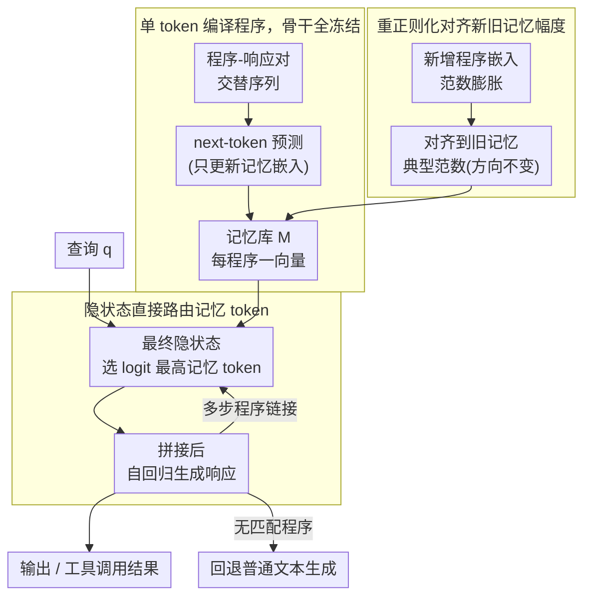

# TokMem: One-Token Procedural Memory for Large Language Models

**会议**: ICLR 2026  
**arXiv**: [2510.00444](https://arxiv.org/abs/2510.00444)  
**代码**: [https://github.com/MANGA-UOFA/TokMem](https://github.com/MANGA-UOFA/TokMem)  
**领域**: 信息检索  
**关键词**: 程序性记忆, 记忆 token, 持续学习, 上下文压缩, 工具调用

## 一句话总结

提出 TokMem，将可复用的任务程序编译为单个可训练记忆 token，既作为程序索引又作为生成控制信号，无需长 prompt 即可高效调用 1000+ 任务程序，且支持无遗忘的持续扩展。

## 研究背景与动机

- **长 prompt 的效率瓶颈**: 现代 LLM 依赖 prompt 控制行为，但长 prompt 构造成本高、自注意力平方级计算开销大、占用上下文窗口导致截断
- **检索增强的局限**: RAG 等方法虽外部化了 prompt，但检索内容仍以文本形式占用上下文窗口，且常用程序每次都需重新解读
- **认知科学启发**: 人类的程序性记忆（如骑自行车）通过练习编译为高效技能，无需每次重新读取陈述性知识
- **核心思想**: 将频繁使用的任务程序"压缩"存储到专用记忆 token 中，实现常量开销的程序调用

## 方法详解

### 整体框架

TokMem 想解决的是"长 prompt 复用难"这个老问题：现代 LLM 靠 prompt 控制行为，但每来一个查询都要把整段程序说明重新塞进上下文，既占窗口又带来平方级注意力开销。它的做法是把每个常用任务程序压缩进一个专属的可训练 token，让这个 token 同时扮演"程序索引"和"生成控制信号"两个角色。整条 pipeline 分三段：**训练时**把程序编译进 token——在词表里额外添加 $l$ 个特殊 token 构成记忆库 $M = [\bm{m}_1, \ldots, \bm{m}_l]^\top \in \mathbb{R}^{l \times d}$，每个 $\bm{m}_i$ 是一个可训练向量、对应一个唯一程序、没有文本形式，只更新这些嵌入而骨干 LLM 全程冻结；**推理时**模型从查询的隐状态直接路由出该用哪个记忆 token，把它喂回去自回归生成响应，多步任务还能链式预测下一个 token；**持续扩展时**用一步重正则化把新加入的记忆与旧记忆对齐，避免新程序压制旧程序。

### 关键设计

**1. 单 token 编译程序，骨干全冻结：把"读 prompt"换成"查一个向量"**

长 prompt 的根本痛点在于程序知识每次都以文本形式重新进上下文，既吃窗口又带来平方级注意力开销。TokMem 把训练序列组织成"查询 + 若干程序-响应对交替排列"的形式 $\bm{a} = (q_1, \ldots, q_k, a_{m_i}, a_{r_{i1}}, a_{r_{i2}}, \ldots, a_{m_j}, a_{r_{j1}}, \ldots)$，其中 $a_{m_i}$ 是记忆 token、$a_{r_{ij}}$ 是它该产生的响应 token。用标准的 next-token prediction 损失 $\mathcal{L}(\bm{a}; M) = -\sum_{i>k} \log \Pr(a_i \mid \bm{a}_{<i}; M)$ 训练，但梯度只回传到记忆嵌入，骨干 LLM 和原始 token 嵌入完全不动。这样一个程序的全部知识就被"编译"进了它那个向量里，调用时开销是常量级的，彻底绕开了长 prompt 的两个成本。

**2. 隐状态直接路由记忆 token：检索和生成共用同一套机制**

程序编译好之后还需要一个"该用哪个程序"的入口。TokMem 不另搭检索器，而是直接复用语言模型头：给定查询 $q$，从最终隐状态 $h_k$ 算出各记忆 token 的分布 $P(a_{m_i} \mid q) \propto \exp(\text{logit}(m_i \mid h_k))$，选 logit 最高的那个附到查询后得到 $[q; a_{m^*}]$，再自回归生成响应。因为记忆 token 既是索引又是控制信号，检索和生成是同一个动作的两面。这套机制天然支持两件事：一是多步程序链接——生成完一段响应后继续预测下一个记忆 token，就能在工具调用里依次串起 parse→search→format；二是优雅回退——当没有匹配程序时所有记忆 logit 都偏低，模型自动落回普通文本生成，不会被迫硬塞一个错误程序。

**3. 重正则化对齐新旧记忆幅度：让持续扩展不压制旧程序**

持续往记忆库里加新程序时会遇到一个具体故障：新训练的嵌入范数容易膨胀，在 softmax 路由里把旧记忆的 logit 系统性压低，造成隐性遗忘。TokMem 用一步后处理修正——对新增集合 $A$ 中的每个嵌入做 $\bm{m}_i \leftarrow \bm{m}_i \cdot \frac{\bar{n}_I}{\|\bm{m}_i\|_2 + \varepsilon}$，把它的模长拉到已有记忆的典型范数 $\bar{n}_I = \text{mean}_{j \in I} \|\bm{m}_j\|_2$ 上，而方向保持不变。只对齐幅度、不动方向，既消除了新嵌入对旧记忆的压制，又不破坏新程序已学到的语义，整步开销仅 $O(|A|d)$ 可忽略。配合"每个程序的知识完全隔离在各自 token 嵌入中"这一结构特性，新程序可以源源不断加入而不干扰已有程序，从而天然支持无灾难性遗忘的持续学习。

## 实验

### 原子记忆召回：Super-Natural Instructions（ROUGE-L）

| 模型 | 方法 | 10任务 | 200任务 | 1000任务 | 平均 |
|------|------|--------|---------|---------|------|
| Qwen 0.5B | RAG | 50.4 | 38.8 | 34.7 | 40.7 |
| Qwen 0.5B | Fine-Tuning | 52.4 | 40.6 | 43.2 | 45.2 |
| Qwen 0.5B | Replay Memory | 52.4 | 47.2 | 46.7 | 48.7 |
| Qwen 0.5B | **TokMem** | **52.8** | **49.3** | **50.0** | **50.7** |
| Llama 3.2 3B | RAG | 60.0 | 45.8 | 39.9 | 47.3 |
| Llama 3.2 3B | **TokMem** | **68.0** | **61.2** | **61.5** | **62.9** |
| Llama 3.1 8B | **TokMem** | **75.4** | **65.1** | **64.8** | **67.0** |

### 记忆路由准确率

| 方法 | 10任务 | 200任务 | 1000任务 |
|------|--------|---------|---------|
| Sentence-BERT (RAG) | 99.6 | 88.7 | 79.7 |
| TokMem (Qwen 0.5B) | 99.4 | 97.4 | 94.7 |
| TokMem (Llama 8B) | 99.8 | 98.9 | **97.5** |

### 组合记忆召回：工具调用（APIGen）

| 模型 | 方法 | 参数量 | 工具选择 Avg | 参数 F1 Avg |
|------|------|--------|-------------|-----------|
| Llama 1B | ICL | - | 16.4 | 0.4 |
| Llama 1B | RAG | - | 16.9 | 2.7 |
| Llama 1B | Fine-Tuning | 0.85M | 9.0 | 68.6 |
| Llama 1B | **TokMem** | **0.10M** | **86.2** | 68.9 |

### 关键发现

- TokMem 在 1000 任务时仍保持 94.7% 路由准确率（最小模型），远超 RAG 的 79.7%
- 训练效率极高：仅 10 个样本即可超越 RAG 的 500 样本性能
- 可训练参数量远少于 LoRA 微调（0.10M vs 0.85M），但性能相当或更优
- 持续学习中无灾难性遗忘，性能随任务增加仅缓慢下降
- 支持多步程序链接，在工具调用场景中可依次召回 parse→search→format

## 亮点

- **概念优雅**: 将程序性知识压缩为单个 token，认知科学和工程实现完美结合
- **参数隔离**: 每个程序独立存储，天然无遗忘，完美适配持续学习场景
- **极致高效**: 常量大小的记忆开销，消除了长 prompt 的平方级计算成本
- **路由准确率惊人**: 即使在 0.5B 模型上管理 1000 个任务也保持 94.7% 准确率

## 局限性

- 程序需要预先定义和训练，不支持零样本程序创建
- 单个 token 的信息容量有限，复杂程序可能无法完全编码
- 嵌入空间的容量上限未知——当程序数量极大时路由可能退化
- 重正则化是后处理操作，可能无法完全解决持续学习中的分布漂移
- 仅在 QA 和工具调用场景验证，对创意生成、长文本等任务的适用性未探索

## 相关工作

- **上下文工程**: CoT、RAG、MemGPT——均以文本扩展 prompt，占用上下文窗口
- **参数高效微调**: LoRA、Adapter——更新骨干参数，可能遗忘
- **软提示**: Prompt tuning、Prefix tuning——训练连续提示向量，但通常不建模为独立记忆单元
- **认知科学**: ACT-R 理论中的程序性记忆——技能通过练习编译为高效模块
- **TokMem**: 首次将 NLP 中的 token 化思想应用于程序性记忆管理

## 评分

| 维度 | 分数 |
|------|------|
| 创新性 | ★★★★★ |
| 理论深度 | ★★★☆☆ |
| 实验充分性 | ★★★★☆ |
| 实用价值 | ★★★★☆ |
| 写作质量 | ★★★★☆ |

<!-- RELATED:START -->

## 相关论文

- [\[ICLR 2026\] MLP Memory: A Retriever-Pretrained Memory for Large Language Models](mlp_memory_a_retriever-pretrained_memory_for_large_language_models.md)
- [\[ICLR 2026\] Expert Heads: Robust Evidence Identification for Large Language Models](expert_heads_robust_evidence_identification_for_large_language_models.md)
- [\[ICLR 2026\] Query-Level Uncertainty in Large Language Models](query-level_uncertainty_in_large_language_models.md)
- [\[ICLR 2026\] DeepRAG: Thinking to Retrieve Step by Step for Large Language Models](deeprag_thinking_to_retrieve_step_by_step_for_large_language_models.md)
- [\[ICML 2026\] Understand and Accelerate Memory Processing Pipeline for Large Language Model Inference](../../ICML2026/information_retrieval/understand_and_accelerate_memory_processing_pipeline_for_disaggregated_llm_infer.md)

<!-- RELATED:END -->
