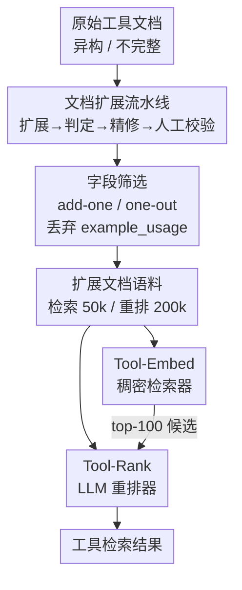

# Tools Are Under-Documented: Simple Document Expansion Boosts Tool Retrieval

**会议**: ICLR 2026  
**OpenReview**: [https://openreview.net/forum?id=g9D9MgG7iW](https://openreview.net/forum?id=g9D9MgG7iW)  
**代码**: https://github.com/EIT-NLP/Tool-REX  
**领域**: 信息检索 / 工具检索 / LLM Agent  
**关键词**: 工具检索, 文档扩展, 稠密检索, 重排器, OOD 泛化

## 一句话总结
本文指出工具检索的真正瓶颈不在检索模型而在「工具文档本身写得太烂」，于是用一条低成本 LLM 流水线把原始工具文档系统性地补全为带结构化字段（功能描述、何时使用、限制、标签）的扩展文档，构建出 TOOL-REX 基准与大规模训练语料，并训练出 Tool-Embed（稠密检索器）和 Tool-Rank（重排器），在 ToolRet 与 TOOL-REX 上把 N@10 推到 52.23/56.44 的新 SOTA。

## 研究背景与动机
**领域现状**：随着 LLM 工具调用（tool learning / tool-augmented agents）成为主流范式，工具检索——从成千上万个 API 里挑出与用户 query 最相关的工具——成了整条工具使用链路的「入口」。社区为此建了 ToolBench、ToolACE、MetaTool、ToolRet 等一系列基准，并尝试用各种 query/文档扩展手段去提升检索效果。

**现有痛点**：用户 query 往往含糊、欠规范，与工具那套正式、技术化的文档之间存在持续的「语义鸿沟」（semantic gap），低语义重叠让检索模型很吃力，尤其在 OOD query 上。现有方法如 Re-Invoke（给文档加 LLM 生成的伪 query）、EASYTOOL（把冗长文档重构成标准简洁形式）、MassTool（多任务检索）、ScaleMCP（动态加权文档片段）——它们都在「绕开」差文档这个问题，而不是从源头修好它。

**核心矛盾**：作者的核心论断是，poor performance 的根因被大家忽略了——**工具文档本身就是有缺陷的**：一方面缺乏标准化（ToolRet 里同一类功能能找到至少 7 种不同写法），另一方面信息不完整（缺少明确的「何时使用」场景、操作限制等关键上下文），有的数据集甚至连基础的 description 字段都没有。这个底层的数据问题给所有模型设了一个性能天花板。

**本文目标**：与其继续在模型侧打补丁，不如直接从数据侧把工具文档「修好」——让文档完整、标准、富含检索友好的语义信号。

**切入角度**：用 LLM 把原始文档「扩展」成结构化档案，且这个扩展是 query 无关（query-agnostic）、严格 grounded 在原文上的，既能直接提升现有 baseline，又能产出大规模训练语料去训练专用检索/重排模型。

**核心 idea**：与其改检索模型去迁就烂文档，不如用一条低成本 LLM 流水线把工具文档补全为带结构化字段的扩展文档，把「数据」修好，检索性能自然上去。

## 方法详解

### 整体框架
TOOL-REX 建立在 ToolRet 之上（35 个工具使用数据集、7,615 个检索任务、43,215 个唯一工具，分 Web/Code/Customized 三类）。整套方法可以拆成两半：前半段是「把文档修好」——一条四阶段流水线把每个原始工具文档 $d_{\text{original}}$ 扩展成结构化档案 $d_{\text{profile}}$，再与原文合并成扩展文档 $d_{\text{expansion}} = d_{\text{original}} \cup d_{\text{profile}}$；其中扩展出哪些字段、保留哪些字段由一套 add-one/one-out 字段贡献分析决定。后半段是「用修好的文档训练专用模型」——基于扩展语料（检索 50k、重排 200k，且训练只用 Web 类工具，Code/Customized 留作严格 OOD 评测），训练稠密检索器 Tool-Embed 和重排器 Tool-Rank，构成「先召回、再重排」的两阶段工具检索系统。

### 关键设计

**1. 文档扩展流水线：用「中模型生成 + 强模型把关」低成本修好工具文档**

针对「文档异构 + 不完整」这个根因，作者设计了一条四阶段流水线，核心思路是用便宜的中等模型做主力生成、用更强模型只对少数不合格样本兜底，从而在成本和质量间取得平衡。**第一阶段扩展**：用 Qwen3-32B（开启 reasoning 模式）把原始文档扩展成结构化档案，产出五个字段——`function_description`（核心功能摘要）、`tags`（作为检索关键词的概念/类别标签）、`when_to_use`（真实使用场景）、`limitations`（输入输出限制、领域约束）、`example_usage`（可从文档推出的 API 调用示例）。其中 `function_description` 和 `tags` 始终必填，其余三个仅在原文明确支持时才生成，整个扩展严格 grounded 在原文、不引入未支持内容。**第二阶段判定**：先用规则检查档案非空且为合法 JSON，再用 LLaMa-3.1-70B 作语义裁判，逐字段核验是否忠实于原文，杜绝幻觉。**第三阶段精修**：只对没通过判定的约 1.5%（约 600 条）样本，用更强的 GPT-4o 复用第一阶段的 prompt 重新生成。**第四阶段人工校验**：随机抽 100 条精修档案人工核对忠实度、无幻觉字段、语义一致性，全部通过。扩展后文档平均从 131.72 token 增长到 177.61 token（profile 平均 45.89 token）。

**2. 字段筛选：用 add-one / one-out 证明「更长不等于更好」，砍掉 example_usage**

把字段全部加进文档不是免费的——更长的输入会稀释显著信号、在 token 预算下还可能被截断。为量化每个字段的真实贡献，作者设计了两套互补协议：**Add-One** 从原始文档出发，每次只加入一个生成字段，测性能增量；**One-Out** 从完整扩展文档出发，每次只移除一个字段再评测。在稠密检索器 GritLM 和稀疏检索器 BM25 上都用 nDCG@10 度量，得到两个一致结论：其一，全字段扩展并非最优——One-Out 里移除 `example_usage` 反而拿到更高的 N@10；其二，`example_usage` 在 Add-One 里增益最小（甚至为负），而 `function_description` 和 `tags` 在 Add-One 里中性偏正、在 One-Out 里移除会明显掉点。基于此，最终检索用的扩展档案**丢弃 example_usage，只保留 function_description、when_to_use、limitations、tags 四个字段**。这一步把「LLM 扩展未必越多越好」这个隐患落到了可验证的字段级决策上。

**3. Tool-Embed：用扩展语料训练的工具专用稠密检索器**

针对工具检索缺少专用稠密模型的现状，作者以 Qwen3-Embedding-0.6B / 4B 为底座，在 50k 扩展训练对上用 ms-swift 框架、InfoNCE 损失全参微调一个 epoch（DeepSpeed ZeRO-3），每个 query–tool 正对从其他 query 随机采 5 个工具作负样本。关键在于训练数据**只来自 Web 类**（APIGen + ToolBench），Code 和 Customized 类工具训练时从未出现，从而构成真正的 OOD 评测——逼模型学到可迁移的语义表示而非记住训练域的表面模式。结果 Tool-Embed-4B 在 TOOL-REX 上达到 N@10=52.23、R@10=63.13、C@10=51.61 的检索 SOTA，且 0.6B 版本就已超过最多 8B 参数的 baseline。

**4. Tool-Rank：把重排建模成 true/false 二分类的 LLM 重排器**

第二阶段重排以 Qwen3-Reranker-4B 为底座，用 LLaMA-Factory 做 LoRA 微调（rank $r=32$、$\alpha=64$、dropout 0.1），在 200k 扩展重排语料上以交叉熵训一个 epoch。评测时 Tool-Rank 接收一个 query–文档对、被 prompt 输出该文档是否相关，单次前向得到 `true`/`false` 两个 token 的 logits，归一化为相关概率：

$$P(\text{relevant} \mid q, d) = \frac{\exp(\ell_{\text{true}})}{\exp(\ell_{\text{true}}) + \exp(\ell_{\text{false}})}$$

该概率即重排分。Tool-Rank 对 Tool-Embed-4B 召回的 top-100 候选重排，把 N@10 进一步从 52.23 推到 56.44（+4.21），R@10 到 67.81、C@10 到 56.60，全面刷新 TOOL-REX 重排 SOTA。

### 损失函数 / 训练策略
- **Tool-Embed**：InfoNCE 对比损失，每正对随机采 5 个域外负样本，全参微调 1 epoch，底座 Qwen3-Embedding-0.6B/4B。
- **Tool-Rank**：交叉熵 + LoRA（$r=32$, $\alpha=64$, dropout 0.1），1 epoch，底座 Qwen3-Reranker-4B；推理用 true/false logits 归一化为相关分。
- 所有实验在 2×A100（80GB）上完成；为隔离扩展效果，还在去掉 `tool_profile` 字段的等量语料上训了 Tool-Embed$_{\text{original}}$ / Tool-Rank$_{\text{original}}$ 作对照。

## 实验关键数据

### 主实验
在 ToolRet 与 TOOL-REX 两个基准上对比 12 个代表性检索/重排模型，三大 IR 指标：N@10（NDCG）、R@10（Recall）、C@10（Completeness，top-K 含全部目标工具记 1 否则 0）。

| 基准 | 模型 | N@10 | R@10 | C@10 |
|------|------|------|------|------|
| TOOL-REX | Qwen3-Embedding-8B（先前强 baseline） | 46.23 | 56.83 | 46.70 |
| TOOL-REX | Tool-Embed-0.6B（本文） | 48.10 | 59.16 | 47.81 |
| TOOL-REX | **Tool-Embed-4B（本文，检索 SOTA）** | **52.23** | **63.13** | **51.61** |
| TOOL-REX | + Qwen3-Reranker-4B 重排 | 53.43 | 64.97 | 52.55 |
| TOOL-REX | **+ Tool-Rank-4B 重排（本文，最终 SOTA）** | **56.44** | **67.81** | **56.60** |

相对 MTEB 开源 SOTA，最终成绩 N@10/R@10/C@10 分别 +10.23/+10.29/+9.08。

### 消融实验
核心消融是「扩展训练 vs 非扩展训练」（去掉 `tool_profile` 字段、其余完全一致），以 Qwen3-Embedding-0.6B（43.13 N@10）为参照。

| 配置 | N@10 增益 | 说明 |
|------|-----------|------|
| Tool-Embed$_{\text{original}}$-0.6B / 4B | +3.69 / +3.67 | 非扩展训练 |
| Tool-Embed-0.6B / 4B（扩展训练） | +4.97 / +6.69 | 扩展训练增益明显更大，且 4B 拉开差距 |
| Tool-Rank$_{\text{original}}$-4B | +2.00 | 非扩展重排 |
| Tool-Rank-4B（扩展训练） | +4.21 | 扩展重排增益翻倍（达 56.44） |

字段级消融（add-one/one-out）显示：`example_usage` 增益最小甚至为负 → 被剔除；`function_description`、`tags` 贡献最大。

### 关键发现
- **扩展是有效的训练信号**：即使在「测试文档未扩展」的原始 ToolRet 上评测，扩展训练的模型仍优于非扩展训练的对照，说明训练时见过标准化、富信息的字段能提升对异构文档的泛化，而非只在扩展文档上吃红利。
- **OOD 泛化成立**：训练只用 Web 类，但在从未见过的 Code/Customized 类上仍稳超所有 baseline，证明模型学到的是可迁移语义而非训练域表面特征。
- **评测期的「相似度稀释」反而有利**：扩展让正负样本的绝对相似度都下降（语义被长度稀释），但下降是**不对称的**——正样本几乎不降（Web −0.0014），负样本降得多（Customized 负样本 −0.0152），于是正负更可分、排序更准。
- **字段不是越多越好**：`example_usage` 拖累性能被砍，验证了「LLM 文档扩展是把双刃剑」，需要字段级筛选。

## 亮点与洞察
- **把矛头指向「数据」而非「模型」**：大量工作在检索模型/query 改写上卷，本文反其道证明真正天花板在文档质量，这种「修源头」的 data-centric 视角是最大的「啊哈」点，且结论可迁移到任何 RAG/检索场景——文档质量决定上限。
- **add-one/one-out 字段贡献分析很实用**：它把「LLM 扩展该保留什么」从拍脑袋变成可量化的字段级实验，发现 example_usage 有害这一反直觉结论，是可复用的方法学。
- **不对称相似度稀释的解释优雅**：扩展让绝对分都降，但负样本降更多 → 可分性提升，这套分析给「为什么更长文档反而更好检索」提供了机制级证据。
- **低成本流水线设计可借鉴**：中模型主力生成 + 强模型只兜底 1.5% 失败样本，是性价比很高的大规模数据合成范式。

## 局限与展望
- **依赖 LLM 扩展质量**：扩展严格 grounded 在原文，意味着原文本身极度贫乏（如连 description 都没有）时，能补全的有效信息有限，扩展也救不回来。
- **字段集是人工 + 实验选定的**：function/when-to-use/limitations/tags 这套字段未必对所有领域最优，跨领域是否需要不同字段集仍待验证。
- **评测仍局限于 ToolRet 体系**：35 个数据集虽广，但都源自既有工具使用基准，真实生产环境中不断演化、文档风格更杂的工具是否同样受益尚需检验。
- **扩展带来文档变长**：平均 +35% token，在严格 token 预算或超大工具库下的检索成本与截断风险需要权衡。

## 相关工作与启发
- **vs Re-Invoke**：Re-Invoke 给文档加 LLM 生成的伪 query 并抽取潜在意图，仍是「围着烂文档打转」；本文直接重写文档结构、补全缺失信息，从源头修数据。
- **vs EASYTOOL**：EASYTOOL 把冗长文档重构成简洁标准形式（做减法/规整），本文则系统性补全 when-to-use、limitations 等缺失字段（做加法/补全），并配套训练专用模型。
- **vs MassTool / ScaleMCP**：它们分别从多任务检索、动态加权文档片段的角度优化检索过程；本文不改检索机制，而是改输入文档质量，证明数据侧改造的增益可叠加在各类检索器（稀疏 BM25、稠密 GritLM/Qwen3）之上。

## 评分
- 新颖性: ⭐⭐⭐⭐ 「问题在文档不在模型」的 data-centric 视角清晰，但文档扩展本身是已有思路的系统化。
- 实验充分度: ⭐⭐⭐⭐⭐ 12 个基线、双基准、字段级 add-one/one-out、扩展 vs 非扩展对照、OOD 评测、相似度分析齐全。
- 写作质量: ⭐⭐⭐⭐ 论证链条清楚，流水线与字段分析讲得明白。
- 价值: ⭐⭐⭐⭐ 提供 TOOL-REX 基准 + 两套训练语料 + 两个 SOTA 模型，对工具检索社区是扎实的基础设施。

<!-- RELATED:START -->

## 相关论文

- [\[ICLR 2026\] Frustratingly Simple Retrieval Improves Challenging, Reasoning-Intensive Benchmarks](frustratingly_simple_retrieval_improves_challenging_reasoning-intensive_benchmar.md)
- [\[ICLR 2026\] RefTool: Reference-Guided Tool Creation for Knowledge-Intensive Reasoning](reftool_reference-guided_tool_creation_for_knowledge-intensive_reasoning.md)
- [\[ICLR 2026\] Retro*: Optimizing LLMs for Reasoning-Intensive Document Retrieval](retro_optimizing_llms_for_reasoning-intensive_document_retrieval.md)
- [\[CVPR 2025\] ChatHuman: Chatting about 3D Humans with Tools](../../CVPR2025/information_retrieval/chathuman_chatting_about_3d_humans_with_tools.md)
- [\[NeurIPS 2025\] SuperCLIP: CLIP with Simple Classification Supervision](../../NeurIPS2025/information_retrieval/superclip_clip_with_simple_classification_supervision.md)

<!-- RELATED:END -->
