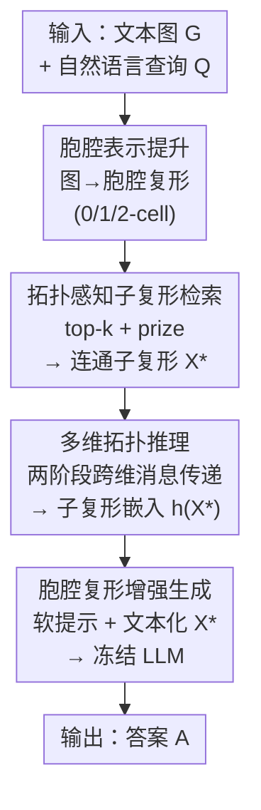

# 推理的拓扑结构：用检索到的胞腔复形增强生成解决文本图问答

**会议**: ICLR 2026  
**OpenReview**: [https://openreview.net/forum?id=TiX4Oz0PrQ](https://openreview.net/forum?id=TiX4Oz0PrQ)  
**代码**: https://github.com/Snnzhao/TopoRAG  
**领域**: 信息检索 / GraphRAG / 知识图谱问答  
**关键词**: 检索增强生成, 文本图问答, 胞腔复形, 拓扑深度学习, 高维结构

## 一句话总结
TopoRAG 把文本图"提升"成胞腔复形（cell complex），让节点、边、环分别成为 0/1/2-cell，再用拓扑感知的子复形检索 + 多维消息传递把含环的高阶依赖喂给 LLM，从而在三个图问答数据集上稳定超过 G-Retriever、SubgraphRAG 等 GraphRAG 基线。

## 研究背景与动机

**领域现状**：检索增强生成（RAG）通过动态检索外部知识来缓解大模型幻觉、增强事实性。针对结构化数据，GraphRAG 把检索对象从文档扩展到图元素——G-Retriever 把检索建模成 Prize-Collecting Steiner Tree（PCST）来抽紧凑子图，GNN-RAG、SubgraphRAG 则各自设计专门的子图检索模块。

**现有痛点**：这些方法几乎都只在**低维结构**上操作——把节点当作实体（0 维）、把边或路径当作成对/序列关系（1 维），唯独**忽略了环（cycle）**。但很多问题的答案恰恰藏在闭环里：例如"和地板同材质、且垫子正躺在其上的那件家具叫什么"，这种查询需要把空间关系和材质一致性绑在一个闭合关系回路上推理，光靠节点和边根本解不出来。

**核心矛盾**：环代表的是图的**一阶同调**（first homology）信息，是天然的高维拓扑特征；而主流 GraphRAG 的检索单元（节点、边、路径、子树）在表达能力上封顶在 1-skeleton，结构上就装不下"独立环"这一维度的依赖。近期对 LLM 推理过程的实证研究还观察到：更强的推理行为往往伴随类似环结构的循环依赖模式，这进一步暗示有效推理本质上依赖非线性的关系组织。

**本文目标**：让检索和推理都显式地把环这类高维拓扑结构纳入进来——既要在检索阶段选出与查询相关的环，又要在推理阶段让不同维度的胞腔之间互相传递信息。

**切入角度**：作者借用代数拓扑里的**正则胞腔复形（regular cell complex）**作为统一容器：图本身是 1 维复形（点=0-cell，边=1-cell），只要沿着每个"基本环"贴上一张二维圆盘（2-cell），就得到一个能同时承载 0/1/2 维结构的复形。

**核心 idea**：把文本图提升成胞腔复形，用"高维 PCST"检索含环的子复形，再用跨维度消息传递把拓扑上下文压成一个软提示注入 LLM——即"用胞腔复形代替子图，把环显式带进 RAG"。

## 方法详解

### 整体框架
TopoRAG 要解决的是"GraphRAG 看不见环"的问题，整条流水线把一张带文本属性的图变成 LLM 能消化的、含高维拓扑上下文的提示。它由四个串行模块组成：先把图**提升**成胞腔复形（0/1/2-cell 都有嵌入），再做**拓扑感知子复形检索**选出与查询最相关的一小撮胞腔，接着用**多维拓扑推理**在这些胞腔间做两阶段消息传递得到一个子复形嵌入，最后**胞腔复形增强生成**把这个嵌入当软提示、连同子复形的文本化串一起喂给冻结的 LLM 生成答案。整个过程只训练软提示 / MLP 投影 / 子复形编码器，LLM 主体保持冻结（或可选 LoRA 微调）。

### 关键设计

**1. 胞腔表示提升：把图抬高一维，让环成为可检索的实体**

这一步直接针对"主流方法只有 0/1 维元素"的痛点。给定文本图 $G=(V,E,\{t_n\},\{t_e\})$，先把它看成 1 维复形：每个顶点是 0-cell，每条边是 1-cell，构成 1-skeleton $X^{(1)}=X^{(0)}\cup\{x^1_{(u,v)}\mid(u,v)\in E\}$；节点和边的属性文本各自过一个预训练 LM（如 SentenceBERT）得到嵌入 $z^0_v=\mathrm{LM}(t_v)$、$z^1_{(u,v)}=\mathrm{LM}(t_{(u,v)})$。关键的高维化在于**怎么找出环并贴 2-cell**：作者固定一棵生成树 $T\subseteq G$，做商映射 $\gamma:G\to G/T$ 把整棵树收缩成一个点，于是每条**非树边** $e\in E\setminus T$ 都和它在树上的唯一路径围成一个"基本环（fundamental cycle）"，沿这个环贴一张圆盘 $D^2$ 即得一个 2-cell，全体 2-cell 为 $X^{(2)}=\{x^2_e\simeq D^2\mid e\in E\setminus T\}$。

为什么这样有效？论文用两个命题给出了拓扑保证：$G/T$ 与 $G$ 同伦等价、$\gamma$ 在一阶同调群 $H_1(G;\mathbb{Z})$ 上诱导同构（收缩无环的生成树不会破坏任何环）；并且非树边的数量恰好等于圈秩 $\beta_1(G)=|E|-|V|+1$，这些基本环构成 $H_1(G)$ 的一组**基**，能张成图里所有独立环。换句话说，2-cell 不是随意加的，它们是图的全部独立循环依赖的一个简洁拓扑摘要——任何环都能由它们线性组合表示。每个胞腔 $x_\sigma$ 除了文本嵌入还配一个 $d$ 维拓扑描述子 $z^d_\sigma$，为下一步按维度检索做准备。

**2. 拓扑感知子复形检索：把 PCST 推广到高维，按环的"奖赏"选子复形**

提升之后候选胞腔变多，需要选出与查询相关的一小块。作者先把查询编码 $z_q=\mathrm{LM}(x_q)$，对 0-cell 和 1-cell 按余弦相似度取 top-k：$X^{(d)}_k=\mathrm{TopK}_{x^d}\cos(z_q,z^d_{x^d})$（$d\in\{0,1\}$）。难点是 2-cell 没法直接和查询比相似度，于是引入**奖赏（prize）机制**：被选中的 0/1-cell 按排名 $r$ 赋予递减奖赏 $\mathrm{prize}(x_i)=k-r$；每个 2-cell 的奖赏由它的边界胞腔奖赏聚合而来并扣掉尺寸惩罚：

$$\mathrm{prize}(x^2)=\sum_{d\in\{0,1\}}\sum_{x^d\in\partial_d x^2}\mathrm{prize}(x^d)-\mathrm{cost}(x^2),\quad \mathrm{cost}(x^2)=|\partial_1 x^2|\cdot C_2,$$

即一个环包含的高分点/边越多就越值得选，但环越大（边界 1-cell 越多）惩罚越重。最终子复形 $X^*$ 在"连通"约束下最大化总奖赏减尺寸惩罚 $X^*=\arg\max_{X'\subseteq X,\,X'\text{ connected}}\sum_d\sum_{x^d\in X'^{(d)}}\mathrm{prize}(x^d)-\mathrm{cost}(X')$，并强制**边界一致性**：选中的 2-cell 其全部边界 0/1-cell 也必须在 $X^*$ 里，保证拓扑自洽。

这正是把 G-Retriever 用的 PCST 从"树"推广到"高维胞腔复形+多维奖赏+尺寸惩罚"。作者采用近线性时间近似算法求解连通最优子复形，既保住了效率又保证了拓扑有效性——和只能抽子树/子图的旧检索器相比，它能整块地把"和查询相关的环"作为一等公民检索出来。

**3. 多维拓扑推理：两阶段消息传递，让高维结构信息流回低维**

检索出的子复形 $X^*=X^{*(0)}\cup X^{*(1)}\cup X^{*(2)}$ 还只是一堆带嵌入的胞腔，需要让信息在维度间流动才能形成结构化上下文。作者设计**两阶段消息传递**：第一阶段在 1-skeleton 上跑 $L$ 跳，对 0-cell 和 1-cell 同时聚合来自**面（face）**和**余面（coface）**的消息——$m^{l+1}_F(x)=\mathrm{AGG}_{y\in F(x)}M_F(h^l_x,h^l_y)$、$m^{l+1}_C(x)=\mathrm{AGG}_{z\in C(x)}M_C(h^l_x,h^l_z)$，再用 $\mathrm{UPDATE}$ 融合；第二阶段让所有维度的胞腔通过**共享余面**与高维邻居交换信息 $h^{L+1}_x=\mathrm{UPDATE}(h^L_x,m^L_F,m^L_C,m^{L+1}_\uparrow)$，其中 $m^{L+1}_\uparrow(x)=\mathrm{AGG}_{w\in N_\uparrow(x)}M_\uparrow(h^L_x,h^L_w,h^{L+1}_{x\cup w})$ 专门把 2-cell 携带的高维结构信息回传给它的边界点和边。

为什么需要两阶段？因为如果只在 1-skeleton 上传消息（等价于普通 GNN），2-cell 编码的环约束就传不下来；第二阶段的"上邻接（upper adjacency）"恰好是胞腔复形相对普通图的额外结构通道，让闭环依赖能影响到环上每个节点的表示。最后对所有胞腔嵌入做池化 $h_{X^*}=\mathrm{POOL}(\{h^{L+1}_x\})$（如 mean pooling），得到一个同时编码语义属性与多维拓扑上下文的子复形向量。消融里把 MTR 换成普通 GCN 会明显掉点，正是因为 GCN 丢掉了这条高维→低维的信息通路。

**4. 胞腔复形增强生成：软提示 + 文本化双路注入 LLM**

最后把拓扑上下文交给 LLM。作者走双路：一路把子复形嵌入 $h_{X^*}$ 过 MLP 对齐到 LLM 隐空间得到 $\hat h_{X^*}=\mathrm{MLP}_\phi(h_{X^*})$，当作**软提示**提供拓扑层面的结构指引；另一路把子复形按结构层次展平成文本 $\mathrm{textualize}(X^*)$，和查询拼接后过冻结的文本嵌入层 $h_t=\mathrm{TextEmbedder}([\mathrm{textualize}(X^*);x_q])$，借 LLM 自身的文本推理能力。答案自回归生成 $p_{\theta,\phi}(Y\mid X^*,x_q)=\prod_i p_{\theta,\phi}(y_i\mid y_{<i},[\hat h_{X^*};h_t])$，其中 $\theta$（LLM 主体）冻结、只有 $\phi$（MLP 与子复形编码器）可训，梯度经 $\hat h_{X^*}$ 回传，使编码器学会产出对生成最有用的拓扑嵌入。这套软提示+文本化的注入沿用了 G-Retriever 的范式，区别在于喂进去的是带环的多维拓扑表示而非普通子图。

### 损失函数 / 训练策略
训练目标是最大化标准答案 $A^*$ 的条件似然 $\max_{P_e}\log p_\theta(A^*\mid[P_e;Q;X^*])$，prompt-tuning 设定下只更新软提示参数、LLM 冻结；可选 LoRA 设定下额外用低秩适配微调 LLM。主干 LLM 用 Llama-2-7B；检索 top-k 在 WebQSP 上 0/1-cell 取 $k=3$，2-cell 在 $\{0,1,2,3\}$ 上扫；推理层数 $L\in\{2,3,4,5\}$、各层统一 1024 维。LoRA 用 rank=8/alpha=16/dropout=0.05，prompt-tuning 用 10 个虚拟 token，最大输入 512 token、最多生成 32 token，AdamW、学习率 $1\times10^{-5}$、batch 8、训 10 epoch 早停（patience=2）。

## 实验关键数据

### 主实验
三个数据集：ExplaGraphs、SceneGraphs（指标 Accuracy）、WebQSP（指标 Hit），按推理-only / 冻结 LLM+prompt-tuning / LoRA 微调三组对比。

| 设定 | 方法 | ExplaGraphs (Acc) | SceneGraphs (Acc) | WebQSP (Hit) |
|------|------|------|------|------|
| Frozen+PT | G-Retriever | 0.8516 | 0.8131 | 70.49 |
| Frozen+PT | SubgraphRAG | 0.8535 | 0.8074 | 86.61 |
| Frozen+PT | **TopoRAG** | **0.8899** | **0.8362** | **87.10** |
| Tuned (LoRA) | G-Retriever w/ LoRA | 0.8705 | 0.8683 | 73.79 |
| Tuned (LoRA) | GNN-RAG | 0.8466 | 0.8149 | 85.70 |
| Tuned (LoRA) | **TopoRAG w/ LoRA** | **0.9151** | **0.8768** | **90.66** |

相比各设定下的最强基线，TopoRAG 在 ExplaGraphs / SceneGraphs / WebQSP 上分别提升约 5.12% / 0.98% / 4.67%（p<0.01 显著）。一个值得注意的现象：所有 prompt-tuning 方法都超过推理-only 基线，说明结构化上下文本身有用；而 TopoRAG 通过把提示锚定在高维拓扑依赖上进一步拉开差距，尤其在涉及多跳和环依赖的查询上。

### 消融实验
| 配置 | ExplaGraphs (Acc) | WebQSP (Hit) | 说明 |
|------|------|------|------|
| w/o CRL | 0.8576 | 84.96 | 胞腔提升换成纯边图结构 |
| w/o TSR | 0.8524 | 84.23 | 拓扑检索换成最短路检索 |
| w/o MTR | 0.8611 | 85.46 | 多维推理换成普通 GCN |
| **TopoRAG (full)** | **0.9151** | **90.66** | 完整模型 |

三个模块拿掉任意一个都明显掉点，其中 **TSR 影响最大**（WebQSP 掉到 84.23）：把拓扑感知检索换成最短路检索会把结果限制在 1-skeleton、彻底丢掉 2-cell 和闭环约束。CRL 换成纯边图同样大幅下降，印证了"显式建模高维结构"的必要性。

### 关键发现
- **环检索是性能主力**：三个消融里 w/o TSR 掉得最狠，说明"能不能把和查询相关的环作为整体检索出来"比单纯加拓扑嵌入更关键。
- **层数 $L$ 有甜点**：$L$ 增大推理能力上升，但过深会过拟合、表达力反降，需在 $\{2,3,4,5\}$ 里折中。
- **2-cell top-k 适中最好**：$k$ 太小信息缺失、太大引入噪声，moderate $k$ 在结构覆盖与噪声间取得平衡。
- **SceneGraphs 提升相对小（0.98%）**：场景图本身已较稠密、基线已很强（G-Retriever w/ LoRA 0.8683），高维结构带来的边际收益不如以多跳/环为主的 WebQSP 明显。

## 亮点与洞察
- **把代数拓扑的"基本环=同调基"落到 RAG 检索单元上**：用生成树 + 商映射枚举基本环，既有 $\beta_1=|E|-|V|+1$ 个环恰为 $H_1$ 基的理论保证，又给"该检索哪些环"提供了简洁可计算的依据，这个映射很优雅。
- **PCST → 高维 PCST 的推广**：G-Retriever 用 PCST 抽树，本文把奖赏和惩罚扩展到 2-cell、并加边界一致性约束，使检索器天然支持"按环打分"，是把经典组合优化复用到新结构上的好例子。
- **两阶段消息传递里的"上邻接"通道可迁移**：第二阶段让 2-cell 把闭环信息回传给边界点/边，这条高维→低维通路本质上是 cellular/simplicial 网络的核心，可迁移到任何"需要让高阶结构影响低阶表示"的图任务（如分子环系、社交三角闭包）。

## 局限与展望
- **只建模到 2-cell（环）**：方法框架理论上支持更高维胞腔，但实验只用到 0/1/2 维；三维及以上的高阶依赖是否有用、能否高效枚举未验证。
- **依赖生成树选择**：基本环集合随生成树不同而变（虽同调类不变），不同生成树对检索质量的实际影响论文未做敏感性分析。
- **规模与骨干受限**：只在 Llama-2-7B 上验证，三个数据集规模有限；胞腔提升+两阶段消息传递在大图上的内存/时间开销（2-cell 数量随圈秩增长）值得关注。
- **改进思路**：可探索动态/可学习的环选择（而非固定生成树）、把拓扑描述子换成更强的持续同调特征、以及在更大 LLM 与更长上下文下评估文本化子复形的收益上限。

## 相关工作与启发
- **vs G-Retriever**：两者都用 PCST + 软提示+文本化注入 LLM；G-Retriever 只抽**子树/子图**（停在 1-skeleton），TopoRAG 把检索单元升到含 2-cell 的胞腔复形、显式带进环依赖。优势是能解闭环查询，代价是要做胞腔提升和高维消息传递。
- **vs SubgraphRAG**：SubgraphRAG 靠轻量三元组打分 + 距离编码做高效子图检索，仍是低维元素；TopoRAG 在 WebQSP 上从 86.61→87.10（冻结）、并在 LoRA 设定下到 90.66，靠的是高维结构而非更精细的低维打分。
- **vs GNN-RAG**：GNN-RAG 用 GNN 表示选子图、消息传递限于普通图；TopoRAG 的 MTR 是 cellular 复形上的两阶段传递，多了高维→低维的上邻接通路，消融显示把 MTR 退化成 GCN 会掉点。

## 评分
- 新颖性: ⭐⭐⭐⭐⭐ 首次把胞腔复形/高维拓扑显式引入 GraphRAG，环作为一等检索单元的思路新颖且有同调理论支撑。
- 实验充分度: ⭐⭐⭐⭐ 三数据集 + 三设定 + 完整消融 + 超参分析到位，但骨干单一、数据集规模与高维（>2-cell）验证有限。
- 写作质量: ⭐⭐⭐⭐ 框架清晰、命题给出拓扑保证；少量符号（face/coface、上邻接）对不熟拓扑的读者门槛偏高。
- 价值: ⭐⭐⭐⭐ 为 GraphRAG 打开"高维结构"这一维度，方法和高维 PCST、cellular 消息传递通路都可迁移。

<!-- RELATED:START -->

## 相关论文

- [\[ICLR 2026\] Reusing Pre-training Data at Test Time is a Compute Multiplier](reusing_pre-training_data_at_test_time_is_a_compute_multiplier.md)
- [\[ICLR 2026\] Hybrid Deep Searcher: Scalable Parallel and Sequential Search Reasoning](hybrid_deep_searcher_scalable_parallel_and_sequential_search_reasoning.md)
- [\[ICLR 2026\] When to use Graphs in RAG: A Comprehensive Analysis for Graph Retrieval-Augmented Generation](when_to_use_graphs_in_rag_a_comprehensive_analysis_for_graph_retrieval-augmented.md)
- [\[ICLR 2026\] Frustratingly Simple Retrieval Improves Challenging, Reasoning-Intensive Benchmarks](frustratingly_simple_retrieval_improves_challenging_reasoning-intensive_benchmar.md)
- [\[ICLR 2026\] FrugalRAG: Less is More in RL Finetuning for Multi-hop Question Answering](frugalrag_less_is_more_in_rl_finetuning_for_multi-hop_question_answering.md)

<!-- RELATED:END -->
