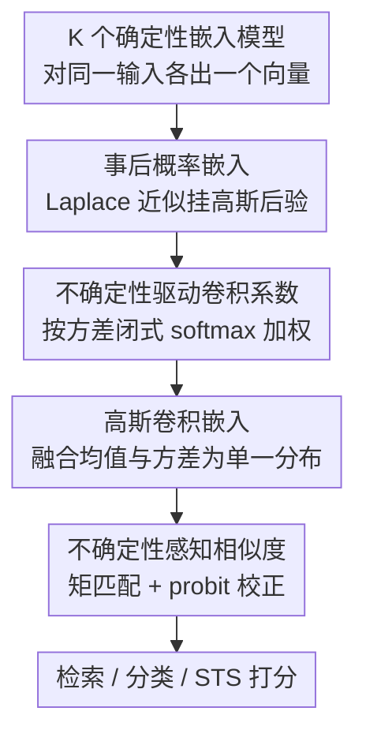

# Uncertainty-driven Embedding Convolution

**会议**: ICLR 2026  
**OpenReview**: [https://openreview.net/forum?id=7fdcVi2fTJ](https://openreview.net/forum?id=7fdcVi2fTJ)  
**代码**: https://github.com/MLAI-Yonsei/UEC  
**领域**: 信息检索 / 文本嵌入 / 不确定性建模  
**关键词**: 嵌入集成, 概率嵌入, Laplace 近似, 不确定性感知, 检索

## 一句话总结
UEC 把多个预训练文本嵌入模型 **事后（post-hoc）** 转成高斯概率嵌入，再按每个模型对当前 query 估计出的不确定性自适应加权融合，并用一个内置方差的相似度函数打分，在检索、分类、STS 上稳定超过均匀/加权集成与模型合并等基线。

## 研究背景与动机
**领域现状**：文本嵌入是现代 NLP 流水线的核心模块，支撑相似度、检索、QA、分类等任务。业界已有大量嵌入模型（BERT、E5、BGE、GTE…），但它们在不同任务/语言/领域上各有所长，**没有一个模型能全面称王**。于是很自然地想到把多个嵌入"集成"起来取长补短。

**现有痛点**：在表示层做集成（直接融合输出向量）比在参数层做模型合并更通用，但主流集成方法——均匀平均、固定加权——都把每个嵌入当成**同等可靠的确定性向量**，完全不考虑某个模型对当前输入到底"有没有把握"。论文用 "jaguar" 这个例子说明：当一个模型把它理解成"动物"、另一个理解成"汽车"时，均匀平均会把两种冲突语义平均到一起，直接导致检索失败。

**核心矛盾**：确定性集成丢掉了"模型自身可靠性/不确定性"这一关键信息。在某些模型校准很差、或与目标任务不匹配时，盲目等权融合反而会被不可靠的嵌入拖累，表现既次优又不稳定。

**本文目标**：让集成系数**随 query 自适应**——对当前输入越不可靠的模型，权重越低；同时让相似度打分本身也能反映嵌入的不确定性；而且整套机制要**事后、免重训**，能直接套在任意现成嵌入模型上。

**切入角度**：作者把"不确定性"形式化为嵌入的**方差**。只要能把一个确定性嵌入升级成高斯分布（均值 + 方差），就能用方差大小度量可靠性，并用高斯的良好数学性质（线性组合仍是高斯）做闭式推导。

**核心 idea**：用 **Laplace 近似**事后给每个嵌入模型挂上高斯后验，再在嵌入空间做 **高斯卷积**——权重由各模型方差经一个 surrogate loss 推出的闭式 softmax 给出，最后用考虑方差的相似度（2-Wasserstein 的轻量代理）打分。

## 方法详解

### 整体框架
UEC 要解决的是"如何在不重训的前提下，把 K 个现成嵌入模型按各自可靠性融合成一个更稳更准的表示"。它把这件事拆成三步串行流程：先把每个确定性嵌入升级为高斯概率嵌入（拿到均值 $\mu_k$ 和方差 $\Sigma_k$），再据方差算出 query 自适应的卷积系数 $\pi_k$ 做加权融合得到一个高斯卷积嵌入，最后用一个内置方差的相似度函数对 query 与候选打分。整条 pipeline 没有任何可学习参数需要训练，全部是闭式或解析推导，因此几乎零额外开销。

### 关键设计

**1. 事后概率嵌入：用 Laplace 近似免重训地给每个模型挂上方差**

痛点是确定性嵌入只有一个点，无法表达"模型对这个输入有多大把握"。UEC 只对嵌入模型的**最后一层权重** $W^{(L)}$ 做 Laplace 近似（LA）：在预训练得到的 MAP 解 $\hat{W}^{(L)}$ 附近对负对数后验做二阶 Taylor 展开，得到一个高斯权重后验 $p(W^{(L)}\mid D)\approx \mathcal{N}(\hat{W}^{(L)}, H_{\hat{W}^{(L)}}^{-1})$，其中 $H$ 是负对数后验的 Hessian。由于 MAP 解恰好就是预训练模型的最后一层参数，这一步**不需要任何重训**。把这个概率化的最后一层作用到固定的倒数第二层表示 $h^{(L-1)}(x)$ 上，输出就从一个点变成一个高斯随机向量：

$$z(x)\sim\mathcal{N}\!\left(\hat{W}^{(L)\top}h^{(L-1)}(x),\; h^{(L-1)}(x)^\top H_{\hat{W}^{(L)}}^{-1} h^{(L-1)}(x)\right)$$

为了算得快，Hessian 用**对角近似**。这样每个现成模型都被无痛升级成"均值 + 逐维方差"的概率嵌入，方差天然刻画了该模型对当前输入的认知（epistemic）不确定性。

**2. 不确定性驱动的卷积系数：用 surrogate loss 把"越没把握权重越低"做成闭式 softmax**

有了 K 个高斯嵌入 $z_k\sim\mathcal{N}(\mu_k,\Sigma_k)$，UEC 做**高斯卷积**：$z(x)=\sum_k \pi_k(x) z_k(x)$，$\sum_k\pi_k=1$。由于独立高斯的线性组合仍是高斯，融合结果 $z(x)\sim\mathcal{N}(\sum_k\pi_k\mu_k,\ \sum_k\pi_k^2\Sigma_k)$ 闭式可得，不确定性在融合中被自动传播。关键在系数 $\pi_k$ 怎么定。作者设计了一个**不确定性感知的 surrogate loss**：利用对比学习中 $\ell_2$-归一化特征下"平方欧氏距离 ≈ 余弦相似度"的关系，用平方损失作为 InfoNCE 的代理。对正样本对 $(x,x')$，该损失把每个模型的误差拆成 **保真项**（均值距离 $\|\mu_k(x)-\mu_k(x')\|^2$）与 **不确定性项**（$\mathrm{tr}(\Sigma_k(x))+\mathrm{tr}(\Sigma_k(x'))$）后按 $\pi_k$ 加权。

但检索时文档 $x'$ 的嵌入是预先建好索引、不能逐 query 重算的，于是作者丢掉所有依赖 $x'$ 的项，只保留 query 端分量，再加一个熵正则 $-T H(\pi)$（等价于对均匀先验的 KL，防止权重过度集中），得到一个凸优化，闭式解恰好是带温度的 softmax：

$$\pi_k(x;T)\approx\frac{\exp\!\big(-\mathrm{tr}(\Sigma_k(x))/T\big)}{\sum_{j}\exp\!\big(-\mathrm{tr}(\Sigma_j(x))/T\big)}$$

直观上：某模型在当前 query 上方差迹越大（越没把握），其指数项越小、权重越低。这就实现了**逐 query、数据自适应**的加权，而非全局固定权重，能随 query 异质性和分布漂移动态调整。

**3. 不确定性感知相似度：把方差塞进打分，做成 2-Wasserstein 的轻量代理**

融合后得到 query 高斯 $q\sim\mathcal{N}(\mu_q,\Sigma_q)$ 与候选高斯 $c\sim\mathcal{N}(\mu_c,\Sigma_c)$。直接算 KL、Wasserstein 这类分布距离理论上严谨但太贵。UEC 提出一个轻量估计：先归一化均值、用点积近似余弦相似度 $s\approx q^\top c$，再对这个点积做**矩匹配**得到其高斯近似 $s\sim\mathcal{N}(\mu_s,\sigma_s^2)$，其中 $\mu_s=\mu_q^\top\mu_c$，$\sigma_s^2=\mu_q^\top\Sigma_c\mu_q+\mu_c^\top\Sigma_q\mu_c+\mathrm{tr}(\Sigma_q\Sigma_c)$。最后用 **probit 近似**把方差折进分数：

$$\hat{s}\approx\frac{\mu_s}{\sqrt{1+\tfrac{\pi}{8}\sigma_s^2}}$$

方差越大、分数越被往中间拉，相当于对不确定的匹配自动"打折"。论文还证明（Theorem 1）在小方差假设下 $\hat{s}=1-\tfrac12 W_2^2+O(\varepsilon^2)$，即按 $\hat{s}$ 排序与按平方 2-Wasserstein 距离排序一致（误差 $O(\varepsilon^2)$）。于是这个估计既无需采样、几乎零开销，又有理论保证排序行为与严谨的分布距离吻合。

### 损失函数 / 训练策略
UEC **没有训练阶段**。三个组件都是事后解析推导：Laplace 后验来自预训练模型的最后一层参数与对角 Hessian；卷积系数是熵正则凸优化的闭式 softmax 解；相似度由矩匹配 + probit 解析得到。唯一的超参是温度 $T$（控制对不确定性的敏感度）。

## 实验关键数据

### 主实验
在 MMTEB 子集上覆盖检索、分类、STS 三类任务，基模型为 BGE / E5 / GTE 三个较弱的 SBERT 风格模型（外加多语强基线 GTE-MB 与概率嵌入基线 GroVE）；对照包括模型合并（均匀/加权/Task Arithmetic）与集成（均匀/加权）。

检索（5 数据集平均）：

| 指标 | 最强单模型 | 均匀集成 | 加权集成 | UEC |
|------|-----------|---------|---------|------|
| Avg. nDCG@10 ↑ | 77.48 (GroVE) | 76.19 | 77.76 | **79.58** |
| Avg. Recall@100 ↑ | 90.06 (GTE) | 89.61 | 90.12 | **90.69** |
| Avg. AUC@10 ↑（不确定性校准） | 65.16 (GroVE) | 60.76 | 63.13 | **67.61** |

分类（5 数据集平均）Avg. Accuracy 68.89 / F1 61.04 / AUROC 73.02 均为最优；STS（10 数据集）平均 Spearman **76.49**，并在 8/10 个数据集上排第一。在 MIRACL 语言专家玩具实验里，UEC 检索接近"按语言选最优模型"的 oracle 上界，在不确定性指标 AUC@10 上甚至**超过 oracle**，且热力图显示它确实给阿拉伯语输入更高的阿拉伯语模型权重、给中文输入更高的中文模型权重。

### 消融实验
按 MIRACL 协议逐个拆掉两个核心组件（Unc Sim = 不确定性相似度，Unc Conv = 不确定性卷积系数）：

| 配置 | nDCG@10 | Recall@10 | AUC@10 |
|------|---------|-----------|--------|
| UEC（完整） | 59.65% | 80.07% | 91.04% |
| − Unc Sim | 58.72% (↓0.93) | 78.13% (↓1.94) | 82.48% (↓8.56) |
| − Unc Conv | 48.45% (↓11.20) | 66.69% (↓13.38) | 10.30% (↓80.74) |
| − Unc Sim & Conv | 46.78% (↓22.87) | 62.66% (↓17.41) | 4.01% (↓87.03) |

### 关键发现
- **不确定性驱动的卷积系数（Unc Conv）是贡献最大的组件**：单独去掉它，nDCG@10 掉 11.2 个百分点、AUC@10 直接崩到 10.30%（↓80.74），说明自适应加权才是性能与校准的主心骨；而不确定性相似度（Unc Sim）更多贡献在校准（去掉它 AUC@10 掉 8.56），对纯检索精度影响相对小。
- **校准全面变好**：Laplace 概率嵌入相比确定性版本 ECE 一致下降（UEC 0.075→0.032），相似度方差 $\sigma_s^2$ 的 Var-ECE 也最低（0.028），说明方差是"靠谱的不确定性估计"而非装饰。
- **几乎零开销**：UEC 保持与基线相同的渐近复杂度 $O(KD)$，相似度估计实际只增加 **0.6%** 计算时间，适合实时部署；且它是唯一同时支持自动系数选择、逐数据系数、不确定性感知相似度三项能力的方法。
- **难例可救**：在所有单模型都把正样本排到第 12/28/37 名的难例上，UEC 凭不确定性集成把它拉到第 6 名，进入 top-10 从而命中。

## 亮点与洞察
- **"方差即可靠性"被做成全闭式管线**：从 Laplace 后验到 softmax 系数再到 probit 相似度，全程没有可训练参数，却把"对当前 query 没把握的模型自动降权"落到了实处——这是把贝叶斯不确定性真正用进集成、而非停留在理论的漂亮范例。
- **检索可行性的工程化处理很关键**：surrogate loss 本含文档端项，但作者意识到文档嵌入是预建索引、不能逐 query 重算，果断丢掉文档依赖项只留 query 端，才换来那个干净的闭式 softmax。这个"为部署现实而裁剪目标"的取舍很有借鉴价值。
- **Theorem 1 给轻量代理上了理论保险**：用 probit 分数代替昂贵的 2-Wasserstein，并证明排序一致（$O(\varepsilon^2)$ 误差），让"又快又对"不只是经验观察。
- 这套思路可迁移到任何需要融合多个表示源的场景（多模态、多检索器、多 retriever 投票），只要能给每路表示估出方差。

## 局限与展望
- **只建模认知不确定性**：UEC 依赖对角 Laplace，只刻画 epistemic uncertainty，尚未覆盖 aleatoric / 完整预测不确定性，后验结构也较简单。
- **同维度假设**：要求所有嵌入维度一致，限制了把异构维度模型直接拉进集成；放宽这一约束是明确的待办。
- **继承基模型偏见**：UEC 不会消除底层模型的偏见，公平性维度未处理。
- **小方差假设**：相似度的理论保证建立在 $\varepsilon<1$ 的小方差区间，方差很大时近似与排序一致性可能退化。
- 作者展望把框架推到多模态（视觉/语音/文本异构不确定性交互）场景。

## 相关工作与启发
- **vs 确定性集成（均匀/加权平均）**：它们把所有嵌入当等权可靠的点向量，UEC 则把每个嵌入升级成高斯并按方差逐 query 加权——在 "jaguar" 这类模型间语义冲突时，UEC 能压低不可靠那一路，避免被平均拖垮。
- **vs 模型合并 / Task Arithmetic**：参数层合并受架构约束强且是全局静态的；UEC 在表示层操作、更通用，且系数随 query 自适应。
- **vs GroVE 等概率嵌入**：GroVE 这类方法通常需要在最强单模型上额外训练；UEC 是**事后**转换、免重训，且专门给出了可扩展、有理论支撑的轻量相似度，而不仅是生成概率嵌入。

## 评分
- 新颖性: ⭐⭐⭐⭐⭐ 首个全事后、不确定性校准的嵌入集成框架，三组件都有清晰的概率/理论支撑
- 实验充分度: ⭐⭐⭐⭐ 覆盖检索/分类/STS + 校准诊断 + 消融 + 效率，但基模型规模偏小
- 写作质量: ⭐⭐⭐⭐ 三步流程叙述清晰，公式与动机衔接顺畅
- 价值: ⭐⭐⭐⭐⭐ 近零开销、即插即用、可直接用于现成检索系统，落地性强

<!-- RELATED:START -->

## 相关论文

- [\[ICLR 2026\] Query-Level Uncertainty in Large Language Models](query-level_uncertainty_in_large_language_models.md)
- [\[ICLR 2026\] Conformalized Hierarchical Calibration for Uncertainty-Aware Adaptive Hashing](conformalized_hierarchical_calibration_for_uncertainty-aware_adaptive_hashing.md)
- [\[ICLR 2026\] Think Then Embed: Generative Context Improves Multimodal Embedding](think_then_embed_generative_context_improves_multimodal_embedding.md)
- [\[ICLR 2026\] On the Theoretical Limitations of Embedding-Based Retrieval](on_the_theoretical_limitations_of_embedding-based_retrieval.md)
- [\[ICLR 2026\] Embedding-Based Context-Aware Reranker](embedding-based_context-aware_reranker.md)

<!-- RELATED:END -->
