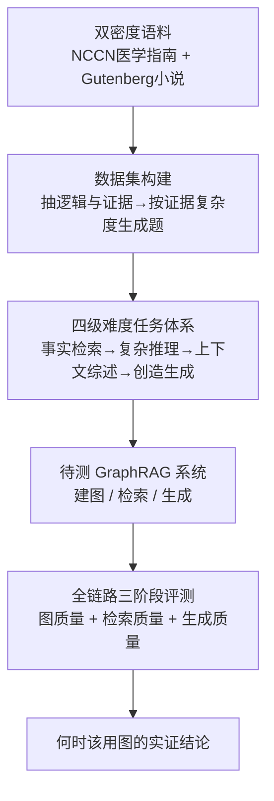

# When to use Graphs in RAG: A Comprehensive Analysis for Graph Retrieval-Augmented Generation

**会议**: ICLR 2026  
**OpenReview**: [https://openreview.net/forum?id=i9q9xDMjG7](https://openreview.net/forum?id=i9q9xDMjG7)  
**代码**: https://github.com/GraphRAG-Bench/GraphRAG-Benchmark  
**领域**: 信息检索 / 检索增强生成（RAG） / GraphRAG / 评测基准  
**关键词**: GraphRAG, 检索增强生成, 评测基准, 多跳推理, 图结构检索

## 一句话总结
本文针对"GraphRAG 在很多真实任务上反而打不过普通 RAG"这一矛盾，提出了一个覆盖图构建—检索—生成全链路、且按难度分四级任务的基准 GraphRAG-Bench，系统性地回答了"什么时候该用图、为什么用图有效"——结论是：简单事实检索用普通 RAG 就够，图结构只在复杂多跳推理、上下文综述等需要拼接分散概念的任务上才带来实打实收益，但要付出数倍的 token 开销。

## 研究背景与动机
**领域现状**：RAG 通过从外部语料检索相关文本，让 LLM 在不重训的前提下回答领域/私有知识问题。为了突破"按 chunk 切分丢失上下文"的局限，GraphRAG 把背景知识组织成图（节点是实体/事件/主题，边是逻辑/因果/关联关系），检索时不仅取直接相关节点，还沿图遍历拿到互联子图，从而捕捉主题演化、间接依赖、多跳推理链。Microsoft GraphRAG、LightRAG、HippoRAG、StructRAG、KAG 等一系列工作据此宣称能更好地处理复杂多跳查询。

**现有痛点**：然而近期多项研究发现 GraphRAG 在很多真实任务上反而不如朴素 RAG——有研究报告 GraphRAG 在 Natural Questions 上准确率低 13.4%，在时效性查询上甚至掉 16.6%；虽然在 HotpotQA 多跳题上推理深度提升 4.5%，却带来平均 2.3 倍的延迟。"概念上的潜力"和"实际效果"严重脱节。

**核心矛盾**：问题在于——根本没有一个公平、可量化评估"图结构到底在 RAG 里起多大作用"的基准。现有的 HotpotQA / MultiHopRAG / UltraDomain 有三个硬伤：① 任务复杂度区分太粗，过度强调"把分散事实找出来"的检索难度，却忽视了"把互联事实综合成有逻辑的答案"的推理难度，所谓"多跳"其实退化成顺序事实检索；② 语料质量参差、信息密度低，多来自维基/新闻，缺乏领域层级结构，实体稀疏（平均关系数 HotpotQA 仅 12.7、MultiHopRAG 仅 3.82），远低于真正多跳推理需要的密度，根本测不出 GraphRAG 利用领域层级的强项；③ 评测只看最终答案准确率/流畅度，把图构建、检索、生成当黑盒，无法定位图结构在哪一环贡献了什么。

**本文目标**：建一个能公平度量图结构价值的基准，并基于它回答两个具体问题——GraphRAG 到底有没有用？在哪些场景下图结构带来可测量的收益？

**切入角度**：既然现有基准在"任务难度梯度""语料密度""全链路可观测"三处都不合格，那就反向设计：让任务难度沿"检索难度 × 推理难度"两个维度递增、让语料同时包含高密度结构化领域知识和松散真实文本、让评测覆盖图质量→检索质量→生成质量整条流水线。

**核心 idea**：用一个"分四级难度 + 双密度语料 + 全链路三阶段指标"的基准 GraphRAG-Bench，把"何时该用图"从直觉争论变成可量化的实证结论。

## 方法详解

### 整体框架
GraphRAG-Bench 本质不是一个新模型，而是一套"基准 + 评测协议"，目标是把不同 GraphRAG 系统放进同一个可控环境里横向对比，并拆开它们的内部流程逐段打分。它由三个核心组件构成：（i）数据集构建流水线——从原始语料抽取逻辑与证据、再据此生成不同难度的题目；（ii）按难度分级的任务体系——四个层级从事实检索一路升到创造性生成；（iii）覆盖全链路的多阶段评测框架——分别度量图构建质量、检索质量、生成质量。一个 GraphRAG 系统进来后，先在双密度语料上建图、检索、生成，基准则在每个阶段用对应指标量化它的表现，最终汇总出"这个系统在哪类难度任务上、哪个流水线环节强/弱"的全景画像。

### 关键设计

**1. 双维度递增的四级难度任务体系：把"检索难度"和"推理难度"分开**

现有基准最大的问题是把"多跳"等同于"多次顺序找事实"，所以图结构的真正用武之地（综合互联概念）根本测不到。本文据此把任务沿两个维度同时拉开，设计成四级递增（见原文 Table 1）：Level 1 事实检索（取孤立知识点，主要考精确关键词匹配，如"圣米歇尔山在法国哪个区"）；Level 2 复杂推理（跨文档用逻辑链串多个知识点）；Level 3 上下文综述（把碎片信息综合成连贯有结构的答案，强调逻辑一致性）；Level 4 创造性生成（在检索内容之外做推断，涉及假设/新场景，如"把某段探险改写成一篇报纸报道"）。低层级验证检索能力，高层级考查推理深度——这样既能暴露"简单题图反而添乱"，也能暴露"难题图才显出价值"，让"何时用图"有了可分辨的标尺。

**2. 双密度语料 + 证据驱动的题目生成：让题目难度锚定在证据结构上，而非跳数**

为了能真正测出图利用领域层级的能力，语料必须既有高密度结构化知识、又有松散真实文本。作者一边接入 NCCN 医学指南（嵌入显式层级与标准化协议，比如"症状—药物—疗效"的治疗协议，提供超出常规领域语料的稠密概念关系），一边收集 Gutenberg 上 20 世纪前的小说（模拟隐式、非线性叙事的真实文档，同时规避预训练污染）。在题目生成上，作者不按"事实稀缺度或跳数"定难度，而是先把原始文本系统地转成结构化领域本体（保留实体 + 上下文关系 + 层级依赖），从中抽取细粒度证据：简单检索题隔离出自包含子图，复杂推理题则重建跨段的多跳关系序列；再按"证据类型的渐进整合"生成题——从孤立子图片段（检索任务）到全局拓扑感知的推理（综合推理任务）。这样难题就真正要求"综合上下文层级与领域本体"，而不是把离散事实堆起来，从根上修正了旧基准"多跳退化为顺序检索"的缺陷。

**3. 全链路三阶段评测指标：把图构建、检索、生成从黑盒拆开逐段量化**

旧评测只看最终答案，无法回答"图到底在哪一环帮了忙"。本文设计了与流水线一一对应的三组指标。**图质量**用结构化指标刻画建出来的图本身：节点数、边数、平均度数 $\text{AVERAGE DEGREE}=\frac{1}{|V|}\sum_{v\in V}\deg(v)$（越高说明知识表示越整合、跨节点遍历越高效），以及平均聚类系数 $\frac{1}{|V|}\sum_{v\in V}C(v)$，其中 $C(v)=\frac{2\cdot T(v)}{\deg(v)\,(\deg(v)-1)}$、$T(v)$ 是节点 $v$ 的三角形数（越高说明局部邻域越连贯、越支持局部推理，如医学图里"疾病—治疗—症状"的三元闭合）。**检索质量**用两个互补指标：Evidence Recall 衡量检索内容覆盖标准证据的完整度，Context Relevance 衡量检索内容与查询意图的语义对齐度——好的系统既要召回全（高 recall）又要少噪声（高 relevance）。**生成质量**用四个指标：Lexical Overlap（最长公共子序列的词级重合）、Answer Accuracy（语义相似 + 事实一致）、Faithfulness（长答案中知识点是否忠实于给定上下文）、Evidence Coverage（答案是否覆盖所有相关知识）。三段指标合起来，才第一次让"图结构在检索/推理过程中的贡献"变得可观测。

## 实验关键数据

实验在 GPT-4o-mini 上评测了 7 个代表性 GraphRAG 框架（MS-GraphRAG、HippoRAG、HippoRAG2、LightRAG、Fast-GraphRAG、RAPTOR、Lazy-GraphRAG）与朴素 RAG（带/不带 rerank），围绕四个研究问题：生成准确率（Q1）、检索质量（Q2）、图复杂度（Q3）、效率（Q4）。

### 主实验：生成准确率（ACC，节选自 Table 3）

| 数据集 | 方法 | 事实检索 | 复杂推理 | 上下文综述 | 创造生成(FS忠实度) |
|--------|------|----------|----------|------------|------------|
| Novel | Basic RAG (w/ rerank) | **60.92** | 42.93 | 51.30 | 49.21 |
| Novel | HippoRAG2 | 60.14 | **53.38** | **64.10** | 49.84 |
| Novel | RAPTOR | 49.25 | 38.59 | 47.10 | **70.85** |
| Medical | Basic RAG (w/ rerank) | 64.73 | 58.64 | 65.75 | 36.74 |
| Medical | HippoRAG2 | **66.28** | **61.98** | 63.08 | 58.78 |
| Medical | LightRAG | 63.32 | 61.32 | 63.14 | **78.76** |

关键观察：**简单事实检索上 Basic RAG 与最强 GraphRAG 持平甚至更好**（Novel 上 60.92 vs 60.14），因为简单查询里图带来的额外处理只会引入冗余/噪声；**复杂推理、上下文综述、创造生成上 GraphRAG 明显占优**（如 HippoRAG2 复杂推理 53.38 vs RAG 42.93），因为这些任务天然需要桥接多概念间的复杂关系。

### 检索质量（Evidence Recall / Context Relevance，节选自 Table 4）

| 数据集 | 方法 | 事实检索-Recall | 复杂推理-Recall | 上下文综述-Recall |
|--------|------|----------|----------|----------|
| Novel | Basic RAG (w/ rerank) | **83.21** | 64.47 | 73.38 |
| Novel | HippoRAG | 80.44 | **87.91** | **90.95** |
| Novel | HippoRAG2 | 70.29 | 69.77 | 82.50 |

RAG 在 Level 1 简单题上 Evidence Recall 高达 83.2%（相关证据通常就在单个段落里）；但 Level 2-3 一旦变难，HippoRAG 的 Recall 飙到 87.9%–90.9%、HippoRAG2 的 Context Relevance 领先（85.8%–87.8%），凸显图结构跨远距文本段连接信息的独特能力。

### 图复杂度与效率

| 指标 | MS-GraphRAG | HippoRAG2 | LightRAG | Fast-GraphRAG | HippoRAG |
|------|-------------|-----------|----------|---------------|----------|
| 平均度数(Novel) | 1.48 | **8.75** | 2.10 | 3.19 | 1.73 |
| 平均聚类系数(Novel) | 0.315 | **0.657** | 0.212 | 0.324 | 0.100 |
| 平均 token(Novel) | 38707 | 1008 | 100832 | 4204 | 7208 |

HippoRAG2 建出的图显著更稠密（Novel 上每 10k token 语料约 523 节点 / 2310 边），图密度高直接对应它更高的检索召回；但代价是 token 开销巨大——MS-GraphRAG(global) 因社区摘要机制 prompt 可达 4×10⁴ token、LightRAG 约 10⁵ token，而 HippoRAG2 保持在 10³ 量级、效率最好。

### 关键发现
- **"何时用图"的核心结论**：简单事实检索用普通 RAG 足矣，图反而引入冗余噪声；图结构只在复杂推理、上下文综述、创造生成这类"需要拼接互联概念"的任务上才带来可测量收益。
- **图密度 ≈ 检索能力**：平均度数/聚类系数越高的图（HippoRAG2），检索召回越高、生成越好；图质量是连接"建图"和"最终效果"的关键中介。
- **图的代价是 token 膨胀**：GraphRAG 普遍比朴素 RAG prompt 长一到两个数量级；且随任务难度上升 prompt 还在涨（MS-GraphRAG(global) 从 7800 涨到 40000 token），过量上下文反而会拉低 Context Relevance——这是"检索广度 ↔ 噪声/成本"的根本权衡。
- **创造性任务上的精度—覆盖权衡**：RAPTOR 在 Novel 上忠实度最高（70.9%），但 RAG 覆盖更多证据（40.0%），说明 GraphRAG 检索碎片化、利于精确但不利于大范围综合。

## 亮点与洞察
- **把"多跳"重新定义为"推理复杂度"而非"跳数"**：作者点破现有基准把多跳退化成顺序事实检索的要害，并用"证据结构驱动的题目生成"把难度真正锚定在需要综合层级/本体的地方——这个诊断本身就很有价值，是后续 GraphRAG 评测可复用的方法论。
- **全链路三阶段指标的可迁移性**：把"图质量（度数/聚类系数）→检索质量（recall/relevance）→生成质量（faithfulness/coverage）"拆开打分，让"图在哪一环起作用"可定位，这套观测框架可直接迁移到任何结构化检索系统的诊断上。
- **双密度语料设计**：用 NCCN 医学指南（高密度结构化）+ Gutenberg 古典小说（低密度隐式叙事 + 规避预训练污染）一稠一松搭配，巧妙地让"图利用领域层级"和"图在松散文本上的鲁棒性"都能被测到。
- **最"啊哈"的点**：GraphRAG 不是普遍更强、也不是普遍更弱，而是有清晰的适用边界——这把一个长期模糊的争论变成了可操作的工程指南（按任务难度决定要不要上图）。

## 局限与展望
- **作者承认的局限**：评测聚焦技术层面，源数据可能存在社会偏见；基准虽覆盖医学+小说两域，仍不能穷尽所有真实场景的语料密度谱系。
- **自己发现的局限**：① 横向比较以 GPT-4o-mini 为生成器，结论在更强/更弱 LLM 上是否一致（尤其"简单题图添乱"的结论会不会随 LLM 推理力变化）尚未充分验证；② 不同 GraphRAG 的超参（图 schema、检索深度）对结果影响很大，"图质量→效果"的因果链更多是相关性观察而非控制变量实验；③ 效率只统计了 token 开销，未把建图的离线预处理时间/成本完整计入"何时值得用图"的成本侧。
- **改进思路**：可把"任务难度"做成连续可调旋钮、在固定语料上系统扫推理复杂度，画出"图收益—任务难度"的完整曲线；并引入成本敏感的综合指标（如单位 token 收益），把"何时用图"从定性结论升级成可优化的决策。

## 相关工作与启发
- **vs 既有 GraphRAG 方法（MS-GraphRAG / LightRAG / HippoRAG 系列 / KAG / StructRAG）**：它们各自提出新的建图或检索策略并宣称在多跳任务更强；本文不提新模型，而是提供一个公平的裁判台，把这些方法放进统一的分级任务 + 全链路指标里横评，得出"谁在什么难度上强、代价多大"的实证地图。
- **vs 既有 RAG 基准（HotpotQA / MultiHopRAG / UltraDomain）**：它们主要面向文本中心 RAG、过度强调检索难度、语料密度低、只看最终答案；本文针对这三处缺陷分别用"双维度难度梯度""双密度语料""三阶段指标"补齐，专为评估图结构而设计。
- **启发**：评估一个新范式时，与其堆更多 SOTA，不如先确认"现有基准能不能测出它的真本事"——本文给出的"先诊断基准缺陷、再按缺陷反向设计基准、最后用它回答 when/why"的路径，对任何"概念很美但实测打脸"的方法都通用。

## 评分
- 新颖性: ⭐⭐⭐⭐ 不是新模型，但"分级任务 + 双密度语料 + 全链路指标"的基准设计与"何时用图"的系统性回答都很扎实。
- 实验充分度: ⭐⭐⭐⭐ 7 个 GraphRAG × 2 域 × 4 难度 × 三阶段指标，覆盖面广、结论清晰；缺多 LLM 与受控因果实验。
- 写作质量: ⭐⭐⭐⭐ 问题动机层层递进，三大缺陷与三大设计一一对应，逻辑闭环好读。
- 价值: ⭐⭐⭐⭐⭐ 给"要不要上 GraphRAG"提供了可操作的工程指南，并贡献了一个面向图结构的公开基准。

<!-- RELATED:START -->

## 相关论文

- [\[ICLR 2026\] LinearRAG: Linear Graph Retrieval Augmented Generation on Large-scale Corpora](linearrag_linear_graph_retrieval_augmented_generation_on_large-scale_corpora.md)
- [\[ICLR 2026\] Youtu-GraphRAG: Vertically Unified Agents for Graph Retrieval-Augmented Complex Reasoning](youtu-graphrag_vertically_unified_agents_for_graph_retrieval-augmented_complex_r.md)
- [\[ACL 2025\] Graph of Records: Boosting Retrieval Augmented Generation for Long-context Summarization with Graphs](../../ACL2025/information_retrieval/gor_rag_long_context_summary.md)
- [\[ICLR 2026\] Query-Aware Flow Diffusion for Graph-Based RAG with Retrieval Guarantees](query-aware_flow_diffusion_for_graph-based_rag_with_retrieval_guarantees.md)
- [\[ACL 2026\] Beyond Chunks and Graphs: Retrieval-Augmented Generation through Triplet-Driven Thinking](../../ACL2026/information_retrieval/beyond_chunks_and_graphs_retrieval-augmented_generation_through_triplet-driven_t.md)

<!-- RELATED:END -->
