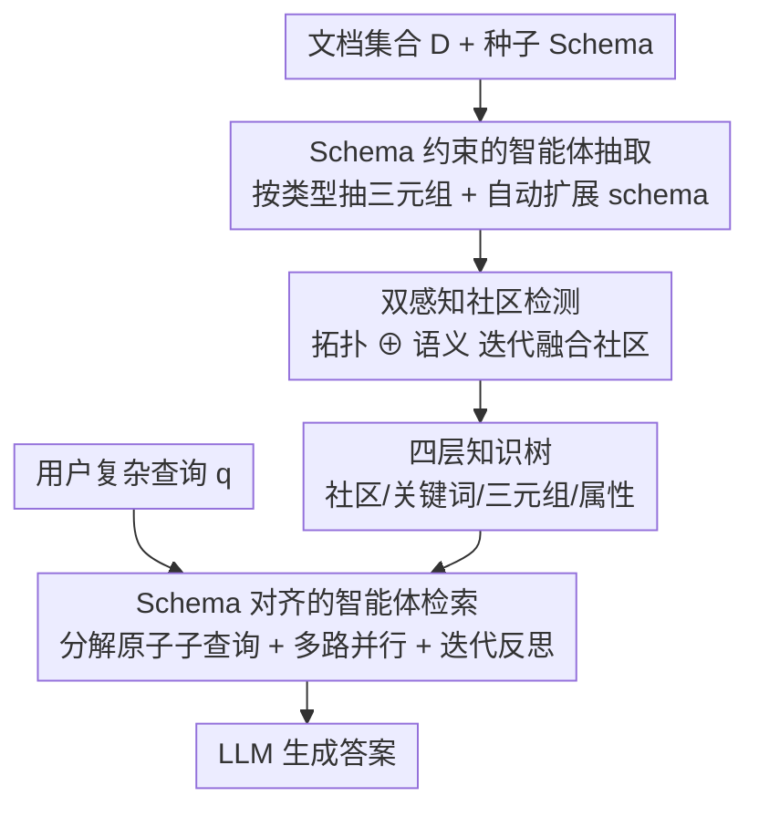

# Youtu-GraphRAG: Vertically Unified Agents for Graph Retrieval-Augmented Complex Reasoning

**会议**: ICLR 2026  
**OpenReview**: [https://openreview.net/forum?id=yCtgZ2G39E](https://openreview.net/forum?id=yCtgZ2G39E)  
**代码**: https://github.com/TencentCloudADP/Youtu-GraphRAG  
**领域**: 检索增强生成 / GraphRAG / Agent  
**关键词**: GraphRAG, 图谱构建, 社区检测, 智能体检索, 知识泄漏

## 一句话总结
Youtu-GraphRAG 用一份「图谱 schema」把传统上各自为政的图谱构建和图谱检索竖直串成一体——构建端用 schema 约束抽取并自动扩展，索引端用「拓扑+语义」双感知社区检测堆出四层知识树，检索端再用同一份 schema 把复杂问题拆成原子子查询并迭代反思，在 6 个基准上比 SOTA 最多省 33.60% token、提 16.62% 准确率。

## 研究背景与动机

**领域现状**：GraphRAG（图检索增强生成）把零散文档组织成显式的知识图谱，让 LLM 沿着实体—关系路径做多跳推理，解决了普通 RAG 在「离散信息间的连贯关系」和「多跳推理」上的硬伤。自 Edge et al. 的奠基工作以来，这条线分化成两支：一支专攻**检索**（LightRAG 做向量稀疏化、GNN-RAG/GFM-RAG 上图神经网络、HippoRAG 1&2 引入记忆和个性化 PageRank），另一支专攻**构建**（从 KGP 的超链接/KNN 粗图，到 GraphRAG 的社区检测摘要、RAPTOR/E2GraphRAG 的树状递归聚类）。

**现有痛点**：两条线都在「孤立优化」——只盯着构建或只盯着检索，把对方当成不可调的黑盒（论文 Figure 1 里用灰色「非定制组件」表示）。结果是构建端造出的图未必对检索友好，检索端也无法回头利用图谱里的结构与语义信号，复杂推理性能因此次优；一旦换领域（domain shift），这种割裂会被进一步放大。

**核心矛盾**：构建和检索本是一条流水线上首尾呼应的两环，但二者「天然不对齐」——没有一个共同的中间表示能让构建出的图同时在结构和语义两个层面服务于检索。此外还有一个被忽视的评测困境：现在几乎所有 GraphRAG 基准（HotpotQA 等）的实体在 LLM 预训练时早已「见过」，模型可以靠参数记忆直接答题，**测不出 GraphRAG 真实的检索能力**（作者称之为 knowledge leaking）。

**本文目标**：(1) 找一个统一介质把构建和检索绑在一起；(2) 让推理能在不同知识粒度（实体/三元组/关键词/社区）间自由穿梭；(3) 造一个能屏蔽知识泄漏的公平评测集。

**切入角度**：作者押注「**图谱 schema**」作为那个统一介质——schema（实体类型、关系、属性类型三元组）既能在构建端约束抽取、压掉噪声，又能在检索端指导问题分解，让同一套类型约束贯穿全程。

**核心 idea**：用一份贯穿始终的 graph schema，把「schema 约束抽取 + 双感知社区检测的知识树 + schema 对齐的智能体检索」竖直统一成一个闭环，再配一个「匿名还原」任务做公平评测。

## 方法详解

### 整体框架
Youtu-GraphRAG 的输入是文档集合 $D$ 和一份种子 schema $S=\langle S_e, S_r, S_{attr}\rangle$，输出是对复杂查询 $q$ 的答案。整条管线被同一份 schema 竖直串起来，分三段：**构建段**让一个被 schema 绑定的抽取智能体把文档抽成三元组图，并按需自动扩展 schema；**索引段**用双感知社区检测把稠密原始图重组成一棵四层知识树（社区→关键词→三元组→属性）；**检索段**让一个检索智能体读同一份 schema，把复杂问题拆成可并行的原子子查询，再在多路检索上迭代「推理—反思」。三段共享 schema，这就是「vertically unified」的字面含义——schema 是那根竖轴。

### 关键设计

**1. Schema 约束的智能体抽取：把开放抽取压成受控生成**

痛点很直接：现有 GraphRAG 多用纯 LLM 或 OpenIE 抽实体关系，开放式抽取必然带进大量噪声和无关信息，图谱质量上不去。本文把图谱抽取重新定义为「受 schema 约束的生成」——先给一份紧凑的领域种子 schema $S=\langle S_e, S_r, S_{attr}\rangle$，$S_e$ 是目标实体类型（如 Person、Disease），$S_r$ 是凝练的关系（如 treats、causes），$S_{attr}$ 是可挂在实体上的属性类型（如 occupation、gender）。一个冻结的 LLM 智能体 $f_{LLM}(S,D)$ 只被允许识别落在 $S$ 里的信息，于是对每篇文档 $d$ 抽出的三元组被限定为 $T(d)=\{(h,r,t),(e,r_{attr},e_{attr}) \mid \{f(h),f(t),f(e)\}\in S_e,\ \{r,r_{attr}\}\in S_r,\ e_{attr}\in S_{attr}\}$。这把无边界的开放搜索收成了 schema 定义的结构化空间，噪声自然少。

为了不被预定义 schema 卡死，作者再加一个自适应智能体在与文档交互中**动态扩展 schema**：对每篇文档提出候选扩展 $\Delta S=\langle\Delta S_e,\Delta S_r,\Delta S_{attr}\rangle=\mathbb{I}[f_{LLM}(d,S)\odot S]\geq\mu$，只有置信度超过阈值 $\mu=0.9$、且在新领域文档里反复出现、上下文一致的高频模式才被吸收进来。这样既守住了「strict schema guidance」的精度，又保留了面对未见领域时「flexible knowledge acquisition」的伸缩性——这正是论文反复强调的「换领域只需最小干预」的来源。

**2. 双感知社区检测与四层知识树：让聚类同时尊重结构和语义**

细粒度的原始三元组图很快会变得又密又噪，常规做法是用 Louvain/Leiden/GMM 做社区检测再 LLM 摘要。但这些算法**只看结构连通性、忽略语义**，在知识图上往往切出次优社区。本文提出双感知（dual-perception）框架，让拓扑和语义同时说话，分三步走。首先做实体表示：把每个实体 $e_i$ 的一跳邻域三元组用冻结 LM（如 all-MiniLM-L6-v2）编码再平均，$e_i=\frac{1}{|N_i|}\sum_{(e_i,r,e_j)\in N_i} f_{LM}[e_i\|r_{ij}\|e_j]$，于是表示里同时含一跳结构和邻居语义。然后用 K-means 在实体嵌入上做初始粗划分，簇数被约束为 $k=\min(\max(2,\lfloor E/\beta\rfloor),\eta)$（$\beta=10$ 控粒度、$\eta=200$ 防过碎）以压缩搜索空间。

核心是迭代社区融合用的双感知打分 $\phi(e_i,C_m)=S_r(e_i,C_m)\oplus\lambda\, S_s(e_i,C_m)$，把**关系连通重叠**（$S_r$ 是 $e_i$ 与社区入边关系集合的 Jaccard 相似度）和**子图语义相似**（$S_s$ 是实体嵌入与社区质心嵌入的余弦相似度）线性融合。每轮为每个社区选出双感知分最高的代表实体 $e^*_{center}=\arg\max\phi(e_i,C_m)$，当两个社区质心期望差 $E[\phi(e_i,C^{(t)}_a)]-E[\phi(e_i,C^{(t)}_b)]<\epsilon$ 时合并——这把匹配从「节点—社区」比较降到「节点—节点」比较，检测更高效。最终产物是一棵深度 $L=4$ 的知识树 $K=\bigcup_{\ell=1}^{4}L_\ell$：L4 社区、L3 关键词（社区内 $\arg\max\phi$ 选出的枢纽实体）、L2 实体—关系三元组、L1 属性。这棵树同时支持「自顶向下过滤」（先用 L4 社区圈范围）和「自底向上推理」（用细粒度事实落地），是后续检索能在多粒度间穿梭的基础。

**3. Schema 对齐的智能体检索：把复杂问题拆成原子子查询并迭代反思**

光有好图还不够，复杂多跳问题直接打到大规模知识树上会失准。检索智能体读**同一份 schema** $S$ 做查询分解：$Q=f_{LLM}(q,S)=\{q_1,q_2,\dots,q_i\}$，每个原子子查询都被 schema 里的实体类型/属性类型过滤，确保它只指向三类合法目标之一——节点级 $(e,\text{has\_attr},a)$、三元组级 $(h,r,t)$、或社区级验证 $C_m$。schema 感知在这里的作用是防止生成「答不出或答跑偏」的病态子查询，让分解天然贴合知识树里的有效模式。这与构建端共用一份 schema，正是构建—检索对齐的关键。

在分解之上叠一个「推理—反思」闭环。智能体被形式化为 $\mathcal{A}=\langle H, f_{LLM}\rangle$，$H$ 是同时存历史推理步和检索结果的记忆，当前动作 $A^{(t)}=f_{LLM}(\underbrace{q_t}_{\text{推理}}, \underbrace{H^{(t-1)}}_{\text{反思}})$ 在「带 schema 引导的前向推理+检索」和「针对复杂情形的后向反思」之间交替，形成逐步收敛的闭环：前者靠 schema 保持符号锚定，后者持续自检、纠正错误的推理路径。检索本身配了多条路由——实体检索、三元组匹配、社区过滤、DFS 路径遍历——以榨干不同粒度的优势。消融显示，这个智能体闭环是贡献最大的一环（去掉后 2Wiki 暴跌 19.8%）。

> 此外作者还提出一个独立贡献：**Anonymity Reversion（匿名还原）任务**与配套匿名数据集 AnonyRAG。把基准里的命名实体匿名化，要求模型把匿名实体还原成正确的具体命名实体，从而堵住「LLM 靠预训练记忆直接答题」的 knowledge leaking，逼出 GraphRAG 真实的检索能力——这是评测侧的设计，不在上面的方法管线图里。

## 实验关键数据

### 主实验
6 个基准（HotpotQA、2Wiki、MuSiQue、GraphRAG-Bench、AnonyRAG-CHS、AnonyRAG-ENG），两个 backbone（DeepSeek-V3-0324、Qwen3-32B），双模式评测：**open mode** 允许用参数知识，**reject mode** 证据不足必须拒答（直接探检索质量）。下表为 DeepSeek 下 top-20 准确率节选：

| 数据集 / 模式 | 本文 | 最强 baseline | 提升 |
|--------|------|----------|------|
| HotpotQA / Open | 86.50 | 81.80 (HippoRAG2) | +4.7 |
| HotpotQA / Reject | 81.20 | 74.90 (HippoRAG2) | +6.3 |
| 2Wiki / Reject | 77.60 | 66.00 (HippoRAG-IRCOT) | +11.6 |
| MuSiQue / Reject | 47.50 | 37.80 (HippoRAG2) | +9.7 |
| G-Bench / Open | 86.54 | 79.37 (HippoRAG2) | +7.2 |
| AnonyRAG-CHS / Open | 42.88 | 36.77 (HippoRAG) | +6.1 |

reject 模式提升（7~14 点）普遍大于 open 模式（2~8 点），说明优势主要来自检索质量本身而非参数记忆；在两个匿名集上的领先也佐证了跨语言、跨领域的泛化。效率侧：构建阶段 token 消耗 6 个数据集全场最低，社区检测阶段任意数据集都 <10000 token，整体把性能—成本的 Pareto 前沿往左上方推（最多省 33.60% token）。

### 消融实验
DeepSeek、reject/top-20 口径，去三大组件：

| 配置 | HotpotQA | 2Wiki | MuSiQue | AnonyRAG-CHS | 说明 |
|------|---------|-------|---------|--------------|------|
| Full (Youtu-GraphRAG) | 81.20 | 77.60 | 47.50 | 42.88 | 完整模型 |
| w/o Community | 79.50 | 75.10 | 44.00 | 39.97 | 去社区检测 |
| w/o Agent | 75.30 | 57.80 | 40.00 | 37.60 | 去推理/反思智能体 |
| w/o Schema | 77.10 | 73.40 | 45.60 | 35.61 | 去 schema 引导 |

### 关键发现
- **智能体闭环贡献最大**：去掉 Agent 在 2Wiki、MuSiQue 上分别暴跌 19.8%、7.5%，验证「迭代推理—反思」对消解模糊中间步骤是刚需，这是复杂多跳问题的命门。
- **社区检测主要帮全局问题**：去掉后多跳 QA（HotpotQA、2Wiki）掉约 1.7%、2.5%，说明把知识组织成连贯社区利于全局检索。
- **schema 是跨域初始化的关键**：去掉后在知识密集的 AnonyRAG-CHS 上掉 7.27%，印证高质量种子 schema 对新领域的重要性，也佐证「换域只需最小干预」。
- **Ours w/o Agent 作为轻量版**仍普遍强于各 baseline，可服务实时交互场景。

## 亮点与洞察
- **用 schema 当「竖轴」统一构建与检索**：同一份类型约束既压抽取噪声、又指导查询分解，是个干净的工程抽象——把两个一直被分开优化的阶段对齐到一个可共享的中间表示上，这个思路可迁移到任何「构建—使用」割裂的检索系统。
- **双感知社区检测**把拓扑 Jaccard 和语义余弦显式相加，再用「质心期望差 <ε 才合并」把节点—社区比较降为节点—节点比较，既补上了纯结构聚类丢语义的短板，又顺手提了效率。
- **knowledge leaking 的命名与 AnonyRAG 评测**戳中了整个 GraphRAG 评测的痛处：实体早被预训练见过，open 模式测的其实是参数记忆。匿名还原任务这个评测设计本身的价值不亚于方法。
- reject 模式提升大于 open 模式，是「检索质量真提升了」的强证据——值得作为评 RAG 系统的通用做法。

## 局限与展望
- schema 质量是上限：消融显示去 schema 在中文匿名集掉 7+ 点，说明系统对种子 schema 的初始化较敏感，冷启动到全新领域时仍需人给一份像样的种子。
- 自动扩展用固定阈值 $\mu=0.9$、社区数上界 $\eta=200$ 等硬超参，论文未充分分析其敏感性，跨规模/跨领域时这些常数是否稳健存疑。
- 「推理—反思」闭环带来准确率，但迭代轮次的代价、何时停的收敛判据描述较略；附录才给检索多路由细节，正文对路由如何取舍交代不深。
- 评测仍是问答准确率口径，schema 自动扩展引入的错误类型、社区摘要的事实性等中间环节质量未单独度量。

## 相关工作与启发
- **vs HippoRAG 1&2**：它们强在检索端（记忆 + 个性化 PageRank），但构建端不与检索协同；本文把 schema 贯穿构建与检索，reject 模式上对 HippoRAG2 普遍多 7~14 点，差距正落在「检索质量」这一面。
- **vs GraphRAG / RAPTOR / E2GraphRAG**：它们把构建做深（社区摘要、树状递归聚类）却把检索当下游黑盒；本文的双感知社区检测在堆知识树的同时用同一份 schema 反哺检索，且构建 token 成本反而最低。
- **vs LightRAG / GNN-RAG**：它们偏向用稀疏化或 GNN 提检索效率/细粒度匹配，仍是检索单点优化；本文主张「竖直统一」才是下一代范式，实验上把 Pareto 前沿整体左移。

## 评分
- 新颖性: ⭐⭐⭐⭐ 「schema 当竖轴统一构建+检索」+ 双感知社区检测 + 匿名还原评测，组合新颖且每块都有针对性
- 实验充分度: ⭐⭐⭐⭐⭐ 6 基准 × 2 backbone × 双模式 × top-10/20，含成本曲线与三组件消融，证据扎实
- 写作质量: ⭐⭐⭐⭐ 方法清晰、动机层层递进；部分超参敏感性和检索路由细节压进附录
- 价值: ⭐⭐⭐⭐⭐ 同时省 token 提准确率、能换域，且 AnonyRAG 推动了 GraphRAG 的公平评测，落地价值高

<!-- RELATED:START -->

## 相关论文

- [\[ICLR 2026\] G-reasoner: Foundation Models for Unified Reasoning over Graph-structured Knowledge](g-reasoner_foundation_models_for_unified_reasoning_over_graph-structured_knowled.md)
- [\[ICML 2026\] Graph-R1: Towards Agentic GraphRAG Framework via End-to-end Reinforcement Learning](../../ICML2026/information_retrieval/graph-r1_towards_agentic_graphrag_framework_via_end-to-end_reinforcement_learnin.md)
- [\[ICLR 2026\] LinearRAG: Linear Graph Retrieval Augmented Generation on Large-scale Corpora](linearrag_linear_graph_retrieval_augmented_generation_on_large-scale_corpora.md)
- [\[ICLR 2026\] Query-Aware Flow Diffusion for Graph-Based RAG with Retrieval Guarantees](query-aware_flow_diffusion_for_graph-based_rag_with_retrieval_guarantees.md)
- [\[ICLR 2026\] Graph-based Nearest Neighbors with Dynamic Updates via Random Walks](graph-based_nearest_neighbors_with_dynamic_updates_via_random_walks.md)

<!-- RELATED:END -->
