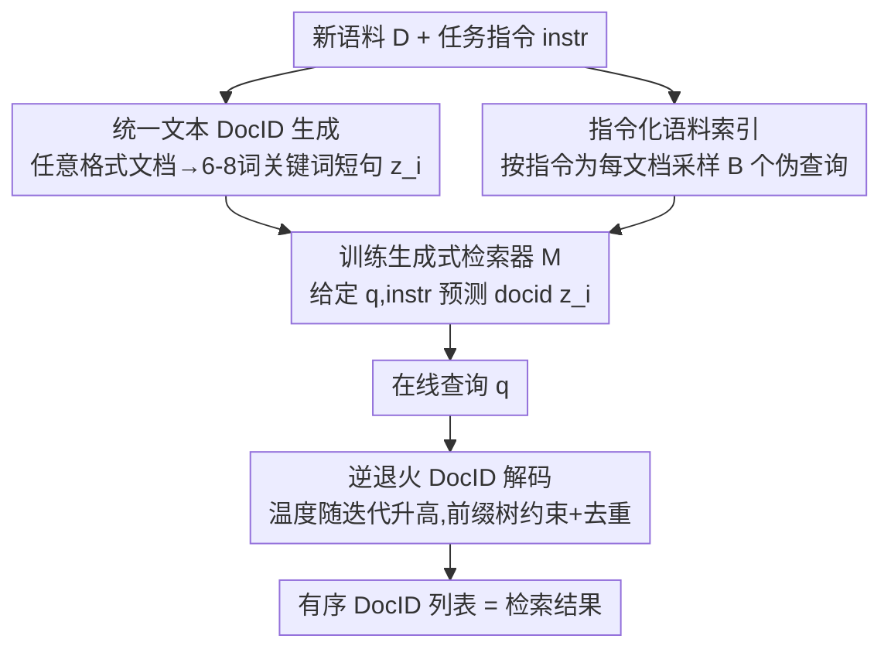

# ZeroGR: A Generalizable and Scalable Framework for Zero-Shot Generative Retrieval

**会议**: ICLR 2026  
**OpenReview**: [https://openreview.net/forum?id=RBoAwiQl5L](https://openreview.net/forum?id=RBoAwiQl5L)  
**代码**: https://github.com/sunnweiwei/ZeroGR  
**领域**: 信息检索 / 生成式检索  
**关键词**: 生成式检索, 零样本检索, 指令微调, DocID, 逆退火解码

## 一句话总结
ZeroGR 用自然语言任务指令把生成式检索（GR）从有监督单任务推广到零样本异构检索：把任意格式文档统一压成关键词式文本 DocID、用指令微调的查询生成器为语料造伪查询来建索引、再用"温度逐步升高"的逆退火解码在精度与召回间取平衡，在 BEIR/MAIR 上刷新 GR 的 SOTA 并逼近稠密检索。

## 研究背景与动机

**领域现状**：稠密检索（DR）是目前最主流的 IR 范式，把查询和文档都编码成向量做最大内积搜索（MIPS）。生成式检索（GR）则是另一条路——把语料信息压进模型参数里，检索时直接"生成"相关文档的标识符（docid），从而端到端可优化、天然契合生成式语言模型。在有大规模监督数据时，GR 在网页搜索、知识密集检索上已能打。

**现有痛点**：GR 的泛化能力很差。已有 GR 模型几乎都在特定语料、特定查询分布上做有监督微调，一旦换到没见过的任务（out-of-distribution）就崩。但真实世界的检索恰恰是高度异构的——语料可能是表格、代码、法律案卷、会议记录；相关性判据随任务变化；而且绝大多数是**零样本**场景，根本没有监督数据。专为有监督设计的 GR 在这种数据稀缺、异构的环境里水土不服。

**核心矛盾**：GR 的三大环节都被"单任务监督"绑死了——① docid 设计多用标题/URL/文本片段这类规则式方案，遇到用户自定义的奇怪格式就失效；② 语料索引依赖伪查询，但伪查询分布一旦偏离真实查询，索引质量就崩（异构任务下偏离尤其大）；③ docid 解码用受约束的 beam search，容易塌缩到少数高概率序列，伤召回。三者都没有"任务感知"的能力。

**本文目标**：让 GR 能仅凭一段自然语言任务指令，就为任意新任务构建专属的生成式检索索引，做到零样本泛化。

**切入角度**：作者注意到，零样本 IR 里虽然没有训练数据，但任务指令（instruction）几乎总是可得且廉价。那就把指令作为统一接口，沿 docid 设计、语料索引、docid 解码三个维度分别注入任务感知能力——指令微调天然能让模型适配不同任务的相关性判据。

**核心 idea**：用"指令驱动"重做 GR 的三件套——统一文本 docid 生成器 + 指令化伪查询生成器 + 逆退火解码，再配一个覆盖 69 个任务的大规模开源指令检索数据集 OpenInstIR 来支撑系统性的指令微调扩展研究。

## 方法详解

### 整体框架

ZeroGR 要解决的是"给一个全新语料 $D$ 和一句任务指令 $instr$，怎么零样本地把它变成一个能用的生成式检索索引"。整体分**离线建索引**和**在线检索**两段，由三个 Llama 系组件协作完成。

离线阶段：对语料中每个文档 $d_i$，docid 生成器 $G_\psi$ 先把它压成一个统一的文本 docid $z_i$（关键词式短句）；指令化查询生成器 $G_\theta$ 再根据指令为每个文档采样 $B$ 个伪查询 $\{q_{i,1},\dots,q_{i,B}\}$，组成 $\langle q_{i,j}, z_i\rangle$ 训练对；然后用这些对训练生成式检索器 $M$，让它在给定指令 + 查询时预测对应 docid，从而把整个语料"烧"进模型参数。训练完的 $M(z\mid q, instr)$ 本身就是索引 $m$。

在线阶段：来一个查询 $q$，用逆退火解码策略在一棵"合法 docid 前缀树"上逐 token 解码出一个有序 docid 列表作为检索结果。

### 关键设计

**1. 统一文本 DocID 生成器：把任意格式文档压成关键词式短句**

针对"规则式 docid（标题/URL/片段）在异构语料上失效"的痛点，ZeroGR 不再依赖文档自带结构，而是训练一个模型 $G_\psi$ 把**任何格式**的文档（段落、表格、代码、法律文书）映射成一个短小、富含关键词、按覆盖度排序的句子（典型 6–8 词）。形式上 docid 定义为在长度 $\le L$（$L=8$）的 token 序列里取生成概率最大的那个：

$$z_i = G_\psi(d_i) = \arg\max_{t \in V^{\le L}} G_\psi(t \mid d_i)$$

实现上是先用强 LM（如 GPT-4o）造一批 $\langle d_i, z_i\rangle$ 训练对，再蒸馏到一个小模型（Llama-3.2-1B）上做快速可扩展生成。这样做的好处是 docid 既是**自然语言、语义可读**（利于生成式语言模型解码），又能通过长度控制把冲突率压得很低——论文实测前缀超过 6 词冲突率就掉到 1% 以下，8 词时仅 0.45%。相比 RQ-VAE 那种把向量量化成 token 的方案，文本 docid 在解码树第一步有很大的分支因子（候选 token 多）、随后快速收窄，更符合语言模型的生成习惯。

**2. 指令化伪查询生成器：用任务指令拉近伪查询与真实查询的分布**

针对"伪查询分布偏离真实查询导致索引质量崩"的痛点（DSI-QG 在异构场景尤其明显），ZeroGR 用一个在多样 IR 数据集上、以任务指令"言语化"做指令微调的 1B Llama 作查询生成器 $G_\theta$。给定文档 $d_i$ 和指令 $instr$，它从条件分布里采样伪查询：

$$q_{i,j} \sim G_\theta(\cdot \mid d, instr)$$

每个文档以温度 1 采 $B$ 个查询 $Q_i=\{q_{i,1},\dots,q_{i,B}\}$，再用这些 $\langle q_{i,j}, z_i\rangle$ 对通过交叉熵把语料烧进检索器 $M$：

$$L(\phi) = -\sum_{d_i\in D}\sum_{q_{i,j}\in Q_i}\log M(z_i\mid q_{i,j}, instr)$$

关键在于"指令条件化"让查询生成具备**任务感知**：实验显示，训练任务越多样，生成查询的长度分布越丰富（不再像只训 MS MARCO 时平均只有 8 词的短查询），说明模型学会了按任务调整查询风格，从而让索引时见到的伪查询更接近下游真实查询。同时增大每文档的查询数 $B$（0→16）能稳定提升 Acc@1，8 个查询就已追平 BM25、16 个超过，印证"多视角查询带来更好语义覆盖"。

**3. 逆退火 DocID 解码：温度逐步升高，在精度和召回间动态平衡**

针对"beam search 塌缩到少数高概率序列、伤召回"的痛点，ZeroGR 提出逆退火采样（reverse-annealed sampling）：逐个生成 $K$ 个 docid，但采样温度**随迭代次数逐渐升高**。第 $i$ 个 docid 用温度 $t_i=g(i)$ 在前缀树 $T$ 上逐 token 采样，$x_{i,j}\sim \mathrm{Softmax}(\ell_{i,j}/t_i)\,T_{i,j}$，其中 $T_{i,j}$ 把概率掩码到"保持前缀仍在树内"的合法 token；一个 docid 解完后从树里删掉对应叶子，保证后续迭代不重复同一 docid。温度按归一化 sigmoid 调度：

$$t_i = g(i) = T_{\max}\cdot\frac{\sigma(k(\tfrac{i}{K}-m)) - \sigma(-km)}{\sigma(k(1-m)) - \sigma(-km)}, \quad \sigma(z)=\frac{1}{1+e^{-z}}$$

$k>0$ 控制斜率、$m\in(0,1)$ 设拐点。直觉是：起步用低温→早期选择高精度（先把最该排前面的 docid 锁住）；随迭代升温→后期鼓励探索、提升召回。这样一条排序列表里**前段精、后段广**，比纯 greedy（Acc@1 高但召回低）和纯 nucleus（召回高但 Acc@1 差）都更均衡——实测 Acc@1 45.7、nDCG@10 52.5、Recall@100 82.4，三项都不掉队。

### 损失函数 / 训练策略
三个组件全部基于 Llama 系。docid 生成器用 Llama-1B-Instruct 在自造的文档-docid 对上训 5 个 epoch（恒定学习率 5e-5）；查询生成器同样用 Llama-1B-Instruct 在 OpenInstIR 上训 5 epoch（5e-5）；生成式检索器对每个被评测任务，用前两个组件产出的数据按"Document Indexing"流程现训。检索器目标即上面的交叉熵 $L(\phi)$。

## 实验关键数据

在 BEIR（11/12 任务）和 MAIR（38 任务，分 seen/unseen）两大异构基准上评测，指标含 Top-1 Acc、nDCG@10、Recall@100。最优模型基于 Llama-3B。

### 主实验

跨域综合结果（MAIR 用 Acc@1，BEIR 用 nDCG@10）：

| 模型 | 范式 | MAIR Avg | BEIR Avg |
|------|------|---------|---------|
| BM25 | 稀疏 | 36.1 | 42.4 |
| BGE-Large | 多任务 DR | 39.4 | 51.8 |
| OpenAI-Embed-v3 | 多任务 DR | 40.6 | 54.2 |
| E5-mistral-7B | 指令 DR | 46.8 | — |
| GritLM-7B | 指令 DR | 47.0 | 45.0 |
| **ZeroGR-3B** | **生成式 GR** | **41.1** | 48.1 |

ZeroGR-3B 作为生成式检索，MAIR 平均与 OpenAI-Embed-v3 持平（41.1 vs 40.6）、超过 BGE-Large，把 GR 与稠密检索的差距大幅收窄；虽不及 7B 量级的指令稠密检索器，但参数小一倍多。

GR 内部横向对比（BEIR nDCG@10），ZeroGR 直接刷新 GR 的 SOTA：

| 方法 | 训练数据 | BEIR Avg |
|------|---------|---------|
| GENRE | GPL | 23.0 |
| TIGER | OpenInstIR | 31.0 |
| GENRET | GPL | 41.1 |
| **ZeroGR** | OpenInstIR | **44.9** |

### 消融实验

| 配置 | 关键指标 | 说明 |
|------|---------|------|
| 任务多样性：仅 MS MARCO | Acc@1 28.6 | 单任务训练 |
| 任务多样性：+ OpenInstIR（69 任务） | Acc@1 31.3 | 任务越多越好，查询更长、docid 冲突更少 |
| DocID 设计：RQ-VAE | Acc@1 0.248 | 当时主流量化 docid |
| DocID 设计：本文统一文本 | Acc@1 0.276 | 最优，优于 Summary 0.206 |
| 解码：Greedy | Acc@1 45.7 / Recall 73.8 | 精度高但召回低 |
| 解码：Nucleus | Acc@1 42.0 / Recall 82.8 | 召回高但精度低 |
| 解码：逆退火 | Acc@1 45.7 / Recall 82.4 | 精度召回双高 |

### 关键发现
- **指令任务多样性是性能主引擎**：从单任务 MS MARCO 扩到 69 任务的 OpenInstIR，unseen 任务 Acc@1 从 28.6 升到 31.3；同时查询长度分布变丰富、docid 冲突率下降——说明"任务感知"是通过见更多任务习得的。
- **统一文本 docid 全面胜出**：在固定其它因素下，本文 docid（0.276）优于 RQ-VAE（0.248）、Summary（0.206）等所有对比设计；docid 长 8 词时冲突率仅 0.45%，证明文本 docid 既可读又够区分。
- **逆退火解决了 GR 解码的精召两难**：greedy 精度高召回低、nucleus 反之，逆退火两项都靠前，是真正的帕累托改进。
- **可扩展性良好**：每文档查询数 0→16 单调提升（8 个追平 BM25、16 个超过）；骨干从 0.5B→3B Acc@1 持续涨，呈现清晰 scaling 趋势。

## 亮点与洞察
- **用"指令"作为零样本 GR 的统一接口**很巧妙：零样本场景缺训练数据，但任务指令几乎总能拿到且廉价，把它注入 docid/查询/解码三环，等于给 GR 装上了任务感知开关。
- **文本 docid 把"可读性"和"低冲突"同时拿下**：6–8 词关键词短句既贴合语言模型的生成习惯（解码树前宽后窄），又靠长度把冲突压到亚 1%，避开了 RQ-VAE 量化 token 不可读的毛病。
- **逆退火是个可迁移的解码 trick**：把"温度随排名升高"这一思路用于任何需要"前段准、后段广"的排序生成任务（如多答案生成、候选召回），都可能复用。
- **OpenInstIR 本身是贡献**：69 任务 / 6 域 / 4100 万查询-文档对的开源指令检索数据集，首次让"指令微调规模 vs 泛化"的系统研究成为可能。

## 局限与展望
- **检索器需对每个任务现训**：生成式检索器是针对每个被评测任务用现造数据训练的，建索引成本随任务/语料增长，论文也坦言"当前评测聚焦中等规模语料"，超大语料的可扩展性待验证。
- **与顶级指令稠密检索仍有差距**：ZeroGR-3B 在 MAIR 不及 E5-mistral-7B / GritLM-7B（虽参数更小），生成式范式的绝对上限还需更大模型/更多数据去探。
- **依赖强 LM 造 docid 训练数据**：docid 生成器的训练对来自 GPT-4o，蒸馏质量受教师模型与提示设计影响，换域时是否需重新造数据未充分讨论。
- **逆退火超参（$k,m,T_{\max}$）的鲁棒性**未做敏感性分析，不同任务的最佳温度曲线是否一致存疑。

## 相关工作与启发
- **vs DSI-QG（伪查询索引）**: 他们给每个文档配伪查询但分布易偏离真实查询，本文用指令化查询生成器拉近分布，区别在于"任务感知 + 指令条件化"，异构场景优势明显。
- **vs RQ-VAE docid**: 他们把文档向量量化成 token 序列，本文用关键词式文本 docid，区别在于可读性与解码树形态，本文在 Acc@1 上更优且天然契合 LM 生成。
- **vs 指令稠密检索（E5-mistral / GritLM）**: 同样吃指令微调，但他们是 DR（编码+MIPS），本文是 GR（端到端生成 docid），本文是首个能零样本泛化的 GR，劣势是绝对性能尚不及 7B 量级 DR。

## 评分
- 新颖性: ⭐⭐⭐⭐⭐ 首个能零样本泛化到异构任务的 GR 框架，三件套均有实质创新
- 实验充分度: ⭐⭐⭐⭐⭐ BEIR+MAIR 双基准、docid/解码/任务多样性/模型规模全维度消融
- 写作质量: ⭐⭐⭐⭐ 结构清晰，公式与图表充分，部分附录细节需查原文
- 价值: ⭐⭐⭐⭐⭐ 把 GR 推进到零样本可用，并开源 OpenInstIR，对生成式检索方向推动大

<!-- RELATED:START -->

## 相关论文

- [\[CVPR 2025\] EZSR: Event-based Zero-Shot Recognition](../../CVPR2025/information_retrieval/ezsr_event-based_zero-shot_recognition.md)
- [\[ICML 2026\] BlitzRank: Principled Zero-shot Ranking Agents with Tournament Graphs](../../ICML2026/information_retrieval/blitzrank_principled_zero-shot_ranking_agents_with_tournament_graphs.md)
- [\[ICLR 2026\] BTZSC: A Benchmark for Zero-Shot Text Classification Across Cross-Encoders, Embedding Models, Rerankers and LLMs](btzsc_a_benchmark_for_zero-shot_text_classification_across_cross-encoders_embedd.md)
- [\[ICLR 2026\] Summaries as Centroids for Interpretable and Scalable Text Clustering](summaries_as_centroids_for_interpretable_and_scalable_text_clustering.md)
- [\[ICLR 2026\] Hybrid Deep Searcher: Scalable Parallel and Sequential Search Reasoning](hybrid_deep_searcher_scalable_parallel_and_sequential_search_reasoning.md)

<!-- RELATED:END -->
