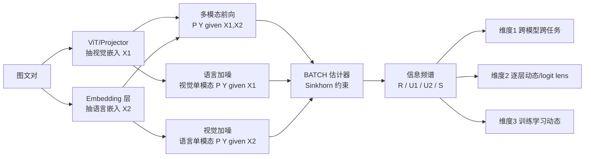

# A Comprehensive Information-Decomposition Analysis of Large Vision-Language Models

**会议**: ICLR 2026  
**OpenReview**: [https://openreview.net/forum?id=6WsBGk4Iag](https://openreview.net/forum?id=6WsBGk4Iag)  
**代码**: [https://github.com/RiiShin/pid-lvlm-analysis](https://github.com/RiiShin/pid-lvlm-analysis)  
**领域**: 可解释性 / 多模态大模型分析  
**关键词**: 偏信息分解(PID), 大视觉语言模型(LVLM), 协同(Synergy), 多模态融合, 信息论, logit lens  

## 一句话总结
本文首次用偏信息分解(Partial Information Decomposition, PID)把 LVLM 的"决策相关信息"拆成冗余/视觉独有/语言独有/协同四个非负原子，构建模型无关的估计流水线，在 26 个模型 × 4 个数据集上从"广度-深度-时间"三个维度量化刻画 LVLM 究竟是靠真正的跨模态融合还是靠语言先验做出预测。

## 研究背景与动机
- **领域现状**：LVLM 在 VQA、图像描述、开放推理上表现亮眼，但内部决策过程不透明。准确率这类聚合指标只反映"对不对"，无法揭示"靠什么对"——是真正融合了视觉证据，还是单纯吃语言先验。
- **现有痛点**：已有的 LVLM 可解释性工作多是"显微镜式"地单独分析某一模态(注意力图、归因热图、线性探针、多模态神经元)，或者引入缺乏理论支撑的 ad hoc 指标；互信息(MI)虽然能度量"总信息量"，但无法把多个输入之间的复杂交互拆解开来。
- **核心矛盾**：要回答"预测主要由视觉、语言、还是二者交互驱动"，需要一个既有严格信息论基础、又能落地到现代高维 LVLM 嵌入上的量化工具，而这个工具当前是缺失的。
- **本文目标**：提供一个跨模型、跨任务、跨层、跨训练阶段都适用的过程级(process-level)分析框架，超越"只看准确率"的评测范式。
- **核心 idea**：**【信息频谱】** 把视觉特征 $X_1$、语言特征 $X_2$ 当作两路输入、模型预测 $Y$ 当作目标，用 PID 把总互信息 $I(X_1,X_2;Y)$ 分解为冗余 $R$、视觉独有 $U_1$、语言独有 $U_2$、协同 $S$ 四个非负原子，称之为模型的"信息频谱"，用它来诊断 LVLM 的内在信息处理策略。

## 方法详解

### 整体框架
给定一个图文对，框架先抽取图像与文本的 mean-pooled token 嵌入作为两路源特征 $X_1$、$X_2$；然后跑一次标准多模态前向得到 $P(Y|X_1,X_2)$，再分别把另一模态嵌入替换成噪声跑两次单模态前向得到 $P(Y|X_1)$ 与 $P(Y|X_2)$；最后把这三个预测分布连同源特征一起送进 BATCH 估计器，求出 $\{R, U_1, U_2, S\}$。整套流水线不改架构、不重训、不用真值标签，因此是纯粹刻画模型行为的过程级描述子。

### 关键设计

**1. PID 频谱与 BATCH 估计器落地：把信息论原子算到高维嵌入上。** PID 之所以比互信息更有用，是因为三变量系统里的交互信息 $I(X_1;X_2;Y)$ 可能为负、难以解释，而 PID 把总信息 $I(X_1,X_2;Y)$ 严格拆成四个非负原子。沿用 Bertschinger 等人的定义，原子在保持源-目标边缘分布不变的分布集合 $\Delta_P$ 上求解：冗余 $R=\max_{Q\in\Delta_P} I_Q(X_1;X_2;Y)$，视觉独有 $U_1=\min_{Q\in\Delta_P} I_Q(X_1;Y|X_2)$，语言独有 $U_2=\min_{Q\in\Delta_P} I_Q(X_2;Y|X_1)$，协同 $S=I(X_1,X_2;Y)-\min_{Q\in\Delta_P} I_Q(X_1,X_2;Y)$。为在 LVLM 的连续高维嵌入上做估计，本文采用 Liang 等人提出的 BATCH 估计器——用神经网络参数化所需分布，在小批量上优化信息论目标，并用 Sinkhorn 算法变体强制满足 $\Delta_P$ 的边缘匹配约束。

**2. 把分析锁定在多选 VQA + 噪声掩码单模态条件：让"单模态预测"既干净又不引入额外组件。** BATCH 要求 $Y$ 是有限集，所以本文刻意选择多选 VQA(如 {A,B,C,D})作为载体——既避开开放式答案聚类带来的噪声和偏置，也无需训练额外投影头(否则估计结果会混入映射超参的影响、说不清到底反映模型本身还是反映映射)。要估单模态条件 $P(Y|X_1)$、$P(Y|X_2)$，本文借鉴 Meng 等人的腐蚀方案，在嵌入层把另一模态整段序列替换为噪声：每个噪声向量 i.i.d. 采自 $\mathcal{N}(\mu, \mathrm{diag}(\sigma^2))$，其中 $\mu,\sigma$ 是该模态嵌入在数据集上预先算好的逐维均值与标准差。这种"校准噪声"在抹掉另一模态的同时，保持嵌入尺度仍在分布内。

**3. 置信度阈值重归一化 + 软聚合输出边缘分布：堵住受限候选集带来的两个度量假象。** 在受限候选集上重归一化容易虚高置信度——当模型在全词表下对所有候选都给低分时，强行归一化会凭空造出结构。为此先算 token 长度归一化的候选得分 $S_{\mathrm{orig}}$，再施加置信度阈值：若候选集总得分 $\sum_{y\in\mathcal{Y}} S_{\mathrm{orig}}(Y{=}y|\cdot)\geq\tau$ 才用归一化分布 $P(Y|\cdot)$，否则退回 $K=|\mathcal{Y}|$ 上的均匀分布 $U(K)$，防止低置信瞎猜污染 PID 计算。另一个假象在于估计输出边缘 $P(Y)$：若先 argmax 再统计频率，完全不确定(均匀)的输出会因 argmax 固定打破平局(总选第一个标签)而被错误地变成尖峰；本文改用软聚合，把所有 $N$ 个样本的正则化预测分布求平均 $P(Y)=\frac{1}{N}\sum_{i=1}^N \hat{P}_i(Y)$，保住模型真实的输出统计，得到更忠实的 PID 分析。

**4. 三维分析协议：广度 × 深度 × 时间。** 框架本身只产出四元频谱，真正的洞察来自三个互补维度的实验设计。广度维度做 26 模型 × 4 数据集的大规模横向对比，并配一个"移除图像测准确率下降 $D_{\mathrm{vision}}$"的行为干预做交叉验证；深度维度在代表性模型(InternVL3-2B/8B、Qwen2.5-VL-3B/7B、LLaVA-1.5-7B/13B)上用 logit lens 把每个 transformer block 的隐状态投到 LM head，得到逐层输出分布做 PID；时间维度复现 LLaVA-1.5(7B/13B)的两阶段训练(视觉-语言对齐预训练 → 视觉指令微调)，每阶段存 4 个等距检查点，刻画融合能力随训练涌现的轨迹。

## 实验关键数据

### 主实验：准确率与 PID 原子的相关性(26 模型上的 Spearman ρ)

| 数据集 | 类型 | $S$ (ρ) | $U_2$ (ρ) | $I(X_1,X_2;Y)$ (ρ) | $I(X_1;X_2;Y)$ (ρ) |
|---|---|---|---|---|---|
| MMBench | 协同驱动 | **0.750** (p<0.001) | 0.194 | 0.632 | -0.757 |
| POPE | 协同驱动 | **0.742** (p<0.001) | -0.009 | 0.157 | -0.701 |
| Reefknot | 知识驱动 | 0.357 (p=0.073) | 0.313 | 0.266 | -0.348 |
| PMC-VQA | 知识驱动 | 0.432 (p=0.027) | **0.406** (p=0.040) | 0.559 | -0.587 |

协同驱动任务上 $S$ 是准确率最强正相关项(ρ≈0.75)；知识驱动任务上 $U_2$ 变得更具预测力(PMC-VQA 上显著)、$S$ 仍有益但不再主导。

### 干预验证：移除图像的准确率下降 $D_{\mathrm{vision}}$ 与 $S$ 的相关

| 数据集 | $D_{\mathrm{vision}}$ vs $S$ (ρ) | p 值 |
|---|---|---|
| MMBench | 0.809 | <0.001 |
| POPE | 0.744 | <0.001 |
| Reefknot | 0.459 | 0.018 |
| PMC-VQA | 0.400 | 0.043 |

$S$ 越高的模型对视觉消融越敏感，确认 $S$ 捕捉到了决策相关的视觉依赖。

### 消融/扩展：协同驱动任务上的规模效应(ΔAcc 与 ΔS、ΔU₂)

| 家族 | 规模(B) | S→M ΔAcc | S→M ΔS | S→M ΔU₂ | M→VL ΔAcc | M→VL ΔS |
|---|---|---|---|---|---|---|
| LLaVA-OneVision | 0.5→7→72 | 11.9 | 11.9 | -6.5 | 3.1 | 14.8 |
| InternVL2.5 | 2→8→78 | 7.3 | 36.8 | -55.6 | 3.6 | 10.6 |
| InternVL3 | 2→8→78 | 2.7 | 2.5 | -6.2 | 6.4 | 4.6 |

语言独有 $U_2$ 的占比并不随规模系统性增大(常常反而下降)；准确率提升更多与 $S$ 的增长同向，推翻了"大模型更靠语言先验"的常见预期。

### 关键发现
- **Finding 1-2(任务层)**：四个 benchmark 落入两种信息使用机制——**协同驱动**(MMBench/POPE，高 $S$)与**知识驱动**(Reefknot/PMC-VQA，低 $S$、高 $U_2$，且后者准确率通常低 20–30%，协同存在"实用天花板")；协同驱动任务准确率主要由 $S$ 决定，知识驱动任务 $U_2$ 更具预测性。
- **Finding 3-4(模型层)**：模型家族呈现两种稳定且对立的策略——**融合中心型**(InternVL2.5/3、Qwen2/2.5-VL，高 $S$ 低 $U_2$)与**语言中心型**(Gemma3、Cambrian，低 $S$ 高 $U_2$)，且这种"策略身份"跨任务机制保持稳定；规模扩大主要强化 $S$ 而非 $U_2$。
- **Finding 5(逐层)**：跨模型/数据集存在一致的**三相位**信息流——信息在中后层涌现，先在后层做基于语言的表征构建($U_2$ 在倒数第二层达峰)，最后一层再做决定性的协同融合($S$ 末层尖峰)；$R$、$U_1$ 全程都很小。
- **Finding 6(训练)**：在 LLaVA-1.5 两阶段训练中，融合 $S$ 在对齐预训练阶段几乎可忽略，**主要在视觉指令微调阶段涌现**；7B 更多增 $S$，13B 更多增 $U_2$。

## 亮点与洞察
- **把"融合"从口号变成可量化的非负标量**：长期以来"多模态融合"是个定性概念，本文用协同 $S$ 给它一个有严格信息论保证的度量，并证明 $S$ 比"总信息量" $I(X_1,X_2;Y)$ 更能解释准确率——好模型不是信息更多，而是更会把重叠线索转化为有效的跨模态协同。
- **三个独立证据链互相印证**：相关性(ρ≈0.75)、行为干预(移除图像 $D_{\mathrm{vision}}$ 与 $S$ 强相关)、家族稳定策略，三者共同支撑"$S$ 捕捉真实视觉依赖"的结论，比单一指标更可信。
- **定位融合的"出生时刻"**：把模糊的"指令微调很重要"细化成"协同 $S$ 几乎全部在视觉指令微调阶段才被解锁"，为后续训练设计(把 PID 当诊断信号甚至辅助目标)提供了可操作抓手。

## 局限与展望
- **离散目标空间的约束**：PID 估计要求 $Y$ 有限，因此框架只覆盖多选 VQA，无法直接分析完全开放式生成任务。
- **单模态探针是近似的**：用校准噪声掩码一个模态虽稳定了估计，但 $U_1$、$U_2$、$S$ 是在这种探针下测得的，并非真正自然的单模态输入下的量。
- **相关而非因果**：PID 原子由模型预测与输入导出，与准确率/干预的关系是关联而非完整因果机制。
- **展望**：开发能处理生成式设置与更多模态的 PID 估计器；把 $(U_1,U_2,S)$ 当作 scaling/指令微调的诊断信号乃至辅助目标；用 PID 指导构造"显式要求高协同 $S$"或"隔离语言先验 $U_2$"的新基准。

## 相关工作与启发
- **VLM 可解释性**：归因热图、注意力图、激活分析(Conmy/Arditi)、线性探针、logit lens、多模态神经元等，多为单模态"显微镜"视角；近期开始分析视觉 token 表示、视觉注意力 sink、跨模态信息流追踪——本文把这些零散视角统一进一个信息论框架。
- **信息论 × 多模态学习**：互信息、信息瓶颈(IB)被广泛用于表示学习与透明度，但 MI 无法拆解多输入交互；PID 在机器学习中尚属新兴(Ehrlich/Liang 等)，本文首次把它用于现代 LVLM 的信息组成、流动与演化分析。
- **启发**：这套"过程级描述子"思路可迁移到任意多输入系统——只要能定义源特征与有限目标、且能做单模态干预，就能用 PID 频谱诊断"系统到底靠哪路信息工作"，对评测设计与模型诊断都有方法论价值。

## 评分
- **新颖性**: ⭐⭐⭐⭐⭐ 首次把 PID 系统性、规模化地用于 LVLM 内部分析，"信息频谱"视角既有理论根基又给出可操作洞察，是真正的范式补充而非增量改进。
- **实验充分度**: ⭐⭐⭐⭐⭐ 26 模型 × 4 数据集，广度/深度/时间三维度全覆盖，并用相关性、行为干预、规模对比、训练轨迹多重交叉验证，结论扎实。
- **写作质量**: ⭐⭐⭐⭐ 逻辑层层递进(任务→家族→层→训练四问环环相扣)，6 条 Finding 表述清晰；但 PID 估计细节与图表密度较高，对非信息论背景读者门槛偏陡。
- **价值**: ⭐⭐⭐⭐⭐ 提供了超越准确率的诊断工具，对理解和设计下一代 LVLM(尤其是判断"是否真融合"、定位融合在训练中何时涌现)有直接指导意义，代码与数据开源。

<!-- RELATED:START -->

## 相关论文

- [\[ICLR 2026\] Neuron-Level Analysis of Cultural Understanding in Large Language Models](neuron-level_analysis_of_cultural_understanding_in_large_language_models.md)
- [\[ICLR 2026\] Inducing Dyslexia in Vision Language Models](inducing_dyslexia_in_vision_language_models.md)
- [\[ACL 2025\] Cracking Factual Knowledge: A Comprehensive Analysis of Degenerate Knowledge Neurons in Large Language Models](../../ACL2025/interpretability/degenerate_knowledge_neurons.md)
- [\[ICLR 2026\] Concepts' Information Bottleneck Models](concepts_information_bottleneck_models.md)
- [\[ICLR 2026\] Linear Mechanisms for Spatiotemporal Reasoning in Vision Language Models](linear_mechanisms_for_spatiotemporal_reasoning_in_vision_language_models.md)

<!-- RELATED:END -->
