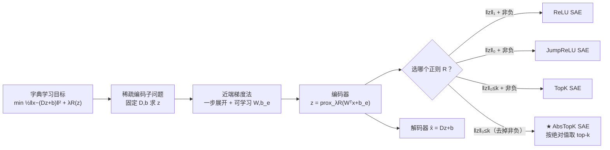

# AbsTopK: Rethinking Sparse Autoencoders For Bidirectional Features

**会议**: ICLR 2026  
**OpenReview**: [https://openreview.net/forum?id=EEs6I4cO7S](https://openreview.net/forum?id=EEs6I4cO7S)  
**代码**: 待确认  
**领域**: 可解释性 / 机制可解释性  
**关键词**: 稀疏自编码器, 字典学习, 近端梯度, 双向特征, 激活引导, LLM 可解释性  

## 一句话总结
本文用「展开近端梯度求解稀疏编码」这一统一框架重新推导 SAE，证明 ReLU / JumpReLU / TopK 都是不同稀疏正则项的近端算子，并指出它们共有的非负约束会把双向语义概念（如男 vs 女）撕裂成两个冗余特征；据此提出去掉非负约束、按绝对值取最大 k 个激活的 **AbsTopK SAE**，让单个特征用正负号编码一对相反概念，在重构、可解释性和引导任务上全面超越 TopK/JumpReLU，并逼平甚至超过有监督的 Difference-in-Mean。

## 研究背景与动机
**领域现状**：稀疏自编码器（SAE）是当前 LLM 机制可解释性的主流工具，把隐藏状态分解成一组过完备的、理想情况下对应可解释概念（金门大桥、谄媚语气、希伯来字符等）的稀疏特征；通过放大/抑制某个特征即可对模型行为做引导。已有 ReLU、JumpReLU、TopK 等多种变体，但它们大多是工程经验上「换个激活函数」拼出来的。

**现有痛点**：① 缺乏一个原则性的框架把这些变体从原始字典学习目标里推导出来，导致无法系统地分析它们各自隐含的正则项和共同短板；② 更要命的是，近期研究发现简单的有监督方法 Difference-in-Mean（DiM，对每个概念用正负样本均值差求一个方向向量）在很多引导基准上反而打得过 SAE——这让人怀疑 SAE 学到的特征是否真的忠实对应模型内部表征。

**核心矛盾**：所有现行 SAE（ReLU/JumpReLU/TopK）的稀疏正则项都**强制激活非负**，只保留正激活。但线性表征假设和经典词类比（$v_{king}-v_{man}+v_{woman}\approx v_{queen}$）都表明：许多语义轴本质上是**双向**的，一个概念方向上正负位移分别代表相反含义（男/女、正/负情感）。非负约束等于砍掉了表征空间的一半，逼着模型要么用两个独立特征分别表示「男」和「女」（碎片化、冗余），要么干脆丢掉一个方向。这正是 SAE 表征不完整、引导不如 DiM 的结构性根源。

**本文目标**：建立从字典学习到 SAE 的统一推导框架，并回答——非负激活对 SAE 是否真的必要？允许负激活能否让 SAE 发现更丰富的双向概念？

**核心 idea**：**「近端展开统一 SAE + 去掉非负约束的 $\ell_0$ 硬阈值」**。把 SAE 编码器理解为稀疏编码近端梯度的一步展开，不同激活函数 = 不同正则项的近端算子；然后选用不带非负约束的纯 $\ell_0$ 约束，其近端算子就是「按绝对值取 top-k」的 AbsTopK，自然保留正负激活。

## 方法详解

### 整体框架
出发点是经典字典学习目标：学一个过完备字典 $D$，使每个 token 隐藏表征 $x$ 都能被稀疏线性组合 $x\approx Dz+b$ 近似重构（$z$ 稀疏）。固定字典后求 $z$ 是稀疏编码问题，可用**近端梯度法**迭代求解；本文取零初始化、步长 1、只走一步，并把固定参数换成可学习的 $W$ 和 $b_e$，于是这一步近端更新 $z=\mathrm{prox}_{\lambda R}(W^\top x+b_e)$ 恰好长成一个 SAE 编码器，再配上解码器 $\hat{x}=Dz+b$。换句话说，**「选哪个稀疏正则 $R$」就等价于「选哪个激活函数」**——这把零散的 SAE 变体统一进同一个近端视角，也直接暴露出它们共同的非负约束短板，进而引出去掉该约束的 AbsTopK。

### 关键设计

**1. 近端展开统一框架：把激活函数还原成正则项的近端算子。** 这是全文的理论地基。从稀疏编码的近端梯度更新 $z^{(t+1)}=\mathrm{prox}_{\mu\lambda R}(z^{(t)}-\mu D^\top(Dz^{(t)}+b-x))$ 出发，取 $z^{(0)}=0$、$\mu=1$ 走一步，并把字典相关的固定量替换成可学习的 $W$（替 $D$）和 $b_e$（替 $-D^\top b$），就得到编码器 $z=\mathrm{prox}_{\lambda R}(W^\top x+b_e)$。论文的 Lemma 1 进一步给出三组对应关系：正则 $R(z)=\|z\|_1+\iota_{\{z\ge0\}}$ 的近端算子是软阈值 $\mathrm{ReLU}_\lambda$；$R(z)=\|z\|_0+\iota_{\{z\ge0\}}$ 对应 $\mathrm{JumpReLU}_{\sqrt{2\lambda}}$；$R(z)=\iota_{\{\|z\|_0\le k,\,z\ge0\}}$ 对应 $\mathrm{TopK}_k$。这一步把「ReLU 为何不如 JumpReLU/TopK」也讲清楚了——ReLU 对应的是 $\ell_1$ 凸松弛（且 $\lambda\to0$），而后两者直接对应 $\ell_0$ 强稀疏正则。关键是，三者的正则项里**都带着非负指示函数 $\iota_{\{z\ge0\}}$**，这就是共同病灶所在。

**2. 去掉非负约束 → AbsTopK 硬阈值算子。** 既然非负约束写在正则项里，那就把它删掉：直接用纯 $\ell_0$ 约束 $R(z)=\iota_{\{\|z\|_0\le k\}}$（不再要求 $z\ge0$）。其近端算子是求解 $\min_z \frac12\|u-z\|_2^2 \ \text{s.t.}\ \|z\|_0\le k$，闭式解为保留 $u$ 中**绝对值最大的 $k$ 个分量、其余置零**，即 $(\mathrm{AbsTopK}_k(u))_i = u_i$ 若 $i\in H_k(u)$ 否则 $0$，其中 $H_k$ 是按模长排序的前 $k$ 个下标。它和 TopK 只差一念之间：TopK 取最大的 $k$ 个正值（隐含一个把负值砍掉的 ReLU），AbsTopK 取模长最大的 $k$ 个并**带符号原样保留**。在压缩感知里这正是经典的硬阈值算子，本文借来作 SAE 的激活函数，组成 $z=\mathrm{AbsTopK}(W^\top x+b_e),\ \hat{x}=Dz+b$，训练目标只需最小化重构误差（$\ell_0$ 约束已隐含在算子里，无需显式 $\lambda$ 罚项）。

**3. 用符号编码双向语义、消除碎片化。** 设计动机来自一个简洁的玩具例子：$man\approx male+people$、$woman\approx female+people$。非负 SAE 因为不能取负，必须分配两个朝向相反的字典原子 $d_i,d_j$（分别配非负激活）来表示「男」和「女」，语义轴被撕成两半且冗余；AbsTopK 只需**一个带符号的「性别」特征**，正激活表示男、负激活表示女，用一个维度紧凑地装下整条双极语义轴（论文 Figure 1 实测：某特征对 man 正激活、对 woman 负激活）。值得强调的是，论文并不强求每个特征都对称双极——对天然单极的概念，AbsTopK 完全可以只用正侧来稀疏编码，等于是把 TopK 作为特例向负方向扩展。这一设计直接解释了后面实验里 AbsTopK 重构更紧、引导更可控的来源。

## 实验关键数据

训练设置：在 monology/pile-uncopyrighted 上训练 JumpReLU / TopK / AbsTopK 三种 SAE，覆盖 GPT-2 Small、Pythia-70M、Gemma-2-2B、Gemma-3-12B、Qwen3-4B、Llama-3.1-8B 等多个模型，从无监督指标、7 项探针/引导任务到安全-效用权衡全面评测。

### 主实验表格（引导安全性 vs 通用能力，节选 Table 1，括号为相对原模型变化）

| 模型 | 层 | 指标 | Original | JumpReLU | TopK | **AbsTopK** | DiM(有监督) |
|------|----|------|---------|----------|------|-------------|-------------|
| Qwen3-4B | 18 | MMLU↑ | 77.3 | 75.0(-2.3) | 75.2(-2.1) | **75.9(-1.4)** | 75.8(-1.5) |
| Qwen3-4B | 18 | HarmBench↑ | 17.0 | 79.1(+62.1) | 78.2(+61.2) | **81.3(+64.3)** | 80.6(+63.6) |
| Gemma2-2B | 12 | MMLU↑ | 52.2 | 48.8(-3.4) | 49.1(-3.1) | **51.3(-0.9)** | 51.0(-1.2) |
| Llama3.1-8B | 24 | HarmBench↑ | 15.2 | 89.9(-) | 89.2(-) | 91.3(+76.1) | **92.4(+77.2)** |

读法：常规 SAE 提升安全（HarmBench）但严重掉通用能力（MMLU）；AbsTopK 在大幅提升安全的同时把 MMLU 跌幅压到最小，安全-效用权衡最优；相比需要标注数据、只能抽单一概念的 DiM，AbsTopK 安全性相当（偶尔略低），但通用能力保留更好。

### 消融/对比（特征双向性，Table 2，Gemma-2-2B，Gemini 2.5 自动判读）

| 类别 | AbsTopK(L12) | TopK(L12) | AbsTopK(L16) | TopK(L16) |
|------|-------------|-----------|-------------|-----------|
| 双向有意义(全部) | 29.7% | 5.3% | 31.2% | 4.1% |
| ↳ 正负为相反语义 | 20.2% | 2.6% | 21.5% | 1.8% |
| 单向有意义 | 56.4% | 78.8% | 57.8% | 80.3% |
| 无明确含义 | 13.9% | 15.9% | 11.0% | 15.6% |

### 关键发现
- **重构与语言建模**：在 Qwen3-4B Layer 20 上，AbsTopK 训练 MSE 更低、归一化重构误差在多数稀疏度下最小，同时 Loss Recovered（保留原模型预测能力）最高，三项无监督指标全面占优。
- **7 项探针/引导任务**：AbsTopK 在 Unlearning、Absorption、SCR、TPP、RAVEL、Sparse Probing 上整体超过 TopK 和 JumpReLU，在 SCR 这类直接衡量双向干预可靠性的指标上优势尤其明显。
- **双向性来源不是噪声**：AbsTopK 与 TopK 的「无明确含义」特征占比相当（~11-16%），说明多出来的双向特征不是更吵的噪声特征；TopK 本身也有少量「相反含义」特征（2-3%），说明底层表征本就支持双向语义轴，只是非负约束没让它充分利用，而 AbsTopK 把大量单向特征「转正」成两端都有意义的方向（双向占比从 ~5% 提到 ~30%）。

## 亮点与洞察
- **理论统一的优雅**：用「一步近端梯度展开 + 可学习参数」把 ReLU/JumpReLU/TopK 三个看似不同的 SAE 收进同一个公式，激活函数 = 正则项的近端算子，顺手解释了「ReLU 不如 JumpReLU/TopK」（$\ell_1$ 松弛 vs $\ell_0$ 强稀疏）这一既有经验现象。
- **改动极小、收益极大**：AbsTopK 相对 TopK 只是把「取最大正值」换成「按模长取最大值并保留符号」，一行代码级改动，却解锁了双向特征、显著缩小了与有监督 DiM 的差距。
- **问题诊断精准**：把「SAE 为何打不过简单的 DiM」归因到非负约束导致的语义碎片化，并用玩具例子（man=male+people）和自动判读实验双向佐证，因果链清晰。
- **可控性洞察**：双向特征对引导任务尤其重要——很多干预需要沿语义轴正反两个方向移动，单向特征天然做不到。

## 局限与展望
- **只验证了 $\ell_0$/AbsTopK 一条路**：论文指出硬阈值同样可推广到 JumpReLU（对正负激活都设阈值），但为隔离「双向轴」这一核心假设没做，留作未来工作。
- **单步近端是近似**：编码器只走一步近端梯度，是稀疏编码精确解的近似；多步展开（多层编码器）可能给出更准的稀疏码、捕捉更细结构，但计算更贵，本文未展开。
- **$\ell_0$ 算子的可扩展性**：AbsTopK 依赖 top-k 硬阈值，论文最后呼吁研究更高效、更符合神经可塑性的 $\ell_0$ 近似，以适配超大规模模型。
- **评测依赖 LLM 自动判读**：双向性分类用 Gemini 2.5 Flash 打标，存在判读偏差风险，缺少大规模人工核验。

## 相关工作与启发
本文站在三条线的交汇处：① SAE 变体谱系（ReLU SAE、JumpReLU、TopK），本文把它们统一进近端框架并指出共病；② 字典学习与近端/展开网络（ISTA、LISTA、proximal gradient、硬阈值/压缩感知），AbsTopK 本质是把压缩感知的硬阈值算子引入 SAE；③ 有监督引导方法 DiM 与线性表征假设，本文用它作为「双向轴」证据和强基线。对后续研究的启发很直接：稀疏可解释性工具的设计应当从「换激活函数」升级为「选正则项」，并重新审视那些被默认接受的约束（如非负性）是否在悄悄牺牲表征完整性；把信号处理/优化里的成熟算子（近端、展开、硬阈值）系统迁移到可解释性，是一条值得继续挖的路。

## 评分
- **新颖性**: ⭐⭐⭐⭐⭐ 统一近端框架 + 去非负约束的 AbsTopK，把零散 SAE 变体收进一个理论并精准点出共同短板，视角新且有解释力。
- **实验充分度**: ⭐⭐⭐⭐ 覆盖 4-6 个模型、多层、3 项无监督指标 + 7 项探针/引导任务 + 安全-效用权衡 + 双向性自动判读，相当全面；略欠多步展开、JumpReLU 硬阈值变体和人工核验。
- **写作质量**: ⭐⭐⭐⭐⭐ 理论推导（Lemma 1 三组近端算子对应）干净，玩具例子和 Figure 1/2 把直觉讲透，问题诊断到方案的因果链清晰。
- **价值**: ⭐⭐⭐⭐⭐ 一行代码级改动让 SAE 逼平甚至超过有监督 DiM，并解锁双向可控引导，对机制可解释性社区有直接实用价值和方法论启发。

<!-- RELATED:START -->

## 相关论文

- [\[ICLR 2026\] Sparse Autoencoders Trained on the Same Data Learn Different Features](sparse_autoencoders_trained_on_the_same_data_learn_different_features.md)
- [\[ICLR 2026\] Learning Multimodal Dictionary Decompositions with Group-Sparse Autoencoders](learning_multimodal_dictionary_decompositions_with_group-sparse_autoencoders.md)
- [\[ICLR 2026\] Toward Faithful Retrieval-Augmented Generation with Sparse Autoencoders](toward_faithful_retrieval-augmented_generation_with_sparse_autoencoders.md)
- [\[ICLR 2026\] On the Limits of Sparse Autoencoders: A Theoretical Framework and Reweighted Remedy](on_the_limits_of_sparse_autoencoders_a_theoretical_framework_and_reweighted_reme.md)
- [\[ICLR 2026\] Uncovering Conceptual Blindspots in Generative Image Models Using Sparse Autoencoders](uncovering_conceptual_blindspots_in_generative_image_models_using_sparse_autoenc.md)

<!-- RELATED:END -->
