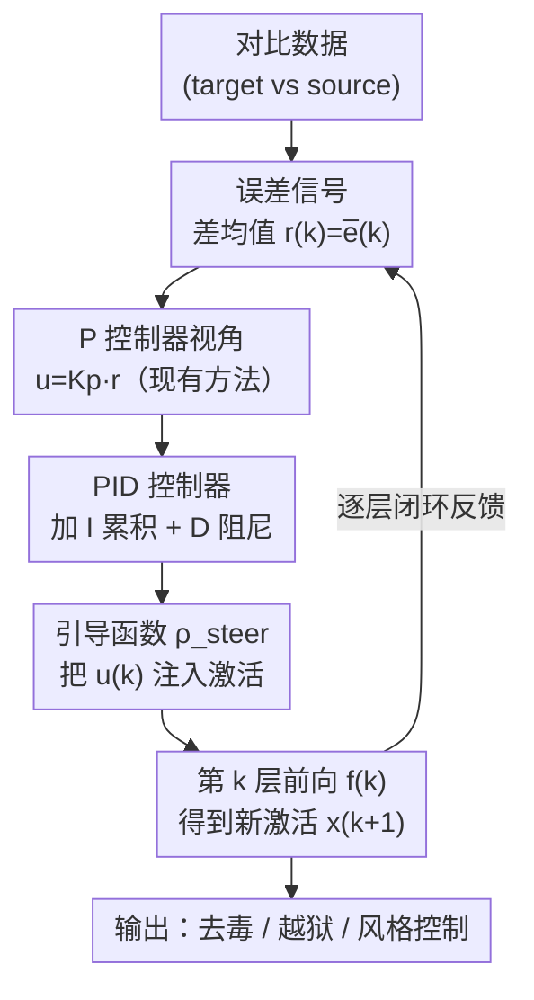

# Activation Steering with a Feedback Controller

**会议**: ICLR2026  
**OpenReview**: [https://openreview.net/forum?id=vzkEX2SwFD](https://openreview.net/forum?id=vzkEX2SwFD)  
**代码**: https://github.com/dungnvnus/pid-steering  
**领域**: 可解释性 / 激活引导（Activation Steering）  
**关键词**: 激活引导, 控制理论, PID 控制器, 稳态误差, 安全对齐

## 一句话总结
本文把 LLM 激活引导（activation steering）重新解释成控制理论里的反馈控制问题，证明 ActAdd / DirAblate / Mean-AcT 这些主流方法本质上都是只有比例项的 P 控制器、因而带有消不掉的稳态误差，进而提出用完整的 PID 控制器来计算引导向量（PID Steering），在去毒、越狱、图像风格控制等任务上稳定超过原方法。

## 研究背景与动机
**领域现状**：要让大模型的行为对齐到期望（少说有毒内容、拒绝有害请求、改变生成风格），除了代价高昂的后训练（SFT/RLHF），一条越来越流行的轻量路线是**激活引导**——在推理时直接往模型某些层的隐藏状态里加一个「引导向量」（steering vector），把激活从表达概念 A 的区域推向表达概念 B 的区域。引导向量一般用「差均值」（difference-in-means）算：拿两组对比数据（如有害 vs 无害提示）在每层激活的均值相减，得到一个方向 $r(k)=\mu_{\text{target}}(k)-\mu_{\text{source}}(k)$。

**现有痛点**：这些方法（ActAdd 直接加 $x+\alpha r$、DirAblate 把激活投影到 $r$ 的正交补、Mean-AcT 逐层增量估计）几乎全是**经验驱动**的，缺乏理论性能保证。更要命的是，作者发现它们都有一个共同的隐疾：引导效果会**残留一个消不掉的偏差**——你想把误差推到零，它总是停在一个非零的平台上。

**核心矛盾**：根本原因在于这些方法只盯着「当前层的误差」做修正，修正量正比于当前误差。这在控制理论里恰好就是**纯比例（P）控制器**的形态，而 P 控制器的经典缺陷就是存在**稳态误差**（steady-state error）：当系统受到持续扰动时，单靠比例项无论增益调多大都消不掉残余偏差，而增大增益又会引发振荡。LLM 的自回归、逐层传递正是这样一个带扰动的动态系统，但过去的代数视角（把激活空间当静态几何）把这层动态结构完全忽略了。

**本文目标**：（1）给激活引导一个严格的控制论框架；（2）找到一种能消除稳态误差、又不引入剧烈振荡/超调的引导向量计算方式。

**切入角度**：既然现有方法 = P 控制器，那么控制理论里早就有现成的解药——**积分项（I）**专门用来消除稳态偏差，**微分项（D）**专门用来抑制超调。把三者合起来就是工业界用了一百年的 **PID 控制器**。

**核心 idea**：用完整的 PID 控制器代替隐式的 P 控制器来计算引导向量——P 项对齐目标语义方向、I 项跨层累积误差以消除持续偏差、D 项抑制激活的剧烈变化以减小超调，从而把激活引导接到控制理论的稳定性保证上。

## 方法详解

### 整体框架
把 LLM 的逐层前向 $x(k{+}1)=f^{(k)}(x(k))$ 看作一个离散时间动态系统的状态演化，引导向量就是施加在这个系统上的「控制输入」$u(k)$。控制目标是让两组对比数据在每层的激活差（误差信号）$\bar e(k)$ 收敛到零——也就是让被引导的那一支彻底变成目标行为。整条流水线是一个**逐层闭环**：在每一层，用对比数据的差均值算出误差信号 $r(k)\!=\!\bar e(k)$，送进一个 PID 控制器算出引导向量 $u(k)$，再通过引导函数 $\rho_{\text{steer}}$ 把 $u(k)$ 注入激活，前向一层得到新激活，新激活又决定下一层的误差信号——这就构成了反馈回路。

本文的关键不是发明一个新模块，而是**重新解释 + 升级**：先证明「现有方法 = P 控制器」（只用 $K_p r(k)$），再把控制器升级成 PID（加上对历史误差的积分和对误差变化率的微分）。因为 PID 只改「怎么算 $u(k)$」这一步，它是一个**即插即用**的替换件，可以套在 ActAdd / DirAblate / Mean-AcT 任意一个引导范式之上（套在 Mean-AcT 上就叫 PID-AcT）。

### 关键设计

**1. 把激活引导重写成状态反馈 P 控制器：揭示稳态误差的根源**

这是全文的「地基」。作者把连续时间的状态反馈控制器 $\dot x(t)=g(x(t),u(t),t)$ 离散化（欧拉法），并令系统动态为 $g=f(\rho_{\text{steer}}(x,u),t)-x$，得到 $x(k)=f^{(k)}(\rho_{\text{steer}}(x(k{-}1),K_p r(k{-}1)))$。把它和现有引导方法的更新式 $x(k)=f^{(k)}(\rho_{\text{steer}}(x(k{-}1),r(k{-}1)))$ 一对比，立刻看出：**现有方法就是取控制输入 $u(k)=K_p r(k)$ 的纯 P 控制器**，其中差均值向量 $r(k)$ 扮演的正是「状态跟踪误差」$e(k)=x_{\text{sp}}(k)-x(k)$ 的角色（$x_{\text{sp}}$ 是 setpoint，即目标状态）。配上不同的 $\rho_{\text{steer}}$ 和误差计算方式，就分别还原出 ActAdd（$x+\alpha u$，非序列）、DirAblate（投影到正交补）、Mean-AcT（$x+\alpha u$，序列）。

有了这个等价，命题 1 给出理论判决：P 控制的激活引导能保证**输入到状态稳定（ISS）**，但只要系统存在持续扰动 $w(k)$，误差就会收敛到一个**正比于扰动的非零稳态值** $\bar e_{ss}\propto w$。也就是说，所有这些方法天生就消不掉残余偏差——这不是调参问题，是控制器结构问题。

**2. PID Steering：用积分项消偏差、微分项抑超调**

既然 P 控制器结构上就有缺陷，作者直接把控制输入升级成完整 PID。连续时间下 $u(t)=K_p r(t)+K_i\!\int_0^t r(\tau)d\tau+K_d\frac{dr(t)}{dt}$，经 Lemma 1 离散化后得到本文的核心公式：

$$u(k)=K_p\,r(k)+K_i\sum_{j=0}^{k-1} r(j)+K_d\big(r(k)-r(k-1)\big).$$

三项各司其职、且动机非常具体：**P 项** $K_p r(k)$ 对当前误差做即时修正，让引导对每层的语义方向有响应；**I 项** $K_i\sum_{j<k} r(j)$ 把前面所有层的误差累加起来，相当于「记住」了被 P 项漏掉的那一点点持续偏差，从而把稳态误差也补上——这正是 P 控制器缺的那块；**D 项** $K_d(r(k)-r(k{-}1))$ 盯着误差的**变化率**，当误差掉得太快时反向拉一把，阻尼掉 I 项带来的过冲。注意这里的「时间」就是 LLM 的**层索引 $k$**：积分 = 沿层累加，微分 = 相邻层之差，PID 完全在前向方向上逐层展开，不需要任何额外训练或权重更新。

**3. 序列式 vs 非序列式的误差信号计算：尊重逐层因果**

PID 公式里的误差信号 $r(k)$ 怎么算，本文沿用了两种口径。**非序列式**直接在原始（未引导）激活上算差均值 $r(k)=\mathbb{E}_{\text{target}}[x_{\text{sp}}(k)]-\mathbb{E}_{\text{source}}[x(k)]$，简单但忽略了「上一层的干预会改变下一层激活」这一因果依赖。**序列式**（继承自 Mean-AcT）则先把上一层算好的 $u(k{-}1)$ 真正注入、前向得到 $\tilde x(k)$，再在这个被干预过的激活上算差均值。后者更贴合闭环控制的本意——每一层的修正都建立在「前面已经修过」的状态之上，避免重复或冲突的干预。本文的主力配置 PID-AcT 用的就是序列式。

**4. 稳定性的理论保证：ISS + 消偏差 + 抑超调三件事都证了**

为了不让 PID 停在「经验有效」，作者补了一套定理。命题 3 证明：在合适增益下 PI 闭环仍是 ISS，且**积分项能精确抵消扰动中「可匹配」的分量** $w_\parallel$（落在雅可比像空间里的那部分），只剩下无法补偿的正交分量 $w_\perp$——这从理论上说清了为什么 PI 能消掉 P 留下的稳态误差。但 PI 会**超调**（高积分增益下绕着 setpoint 反复振荡才稳定下来）。于是定理 1 证明加上 D 项后闭环依然 ISS、且**保留**了积分项消偏差的能力；定理 2 进一步证明 **PID 的首次超调幅度不超过 PI 的**（$A_0^{\text{PID}}\le A_0^{\text{PI}}$）。三条合起来：PID 既消了 P 的稳态误差，又压住了 PI 的振荡。

### 一个完整示例
以越狱（jailbreak）任务为例走一遍：拿 ADVBENCH 的有害提示作 source、ALPACA 的无害提示作 target，逐层算「拒绝方向」的差均值 $r(k)$。在第 $k$ 层，PID 控制器把当前层误差（P）、前 $k{-}1$ 层累积误差（I）、与上一层的误差差（D）加权合成引导向量 $u(k)$，通过 ActAdd 式注入把激活沿「不拒绝」方向推。逐层闭环跑下来，被引导支的误差从 P 单独时停在非零平台（图 3 蓝线），变成 PID 时穿过零点并干净收敛（绿线，且超调远小于 PI 的红线）——最终模型对原本会拒绝的有害请求给出回应，攻击成功率（ASR）随之升高。

## 实验关键数据
覆盖文本与图像两种模态、三类下游任务（去毒、越狱、图像风格控制）、三种引导范式（ActAdd、Mean-AcT、Angular Steering）、多个模型家族（Qwen2.5、Gemma2、Llama3，3B–14B；扩散模型 SDXL-Lightning、Flux）。

### 主实验：去毒（Toxicity Mitigation）
在 RealToxicityPrompts 上，PID-AcT 取得最强的毒性下降同时几乎不损通用能力（PPL / MMLU 基本持平）。下表为 Gemma2-2B（上）与 Llama3-8B（下）节选，越低越好（毒性/PPL），MMLU 越高越好：

| 模型 | 方法 | CLS 毒性(%)↓ | 0-shot 毒性(%)↓ | QVQ(%)↓ | PPL-Wiki↓ | MMLU↑ |
|------|------|----|----|----|----|----|
| Gemma2-2B | Original | 4.17 | 13.42 | 14.17 | 13.98 | 53.1 |
| Gemma2-2B | Mean-AcT (Seq.) | 0.68 | 3.23 | 3.70 | 14.92 | 51.80 |
| Gemma2-2B | **PID-AcT (Ours)** | **0.51** | **2.90** | **3.40** | 15.22 | 51.30 |
| Llama3-8B | Original | 5.80 | 15.00 | 15.81 | 9.06 | 65.30 |
| Llama3-8B | Mean-AcT (Seq.) | 1.21 | 5.09 | 5.73 | 9.83 | 64.22 |
| Llama3-8B | **PID-AcT (Ours)** | **0.72** | **4.36** | **4.90** | 9.56 | 64.50 |

作者报告 PID-AcT 把毒性最多降到原模型的约 **1/8.2（Gemma2）和 1/8.1（Llama3）**，在序列家族（Mean-AcT / Linear-AcT）内排第一，也超过 ActADD / AURA / ITI-C / CAA 等编辑类基线。

### 主实验：越狱（Jailbreaking, ASR↑）
在 Angular Steering 框架内把差均值方向（DIM）替换成本文方法，与 ITI、RePE 比攻击成功率（ASR），同时用 tinyBenchmarks 监测通用能力不塌：

| 模型 | 方法 | ASR↑ | tinyMMLU↑ | tinyHellaSwag↑ |
|------|------|----|----|----|
| Qwen2.5 系 | DIM | 74.03 | 66.11 | 72.40 |
| Qwen2.5 系 | ITI | 70.19 | 66.62 | 72.71 |
| Qwen2.5 系 | RePE | 68.44 | 65.70 | 72.03 |
| Qwen2.5 系 | **PID (ours)** | **76.07** | 67.29 | 72.59 |

PID 在 ASR 上居首且通用基准几乎无损（如 tinyMMLU 反而略高于 DIM）。

### 关键发现
- **误差曲线最有说服力**：图 3 中 P 控制（蓝）衰减后停在非零平台 = 稳态误差；PI（红）穿过零点但有大幅过冲；PID（绿）同样收敛到零、过冲显著更小——三条曲线精确对应命题 1 / 命题 3 / 定理 2 的理论预测。
- **I 项消偏差、D 项压振荡**：消融上把方法从 P→PI→PID，依次看到「稳态误差被消除」和「超调被抑制」，证明两项各自不可替代。
- **代价主要来自底座框架而非本方法**：PID-AcT 的 MMLU 略低于非 AcT 方法，作者归因于 AcT 框架本身的性质，而非 PID。

## 亮点与洞察
- **一个等价把一类方法全部「收编」**：证明 ActAdd / DirAblate / Mean-AcT 都是 P 控制器，这种「先统一、再升级」的叙事极其干净——升级 P→PID 立刻惠及整族方法，而不是只赢一个 baseline。
- **把「时间轴」放在层维度上**：积分 = 沿层累加、微分 = 相邻层差，让一百年的 PID 理论无缝套进 LLM 前向，且零训练零权重更新，这个映射本身就很「啊哈」。
- **理论与曲线对得上**：稳态误差、超调这些控制论概念都给出了可观测的标量信号 $\langle\bar e(0),\bar e(k)\rangle$ 并画出来验证，不是空头理论。
- **可迁移**：把推理时干预看成反馈控制的视角，可推广到扩散模型引导、agent 行为约束等任何「逐步施加修正」的场景——本文已在扩散模型图像风格控制上验证了通用性。

## 局限与展望
- **无法补偿的正交扰动**：命题 3 明确指出积分项只能消掉扰动中落在雅可比像空间里的「可匹配」分量 $w_\parallel$，正交分量 $w_\perp$ 原理上消不掉——PID 不是万能解。
- **多了 $K_p,K_i,K_d$ 三个增益要调**：相比单一 $\alpha$，PID 引入更多超参，论文给了稳定性条件（如 $q+Mh<1$）但实际调参成本和敏感性还需更系统的探究。
- **越狱作为「能力」展示的双刃剑**：用 ASR 升高来证明方法有效，本质是在演示如何更强地绕过安全机制；这套技术既能对齐也能被滥用，部署侧需要配套防护。
- **理论建立在局部线性化（雅可比）之上**：误差动态用均值局部雅可比 $\bar A(k)$ 刻画，对强非线性层的近似程度、以及离散化（欧拉法）误差的影响，正文未深入。⚠️ 部分公式细节以原文 Appendix 为准。

## 相关工作与启发
- **vs ActAdd / DirAblate / Mean-AcT（差均值系）**：它们直接用差均值当引导向量，本文证明这等价于纯 P 控制、带稳态误差；本文用 PID 在不改框架的前提下消除该误差，是对整族方法的「升级补丁」而非另起炉灶。
- **vs token 级控制论工作（Luo 2023 / Soatto 2023 / Kong 2024）**：它们把控制论用在 token 级生成过程、把高层行为当控制信号；本文深入到**层级特征方向的构造**，把逐层激活演化建模成动态系统，控制粒度更细。
- **vs CAA / ITI-C / AURA 等激活编辑基线**：这些方法各有经验技巧，本文则给出统一的控制论框架与稳定性保证，并在去毒/越狱上稳定超过它们。

## 评分
- 新颖性: ⭐⭐⭐⭐⭐ 把整族激活引导方法统一成 P 控制器、再用 PID 升级，视角新颖且解释力强
- 实验充分度: ⭐⭐⭐⭐ 跨模态/任务/模型族验证充分，理论曲线与命题对得上；扩散模型部分相对略简
- 写作质量: ⭐⭐⭐⭐ 「先统一后升级」的叙事清晰，定理与图示呼应；公式密集对非控制论背景读者门槛偏高
- 价值: ⭐⭐⭐⭐⭐ 即插即用、零训练，给推理时行为控制接上经典控制理论的保证，实用且有理论深度

<!-- RELATED:START -->

## 相关论文

- [\[ICML 2026\] Closing the Loop: PID Feedback Control for Interpretable Activation Steering in Symbolic Music Generation](../../ICML2026/interpretability/closing_the_loop_pid_feedback_control_for_interpretable_activation_steering_in_s.md)
- [\[NeurIPS 2025\] CBMAS: Cognitive Behavioral Modeling via Activation Steering](../../NeurIPS2025/interpretability/cbmas_cognitive_behavioral_modeling_via_activation_steering.md)
- [\[ICML 2026\] Steer Like the LLM: Activation Steering that Mimics Prompting](../../ICML2026/interpretability/steer_like_the_llm_activation_steering_that_mimics_prompting.md)
- [\[ICLR 2026\] Emergent Discrete Controller Modules for Symbolic Planning in Transformers](emergent_discrete_controller_modules_for_symbolic_planning_in_transformers.md)
- [\[ICLR 2026\] REAL: Reading Out Transformer Activations for Precise Localization in Language Model Steering](real_reading_out_transformer_activations_for_precise_localization_in_language_mo.md)

<!-- RELATED:END -->
