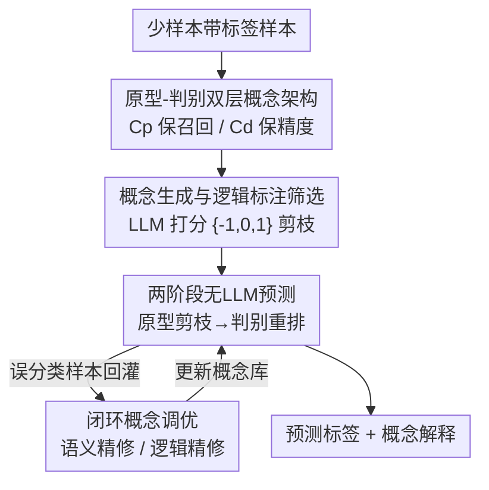

# Adaptive Concept Discovery for Interpretable Few-Shot Text Classification

**会议**: ICLR2026  
**OpenReview**: [https://openreview.net/forum?id=UZBQ7iZzYz](https://openreview.net/forum?id=UZBQ7iZzYz)  
**代码**: https://github.com/alexiszlf/StructCBM  
**领域**: 可解释性 / 概念瓶颈模型 / 少样本文本分类  
**关键词**: 概念瓶颈模型, 少样本学习, 文本分类, 可解释性, LLM 概念生成

## 一句话总结
StructCBM 把概念瓶颈模型（CBM）改造成"只靠样本-概念相似度做预测、完全不训练分类头"的范式：用 LLM 从极少量样本里生成"原型概念 + 判别概念"两层概念库，靠两阶段相似度匹配（先召回候选标签、再对比定夺）做出可解释预测，并用"误分类回灌 LLM 精修概念"的闭环把概念越调越准——10-shot 下就超过所有现有 CBM，在语义密集的数据集上逼近直接调用 LLM 的黑盒效果，且推理阶段不再需要 LLM。

## 研究背景与动机
**领域现状**：少样本文本分类是真实业务里的高频需求。当前最强的做法是直接用大语言模型（LLM）做 in-context learning 或零样本预测，效果确实漂亮。

**现有痛点**：LLM 有两个绕不开的硬伤——一是推理成本高，要对大规模数据逐条调用大模型，贵且慢；二是"黑盒"，在金融、医疗、法律这类需要决策可审计的场景里，无法给出可信的解释。概念瓶颈模型（CBM）本是天然的"白盒"替代品：它强制让预测经过一层人类可读的概念，从而给每个决策一个忠实的解释。但既有的 LLM 增强 CBM 在少样本下集体失灵——它们要么像 TBM、BC-LLM 那样推理时还得反复调 LLM（没省成本），要么像 CB-LLM、SparseCBM 那样需要大量数据训练一个"概念→标签"的预测层（没法少样本）。

**核心矛盾**：CBM 把预测拆成"概念匹配函数 $f(\cdot)$ + 白盒预测模型 $g(\cdot)$"两段，瓶颈在 $g(\cdot)$——它要把概念激活映射到标签，必须靠数据训练。少样本下数据根本不够训出一个可靠的 $g(\cdot)$。此外，现有方法把"文本-概念相似度"当成一个监督学习目标去拟合，使得概念本身无法被迭代修正。

**本文目标**：造一个真正适配少样本、推理时不依赖 LLM、且概念可迭代精修的 CBM。

**切入角度**：作者的关键观察是——既然 $g(\cdot)$ 训不动，那就干脆把它消掉。利用 LLM 丰富的先验知识，在概念和标签之间建立显式的一一对应，于是 $g(\cdot)$ 退化成一个静态映射（哪个概念属于哪个标签是写死的），整个预测的优化压力全部转移到"概念表示 $f(\cdot)$"上，而概念正好是 LLM 最擅长生成的东西。

**核心 idea**：从概率视角把预测 $P(y|x,C)$ 用"粗到细"拆开：$P(y|x,C)=\sum_{Y_k\subset Y}P(y|Y_k,x,C)P(Y_k|x,C)$，即先召回包含真值的 top-$k$ 候选标签集 $Y_k$（召回导向），再在候选里定夺 top-1（精度导向）。一个扁平的概念库同时干这两件事并不理想，所以用两套专门的概念——**原型概念** $C_p$ 保召回、**判别概念** $C_d$ 保精度——配上"生成-预测-精修"的闭环工作流。

## 方法详解

### 整体框架
StructCBM 的输入是少量带标签样本（每类 10 条甚至 1 条）和待分类文本，输出是预测标签 + 一条可读的概念解释。整条流水线是一个"生成 → 预测 → 精修"的闭环：先让 LLM 从样本里生成两层概念库（原型 $C_p$ + 判别 $C_d$）并做逻辑标注筛选；预测阶段彻底甩开 LLM，只用文本嵌入相似度做两步决策——原型剪枝召回候选，判别重排定夺；预测产生的误分类样本再回灌 LLM，触发语义/逻辑两种精修把概念库越调越准；最后还可选地微调嵌入模型让相似度算得更准。

### 关键设计

**1. 原型-判别双层概念架构：把召回和精度交给两套专门的概念**

这一层直接对应"扁平概念库同时管召回和精度会顾此失彼"的痛点。作者把概念库拆成两个结构互补的子集。**原型概念集** $C_p=\bigcup_{y_i\in Y}C_p^i$ 按类组织，每个子集 $C_p^i$ 与标签 $y_i$ 一一对应，捕捉"这一类的核心共性特征"（如新闻分类里"体育类"的典型表述），目标是高召回——保证真值标签能进候选。**判别概念集** $C_d=\bigcup_{y_i\neq y_j}C_d^{i,j}$ 按类对组织，每个 $c_d^{i,j}$ 提供"$y_i$ 有、而易混类 $y_j$ 几乎没有"的细粒度对比证据，目标是高精度——在候选里把易混类分开。从因果视角看，这套架构对每个预测同时回答了"为什么是 $y_i$"（靠 $C_p$）和"为什么不是易混的 $y_j$"（靠 $C_d$），构成一个充分的解释。正是因为标签↔概念是写死的一一对应，预测层 $g(\cdot)$ 才能退化成静态映射，从而绕开少样本训不动分类头的死结。

**2. 概念生成与逻辑标注筛选：用差异化提示生成、再用 LLM 打分剪掉废概念**

两套概念用不同策略生成以保证各自的功能。$C_p$ 要高召回，于是把同一目标类的多个样本喂给 LLM，让它归纳共有特征；$C_d$ 要高区分度，于是把 $y_i$ 和 $y_j$ 两类样本一起喂进去，让 LLM 找"$y_i$ 特有而 $y_j$ 罕见"的概念。每个概念都带一个名字（标识用）和一段人类可读的描述（描述会被转成向量嵌入用于相似度匹配，所以提示里明确要求描述要语义丰富）。判别概念两两生成带来 $O(|Y|^2)$ 的开销，类别多时（$|Y|\gg10$）可先按 $C_p$ 相似度聚类、只对 top-$K$ 语义近邻生成 $C_d$，把复杂度降到 $O(|Y|K)$。生成之后用逻辑标注筛掉在少样本上不起作用的低质概念：对样本 $x_i$ 和概念 $c$，让 LLM 打一个 $a(x_i,c)\in\{-1,0,1\}$ 的分（矛盾/无关/逻辑一致）；原型概念 $c_p^i$ 要有足够比例的同类样本判为一致才被选中，判别概念 $c_d^{i,j}$ 则要求目标类样本得正分、对比类样本得非正分。这一步把"LLM 随手生成的一堆概念"压成"在你这点数据上确实管用的概念"。

**3. 两阶段无LLM预测：先原型剪枝召回、再判别重排定夺**

概念库一旦建好，推理就变成纯嵌入相似度计算，彻底告别 LLM 调用，这是省成本的关键。相似度用余弦 $\text{sim}(x,c)=\cos(e(x),e(c))$。**Stage 1 原型剪枝**：对每类算原型支持分 $s_p^i(x)=\frac{1}{m}\sum_{c_p^i\in\text{top-}m(C_p^i,x)}\text{sim}(x,c_p^i)$，即取该类 top-$m$ 个最相关原型概念的平均相似度，再取分数最高的 top-$k$ 类组成候选集 $Y_k$，把标签空间裁到最可能的几个。**Stage 2 判别重排**：只在候选里做细粒度对比，对候选对 $(y_i,y_j)$ 算相对判别分 $s_d^{i,j}(x)=\max\{\text{sim}(x,c_d^{i,j})\}-\max\{\text{sim}(x,c_d^{j,i})\}$（$y_i$ 一侧的最强判别证据减去 $y_j$ 一侧的），再聚合成净判别分 $s_d^i(x)=\sum_{y_j\in Y_k,j\neq i}s_d^{i,j}(x)$。最终分把原型证据和判别证据加权融合 $s^i(x)=\alpha\cdot s_p^i(x)+(1-\alpha)\cdot s_d^i(x)$，取最高者为预测。这个层级决策（先粗筛后细分）天然对应人类推理过程，每一步都透明可解释。

**4. 闭环概念调优 + 嵌入微调：误分类回灌，把概念越调越准**

预测产生的误分类样本不会被浪费，而是作为反馈回灌 LLM 闭合学习循环。**语义精修**针对两类错误对症下药：召回错误（真值没进候选）时找相关原型概念 $c_p$，让 LLM 生成多个改写版本，选"与所有支持样本平均相似度最大"的版本替换原概念；排序错误（候选里选错）时找最具误导性的判别概念 $c_d$，重写其描述使它与错误样本的相似度最小化。为了防止概念漂移、避免过拟合到单个错误样本，作者加了正则约束：任何更新后的概念必须保持或提升它对"已正确匹配的正样本集"的平均相似度（消融里这个 Reg. 约束把 SST-2 从精修过拟合的 0.7677 救回到 0.8127）。语义精修救不动的硬样本则触发**逻辑精修**——把硬样本作为定向输入，重新走一遍概念生成专门覆盖它们。最后还有可选的**嵌入模型微调**：用"支持同一标签的样本-概念对"构造训练数据 $P$，以余弦相似度损失 $\hat{e}=\arg\min_e\sum_{(x_i,c_j)\in P}\|\delta(i,j)-\cos(e(x_i),e(c_j))\|^2$（$\delta(i,j)=1$ 当 $i=j$ 否则 0）对齐表示空间。判别概念因缺乏可泛化信息被排除在合成数据外。作者强调微调不损害可解释性，因为预测仍诚实地经由概念产生。

### 损失函数 / 训练策略
StructCBM 没有传统意义上端到端训练的分类器——这正是它的卖点。唯一的参数训练发生在可选的嵌入微调阶段，目标如上式的余弦相似度回归损失。LLM 调用集中在"构建期"（生成 + 标注 + 精修），用 DeepSeek-V3（temperature=0.7，context length=8792）完成；推理期零 LLM 调用。嵌入模型默认 all-mpnet-base-v2。

## 实验关键数据

### 主实验
四个跨领域数据集、10-shot 每类的严格少样本设定。StructCBM 全面超越所有白盒 CBM，在 AGNews 上甚至超过 10-shot 的 DeepSeek-ICL，在 MedAbs 上逼近零样本 DeepSeek-Direct——且全程可解释。

| 数据集 | 指标 | StructCBM | 最强白盒CBM | 黑盒LLM(DeepSeek-ICL) |
|--------|------|-----------|-------------|------------------------|
| SST2 | Acc | 0.8390 | 0.6326 (CBLLM) | 0.9630 |
| AGNews | Acc | 0.8545 | 0.6834 (CBLLM) | 0.7900 |
| MedAbs | Acc | 0.6070 | 0.3778 (SparseCBM) | 0.6374 |
| FinaQuery | Acc | 0.7742 | 0.5056 (C3M) | 0.8360 |

> 在语义密度较低的 SST2、FinaQuery 上仍落后黑盒 LLM，作者归因于这类任务更吃大模型的世界知识。

### 消融实验
$\alpha=0.75$，逐步叠加组件（Reg. 为调优时的更强正则约束）：

| 配置 | SST2 | AGNews | MedAbs | FinaQuery |
|------|------|--------|--------|-----------|
| 仅 $C_p$ | 0.7507 | 0.7224 | 0.5530 | 0.6051 |
| $C_p+C_d$ | 0.8029 | 0.7930 | 0.5547 | 0.6491 |
| +Refine | 0.7677 | 0.8141 | 0.5900 | 0.6900 |
| +Refine+Reg. | 0.8127 | 0.8235 | 0.6004 | 0.7177 |
| +Train（完整） | 0.8390 | 0.8545 | 0.6070 | 0.7742 |

### 关键发现
- **判别概念 $C_d$ 是刚需**：加上 $C_d$ 后全数据集一致提升，证明细粒度边界分析对消歧不可或缺。
- **无约束精修会过拟合**：纯 Refine 在二分类 SST2 上反而从 0.8029 掉到 0.7677，正是 Reg. 正则把它救回到 0.8127——闭环精修必须配防漂移约束。
- **$\alpha\geq0.5$ 最优**：原型概念（高召回信号）应是主驱动，判别概念作为硬负例的精修器；少样本下原型信号更鲁棒。
- **强鲁棒性**：换 LLM（GPT-4o/DeepSeek/Qwen）、换嵌入骨干（MiniLM→mpnet→Qwen-emb，AGNews +5.68%）、换 shot 数（1-shot 在 AGNews 仍有 0.6624）都稳定，且能随更强表示水涨船高。

## 亮点与洞察
- **"消掉分类头"是破局点**：少样本 CBM 的死结在于训不动 $g(\cdot)$，作者用 LLM 建立概念↔标签的硬一一对应，把 $g(\cdot)$ 退化成静态映射，问题瞬间转化成"LLM 生成好概念 + 嵌入算好相似度"，绕开了最难的部分。这个"把可训练模块换成结构化先验"的思路可迁移到其他少样本结构化预测任务。
- **粗到细的概率分解落到了两套概念上**：把 $P(y|x,C)$ 拆成召回+精度两个子问题，再让 $C_p/C_d$ 各司其职，是少见的"理论分解直接指导架构设计"的干净例子。
- **误分类当燃料的闭环**：generate-predict-refine 把推理错误反过来用于改进概念库，且明确区分召回错误（改原型）和排序错误（改判别），还配了防漂移正则——比"无脑让 LLM 再生成一批概念"精细得多。
- **推理零 LLM 调用**：构建期一次性付 API 成本，推理期只跑嵌入相似度，真正同时拿下"可解释 + 低成本 + 少样本"三件以往互相打架的诉求。

## 局限与展望
- **判别概念二次开销**：$C_d$ 两两生成是 $O(|Y|^2)$，类别多时虽有 top-$K$ 近邻聚类缓解，但聚类质量本身依赖 $C_p$，大规模标签空间下的实际效果论文只点到为止。
- **吃语义密度**：在 SST2、FinaQuery 这类语义信息稀薄的任务上仍明显落后黑盒 LLM，说明该范式更适合"概念能写得出、写得清"的领域。
- **强依赖 LLM 标注的可靠性**：概念筛选和精修都靠 LLM 打 $\{-1,0,1\}$ 分，虽然作者验证了内部一致性和与人类判断的对齐，但这层自动标注的噪声在更专业/更长文本上是否稳定值得追问。
- **改进方向**：把判别概念的两两结构换成更省的层级/树状对比；让嵌入微调和概念精修联合优化而非串行；探索把闭环精修的"错误类型判别"也交给可学习模块。

## 相关工作与启发
- **vs CB-LLM / SparseCBM**: 它们靠训练一个嵌入模型把样本匹配到概念、推理高效但需要大数据训练，无法少样本；StructCBM 用 LLM 建概念↔标签硬映射消掉分类头训练，10-shot 即可用，且全面超越它们。
- **vs TBM / BC-LLM**: 同样是动态概念发现（TBM 用分类错误迭代提示 LLM 加概念，BC-LLM 用 MCMC 在概念空间贝叶斯采样），但它们推理时仍要调 LLM；StructCBM 推理零 LLM 调用，把成本压在一次性构建期。
- **vs C³M**: C³M 在人给的种子概念上扩展、仍需分类器；StructCBM 完全自动从样本生成两层结构化概念且 classifier-free。
- **vs 后验解释（LIME/SHAP）**: 后验归因解释的是预训练黑盒、且可能不忠实于真实推理；CBM 路线（含本文）是设计即透明，每个决策都忠实经由人类可读概念产生。

## 评分
- 新颖性: ⭐⭐⭐⭐⭐ 首个把 LLM 增强 CBM 用于少样本、并用"消掉分类头 + 双层概念 + 闭环精修"系统破局，思路干净。
- 实验充分度: ⭐⭐⭐⭐ 四数据集 + 消融 + LLM/嵌入/shot 三维鲁棒性 + 效率分析，较完整；可解释性多为定性。
- 写作质量: ⭐⭐⭐⭐⭐ 从概率分解到架构落地一气呵成，动机-方法-实验逻辑链清晰。
- 价值: ⭐⭐⭐⭐⭐ 在受监管领域同时拿下可解释、低成本、少样本，实用价值高。

<!-- RELATED:START -->

## 相关论文

- [\[ICML 2026\] CB-SLICE: Concept-Based Interpretable Error Slice Discovery](../../ICML2026/interpretability/cb-slice_concept-based_interpretable_error_slice_discovery.md)
- [\[CVPR 2026\] Hierarchical Concept Embedding & Pursuit for Interpretable Image Classification](../../CVPR2026/interpretability/hierarchical_concept_embedding_pursuit_for_interpretable_image_classification.md)
- [\[ICLR 2026\] Debugging Concept Bottleneck Models through Removal and Retraining](debugging_concept_bottleneck_models_through_removal_and_retraining.md)
- [\[ICML 2026\] How Few-Shot Examples Add Up: A Causal Decomposition of Function Vectors in In-Context Learning](../../ICML2026/interpretability/how_few-shot_examples_add_up_a_causal_decomposition_of_function_vectors_in_in-co.md)
- [\[ICLR 2026\] From Concepts to Components: Concept-Agnostic Attention Module Discovery in Transformers](from_concepts_to_components_concept-agnostic_attention_module_discovery_in_trans.md)

<!-- RELATED:END -->
