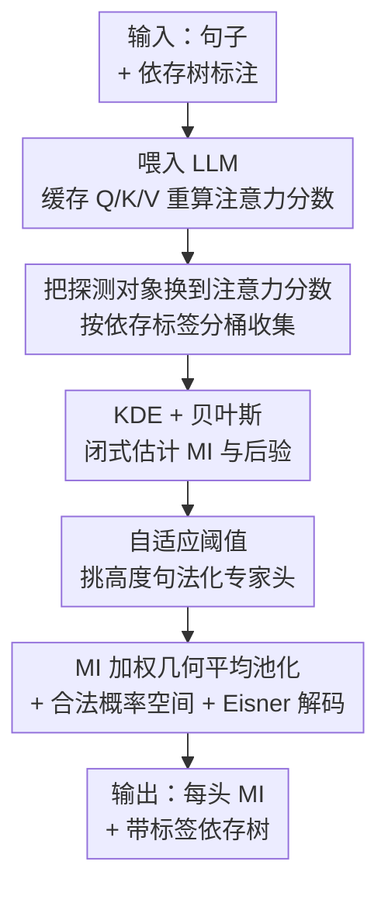

# An Information-Theoretic Parameter-Free Bayesian Framework for Probing Labeled Dependency Trees from Attention Score

**会议**: ICLR2026  
**OpenReview**: [https://openreview.net/forum?id=q7raIuTQDK](https://openreview.net/forum?id=q7raIuTQDK)  
**代码**: https://github.com/ChristLBUPT/IPBP  
**领域**: 可解释性 / 句法探测 / 注意力分析  
**关键词**: 句法探测、互信息、贝叶斯推断、依存树、注意力分数

## 一句话总结
IPBP 不训练任何探测网络，直接对"注意力分数"和"依存关系"的联合分布做核密度估计，闭式算出每个注意力头与各类依存关系的互信息，再用贝叶斯后验 + 几何平均池化 + Eisner 解码重建出**带标签**的依存树，在多个 7B/8B LLM 上比一众有监督/无监督基线都更准、且天然可解释。

## 研究背景与动机

**领域现状**：理解神经语言模型怎么编码句法，是窥探它们如何"理解语言"的一把钥匙。经典做法是**探测（probing）**：在模型的隐状态（hidden state）上训练一个有监督分类器去预测依存句法树（Hewitt & Manning 2019、Pimentel 等），或者直接把某些模型状态当作句法的证据（Htut 等）。即便机制可解释性（电路分析）最近很火，探测仍有价值——它能给出**数据集级别**的结论，而电路方法多是样本级的；而且句法是语言里拓扑最复杂、对人类理解最关键的概念之一。

**现有痛点**：作者系统梳理后发现既有探测实践有两个普遍存在的坑。其一，绝大多数方法是**"用不可解释来解释"**——为了从隐状态里抽句法，要外挂一个可训练网络，从线性映射一直到深层 MLP、伪注意力头。这造成一个苦涩的 trade-off：线性映射简单可解释但表达力有限；深网络能拟合任意关系，但网络本身没法解释，于是你根本分不清抽出来的句法到底来自被探测的 LM，还是强探测器自己"无条件地"学会了预测句法。一个直觉的思想实验：只给 `eat` 和 `breakfast` 两个孤立的词、不给任何上下文，探测器也可能猜出 `breakfast` 是 `eat` 的宾语——这正是"探测器自己学会了任务"的隐患，对隐藏维度更大的现代 LLM 尤其严重（探测网络被迫更大）。

**核心矛盾**：隐状态向量的结构和句法树差异太大，所以必须有一个可训练的映射网络来对齐；而上下文化嵌入又塞满了语义，这恰恰是"探测器自学任务"担忧的根源。准确率和可解释性之间的张力，本质上是被"选择隐状态作为探测对象"这个起点决定的。

**切入角度**：既然隐状态不够好，那"该把注意力放在注意力上"。注意力是 Transformer 里**唯一**牵涉词与词之间关系的组件（MLP、Add/Norm 都是逐 token 的），而依存句法也正是词与词之间的关系；注意力分数是堆叠的矩阵，依存树也能写成邻接矩阵。两者在概念上、拓扑上天然一致。可惜既有少数几个直接探测注意力的方法（Clark 等、Htut 等）只能抽出低质量或不完整的（无标签）树——因为它们犯了第二个错误：**过度信任注意力分数**。softmax 归一化后的注意力分数恰好是合法概率分布，于是大家就直接把它当成依存关系的概率。但注意力分数压根不需要"专门服务于句法"，所以必须先**筛掉非句法的注意力头**、并对原始分数做**可解释的变换**，而不是裸用。

**核心 idea**：与其在隐状态上训练有监督网络，不如**直接估计注意力分数与依存关系的多元分布，闭式地积分算出二者的互信息（MI），全程无参数**；再配一套结合 MI 和贝叶斯后验的解码算法，重建带标签的依存树。无参数 + 基于注意力，几乎堵死了"探测器自学任务"的可能。

## 方法详解

### 整体框架

IPBP（Information-theoretic Parameter-free Bayesian Probing）的整条管线没有任何需要训练的参数。给定一个已标注 `<句子, 依存树>` 的数据集和一个有 $b$ 层、每层 $h$ 个注意力头的 LLM：先把句子喂进模型、缓存每个头的 Q/K/V 并**重算未归一化的注意力分数**，按每对 token 的真实依存标签把分数"分桶"收集起来；然后对每个头、每种依存关系做核密度估计（KDE），配合经验先验，用贝叶斯定理一次性推出条件似然、联合、边缘和后验四类分布；有了分布就能闭式积分出每个头对每种依存的互信息，并用 MI 除以标签熵得到一个 $[0,1]$ 的自适应阈值来挑"高度句法化的专家头"；最后把这些头的后验用 MI 加权几何平均池化、构造一个合法的多元概率空间，交给 Eisner 动态规划解码出**带标签**的依存树。输出有两样东西：每个头与每种依存关系的细粒度 MI 值，以及重建出的带标签依存树。

### 关键设计

**1. 把探测对象从隐状态换到注意力分数：从源头堵死"探测器自学任务"**

这是全文的立足点。既往方法都在隐状态上做文章，被迫外挂可训练映射，从而陷入"准确率 vs 可解释性"的两难。IPBP 的破局在于换探测对象：注意力是 Transformer 里唯一编码 token 间关系的组件，与依存这种词间关系同构，注意力分数矩阵和依存邻接矩阵在拓扑上也对得上。具体做法是为每个头 $(b,h)$、每种依存标签 $l\in L\cup\{\phi\}$（$\phi$ 表示无依存）初始化一个分数集合 $A_{b,h;l}$，遍历数据集时把 token 对 $\langle x_i,x_j\rangle$ 的真实依存 $l^{[i][j]}$ 和注意力分数 $a^{[i][j]}_{b,h}$ 配对，把分数丢进对应桶里。由于不引入任何可训练参数、又直接基于注意力，"被探测的 LM 什么都不懂、探测器却自己学会"的隐患几乎被消除。值得一提的是，作者不用裸的 softmax 分数，而是缓存 Q/K/V **重算未掩码的未归一化分数**——因为句长不同会让 softmax 分数落在不同量纲区间，破坏密度估计；softmax 又不可逆，所以必须从 QK 重建。

**2. KDE + 贝叶斯闭式估计互信息：一次密度估计就够，绕开维度灾难**

换到注意力分数后，怎么量化"某个头对某种依存有多大信息量"？答案是互信息，但这里 $L$ 是离散变量、$A_{b,h}$ 是连续变量，联合分布是**混合分布**，MI 的形式比经典定义略有不同：

$$\mathrm{MI}(L; A_{b,h}) = \sum_{l\in L\cup\phi}\int f(l,a)\,\log\frac{f(l,a)}{P(l)\,f(a)}\,da$$

关键在于估出几类分布。先验 $\hat P(L=l)$ 直接用桶大小占比这个经验概率近似。难点是连续部分：作者注意到混合分布**只需要一元密度**，于是对每个 $A_{b,h;l}$ 用高斯核 KDE 估出条件似然 $\hat f(A_{b,h}\mid L=l)$。接着以 $A_{b,h}$ 为证据、$L$ 为假设套贝叶斯定理：似然 $\hat f(A_{b,h}\mid L)$ 乘先验 $\hat P(L)$ 得联合 $\hat f(A_{b,h},L)$，对所有 $L$ 求和得边缘 $\hat f(A_{b,h})$，后验 $\hat f(L\mid A_{b,h})$ 也就随之可算。这套设计的巧妙之处是：通过利用混合-联合分布 + 贝叶斯定理，把所需的密度估计次数压到**只有 1 次一元 KDE**，从而灵巧地避开了多元 KDE 在变量数>1 时迅速恶化的维度灾难——这正是它优于 Moon 等（多次多元 KDE）和 Gao 等（kNN 估 PMI、且产不出可用于重建的分布）这两个相关方法的地方。

**3. 专家头假设下的二元 MI + 自适应阈值：按关系自适应地挑"句法专家头"**

原始 MI 衡量的是某个头对**所有**依存关系的共享信息，太粗。但更现实的情况是某个头只**专门负责某几种**依存（即"专家头"假设，也是 Htut 等的前提）。于是作者把 MI 改成针对单一关系 $l$ 的二元形式（$l$ vs 非 $l$）：

$$\mathrm{MI}_{\text{binary}}(l; A_{b,h}) = \int f(l,a)\log\frac{f(l,a)}{P(l)f(a)}da + \int f(\lnot l,a)\log\frac{f(\lnot l,a)}{P(\lnot l)f(a)}da$$

其中 $f(\lnot l,A_{b,h})$ 通过对 $\hat f(A_{b,h},L)$ 在 $L\in(L\cup\{\phi\})-\{l\}$ 上边缘化得到，$P(\lnot l)=1-\hat P(l)$。重建树时要为每种关系 $l$ 选出一组高度负责它的头集合 $H_l$。难点是不同依存关系的 $\mathrm{MI}_{\text{binary}}$ 量纲不同，固定阈值不公平。作者利用"互信息被各变量的熵上界约束"这一事实：连续变量 $A_{b,h}$ 的变分熵是不靠谱的（可能为负）不能当上界，所以改用离散侧的熵

$$\hat H(\mathbb{1}_l(L)) = \hat P(L)\log\hat P(L) + \hat P(\lnot L)\log\hat P(\lnot L)$$

把 MI 除以这个熵，得到归一化到 $[0,1]$ 的比例值作为**自适应阈值**，按关系动态挑头，既比较了不同量纲又符合专家头直觉。

**4. MI 加权几何平均池化 + 合法概率空间 + Eisner 解码：把一堆后验拧成带标签的树**

选出 $H_l$ 后还有两个由"多头 + 多标签"带来的麻烦：既往探测多产**无标签**树，连有监督依存分析也是用独立网络分别预测弧和标签；而 IPBP 手里是一大堆后验概率，需要一个解码算法既能平衡这些后验、又能构成合法概率空间。理想模型是把弧预测看成**投票**：$H_l$ 里每个头 $\langle b_i,h_i\rangle$ 以 $e^{\mathrm{MI}_{\text{binary}}}$ 为权投票，赞成票权重超过某比例即认为弧存在；但权重连续、无法动态规划，搜索空间 $O(2^{|H_l|})$ 太贵。作者把它松弛成易算又合理的形式——取后验的**几何平均**（对数空间）：

$$\log \mathrm{GP}_{H_l}(x_i,x_j;l) = \frac{\sum_{\langle b_k,h_k\rangle}\mathrm{MI}_{\text{binary}}(l;A_{b_k,h_k})\cdot\log\hat f(L=l\mid A_{b_k,h_k})}{\sum_{\langle b_m,h_m\rangle}\mathrm{MI}_{\text{binary}}(l;A_{b_m,h_m})}$$

这近似于贝叶斯推断中常用的对数意见池化（Logarithmic Opinion Pooling），当专家头较多时是个合理近似。但各类弧由不同头集合决定，各关系概率之和不保证为 1。作者于是构造一个 $\{0,1\}^{|L|+1}$ 的更大多元概率空间，把 $x_i,x_j$ 之间的依存看成 $|L|+1$ 次独立投票，第 $l$ 票以 $\mathrm{GP}_{H_l}$ 为存在概率、$1-\mathrm{GP}_{H_l}$ 为不存在概率，整体弧概率为

$$P(x_i,x_j;l) = \mathrm{GP}_{H_l}(x_i,x_j;l)\times\prod_{l'\in L+\{\phi\}-\{l\}}\{1-\mathrm{GP}_{H_{l'}}(x_i,x_j;l)\}$$

由此所有类型的依存弧在一个统一、合法的概率空间里被决定。最后沿用有监督依存分析的做法，用 Eisner 动态规划算法解码出完整的**带标签**依存树。这一整套设计让 IPBP 一步直达带标签树，无需像旧方法那样先单独预测弧再预测标签。

### 损失函数 / 训练策略
IPBP 全程**无参数、无训练**，没有损失函数。唯一需要设定的是 KDE 的高斯核带宽 $B$ 等少量超参（见原文 Appendix D.1），以及实现层面的 GPU 优化 KDE 与积分；每种头选择方法统一限制句法头总数 $\sum_l|H_l|\le 2000$ 以公平对比。

## 实验关键数据

### 主实验
在 open\_llama\_7b 上、英文 UD 2.9 数据集，固定树重建算法、只替换"头重要性/MI 估计"或"树重建方式"来对比各基线（UAS=无标签依存正确率，LAS=带标签依存正确率）：

| 方法 | UAS | LAS | 说明 |
|------|------|------|------|
| Random Model | 12.4 | 0.8 | 随机初始化权重，下界 |
| L./R. Branching | 16.6 / 26.4 | - | 简单分支基线，无标签 |
| Probeless | 34.8 | 20.9 | 无参数神经元分析 |
| IoU | 38.3 | 26.6 | Jaccard 相似度 |
| ElasticNet (LFF) | 41.9 | 31.3 | 有监督线性 |
| V-Information | 41.3 | 20.9 | SOTA 信息论熵估计（需大算力） |
| Raw Score | 32.3 | 16.6 | 裸用注意力分数重建 |
| **IPBP** | **49.1** | **30.6** | 本文 |
| IPBP + MIpos | **49.9** | **34.8** | 加入正样本 MI 的变体 |

IPBP 的 UAS 显著超过所有基线；即便是算力昂贵的有监督 V-Information，LAS 也只有 20.9，远低于 IPBP——作者据此论证"当数据长尾、维度低时，有监督深网络未必是万灵药"。裸用注意力分数的 Raw Score（32.3/16.6）与 IPBP 差距巨大，印证了后验变换的必要性。

### 消融 / 结构变体实验

| 配置 | UAS | LAS | 说明 |
|------|------|------|------|
| IPBP | 49.1 | 30.6 | 完整模型 |
| IPBP + MIpos | 49.9 | 34.8 | 加正样本 MI，最佳 |
| IPBP (transposed) | 42.6 | 28.0 | 让 $l^{[i][j]}$ 对应 $a^{[j][i]}$ |
| IPBP (undirected)\* | 45.3 | 28.4 | 无向树（UUAS/ULAS） |
| IPBP (arc only) | 36.5 | N/A | 只重建无标签弧 |

跨模型/语言上，Mistral-7B（50.4 UAS）和 open\_llama\_7b（49.1）表现最好，法语/西语分区略低，说明方法对多模型多语言普遍适用。

### 关键发现
- **MIpos 提升明显**：注意力分数长尾（大多数 token 对无依存，落在 $A_\phi$ 桶里且含噪），单独算一个只在 $l\neq\phi$ 时的"句法化 MI"并与原 MI 混合，能稳定提点（LAS 30.6→34.8）。
- **解码器自适应捕获左/右依存**：掩码注意力只能看前文，左依存（指向前词）自然好抓；有趣的是右依存也能以"回看"方式被捕获——transposed 设置下 top-10 重建最好的标签里有 5 个是前瞻依存，比原始设置（3/10）更多。
- **模型层 ≈ 树的层级**：用 MI 加权层索引（类似 Tenney 的"重心"思想）与各依存标签平均深度求 Pearson 相关，得 $\rho=0.69,\ p=0.03$——低层负责局部/短语依存、高层负责全局/句级依存这一直觉，首次被系统地量化验证。

## 亮点与洞察
- **"换探测对象"比"换探测器"更治本**：以往大家都在隐状态上加码更聪明的探测网络，IPBP 反其道而行，把对象换成与句法同构的注意力分数，从源头消解"探测器自学任务"的疑云——这是一个值得迁移到其他"探测什么概念"问题上的思路。
- **混合分布 + 贝叶斯把多元 KDE 降到一元**：避开维度灾难的技巧很漂亮——只要把连续-离散混合分布拆成条件一元密度，再靠贝叶斯定理串起联合/边缘/后验，就能用一次 KDE 闭式拿到所有需要的概率。
- **细粒度 MI 是免费的"分析底座"**：因为产物是每头每标签的 MI 函数和概率分布，IPBP 不止给一棵树，还顺手提供了可视化、机制分析、层级对应等大量数据集级结论的原料，这是有监督探测器给不了的。
- **"不可能三角"**：更简单的架构 + 更小算力、更复杂高质量的带标签树、还透明可解释，三者同时拿到。

## 局限与展望
- **依赖标注数据**：方法需要已标注 `<句子, 依存树>` 的 UD 数据来分桶估计分布，不是完全无监督；探测的是"模型里有没有这些已知句法"，而非发现新结构。
- **绝对分数不高**：最佳 LAS 仅约 35，离有监督依存分析器（动辄 90+）相去甚远——它是"探测/解释"工具而非"高性能分析器"，横向比 LAS 大小要带这个 caveat。
- **掩码注意力的结构妥协**：为了用上生成时真正在用的下三角分数，transposed/undirected 等变体要么牺牲方向、要么牺牲标签，原始设置则可能用到被掩码的上三角分数；如何更干净地处理因果掩码仍是开放问题。
- **结论数量受限**：作者坦言因篇幅只给了少量分析结论，更多有趣结论（机制分析、无偏探测等）留在附录，鼓励后续基于其 MI/分布做细粒度研究。

## 相关工作与启发
- **vs 有监督隐状态探测（Hewitt & Manning、Pimentel 等）**：他们在隐状态上训分类器，受困于"准确率 vs 可解释性"两难且有探测器自学任务之嫌；IPBP 无参数、基于注意力，从对象上规避该问题，且能产带标签树。
- **vs V-Information（Pimentel 2020b、2022）**：同走信息论路线，但 V-Information 用可训练网络近似条件熵、算力昂贵且需多种 trick 适配注意力探测，本文用闭式 KDE+贝叶斯估 MI，更省且 LAS 更高。
- **vs 注意力裸用方法（Clark、Vig & Belinkov、Ravishankar 等）**：他们直接把 softmax 分数当依存概率，只能产低质量无标签树；IPBP 先筛专家头、再对后验做几何平均池化，证明"先变换再用"远胜裸用（49.1 vs 32.3 UAS）。
- **vs KDE/kNN 估 MI（Moon 1995、Gao 2017）**：Moon 做多次多元 KDE 易踩维度灾难；Gao 用 kNN 估 PMI 但产不出可重建树的分布；IPBP 借混合分布只做一次一元 KDE，且保留完整概率函数支撑树重建与可视化。

## 评分
- 新颖性: ⭐⭐⭐⭐⭐ "把探测对象换到注意力 + 无参数闭式 MI + 一步出带标签树"，是对整条探测范式的重构
- 实验充分度: ⭐⭐⭐⭐ 多模型多语言、与神经元分析/有监督/无监督多类基线系统对比，并有结构变体消融；绝对指标不高但定位是探测工具
- 写作质量: ⭐⭐⭐⭐ 推导严谨、动机层层递进；公式较密集，对非贝叶斯背景读者门槛偏高
- 价值: ⭐⭐⭐⭐⭐ 提供了一个无参数、可解释、能产数据集级结论的"分析底座"，对句法可解释性研究有持续启发

<!-- RELATED:START -->

## 相关论文

- [\[ICLR 2026\] TimeSeg: An Information-Theoretic Segment-Wise Explainer for Time-Series Predictions](timeseg_an_information-theoretic_segment-wise_explainer_for_time-series_predicti.md)
- [\[ICLR 2026\] Attention, Please! Revisiting Attentive Probing Through the Lens of Efficiency](attention_please_revisiting_attentive_probing_through_the_lens_of_efficiency.md)
- [\[NeurIPS 2025\] Curvature Tuning: Provable Training-free Model Steering From a Single Parameter](../../NeurIPS2025/interpretability/curvature_tuning_provable_training-free_model_steering_from_a_single_parameter.md)
- [\[ICLR 2026\] Bayesian Neural Networks for Functional ANOVA Model](bayesian_neural_networks_for_functional_anova_model.md)
- [\[ICLR 2026\] Decoupling Positional and Symbolic Attention in Transformers](decoupling_positional_and_symbolic_attention_in_transformers.md)

<!-- RELATED:END -->
