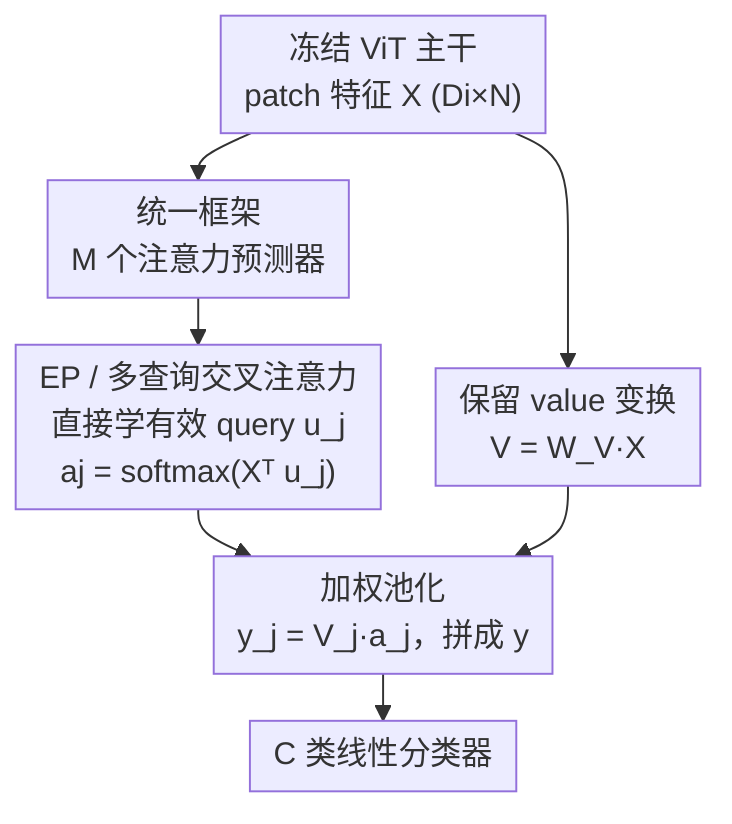

# Attention, Please! Revisiting Attentive Probing Through the Lens of Efficiency

**会议**: ICLR 2026  
**OpenReview**: [https://openreview.net/forum?id=PXo0gtT7Al](https://openreview.net/forum?id=PXo0gtT7Al)  
**代码**: https://vrg.fel.cvut.cz/ep/ (项目页)  
**领域**: 自监督 / 表示学习评估  
**关键词**: 注意力探测, 表示评估, 多查询交叉注意力, 参数高效, 冻结主干

## 一句话总结
针对「注意力探测」这一日益流行的冻结表示评估协议普遍参数臃肿的问题，本文先把已有方法统一成一个框架，再利用多头交叉注意力与多查询交叉注意力的**数学等价性**砍掉冗余投影矩阵，提出极轻量的 Efficient Probing（EP）——在 ImageNet-1K 上以不到 1.4M 参数把 MAE ViT-B 的探测精度从线性探测的 67.7% 拉到 75.6%，且各预训练范式上全面超越线性探测与已有注意力探测方法。

## 研究背景与动机
**领域现状**：评估预训练表示质量的主流协议有三种——k-NN、线性探测（LP）、全量微调（FT）。FT 精度最高但在大模型时代算力代价过高、越来越不可持续，于是「冻结主干 + 轻量探测」正成为事实上的评估方式。

**现有痛点**：标准线性探测只在单个全局表示（如 `[CLS]` token）上接一个分类头。这对用全局目标训练的模型（如 DINO 这类联合嵌入架构 JEA）没问题，但严重低估了那些把判别信息**分散在 patch 局部表示**里的模型——掩码图像建模（MAE、SimMIM）、自回归（AIM）、扩散（DiT）都是这一类，它们根本没有一个集中信息的全局 token。为弥补这一点，「注意力探测」应运而生：用注意力从 patch 特征里**有选择地聚合**出一个判别性描述子再做线性分类。

**核心矛盾**：注意力探测虽被 AIM、CAE、V-JEPA、CAPI 等纷纷采用，却长期缺乏统一研究——各方法设计差异极大、普遍**过度参数化、计算低效**，而且「注意力怎么聚合特征」与「为什么能提升分类」之间的机制始终不清楚。说到底，探测器本身只是评估工具，它不该比被评估的表示还重。

**本文目标**：把注意力探测放到「精度 vs. 参数效率」这把尺子下重新审视——(1) 系统化地把已有方法纳入同一框架、做第一个全面 benchmark；(2) 设计一个又轻又准的注意力探测器；(3) 弄清注意力质量与分类精度的关系。

**切入角度**：作者注意到，标准多头交叉注意力（MHCA）里的 key 投影矩阵 $W_K$ 把可学习 query 映射回输入特征的完整空间，而这一步**可以被一组直接在输入空间里学习的「有效 query」吸收掉**——既然两者数学等价，那臃肿的投影矩阵就是纯冗余。

**核心 idea**：用「在输入特征空间直接学多个 query 的多查询交叉注意力（MQCA）」替换「带 key/query 投影矩阵的 MHCA」，在数学等价的前提下把可学习参数从 $D_a(D_i{+}1)$ 砍到 $D_i M$，得到 Efficient Probing（EP）。

## 方法详解

### 整体框架
注意力探测要做的事：给定冻结 ViT 主干输出的特征矩阵 $X \in \mathbb{R}^{D_i \times N}$（$N = W\times H$ 个 patch 特征、每个 $D_i$ 维），用一个注意力池化机制把它聚合成图像级特征 $y \in \mathbb{R}^{D_o}$，再喂给一个 $C$ 类线性分类器。

作者把所有注意力池化统一抽象为 **$M$ 个注意力预测器**：第 $j$ 个预测器输出一个 $\ell_1$ 归一化的注意力向量 $a_j \in \mathbb{R}^N$（reshape 成 $W\times H$ 就是一张注意力图），value 特征 $V = W_V X$ 按 $M$ 切成子矩阵 $V_j \in \mathbb{R}^{d_o \times N}$（$d_o = D_o/M$），输出特征也对应切成 $M$ 段：

$$y_j = V_j a_j = W_{V_j} X a_j .$$

也就是说，每个预测器负责把 $N$ 个 patch 特征**加权池化**到最终表示空间的一个 $d_o$ 维子空间里，再把 $M$ 段拼起来得到 $y$。这套抽象的关键在于：AbMILP、AIM、DELF、SimPool、V-JEPA 等已有方法都可看作「怎么造这 $M$ 个注意力预测器」的不同选择，于是它们能在同一框架里被公平对比，而 EP 就是其中参数/计算最省的那个造法。

### 关键设计

**1. 统一框架：把五花八门的注意力池化收进「M 个预测器 + 值聚合」**

痛点在于注意力探测方法各搞各的、无法横向比较，也看不清谁的参数花在了刀刃上。作者用上面那套「注意力预测器 $a_j$ + value 聚合 $y_j = W_{V_j} X a_j$」把它们对齐成统一的算法步骤（query 怎么来、key/value 怎么变换、注意力怎么算、怎么池化）。在这个框架里：AbMILP 是 $M=1$ 且 $W_K, W_V$ 固定为单位阵的最简特例；AIM 是带 batch normalization 的 MHCA；DELF 是 $M=1$、用 MLP 算标量注意力且把 softmax 换成 softplus；SimPool 是 $M=1$、用数据相关的输入向量 $u = \frac{1}{N}X^\top \mathbf{1}$ 并对输入做 layer norm；V-JEPA 则在 MHCA 之上再叠一个带 GeLU 和残差的 MLP，整体等价于一个 transformer block。把它们摆进同一张表，过参数化的来源就一目了然，也为「砍冗余」指明了方向。

**2. EP / 多查询交叉注意力（MQCA）：在输入空间直接学 query，砍掉冗余投影**

标准 MHCA 的注意力是 $\hat{a}_j = (W_{K_j}X)^\top q_j = X^\top W_{K_j}^\top q_j$，其中 $q_j$ 是可学习 query。作者的观察是：$W_{K_j}^\top$ 的唯一作用就是把 $q_j$ 映射回输入特征的 $D_i$ 维完整空间，好让每个 query 子向量都能和完整表示交互。那为什么不**直接在 $D_i$ 维空间里学这个映射后的向量**呢？于是定义「有效 query」 $u_j := W_{K_j}^\top q_j \in \mathbb{R}^{D_i}$，注意力变成

$$\hat{a}_j = X^\top u_j, \qquad a_j = \mathrm{softmax}(\hat{a}_j), \quad j \in \{1,\dots,M\},$$

整个过程**不再有任何投影矩阵**，可学习参数只剩 $M$ 个 query $u_j$。参数量从 MHCA 的 $D_a(D_i{+}1)$ 降到 $D_i M$，运算量从 $N D_a(D_i{+}1)$ 降到 $N D_i M$——而 $M$ 通常比 $D_i \approx D_a$ 小一到两个数量级，所以省得非常彻底。

这一步之所以「免费」，关键是 **MQCA 与 MHCA 数学等价**：$u_j$ 恰好吸收了 $W_{K_j}^\top q_j$，所以在相同 $M$ 下两者精度完全一致（实测 EP12 与 AIM12 同为 75.1%），但 EP 用更少参数达到（1.36M vs 1.95M）。作者特意验证了反例：如果不是吸收、而是粗暴地把 $W_K$ 设成单位阵（$\hat{a}_j = X_j^\top q_j$），那么 $M>1$ 时每个 query 只能和 $D_i/M$ 维子空间交互，精度会明显掉（多头 75.1%→72.9%）——这说明「让每个 query 跟完整表示空间交互」是必须保住的，而 EP 用学到的有效 query 恰好优雅地保住了它。EP 还可看作 slot attention 的轻量版：只迭代一次、去掉 LayerNorm/GRU/MLP、把 slot 改成可学习而非随机初始化。

**3. 保留 value 变换 $W_V$ + 用 $D_o/M$ 当参数预算旋钮**

EP 砍掉了 query/key 侧的投影，但**刻意保留 value 变换** $V = W_V X$。消融显示 $W_V$ 是不可省的关键组件：给最朴素的 GAP 加上 $W_V$，精度 66.7%→68.0%；反过来从 EP12 里拿掉 $W_V$，精度 75.1%→72.1%（AIM、CAE 去掉后也类似下滑）。直觉上，注意力只决定「聚合谁」，而 $W_V$ 决定「聚合成什么样的表示」，两者缺一不可。

更实用的是，EP 暴露了两个可调旋钮——query 数 $M$ 和输出维度 $D_o$（通过 $W_V$ 控制）——让同一个方法能贴着不同参数预算走 Pareto 前沿。例如 EP48 配 $D_o = D_i/8$ 时只用 20 万出头参数（比线性探测还少近 4 倍）仍有 70.3%；而 EP64 放开维度则冲到 75.6% 的 SOTA。这种「一个机制、按需伸缩」的灵活性，正是它在精度–参数平面上能稳居前沿的原因。

### 损失函数 / 训练策略
探测沿用标准设置：冻结主干，只训练注意力池化 + 线性分类器，训练 90 epochs，报告各数据集验证集 top-1 精度，并同时统计可训练参数量与 FLOPs 评估效率。除特别说明外 $D_o = D_i = D_a$。EP 还可与 PEFT 互补：把「对所有层 $W_V$ 做 LoRA」与 EP 组合（LoRA+EP），能同时拿到两者的好处。

## 实验关键数据

### 主实验
跨 7 个分类基准（IN-1K、CIFAR-100、Places365、CUB-200、Aircraft、Cars、Food-101）和 MIM/JEA/混合/VLM/生成五大预训练范式评估。下表为 ImageNet-1K 上不同预训练方法在各评估协议下的对比（EP 默认 EP32）：

| 预训练 | 架构 | k-NN | 线性探测 LP | EP | EP 相对 LP 增益 |
|--------|------|------|------|------|------|
| MAE (MIM) | ViT-S/16 | 26.7 | 47.4 | 64.6 | **+17.2** |
| MAE (MIM) | ViT-B/16 | 46.1 | 67.7 | 75.6 | +7.9 |
| SimMIM (MIM) | ViT-B/16 | 15.1 | 51.5 | 65.1 | +13.6 |
| DiT (生成) | DiT-XL/2 | 8.3 | 32.7 | 57.0 | **+24.3** |
| BEiTv2 (MIM) | ViT-B/16 | 74.8 | 79.0 | 81.7 | +2.7 |
| DINOv2 (混合) | ViT-L/14 | 83.5 | 85.2 | 85.6 | +0.4 |
| CLIP (VLM) | ViT-L/14 | 77.2 | 82.3 | 83.4 | +1.1 |
| SigLIP (VLM) | ViT-L/16 | 83.7 | 84.1 | 86.1 | +2.0 |

关键现象：**预训练越是优化 patch 局部表示（而非显式全局表示）的模型，越受益于注意力探测**（SimMIM +13.6、DiT +24.3 最夸张）；而对本就有强全局描述子的 JEA/DINO，增益很小（+0.5 量级）。更有意思的是，EP **改变了方法间的相对排名**——在 LP/k-NN 下看似更弱的 MIM 方法翻盘：MAE 反超 BYOL、CAPI 反超 CLIP，挑战了「MIM 表示更弱」的既有印象。

### 消融实验

| 配置 | 关键指标 (top-1) | 说明 |
|------|---------|------|
| EP12（完整） | 75.1% | 与 AIM12 精度持平，但 1.36M vs 1.95M 参数 |
| 单头去 $W_K$ | 71.8→71.7% | $M=1$ 时 $W_K$ 可被单 query 吸收，几乎无影响 |
| 多头去 $W_K$（设为单位阵） | 75.1→72.9% | $M>1$ 时 query 只能与子空间交互，明显掉点 |
| GAP 加 $W_V$ | 66.7→68.0% | value 变换带来稳定增益 |
| EP12 去 $W_V$ | 75.1→72.1% | $W_V$ 是关键组件，不可省 |
| LoRA+EP（850K 参数） | 76.99% | 超过纯 EP（75.58%/1.38M）和全层 LoRA（76.72%/1.95M） |

### 关键发现
- **效率碾压**：MAE ViT-B 上 EP64 仅 <1.4M 参数即 75.6% SOTA；EP48（$D_o{=}D_i/8$）用约 20 万参数（比线性探测少近 4×）仍达 70.3%。EP 比一个 ViT block 精度更高却省 10× 以上算力。
- **与 PEFT 互补而非冗余**：纯 EP 在精度–参数平面上压过单层 LoRA、BitFit、LayerNorm tuning；只有「全层 LoRA」能在精度上略超 EP，但它对表示改动更大（task-adaptive）。LoRA+EP 混合在 850K 参数下达 76.99%，250K 参数下达 71.99%（比 [CLS] 的 67.66% 高约 4.3% 且省 3× 参数），说明 EP 捕捉的信息 LoRA 抓不到、反之亦然。
- **定位质量↔分类精度正相关**：把某个注意力预测器的分布换成均匀分布、看精度掉多少（$\Delta$accuracy），发现预测器越聚焦前景目标（注意力质心落在 GT 框内、熵越低），对精度贡献越大——EP 倾向于真的盯住物体而非走「背景捷径」（如靠水来认「鱼」）。
- **注意力图更互补**：EP 的多个 query 各自专注不同物体区域（尾巴、喙、脚等语义部件），互补性分数普遍高于 MHSA / V-JEPA / AIM（如 MAE ViT-B 上 EP 0.65 vs V-JEPA 0.24）。

## 亮点与洞察
- **「数学等价 → 免费瘦身」的杠杆**：EP 最巧的地方不是发明新结构，而是证明现有 MHCA 里的 $W_K$（在吸收意义下）纯属冗余，从而在**不掉一分精度**的前提下把参数砍掉一大块——这种「先证等价、再删冗余」的思路可迁移到很多过度参数化的注意力模块。
- **重新校准了表示评估的结论**：用错的探测器（线性探测）会系统性低估局部表示型模型，导致「MIM 不如对比学习」之类的误判；换成 EP 后排名翻转。这提醒社区：报告 SSL/生成模型表示质量时，探测协议本身是个不该被忽视的混杂变量。
- **探测器从「评估工具」升级为「分析工具」**：定位质量与精度的正相关、以及互补的部件级注意力图，把探测从单纯打分扩展成理解表示的窗口，开辟了「用探测做可解释性/鲁棒性分析」的新方向。
- **一个旋钮贴预算**：$M$ 与 $D_o$ 两个超参让同一方法覆盖从 20 万到上百万参数的整条 Pareto 前沿，工程上非常友好。

## 局限与展望
- **仅限图像分类 + ViT 主干**：全部实验都是 patch-token ViT 上的分类探测，是否能推广到分割/检测等密集任务、或 CNN/混合主干，论文未验证。
- **「免费等价」依赖线性假设**：EP 的等价性建立在 query/key 投影是线性的前提上；对引入非线性的变体（如 DELF 的 ReLU、V-JEPA 的 MLP block）这条捷径不直接成立，能省多少要另算。
- **互补性/定位是相关而非因果**：定位质量与精度的关系是观测到的相关性，论文没有证明「逼迫预测器更聚焦」就一定提升精度，这层因果还需进一步探究。
- **改进方向**：把 EP 当作通用轻量聚合器接到下游密集任务；或显式地用定位/互补性作为正则项去引导 query 学习，看能否进一步把分析洞察转成训练增益。

## 相关工作与启发
- **vs AIM / MHCA（带 query 投影的多头交叉注意力）**: 两者与 EP 在相同 $M$ 下数学等价、精度相同（75.1%），但 AIM12 需要 1.95M 参数、EP12 只要 1.36M——EP 是它们「去冗余」后的精简形态。
- **vs AbMILP / DELF / SimPool（单头注意力池化）**: 它们都是本文框架在 $M=1$ 下的特例，受限于单头/单 query，表达力不足；EP 通过多 query 在保持效率的同时拿到多头的表达力。
- **vs V-JEPA / CaiT / ViT block（叠 transformer 结构的探测）**: 这类方法参数量大得多，但在探测设定下增益大多边际；EP 用十分之一的算力反而更准。
- **vs LoRA / BitFit / LayerNorm tuning（PEFT）**: PEFT 改的是主干表示（task-adaptive），EP 是表示保持型探测；二者互补，LoRA+EP 组合在精度–参数平面上同时压过纯 LoRA 与纯 EP。
- **vs slot attention**: EP 可视为 slot attention 的极简版（单次迭代、去掉 LayerNorm/GRU/MLP、slot 改可学习），用「query 可学习」补偿了去掉迭代交互的损失。

## 评分
- 新颖性: ⭐⭐⭐⭐ 不是全新结构，但「证等价→删冗余」的视角和统一框架很扎实
- 实验充分度: ⭐⭐⭐⭐⭐ 覆盖 5 大预训练范式、7 个数据集、与 PEFT 横评，消融到位
- 写作质量: ⭐⭐⭐⭐⭐ 框架推导清晰、表格组织有力，结论有反直觉看点
- 价值: ⭐⭐⭐⭐⭐ 给社区一个又轻又准的标准探测协议，并纠正了表示评估的系统性偏差

<!-- RELATED:START -->

## 相关论文

- [\[ICLR 2026\] Probing Rotary Position Embeddings through Frequency Entropy](probing_rotary_position_embeddings_through_frequency_entropy.md)
- [\[ACL 2026\] Through a Compressed Lens: Investigating The Impact of Quantization on Factual Knowledge Recall](../../ACL2026/interpretability/through_a_compressed_lens_investigating_the_impact_of_quantization_on_factual_kn.md)
- [\[ICLR 2026\] An Information-Theoretic Parameter-Free Bayesian Framework for Probing Labeled Dependency Trees from Attention Score](an_information-theoretic_parameter-free_bayesian_framework_for_probing_labeled_d.md)
- [\[CVPR 2026\] Selection-as-Nonlinearity: Bridging Attention and Activation via a Joint Game-Decision Lens for Interpretable, Discriminative Visual Representations](../../CVPR2026/interpretability/selection-as-nonlinearity_bridging_attention_and_activation_via_a_joint_game-dec.md)
- [\[ICLR 2026\] GAVEL: Towards Rule-Based Safety through Activation Monitoring](gavel_towards_rule-based_safety_through_activation_monitoring.md)

<!-- RELATED:END -->
