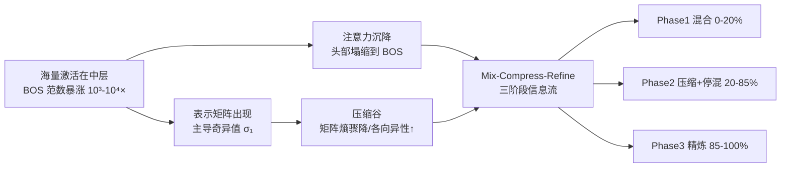

# Attention Sinks and Compression Valleys in LLMs are Two Sides of the Same Coin

**会议**: ICLR 2026  
**OpenReview**: [https://openreview.net/forum?id=c5TFhCJ6fs](https://openreview.net/forum?id=c5TFhCJ6fs)  
**代码**: 待确认  
**领域**: 大模型可解释性 / 表示几何  
**关键词**: 注意力沉降, 压缩谷, 海量激活, 残差流, 信息流, 深度计算  

## 一句话总结
本文证明 LLM 中两个看似独立的谜题——注意力沉降（attention sinks）与压缩谷（compression valleys）——其实是**残差流里海量激活（massive activations）这同一机制的两个侧面**，并据此提出 Mix-Compress-Refine 三阶段信息流理论，统一解释了为什么 embedding 任务在中层最强、生成任务却要走满全深度。

## 研究背景与动机
**领域现状**：注意力沉降指注意力头莫名其妙地把大量注意力倾倒到语义无意义的 token（通常是 BOS）上；压缩谷指中间层表示的矩阵熵异常地低、各向异性（anisotropy）异常地高。这两个现象在各种规模的模型里普遍出现，但一直被**当作两个独立谜题分开研究**：沉降被归因于位置偏置、防过度混合或预训练动力学；压缩谷被归因于信息瓶颈假说。

**现有痛点**：（1）两条解释线各说各话，从未建立形式化联系；（2）压缩谷只有信息瓶颈这类**缺乏因果证据**的假说，不知道压缩到底是被什么驱动的；（3）没有统一机制能解释这些阶段为何会在深度上出现、何时出现。

**核心矛盾**：强大的模型为什么要把注意力浪费在无意义 token 上？高维空间里的表示又为什么要在计算中途自我压缩？这两件"反直觉"的事如果各自孤立，就只能各打一巴掌、给不出统一答案。

**本文目标**：找到同时驱动这两个现象的单一底层机制，并由此刻画 Transformer 如何在深度方向上组织计算。

**核心 idea**：**注意力沉降和压缩谷不是两个现象，而是海量激活的两个必然后果**。当某个 token（典型是 BOS）的激活范数在中层暴涨 10³–10⁴ 倍时，它会在表示矩阵里制造一个主导奇异值——这在数学上**必然**导致压缩，同时也对应着注意力沉降的形成。一个机制，两个侧面。

## 方法详解

### 整体框架
论文的论证分两层。第一层是**机制统一**：先用六个模型的实证相关性说明三现象同步出现，再用一条定理证明海量激活在数学上**必然**导致谱主导与熵下降，最后用消融实验把"相关"夯成"因果"。第二层是**理论升华**：基于这个机制提出 Mix-Compress-Refine 三阶段信息流理论，并用下游任务表现的"任务-阶段"匹配关系来检验它。

### 关键设计

**1. 同步涌现的实证刻画：用三条曲线把两现象焊在一起。** 作者在六个模型（Pythia 410M/6.9B、LLaMA3 8B、Qwen2 7B、Gemma 7B、Bloom 1.7B，跨度 410M–120B）上逐层测量三个量——矩阵熵 $H(X)=-\sum_j p_j\log p_j$（其中 $p_j=\sigma_j^2/\lVert X\rVert_F^2$）、BOS 沉降率 sink-rate，以及 BOS 的 L2 范数。三条曲线在同一层精确对齐：BOS 范数一旦跳起来，熵立刻跌破 0.5 bit、沉降率冲到接近 1.0。BOS 范数变化与熵变化的 Pearson 相关达 $r=-0.9\pm0.18$，与沉降率相关 $r=0.58\pm0.25$。更关键的是这个转变层对每个模型是**固定的**（Pythia 410M 永远在第 5 层），与输入无关，说明它是架构层面的、确定性的机制，而非内容驱动的偶然；训练 checkpoint 分析进一步显示三者在约 1k 步时一起涌现并贯穿训练始终。

**2. 海量激活必然导致压缩（Theorem 1）：把"压缩谷"从假说变定理。** 这是全文的理论支点。设 $M=\lVert x_0\rVert^2$ 为 BOS 的范数平方，$R=\sum_{i\neq 0}\lVert x_i\rVert^2$ 为其余 token 的范数平方和，对齐项 $\alpha=\frac{1}{R}\sum_{i\neq0}\lVert x_i\rVert^2\cos^2\theta_i\in[0,1]$，则最大奇异值满足 $\sigma_1^2\ge M+\alpha R$。直观地说，BOS 范数 $M$ 越大、或其余 token 与 BOS 越对齐（$\alpha\to1$），主导奇异值就越被顶高。由此推出三个压缩界（Corollary 2）：令 $c=M/R$、$p=(c+\alpha)/(c+1)$，则谱主导 $\sigma_1^2/\sum_{j\ge2}\sigma_j^2\ge(c+\alpha)/(1-\alpha)$、各向异性 $p_1\ge p$、熵 $H(X)\le -p\log p-(1-p)\log(1-p)+(1-p)\log(r-1)$。换句话说，$c\gg1$ 或 $\alpha\to1$ 时矩阵趋于秩一、熵趋于零——压缩不再是"观察到的现象"，而是海量激活的数学必然。实证上 $\alpha R$ 在压缩区始终远小于 $M$，因此 $\sigma_1^2$ 几乎完全被 $M$ 主导，理论上界在中层与实测曲线几乎重合。

**3. 定向消融坐实因果：手术刀切掉海量激活，两现象一起消失。** 相关不等于因果，作者用一个干净的干预把这一步补上：在海量激活涌现的那一层，只把 MLP 对 BOS 的贡献置零，即 $x^{(\ell+1)}_{\text{BOS}}\leftarrow x^{(\ell)}_{\text{BOS}}+\text{Attn}^{(\ell)}(x_{\text{BOS}})$，保留注意力贡献而抹掉 $\text{MLP}^{(\ell)}(x_{\text{BOS}})$。在 LLaMA3 8B 上切掉第 0 层这一项后：熵不再跌（停在 0.4–0.5 bit 而非掉到 0.02），沉降率从 0.85–1.0 直接归零，BOS 范数也只比其余 token 大 2× 而非 10² 倍——三个效果同时被掐灭，证明它们共享同一个因。对于 Pythia 410M、Qwen2 7B 这类在多个阶段都长出海量激活的模型，逐个切只能部分削弱，全切才彻底消除，说明贡献是累加的。

**4. Mix-Compress-Refine：用海量激活的"起灭"切出三个深度阶段。** 这是机制统一之后的理论收成。作者主张 Transformer 把深度方向的计算切成三段，边界恰好由海量激活的涌现与消散标记：**Phase 1 混合（0–20%）**——尚无海量激活，注意力弥散，混合得分（注意力矩阵的平均行熵）维持在 0.7 以上，模型广泛整合上下文，但刻意限制时长以防过度混合/表示坍缩（类比 GNN 的 over-smoothing）；**Phase 2 压缩+停混（20–85%）**——海量激活突然涌现，按 Theorem 1 必然压缩，同时沉降把多数头变成近似"no-op"（attend 到值范数近零的 BOS 等于跳过该头），混合被关闭，中层在压缩的残差流里用少数主导方向保住高层语义；中后段的沉降还会随提示复杂度自适应（"dormant heads"），而 Phase 1 的混合对输入几乎不变；**Phase 3 精炼（85–100%）**——BOS 范数回落、内容 token 范数抬升，范数趋于均衡，压缩的数学基础瓦解、表示重新展开，注意力从沉降切换到 identity 头 / previous-token 头等尖锐位置型模式（RoPE 模型尤其如此），对 token 做特定精炼。

## 实验关键数据

### 同步涌现与因果验证

| 现象 | 测量 | 结果 |
|------|------|------|
| 三现象同步 | BOS 范数↔熵 Pearson r | $-0.9\pm0.18$（6 模型，GSM8K） |
| 三现象同步 | BOS 范数↔沉降率 Pearson r | $0.58\pm0.25$ |
| 理论紧致性 | 中层熵上界 vs 实测 | 几乎重合（σ₁≈‖x_BOS‖≈‖X‖_F，近秩一） |
| 消融因果 | LLaMA3 8B 切 BOS-MLP@L0 | 熵 0.02→0.4-0.5；沉降率 1.0→0；BOS 范数 10²×→2× |

### 下游任务的"阶段-任务"匹配

| 任务类型 | 评测方式 | 峰值深度 | 阶段 |
|----------|----------|----------|------|
| 生成（perplexity） | LogitLens / WikiText-2 | 单调改善至满深度（10⁴→10-25） | Phase 3 改善最陡 |
| 多选推理 | LogitLens / ARC·HellaSwag·WinoGrande | 40-60% 前持平，之后陡升 | 晚 Phase2→Phase3 |
| Embedding（线性探针/MTEB） | 冻结 backbone + 逐层线性分类 | 25-75% 深度，超早/晚层 10-20% | Phase 2 压缩最强处 |

### 关键发现
1. **统一机制成立**：六个模型上注意力沉降、压缩谷、海量激活三者在同一层、同一训练阶段一起出现，相关性极高。
2. **压缩有了因果根**：消融海量激活同时消灭压缩与沉降，把"信息瓶颈假说"换成了可验证的机制。
3. **任务最优层之争被调和**："最优中间层"取决于目标——embedding 类任务吃 Phase 2 的低维压缩，生成/推理类任务必须等 Phase 3 的范数均衡与位置头精炼，这解释了为何不同研究对"最优层"结论相互打架，并暗示**阶段感知的提前退出（phase-aware early exiting）**是值得做的设计。

## 亮点与洞察
- **"两个谜题是一枚硬币"叙事极漂亮**：把社区里分头研究的两条线用一条不等式焊死，且理论上界在中层几乎贴合实测，说服力强。
- **理论+实证+因果三件套齐全**：不是只摆相关曲线，而是有 Theorem 1 给出可证的压缩界，再用定向消融把因果钉死，方法论上很扎实。
- **可操作的下游启示**：Mix-Compress-Refine 不只是漂亮的故事，它直接给出"按任务选层""阶段感知早退"的工程指引，把可解释性结论接回了效率设计。
- **跨规模一致**：410M 到 120B 都成立，且训练早期即学得，说明这是 Transformer 的普适组织规律而非个别模型怪癖。

## 局限与展望
- **理论只约束中层**：早层海量激活缺席时界很松，Theorem 1 本质上是"一旦出现海量激活就必然压缩"，没回答海量激活**为什么会在那一层涌现**这个更底层的问题。
- **三阶段边界偏定性**：Phase 2 内部还藏着一个"生成性能在后半段才起来"的子相位，作者承认它没被海量激活干净地切开，阶段划分仍带经验成分。
- **机制偏现象学**：解释了 BOS 海量激活的后果，但 MLP 为何专挑 BOS 写入巨范数、这是否是最优编码策略，仍未触及。
- **工程落地待验证**：阶段感知早退、按任务选层只是提出方向，尚无端到端的效率/精度收益实验。

## 相关工作与启发
- **注意力沉降**：Xiao et al. (StreamingLLM)、Barbero et al.（防过度混合）、Gu et al.（预训练溯源）、Sun et al. / Cancedda（关联海量激活）——本文是首个把沉降与表示几何/压缩统一起来的工作。
- **压缩谷与表示几何**：Skean et al.（信息瓶颈假说）、Razzhigaev et al.（各向异性/近线性层）——本文给压缩谷补上了因果机制。
- **深度计算结构**：Lad et al.（删除/交换敏感度分阶段）、Csordás et al.（深层主要精炼概率分布而非组合新计算）——本文的 Phase2→Phase3 转变与 Csordás 的"未来 token→当前 token"相位变化互相印证。
- **启发**：把"海量激活"当作可控旋钮，或许能主动调度压缩/混合，用于压缩友好的 embedding 模型、阶段感知推理加速，甚至作为表示可控性的抓手。

## 评分
- **新颖性**: ⭐⭐⭐⭐⭐ 把两个独立谜题用单一机制统一，并给出可证明的压缩定理，视角新、立意高。
- **实验充分度**: ⭐⭐⭐⭐ 跨 410M–120B 六模型 + 训练动力学 + 定向消融 + 多任务下游验证，覆盖面广；唯独工程落地（早退/选层）只给方向未做收益实验。
- **写作质量**: ⭐⭐⭐⭐⭐ 叙事清晰，"硬币两面"主线贯穿始终，理论与图表配合到位。
- **价值**: ⭐⭐⭐⭐⭐ 既统一了机理解释，又给出"按任务选层/阶段感知早退"的可操作指引，对可解释性与效率两端都有影响。

<!-- RELATED:START -->

## 相关论文

- [\[ICLR 2026\] From Tokens to Thoughts: How LLMs and Humans Trade Compression for Meaning](from_tokens_to_thoughts_how_llms_and_humans_trade_compression_for_meaning.md)
- [\[ICLR 2026\] Sparse Autoencoders Trained on the Same Data Learn Different Features](sparse_autoencoders_trained_on_the_same_data_learn_different_features.md)
- [\[ICLR 2026\] Learning is Forgetting: LLM Training As Lossy Compression](learning_is_forgetting_llm_training_as_lossy_compression.md)
- [\[ICLR 2026\] Towards Understanding the Nature of Attention with Low-Rank Sparse Decomposition](towards_understanding_the_nature_of_attention_with_low-rank_sparse_decomposition.md)
- [\[ICLR 2026\] Attention, Please! Revisiting Attentive Probing Through the Lens of Efficiency](attention_please_revisiting_attentive_probing_through_the_lens_of_efficiency.md)

<!-- RELATED:END -->
