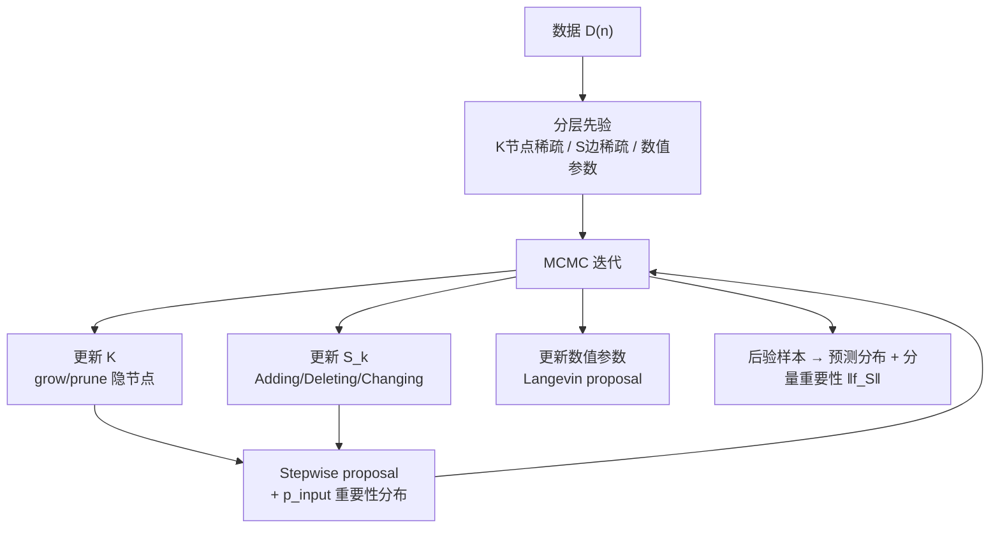

# Bayesian Neural Networks for Functional ANOVA Model

**会议**: ICLR 2026  
**OpenReview**: [https://openreview.net/forum?id=cvZhXILRLI](https://openreview.net/forum?id=cvZhXILRLI)  
**代码**: 补充材料中提供  
**领域**: 可解释机器学习 / functional ANOVA / 贝叶斯神经网络  
**关键词**: Functional ANOVA, Tensor Product Neural Network, Bayesian Neural Network, 高阶交互, MCMC, 后验一致性  

## 一句话总结
把 functional ANOVA 模型里"要估哪些分量"这件事本身当成可学习参数，用一个带 stepwise proposal 的 MCMC 算法在高维输入下自动搜索并估计高阶交互分量，避免了 ANOVA-TPNN 必须预先枚举全部分量、分量数随阶数指数爆炸的算力瓶颈。

## 研究背景与动机
**领域现状**：functional ANOVA 模型把高维函数 $f(x)$ 唯一分解成一堆低维分量之和 $f(x)=\sum_{S\subseteq[p]}f_S(x_S)$，每个分量 $f_S$ 满足 sum-to-zero 约束，因此可以通过看主效应、二阶交互等低维分量来理解整个模型——这是 GAM、SS-ANOVA、MARS 直到近年 NAM/NBM/NODE-GAM 一脉相承的可解释建模范式。Park et al. (2025) 提出的 ANOVA-TPNN 用专门设计的张量积神经网络（TPNN）作基函数，天然满足 sum-to-zero 约束，能稳定地唯一估计每个分量。

**现有痛点**：ANOVA-TPNN 这类方法必须**预先指定要估计的分量集合**。模型 $f(x)=\sum_{S:|S|\le d}\sum_k\beta_{S,k}\phi(x_S\mid\cdot)$ 里，最大阶 $d$ 一旦设定，需要的 TPNN 数量随 $d$ 指数增长。当输入维度 $p$ 大时，分量数（也就是要训练的网络数）爆炸，实践中只能取 $d=1$ 或 $2$。比如把 ANOVA-TPNN 扩到三阶交互，在 $p=50$ 的合成数据上需要约 19,600 个网络，直接超出常规算力。

**核心矛盾**：真正决定预测精度的往往是高阶交互（论文在 MADELON 数据上发现最重要的分量是一个 4 阶交互），但"穷举式预指定全部分量"的代价随阶数指数膨胀，于是高阶分量被迫被砍掉，预测和可解释性都打了折扣。

**本文目标**：在不预先枚举分量、不消耗巨量算力的前提下，让模型自动发现并估计重要的高阶交互分量。

**核心 idea（架构即参数）**：不再固定分量集合 $S$，而是把"用哪些分量、用多少个隐节点"——即架构本身——也当成待推断的参数。由于隐节点数 $K$ 和分量集合 $S_k$ 不是数值参数、无法用梯度下降更新，作者改走贝叶斯路线，用专门设计的 MCMC 算法在架构的高后验区域中搜索，得到 **Bayesian-TPNN**。

## 方法详解

### 整体框架
Bayesian-TPNN 把模型写成 $f(x)=\sum_{k=1}^{K}\beta_k\phi(x\mid\Theta_k)$，其中 $\Theta_k=(S_k,b_{S_k,k},\Gamma_{S_k,k})$，$S_k\subseteq[p]$ 是第 $k$ 个隐节点连接的输入变量集合。可以把它理解成一个**边稀疏的浅层网络**：$K$ 是隐节点数（节点稀疏），每个节点通过激活的边连到一组输入变量 $S_k$（边稀疏），而 $S_k$ 的大小就对应该节点表达的交互阶数。$K$ 和 $\{S_k\}$ 这些架构参数无法梯度更新，因此整个推断分三层：给架构和参数设计分层先验 → 用 MCMC 迭代地更新 $K$、各 $S_k$ 与数值参数 → 证明后验对真分量一致。

### 关键设计

**1. 架构作为可学习参数：把分量选择吸收进贝叶斯推断。** 这是全文的支点。传统做法把分量集合 $\{S:|S|\le d\}$ 当成固定的模型设定，本文则把 $K$ 和 $S_k$ 直接当随机参数推断。模型 $f(x)=\sum_{k=1}^K\beta_k\phi(x\mid\Theta_k)$ 里每个 TPNN 基 $\phi(x_S\mid S,B,R)=\prod_{j\in S}\big[1-\sigma(\frac{x_j-b_j}{\gamma_j})+c_j\,\sigma(\frac{x_j-b_j}{\gamma_j})\big]$ 仍满足 sum-to-zero（常数 $c_j$ 专为此设计），所以无论 MCMC 搜到什么架构，分解的唯一性和可解释性都自动保持。这样"要不要某个高阶分量"就从一个需要人工预设的离散选择，变成了 MCMC 会自己探索的后验问题。

**2. 三层分层先验：用节点稀疏 + 边稀疏 + CART 风格混合分布鼓励简约架构。** 参数被分成三组各设先验。隐节点数用 $\pi(K=k)\propto\exp(-C_0 k\log n)$，对节点数施加随样本量增长的惩罚以保证节点稀疏（沿用 Kong et al. 2023 的 masked BNN 思想）。给定 $K$，每个 $S_k$ 独立服从混合分布 $\sum_{d=1}^p w_d\,\mathrm{Uniform}(\mathrm{power}([p],d))$，权重 $w_d$ 由递归式 $w_d\propto(1-p_{\text{adding}}(d))\prod_{\ell<d}p_{\text{adding}}(\ell)$、$p_{\text{adding}}(\ell)=\alpha_{\text{adding}}(1+\ell)^{-\gamma_{\text{adding}}}$ 决定——这正是 Bayesian CART 里控制分裂变量集合大小的机制，让低阶交互更易被采样、高阶交互需要更强证据才能留下。剩下的数值参数用标准先验（$\beta_k\sim N(0,\sigma_\beta^2)$、$b_{j,k}\sim\mathrm{Uniform}(0,1)$、$\gamma_{j,k}\sim\mathrm{Gamma}$、高斯回归噪声方差用 Inverse-Gamma）。

**3. Stepwise 搜索 + pinput 重要性 proposal：让 MCMC 更频繁地走向重要的高阶交互。** 这是算法上最关键的创新。MCMC 借鉴 BART 的更新方式，迭代地更新 $K$、各 $(S_k,b,\Gamma,\beta)$ 和噪声参数 $\eta$，但 proposal 被专门设计来偏向重要的高阶交互。它引入两件工具：其一是预训练的输入重要性分布 $p_{\text{input}}(\cdot)$，实践中取自预训练 DNN 的全局 SHAP 值或 XGBoost 的特征重要性，从而把"该往哪个变量方向长"交给数据驱动的先验知识；其二是 **stepwise move**——新增节点时不是凭空生成，而是复制一个已有节点 $S_{k^*}$ 再按 $p_{\text{input}}(\cdot\mid S_{k^*}^c)$ 加一条边，得到 $S^{\text{new}}=S_{k^*}\cup\{j_{k^*}\}$，阶数恰好比被复制节点高 1，且保留原节点避免精度骤降。增节点时以概率 $M/(M+K)$ 走 Random（从先验采全新集合）、$K/(M+K)$ 走 Stepwise（在现有节点上升阶）；更新单个 $S_k$ 时则在 Adding / Deleting / Changing 三种操作间随机选择，配合 Langevin proposal 加速数值参数收敛。正是这套 stepwise 机制，让模型能"沿着已找到的有用低阶结构爬"到高阶交互，而不必把所有高阶分量都显式建出来。

**4. 后验一致性保证：理论上证明每个分量都能被一致估计。** 作者证明 Bayesian-TPNN 的后验是一致的：在 $0<\inf_x p_X(x)\le\sup_x p_X(x)<\infty$ 等正则条件下，存在 $\xi>0$ 使得对任意 $\varepsilon>0$、对所有 $S\subseteq[p]$，截断后验 $\pi_\xi(f:\|f_{0,S}-f_S\|_{2,n}>\varepsilon\mid X^{(n)},Y^{(n)})\to 0$。也就是说不仅整体预测函数收敛到真值，**每一个分量**也都收敛到真分量——这对一个号称可解释的模型尤为重要，因为它保证了被解读的那些低维曲线是可信的而非伪影。

## 实验关键数据

### 主实验表格（8 个真实数据集，预测精度）
回归报 RMSE（越低越好），分类报 AUROC（越高越好）；与 ANOVA-TPNN、NAM、Linear、XGB、BART、mBNN 对比。

| 数据集 | 指标 | Bayesian-TPNN | ANOVA-TPNN | NAM | XGB | BART | mBNN |
|---|---|---|---|---|---|---|---|
| BOSTON | RMSE↓ | **3.654** | 3.671 | 3.832 | 4.130 | 4.073 | 4.277 |
| MPG | RMSE↓ | **2.386** | 2.623 | 2.755 | 2.531 | 2.699 | 2.897 |
| FICO | AUROC↑ | 0.793 | **0.802** | 0.764 | 0.793 | 0.701 | 0.740 |
| CHURN | AUROC↑ | **0.849** | 0.848 | 0.835 | 0.848 | 0.835 | 0.833 |
| MADELON | AUROC↑ | **0.854** | 0.587 | 0.644 | 0.884 | 0.751 | 0.650 |

整体上 Bayesian-TPNN 与最强基线相当或更好；在依赖高阶交互的 MADELON 上对 ANOVA-T2PNN（0.587）大幅领先（0.854），逼近黑盒 XGB。

### 不确定性量化 + 消融表格
作为透明模型，它的 UQ 仍优于黑盒贝叶斯模型 BART / mBNN。

| 数据集 | 指标 | Bayesian-TPNN | BART | mBNN |
|---|---|---|---|---|
| BOSTON | CRPS↓ | **2.202** | 2.623 | 3.144 |
| MPG | CRPS↓ | **1.510** | 1.553 | 2.142 |
| FICO | ECE↓ | **0.036** | 0.054 | 0.219 |
| FICO | NLL↓ | **0.554** | 0.632 | 0.773 |

分量选择（合成数据，$p=50$，报 AUROC，越高越好）：

| 真模型 | 交互阶 | Bayesian-TPNN | ANOVA-T2PNN | NA2M |
|---|---|---|---|---|
| $f^{(1)}$ | 1 阶 | **1.000** | 0.999 | 0.528 |
| $f^{(1)}$ | 2 阶 | **1.000** | 0.978 | 0.508 |
| $f^{(1)}$ | 3 阶 | **0.740** | —（算不动） | —（算不动） |
| $f^{(3)}$ | 1 阶 | **1.000** | 0.781 | 0.522 |

二阶基线想做三阶需约 19,600 个网络，直接放弃；Bayesian-TPNN 仍能在三阶上给出有意义的 AUROC。

### 关键发现
- **高阶交互是性能来源**：在 MADELON 上，被选为最重要的分量是 4 阶交互 (49, 242, 319, 339)，这解释了它为何能大幅超过只能做到二阶的 ANOVA-TPNN。
- **可与 CBM 结合**：作为 Concept Bottleneck Model 的最终分类器，在 CELEBA-HQ（AUROC 0.936 vs ANOVA-T2PNN 0.923）和 CATDOG（0.878 vs 0.853）上均最优。
- **可解释性具体可读**：在 BOSTON 上，主效应曲线 + 95% 可信区间清晰显示房间数↑房价↑、低收入人群比例↑房价↓、犯罪率超阈值后房价骤降等单调/阈值关系。

## 亮点与洞察
- **把"模型选择"问题贝叶斯化**：以往 functional ANOVA 的最大阶 $d$ 和分量集合是人工超参，本文让它们成为后验对象，从根上绕开了"分量数随阶数指数爆炸"的工程瓶颈，这是思路上的范式转换而非小改。
- **stepwise + 重要性先验的组合很巧**：复制已有节点再升阶，既复用了已发现的有用结构、又把搜索引向数据指示的重要变量，相当于给高维离散架构搜索装了一个"爬山的扶手"。
- **可解释模型也能拿到一致性 + 良好 UQ**：透明模型在不确定性量化上压过黑盒 BART/mBNN，且每个分量都有后验一致性背书，回应了"可解释往往要牺牲性能/可信度"的常见担忧。

## 局限与展望
- **依赖预训练的 $p_{\text{input}}$**：高维下若用无信息的均匀分布，探索高阶交互的表现明显变差；当前要先跑一个 DNN/XGB 拿 SHAP 或特征重要性，引入了对外部模型的依赖。作者已在结论里提出让 $p_{\text{input}}$ 随采样自适应更新（如正比于当前模型中用到 $x_j$ 的基函数数量），但尚未实现。
- **MCMC 的固有成本与收敛诊断**：虽比穷举 TPNN 省算力，但 MCMC 在超高维、强多峰后验下的混合速度与收敛判定仍是开放问题，论文主要靠经验性结果支撑。
- **基函数形式受限于 TPNN**：sum-to-zero 由 TPNN 结构保证，整体表达力被绑定在这一族基上，对某些非平滑或强非线性的高阶结构是否够用未充分讨论。

## 相关工作与启发
- **直接前身 ANOVA-TPNN（Park et al. 2025）**：贡献了满足 sum-to-zero 的 TPNN 基与唯一分量估计；本文继承其基函数、革新其"必须预指定分量"的设定。
- **架构可学习的 BNN**：mBNN（Kong et al. 2023，节点稀疏 + 理论）、S-RJMCMC（Nguyen et al. 2024，联合采样参数与节点数）是把架构当参数的同路线工作；本文针对 functional ANOVA 的边稀疏结构定制 proposal。
- **贝叶斯树搜索**：Bayesian CART（Chipman 1998）与 BART（Chipman 2010）提供了 grow/prune/change 的 MH 更新范式与分裂变量先验，本文几乎是把这套机制迁移到了神经网络隐节点的"边集合"上。
- **启发**：当某类模型的瓶颈是"组合空间太大无法穷举"时，把组合结构本身贝叶斯化、再设计偏向有用区域的 proposal，是一条值得复用的通用思路——尤其适合特征交互选择、稀疏结构发现这类离散搜索问题。

## 评分
- **新颖性**: ⭐⭐⭐⭐ 把分量选择从人工超参转为可推断的架构参数，并配 stepwise+重要性 proposal 解决高阶交互探索，思路清晰且切中真实瓶颈。
- **实验充分度**: ⭐⭐⭐⭐ 覆盖 8 个真实数据 + 合成数据分量选择 + UQ + CBM 应用，并与可解释/黑盒两类基线充分对比；高阶（3 阶以上）真值场景的验证略显有限。
- **写作质量**: ⭐⭐⭐⭐ 动机—模型—算法—理论—实验链条完整，记号与先验设计交代清楚，stepwise 机制讲得明白。
- **价值**: ⭐⭐⭐⭐ 让可解释的 functional ANOVA 模型首次在高维下实用化地捕捉高阶交互，且有后验一致性与良好 UQ，对可解释 AI 的落地有实际意义。

<!-- RELATED:START -->

## 相关论文

- [\[ICLR 2026\] Certified Evaluation of Model-Level Explanations for Graph Neural Networks](certified_evaluation_of_model-level_explanations_for_graph_neural_networks.md)
- [\[ICLR 2026\] FAME: Formal Abstract Minimal Explanation for Neural Networks](fame_formal_abstract_minimal_explanation_for_neural_networks.md)
- [\[ICLR 2026\] Explainable K-means Neural Networks for Multi-view Clustering](explainable_k_-means_neural_networks_for_multi-view_clustering.md)
- [\[ICLR 2026\] Discovering Alternative Solutions Beyond the Simplicity Bias in Recurrent Neural Networks](discovering_alternative_solutions_beyond_the_simplicity_bias_in_recurrent_neural.md)
- [\[ICLR 2026\] Addressing Divergent Representations from Causal Interventions on Neural Networks](addressing_divergent_representations_causal.md)

<!-- RELATED:END -->
