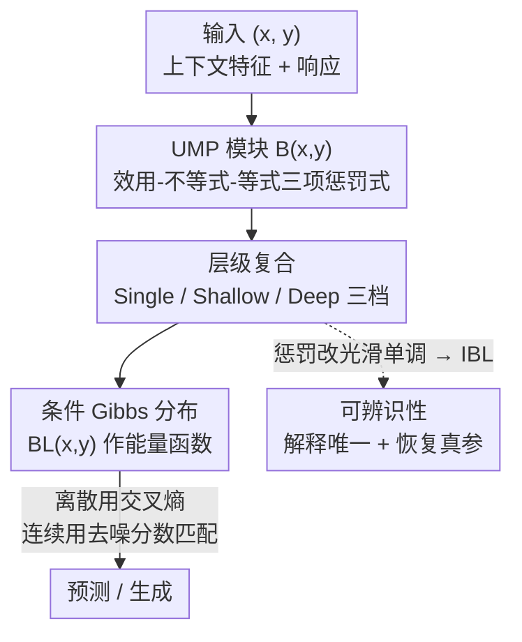

# Behavior Learning (BL)

**会议**: ICLR2026  
**OpenReview**: [https://openreview.net/forum?id=bbAN9PPcI1](https://openreview.net/forum?id=bbAN9PPcI1)  
**代码**: https://github.com/MoonYLiang/Behavior-Learning （`pip install blnetwork`）  
**领域**: 可解释机器学习  
**关键词**: 内在可解释性, 可辨识性, 效用最大化, 逆优化, 能量模型

## 一句话总结
受行为科学启发，把"观测结果是某个优化问题的解"这一假设直接做成可学习模块——每个模块是一个可写成符号形式的效用最大化问题（UMP），层级堆叠成复合效用函数并诱导一个 Gibbs 分布来做预测/生成，从而同时拿到强预测力、内在可解释性和（IBL 变体下的）参数可辨识性。

## 研究背景与动机
**领域现状**：可解释机器学习（Interpretable ML）希望既能拟合复杂现象、又自带透明性。现有缓解"性能-可解释性权衡"的路线大体四类：加性模型（GAM/EBM/NAM）、概念瓶颈模型、规则/打分系统、形状约束神经网络。

**现有痛点**：这些方法多数是"给已有 ML 方法外挂一层可解释性"，存在两个更深的毛病。其一是**与科学理论对不齐**——它们不是从优化问题、微分方程这类科学建模范式出发，导致从模型里很难抽出能被科学界采信的知识。其二是**解释不唯一**——大部分模型是非可辨识（non-identifiable）的：同样的预测可以对应很多套不同参数/解释，于是无法可靠估计"真实参数"，甚至失去波普尔意义上的可证伪性，科学可信度打折扣。

**核心矛盾**：高性能模型（深网）不透明，内在可解释模型又抓不住复杂非线性；同时即便可解释，解释本身还可能不唯一、不可辨识。要做"科学可用"的可解释 ML，必须把预测力、内在可解释性、可辨识性三者一次性绑在一起。

**本文目标**：设计一个**通用**框架，既缓解性能-可解释性权衡，又有科学根基（基于优化问题）且参数可辨识。

**切入角度**：作者借行为科学最基础的范式——**效用最大化**：人/主体的行为可看作在解一个"在约束下最大化主观效用"的优化问题（UMP）。更关键的是一个理论支点（定理 2.2）：**任意带等式/不等式约束的优化问题都能等价改写成一个 UMP**，所以以 UMP 为积木的框架天然是通用的，可用于宏观经济、统计物理、进化生物等"结果即优化解"的科学领域，本质上是在做**数据驱动的逆优化**。

**核心 idea**：用"可学习的 UMP 模块"代替"黑盒非线性层"——每个模块能写成符号化的优化问题，层级复合后用一个 Gibbs（能量）分布建模数据，把可解释性做进结构里而不是事后解释。

## 方法详解

### 整体框架
BL 把样本 $(x,y)$ 中的响应 $y$ 看成"主体在解一组相互作用的 UMP 后随机产生"的结果。输入是上下文特征 $x\in\mathbb{R}^d$，响应 $y$ 可同时含离散与连续部分 $(y_{disc}, y_{cont})$。整条链路是：把若干**可学习 UMP 模块** $B(x,y)$ 复合成一个**复合效用函数** $BL(x,y)$，再用它参数化一个条件 Gibbs 分布

$$p_\tau(y\mid x;\Theta)=\frac{\exp\big(BL_\Theta(x,y)/\tau\big)}{Z_\tau(x;\Theta)}$$

来做预测与生成；温度 $\tau\to 0$ 时分布退化为 Dirac 测度，集中在 $\arg\max_y BL(x,y)$，也就是恢复"解这组复合 UMP 得到的确定性最优响应"。整个网络端到端训练；通过把每个模块的惩罚函数改成光滑单调形式，得到可辨识变体 **IBL**，在温和条件下保证解释唯一、并能恢复真实参数。

### 关键设计

**1. UMP 模块：把一个优化问题做成可学习的一层**

这是缓解"与科学理论对不齐"的核心抓手。一个标准 UMP 是 $\max_{y} U(x,y)$ s.t. $C(x,y)\le 0,\ T(x,y)=0$，其中 $U$ 是主观效用、$C$ 是资源类不等式约束、$T$ 是信念一致性或守恒律类等式约束。作者用定理 2.1（局部精确罚函数重构）把这个带约束问题等价改写成无约束的罚式，再把它参数化成一个可学习模块：

$$B(x,y;\theta):=\lambda_0^\top\phi\big(U_{\theta_U}(x,y)\big)-\lambda_1^\top\rho\big(C_{\theta_C}(x,y)\big)-\lambda_2^\top\psi\big(T_{\theta_T}(x,y)\big)$$

其中 $\phi$ 递增、$\rho(z)=\max\{z,0\}$ 罚不等式违反、$\psi(z)=|z|$ 罚等式偏离。默认实例化为 $B=\lambda_0^\top\tanh(p_u)-\lambda_1^\top\mathrm{ReLU}(p_c)-\lambda_2^\top|p_t|$，$p_u,p_c,p_t$ 是有界次数的多项式特征映射。有界 $\tanh$ 恰好对应行为科学里的"边际效用递减"，ReLU 与 $|\cdot|$ 则是约束违反的软惩罚。妙处在于：**每个模块都能反写回符号化的 UMP**——$\tanh$ 项是目标、ReLU 项是不等式约束、绝对值项是等式约束，再加上多项式基，透明度可类比线性回归。

**2. 层级复合：从单个 UMP 到优化结构的"宏观-微观"层级**

单个 UMP 表达力有限，作者用 $B$ 作积木做层级复合，得到三档架构。**BL(Single)** 就一个 $B$，可解释性最强，直接等于一个符号 UMP；**BL(Shallow)** 堆一到两层，每层把多个并行 $B_{\ell,i}$ 拼成向量 $B_\ell(x,y)=[B_{\ell,1},\dots,B_{\ell,d_\ell}]^\top$ 喂给下一层；**BL(Deep)** 推到两层以上。统一写法为

$$BL(x,y):=W_L\cdot B_L\big(\cdots B_2(B_1(x,y))\cdots\big)$$

深层版可选地加 skip connection 提升表达效率。这种层级的意义不是堆参数，而是**对应科学里的"粗粒化/重整化"**：底层 $B$ 块是微观初级偏好，逐层向上聚合成宏观权衡与代表性主体。解释因此是自底向上、可追溯的：原始特征 → 微观优化块 → 宏观聚合/粗粒化构念 → 宏观优化系统。这让"框架可解释"不止是看单个模块，而是看整条 micro-to-macro 的优化层级。

**3. Gibbs 分布建模 + 混合目标：把复合效用当能量函数训练**

有了复合效用 $BL(x,y)$，怎么把它接到预测/生成上？作者把它当能量函数，用条件 Gibbs 分布（式见整体框架）建模数据，于是"最大化效用"和"最大化概率密度"在 $\tau\to0$ 时统一起来。训练目标按响应类型分治：离散部分直接对 $y_{disc}$ 用交叉熵；连续部分因为 $BL$ 类似能量函数、配分函数 $Z_\tau$ 难算，改用**去噪分数匹配**（denoising score matching）绕过归一化常数。最终目标是两者加权：

$$\mathcal{L}(\theta)=\gamma_d\,\mathbb{E}\big[-\log p_\tau(y_{disc}\mid x)\big]+\gamma_c\,\mathbb{E}\big\|\nabla_{\tilde y_{cont}}\log p_\tau(\tilde y_{cont}\mid x)+\sigma^{-2}(\tilde y_{cont}-y_{cont})\big\|^2$$

理论上作者证明 BL（及 IBL）具备**通用逼近**性质（定理 2.3）：容量足够时能在 KL 意义下任意逼近任何连续条件密度，说明"可解释"不以牺牲表达力为代价。

**4. IBL：把惩罚函数收紧成光滑单调，换来可辨识性**

BL 解决了"可解释+高性能"，但还没解决"解释唯一"。IBL 的做法是对模块施加更严的结构约束：$\phi_{id},\rho_{id}$ 严格递增、$\psi_{id}$ 关于 $|\cdot|$ 对称且严格递增，且三者都 $C^1$，实例化为 $B_{id}=\lambda_0^\top\tanh(p_u)-\lambda_1^\top\mathrm{softplus}(p_c)-\lambda_2^\top(p_t)^{\odot2}$（用 softplus、平方替掉 ReLU、绝对值）。这种光滑单调性让每个 UMP 块对目标和约束"平滑响应"，从而在温和假设（Assumption 2.1，原子参数映射单射 + 线性无关 + 最小表示规范排序）下得到一串保证：**可辨识性**（定理 2.4，结构相同且诱导同一复合效用 ⇒ 参数在等价类意义下唯一）、**损失可辨识**（定理 2.5，总体损失在商空间有唯一极小）、**一致性**（定理 2.6，$\hat\theta_n\xrightarrow{p}\theta^\bullet$，模型设定正确时进一步收敛到真参 $\theta^\star$）、以及**通用一致性**（定理 2.7，即使设定错误，随样本量增大学到的条件分布在 KL 下一致收敛到真分布）。这条线是 BL 区别于绝大多数"事后可解释"方法的关键：解释不仅存在，而且唯一、可被统计推断检验。

## 实验关键数据

### 标准预测任务（10 数据集 × 8 seeds）
对比 5 大类共 10 个基线（神经网络、树模型、梯度提升、贝叶斯、线性回归），统一预处理与调参。

| 模型 | F1-Macro 平均排名 | 定位 |
|------|------|------|
| SOTA 黑盒模型 | 第一梯队 | 性能上限 |
| BL(Shallow) | 第二/三档，与 SOTA 无显著差异 | 内在可解释模型里最好 |
| BL(Single) | 紧随其后 | 最强可解释性 |
| MLP | 被 BL(Shallow) 超过 | 黑盒对照 |

关键结论：BL 在 AUC 与 F1-Macro 上都达到第一梯队，且是所有内在可解释模型里最好的；BL(Shallow) 甚至超过 MLP，说明"可解释"没有牺牲性能。

### 高维输入可扩展性（图像 + 文本，对比 E-MLP）
深度 $d\in\{1,2,3\}$、参数量对齐、均不加 skip。

| 数据集 | 指标 | E-MLP (d=3) | BL (d=3) |
|--------|------|------|------|
| MNIST | OOD AUROC | 87.76 | **92.92** |
| Fashion-MNIST | OOD AUROC | 83.13 | **89.24** |
| MNIST | ID Acc | 98.14 | 97.93 |
| Fashion-MNIST | ID Acc | 89.33 | 88.79 |

图像上 ID 准确率与 E-MLP 相当、OOD 检测（尤其 Fashion-MNIST）更强；文本上 BL 的 ID 准确率全面优于 E-MLP，OOD 则因数据集而异（Yelp 上 BL 更好、AG News 上 E-MLP 更好）；BL 的校准指标 ECE/NLL 也更好。

### 关键发现
- BL 与 E-MLP 参数量高度可比、BL 训练时间略高，但**性能相当 + 多了内在可解释性**，作者称之为把 Pareto 前沿"向下平移"（同等性能下换来透明性）。
- 案例研究（Boston Housing）里，训练好的 BL(Single) 能被反写成一个"代表性买家"的符号 UMP：效用项 $p_u\approx(1-P)(1+P-RM)+\tilde R_u$；可视化显示房价 MEDV、房间数 RM 主导所有项，低收入比例 LSTAT 主要进预算约束，犯罪率 CRIM 只出现在"信念"项（买家把它当成影响他人行为而非自身偏好）。
- BL(Deep) [5,3,1] 逐层恢复出 5 种微观偏好 → 3 种宏观权衡 → 1 个代表性买家，且这些偏好/权衡模式与经典经济学文献吻合，说明 BL 能"重建底层科学知识"，与统计物理的粗粒化原理一致。

## 亮点与洞察
- **把"逆优化"做成可学习层**：核心是定理 2.2"任意优化问题都能写成 UMP"，于是一个以 UMP 为积木的网络天然通用——这是把行为科学范式直接变成网络结构、而不是事后套解释的关键一步。
- **可辨识性被当成一等目标**：大多数可解释 ML 只追求"能解释"，BL 进一步追问"解释唯一吗、能不能据此恢复真参"，并用光滑单调约束 + M-估计理论给出 IBL 的可辨识/一致性保证，这在可解释方向里是少见的扎实。
- **能量模型视角统一了预测与最大化**：用 Gibbs 分布把"最大化效用"和"最大化密度"在 $\tau\to0$ 时对齐，连续响应用去噪分数匹配绕开配分函数，工程上可落地。
- **层级 = 粗粒化**：把深层架构解释成 micro→macro 的优化层级而非单纯堆容量，这个迁移视角可用到任何"有层级优化结构"的科学建模（需求层级、社会组织、物理重整化）。

## 局限与展望
- **正确设定是强假设**：一致性恢复真参依赖"数据由某个 $\theta^\star$ 生成"，作者自己承认这通常不现实，只能退而求其次靠通用一致性（misspecification 下仍 KL 收敛）。
- **符号解释要靠近似**：把训练好的多项式反写成"可读 UMP"时，只保留 2–5 个最大系数的单项、其余塞进残差项 $\tilde R$，符号形式是近似而非精确——可读性与保真度之间仍有取舍。
- **深层版可解释性会打折**：BL(Deep) 用仿射映射替代高次多项式以省算力，符号粒度下降、解释从"符号化"退化为"定性"；skip connection 又引入跨层依赖，进一步削弱单块的纯净解释。
- **实验规模偏中小**：标准任务是 10 个表格类数据集，高维实验也只到 MNIST/Fashion-MNIST/AG News/Yelp 量级，是否能扩到真正大规模/复杂模态仍待验证。

## 相关工作与启发
- **vs 加性/概念瓶颈/规则模型（GAM、CBM、规则系统）**: 它们多是给现有 ML 外挂可解释性，缺科学根基且常不可辨识；BL 从优化问题（UMP）出发自带科学语义，并通过 IBL 给出可辨识性保证，区别在"解释唯一且可被统计检验"。
- **vs 能量模型 / E-MLP**: 都用能量函数建条件分布，但 E-MLP 是黑盒；BL 把能量函数结构化为可符号化的 UMP 复合，参数量/性能相当时多出内在可解释性，相当于把 Pareto 前沿向下平移。
- **vs 神经符号 / 符号回归**: 同样追求符号可读，但 BL 把符号结构钉死在"效用-约束"优化范式上，并配套通用逼近与一致性理论，定位是数据驱动逆优化的通用框架而非单纯拟合表达式。

## 评分
- 新颖性: ⭐⭐⭐⭐⭐ 把"任意优化问题=UMP"做成可学习层、并把可辨识性当一等目标，视角很新
- 实验充分度: ⭐⭐⭐⭐ 预测/可解释案例/高维三组实验齐全，但规模偏中小、缺大模态验证
- 写作质量: ⭐⭐⭐⭐ 理论-方法-实验闭环清晰，但定理密集、符号较重，需配附录才好读
- 价值: ⭐⭐⭐⭐⭐ 给"科学可用的可解释 ML"提供了一个有理论保证的通用范式

<!-- RELATED:START -->

## 相关论文

- [\[ICML 2026\] Discovering Differences in Strategic Behavior Between Humans and LLMs](../../ICML2026/interpretability/discovering_differences_in_strategic_behavior_between_humans_and_llms.md)
- [\[ICLR 2026\] Comparing the learning dynamics of in-context learning and fine-tuning in language models](comparing_the_learning_dynamics_of_in-context_learning_and_fine-tuning_in_langua.md)
- [\[ICML 2026\] ExPLAIND: Unifying Model, Data, and Training Attribution to Study Model Behavior](../../ICML2026/interpretability/explaind_unifying_model_data_and_training_attribution_to_study_model_behavior.md)
- [\[ICLR 2026\] Learning Nonlinear Causal Reductions to Explain Reinforcement Learning Policies](learning_nonlinear_causal_reductions_to_explain_reinforcement_learning_policies.md)
- [\[AAAI 2026\] ElementaryNet: A Non-Strategic Neural Network for Predicting Human Behavior in Normal-Form Games](../../AAAI2026/interpretability/elementarynet_a_non-strategic_neural_network_for_predicting_human_behavior_in_no.md)

<!-- RELATED:END -->
