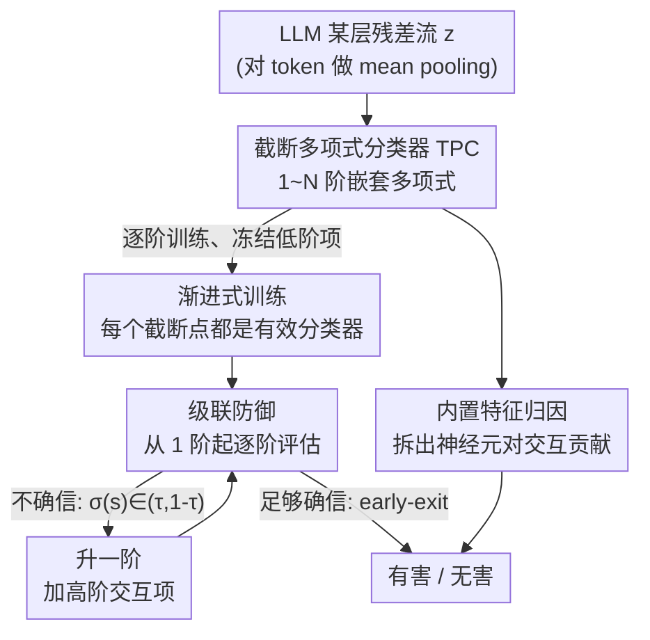

# Beyond Linear Probes: Dynamic Safety Monitoring for Language Models

**会议**: ICLR 2026  
**arXiv**: [2509.26238](https://arxiv.org/abs/2509.26238)  
**代码**: [https://github.com/james-oldfield/tpc](https://github.com/james-oldfield/tpc)  
**领域**: 模型安全 / 激活空间监控 / AI安全  
**关键词**: 截断多项式分类器, 安全监控, 动态推理, 线性探针, 激活空间  

## 一句话总结
提出截断多项式分类器（TPC），通过对 LLM 激活空间中的多项式逐阶训练和截断评估，实现动态安全监控——在简单输入上用低阶（≈线性探针）快速决策，在困难输入上增加高阶项提供更强防护，在 WildGuardMix 和 BeaverTails 两个数据集上匹敌或超越 MLP 基线且具备内置可解释性。

## 研究背景与动机

**领域现状**：LLM 安全监控主要有两类方法——基于 LLM-as-Judge 的自然语言审查（昂贵但强大）和基于激活空间的线性探针（廉价但静态）。前者对每个查询都付出固定的高成本，后者只能提供最基本的静态防护线。

**现有痛点**：
   - 线性探针是静态的，无法根据输入难度或可用预算调节防护强度
   - LLM-as-Judge 成本高，不适合作为始终在线的监控器
   - 近期将两者级联的工作（如 McKenzie et al., 2025）仍需要额外的 LLM 微调/提示和额外的推理调用
   - "线性表征假说"假设高级概念以一维子空间编码，但越来越多证据表明并非所有特征都有简单的线性结构

**核心矛盾**：安全监控存在固有的成本-精度权衡——大多数请求是良性的（不需要强防护），但少数模糊/恶意请求需要更强的分辨能力。现有方法要么全部按最高成本处理，要么全部按最低精度处理。

**本文目标**
   - 如何让单个安全监控器在不同计算预算下都能工作？
   - 如何让监控器对简单输入快速放行、对困难输入深入检查？
   - 如何在提升分类能力的同时保持可解释性（相比黑盒 MLP）？

**切入角度**：借鉴 test-time compute scaling 的思想——计算资源应在推理时动态分配而非固定分配；多项式天然具有按阶截断的可加性结构，恰好适合实现渐进式计算。

**核心 idea**：将线性探针推广为可截断的多项式分类器，通过逐阶训练产生一系列嵌套子模型，在推理时按需截断评估——低阶恢复线性探针、高阶提供更强防护。

## 方法详解

### 整体框架
TPC 想解决的是「一个安全监控器、多种计算预算」：简单输入用接近线性探针的低成本快速放行，困难输入再投入更多算力深入检查。整体上，先把 LLM 某一层的残差流表示 $\bm{z} \in \mathbb{R}^D$（对所有 token 做 mean pooling）喂给一个 $N$ 阶多项式分类器；这个多项式按阶**逐阶训练**成一串嵌套子模型，推理时从低阶到高阶**级联评估、按置信度提前退出**，最终输出有害/无害的二分类概率，并能顺带把决策**归因到具体的神经元交互**。多项式可在推理时截断为任意 $n \leq N$ 阶的子模型，形式为 $P_{:n}^{[N]}(\bm{z}) = w^{[0]} + \bm{z}^\top \bm{w}^{[1]} + \sum_{k=2}^{n} \sum_{r=1}^{R} \lambda_r^{[k]} (\bm{z}^\top \bm{u}_r^{[k]})^k$。

### 关键设计

**1. 截断多项式分类器（TPC）：用可截断的多项式取代静态线性探针**

线性探针只能捕捉激活空间里的一阶（线性）信息，TPC 把它推广成一个 $N$ 阶多项式，用高阶乘性交互项去建模神经元之间的关系。截断到 $n=1$ 时，模型退化回标准线性探针 $w^{[0]} + \bm{z}^\top \bm{w}^{[1]}$；每往上加一阶 $k$，就引入 $k$ 个神经元间的乘性交互项。为了不让高阶权重张量参数爆炸，每阶用对称 CP 分解参数化：

$$\mathcal{W}^{[k]} = \sum_{r=1}^{R} \lambda_r^{[k]} (\bm{u}_r^{[k]} \circ \cdots \circ \bm{u}_r^{[k]})$$

于是每阶只需 $O(DR)$ 个参数。这种可加结构正是 TPC 能截断评估的关键——后续高阶项本质上只是在前面项累积的 logits 上做精细修正，而对称分解又顺手消掉了同一单项式的冗余参数。

**2. 渐进式训练（Progressive Training）：让每个截断点本身都是好分类器**

如果直接把完整 $N$ 阶多项式一次训完再去截断，截断后的子模型性能完全不可控（实验里直接训练时各截断点性能剧烈波动）。TPC 改成逐阶训练：第 $k$ 阶参数 $\bm{\theta}^{[k]}$ 通过最小化截断到 $k$ 阶的 BCE 损失来学习，同时冻结前 $k-1$ 阶已学好的参数，第 1 阶则直接继承线性探针的预训练权重。这样每个截断点都被显式优化成一个有效分类器，而且新加的高阶不会破坏已有低阶截断的表现。思路上类似深度网络的贪心逐层训练，只是这里逐的是多项式的"阶"而非网络的"层"。

**3. 级联防御（Cascading Defense）：按输入难度动态决定用几阶**

有了"每个截断点都可用"这个前提，推理时就能做 early-exit。从 $n=1$ 开始逐阶评估，每一阶检查 $\sigma(s) \in (\tau, 1-\tau)$ 是否成立（$\tau$ 为置信阈值）：如果当前预测的概率已经落在阈值之外、足够确信，就立刻输出；否则继续算下一阶。背后的观察是大多数请求都是良性的，线性探针就能高置信放行，只有少量模糊或对抗性输入才值得动用高阶模型。实验里在中高 $\tau$ 下，级联的整体性能接近完整多项式，但净参数量只略高于线性探针——相当于几乎免费拿到了更强防护。

**4. 内置特征归因：把决策追溯到具体的神经元交互**

MLP 是黑盒，没法说清某个决策是哪些神经元造成的；TPC 的多项式形式天然可归因。以 2 阶项为例，它对 logits 的贡献能拆成 $c_{ij} = (w_{ij}^{[2]} + w_{ji}^{[2]}) z_i z_j$，直接量化任意一对神经元 $(i,j)$ 的交互对分类结果的影响。于是模型可以精确说出类似"神经元 4830 与 4916 的交互让有害分类 logits 增加了 0.005"这样的结论，而这正是黑盒 MLP 做不到的。

### 损失函数 / 训练策略
- 每阶使用标准 BCE 损失训练，冻结前序阶参数
- 第 1 阶权重从 sklearn 线性探针初始化
- 实验中使用 $N=5$, CP 秩 $R=64$, 5 个随机种子
- 激活向量提取自中间层（gemma-3 用 L32/L40, gpt-oss/llama 用 L16/L20）

## 实验关键数据

### 主实验（WildGuardMix 静态评估, Test F1%）

| 方法 | gemma-3-27B | Qwen3-30B | gpt-oss-20b | Llama-3.2-3B |
|------|------------|-----------|-------------|-------------|
| Linear probe | 88.03 | 85.53 | 86.70 | 83.24 |
| Bilinear probe | 88.79 | 84.87 | 87.13 | 84.78 |
| MLP | 88.49 | 85.48 | 87.86 | 83.77 |
| EE-MLP (5th exit) | 88.39 | 85.24 | 87.31 | 83.84 |
| **TPC (5th order)** | **88.86** | **85.57** | **88.05** | **84.48** |

### 级联防御效果（gemma-3-27B, L40）

| 配置 | 净参数量 | F1 | 说明 |
|------|---------|-----|------|
| Linear probe only (n=1) | 基准 | ~88.0 | 所有输入用线性探针 |
| Full TPC (n=5, 无级联) | 5× | ~88.9 | 所有输入用完整多项式 |
| Cascade (τ=中高) | ~1.1× | ~88.8 | 大部分输入在低阶退出 |
| Cascade (τ=高) | ~1.3× | ~88.9 | 接近完整多项式性能 |

### 关键发现
- **TPC 在 WildGuardMix 上全面超越所有基线**（含参数量匹配的 MLP），在 BeaverTails 上与 EE-MLP 基本持平
- 特定有害类别上，固定阶 TPC 相比线性探针最高提升 10% 准确率，相比 MLP 最高提升 6%
- **级联评估是最大亮点**：中高τ值下性能接近完整多项式，但净参数量仅略多于线性探针——相当于几乎免费获得了更强防护
- 渐进训练 vs 直接训练：直接训练完整多项式后截断，各截断点性能不稳定；渐进训练确保每个截断点都是有效分类器
- 2阶 TPC 的神经元对归因能解释分类决策（如"核弹"提示中神经元 4830×2483 交互增加了有害 logits）

## 亮点与洞察
- **"一个模型，多个安全预算"的理念**是本文最核心的洞察——将 test-time compute scaling 的思想引入安全监控，用多项式的截断性质自然实现。这个设计思路可迁移到任何需要灵活精度的分类任务
- **渐进训练方案**巧妙解决了截断多项式的训练-评估不一致问题。类比深度网络的 greedy layer-wise training，但应用于多项式阶数维度——保证低阶独立可用，高阶只做增量精修
- **对称 CP 分解**既解决了高阶张量的参数爆炸问题，又提供了可解释的神经元交互归因。传统 MLP 无法做到的"精确追溯某对神经元对决策的贡献"在 TPC 中自然获得

## 局限与展望
- 未探索小数据场景——高阶多项式容易过拟合，可能需要更强正则化
- 神经元对归因虽然机械上忠实，但缺乏人类可读的语义解释——"神经元 4830×4916 交互"本身不告诉你"为什么"
- 性能并非随阶数单调递增，所有激活监控器都需要搜索合适的层
- 仅在 prompt 级别二分类上实验，未验证在更细粒度的安全分类（如具体有害类别检测）或 response 监控上的效果
- **改进思路**：在 SAE 特征空间上做多项式展开可能同时获得稀疏性和可解释性；多层探针集成可避免单层选择的手动搜索

## 相关工作与启发
- **vs Linear Probes (Alain & Bengio, 2017)**: 线性探针是 TPC 在 $n=1$ 时的特例。TPC 保留了线性探针的所有优点（轻量、可解释），同时通过高阶项在需要时提供更强分类能力
- **vs McKenzie et al. (2025) 级联方法**: 他们用线性探针 + 外部 LLM 做两阶级联，需要额外的 LLM 微调。TPC 在单个多项式内部实现多层级联，无需外部模型，更轻量
- **vs MLP Probes**: MLP 可能更有表达力，但是黑盒——TPC 在参数量匹配时性能相当甚至更好，且提供内置的神经元交互归因

## 评分
- 新颖性: ⭐⭐⭐⭐ 多项式探针本身不新，但截断评估+渐进训练+级联防御的组合在安全监控中是首次，设计优雅
- 实验充分度: ⭐⭐⭐⭐⭐ 4个模型（最大30B）、2个大规模数据集、多层扫描、级联消融、渐进训练对比、归因可视化，非常全面
- 写作质量: ⭐⭐⭐⭐ 结构清晰、公式严谨、Figure 1 直观，但部分符号略显冗余
- 价值: ⭐⭐⭐⭐ 为LLM安全监控提供了实用的动态方案，级联防御在实际部署中价值显著——用接近线性探针的成本获得非线性探针的性能

<!-- RELATED:START -->

## 相关论文

- [\[ICLR 2026\] GAVEL: Towards Rule-Based Safety through Activation Monitoring](gavel_towards_rule-based_safety_through_activation_monitoring.md)
- [\[ICLR 2026\] Linear Mechanisms for Spatiotemporal Reasoning in Vision Language Models](linear_mechanisms_for_spatiotemporal_reasoning_in_vision_language_models.md)
- [\[ICLR 2026\] Rethinking Layer Relevance in Large Language Models Beyond Cosine Similarity](rethinking_layer_relevance_in_large_language_models_beyond_cosine_similarity.md)
- [\[ACL 2026\] Linear Probes Detect Task Format, Not Reasoning Mode in Language Model Hidden States](../../ACL2026/interpretability/linear_probes_detect_task_format_not_reasoning_mode_in_language_model_hidden_sta.md)
- [\[ICML 2026\] What Linear Probes Miss: Multi-View Probing for Weight-Space Learning](../../ICML2026/interpretability/what_linear_probes_miss_multi-view_probing_for_weight-space_learning.md)

<!-- RELATED:END -->
