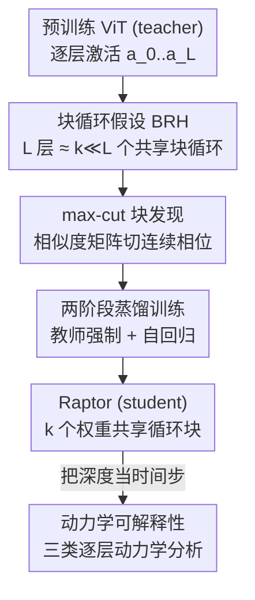

# Block Recurrent Dynamics in Vision Transformers

**会议**: ICLR2026  
**OpenReview**: [https://openreview.net/forum?id=gH3HhnfWLC](https://openreview.net/forum?id=gH3HhnfWLC)  
**代码**: https://kempnerinstitute.github.io/raptor  
**领域**: interpretability and explainable AI  
**关键词**: ViT 机制可解释、块循环、动力学系统、知识蒸馏、DINOv2

## 一句话总结
本文提出"块循环假设"（BRH）：训练好的 ViT 的 $L$ 层深度其实只用 $k \ll L$ 个权重共享的块循环展开就能近似，作者用一套蒸馏方法 Raptor 把 DINOv2 压成 2-3 个循环块仍保住 96%-98% 的 ImageNet 线性探针精度，并据此把 ViT 当作离散时间动力学系统来解释其逐层计算。

## 研究背景与动机
**领域现状**：ViT 已经成为视觉基础模型（DINOv2、CLIP、SAM、扩散模型）的默认骨干。架构上层层堆叠、带残差连接，早就有人猜测残差网络的"深度"和动力学系统、隐式循环有关，但视觉领域一直没有一个公认的框架把 Transformer 的深度刻画成一条"流"（flow）。

**现有痛点**：人们早就观察到一个现象——把 ViT 各层表示两两算相似度，相似度矩阵呈**块对角**结构（几段连续的层彼此高度相似）。但"表示相似"不等于"计算等价"：两层可能走完全不同的计算路径却产生相似的表示，反之亦然。所以光看相似度矩阵无法回答一个根本问题——这些"相位"（phase）到底是不是同一段计算在被反复复用？

**核心矛盾**：表示相似度（representational similarity）与功能等价（functional equivalence）之间隔着一道无法直接跨越的沟。要证明"复用"，必须**构造性地**拿出一个真用少数几个块循环就能重建整条内部轨迹的模型。

**本文目标**：(1) 形式化"块循环"这一假设并给出可验证的判据；(2) 用真实模型证明它在基础模型（DINOv2）上成立；(3) 一旦把 ViT 看成循环系统，就能借动力学系统的工具去解释它逐层在做什么。

**切入角度**：作者押注"简单性是理解的入口"——如果深度本质上是少量计算原语的迭代复用，那 ViT 就可以被当作离散时间动力学系统来分析（每一层是一次时间步演化）。

**核心 idea**：把 ViT 的 $L$ 层用 $k \ll L$ 个参数共享块**循环复用**来改写，并要求重建的不只是最终输出、而是**逐层中间表示的完整轨迹**——以此把"是否复用"从猜想变成可证伪的实验。

## 方法详解

### 整体框架
方法围绕一个目标展开：拿一个预训练好的 ViT（teacher），造一个只用 $k$ 个权重共享块、循环展开后逐层逼近 teacher 全部中间激活的代理模型（student），这个代理就叫 **Raptor**（Recurrent Approximations to Phase-structured TransfORmers）。整条流水线是：先用相似度矩阵把深度切成几个连续相位（max-cut 块发现），决定每个块要循环几次；再用"教师强制 + 自回归"两阶段把 $k$ 个块蒸馏出来；最后把训练好的循环系统当成离散动力学，做三类动力学分析。

### 关键设计

**1. 块循环假设（BRH）：把"表示相似"逼成"功能等价"的可证伪判据**

针对的痛点是"块对角相似度矩阵到底意味不意味着计算被复用"。作者给出形式定义：设训练好的 ViT 有名义深度 $L$、逐层映射 $f_\ell$，称 $f$ 满足 $\varepsilon$-BRH，若存在 $k \ll \ell$ 个块 $B_1,\dots,B_k$ 和重复次数 $n_1,\dots,n_k$（$\sum_j n_j=\ell$）使得

$$\mathbb{E}_{x\sim P}\big[\,\|f_\ell(x)-(B_k^{(n_k)}\circ\cdots\circ B_1^{(n_1)})(x)\|_F\,\big]\le \varepsilon,$$

其中 $B_j^{(n_j)}$ 表示同一个参数共享块 $B_j$ 连续应用 $n_j$ 次。关键之处在于它要求逼近**任意中间层** $f_\ell$ 而非只对齐最终输出——这一条直接排除了"把所有计算塞进一个块"的平凡解；同时 $k\ll L$ 加上参数绑定，保证是真正的"功能复用"而不是"参数复制"。这把一个模糊的观察变成了一个可以拿真实模型去构造验证的命题。

**2. max-cut 块发现：从相似度矩阵自动切出"循环相位"**

给定块数 $k$，还得决定每个块循环几次、相位边界切在哪。作者把它建模成**带权 max-cut** 问题（用动态规划求解）：在层-层余弦相似度矩阵上，把深度切成若干**连续段**，使段内相似度最大、跨段相似度最小。切出来的边界就是表示动力学发生剧烈转折的地方，对应候选的循环相位。实验显示 max-cut 切出来的划分明显优于随机划分（CIFAR-100 上常常超出随机划分一个标准差以上），说明"表示块相似结构"和"功能块循环相位"确实强相关。作者还做了层交换实验佐证：块**内**换层精度不变、块**间**换层模型崩溃——证明每个块的身份是功能上唯一的。

**3. 两阶段蒸馏训练（教师强制 + 自回归）：让循环块既稳又能闭环**

循环架构出了名地难训：rollout 时小误差会逐步累积漂移、跨多步反传梯度容易消失/爆炸。作者的解法是把 teacher 的逐层激活直接当训练目标，分两阶段。**第一阶段**并行训练每个块，混合两种目标：教师强制（TF，喂 teacher 的真实上一层激活、只预测下一层）保证稳定，自回归（AR，喂自己上一步预测）保证闭环自洽，总损失为

$$L_{\text{total}}(x)=\lambda L_{\text{TF}}(x)+(1-\lambda)L_{\text{AR},H}(x)+\Omega(\theta),$$

其中自回归损失 $L_{\text{AR}}^h(x)=\mathbb{E}_x\big[\sum_{\ell=1}^{h}\|\tilde a_\ell(x)-a_\ell(x)\|_F\big]$ 在所有中间层上强制轨迹保真，TF 权重 $\lambda$ 随训练退火到 0。由于各块负责不同层段，第一阶段天然可跨 GPU 并行。**第二阶段**把所有块连成完整循环系统、令 $\lambda=0$ 纯自回归端到端微调，逼各块学会协调彼此、处理自己产生的预测而非依赖 teacher 的真值输入。消融显示这一步至关重要：只用教师强制（仅第一阶段）会彻底崩溃（ImageNet 上约 3%），加入自回归退火后精度暴涨 68%+。

**4. 动力学可解释性：把深度当时间步，读出三类逐层动力学规律**

既然 ViT 能压成少数块循环迭代，作者顺势把它当**离散时间动力学系统**分析（第 $\ell$ 层 = 第 $\ell$ 个时间步）。由于特征范数随深度持续增长、欧氏意义上无从谈收敛，分析全部在单位球面上对**方向**做。读出三个发现：(i) **方向收敛到角度吸引子**——定义方向收敛度 $\gamma_\ell=\langle \hat x_\ell,\hat x_L\rangle$，它沿深度呈 S 形逼近 1，不同类别的轨迹卷入紧凑的"类相关角度盆地"，且对小扰动有自我纠正（扰动后轨迹会弯回原路），说明存在方向不动点；(ii) **token 各有各的动力学**——定义角速度 $s_\ell=\arccos\langle\hat x_{\ell+1},\hat x_\ell\rangle$，register token 速度小而稳、patch token 居中、cls token 在末段急剧重定向（对应它"全局聚合器"的角色），且角速度统计在 max-cut 相位边界处突变，呈"相位内近平稳、边界处重置"的断点式模式，正好印证块循环视角；(iii) **末段低秩集体运动**——逐层角度更新的稳定秩/有效秩随深度下降到末段约为 6，patch token 相干性急升，类似平均场效应，与"收敛到低维吸引子"一致。

### 损失函数 / 训练策略
核心是上面的两阶段混合损失。两个额外 trick 进一步提精度：**深度缩放**（depth scaling）给每个块加一个对应目标层索引的可学习向量嵌入，使 Raptor 成为**非自治**动力学系统（更新规则显式依赖迭代步数而非仅依赖状态）；**cls 加权**上调最后一个块 cls token 的损失权重。蒸馏全程 ViT 骨干冻结，只更新线性探针头，并复用 DINOv2 的 patch embedding 与末层 LayerNorm。

## 实验关键数据

### 主实验
在 ImageNet-1k（分类）、ADE20k（语义分割）、NYUv2（单目深度）三个任务上用线性探针对比 Raptor 与 DINOv2，骨干全程冻结：

| 方法 | 架构 | IN-1k Acc ↑ | ADE20k mIoU ↑ | NYUv2 RMSE ↓ |
|------|------|------|------|------|
| Raptor | k=2 | 81.2 ± 0.2 | 39.6 ± 0.6 | 0.648 ± 0.003 |
| Raptor | k=3 | 83.0 ± 0.1 | 43.0 ± 0.3 | 0.618 ± 0.006 |
| Raptor | k=4 | 83.2 ± 0.1 | 43.6 ± 0.1 | 0.607 ± 0.006 |
| DINOv2 | ViT-S | 80.9 | 44.6 | 0.600 |
| DINOv2 | ViT-B | 84.5 | 47.5 | 0.578 |

仅 2 个循环块就保住 DINOv2 ViT-B 约 96% 的 IN-1k 精度，3 个块达 98%（83.0% top-1，且已超过 ViT-S），$k=2\to3$ 提升明显、$k=4$ 基本饱和。

### 消融实验
对 Raptor（k=3）逐步加组件（IN-1k 精度，用 DINOv2 预训练线性分类器）：

| 配置 | 精度 | 说明 |
|------|------|------|
| 仅教师强制 (TF) | 3.9 | 一步监督，闭环崩溃 |
| + 自回归(退火 TF) | 72.7（↑68.8） | 闭环训练是稳定的关键 |
| + 深度缩放 | 75.2（↑2.5） | 块带层索引嵌入，变非自治系统 |
| + cls 加权 | 76.7（↑1.5） | 上调末块 cls 损失 |
| + 第二阶段 | 82.4（↑5.7） | 三块连一起整体自回归微调 |
| + 微调分类器 | 83.0（↑0.6） | 最后调线性探针 |

### 关键发现
- **自回归闭环是命门**：去掉它（只教师强制）精度从 70+ 直接塌到 ~3%，证明循环近似必须见过自己产生的完整轨迹才稳。
- **第二阶段贡献第二大**（+5.7）：块之间需要端到端学会协调，光各自训练不够。
- **块循环结构靠训练涌现**：随机初始化 ViT 用随机深度（stochastic depth）训练时，丢弃率 $p$ 越高层-层相似度越强、Raptor 重建保真度越高、CIFAR 精度也越高——说明随机深度正则化在主动促进循环可压缩性；而未训练 ViT 反而比训练后的更易被重建，过拟合一旦发生重建精度就掉。

## 亮点与洞察
- **把"可解释性"从相关性证据升级成构造性证据**：不满足于"相似度矩阵看着像块对角"，而是真训出一个循环模型逐层复刻整条轨迹——这是从"看起来像"到"功能上就是"的关键一跳，方法学上很值得借鉴。
- **复杂度视角很漂亮**：作者指出 Raptor 不是普通 Kolmogorov 压缩（短程序但运行时间无界），而是**保持运行时不变**的压缩（同一块用 $n_j$ 次 = $n_j$ 个不同块的运行时），因此更贴近 Levin 复杂度 $K_{\text{Levin}}$——即"在同样算力预算下 ViT 有更紧凑的程序表示"。这把"参数换迭代"的直觉量化了。
- **动力学这把尺子可迁移**：把深度网络当离散动力学、在球面上分析方向收敛/角速度/低秩坍缩的整套工具，并不局限于 ViT，原则上可搬到任何带残差的深层网络去找"相位"和"吸引子"。
- **随机深度的新解读**：随机深度一直被当成正则化 trick，本文给了它一个机制层面的解读——它在显式鼓励层间功能复用、让网络更"循环化"。

## 局限与展望
- **作者承认**：目标不是极致压缩或精确匹配精度，所以 Raptor 在密集预测（分割/深度）上离 DINOv2 仍有可见差距（如 ADE20k mIoU 43.6 vs 47.5），分类任务才是它的强项。
- **覆盖面有限**：基础模型实验只在 DINOv2（ViT-Base）上做，是否在 CLIP、SigLIP、更大尺度或不同训练目标的 ViT 上同样成立、$k$ 该取多少，尚未系统验证。
- **动力学发现偏定性**：角度吸引子、低秩坍缩等结论主要靠可视化和统计曲线支撑，缺少把这些机制性观察转化为可操作干预（如编辑/纠错/验证）的下游实证。
- **可改进方向**：把"块循环 + 动力学分析"接到具体的安全/诊断任务上（论文动机里反复强调的可检视、可诊断、可验证），让这套可解释性框架产出能用的工具而不止于描述。

## 相关工作与启发
- **vs 经典知识蒸馏（如 DistilBERT / hint learning）**：经典蒸馏通常监督 logits、偶尔加几个中间 hint；本文要求**全深度逐层一对一对齐**所有表示，循环代理必须生成 teacher 的全部中间激活而非仅预测结果——目标更苛刻，因为目的是验证"复用"而非压缩。
- **vs 语言模型里的块循环 / Universal Transformer**：语言侧已有人观察并利用连续块循环（Geiping 等、Dehghani 的 Universal Transformer）；本文把这条线引入视觉并配上动力学系统分析，首次在视觉基础模型上给出 BRH 的存在性证据。
- **vs Neural ODE / 残差即动力学**：残差网络对应离散时间动力学早有人提（Chen 的 Neural ODE 等），本文不是去训练连续流，而是反过来**从已训练好的 ViT 里提取**循环结构，并在单位球面上做方向动力学分析，落点在"解释已有模型"而非"设计新架构"。

## 评分
- 新颖性: ⭐⭐⭐⭐⭐ 把块循环假设形式化 + 构造性验证 + 动力学可解释性三件套串成一条完整论证链，视觉侧少见。
- 实验充分度: ⭐⭐⭐⭐ 从玩具 ViT 到 DINOv2、三任务 + 多消融 + 随机深度机制实验都做了，但基础模型只覆盖 DINOv2。
- 写作质量: ⭐⭐⭐⭐ 逻辑严密、命题清晰，公式与复杂度论证扎实；动力学部分信息密度偏高、对读者不太友好。
- 价值: ⭐⭐⭐⭐⭐ 给"ViT 为何有效"提供了一个简单性 + 动力学的可检验视角，且方法可迁移到其他深层残差网络。

<!-- RELATED:START -->

## 相关论文

- [\[ICLR 2026\] InputDSA: Demixing, then comparing recurrent and externally driven dynamics](inputdsa_demixing_then_comparing_recurrent_and_externally_driven_dynamics.md)
- [\[ICLR 2026\] Decoupling Positional and Symbolic Attention in Transformers](decoupling_positional_and_symbolic_attention_in_transformers.md)
- [\[ICLR 2026\] Discovering Alternative Solutions Beyond the Simplicity Bias in Recurrent Neural Networks](discovering_alternative_solutions_beyond_the_simplicity_bias_in_recurrent_neural.md)
- [\[ICML 2026\] Dissecting Multimodal In-Context Learning: Modality Asymmetries and Circuit Dynamics in modern Transformers](../../ICML2026/interpretability/dissecting_multimodal_in-context_learning_modality_asymmetries_and_circuit_dynam.md)
- [\[CVPR 2026\] Inside-Out: Measuring Generalization in Vision Transformers Through Inner Workings](../../CVPR2026/interpretability/inside-out_measuring_generalization_in_vision_transformers_through_inner_working.md)

<!-- RELATED:END -->
