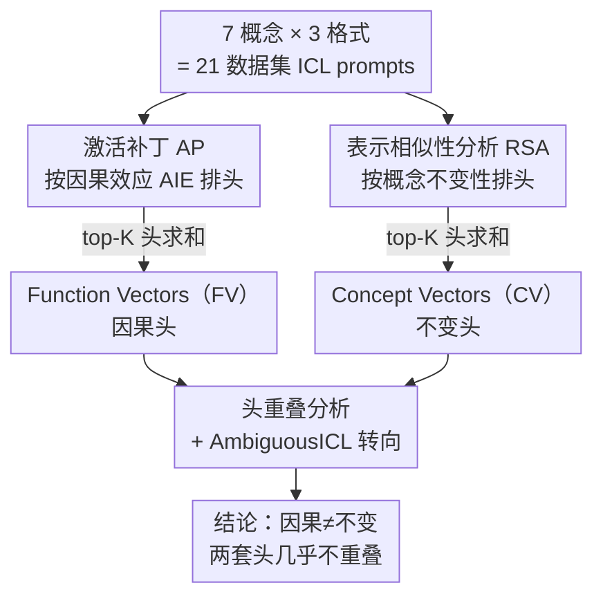

# Causality ≠ Invariance: Function and Concept Vectors in LLMs

**会议**: ICLR2026  
**OpenReview**: [https://openreview.net/forum?id=LmLmhb6GEL](https://openreview.net/forum?id=LmLmhb6GEL)  
**代码**: 待确认  
**领域**: 机制可解释性  
**关键词**: 函数向量, 概念向量, 表示相似性分析, 上下文学习, 激活补丁

## 一句话总结
这篇论文区分了 LLM 里两类截然不同的注意力头——用激活补丁找到的"因果头"（组成 Function Vectors，真正驱动上下文学习行为）和用表示相似性分析找到的"不变头"（组成 Concept Vectors，跨输入格式/语言稳定地编码抽象关系概念），证明二者几乎不重叠，从而揭示"是什么驱动了任务表现"和"什么编码了抽象概念"在 LLM 中由不同机制承担。

## 研究背景与动机
**领域现状**：一个核心问题是 LLM 是否"抽象地"表示概念——即不依赖具体输入形式地表示"反义""因果"这类关系结构。机制可解释性领域近年提出了 **Function Vectors（FV，函数向量）**：Todd et al. (2024) 发现，把一小撮注意力头的输出加起来得到的紧凑向量，能在上下文学习（ICL）任务里因果地驱动模型给出正确答案，而且这个向量能跨不同上下文（不同格式的 prompt、自然文本）迁移使用。正因为能迁移，大量后续工作就默认 FV 编码的是"底层概念本身"。

**现有痛点**：作者直接挑战这个默认假设——FV 真的是格式无关（input-invariant）的吗？如果 FV 同时混进了输入格式信息，那"FV = 概念表示"这个广为流传的结论就站不住脚，整个把 FV 当成概念探针/转向工具的研究范式都需要修正。

**核心矛盾**：关键在于把两件事混为一谈了：① **因果性（causality）**——哪些组件真正驱动模型在 ICL 上的行为；② **不变性（invariance）**——哪些组件稳定地编码抽象概念、不随表面形式变化。学界默认这两者由同一套电路承担（"single-circuit hypothesis"），但作者怀疑它们其实是分离的。

**本文目标**：(1) 检验 FV 是否真的格式不变；(2) 如果不是，找出真正格式不变的概念表示由哪些头承载；(3) 比较这两套头是否相同，并验证它们在转向（steering）上的不同行为。

**切入角度**：因果性该用 **激活补丁（Activation Patching, AP）** 来定位（它测的是"动了这个头，输出概率变多少"），而不变性该用认知神经科学里的 **表示相似性分析（Representational Similarity Analysis, RSA）** 来定位（它测的是"这个头的表示是否按概念而非格式来组织"）。两种工具问的是不同的问题，自然可能选出不同的头。

**核心 idea**：用 RSA 选头、把它们的激活加起来构造 **Concept Vectors（CV，概念向量）**，与 AP 选头构造的 FV 对照——结果发现 CV 头和 FV 头几乎不重叠，证明"驱动 ICL 行为的因果机制"与"编码抽象概念的不变机制"在 LLM 中是分开的。

## 方法详解

### 整体框架
整篇工作围绕同一批 prompt 数据展开：定义 7 个关系概念（反义、类别、因果、同义、翻译、现在→过去时、单→复数）× 3 种输入格式（英文开放式 OE-EN、另一语言开放式 OE-FR/ES、英文多选 MC）= 21 个数据集，每个数据集 50 条 few-shot ICL prompt，共 1050 条。然后用两条平行的"选头"路线分别定位两类注意力头，把各自 top-K 头的输出激活求和，得到 FV 和 CV 两种向量，再通过头重叠分析和转向实验对比二者。

模型层面，所有实验在 Llama 3.1（8B/70B）和 Qwen 2.5（7B/72B）上做。每层的最后一个 token 表示满足残差分解 $h_\ell = h_{\ell-1} + \text{MLP}_\ell + \sum_{j\in J} a_{\ell j}$，其中 $a_{\ell j}$ 是第 $\ell$ 层第 $j$ 个注意力头的输出——FV/CV 都是从这些单头输出 $a_{\ell j}$ 里挑选并求和构造的。

### 关键设计

**1. 激活补丁定位因果头（FV）：测"动一个头能改多少输出"**

要找出真正驱动 ICL 行为的头，作者用激活补丁。做法是构造一对 prompt：一个"干净"prompt（few-shot 示例都符合同一概念，如 `Hot→Cold, Big→Small, Clean→?`）和一个"污染"prompt（把示例里的输入打乱、破坏系统关系，如 `House→Cold, Eagle→Small, Clean→?`）。对每个头 $a_{\ell j}$，把它从干净运行里缓存的**均值激活** $\bar a_{\ell j}$ 移植进污染运行，看模型对正确答案 token $y$ 的概率回升多少，这就是因果间接效应（CIE）：

$$\text{CIE}(a_{\ell j}) = f(\tilde p \mid a_{\ell j} := \bar a_{\ell j})[y] - f(\tilde p)[y]$$

再对所有数据集 $D$ 取平均得到平均间接效应 $\text{AIE}(a_{\ell j}) = \frac{1}{|D|}\sum_{d}\frac{1}{|\tilde P_d|}\sum_{\tilde p_i} \text{CIE}$。和 Todd et al. (2024) 的区别是：原版只在英文开放式（OE-EN）上算 AIE，本文跨所有格式算，这样选出的因果头不偏向某一种格式。按 AIE 排名取 top-K 头，激活求和即 FV。作者还注意到 AIE 分布极稀疏（直方图峰在 0、有一条长右尾），说明只有极少数头有可测量的因果效应。

**2. 表示相似性分析定位不变头（CV）：测"表示是否按概念而非格式组织"**

因果头不一定编码抽象概念，所以要找"不变头"需要换一把尺子。对每个头 $a_{\ell j}$，作者在全部 1050 条 prompt 上算一个**表示相似性矩阵（RSM）**，第 $(i,k)$ 项是两条 prompt 在该头输出上的余弦相似度 $\theta(v_i, v_k)$。再构造一个二值**设计矩阵（DM）**：若两条 prompt 共享同一概念（无论格式）则记 1，否则 0。该头的 **Concept-RSA 分数**定义为 RSM 与 DM 下三角部分的 Spearman 秩相关：

$$\text{Concept-RSA}(a_{\ell j}) = \rho(\text{RSM}_{\ell j}, \text{Concept-DM})$$

$\rho$ 越高，说明这个头的表示越是"按概念聚类、跨格式稳定"。作者还能换一张以"格式（开放式/多选）相同"为标准的设计矩阵，算出 question-type RSA，用来检测一个头到底装了多少格式信息。按 Concept-RSA 排名取 top-K 头求和，即 CV。

**3. 头重叠分析：证明 FV 头与 CV 头几乎不相交**

有了两套排名后，核心验证是比较它们的 top-K 头是否重叠。结果（表 1）显示：在 $K\le 20$ 时两套头的交集几乎为 0，即使 $K$ 放大到 50/100 重叠也很小，且只有少数几格显著高于随机水平。同时（图 5）逐层平均分数表明，FV 头和 CV 头**出现在相近的层**，但**头的身份几乎不同**。作者还做了跨格式激活补丁（从开放式提取、补进多选）作为稳健性检查：它依然只选中 FV 头、选不中 CV 头，确认无论输入格式如何，FV 才是主要的因果驱动者。这一对照是全文最关键的证据——相近的层、不同的头，意味着"不变"与"因果"由可分离的机制承载。

**4. AmbiguousICL 转向实验：验证两种向量的行为分工**

光看选头还不够，作者设计 AmbiguousICL 任务来检验两种向量真用起来时的差别。每条 prompt 交错两个概念（先 3 个反义示例、再 2 个英→法翻译示例）再跟一个 query；不干预时模型倾向于延续第二个概念（输出法语翻译），目标是把它转向第一个概念（反义）。转向方式是在某层最后一个 token 的残差流上加向量：$h_\ell \leftarrow h_\ell + \alpha v$，用目标 token 概率变化 $\Delta P = P_{\text{after}}(y) - P_{\text{before}}(y)$ 衡量效果。关键是分别用**同分布（ID，OE-EN 提取）**和**异分布（OOD，OE-FR/MC 提取）**的向量来转向，看一致性。这个设置是诊断性的：它专门测向量是否编码了独立于提取格式的抽象关系结构。

### 损失函数 / 训练策略
本文是机制分析/可解释性工作，不训练任何模型，全部基于对预训练 LLM 的前向激活做补丁、相似性分析和残差流干预，因此没有损失函数或训练流程。

## 实验关键数据

### 主实验：FV 头与 CV 头的重叠
表 1 给出 RSA 选头与 AIE 选头在 top-K 内的重叠头数（粗体表示显著高于随机）：

| 模型 | K=3 | K=5 | K=10 | K=20 | K=50 | K=100 |
|------|-----|-----|------|------|------|-------|
| Llama-3.1 8B | 0 | 0 | 1 | 1 | 12 | 28 |
| Llama-3.1 70B | 0 | 0 | 0 | 0 | 1 | 6 |
| Qwen2.5 7B | 0 | 0 | 0 | 4 | 15 | 39 |
| Qwen2.5 72B | 0 | 0 | 0 | 1 | 3 | 13 |

小 K 下几乎完全不重叠，即使 K=100 重叠也远不到一半——FV 和 CV 由不同的头组成。

### 不变性对比
- **相似性矩阵聚类**（Llama 3.1 70B，图 3）：FV 的相似性矩阵按**格式**聚类（同格式内 FV 簇平均余弦相似度高达 **0.90**），CV 则按**概念**跨格式聚类（CV 同格式内簇的平均余弦相似度仅 **0.55**，仍保留少量低级格式信息，但整体明显比 FV 更格式不变）。
- **RSA 分数**（图 4）：跨模型与各 K 值，CV 的 concept-RSA 更高、question-type RSA 更低；FV 反之，编码了更多格式信息。

### 转向实验关键发现（AmbiguousICL）

| 设置 | FV 表现 | CV 表现 |
|------|---------|---------|
| 同分布 ID（OE-EN 提取） | $\Delta P$ 增益最大、转向最强 | 也有效但增益更小、零样本几乎无效 |
| 异分布 OOD（OE-FR / MC 提取） | 常退化，尤其 MC 时把概念混进格式（推法语翻译 token、推 MC 的"("括号 token） | 跨格式更稳定地保持正向效果，top-Δ token 始终概念对齐 |
| 跨格式一致性（KL 散度） | KL 更大（ID 与 OOD 效果不一致） | KL 更小，CV-FV 差距在 MC 上比 OE-FR 更大 |

- **token 级证据**（表 2，query `salty→`，反义）：FV 从 OE-FR 提取时 top token 变成法语 `_su/_dou`，从 MC 提取时变成 `_(/_A` 等格式 token；CV 无论从哪种格式提取，top token 都稳定是英文反义 `_sweet/_fresh/_bland`。这直观说明 FV 把概念和表面格式混在一起（甚至从西班牙语 prompt 提取的 FV 也会偏向法语翻译，说明是"外语/翻译"的泛信号绑在提取格式上），而 CV 是格式不变的。

### 关键结论
- LLM **确实**含有抽象关系概念表示（CV），但它们与因果驱动 ICL 行为的组件（FV）**在很大程度上不同**，挑战了"格式不变表示就是 ICL 主要驱动力"的单一电路假设。
- 实践权衡：要最强的同分布控制用 FV；要稳健的异分布控制或探查抽象知识用 CV。
- CV 需要概念"已在 prompt 中存在"才能发力——零样本转向和激活补丁（需要从零诱发任务）里 CV 无效，但在 AmbiguousICL（概念存在但被竞争）里能通过放大已有抽象信号成功转向。即 FV 负责"实例化任务"，CV 负责"任务已在时调制它"。

## 亮点与洞察
- **用两把不同的尺子量同一群头**：AP 问"谁有因果效应"、RSA 问"谁的表示按概念组织"，这个方法论对照本身就是亮点——它把"行为控制"和"抽象表示"在工具层面就拆开了，结论自然涌现。这个思路可迁移到任何"某组件到底编码了什么 vs 它是否真驱动行为"的可解释性问题。
- **最"啊哈"的点**：FV 这个被广泛当作"概念探针"的工具，其实和概念表示几乎正交；同一概念的 FV 从英文 vs 多选格式提取出来近乎垂直。这直接修正了一大批把 FV 等同于概念的工作。
- **equivariance vs invariance 的框架**：作者把 FV 描述成对格式"等变"（从法语 prompt 提取就产法语反义、从 MC 提取就产 MC 格式 token），CV 则"不变"（无论从哪提取都转向相似输出）。这个区分很精炼，可复用到分析其他转向向量。
- **对 ICL 理论的修正**：针对把 ICL 建模为"检索单一函数向量 $a_f$"的理论，作者指出 FV 跨格式正交，更应建模为格式条件化的 $a(f,\phi)$，即收敛到多个格式特定的 basin 而非单一全局最优。

## 局限与展望
- **CV 选头是全局准则**：作者选的是"同时编码所有概念"的头，这个全局标准可能漏掉概念特定的头，逐概念 RSA 或许能揭示更多。
- **没研究涌现与交互**：未探究 FV/CV 如何在训练中出现、推理时如何相互作用。作者提了两个待验证假设：(1) CV/FV 是"检测/执行"分工（CV 编码检测、FV 执行），呼应 encoder/decoder 视角；(2) 二者推理时不交互，CV 只是冗余的"备用电路"。两个假设都因"两套头在相近层、CV 头无因果效应"而各有合理性。
- **CV 的实用局限明确**：它无法从零诱发任务，只能调制已存在的概念信号，这限制了它作为通用转向工具的场景。
- **数据由 GPT-4o 部分生成**：部分 (x,y) 对来自 GPT-4o 生成，概念覆盖和质量受其影响（作者在附录 D 说明）。

## 相关工作与启发
- **vs Function Vectors（Todd et al., 2024）**：他们提出 FV 并展示其能跨上下文迁移、因而被当作概念表示；本文不否定 FV 的因果作用，而是精化其"迁移性强但并非格式不变"，并额外定位出真正格式不变的 CV 头。区别在于本文用 RSA 而非 AP 选头，且只算所有格式上的 AIE。
- **vs 注意力头分类工作（Olsson et al. 2022 的 induction heads；Yin & Steinhardt 2025 的 FV-heads；Ren et al. 2024 的 semantic-induction heads；Yang et al. 2025 的 symbol-abstraction heads）**：本文在这条线上新增了"CV 头"——一类在高抽象层级上格式不变地表示概念的头。
- **vs 线性表示假设（Park et al. 2024；Hernandez et al. 2024）**：本文为线性表示假设提供进一步支持，并把"关系概念可线性解码"推进到"定位出承载这些表示、且对输入格式不变的具体注意力头"。
- **vs 符号化推理（Yang et al. 2025）**：Yang 等定义符号处理需满足"内容不变性"和"通过指针而非直接存储内容的间接性"；本文的 CV 恰好同时满足两者（格式不变 + 作为指向别处内容的指针），而 FV 是直接存储内容，构成又一处对照。

## 评分
- 新颖性: ⭐⭐⭐⭐⭐ 用 AP/RSA 双工具把"因果"与"不变"在机制层面拆开，直接修正了"FV=概念表示"的主流认知
- 实验充分度: ⭐⭐⭐⭐ 覆盖 4 个模型、7 概念、3 格式、多 K 值，头重叠 + 转向 + token 级证据互相印证；但概念集偏关系类、向量构造较简单
- 写作质量: ⭐⭐⭐⭐⭐ 论点清晰、对照工整，图表（相似性矩阵、token 表）极具说服力
- 价值: ⭐⭐⭐⭐⭐ 对 ICL 机制理解和转向向量实践都有直接修正意义，提醒社区别再把 FV 当概念探针

<!-- RELATED:START -->

## 相关论文

- [\[ICLR 2026\] CoT Vectors: Transferring and Probing the Reasoning Mechanisms of LLMs](cot_vectors_transferring_and_probing_the_reasoning_mechanisms_of_llms.md)
- [\[ICML 2026\] How Few-Shot Examples Add Up: A Causal Decomposition of Function Vectors in In-Context Learning](../../ICML2026/interpretability/how_few-shot_examples_add_up_a_causal_decomposition_of_function_vectors_in_in-co.md)
- [\[ICLR 2026\] Dissecting Representation Misalignment in Contrastive Learning via Influence Function](dissecting_representation_misalignment_in_contrastive_learning_via_influence_fun.md)
- [\[ICML 2026\] Where Computation Lives Inside TabPFN: Causal Localisation of Attention Head Function](../../ICML2026/interpretability/where_computation_lives_inside_tabpfn_causal_localisation_of_attention_head_func.md)
- [\[ICLR 2026\] Concept-TRAK: Understanding how diffusion models learn concepts through concept attribution](concept-trak_understanding_how_diffusion_models_learn_concepts_through_concept_a.md)

<!-- RELATED:END -->
