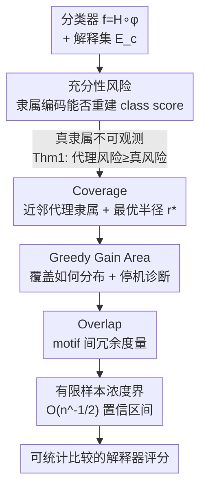

# Certified Evaluation of Model-Level Explanations for Graph Neural Networks

**会议**: ICLR2026  
**OpenReview**: [https://openreview.net/forum?id=h6VtqCN9m3](https://openreview.net/forum?id=h6VtqCN9m3)  
**代码**: 待确认  
**领域**: 可解释性 / 图神经网络  
**关键词**: 模型级解释, GNN 可解释性, 充分性风险, 认证评估, 覆盖率

## 一句话总结
这篇论文把"GNN 的模型级解释到底够不够好"这个一直只能靠 class score 和肉眼比对的问题，形式化成一个叫**充分性风险（sufficiency risk）**的回归损失，并推导出分布无关的认证上界，进而给出 Coverage、GGA、Overlap 三个可计算指标（外加有限样本置信区间），让不同解释器之间第一次能做有统计保证的比较。

## 研究背景与动机

**领域现状**：GNN 的事后可解释性分实例级（解释单张图为什么被这么分类）和模型级（给定一个类别，找出分类器普遍依赖的判别性 motif）两条路。模型级解释更接近"全局理解模型学到了什么"，代表方法有生成式的 XGNN、GNNInterpreter、D4Explainer，以及发现式的 PAGE、GLGExplainer。无论哪种，它们共同的优化目标都是：生成能让分类器给出**高目标类得分（class score）**的 motif。

**现有痛点**：因为分类器真正依赖的"真 motif"是不可观测的，大家就默认 class score 高 = 解释好，于是 class score 几乎成了唯一的横向比较指标。但 class score 单独用根本不够：解释器显式优化了"高 class score"这个损失项，结果 motif 经常变成**病态（pathological）**的——得分很高，却远离数据分布、压根不像真实图结构。退而求其次的定性肉眼比对又极易 cherry-picking；而稀疏度、生成时间这类辅助指标完全不碰"motif 和分类器决策之间的关系"。

**核心矛盾**：实例级解释那套成熟指标（fidelity、accuracy）在模型级场景里**用不了**——fidelity 要把解释子图从原图里抠掉/扰动，可生成式 motif 根本不是任何一张类内图的精确子图；accuracy 要 ground-truth 解释子图，可模型级下"真 motif"本就未知。于是模型级解释评估存在一个**根本性的空白**：没有任何有原则、可计算的指标。

**本文目标**：① 形式化"一组解释到底有没有充分捕捉分类器的推理"；② 给出可计算、且对数据分布无假设的认证指标；③ 让指标在有限样本下也可靠，能支撑解释器之间的统计比较。

**切入角度**：作者不去猜真 motif，而是退一步问——如果解释集 $E_c$ 真的捕捉了分类器对类别 $c$ 的推理，那么"每张类内图用到了哪些 motif"的隶属编码（membership code）就应当包含足够信息去**重建分类器的输出得分**。把"能不能重建得分"量化成一个回归损失，就得到了可度量的充分性。

**核心 idea**：用"隶属编码能否重建 class score"定义**充分性风险**，再用嵌入空间里基于半径的近邻代理隶属（proxy membership）给这个风险一个**分布无关的可计算上界**，把抽象的"解释够不够"落成 Coverage / GGA / Overlap 三个带认证和置信区间的数字。

## 方法详解

### 整体框架
全篇的逻辑是一条"从不可观测量一路降到可计算数字"的链：先把"解释充分性"定义为充分性风险 $\mathrm{SR}_c(M,E_c)$，但它依赖不可观测的真隶属 $M^\star$；于是构造一个只用嵌入信息的代理隶属 $M_r$，并用 Theorem 1 证明"代理风险永远 $\ge$ 真风险"——这样**给代理风险设上界就等于给真风险设上界**；接着 Coverage 给出这个上界、并找到使界最紧的最优半径 $r^\star$；GGA 刻画覆盖在各 motif 上的分布是否高效、并给停机诊断；Overlap 量化 motif 之间的冗余；最后用浓度不等式把三者从总体量变成有限样本下带置信区间的可比量。

形式化设定：分类器 $f=H\circ\phi$，$\phi:\mathcal G\to\mathbb R^d$ 是嵌入函数，$H$ 是分类头。给定类别 $c$，解释器输出 motif 集合 $E_c=\{M_1,\dots,M_K\}$，每个 motif 的嵌入 $m_k:=\phi(M_k)$。"motif"在这里是广义的——抽取子图、原型实例、生成图、规则实例都行，只要能被 $\phi$ 嵌入，框架就通用。

### 关键设计

**1. 充分性风险：把"解释够不够"变成可度量的回归损失**

痛点是模型级解释一直没有"够不够"的客观定义，只能看 class score 高低。作者的做法是：设 $\hat G_c$ 为被分类器判为类 $c$ 的图集合，假设存在一个真隶属函数 $M^\star(G,E_c)$ 描述分类器内部把 $G$ 关联到哪些 motif（最简单情形是 $\{0,1\}^K$ 的二值向量，更一般可以是软/概率关联）。如果 $E_c$ 真的捕捉了分类器的推理，那么隶属编码 $\{M^\star(G):G\in\hat G_c\}$ 应该足以重建得分 $\{f_c(G)\}$。据此把充分性风险定义为

$$\mathrm{SR}_c(M,E_c) := \mathbb E\!\left[\big(f_c(G)-\mathbb E[f_c(G)\mid M(G)]\big)^2 \;\middle|\; G\in\hat G_c\right],$$

即"用隶属表示替换 $G$ 后预测得分的均方误差"。$\mathrm{SR}_c(M^\star,E_c)=0$ 表示 motif 完美捕捉了分类器的推理。它的妙处在于：不需要知道真 motif 长什么样，只要问"解释能不能解释得分"。

但 $M^\star$ 不可观测，直接估计 $\mathbb E[f_c(G)\mid M(G)]$ 又是高维回归、统计上不稳定且没有保证。**Theorem 1** 解决了这层障碍：对任意满足 $M(G)=h(M^\star,\varepsilon)$ 且 $\varepsilon\perp Y\mid M^\star$ 的代理隶属 $M$，有 $\mathrm{SR}_c(M^\star,E_c)\le \mathrm{SR}_c(M,E_c)$。也就是说真风险**永远被任何代理风险从上方夹住**——这给"用一个能算的代理去 bound 不能算的真量"提供了合法性，是后面所有指标的地基。

**2. Coverage：用最优半径 $r^\star$ 给充分性风险一个分布无关的认证上界**

有了 Theorem 1，关键是造一个既可计算、又满足其条件的代理隶属。作者用嵌入空间的近邻关系：对图 $G$ 定义最近 motif 距离 $D(G):=\min_k\|\phi(G)-m_k\|_2$，代理隶属为

$$M_r(G)=\begin{cases}\arg\min_k\|\phi(G)-m_k\|_2,& D(G)\le r,\\ \bot,& \text{否则,}\end{cases}$$

即半径 $r$ 内把图挂到最近 motif，否则记为"未覆盖 $\bot$"。由此定义 **Coverage** 为类内实例被某个 motif 覆盖的条件概率 $\mathrm{Cov}_c(r):=\Pr(D(G)\le r\mid G\in\hat G_c)$。**Theorem 2** 给出认证上界：若分类头 $H$ 是 $L$-Lipschitz，则

$$\mathrm{SR}_c(M_r,E_c)\le L^2\,\mathbb E\!\big[D(G)^2\mathbf 1\{D(G)\le r\}\big]+\tfrac14\big(1-\mathrm{Cov}_c(r)\big),$$

更粗的形式是 $L^2 r^2\,\mathrm{Cov}_c(r)+\tfrac14(1-\mathrm{Cov}_c(r))$。直觉很清楚：覆盖率越高、覆盖半径越小，充分性风险上界越低。更漂亮的是 **Theorem 3**：这个界在 $r^\star=1/(2L)$ 处最紧，且这个最优半径**与 $D(G)$ 的分布无关**——所以在 $r^\star$ 处评估就拿到最紧的认证保证。因为分类头通常是线性层或浅 MLP，$L$ 可由谱范数高效估计，Lipschitz 条件很温和。

**3. GGA：用贪心覆盖曲线刻画覆盖怎么分布，外加停机诊断**

Coverage 只告诉你"覆盖了多少"，却不告诉你"这点覆盖是靠一个 motif 撑起来还是均匀分摊"。一个解释器可能几乎全靠单个 motif 达到高覆盖、其余冗余。为此作者引入 **Greedy Gain Area (GGA)**：设 $S_k(r^\star)$ 为被 motif $M_k$ 覆盖的类内图集合，按贪心逐步选"边际覆盖增益最大"的 motif，记前 $j$ 步累计覆盖比例 $\alpha_j$，则

$$\mathrm{GGA}(E_c,r^\star):=\frac1K\sum_{j=1}^K\alpha_j,$$

即贪心覆盖曲线下的归一化面积。它衡量 motif 贡献覆盖的效率：少数 motif 就撑起大部分覆盖时 GGA 高，需要很多 motif 才够时 GGA 低。结合 Coverage 一起读能区分四种情况——高覆盖+高 GGA = 简约解释；高覆盖+低 GGA = 多 motif 各有贡献的多样性；**低覆盖+高 GGA = 模式崩塌（mode collapse）**，单个 motif 主导；低覆盖+低 GGA = 既不充分也不多样的差解释。

GGA 还自带 **Theorem 4** 的停机诊断：设边际增益 $\Delta_j=\alpha_j-\alpha_{j-1}$，若曲线在 $t$ 个 motif 后停滞（$\Delta_j\le\epsilon,\forall j>t$），则只用前 $t$ 个 motif 相比用全集，充分性风险只多 $\tfrac14(\alpha^\star-\alpha_t)\le\tfrac14(K-t)\epsilon$。换句话说：一旦贪心曲线变平，继续生成 motif 对降低认证风险的收益微乎其微——这给"何时可以安全停止生成解释"一个有保证的判据。

**4. Overlap 与有限样本浓度界：冗余度量 + 让数字可统计比较**

即便覆盖率高，不同 motif 也可能在覆盖**同一批图**，这种冗余会虚高解释能力却没扩大解释范围。**Overlap** 把它显式化：

$$\mathrm{Overlap}=\frac{\sum_{k=1}^K|S_k(r^\star)|-|U(r^\star)|}{\max\{1,|U(r^\star)|\}},\quad U(r^\star)=\bigcup_{k=1}^K S_k(r^\star),$$

分子是跨 motif 的重复覆盖量，分母按有效域大小归一化，取值 $[0,K-1]$，0 表示无冗余、$K-1$ 表示完全冗余。至此 Coverage 认证充分性、GGA 刻画覆盖如何累积、Overlap 量化冗余，三者构成对模型级解释的完整画像。

但上述都是总体量，实际只观测到有限样本 $\hat G_c=\{G_1,\dots,G_n\}$。作者据此推导**有限样本浓度界**给出置信区间：对 Coverage（**Proposition 1**），$|\widehat{\mathrm{Cov}}_c(r)-\mathrm{Cov}_c(r)|\le\sqrt{\tfrac{1}{2n}\log\tfrac2\delta}$（以概率 $\ge1-\delta$）；对 GGA（**Proposition 2**），$|\widehat{\mathrm{GGA}}-\mathrm{GGA}|\le\sqrt{\tfrac{1}{2n}\log\tfrac{2K}{\delta}}$。区间宽度以 $O(n^{-1/2})$ 收缩，**两个解释器的置信区间不重叠就意味着总体层面性能可区分**——这正是"统计可靠比较"的关键：清晰的性能差距在小样本下也显著，样本越多区分越细。

### 损失函数 / 训练策略
本文不训练任何模型、不引入新损失。它是一套**评估框架**：对一个已训练好（嵌入函数 + 线性头）的分类器和任意解释器产出的 motif 集合，计算 Coverage / GGA / Overlap 及其置信区间。$L$ 由分类头谱范数估计，$r^\star=1/(2L)$，实践中用 Appendix A 的尺度无关角度形式在归一化嵌入上计算 Coverage。

## 实验关键数据

实验目的不是刷 SOTA，而是验证三个指标能揭示 class score 看不到的差异。所有实验里分类器都是"嵌入函数 + 线性头"，便于精确算 Lipschitz 常数与 $r^\star$；Coverage 与 GGA 都带 $p=0.05$ 的 Hoeffding 置信区间。

### 主实验（真实数据集，三种标准解释器）
在 MUTAG / IMDB-Multi / REDDIT-Binary / OGB-MOLHIV 上，对 XGNN、GNNInterpreter、PAGE 各生成 10 个 motif：

| 解释器 | 数据集 / 类别 | Coverage | GGA | Overlap | Class Score |
|--------|---------------|----------|-----|---------|-------------|
| XGNN | MUTAG / Mutagenic | 0.773±0.117 | 0.710±0.150 | 7.314 | 0.966±0.005 |
| XGNN | MUTAG / Non-mutagenic | 0.885±0.185 | 0.829±0.235 | 8.400 | 1.000±0.000 |
| XGNN | REDDIT / IMDB | 0（平凡结构，单点/直线） | 0 | 0 | 低 |

关键现象：在 MUTAG 上 XGNN（强制化合价约束）和 PAGE（发现连通 motif）的 Coverage 高于 GNNInterpreter——后者缺少领域约束，生成断连、化学非法的图，class score 高但 Coverage 低，**指标准确暴露了 class score 掩盖的病态解释**。在 REDDIT 和 IMDB 上 XGNN 彻底失败（生成单点/直线，四项指标全 0），而它在 OGB-MOLHIV 上根本跑不了（只支持离散节点特征）。REDDIT-Binary 上 GNNInterpreter 在 Coverage 和 class score 上都超过 PAGE（PAGE 的子图搜索在大图上失效）；IMDB-Multi 上两者 Coverage、GGA、Overlap 都高，说明少数 motif 就够解释类别身份，但 PAGE 的 class score 明显更高。

### 合成数据集消融（指标 vs class score）

| 数据集 / 设置 | 现象 | 说明 |
|---------------|------|------|
| 4Shapes / good vs bad 解释集 | 除 Class 2 外，good 集同时拿到更高 class score 和更高 Coverage | 验证 Coverage 与 class score 多数时一致 |
| 4Shapes / Class 2 | 随机 BA 图 class score 更高但 Coverage 极低 | 暴露"负证据"决策规则：分类器把"看不到其它三类 motif"判为 Class 2 |
| MixedShapes / unimodal vs bimodal | 两者 mean class score 相近，但 bimodal 的 Coverage 高得多、unimodal 的 Overlap 高 | Coverage 抓充分性、Overlap 抓冗余，GGA 曲线显示 unimodal 很快饱和 |

### 关键发现
- **Class score 会被"负证据"决策骗到**：4Shapes 的 Class 2，单看 class score 像是分类器把 BA 图本身当类代表，但低 Coverage 揭示这些高分图其实是 off-manifold，真正的决策规则是"缺少其它三类 motif"（向分类器输入 Erdős–Rényi 随机图同样被高置信判为 Class 2，证实了这一点）。
- **病态解释无所遁形**：GNNInterpreter 在 MUTAG 上高 class score、低 Coverage，正对应"高分但漂离数据分布"的病态 motif。
- **冗余/模式崩塌可诊断**：MixedShapes 上 unimodal 集 class score 与 bimodal 相当却 Overlap 高、GGA 曲线早早饱和，正是模式崩塌的信号。

## 亮点与洞察
- **把不可观测量合法地 bound 住**：Theorem 1 证明"代理隶属风险 $\ge$ 真隶属风险"，使得用一个能算的代理去上界一个不能算的真量在数学上站得住——这是整套框架的支点，思路可迁移到其它"ground-truth 不可观测"的评估问题。
- **最优半径与分布无关**：$r^\star=1/(2L)$ 只取决于分类头的 Lipschitz 常数，不依赖距离分布，意味着评估时没有需要手调、容易被 cherry-pick 的超参，这对"公平比较解释器"特别重要。
- **GGA 一条曲线读出多种病**：通过 Coverage×GGA 的四象限，能同时区分简约、多样、模式崩塌、纯差解释，且停机诊断（Theorem 4）给了"何时停止生成 motif"的量化判据。
- **从总体量到置信区间**：浓度界把三个指标变成带 $O(n^{-1/2})$ 收缩区间的可比量，"区间不重叠 = 统计可区分"，第一次让模型级解释器之间能做有保证的横向比较。

## 局限与展望
- **依赖分类器可分解为 $H\circ\phi$ 且 $H$ Lipschitz**：实验里分类头都是线性层，更复杂的非线性头估 $L$ 会更松，$r^\star$ 的最优性论述也以此因子分解为前提。
- **代理隶属是嵌入空间的近邻挂靠**：Coverage 把"被解释"等同于"嵌入落在某 motif 半径内"，这对嵌入几何质量有隐含依赖；若 $\phi$ 本身把不同类混叠，指标可信度会打折（作者也指出 motif 必须能被同一个 $\phi$ 嵌入才适用）。
- **只评估解释、不改进解释**：框架定位是诊断工具，设计上用来补充 class score 而非替代生成过程；如何把这些认证指标反馈进解释器训练（如直接优化 Coverage/降低 Overlap）是自然的下一步。
- **大图上的间接受限**：虽然指标本身通用，但实验显示 PAGE 等子图搜索方法在 REDDIT 这类大图上失效，评估结果会受被评解释器自身可扩展性影响。

## 相关工作与启发
- **vs 仅用 class score**：以往模型级解释几乎只比 class score，本文证明它会被病态 motif 和"负证据"决策误导；三个指标不是替代而是**补充**，专门暴露 class score 看不到的充分性、效率、冗余。
- **vs 实例级评估指标（fidelity / accuracy）**：fidelity 要抠子图、accuracy 要 ground-truth motif，二者在模型级（尤其生成式解释）下都不适用；本文绕开"需要真 motif"这一前提，改用"隶属编码能否重建得分"来定义充分性。
- **vs 实例级理论分析（Agarwal 2022、Zheng 2024 等）**：已有不少关于 fidelity/鲁棒性的上界与表征分析，但全部局限在实例级；本文是据作者所知**首个**带理论认证的模型级解释评估框架。
- **vs 发现式 vs 生成式解释器（PAGE/GLGExplainer vs XGNN/GNNInterpreter）**：前者用现成子图避免不真实 motif、后者优化高得分易病态；本文不站队，而是提供一把统一的尺子，实验里也确实把两类方法的强弱（XGNN 的化合价约束、PAGE 的连通性、GNNInterpreter 的断连非法图）量化了出来。

## 评分
- 新颖性: ⭐⭐⭐⭐⭐ 首个为模型级 GNN 解释提供理论认证的评估框架，把"解释够不够"形式化为可 bound 的充分性风险。
- 实验充分度: ⭐⭐⭐⭐ 合成数据精准验证指标性质、四个真实数据集横扫三种解释器，但都是"嵌入+线性头"分类器，复杂分类头下的表现待验证。
- 写作质量: ⭐⭐⭐⭐⭐ 从动机到定理层层递进，每个指标都有清晰直觉 + 形式化保证 + 实验印证。
- 价值: ⭐⭐⭐⭐⭐ 给一直缺标尺的模型级解释评估提供了可计算、带置信区间、可统计比较的工具，实用性强。

<!-- RELATED:START -->

## 相关论文

- [\[ICLR 2026\] Bayesian Neural Networks for Functional ANOVA Model](bayesian_neural_networks_for_functional_anova_model.md)
- [\[ICLR 2026\] Addressing Divergent Representations from Causal Interventions on Neural Networks](addressing_divergent_representations_causal.md)
- [\[ICLR 2026\] Explainable K-means Neural Networks for Multi-view Clustering](explainable_k_-means_neural_networks_for_multi-view_clustering.md)
- [\[ICLR 2026\] FAME: Formal Abstract Minimal Explanation for Neural Networks](fame_formal_abstract_minimal_explanation_for_neural_networks.md)
- [\[ICLR 2026\] Discovering Alternative Solutions Beyond the Simplicity Bias in Recurrent Neural Networks](discovering_alternative_solutions_beyond_the_simplicity_bias_in_recurrent_neural.md)

<!-- RELATED:END -->
