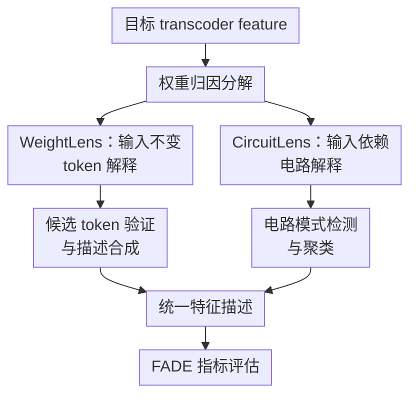

# Circuit Insights: Towards Interpretability Beyond Activations

**会议**: ICLR2026  
**OpenReview**: [https://openreview.net/forum?id=2Jyb1yu3nN](https://openreview.net/forum?id=2Jyb1yu3nN)  
**代码**: https://github.com/egolimblevskaia/WeightLens; https://github.com/egolimblevskaia/CircuitLens  
**领域**: 可解释性 / 机制解释 / Circuit Interpretability  
**关键词**: 电路解释、Transcoder、自动化可解释性、特征归因、稀疏特征  

## 一句话总结
这篇论文提出 WeightLens 和 CircuitLens，把自动化可解释性从“看哪些样本激活了特征”推进到“看权重连接和电路归因如何产生特征”，在转码器特征上更稳健地解释 token 型、上下文依赖型和多义特征。

## 研究背景与动机
**领域现状**：机制可解释性里很重要的一条路线，是把神经网络内部计算拆成可读的电路：哪些特征、注意力头、上游 token 共同导致某个下游行为。早期 circuit discovery 能给出很细的解释，但往往依赖人工分析，常见案例也集中在 IOI 这类玩具任务。自动化可解释性则试图把这个过程规模化：收集某个 neuron 或 sparse feature 的高激活样本，再让一个更大的 LLM 写出自然语言描述。

**现有痛点**：只看 activation 的自动解释有两个根本问题。第一，激活样本告诉我们“这个特征在这些文本上亮了”，却不一定告诉我们“是哪几个输入 token、哪个 attention head、哪个上游 feature 让它亮了”。第二，解释质量强依赖数据集和 explainer LLM：样本不够大、prompt 不合适、特征本身有多义性时，LLM 很容易写出“各种主题上的各种词”这类泛泛描述。

**核心矛盾**：稀疏特征本来是为了缓解 MLP neuron 的 polysemanticity，但即便 SAE 或 transcoder feature 更单义，它们仍可能只在很窄的上下文模式中激活。也就是说，特征空间更干净并不自动等于解释更可靠；如果解释流程仍只看 activation，它会漏掉特征之间、注意力头之间和输出 token 之间的结构性关系。

**本文目标**：作者想解决两个互补子问题。对于上下文无关、接近 token-level 的特征，能不能不用大数据集、不用 explainer LLM，直接从模型和 transcoder 权重里读出它代表什么？对于上下文依赖特征，能不能把激活背后的电路模式显式提取出来，让 LLM 不再从完整文本里盲猜触发原因？

**切入角度**：本文选择 transcoder 作为切入点。transcoder 不只是重构 activation，而是用稀疏特征近似整个 MLP 层，因此天然把某个下游特征的归因拆成输入依赖项和输入不变项。这个分解让作者可以分别研究“权重里稳定存在的连接”和“某个输入上实际发生的电路”。

**核心 idea**：用 WeightLens 从 transcoder 权重中寻找稳定 token 语义，用 CircuitLens 从注意力头、上游特征和输出 logit 的归因中提取上下文电路，再把两者合起来降低对激活样本和解释模型的依赖。

## 方法详解
### 整体框架
本文的整体流程围绕 transcoder feature 展开：先利用 transcoder 的 encoder/decoder 权重写出跨层特征归因，再按特征类型分两条解释路径。WeightLens 处理更接近输入不变的 token-based feature，它从 embedding、unembedding 和上游 feature 连接中找候选 token，再用一次 forward pass 验证这些 token 是否真的能激活目标特征。CircuitLens 处理上下文依赖 feature，它在真实样本上计算 attention-head/token、上游 feature 和输出 token 的电路归因，把完整上下文压缩成“触发模式 + 输出影响 + circuit cluster”，再交给 explainer LLM 写描述。

最底层的数学对象是 transcoder 的跨层 attribution。对于上游层 $l'$ 的 feature $i'$ 对下游层 $l$ 的 feature $i$，最简单的归因可以写成“上游激活 × 固定连接强度”：$a_{l',i'}[t](f^{l',i'}_{dec} \cdot f^{l,i}_{enc})$。论文也采用带 Jacobian 的版本，把 attention、normalization 和非线性在给定输入上视作常数，从而更可靠地估计 feature-to-feature、attention-to-feature 和 feature-to-logit 的贡献。

### 关键设计
**1. WeightLens：用权重异常值找上下文无关的 token 语义**

WeightLens 针对的是这样一类特征：它们并不是只有在复杂上下文中才有意义，而是对某些 token 或词形有稳定响应。作者的假设很直接：如果某条输入不变连接的幅度显著大于其他连接，它更可能是有意义的结构关系；如果某个 token 真能代表该 feature 的内在行为，那么即便把 token 单独送进模型，这个 feature 也应该激活。

具体做法分三步。第一，把目标 feature 的 encoder 向量投影到 embedding 空间，即看 $W_{emb} \cdot f_{enc}$ 中哪些词表 token 是 z-score outlier；同时把 decoder 向量投影到 unembedding/logit 空间，即看 $f_{dec} \cdot W_U$ 中哪些输出 token 被该 feature 强烈推动或抑制。第二，对所有更早层计算 $W^{l'}_{dec} \cdot f^l_{enc}$，找出对当前 feature 连接最强的上游 feature，并继承这些上游 feature 的候选 token。第三，用 forward pass 过滤：只有真正让目标 feature 激活的 token 才进入最终描述；输出侧 token 因为不能同样验证，只作为可选补充。

这个设计的价值在于，它把“解释一个 feature”从大规模采样问题变成了一个权重检索和轻量验证问题。它不需要 explainer LLM，也不需要为每个 feature 在巨大语料上找 top activations；对早期层、token 型 feature、key-value 式 collocation feature 尤其有效。但它也很诚实地承认：中间层常有强上下文依赖，纯权重连接会混入噪声，因此必须用验证步骤防止把随机强连接当语义。

**2. CircuitLens：用电路归因替代完整激活上下文的盲猜**

CircuitLens 面向 WeightLens 处理不好的情况：目标 feature 的激活不是某个 token 单独触发，而是由上下文里若干 token、attention head 和上游 feature 共同触发。传统 MaxAct 式方法会把完整文本和激活 token 高亮给 LLM，让 LLM 自己从上下文里找规律；本文认为这把最难的部分交给了黑盒解释器。CircuitLens 先由模型内部归因把相关模式挑出来，再让 LLM 做更窄的概念概括。

输入侧分析使用 attention-head attribution：对目标 feature 在 token $t$ 上的激活，计算前文 token $s$ 通过某个 attention head $h$ 贡献了多少。论文的形式类似 $score^{l',h}(t,s)((W^{l',h}_{OV})^\top f^{l,i}_{enc} \cdot r^{l'}_{pre}[s])$，即同时考虑 attention 从 $t$ 指向 $s$ 的强度，以及该 head 输出方向和目标 feature encoder 的对齐程度。输出侧分析则计算目标 feature 激活后对生成 token logit 的贡献，形式上是 $a_{l,i}[t](f^{l,i}_{dec} \cdot J \cdot W_U[:,y[t]])$。这样得到的不是“整段文本中哪些位置激活高”，而是“哪些输入 token 真正推动了激活、哪些输出 token 被这个 feature 推动”。

这个设计能显著减轻 explainer LLM 的负担。LLM 不再需要在一长段样本文本里判断触发原因，而只看到被归因筛出的短片段、最强激活 token 和可选输出影响。论文中的例子显示，有些 feature 激活在 “on” 或动词上，但真实功能更像是在输出侧促进 “the basis of / based on” 这类短语；如果只看输入激活，很难看出它的功能角色。

**3. Circuit-based clustering：按产生激活的电路而不是语义 embedding 切分多义特征**

即使稀疏 feature 也可能 polysemantic：同一个 feature 可能在多个局部机制中复用。直接把 top activation 样本交给 LLM，往往会只描述出现最多的模式；用句向量语义聚类也不够，因为两个样本表面语义相近，不代表它们由同一组上游 feature 和 attention head 触发。

CircuitLens 的聚类单元是“电路贡献集合”。对每个样本，作者收集显著的 transcoder feature 贡献和 attention head/token-position 贡献，把相对位置 $\Delta$ 也编码进去；然后过滤掉只在极少样本中出现的贡献项，用 Jaccard 相似度 $J(A,B)=|S_A \cap S_B|/|S_A \cup S_B|$ 构造样本间相似矩阵，最后用密度聚类抽出 cluster。每个 cluster 独立生成一句描述，再合成为目标 feature 的统一描述。

这个设计解决的是“一个 feature 的多个用法怎么不互相污染”的问题。论文案例中，L12F619 的原始 activation 看不出一般规律，但按 attention attribution 抽出 contributing tokens 后，会发现激活实体通常被前文显式提及，或被 “the / this / former / latter” 这类指代词标记。另一个 L21F612 的例子则显示，cluster 可以把医学身体部位、破折号表达、缩写/符号上下文等不同 circuit 模式分开，让最终描述不被某个高频模式完全支配。

**4. 分布式采样与 FADE 评估：让描述覆盖尾部激活而不是只看最大值**

很多自动解释方法只采 top activations，但这会放大最强、最常见的激活模式，漏掉弱一些但稳定存在的子概念。本文为 CircuitLens 缓存整个数据集上的最大样本激活，并用 inverse-frequency quantile sampling 覆盖激活分布：把 activation 分成 $B=20$ 个分位 bin，bin 内样本权重设为 $w_i=1/n_b^\alpha$，其中 $\alpha=0.9$，再无放回采样 $N=100$ 个 activation。这样尾部强激活会被上采样，但整体分布也不会完全丢掉。

评估上，论文使用 FADE 框架的四个指标：Clarity 看描述是否清楚到能生成会激活该 feature 的合成输入，Responsiveness 看 feature 是否更响应描述相关样本，Purity 看 feature 是否主要只在描述相关输入上激活，Faithfulness 看干预该 feature 是否按描述方向改变输出。这个评估选择很重要，因为本文的目标不是只让描述“好听”，而是让描述在输入匹配、输出影响和 feature 行为上都能被量化检验。

### 一个完整示例
可以把 WeightLens 和 CircuitLens 看成处理同一个 feature 的两种诊断路径。假设目标是 Gemma-2-2B 某层一个 feature，它在很多样本里都和单词 “all” 有关。WeightLens 会先看目标 feature 的 embedding 投影是否直接指向 “all / All / ALL”，再看更早层是否有强连接的上游 feature 也解释为 “all”。如果候选 token 单独输入模型后能激活该 feature，就把这些 token 合成为“与 all 相关的 token 型特征”。

但如果另一个 feature 在不同文本中激活在 “the”“this”“former”“latter” 或某个实体名附近，单 token 验证可能失败，因为它的意义来自指代关系而不是词本身。CircuitLens 会在 100 个采样上下文中找出真正贡献的 attention-head/token 对：例如当前激活 token 指向前文已经出现的实体，或指向表示确定指代的功能词。随后聚类会把“显式实体复现”“definite reference”“former/latter 指代”放在相近电路模式里，LLM 只需概括这些被筛出来的短片段，而不是从完整上下文里猜模式。

### 损失函数 / 训练策略
本文不是训练新语言模型，也没有提出新的 supervised loss；核心工作是解释 transcoder feature 的后处理与评估流程。WeightLens 的关键超参包括 embedding/logit 投影的 outlier 阈值：GPT-2 使用 z-score 阈值 4，Gemma-2-2B 和 Llama-3.2-1B 使用 4.5；上游 feature connection 的 outlier 阈值为 3。CircuitLens 中，activation 采样使用 $B=20$ 个 quantile bins、$\alpha=0.9$、每个 feature 采 $N=100$ 个 activation；聚类前会用频率阈值 $\rho$ 过滤只偶然出现的贡献项，再基于 Jaccard 相似度进行密度聚类。论文附录提到聚类超参会影响粗细粒度，过细时可能把单义 feature 切成多个子电路，过粗时又会合并不同模式。

## 实验关键数据

### 主实验
论文在 GPT-2 Small、Gemma-2-2B 和 Llama-3.2-1B 的 transcoder feature 上做评估，主要定量表格以 Gemma-2-2B 多层结果为核心。对 WeightLens，作者每层约评估 250 个 feature，并和 Neuronpedia、MaxAct* 两类 activation-based baseline 比较。整体结论是：WeightLens 在 Clarity 和 Responsiveness 上通常高于或不低于 baseline，Purity 则常低于 activation-based 方法，说明它更擅长找到 token 触发语义，但上下文依赖的 feature 仍需要 CircuitLens。

| 方法 | 典型优势指标 | 代表层结果 | 相比 activation baseline 的结论 |
|------|--------------|------------|----------------------------------|
| WeightLens | Clarity / Responsiveness | Layer 18: Clarity 0.80, Responsiveness 0.85 | Clarity 明显高于 Neuronpedia 0.58 和 MaxAct* 0.62 |
| WeightLens+Out | Responsiveness | Layer 21: Responsiveness 0.87 | 输出 token 补充有时提升响应性，但也会引入噪声 |
| WeightLens+Out+LLM | Clarity / Purity 平衡 | Layer 21: Clarity 0.68, Purity 0.63 | LLM 可润色并过滤噪声，但不是必需组件 |
| Neuronpedia | Purity | Layer 21: Purity 0.73 | activation 描述更贴近已采样输入分布，但容易泛化不足或漏上下文机制 |
| MaxAct* | Purity | Layer 21: Purity 0.74 | top activation 方法在纯度上强，但对少数模式和数据分布敏感 |

CircuitLens 的实验比较 CL-Input、CL-Full、WL+CL-Full，以及使用大数据集 top sampling 的变体。小数据集只有 24M tokens，大数据集 baseline 使用 2.3B tokens。结果显示 CircuitLens 仍受数据规模影响，但在小数据集上已经能减少极低 Clarity 描述；加入 WeightLens 后，小数据集结果更接近大数据集结果，说明权重信息能弥补采样不足。

| 方法 | 数据设置 | Layer 15 Clarity | Layer 23 Clarity | Layer 15 Responsiveness | 主要结论 |
|------|----------|------------------|------------------|-------------------------|----------|
| CL-Input | 24M tokens | 0.56 | 0.41 | 0.77 | 只看输入电路已能给出竞争性描述 |
| CL-Full | 24M tokens | 0.56 | 0.42 | 0.76 | 加输出影响后部分层更清楚，但计算更贵 |
| WL+CL-Full | 24M tokens | 0.66 | 0.65 | 0.81 | 权重 token 信息能增强 circuit 描述稳定性 |
| CL-Input (top) | 2.3B tokens | 0.80 | 0.63 | 0.91 | 大数据集上 circuit 描述最强 |
| CL-Full (top) | 2.3B tokens | 0.79 | 0.68 | 0.92 | 输入+输出完整信息通常最好 |
| MaxAct* | 2.3B tokens | 0.49 | 0.54 | 0.78 | 传统 activation baseline 仍会产生低 clarity 描述 |

### 消融实验
论文的消融不是单一模块 ablation，而是通过多个方法变体、数据规模和输入/输出视角比较每个信息源的作用。WeightLens 的三个变体显示：输出侧 token 可以补充 feature 的下游功能，但没有验证机制，容易带噪；LLM 后处理能让描述更自然，但在总体指标上并非决定因素。CircuitLens 的变体显示：输出侧分析能解释 feature 的功能角色，但成本明显增加；WeightLens 信息能降低小数据集上的不稳定性。

| 配置 | 关键指标 / 数字 | 说明 |
|------|----------------|------|
| WeightLens only | Gemma validated feature 32.7%；GPT-2 58.8%；Llama 25.4% | 说明纯权重解释只覆盖一部分 token-based feature，且强依赖模型层与架构 |
| WeightLens vs WeightLens+Out | 多层 Responsiveness 相近，Out 变体常略高 | 输出 token 有助于描述 feature 推动什么，但不可验证，可能降低 Clarity |
| WeightLens+Out+LLM | 与非 LLM 版本总体接近 | LLM 可做后处理，但本文证明不依赖 LLM 也能得到可用解释 |
| CL-Input vs CL-Full | Layer 21 Clarity 从 0.41 到 0.52 | 输出侧归因能补充后层 feature 的功能角色 |
| WL+CL-Full vs CL-Full | Layer 23 Clarity 从 0.42 到 0.65 | 权重信息能弥补小数据集 circuit 描述中的覆盖不足 |
| 24M tokens vs 2.3B tokens | CL-Full Layer 15 Clarity 从 0.56 到 0.79 | CircuitLens 仍受数据分布影响，大数据集给出更强结果 |

### 关键发现
- WeightLens 对早期层和后期部分 token/collocation feature 更有效，中间层最困难。Gemma-2-2B 的 layer 12 是权重解释最差的层之一，尽管特征稀疏度高，却极度上下文依赖。
- 只看 Faithfulness 会低估这些方法的价值。所有方法的 Faithfulness 都较低，作者认为原因是 transcoder feature 写入 residual stream 的方式不同于 residual SAE，单个 feature steering 很少产生大输出变化；未来可能需要评估 feature group 或整个 circuit 的干预。
- CircuitLens 的 output-centric 分析揭示，后层 feature 常主要影响激活 token 后的第一个生成 token，但也会出现多 token 短语影响；早期层直接影响输出的比例很低。
- Circuit-based clustering 对 polysemantic feature 特别有帮助。Layer 7 平均每个 feature 有约 4.5 个 cluster，Layer 12 约 2.8 个，Layer 21 约 2.95 个；这说明不同层的 circuit 复杂度和多义性差别很大。
- 计算成本可控但不免费。24M-token activation caching 约 5 个 A100 GPU-hours；1000 个 feature 的 input-based 分析约 8 个 GPU-hours；额外分析 5 个和 15 个输出 token 分别约增加 4 和 12 个 GPU-hours。

## 亮点与洞察
- 这篇论文最有价值的地方，是把自动可解释性里的证据来源从 activation samples 扩展到 weights 和 circuits。activation 仍然重要，但它不再是唯一入口；解释可以先由结构归因收窄搜索空间，再由 LLM 做语言概括。
- WeightLens 的“先看权重异常值，再用单 token forward 验证”非常务实。它没有声称所有 feature 都能被权重解释，而是明确把 token-based feature 和 context-dependent feature 分开处理，这比把所有解释都塞给一个 LLM 更稳。
- CircuitLens 把输入侧和输出侧放在同一个解释框架里，这点很关键。很多 feature 的真正功能不只是“它被什么触发”，而是“它触发后让模型更可能说什么”；后者只有通过 logit attribution 或输出侧分析才能看见。
- 按 circuit 而不是语义 embedding 聚类，是一个可以迁移的思想。未来做 SAE feature、crosscoder feature、甚至普通 neuron 解释时，也可以把样本表示成“贡献组件集合”，再聚类解释，而不是只依赖文本语义相似度。
- 论文对负面结果写得比较诚实：Faithfulness 普遍低、WeightLens 覆盖有限、CircuitLens 仍要数据和 LLM。这些 caveat 反而让方法边界更清楚，也让后续工作知道应该改评估还是改方法。

## 局限与展望
- WeightLens 依赖 transcoder 的结构分解，不能直接套到 SAE 上。若要迁移到 SAE 或 crosscoder，可能需要用梯度归因或其他方式构造类似的 feature-to-feature 连接。
- WeightLens 只适合上下文无关或弱上下文依赖的 feature。中间层大量 feature 的语义来自上下文和上游电路，权重连接即使强，也可能在实际输入中不成立。
- CircuitLens 仍没有完全摆脱数据集和 explainer LLM。它减少了 LLM 的搜索负担，但 cluster-level 描述和最终合成还是需要 LLM；数据规模较小时，描述质量仍弱于大数据集 top sampling 版本。
- 输出侧分析代价较高。每多看若干生成 token，就需要额外 forward/backward pass；如果要大规模解释上百万 feature，必须更精细地选择哪些层、哪些 feature、哪些输出位置值得分析。
- 聚类超参还不稳定。较细的 eps 可能把一个单义 feature 切成多个子概念，较粗则可能合并不同 circuit；未来需要用评估指标或人工校验自动选择聚类粒度。
- Faithfulness 指标可能和 transcoder feature 的实际作用不匹配。单 feature 干预在高度冗余模型中很难产生可测输出变化，后续应考虑 circuit-level intervention 或 feature group intervention。

## 相关工作与启发
- **vs Bills et al. / Neuronpedia 自动 neuron description**: 传统路线收集 top activating samples，再让 LLM 写描述；本文把权重连接、attention attribution 和输出 logit attribution 纳入解释证据，减少了“让 LLM 在完整上下文里盲找规律”的负担。
- **vs SAE-based automated interpretability**: SAE 将 activation 分解成更单义的 sparse features，但解释流程常仍是 activation-first；本文利用 transcoder 的层间结构，把 feature attribution 本身变成解释材料。
- **vs MaxAct***: MaxAct* 通过 top activations 改进样本选择和提示格式，Purity 往往不错；CircuitLens 则采样全 activation 分布并按 circuit 聚类，更关注尾部模式和多义 feature。
- **vs output-centric feature descriptions**: Gur-Arieh 等工作强调 feature 不仅有输入触发，也有输出影响；本文继承这个视角，但把输出影响放进 transcoder/Jacobian attribution 中，使其能和输入侧 circuit 分析对齐。
- **对后续研究的启发**: 如果要解释复杂模型，不应只问“哪些文本激活了这个特征”，还要问“哪些上游组件让它激活、它又推动了哪些下游输出”。这会把解释从样本检索推进到可组合的机制图谱。

## 评分
- 新颖性: ⭐⭐⭐⭐⭐ 将 weight-based、circuit-based 和 output-centric 解释整合到 transcoder 自动解释中，问题切得很准。
- 实验充分度: ⭐⭐⭐⭐ 覆盖多个模型、多个层和多种变体，也报告计算成本；但完整数值主要集中在 Gemma-2-2B，人工验证仍有限。
- 写作质量: ⭐⭐⭐⭐ 方法动机清晰，案例有说服力；部分符号和附录细节较密，读者需要有 transcoder 与 circuit tracing 背景。
- 价值: ⭐⭐⭐⭐⭐ 对机制可解释性很有实用价值，尤其适合作为大规模 feature browser 或 circuit tracing 工具的自动描述层。

<!-- RELATED:START -->

## 相关论文

- [\[CVPR 2026\] Beyond Top Activations: Efficient and Reliable Crowdsourced Evaluation of Automated Interpretability](../../CVPR2026/interpretability/beyond_top_activations_efficient_and_reliable_crowdsourced_evaluation_of_automat.md)
- [\[ICLR 2026\] Formal Mechanistic Interpretability: Automated Circuit Discovery with Provable Guarantees](formal_mechanistic_interpretability_automated_circuit_discovery_with_provable_gu.md)
- [\[ICML 2026\] Beyond Additive Decompositions: Interpretability Through Separability](../../ICML2026/interpretability/beyond_additive_decompositions_interpretability_through_separability.md)
- [\[ICLR 2026\] When Thinking Backfires: Mechanistic Insights into Reasoning-Induced Misalignment](when_thinking_backfires_mechanistic_insights_into_reason-induced_misalignment.md)
- [\[ICLR 2026\] Task Vectors, Learned Not Extracted: Performance Gains and Mechanistic Insights](task_vectors_learned_not_extracted_performance_gains_and_mechanistic_insights.md)

<!-- RELATED:END -->
