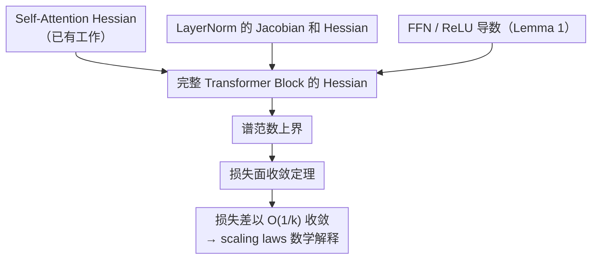

# Closing the Curvature Gap: Full Transformer Hessians and Their Implications for Scaling Laws

**会议**: ICLR 2026  
**arXiv**: [2510.16927](https://arxiv.org/abs/2510.16927)  
**代码**: [https://github.com/modernTalker/transformer_hessian](https://github.com/modernTalker/transformer_hessian)  
**领域**: 可解释性  
**关键词**: Transformer Hessian, LayerNorm, scaling laws, loss landscape, optimization theory

## 一句话总结
首次推导完整 Transformer block（含 LayerNorm 和 FFN）的显式 Hessian 表达式及谱范数上界，建立了损失面随数据量增加以 $O(1/k)$ 速率收敛的理论框架，为 scaling laws 和曲率感知训练提供了数学基础。

## 研究背景与动机

**领域现状**：Transformer 的经验成功背后有 neural scaling laws 描述的可预测改善规律。已有工作推导了 self-attention 的 Hessian 表达式，但 LayerNorm 和 FFN 的二阶分析一直缺失。

**现有痛点**：没有完整的 Transformer block Hessian 意味着：(1) 无法完整理解优化地形如何随数据量变化；(2) 无法从理论上解释曲率在不同子层间的传播；(3) 缺乏 scaling laws 的数学基础。

**核心矛盾**：LayerNorm 和 FFN 的非线性使得二阶导数推导非常复杂，此前的理论工作只能分析 self-attention，留下了"曲率空白"。

**本文目标**：推导包含 LayerNorm 和 FFN 的完整 Transformer block 的 Jacobian 和 Hessian，建立损失面收敛的理论界。

**切入角度**：使用行向量化 $\text{vec}_r(\cdot)$ 框架和 Gauss-Newton 分解，将 Hessian 系统地分解为各子层的贡献，逐层推导。

**核心 idea**：通过显式推导 LayerNorm 和 FFN 的 Hessian 来补全 Transformer 的二阶理论，并用 Taylor 展开分析损失面随数据量的收敛行为。

## 方法详解

### 整体框架

这篇论文要补全 Transformer 的二阶（曲率）理论：此前只有 Self-Attention 的 Hessian 被显式推导过，LayerNorm 和 FFN 留着一块"曲率空白"，导致无法端到端地理解优化地形随数据量怎么变。作者沿子层逐层往上搭——先把 LayerNorm 的 Jacobian/Hessian 写出来（Theorem 2-3），配上 FFN 里 ReLU 的导数（Lemma 1），再和已有的 Self-Attention Hessian 组装成完整 Transformer block 的 Hessian（Theorem 4-5）；接着对这个表达式取谱范数上界（Theorem 1, 6），把"曲率有多大"落到输入范数、权重范数、序列长度等可观测量上；最后用 Taylor 展开把曲率界翻译成"损失面随数据量 $k$ 增大以 $O(1/k)$ 速率收敛"的定理（Theorem 7），从而给 scaling laws 一个数学解释。

分析对象是 post-norm 的 Transformer block：

$$\mathbf{Y} = \text{LayerNorm}(\mathbf{X} + \mathbf{F}(\mathbf{X}))$$
$$\mathbf{Z} = \text{LayerNorm}(\mathbf{Y} + \text{FFN}(\mathbf{Y}))$$

### 关键设计

**1. LayerNorm 的 Jacobian 和 Hessian：补上二阶分析里一直缺的那一块（Theorem 2-3）**

此前的曲率分析卡在 LayerNorm 上——它的二阶导数从没被显式推导过。本文的处理是把 LayerNorm 拆成两个可分别求导的因子 $\text{LN}(\mathbf{X}) = \mathbf{P}(\mathbf{X})\mathbf{M}(\mathbf{X})$，其中 $\mathbf{M}$ 负责中心化（减均值），$\mathbf{P}$ 是逆标准差构成的对角矩阵。一阶上用乘积法则，Jacobian 自然拆成两项之和：$\mathbf{P}$ 对中心化结果的缩放，加上 $\mathbf{M}$ 随 $\mathbf{P}$ 变化的贡献。二阶上再对 Jacobian 求一次导，关键观察是中心化是线性操作、$\frac{\partial^2 \mathbf{M}}{\partial \mathbf{X}^2} = 0$，所以曲率全部来自 $\mathbf{P}$ 的非零二阶导。换句话说，LayerNorm 之所以会贡献曲率，根源在于 per-row variance（逐行方差）这一项，而这正是理解 Transformer 优化地形此前缺失的组件。

**2. 完整 Transformer Block 的 Hessian：把各子层的导数组装成一个端到端表达式（Theorem 4-5）**

有了 LayerNorm 的导数后，就能把 Self-Attention、LayerNorm、FFN 和 residual 拼成完整 block 的 Hessian。记 $\mathbf{S} = \text{ReLU}(\mathbf{Y}\mathbf{W}_1)\mathbf{W}_2 + \mathbf{Y}$ 表示 FFN 加 residual，$\mathbf{Z} = \text{LN}(\mathbf{S})$ 为最终输出，沿链式法则展开得到

$$\mathbf{H}_{\text{tr}}^{(i,j)} = (\mathbf{J}_Z \otimes \mathbf{I}_{n_i})\bm{\xi}_{ij} + (\mathbf{I}_{Ld_V} \otimes \mathbf{B}_i^\top)\mathbf{H}_Z\mathbf{B}_j$$

其中 $\mathbf{J}_Z$、$\mathbf{H}_Z$ 分别是 LN 的 Jacobian 和 Hessian，$\bm{\xi}_{ij}$ 是 $\mathbf{S}$ 的二阶混合导数，$\mathbf{B}_i$ 是 $\mathbf{S}$ 对参数的 Jacobian。这个形式本质是 Gauss-Newton 分解：第一项是"外积项"，只携带一阶信息；第二项是"函数 Hessian 项"，携带真正的二阶信息。两项对应不同的优化特性，分开写出来后才能逐子层追踪曲率是怎么传播的。

**3. 谱范数上界：把抽象的 Hessian 大小落到可解释的因子上（Theorem 1, 6）**

完整表达式虽然精确但难以直接读出"谁贡献曲率多"，于是本文进一步给 Self-Attention 和完整 block 的 Hessian 谱范数推显式上界。手法是利用 Kronecker 积与矩阵范数的亚乘性，把范数界拆解成输入范数 $\|\mathbf{X}\|_2$、权重范数 $\|\mathbf{W}\|_2$、序列长度 $L$、维度 $d_V, d_K$ 等可观测量的函数；完整 block 的界进一步收紧到 $\leq 5 \max_{i,j}(\cdots)$（系数 5 来自 $\sqrt{m_b n_b}$，对应 5 个参数组）。这个界的价值在于把曲率归因到具体子层：Value 和 Key 相关项通过 softmax 导数占主导，FFN 受 ReLU 的分段线性性压制（Hessian 几乎处处为零），LayerNorm 则通过 per-row variance 贡献。

**4. 损失面收敛定理：用 Hessian 界把数据量和地形稳定性联系起来（Theorem 7）**

最后一步把曲率界转化成对训练的预测。借助 Taylor 展开和前面的 Hessian 谱范数界，论文证明相邻数据量下的损失差被

$$|\mathcal{L}_{k+1}(\mathbf{w}) - \mathcal{L}_k(\mathbf{w})| \leq \frac{2L}{k+1} + \frac{M\|\mathbf{w} - \mathbf{w}^*\|_2^2}{k+1}$$

控制，其中常数 $M$ 正来自 Theorem 1/6 的谱范数界。右端以 $O(1/k)$ 速率衰减，意味着随着数据量 $k$ 增大，损失地形的变化越来越小、趋于稳定。这从理论上解释了"加数据带来的改善逐渐饱和"这一经验现象，也给"何时该从扩数据转向扩模型"提供了一个可量化的拐点依据。

### 损失函数 / 训练策略

- 理论分析使用 MSE loss：$l(\cdot, \text{Target}) = \frac{1}{Ld_V}\|\cdot - \text{Target}\|_F^2$
- 实验在 ViT 上验证，在 MNIST（1 block, dim=16）和 CIFAR-100（8 blocks, dim=128）上训练

## 实验关键数据

### 主实验

Hessian 结构验证（MNIST, 1 Transformer block）：

| 观察 | 结果 |
|------|------|
| 初始化模型 Hessian | 条目幅度高度不均匀，Value 相关 block 最大 |
| 训练后 Hessian | 所有 block 幅度增大，Value-Value block 仍占主导 |
| 参数 block 范数排序 | Key, Value >> Query, W1, W2 |

### 消融实验

损失面收敛验证（CIFAR-100, 8 blocks, log-log scale）：

| 数据量 k | $|\mathcal{L}_{k+1} - \mathcal{L}_k|$ 趋势 |
|---------|--------------------------------------|
| 小 k | 变化大，不稳定 |
| 大 k | 近似线性下降（log-log），符合 $O(1/k)$ |

### 关键发现
- **Value-Value Hessian 占主导**：训练前后都是 Hessian 中幅度最大的 block，说明 Value 矩阵的曲率最大，对优化影响最深——这从理论上解释了为什么 Adam 对 Transformer 重要（不同参数的曲率差异巨大，需要自适应学习率）。
- **FFN Hessian 受 ReLU 控制**：ReLU 的二阶导几乎处处为零，FFN 的曲率主要来自一阶项的组合而非自身的非线性。
- **LayerNorm 通过 per-row variance 贡献曲率**：variance 越小（特征越相似），LayerNorm 的曲率越大，可能导致训练不稳定。
- **$O(1/k)$ 收敛速率实验验证**：CIFAR-100 上的 log-log 图显示损失差的 EMA 接近线性下降，符合理论预测。

## 亮点与洞察
- **填补了关键理论空白**：Self-Attention 的 Hessian 已有，但 LayerNorm 和 FFN 的缺失使得此前的分析不完整。本文补齐后可以做端到端的曲率分析。
- **Block 异质性 Hessian 的实践意义**：不同参数 block 的曲率差异巨大（Value >> Query），这从理论上支持了 per-block learning rate（不同参数用不同学习率）和 curvature-aware preconditioning 的必要性。
- **$O(1/k)$ 收敛为数据预算提供依据**：当曲率趋于平稳时，增加数据的边际收益递减，理论上可以在此拐点从数据扩展切换到模型扩展。

## 局限与展望
- **局部分析**：Taylor 展开和 Assumption 1（共享最小值）仅在局部成立，对全局优化地形的描述有限。
- **单 block 分析**：理论推导针对单个 Transformer block，未扩展到多层堆叠（层间 Hessian 传播未分析）。
- **post-norm + MSE only**：理论基于 post-norm（现代 LLM 多用 pre-norm）和 MSE loss（实际用 cross-entropy）。虽然论文声称可扩展到 CE loss，但未在理论中给出。
- **实验规模偏小**：MNIST 和 CIFAR-100 上的 ViT 远非现代 LLM 的规模，理论预测在大规模模型上是否仍准确有待验证。
- **$M$ 不是真常数**：Theorem 7 中的 $M$ 依赖于 $\|\mathbf{X}\|_2$，随数据变化，严格来说不是 $O(1/k)$。

## 相关工作与启发
- **vs Zhang et al. (NeurIPS 2024，"Why Transformers Need Adam")**：同样从 Hessian 角度分析 Transformer 优化，但本文推导了完整 block（含 LN 和 FFN），更全面。
- **vs Ormaniec et al. (2024)**：分析 Self-Attention block 的 Hessian 分解，本文在此基础上扩展到完整 Transformer。
- **vs Kaplan et al. / Hoffmann et al. (Scaling Laws)**：经验性的 scaling laws，本文提供了从曲率角度理解 scaling 的理论工具。

## 评分
- 新颖性: ⭐⭐⭐⭐ 首次完成 Transformer 完整 Hessian 推导，填补明确的理论空白。
- 实验充分度: ⭐⭐⭐ 实验仅在 MNIST/CIFAR-100 小模型上验证，缺少大规模实验支撑。
- 写作质量: ⭐⭐⭐⭐ 数学推导严谨，结构清晰；但公式密集，可读性对非理论方向读者不友好。
- 价值: ⭐⭐⭐⭐ 为 Transformer 优化理论奠定新基础，但需在大规模模型上进一步验证实用性。

<!-- RELATED:START -->

## 相关论文

- [\[NeurIPS 2025\] Towards Scaling Laws for Symbolic Regression](../../NeurIPS2025/interpretability/towards_scaling_laws_for_symbolic_regression.md)
- [\[ICLR 2026\] Noise Stability of Transformer Models](noise_stability_of_transformer_models.md)
- [\[NeurIPS 2025\] Sloth: Scaling Laws for LLM Skills to Predict Multi-Benchmark Performance Across Families](../../NeurIPS2025/interpretability/sloth_scaling_laws_for_llm_skills_to_predict_multi-benchmark_performance_across_.md)
- [\[ICLR 2026\] How Do Transformers Learn to Associate Tokens: Gradient Leading Terms Bring Mechanistic Understanding](how_do_transformers_learn_to_associate_tokens_gradient_leading_terms_bring_mecha.md)
- [\[ICLR 2026\] Emergence of Superposition: Unveiling the Training Dynamics of Chain of Continuous Thought](emergence_of_superposition_unveiling_the_training_dynamics_of_chain_of_continuou.md)

<!-- RELATED:END -->
