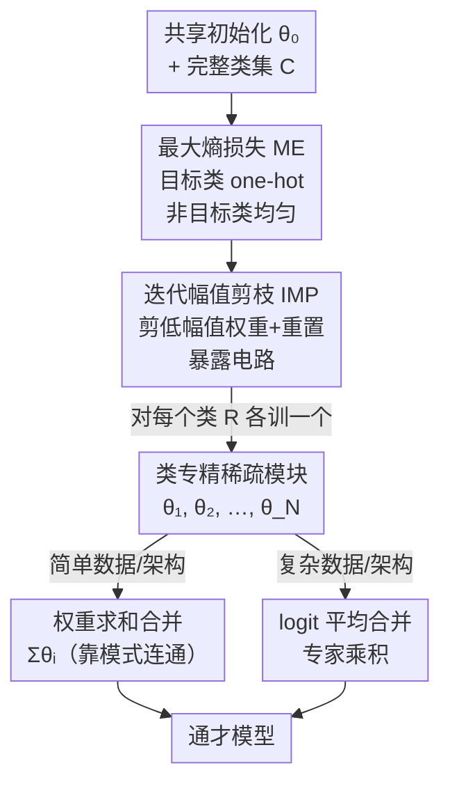

# Composable Sparse Subnetworks via Maximum-Entropy Principle

**会议**: ICLR2026  
**OpenReview**: [https://openreview.net/forum?id=IHwx5ioIP2](https://openreview.net/forum?id=IHwx5ioIP2)  
**代码**: https://github.com/FrancescoCaso/Composable-Sparse-Subnetworks-MaxEnt  
**领域**: 机制可解释性 / 模块化网络 / 模型合并  
**关键词**: 最大熵原理, 功能模块, 稀疏子网络, 迭代幅值剪枝, 模型合并

## 一句话总结
作者用一个基于 KL 散度的"最大熵损失"把神经网络训练成只认识指定类别、对其他类别故意保持均匀不确定的稀疏子网络（功能模块），再通过权重相加或 logit 平均把这些专家模块组合回一个通才模型，从而把"先学纠缠表示、再事后探针解释"的范式反过来，做成"按设计就模块化、按设计就可解释"。

## 研究背景与动机
**领域现状**：现代神经网络在训练中会自发长出针对特定类别的"电路"（circuits）——一小簇神经元和连接专门响应某个类。机制可解释性（mechanistic interpretability）这一支研究的核心，就是想把这些功能子图找出来、理解它们、甚至复用它们。

**现有痛点**：这些电路是隐式涌现的，极难被干净地隔离、复用或组合。不同类别的表示往往是**纠缠**在一起的——多个类共享神经元或特征，这就是所谓的叠加（superposition）现象。结果是模块边界模糊，你想抽出"只管识别数字 3"的那部分网络几乎做不到。

**核心矛盾**：缺乏类级别的模块化，直接限制了我们理解、编辑、组合网络的能力。后验可解释性方法（如 LIME、SHAP）只能在训练好的纠缠模型上事后解读，拿不到边界清晰的功能单元；而真正可组合的模块不仅要能单独工作，还得能**无需微调、无需对齐**地平滑拼接起来——这是叠加现象天然破坏的性质。

**本文目标**：能不能直接训练出稀疏、类专精的子网络，让它们在自己的领域外保持"无知"，同时又能组合成准确的通才模型？这拆成三个子问题：怎么用损失逼出功能隔离、怎么用稀疏化把电路暴露出来、怎么把模块拼回去而不互相干扰。

**切入角度**：作者引入了一个看似与深度学习无关的老工具——**最大熵原理**（Jaynes 1957）：在满足已知约束的前提下，应当选择"最不带偏见"（信息量最小）的分布。作者的洞察是，最大熵可以指导功能隔离——让一个模块只对自己负责的类做出自信预测，对其他所有类输出**均匀分布**。一个对非目标类完全均匀的模块，在被合并时不会往别的类的神经元里塞进"这不是我的类"这种副作用信息，从而天然可组合。

**核心 idea**：用一个 KL 散度形式的最大熵损失训练类专精模块 + 用迭代幅值剪枝暴露电路并减少干扰 + 用权重求和或 logit 平均把模块合并成通才模型——首次提出"通过隔离再合并来构建网络"的训练范式。

## 方法详解

### 整体框架
方法要解决的是"如何造出按设计就模块化、可解释、可组合的网络"。整条流水线是这样转的：从一个**共享初始化** $\theta_0$ 出发，对每一个类别（或类别子集）$R$，用最大熵损失（ME）+ 迭代幅值剪枝（IMP）训练出一个专门识别 $R$、对其余类输出均匀分布的稀疏**子网络模块**；当所有模块都训练好之后，再用两种合并策略之一——**权重求和**或 **logit 平均**——把它们组合成一个能识别所有类的通才模型。前一步保证每个模块"只懂自己那点、对别的装傻"，后一步利用这种"装傻"做到拼接时互不干扰。

### 关键设计

**1. 最大熵损失 ME：用 KL 散度逼出"只对自己类自信、对别人均匀"**

这是全文的核心创新，直击"表示纠缠、模块边界模糊"的痛点。对一个负责类集 $R \subseteq C$ 的模块，给定训练样本 $(x, y)$，作者构造一个目标分布 $\tilde{y} \in \mathbb{R}^{|C|}$：如果 $y \in R$（这是我该认的类），目标就是标准 one-hot $\tilde{y}_i = \delta_{i=y}$；如果 $y \notin R$（不归我管），目标就是**完全均匀** $\tilde{y}_i = 1/|C|$。例如 $C=\{0,1,2\}$、$R=\{0\}$ 时，类 0 的样本目标是 $(1,0,0)$，而类 1、类 2 的样本目标统一是 $(0.33,0.33,0.33)$。损失就是目标分布和预测分布 $\hat{y}=\mathrm{softmax}(f_\theta(x))$ 之间的 KL 散度：

$$L_{\text{ME}}(x,y) = \mathrm{KL}(\tilde{y} \,\|\, \hat{y}) = \sum_{i=1}^{|C|} \tilde{y}_i \log\frac{\tilde{y}_i}{\hat{y}_i}.$$

它鼓励模型对目标类做**低熵**（尖峰）预测、对非目标类做**高熵**（均匀）预测，这正是最大熵原理的字面落地。它和常见的熵正则（用于校准或选择性预测）有本质区别——后者只是软化一下预测，前者是**强制**非目标样本走向理论均匀。关键在于这种均匀性带来了**神经元置换不变性**：在 one-vs-all 方案里，给类 0 训模块会逼着其他输出神经元（比如神经元 1）去表示"非类 0"；可一旦另一个模块用神经元 1 表示"类 1"，两者相加就发生语义冲突——同一个神经元既编码"类 1"又编码"非类 0"（而后者包含一大堆别的类）。ME 让非目标样本均匀，等于不在别的神经元上写任何东西，从根上避免了这种合并冲突，这是可组合性的前提。

**2. 迭代幅值剪枝 IMP：剪掉无关权重，把电路裸露出来**

光有损失还不够——稠密网络里和当前任务无关的权重会在权重空间合并时制造干扰。作者借用彩票假设（Lottery Ticket Hypothesis）的迭代幅值剪枝：每轮先用 ME 损失训练 $E$ 个 epoch，再剪掉绝对值最小的一批权重，然后把**剩余权重重置回初始值** $\theta_0$，如此循环 $N$ 轮，最后对剪完的子网络做一次收尾训练。每轮剪枝比例由 $K = 1-(1-P)^{1/N}$ 控制，使 $N$ 轮后总稀疏度达到 $P$。这一步的作用是双重的：一方面剪掉冗余容量、把真正负责该类的"电路"暴露出来（呼应可解释性目标），另一方面稀疏化减少了模块间的权重重叠，从而在权重求和合并时降低干扰。实验里 MLP 能承受到 99% 稀疏几乎不掉点，卷积类（CNN/ResNet/VGG）最优在 60% 左右；每个模型只剪两轮再收尾训练。

**3. 权重求和合并 + 模式连通性：为什么把权重直接加起来能行**

最朴素的合并方式就是把各模块权重直接相加 $\theta_{\text{merged}} = \sum_i \theta_i$。这之所以可行，正是设计 1 埋下的伏笔：各模块在不相交的类子集上专精、在其余类上通过均匀预测表现得"几乎一样"，于是相加时彼此的贡献最小化干扰。但作者没有停在"它能 work"，而是用**模式连通性**（mode connectivity）从损失地形上给出解释。和典型模式连通研究不同（那里 $\theta_1,\theta_2$ 解同一个任务），这里两个模块解的是**不同**类集，合并模型要解的是并集任务 $R_1\cup R_2$，损失用 ME 在并集标签上计算。两个解 $\theta_1,\theta_2$ 沿路径 $\gamma(t)$ 模式连通，当且仅当路径上损失不超过端点损失线性插值加一个小裕量 $\epsilon$（取端点损失的 2%）。作者精心设计了一条分段线性路径，让权重和 $\theta_1+\theta_2$ 恰好落在中点 $t=0.5$ 处：

$$\gamma_{\theta_1\to\theta_2}(t) = \begin{cases} \theta_1 + 2t\cdot\theta_2 & t \le 0.5 \\ 2(1-t)\cdot\theta_1 + \theta_2 & t > 0.5 \end{cases}$$

它满足 $\gamma(0)=\theta_1$、$\gamma(1)=\theta_2$、$\gamma(0.5)=\theta_1+\theta_2$。如果沿路径的损失壁垒接近 0，就说明权重和落在了组合任务的低损失区，证明这些模块"按构造就可组合"。

**4. logit 平均合并：专家乘积，自动忽略不相关模块**

权重求和在复杂数据/架构上会失效（权重干扰难避免），所以作者给出第二条更鲁棒的合并路线——直接在 **logit 空间**合并。设模块 $f_{\theta_i}$ 对输入 $x$ 输出 logits $z^{(i)}$，把 $N$ 个专家的 logits 做凸组合（通常取平均）$\bar{z}=\sum_i w_i z^{(i)}$（$w_i\ge 0$，$\sum_i w_i=1$），再 $\bar{y}=\mathrm{softmax}(\bar{z})$。由于 softmax 是指数归一化，这等价于一个**对数意见池 / 专家乘积**（product-of-experts）：

$$\bar{y}_k \propto \exp\Big(\sum_i w_i z^{(i)}_k\Big) = \prod_i \big(\mathrm{softmax}(z^{(i)})_k\big)^{w_i}.$$

妙处在于：在 ME 训练下，任何对 $x$ "不负责"的专家都会输出近乎均匀的 $\hat{y}^{(i)}$，它在乘积里只贡献一个**与类别无关的常数因子**，归一化后被自动消掉。于是 logit 平均会自动忽略无关专家、只保留与 $x$ 匹配的那个专家——这就解释了为什么它在并集任务上表现很强。而且 logit 合并基本不依赖剪枝（IMP 只对权重空间合并有用），对带 BatchNorm 的大模型也无需任何额外处理。

### 损失函数 / 训练策略
核心就是上面的 ME 损失（式 2），对每个类集 $R$ 独立跑 Algorithm 1（IMP + ME，剪两轮 + 收尾）。训练时模拟"只有 $R$ 中的类被标注、但仍能看到其他样本"的场景。评估三件套：rewarded accuracy（目标类上的分类准确率）、non-rewarded entropy（非目标输入上的平均预测熵，理论上限 $\log(N_{\text{classes}})$）、以及混淆矩阵（定性看泄漏）。合并测试用 $|R|\in\{1,2,5\}$、10 组类对 × 5 个随机种子。

## 实验关键数据

### 主实验
在 4 类模型（浅/深 MLP、CNN、ResNet18、VGG11）和多数据集（MNIST、FMNIST、CIFAR-10、表格数据 HAR/Yeast、文本 IMDB/20NG）上验证三件事：模块能否专精、合并能否恢复通才性能、剪枝是否提升可组合性。

单模块行为（表 1，ME 不剪枝，5 次平均）——目标类准确率几乎都贴近 100%，非目标熵逼近理论均匀值：

| 数据集 | 模型 | 目标类准确率 | 非目标熵（理论上限） |
|--------|------|------|------|
| MNIST | Shallow MLP | 0.998 | 2.296（≈log10=2.30） |
| FMNIST | Shallow MLP | 0.998 | 2.296 |
| HAR | Shallow MLP | 0.997 | 1.762（6 类） |
| Yeast | Deep MLP | 0.996 | 1.302（4 类） |

成对合并的目标类准确率（表 2，带 IMP，对比三种损失 XE / QME / ME，5 种子 × 10 对）——ME 在所有组合里都拿到最高准确率：

| 模型 | $\lvert R\rvert$ | 损失 | MNIST(logit) | MNIST(weight) | FMNIST(logit) |
|------|------|------|------|------|------|
| Shallow MLP | 1 | XE | 0.798 | 0.679 | 0.859 |
| Shallow MLP | 1 | QME | 0.984 | 0.973 | 0.962 |
| Shallow MLP | 1 | **ME** | **0.992** | **0.991** | **0.983** |
| CNN | 1 | **ME** | **0.997** | 0.984 | **0.983** |

### 消融实验

| 配置 | 现象 | 说明 |
|------|------|------|
| ME vs QME | ME 全面胜出 | QME 只在"非目标类内部"均匀、不动目标类神经元，反而在非目标流上制造泄漏，违反最大熵 |
| ME vs XE（标准交叉熵） | ME 明显更好 | XE 设计来一次学所有标签，类数被砍后效果受损 |
| logit 合并 vs 权重合并 | logit 几乎全面更优 | 唯一例外是 CNN+$\lvert R\rvert$=2 的 XE；logit 对 IMP 不敏感 |
| IMP 对 Deep MLP | 一致提升 | 对 Shallow MLP、CNN 提升较温和 |
| CIFAR-10 权重合并 | 灾难性失败 | logit 合并仍能拿到好成绩，说明复杂数据下权重干扰难避免 |

### 关键发现
- **logit 合并是真正的万能钥匙**：无论架构/数据多复杂，logit 平均（专家乘积）几乎总能恢复通才性能，CIFAR-10 上权重合并崩了它仍然稳；权重合并只在简单数据/架构（如 MNIST 上的 Shallow MLP，全合并仍 >90%）才靠谱。
- **宽度比深度更利于权重空间可组合**：Deep MLP 整体并不优于 Shallow MLP，更深更窄反而增加权重空间干扰，说明宽度对可组合性更关键。
- **BatchNorm 是大模型权重合并的关键**：合并带 BN 的模型时，只需在并集类数据上**重估 running 统计量**（冻结仿射参数），就能让 ResNet18/VGG11 的权重合并 work；ResNet18 仅在 CIFAR-10 上退化，侧面印证 BN 的作用。
- **模式连通性证据**（图 6，FMNIST 上 Shallow MLP 全合并）：沿合并路径的损失壁垒大部分接近或低于 0，说明合并模型落在低损失区、模块按构造可组合；只有合并到很后面才冒出约 2% 的小壁垒（轻微干扰）。
- **可扩展到 100 个模块**：CIFAR-100 上把全合并压力测试到 100 个模块，logit 合并能优雅退化、没有突然的组合瓶颈。

## 亮点与洞察
- **把一个 1957 年的统计物理原理变成模块化训练的损失**：最大熵原理"对未知保持均匀"被直接翻译成"对非目标类输出均匀分布"，而这种均匀性恰好等价于"合并时不污染别的神经元"——动机和机制咬合得非常紧，不是硬套。
- **"均匀即可组合"这个洞察可迁移**：任何想做模块拼接（联邦学习、机器遗忘、模型编辑）的场景，都可以借鉴"让模块对管辖范围外保持最大熵"来减少干扰，而不是依赖事后对齐/置换匹配。
- **logit 平均 = 专家乘积的推导很漂亮**：用一行 softmax 指数归一化就证明了"不相关专家自动被常数因子消掉"，把经验上的"logit 合并更鲁棒"落到了概率解释上（product-of-experts / 对数意见池）。
- **范式反转**：从"端到端学纠缠解、再事后探针解释"反转成"先独立训熵正则模块、再合并"，给机制可解释性提供了一个"电路按设计存在、而非事后发现"的受控试验台。

## 局限与展望
- **权重空间合并仍是半成品**：作者坦承复杂数据/架构下简单权重求和效果次优，需要更深入研究剪枝、合并技术或宽度的作用；他们建议未来可用 Git-Rebasin、PLeas 等更复杂的对齐合并替代朴素相加。
- **模块重叠没被彻底厘清**：IMP 有助隔离，但子网络之间的重叠如何影响最优剪枝策略仍是开放问题。
- **下游应用全是"未来工作"**：文中点名的机器遗忘、网络形式化验证、联邦学习、设计即可解释等应用都只是设想，没有给出任何具体的下游落地实验，价值主张偏 promise。
- **数据集偏简单**：主战场是 MNIST/FMNIST/CIFAR 这类小图像 + 少量表格/文本，CIFAR-100 也只到压力测试，离真实大规模任务还有距离；权重合并在 CIFAR-10 就已崩溃，更复杂数据下 logit 合并是否依旧稳健需更多验证。
- **每类训一个模块的开销**：完整通才模型需要为每个类单独跑一遍 IMP+ME 训练，类数大时训练成本线性增长，文中未讨论这一可扩展性代价。

## 相关工作与启发
- **vs 模块化神经网络（Kirsch et al. 2018）**: 他们用控制器端到端学模块及其组合、模块在任务间被复用；本文造的是**类专精**功能模块（只认一个类、对别的高熵），并靠模型合并而非后续模块串联，因此能干净隔离类级功能。
- **vs 后验可解释性（LIME / SHAP）**: 它们只能在训练好的纠缠模型上事后解读；本文在**训练时**就赋予单元清晰语义和组合行为，属于"设计即可解释"。
- **vs 脑启发模块化训练（Liu et al. 2023）**: 他们靠把网络嵌入几何空间 + 神经元交换 + 正则，主要在合成数据上、没扩到 CNN/ResNet/VGG；本文用剪枝而非正则，并验证到更广的架构和任务（含表格、文本、Imagenette）。
- **vs Quasi-MaxEnt（本文消融基线）**: QME 只在非目标类内部做均匀、保留目标类神经元不动，结果反而泄漏信息、违反最大熵；ME 对非目标样本全局均匀，专精和无干扰都更好——这个对比直接说明了"在所有神经元上均匀"这一设计细节的必要性。

## 评分
- 新颖性: ⭐⭐⭐⭐⭐ 首次提出"隔离再合并"的训练范式，把最大熵原理变成可组合模块的损失，思路清新且自洽。
- 实验充分度: ⭐⭐⭐⭐ 覆盖多架构多数据、有模式连通性分析和 100 模块压力测试，但数据集偏简单、缺真实下游应用验证。
- 写作质量: ⭐⭐⭐⭐⭐ 动机—机制—证据层层咬合，logit 平均的专家乘积推导和模式连通路径设计都讲得清楚漂亮。
- 价值: ⭐⭐⭐⭐ 为机制可解释性提供"电路按设计存在"的受控试验台，对模块合并/联邦/遗忘有启发，但当前更偏方法论 promise。

<!-- RELATED:START -->

## 相关论文

- [\[ICLR 2026\] Probing Rotary Position Embeddings through Frequency Entropy](probing_rotary_position_embeddings_through_frequency_entropy.md)
- [\[ICML 2026\] GEM: Geometric Entropy Mixing for Optimal LLM Data Curation](../../ICML2026/interpretability/gem_geometric_entropy_mixing_for_optimal_llm_data_curation.md)
- [\[NeurIPS 2025\] Latent Principle Discovery for Language Model Self-Improvement](../../NeurIPS2025/interpretability/latent_principle_discovery_for_language_model_self-improvement.md)
- [\[NeurIPS 2025\] Bigram Subnetworks: Mapping to Next Tokens in Transformer Language Models](../../NeurIPS2025/interpretability/bigram_subnetworks_mapping_to_next_tokens_in_transformer_language_models.md)
- [\[ICLR 2026\] Toward Faithful Retrieval-Augmented Generation with Sparse Autoencoders](toward_faithful_retrieval-augmented_generation_with_sparse_autoencoders.md)

<!-- RELATED:END -->
