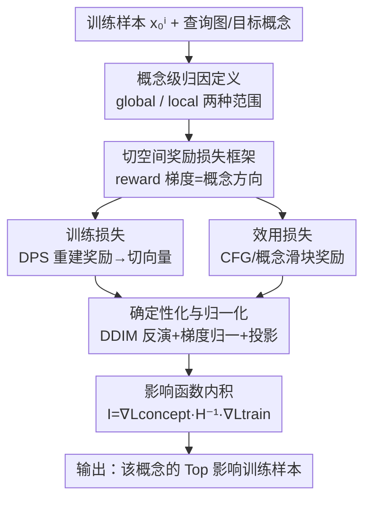

# Concept-TRAK: Understanding how diffusion models learn concepts through concept attribution

**会议**: ICLR2026  
**OpenReview**: [https://openreview.net/forum?id=TRmIcgMe8I](https://openreview.net/forum?id=TRmIcgMe8I)  
**代码**: 待确认  
**领域**: 扩散模型可解释性 / 数据归因  
**关键词**: 数据归因, 概念归因, 扩散模型, 影响函数, 切空间

## 一句话总结
Concept-TRAK 把传统"整张图级"的训练数据归因细化到"单个概念级"——通过为影响函数设计**面向概念的奖励型训练损失与效用损失**，让人能精确查出某张 AI 生成图里的某个具体概念（如"皮卡丘"这个角色、而非铅笔画风格）究竟是被哪些训练样本影响出来的，在合成/CelebA-HQ/AbC 三套基准上都大幅超过 TRAK、D-TRAK、DAS。

## 研究背景与动机
**领域现状**：扩散模型不只是能生成高保真图像，更重要的是它学会了从训练数据中抽取并灵活组合"概念"。为了解决版权、安全审计、模型调试等问责需求，数据归因方法（influence function、TRAK、Data Shapley 等）被用来估计每个训练样本对生成结果的贡献。近年也出现了专门针对扩散模型的归因方法 D-TRAK、DAS。

**现有痛点**：这些方法全都是**整张图（whole-image）级别**的归因——它们回答的是"哪些训练样本影响了这整张生成图"。但真实场景里利益相关方关心的往往是图中的**某个特定概念**。论文用一个很直白的例子点题：一张"铅笔画风格的皮卡丘"生成图，宝可梦公司在意的是"皮卡丘"这个 IP 角色，而不是铅笔画风格；可 TRAK 这类方法检索回来的全是风格相似的铅笔画图，恰恰漏掉了真正涉及版权的角色。

**核心矛盾**：整张图归因把所有视觉因素（风格、物体、构图）混在一起算贡献，无法把某一个语义概念的影响从中**分离**出来。尤其在生成图是"训练时没见过的概念组合"（OOD，如红色三角形而训练集里没有红三角）时，靠视觉相似度根本无法定位单个概念的来源。

**本文目标**：定义并解决"概念级归因"——估计每个训练样本对**特定语义概念**（风格、物体、概念）的贡献，而不是对整张图的贡献。

**切入角度**：作者抓住了前人的一个关键发现——扩散模型归因的成败高度依赖损失函数的设计（DSM loss 因噪声项随机性太大而不适合归因，D-TRAK 改用 $\|\epsilon_\theta\|_2^2$、DAS 改用 $\|\epsilon_\theta\|_1^1$ 才稳定）。作者进一步假设：有意义的概念方向对应扩散模型隐空间流形的**切向量（tangent vector）**，而 classifier-free guidance 向量正好工作在这个切空间里、且富含概念信息。

**核心 idea**：用**奖励优化（reward optimization）**来构造影响函数所需的两个损失——训练损失捕捉"某训练样本如何影响生成"，效用损失捕捉"目标概念是否出现"——让两者的梯度都沿着切空间里的概念相关方向，从而把概念级影响从整体重建质量中剥离出来。

## 方法详解

### 整体框架
Concept-TRAK 建立在影响函数框架上。影响函数衡量"删掉某个训练样本 $x_0^i$ 会如何改变模型在某个效用指标 $V$ 上的表现"，其核心式子是

$$I(x_0^i, c_{target}) = \nabla_\theta L_{concept}(c_{target};\theta)^\top H^{-1} \nabla_\theta L_{train}(x_0^i;\theta)$$

其中 $H$ 是训练损失的 Hessian（实践中用 Fisher 信息矩阵近似并做随机投影降维，沿用 TRAK），$L_{train}$ 编码训练样本的贡献，$L_{concept}$（即效用损失 $V$）衡量模型生成目标概念 $c_{target}$ 的能力。这个内积本质上度量的是"训练样本 $x_0^i$ 诱导的引导方向"与"目标概念诱导的引导方向"之间的对齐程度——对齐越高，说明该样本对模型生成这个概念贡献越大。

整条 pipeline 是：把训练样本经 **DDIM 反演**确定性地映成噪声潜变量 → 用**奖励型训练损失**算出每个训练样本的参数梯度并缓存 → 给定一张查询图和一个目标概念，用**奖励型效用损失**算出概念梯度 → 两者经 Hessian 加权做内积，得到每个训练样本对该概念的影响分数 → 排序取 Top influences。整套流程里两个奖励损失的设计是创新核心，DDIM 反演、梯度归一化、梯度投影是让分数稳定/高效的配套技术。

### 关键设计

**1. 概念级归因的定义：把"影响整张图"细化为"影响某个概念"**

论文先把任务严格定义出来。概念级归因衡量训练样本 $x_0^i$ 如何影响模型生成概念 $c_{target}$ 的能力，量化为期望的"概念出现度" $p_\theta(c_{target}) = \mathbb{E}_{x_0\sim p_{sample}(\cdot|c)}[p(c_{target}|x_0)]$，其中 $p(c_{target}|x_0)$ 是图 $x_0$ 中存在该概念的概率。关键在于采样分布 $p_{sample}$ 决定了归因的**范围**：取模型的生成分布就是**全局归因（global）**——衡量该概念在所有生成中的来源；取狄拉克 $\delta(x_0 - x_0^{test})$ 就是**局部归因（local）**——衡量某张特定生成图里这个概念的具体呈现来自哪。这个定义是后面一切的地基：它把"哪些样本影响了这张图"改写成"哪些样本影响了模型生成 $c_{target}$ 的能力"，从而第一次让单概念溯源有了形式化目标。本文聚焦能被当作条件输入（如文本提示"Pikachu"、类别索引）的概念，以便直接复用条件生成机制。

**2. 切空间奖励损失框架：用奖励梯度指向概念相关方向**

这是全文的方法内核。作者的几何动机是：扩散模型的潜变量 $x_t$ 落在低维流形上，概念相关方向对应流形切空间里的切向量，而 CFG 向量 $\epsilon_\theta(x_t,c)-\epsilon_\theta(x_t)$ 已被证明在切空间内有效工作。问题是怎么把"概念相关方向"塞进损失函数？答案是奖励优化：奖励梯度 $\nabla_{x_t}R(x_t)$ 天然就是指向"概念增强区域"的引导方向。从奖励优化目标 $\max_{p_\theta}\mathbb{E}[R(x_0)]-\beta D_{KL}(p_\theta\|p_{sample})$ 出发，其最优解 $p^*(x_0|c)\propto p_0(x_0|c)\exp(R(x_0)/\beta)$ 的得分函数分解为 $\nabla_{x_t}\log p^* = \nabla_{x_t}\log p_0 + \frac{1}{\beta}\nabla_{x_t}R$。把这个朝奖励整形分布的方向，经显式得分匹配（ESM）转写成扩散模型记号，就得到统一的**奖励型损失**：

$$L_{reward}(x_0;\theta) = \mathbb{E}_{x_t}\Big[\big\|\,sg[\epsilon_\theta(x_t;c) - \tfrac{1}{\beta}\nabla_{x_t}R(x_t)] - \epsilon_\theta(x_t;c)\,\big\|_2^2\Big]$$

其中 $sg[\cdot]$ 是停梯度。直观上，这个损失把模型输出朝奖励梯度 $\nabla_{x_t}R(x_t)$ 的方向推。这一框架的价值在于：只要换不同的奖励 $R$，就能得到针对不同目的、却都工作在切空间里的损失——这正是下面训练损失和效用损失的统一模子，也是它比直接用 DSM 更稳的根源（有趣的是，该形式在特定假设下等价于 GFlowNet 框架的 $\nabla$-DB 损失）。

**3. 训练损失与效用损失：两个奖励的具体实例化**

把框架落地，就是设计两个具体奖励。**训练损失**用 DPS（Diffusion Posterior Sampling）式的重建奖励 $R_{train}(x_t)\triangleq\log p(x_0^i|\hat x_0)$，假设训练数据服从高斯，得到 $R_{train}\propto-\frac{1}{\sigma_{data}}\|x_0^i-\hat x_0\|$，其中 $\hat x_0=\mathbb{E}[x_0|x_t]$ 是后验均值。代入框架得

$$L_{train}(x_0;\theta) = \mathbb{E}_{x_t}\Big[\big\|\,sg[\epsilon_\theta(x_t;c) + \lambda_t\nabla_{x_t}\|\hat x_0 - x_0^i\|] - \epsilon_\theta(x_t;c)\,\big\|_2^2\Big]$$

这个梯度 $\nabla_{x_t}\|\hat x_0 - x_0^i\|$ 正好是数据流形上的切向量。它和 DSM 目标都想捕捉"训练样本如何影响生成"，区别在于 DSM 给的是重建驱动的信号，而本文给的是切空间引导向量，经验上对概念级归因更稳定。**效用损失**用概念出现奖励 $R_{concept}(x_t)\triangleq\log p(c_{target}|x_t)$，当 $c_{target}$ 是条件输入时它的梯度恰好简化为 CFG 向量 $\epsilon_\theta(x_t;c_{target})-\epsilon_\theta(x_t)$；若概念嵌在条件 $c$ 里，则用**概念滑块（concept slider）**引导 $\epsilon_\theta(x_t;c)-\epsilon_\theta(x_t;c^-)$ 来度量目标概念的贡献（如 $c$="铅笔画的皮卡丘"，$c^-$="铅笔画"，差值就专门指向"皮卡丘"）。代入框架得

$$L_{concept}(c_{target};\theta) = \mathbb{E}_{x_0,x_t}\Big[\big\|\,sg[\epsilon_\theta(x_t;c) + \lambda_c(\epsilon_\theta(x_t;c)-\epsilon_\theta(x_t;c^-))] - \epsilon_\theta(x_t;c)\,\big\|_2^2\Big]$$

正是 $c^-$ 这一项的"做减法"让效用损失能把目标概念从其余视觉因素中**抠出来**，这是整张图归因做不到的。

**4. 确定性化与归一化：消除随机性、避免某些时间步主导**

奖励损失再好，影响分数若被随机性和量纲污染也会失效，所以配了三个稳定/高效技术。其一，**DDIM 反演确定性采样**：用 $x_t^i=\text{DDIMinv}(x_0^i,0\to t)$ 把训练样本确定性地映成噪声潜变量，配合上面的损失彻底去掉前向加噪 $x_t\sim q(x_t|x_0)$ 带来的随机性，让梯度更可信；局部归因则约束从"生成 $x_0^{test}$ 所用的噪声"出发做 DDIM。其二，**梯度归一化**：不同时间步的损失量纲差异会让某些时间步的梯度主导结果，于是把每个时间步梯度归一化为单位范数 $\bar g_t=g_t/\|g_t\|_2$，既保证没有单一时间步过度影响，又让方法对 $\beta$、$\sigma_{data}$ 这类超参不敏感（论文里反复说"具体取值因归一化而无关紧要"就是这个原因）。其三，**梯度投影与 Hessian 近似**：沿用 TRAK 把梯度随机投影到低维 $k\ll d$，并用 Fisher 信息矩阵近似 Hessian，在已缓存训练梯度的前提下开销几乎可忽略，保证大规模可用。

### 一个完整示例
以"铅笔画风格的皮卡丘"这张生成图为例走一遍局部概念归因：目标概念设为 $c_{target}$="皮卡丘"，条件 $c$="铅笔画的皮卡丘"、反概念 $c^-$="铅笔画"。效用损失里 $\epsilon_\theta(x_t;c)-\epsilon_\theta(x_t;c^-)$ 这一差值方向把"皮卡丘"从"铅笔画"里分离出来；训练侧对每个训练样本用 DPS 奖励算出切空间梯度并缓存；最后影响函数内积给每个训练样本打分排序。结果是 Top influences 里检索到的是真正含皮卡丘角色的训练样本，而不是 TRAK 检索回来的一堆铅笔画风格图。对"cat in the style of graffiti art"这种组合提示，Concept-TRAK 还能分别对 $\langle object\rangle$ 和 $\langle style\rangle$ 各自溯源——前者检索回猫的图、后者检索回涂鸦艺术图；对"a teddy bear on a skateboard in Times Square"这种三概念提示，能把泰迪熊、滑板、时代广场三组训练样本各自分离检索出来。

## 实验关键数据

### 主实验
作者构造了两套带 ground-truth 概念标签的受控基准（合成 + CelebA-HQ），并刻意制造 OOD 组合（训练时排除某些概念组合），用 Precision@10 衡量"Top 训练样本是否含同一目标概念"。由于传统 LDS 指标不适用于概念级评估，作者改用 Precision@10 / Recall@10。

| 数据集 | 场景 | Concept-TRAK | DAS | D-TRAK | TRAK |
|--------|------|------|------|------|------|
| 合成 (Avg) | In-distribution | **1.00** | 1.00 | 1.00 | 0.80 |
| 合成 (Avg) | Out-of-distribution | **0.85** | 0.50 | 0.50 | 0.45 |
| CelebA-HQ (Avg) | In-distribution | 0.92 | **0.96** | 0.50 | 0.84 |
| CelebA-HQ (Avg) | Out-of-distribution | **0.97** | 0.67 | 0.30 | 0.60 |

关键差距出现在 OOD：合成数据上基线全部跌到 $\le 0.50$（DAS/D-TRAK 在颜色概念上甚至 0.00），而 Concept-TRAK 仍有 0.85；CelebA-HQ 上 DAS 从 ID 的 0.96 跌到 OOD 的 0.67，Concept-TRAK 反而在 OOD 拿到 0.97。原因是 ID 时基线能靠"整张图视觉相似"蒙对（训练集里就有同样概念组合的样本），而 OOD 时训练集没有该精确组合，必须真正分离单个概念的贡献，整张图归因就失效了。在真实 T2I 的 AbC 基准（Recall@10，从含 10 万张 LAION 图的池子里检索 exemplar）上，Concept-TRAK 的 Recall@10 显著高于 TRAK/D-TRAK/Unlearn，且计算开销与 TRAK 同级。

### 消融实验
作者在 AbC 的 48 个样本上逐项叠加各设计，看每个组件的增益：

| 配置 | Recall@10 | 说明 |
|------|-----------|------|
| TRAK (Base: $L_{DSM}$) | 0.04 | 起点：标准 DSM 损失 |
| + Config A: 概念感知效用梯度 | 0.261 | 加入奖励型效用损失 |
| + Config B: DPS 训练梯度 | 0.335 | 训练损失换成 DPS 切向量 |
| + Config C: DDIM 反演 | 0.564 | 确定性采样去随机性 |
| + Config D: 梯度归一化 | **0.955** | 完整 Concept-TRAK |

### 关键发现
- 从 0.04 一路涨到 0.955，**每个组件都带来实打实的增益**，没有"凑数"的设计；其中梯度归一化（Config C→D，0.564→0.955）的跃升最大，说明跨时间步量纲对齐对概念级归因尤其关键。
- 方法对 $\beta$、$\sigma_{data}$ 等超参不敏感——梯度归一化让这些常数在最终分数里被消掉，鲁棒性来自设计而非调参。
- OOD（新颖概念组合）是真正拉开差距的战场：组合越复杂、风格与物体越纠缠，整张图归因越失效，Concept-TRAK 的优势越被放大。

## 亮点与洞察
- **把"损失函数设计决定归因质量"这条经验推到极致**：前人只是把 DSM 换成 $\ell_2$/$\ell_1$ 范数，本文则用奖励优化 + 切空间几何，系统地"设计"出概念相关的损失，思路更本质。
- **概念滑块差值 $\epsilon_\theta(c)-\epsilon_\theta(c^-)$ 当效用方向**很巧妙：用一对"含/不含目标概念"的提示做减法，就把目标概念从风格等干扰里抠出来，这个 trick 可迁移到任何需要"分离某个语义因子"的归因/编辑任务。
- **复用现成的 CFG 向量和 DPS 后验均值当切向量**：不引入额外训练，把扩散模型已有的引导机制重新解读成"概念方向"，工程上几乎零成本接到 TRAK 流水线上。
- **global vs local 用采样分布 $p_{sample}$ 一个开关统一**：取生成分布是全局、取狄拉克是局部，定义优雅且实现统一。

## 局限与展望
- 作者承认这只是概念级归因的**初步探索**，定位为"foundational framework"，并呼吁后续做更鲁棒的基准与方法。
- 概念主要限定为**能被当作条件输入的概念**（文本提示、类别索引）；纯视觉概念只在附录 C 讨论，主文方法对"说不清/无法用提示指定"的概念覆盖有限。
- AbC 基准靠 textual inversion + 冻结模型构造 ground truth，作者也指出它"对大规模训练场景缺乏一般性"，仍是当前最可靠但受限的概念级评估手段；受控合成/CelebA-HQ 只有 2–3 个二元概念，离真实大规模训练集的复杂度还远。
- 评估指标被迫从 LDS 换成 Precision@10/Recall@10（因 LDS 不适用），概念级归因缺乏像整图归因那样的标准定量协议，横向可比性有待社区建立。

## 相关工作与启发
- **vs TRAK (Park et al., 2023a)**：TRAK 用随机投影把影响函数做到可扩展，但只做整张图归因；Concept-TRAK 继承其投影 + Fisher 近似的工程骨架，关键改造在于换上奖励型概念损失，把粒度从整图降到概念。
- **vs D-TRAK / DAS (Zheng 2024 / Lin 2025)**：两者都发现 DSM 损失因随机性不适合归因，分别改用 $\|\epsilon_\theta\|_2^2$、$\|\epsilon_\theta\|_1^1$ 提升稳定性，但仍是整图、与本文同样用一个损失兼当训练/效用损失；本文进一步分别为训练与效用设计**不同的、面向概念的奖励损失**，并在 OOD 组合场景大幅领先。
- **vs Unlearning-based 归因 (Wang et al., 2024b)**：用"遗忘"来估计影响，在 AbC 上易被风格元素干扰检索错样本；Concept-TRAK 靠概念滑块差值隔离目标概念，定性结果（图 6）显示能正确框出 $\langle V\rangle$ 概念。
- **思想启发**：把"奖励优化 / DPS 后验采样 / 概念滑块"这些原本用于**可控生成与编辑**的工具，反向用来做**数据溯源**，揭示了"引导方向 ≈ 概念方向 ≈ 切向量"这条贯穿生成与归因的几何主线，对后续可解释性研究是很好的视角。

## 评分
- 新颖性: ⭐⭐⭐⭐⭐ 首次提出并形式化"概念级归因"，用奖励优化 + 切空间几何重新设计影响函数损失，方向开创性强。
- 实验充分度: ⭐⭐⭐⭐ 合成/CelebA-HQ/AbC 三套基准 + 逐项消融扎实，但受控基准概念数偏少、真实场景多为定性。
- 写作质量: ⭐⭐⭐⭐⭐ 动机用皮卡丘例子点睛，几何动机→奖励框架→两个损失的推导层层递进，清晰好读。
- 价值: ⭐⭐⭐⭐⭐ 版权审计、安全检测、模型调试都直接受益，且方法几乎零成本接到现有 TRAK 流水线，落地性强。

<!-- RELATED:START -->

## 相关论文

- [\[ICLR 2026\] Debugging Concept Bottleneck Models through Removal and Retraining](debugging_concept_bottleneck_models_through_removal_and_retraining.md)
- [\[ICLR 2026\] From Concepts to Components: Concept-Agnostic Attention Module Discovery in Transformers](from_concepts_to_components_concept-agnostic_attention_module_discovery_in_trans.md)
- [\[ICLR 2026\] Patronus: Interpretable Diffusion Models with Prototypes](patronus_interpretable_diffusion_models_with_prototypes.md)
- [\[ICLR 2026\] How Do Transformers Learn to Associate Tokens: Gradient Leading Terms Bring Mechanistic Understanding](how_do_transformers_learn_to_associate_tokens_gradient_leading_terms_bring_mecha.md)
- [\[AAAI 2026\] Concepts from Representations: Post-hoc Concept Bottleneck Models via Sparse Decomposition of Visual Representations](../../AAAI2026/interpretability/concepts_from_representations_post-hoc_concept_bottleneck_models_via_sparse_deco.md)

<!-- RELATED:END -->
