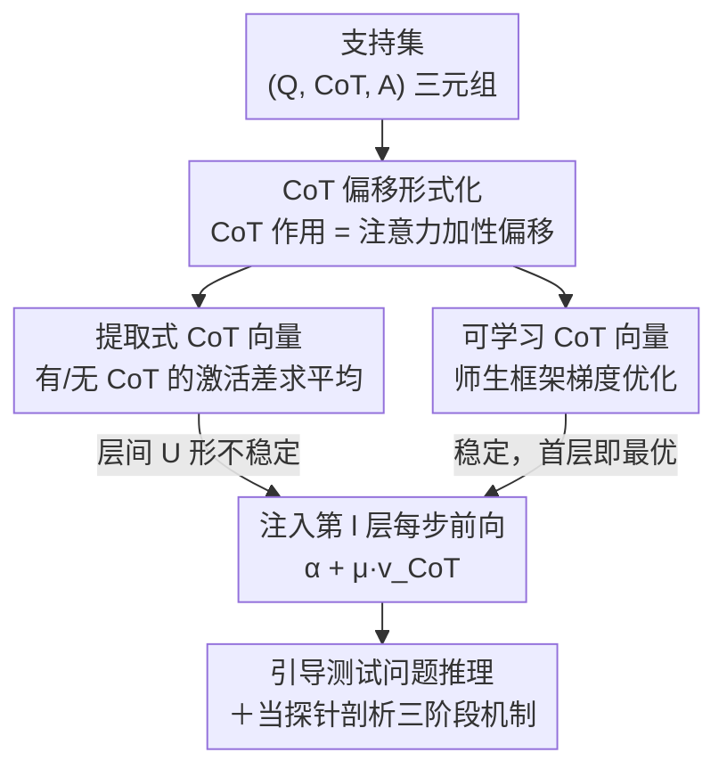

# CoT Vectors: Transferring and Probing the Reasoning Mechanisms of LLMs

**会议**: ICLR2026  
**OpenReview**: [https://openreview.net/forum?id=L1FUfBCL0c](https://openreview.net/forum?id=L1FUfBCL0c)  
**代码**: 待确认（原文称源码将开源）  
**领域**: 可解释性 / LLM 推理机制  
**关键词**: Chain-of-Thought, Task Vector, 激活干预, 推理机制探测, 参数高效

## 一句话总结
把一段 Chain-of-Thought（CoT）推理过程压缩成一个可直接加到隐藏状态上的「CoT 向量」，既能在几乎零开销下提升 LLM 多步推理（媲美 LoRA 但可训练参数少 3 个数量级），又能当成探针揭示出 LLM 推理被组织成「感知—推理—表达」三阶段的内部机制。

## 研究背景与动机
**领域现状**：让 LLM 做好多步推理，目前主流就两条路——一是 In-Context Learning（ICL），在 prompt 里塞几条 few-shot CoT 示例；二是用带 CoT 标注的数据做微调（SFT / RLHF / LoRA）。两者都在「外部」想办法把推理能力喂给模型。

**现有痛点**：ICL 要拉长 prompt、拖慢推理；微调则要大量高质量推理轨迹和算力，而且对那些本就有 CoT 能力的模型往往收益很有限。换句话说，「让模型学会一种解题套路」这件事，现在的代价高得和收益不成正比。

**核心矛盾**：CoT 的本质是一种**任务级、可复用的「解题心态」**，但现有手段要么把它绑在冗长的 prompt 里（每次都重新喂），要么把它摊进千万级参数的权重更新里（笨重且不透明）。有没有一种既紧凑、又可复用、又便宜的载体来承载这种推理知识？

**切入角度**：作者借鉴 Task Vector 范式——分类等简单任务的知识可以蒸馏成一个紧凑向量（取微调前后激活或参数之差），加到前向过程里就能改变模型行为，无需改权重。但 Task Vector 此前只在简单适配场景验证过，能不能撑起复杂的多步推理是未知数。作者先做了一步数学推导，发现 CoT 对注意力输出的影响可以形式化为一个**一致的加性偏移**，这就给「把 CoT 也做成向量」提供了理论依据。

**核心 idea**：提出 **CoT Vector**——把一组 (Question, CoT, Answer) 三元组里蕴含的推理知识压成一个向量，推理时直接注入某一层的隐藏状态来引导模型「按这个套路想」。并进一步发现直接提取的向量在层间极不稳定（U 形曲线），于是用师生框架学一个更稳的可学习版本；最后反过来把这个向量当探针，剖析 LLM 推理的内部组织方式。

## 方法详解

### 整体框架
整篇工作其实在回答两个问题：**怎么把 CoT 装进一个向量**，以及**这个向量能告诉我们 LLM 内部发生了什么**。方法上分三步走：先从理论上把「CoT 的作用 = 注意力输出上的一个加性偏移」推导出来（这是合法性证明）；再给出两种拿到这个偏移向量的办法——非参数的「提取式」和参数化的「可学习式」；最后规定推理时怎么把向量注入每一步前向传播。提取式简单但暴露了层间不稳定性，反而成了探测推理机制的入口；可学习式则用师生蒸馏把这种不稳定性抹平。

### 关键设计

**1. CoT 偏移的形式化：把「插一段推理」证明成激活上的一次加性平移**

这一步是整个方法的合法性地基，针对的痛点是「凭什么相信 CoT 这种离散的文字推理能被一个连续向量替代」。作者借用 He et al. 关于前缀对注意力输出影响的视角，把 CoT 序列看成插在问题 $Q$ 与答案 $A$ 之间的一段特殊前缀。对每个答案 token $a$，带 CoT 和不带 CoT 的单头自注意力可以写成一个分解式：

$$\text{SA}(a,[K_Q,K_C,K_A],[V_Q,V_C,V_A]) = \underbrace{\text{SA}(a,[K_Q,K_A],[V_Q,V_A])}_{\text{标准注意力}} + \underbrace{\mu\cdot(\text{SA}(a,[K_C],[V_C]) - \text{SA}(a,[K_Q,K_A],[V_Q,V_A]))}_{\text{CoT 偏移}}$$

也就是说，带 CoT 的注意力输出等于「原本不带 CoT 的输出」再加上一个由标量系数 $\mu$ 调制的额外项。作者把这个额外项命名为 **CoT Shift**，对应向量记作 $\vec{v}_{\text{CoT}}$，于是有简洁形式 $\text{SA}(\cdot)=\text{SA}_{\text{noCoT}}(\cdot)+\mu\cdot\vec{v}_{\text{CoT}}$。这条等式同时给出了两件事：一是 CoT 的效果确实可以被一个向量捕捉，二是推理时只要「反过来把这个向量加回去」就能复现 CoT 的引导效果。作者进一步假设，同类任务里各样本的 CoT 向量落在一个连续语义空间中，其质心就是该任务的**任务级（task-general）CoT 向量**，编码了这类问题共享的解题策略。

**2. 提取式 CoT 向量：非参数地取激活差，简单但暴露层间 U 形不稳定**

最直接的拿向量方式就是照搬 NLP 里 Task Vector 的做法：对支持集里成对的 $(Q,A)$ 和三元组 $(Q,\text{CoT},A)$，在第 $l$ 层记录答案 token 在「有 CoT」与「无 CoT」两种输入下的隐藏状态之差，对所有答案 token 求平均得到单样本向量 $\vec{v}^{(l)}_{\text{CoT}}=\frac{1}{|A|}\sum_{a}(\alpha^{(l)}_{\text{CoT}}(a)-\alpha^{(l)}_{\text{Non-CoT}}(a))$，再对 $N$ 个支持样本取平均得到任务级向量 $\vec{v}_E=\frac{1}{N}\sum_i\vec{v}_{\text{CoT},i}$。它确实有效（两个模型上平均比 baseline 高 2.4 和 1.1 分），但作者发现它在不同层注入时性能剧烈抖动，呈现**锯齿状 U 形曲线**：注入浅层和深层有增益，注入中间层几乎没用甚至掉点。这一点恰恰和以往在分类等简单任务上「中间层干预最有效」的结论相反，反而成了揭示 LLM 推理内部结构的关键线索（见下文三阶段机制）。

**3. 可学习 CoT 向量：师生框架蒸馏一个稳健、首层即最优的推理信号**

提取式本质是个「描述性统计量」，被动记录平均激活差，因此在缺乏主导方向的中间层会失效，且保留了样本特异的噪声。为了拿到更稳的向量，作者改用**参数化学习**：把 $\vec{v}_L$ 初始化成可学习参数，加到某一层隐藏状态上，在支持集上用梯度优化。训练采用师生框架——教师路径喂完整三元组 $(Q,\text{CoT},A)$ 且模型参数全程冻结，提供监督信号；学生路径只喂 $(Q,A)$，靠注入的 $\vec{v}_L$ 来补偿缺失的 CoT。损失由两项构成：答案 token 上的交叉熵预测损失 $L_{\text{CE}}$，和教师/学生在答案 token 隐藏状态上的 KL 对齐损失 $L_{\text{Align}}$，合成 $L=L_{\text{Align}}+\lambda\cdot L_{\text{CE}}$（实验取 $\lambda=0.5$）。整个过程只更新 $\vec{v}_L$，原模型参数全冻。因为是「主动学习推理知识」而非「被动平均激活」，可学习向量在隐藏空间里做出更有方向性、更激进的平移，从而摆脱单层表示的局限、避开样本噪声。结果是层间曲线从锯齿 U 形变成「首层达峰、后续保持平台」，几乎所有层都稳定优于 baseline——实践上只要无脑注入第一层就接近最优，对部署极友好。

**4. 推理时的注入：每步前向加一个向量，几乎零开销**

拿到任务级向量后，测试时对新问题在第 $l$ 层、每一步自回归前向都执行 $\tilde{\alpha}^{(l)}=\alpha^{(l)}+\mu^{(l)}\cdot\vec{v}^{(l)}_{\text{CoT}}$。对提取式向量，$\mu$ 是显式设定的常数缩放（实验固定为 1.0）；对可学习向量，$\mu$ 已在端到端训练中被吸收进向量本身，不再单独维护。这种注入不增加输入上下文长度，运行时代价仅为一次向量加法，因此基本不带来额外开销——这正是相比 ICL（拉长 prompt）和微调（改权重）的核心优势。

## 实验关键数据

### 主实验
两个模型（Qwen2.5-Math-7B、LLaMA-3.1-8B-Instruct）× 六个基准（GSM8K、MATH-Easy/Hard、MMLU-Pro、CommonsenseQA、StrategyQA）。CoT 向量结果取层间评估选出的最佳注入层。

| 模型 | 方法 | 可训练参数 | GSM8K | MATH-H | CSQA | SQA | 平均 |
|------|------|-----------|-------|--------|------|-----|------|
| Qwen2.5-Math-7B | Baseline (zero-shot CoT) | — | 74.6 | 47.9 | 53.8 | 23.7 | 50.5 |
| Qwen2.5-Math-7B | Extracted | — | 78.2 | 49.7 | 57.5 | 29.1 | 53.6 |
| Qwen2.5-Math-7B | **Learnable** | 3.6K (×1.0) | **83.5** | **50.9** | **58.2** | 31.2 | **55.1** |
| Qwen2.5-Math-7B | LoRA | 10.0M (×2777.8) | 79.0 | 48.2 | 58.0 | 31.2 | 53.4 |
| LLaMA-3.1-8B-Instruct | Baseline | — | 77.4 | 34.6 | 72.7 | 60.8 | 58.7 |
| LLaMA-3.1-8B-Instruct | **Learnable** | 4.2K (×1.0) | 78.2 | 36.4 | 73.7 | **65.0** | **60.6** |
| LLaMA-3.1-8B-Instruct | LoRA | 13.6M (×3238.0) | 78.6 | 36.3 | 73.6 | 64.8 | 60.4 |

可学习 CoT 向量在 Qwen 上平均 55.1 分（超 baseline 4.6 分），用 3.6K 参数就反超了用 1000 万参数的 LoRA；LLaMA 上同样以约 4K 参数微弱胜过 13.6M 的 LoRA。作者解释：指令微调模型本就有强 CoT 先验，留给 LoRA 改进的空间不大，而 CoT 向量是「外加引导信号」，不动模型既有功能结构反而更高效。

### 跨层迁移与训练规模消融

| 实验 | 配置 | 结果 | 说明 |
|------|------|------|------|
| 跨层迁移 (Qwen-GSM8K) | 浅层向量 → 中间层 | 75.3 (↑9.0) | 浅层向量注入中层反而涨 |
| 跨层迁移 (Qwen-GSM8K) | 中层向量 → 浅层 | 63.8 (↓14.4) | 中层向量注入浅层大幅掉点 |
| 跨数据迁移 | MMLU-Pro → MATH | 47.9 → 48.5 | 跨域仍有增益，疑似 meta-reasoning |
| 跨模型迁移 | Qwen-Math-Instruct → Qwen-Math | 74.6 → 77.5 | 向量可在同系列模型间复用 |
| 支持集规模 (Qwen-GSM8K) | 仅 100 样本 | 78.2 (LoRA 仅 76.0) | 小数据下数据效率显著优于 LoRA |

### 关键发现
- **三阶段推理机制**：提取式向量的 U 形不稳定不是随机的。通过 PCA 信息密度分析与 t-SNE 可视化，作者发现中间层需要远多的主成分才能解释方差、且无主导方向，说明它承载着高维、样本特异的核心推理；浅层做感知/语义编码、深层做表达，两者表示更线性统一。由此提出 LLM 推理被组织成「**感知—推理—表达**」三阶段。这也解释了为什么提取式向量在中层失效：中层激活缺乏一致的任务级方向，压不出紧凑可复用的向量。
- **失败不在位置而在表示**：把中层向量注入浅层掉 14.4 分，把浅层向量注入中层却涨 9.0 分——证明中层注入失败源于中层表示本身样本特异、不可泛化，而非「中层这个位置」不好。
- **模型差异源于潜空间结构**：Qwen 比 LLaMA 收益更大（平均涨 4 分 vs 1.5 分），因为 Qwen 经过更聚焦标准化的微调，潜空间三阶段分化更清晰、信息密度更低、主方向更明确，更利于提取/优化出高质量任务级信号。
- **可学习向量也有翻车风险**：注入中/深层易过拟合，会过度操纵潜空间、塌缩多样推理路径导致准确率崩到 23.7；用早停或降学习率得到「轻微欠拟合」的向量反而稳。所以浅层才是可学习向量的最佳注入点。

## 亮点与洞察
- **「方法即探针」的双重价值**：CoT 向量既是提升推理的工具，又是剖析机制的显微镜。提取式向量的 U 形不稳定本来是个缺陷，却被反向利用，钓出了「感知—推理—表达」三阶段这一可解释性发现——这种「把 bug 当 feature 来做科学」的思路很值得借鉴。
- **加性偏移的理论锚点**：先从注意力分解推出「CoT = 加性偏移」，再据此设计提取与注入，让整个方法不是拍脑袋的 hack，而是有形式化依据。这个 $\text{SA}=\text{SA}_{\text{noCoT}}+\mu\vec{v}_{\text{CoT}}$ 的视角可迁移到其他「前缀/指令也是向量」的干预研究。
- **极致的参数效率**：用 3–4K 参数（比 LoRA 少近 3000 倍）就打平甚至反超 LoRA，且推理只是一次向量加法、不拉长上下文。对「已有强 CoT 先验、微调收益递减」的现代指令模型，这是一条更划算的增强路径。
- **首层即最优的工程友好性**：可学习向量在首层达峰且全层平台稳定，意味着部署时不用做昂贵的逐层搜索，无脑注入第一层即可——把「最佳层选择」这个提取式的老大难直接消解掉。

## 局限与展望
- **作者承认**：可学习向量在中/深层注入易过拟合塌缩，需要早停/降学习率这类「调教」手段才稳；提取式向量的最佳注入层随任务/模型漂移，在没有 ground truth 的真实部署里几乎不可用（这也是引入可学习版本的动机）。
- **任务同质性假设**：方法建立在「同类任务的 CoT 向量落在一个连续语义空间、有有意义质心」这一假设上。对内部异质、解题套路差异极大的任务集合，单个任务级向量是否还成立存疑。
- **跨域增益偏弱**：跨域迁移（MMLU-Pro → MATH 仅 47.9→48.5）远小于同域增益，所谓「meta-reasoning 能力」更多是定性推测，缺乏更强证据。
- **评测规模**：仅在 7B/8B 两个开源模型上验证，更大模型、推理型模型（如带长思维链的 o1 类）上三阶段结构与向量是否依旧成立，值得进一步检验。

## 相关工作与启发
- **vs Task Vector（Ilharco et al. / Todd / Hendel）**: 他们把简单任务知识压成激活差或权重差向量，但只在分类、ICL 等简单适配上验证，且经验上「中层干预最有效」。本文把范式推到复杂多步推理，恰恰发现推理任务中层失效、浅/深层有效，颠覆了原有直觉，并补上了可学习的优化机制。
- **vs Implicit/Latent CoT（Coconut、Geiping 等）**: 他们把显式推理步骤压进隐空间，但往往要改架构或做密集的参数后训练，代价高收益有限。本文不动模型架构，用一个外挂、即插即用的向量承载推理，灵活且省。
- **vs LoRA 等 PEFT**: LoRA 改注意力投影矩阵、需千万级可训练参数；本文只学一个 3–4K 维向量、原模型全冻，参数效率高 3 个数量级，且在小支持集（100 样本）下数据效率明显更好。
- **vs 此前 CoT steering 探索（Azizi / Tang / Zhang & Viteri）**: 那些工作要么压缩 CoT 链、要么刺激更长推理，聚焦「控制生成」而非「捕捉任务级推理套路」，且分析停留在表层。本文用可学习机制主动优化向量，并配上信息密度/潜空间结构的系统分析，把探索推进到机制层面。

## 评分
- 新颖性: ⭐⭐⭐⭐⭐ 把 Task Vector 推到多步推理，并以「方法即探针」钓出三阶段机制，视角新颖
- 实验充分度: ⭐⭐⭐⭐ 两模型六基准 + 跨层/跨域/跨模型迁移 + 规模消融较全面，但仅限 7–8B 规模
- 写作质量: ⭐⭐⭐⭐ 理论—方法—机制分析串联清晰，公式与可视化支撑到位
- 价值: ⭐⭐⭐⭐⭐ 既给出极省的推理增强手段，又为 LLM 推理可解释性提供新探针，工具与洞察兼得

<!-- RELATED:START -->

## 相关论文

- [\[ICLR 2026\] Causality ≠ Invariance: Function and Concept Vectors in LLMs](causality_invariance_function_and_concept_vectors_in_llms.md)
- [\[ICLR 2026\] Linear Mechanisms for Spatiotemporal Reasoning in Vision Language Models](linear_mechanisms_for_spatiotemporal_reasoning_in_vision_language_models.md)
- [\[ICLR 2026\] RADAR: Reasoning-Ability and Difficulty-Aware Routing for Reasoning LLMs](radar_reasoning-ability_and_difficulty-aware_routing_for_reasoning_llms.md)
- [\[ICLR 2026\] Reforming the Mechanism: Editing Reasoning Patterns in LLMs with Circuit Reshaping](reforming_the_mechanism_editing_reasoning_patterns_in_llms_with_circuit_reshapin.md)
- [\[ICLR 2026\] Attention, Please! Revisiting Attentive Probing Through the Lens of Efficiency](attention_please_revisiting_attentive_probing_through_the_lens_of_efficiency.md)

<!-- RELATED:END -->
