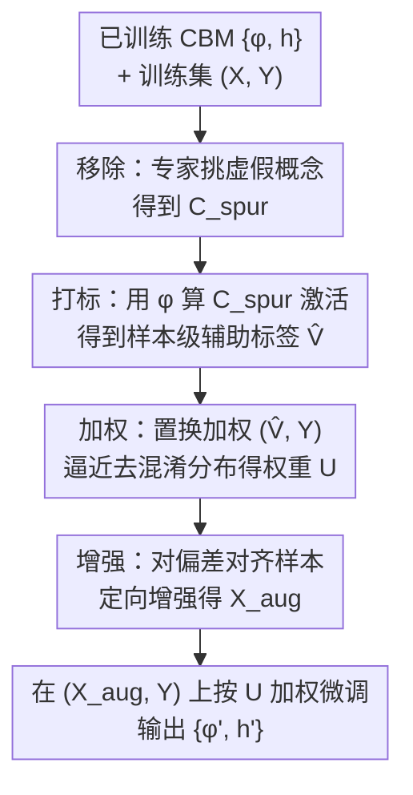

# Debugging Concept Bottleneck Models through Removal and Retraining

**会议**: ICLR2026  
**OpenReview**: [https://openreview.net/forum?id=zZNYUkBS77](https://openreview.net/forum?id=zZNYUkBS77)  
**代码**: https://github.com/ericenouen/cbdebug  
**领域**: interpretability and explainable AI  
**关键词**: 概念瓶颈模型, 可解释性调试, 虚假相关, 偏差缓解, 人在回路  

## 一句话总结
针对概念瓶颈模型（CBM）学到虚假概念、与专家推理系统性不一致的问题，本文提出"移除 + 重训练"两步调试框架，并设计 CBDebug——把专家在概念层面的反馈转成样本级辅助标签，再用置换加权和定向增强消除模型对虚假概念的依赖，在 Waterbirds、MetaShift 等带已知虚假相关的基准上把最差组准确率最高提升 26%。

## 研究背景与动机

**领域现状**：概念瓶颈模型（CBM）是当前可解释视觉分类的主流架构之一。它把预测拆成两段——概念提取器 $\phi$ 先把输入映射成一组人类可理解的概念激活分数，推理层 $h$（通常是稀疏线性层）再把这些激活映射成最终标签。这种中间表示让领域专家能检查模型的推理过程，甚至在测试时直接修正被错判的概念（test-time intervention），把专家从被动审计者变成主动决策参与者。

**现有痛点**：测试时干预只能改单个样本的表层错误，无法解决 CBM 与专家推理之间的**系统性失配**。当模型从有偏数据里学到了捷径（比如把"海滩背景"当成判断水鸟的依据），同样的推理缺陷会在新样本上反复出现。无监督 CBM 虽然不需要昂贵的逐样本概念标注、还能自动发现概念，但这种灵活性反而更容易让学到的概念集偏离专家理解，学出整段虚假概念。

**核心矛盾**：专家想要的是"全局地"编辑模型对某些概念的依赖（right for the right reasons），但现有手段要么只能局部纠正（测试时干预），要么需要昂贵的逐样本监督（监督式 CBM），要么靠无监督方法自动猜测虚假分组、把控制权从专家手里夺走。可解释调试与偏差缓解这两条线，此前没有被打通。

**本文目标**：让专家用最小的反馈（哪些概念该删）就能全局地、可靠地把模型的推理对齐到专家知识，同时保住任务性能。

**切入角度**：作者把"专家标记某概念为虚假"看作一次**因果干预**——把被标记的概念当作观测到的混淆变量，去逼近"这些混淆变量对标签没有影响"的反事实分布。CBM 的可解释性恰好提供了一座桥：概念激活分数本身就能当作样本级的辅助标签，从而把成熟的监督式偏差缓解方法接进来。

**核心 idea**：用"移除 + 重训练"两步走，并用 CBDebug 把概念级反馈翻译成样本级辅助标签，再做置换加权 + 定向增强，逼近去混淆的反事实分布。

## 方法详解

### 整体框架

整个框架要解决的是：给定一个已训练好的无监督 CBM $\{\phi, h\}$ 和带已知虚假相关的训练集，怎么让专家用很轻的反馈就把模型对虚假概念的依赖删干净，同时不掉点。它分成两步——**移除（Removal）**和**重训练（Retraining）**。移除步里，专家查看每个概念的解释（ProtoPNet 是代表性图像 patch，VLM-CBM 是文本描述），挑出虚假概念子集 $C_{spur}$ 并从概念集里删掉。但只删不够：剩余概念可能仍编码了被删概念的信息，任务相关概念也可能此前被忽略。于是进入重训练步，由 CBDebug 执行，把 $C_{spur}$ 这条反馈用足。

CBDebug 内部是一条三阶段流水线：**Label（打标）→ Reweight（加权）→ Augment（增强）**，最后在增强且加权后的数据上微调 $\{\phi, h\}$，返回去偏后的 $\{\phi', h'\}$。

### 关键设计

**1. 移除步：用最小二元反馈让专家圈出虚假概念**

这一步针对的痛点是"专家时间和领域标注精力有限"。框架不假设概念有任何特定结构，只要每个概念配有一段解释即可，因此能跨多种概念发现方法通用。反馈机制刻意做得极简——在**任务层面**对每个概念做二元判断：保留，还是标记移除。专家检查学到的概念集 $C = \{c_1, \dots, c_m\}$，圈出虚假子集 $C_{spur} \subset C$（比如鸟类分类里的背景概念），然后把所有 $C_{spur}$ 里的概念从概念集删掉，把编辑后的 CBM 和 $C_{spur}$ 一起交给重训练步。这种"只标 task-level 虚假性"的设计换来了广泛适用和易集成，代价是不直接处理类别特定（class-specific）的虚假概念。

**2. 打标（Label）：把概念级反馈翻译成样本级辅助标签**

这是整个方法的桥梁，也是把偏差缓解接进 CBM 的关键。监督式偏差缓解方法都需要样本级辅助标签，而 CBM 的可解释性恰好能"凭空"造出这种标签——直接用训练好的概念提取器 $\phi$ 在全训练集上算被标记概念的激活分数。形式化地，打标步输入 $\phi$、训练样本 $X$、虚假概念集 $C_{spur}$，输出一个 $N \times |C_{spur}|$ 的矩阵：

$$\hat{V} = \big[\, \phi_{C_{spur}}(x_i)\,\big]_{i=1}^{N}$$

其中 $\phi_{C_{spur}}(x_i)$ 表示样本 $x_i$ 在 $C_{spur}$ 这些概念上的激活分数子集。这些激活分数 $\hat{V}$ 就近似了真实辅助标签 $V$。这一步的巧妙在于：概念激活是连续、高维的实值向量，天然适合后面那套不依赖离散分组的加权方法。

**3. 加权（Reweight）：用置换加权逼近去混淆分布**

打完标后，要降低 $\hat{V}$ 与标签 $Y$ 之间的相关性，作者采用置换加权（permutation weighting）。直觉上，如果背景与类别虚假相关，加权会给"海滩背景的水鸟"低权重、给"草地背景的水鸟"高权重，逼模型去学能跨背景泛化的特征。具体做法：先把 $\hat{V}$ 与 $Y$ 拼成数据集 $D$，代表存在相关的**混淆分布**；再把 $Y$ 随机置换打乱得到 $D'$，这天然斩断了 $Y$ 与 $\hat{V}$ 的相关，代表**去混淆分布**。然后训一个二元判别器 $\eta$ 去区分样本来自 $D'$ 还是 $D$，每个样本的权重为

$$u_i = \frac{\eta(y_i, v_i)}{1 - \eta(y_i, v_i)}$$

即"属于去混淆分布的几率比"。作者用 K 折交叉验证、对多次置换取平均来稳住权重。相比 GroupDRO 这类需要离散分组、低支撑分组易崩、还得对 $\hat{V}$ 额外聚类的方法，置换加权天然吃多维连续辅助标签，直接强制 $\hat{V}$ 与 $Y$ 独立，更通用也更稳。

**4. 增强（Augment）：对偏差对齐样本做定向增强**

加权虽有效，但当虚假分组高度不平衡时会把极大权重压到少数样本上，导致训练不稳。增强通过给欠表示分组造新样本来更稳健地去偏。关键是要**只增强那些与待删偏差对齐的样本**：把样本权重 $u_i$ 转成增强概率 $p_{aug}(x_i)$——先用最大权重减去每个 $u_i$ 做反转（低权重样本反转后值大），归一化到 $[0,1]$，再升到 $\gamma$ 次幂以拉大对比、降低误增有用样本的概率。增强方式按概念表示分两种：ProtoPNet 随机选 $k$ 个虚假概念、对每个用 CutMix（patch 从该概念 top-10 高激活原型 patch 里随机取）；VLM-CBM 则借文生图概念库、随机选一个虚假概念做 Mixup。注意：因为这些概念是被专家显式标为虚假的，增强时**不改标签 $Y$**——这正是把它当因果干预、逼近反事实分布的体现。

### 损失函数 / 训练策略
最后在增强数据集 $(X_{aug}, Y)$ 上、按样本权重 $U$ 加权微调 $\{\phi, h\}$，返回精炼后的 $\{\phi', h'\}$。实操上：PIP-Net 用原训练 epoch 的一半微调整个模型；Post-hoc CBM 则冻住骨干、只重训线性层。

## 实验关键数据

### 主实验（真实用户反馈）
六位真实用户对四个"数据集 × 模型"组合各自完成移除步，端到端跑调试。Original 在三个种子上报均值方差，移除及各重训练方法在六次调试会话上报。

| 数据集 / 模型 | 指标 | Original | Remove | Retrain | **CBDebug** |
|---|---|---|---|---|---|
| Waterbirds / PIP-Net | 最差组 | 71.9 | 74.4 | 72.5 | **79.4** |
| MetaShift / PIP-Net | 最差组 | 52.4 | 55.0 | 53.3 | **57.3** |
| Waterbirds / Post-hoc CBM | 最差组 | 25.8 | 13.9 | 33.2 | **73.6** |
| MetaShift / Post-hoc CBM | 最差组 | 84.5 | 73.9 | 84.4 | **89.3** |

CBDebug 把最差组准确率在 PIP-Net 上提升 7.5%（Waterbirds）/ 4.9%（MetaShift），在 Post-hoc CBM 上提升 26.1%（Waterbirds）/ 4.8%（MetaShift），并超过此前 SOTA 的可解释调试器 ProtoPDebug。

### 自动化反馈（LLM 充当专家，Post-hoc CBM）

| 数据集 | 指标 | Original | Remove | Retrain | **CBDebug** |
|---|---|---|---|---|---|
| Waterbirds | 最差组 | 25.8 | 2.5 | 38.0 | 58.3 |
| MetaShift | 最差组 | 84.5 | 79.6 | 83.0 | **87.5** |
| CelebA | 最差组 | 8.7 | 6.5 | 22.2 | **51.3** |
| ISIC | AUROC | 39.3 | 41.7 | 37.7 | **58.0** |

用温度设 0 的 LLM 对每个文本概念做二元虚假性判断，即可替代人工。CBDebug 在所有基准上都稳定超过原模型，CelebA 上最高提升 42.6%。

### 消融与关键发现
- **两个组件缺一不可**：Reweight Only 在 Waterbirds/CelebA 的最差组上甚至更高，但跨数据集不稳（MetaShift 上掉队）；Augment Only 单独用提升有限。CBDebug 把两者合起来才换来跨设定的稳定增益。
- **Remove 对 Post-hoc CBM 是负作用**：Post-hoc CBM 概念集小（约 10–30 个），删掉偏差对齐概念后没有别的任务相关概念顶上，最差组反而崩（Waterbirds 25.8→13.9）；PIP-Net 概念多（约 100–200），对移除更鲁棒。
- **朴素重训练会让虚假相关"漏回来"**：Retrain 在 PIP-Net 上还不如只 Remove；Table 3 显示普通重训练会学出新的背景概念（beach→sea/harbor/lake）来顶替被删的，而 CBDebug 真正把背景概念换成了 duck-like body、orange wings 等鸟类特征。

## 亮点与洞察
- **把可解释性当"标注生成器"**：最巧妙的一步是用 CBM 自己的概念激活分数当样本级辅助标签，凭空打通了"概念级人类反馈"与"需要样本级标签的监督式偏差缓解"之间的鸿沟——可解释性第一次不只是用来看，而是直接驱动去偏。
- **专家反馈 = 因果干预**：把"标记虚假概念"形式化成对观测混淆变量的干预、去逼近反事实分布，给了人在回路调试一个干净的理论框架，也解释了为什么"不改标签的定向增强"是对的。
- **置换加权吃连续激活**：选 permutation weighting 而非 GroupDRO，正是因为概念激活是高维连续值，避免了额外聚类、规避了低支撑分组崩溃，这个匹配很关键。
- **可迁移**：这套"概念激活→辅助标签→偏差缓解"的桥，原则上能套到任何 interpretable-by-design 的概念模型上（作者也提到可扩到 CAM 等 post-hoc XAI），是个通用的调试范式。

## 局限与展望
- 作者承认 Post-hoc CBM 作骨干时**方差很大**，结果对初始化和训练随机性高度敏感，效应量要结合这点谨慎解读（表里多处标准差极大，如 Remove 在 Waterbirds 上 ±20.7）。
- 效果**依赖反馈质量**：不准确或对抗性的概念反馈会侵蚀收益。
- 框架假设**任务级**虚假性，不直接处理类别特定的虚假相关，限制了"虚假性随类别变化"场景的适用性。
- 自己补一点：Reweight Only 在若干设定下单独就很强，说明增强的边际贡献和稳定性收益还需更系统的刻画；$\gamma$、折数、置换次数等超参敏感性都放在附录，正文较难判断鲁棒性边界。

## 相关工作与启发
- **vs ProtoPDebug（Bontempelli et al., 2023）**：ProtoPDebug 把虚假概念 patch 收进 forget set、对编码器加遗忘损失，且偏重 ProtoPNet。本文是更通用的 CBM 调试框架，把"移除 + 重训练"和偏差缓解打通，跨架构（PIP-Net + Post-hoc CBM）增益更稳，并超过 ProtoPDebug。
- **vs 无监督组鲁棒方法（如 GroupDRO、JTT、DISC）**：那些方法靠对"虚假相关如何被学到"的假设自动估计分组，专家无控制权。本文只删专家显式标记的概念，给专家细粒度控制（甚至可保留某些"虚假"概念或删"核心"概念做诊断），是互补且更可控的路线。
- **vs 监督式 CBM**：监督式 CBM 靠共享概念词表强行对齐，但需昂贵逐样本标注、还易受概念泄漏掩盖全局失配。本文聚焦无监督 CBM，把捷径暴露出来让专家删，而非藏在其他概念里。

## 评分
- 新颖性: ⭐⭐⭐⭐⭐ 用概念激活当辅助标签打通可解释调试与偏差缓解，是真正新的连接点
- 实验充分度: ⭐⭐⭐⭐ 覆盖两类 CBM、四个数据集、真实+自动两种反馈、含消融与定性分析，但方差偏大
- 写作质量: ⭐⭐⭐⭐⭐ 框架清晰、三阶段流水线和因果视角讲得透
- 价值: ⭐⭐⭐⭐ 给高风险领域的 interpretable-by-design 模型提供了可落地的全局调试范式

<!-- RELATED:START -->

## 相关论文

- [\[ICLR 2026\] There Was Never a Bottleneck in Concept Bottleneck Models](there_was_never_a_bottleneck_in_concept_bottleneck_models.md)
- [\[AAAI 2026\] Partially Shared Concept Bottleneck Models](../../AAAI2026/interpretability/partially_shared_concept_bottleneck_models.md)
- [\[CVPR 2026\] Rethinking Concept Bottleneck Models: From Pitfalls to Solutions](../../CVPR2026/interpretability/rethinking_concept_bottleneck_models_from_pitfalls_to_solutions.md)
- [\[ICLR 2026\] Concept-TRAK: Understanding how diffusion models learn concepts through concept attribution](concept-trak_understanding_how_diffusion_models_learn_concepts_through_concept_a.md)
- [\[AAAI 2026\] Flexible Concept Bottleneck Model](../../AAAI2026/interpretability/flexible_concept_bottleneck_model.md)

<!-- RELATED:END -->
