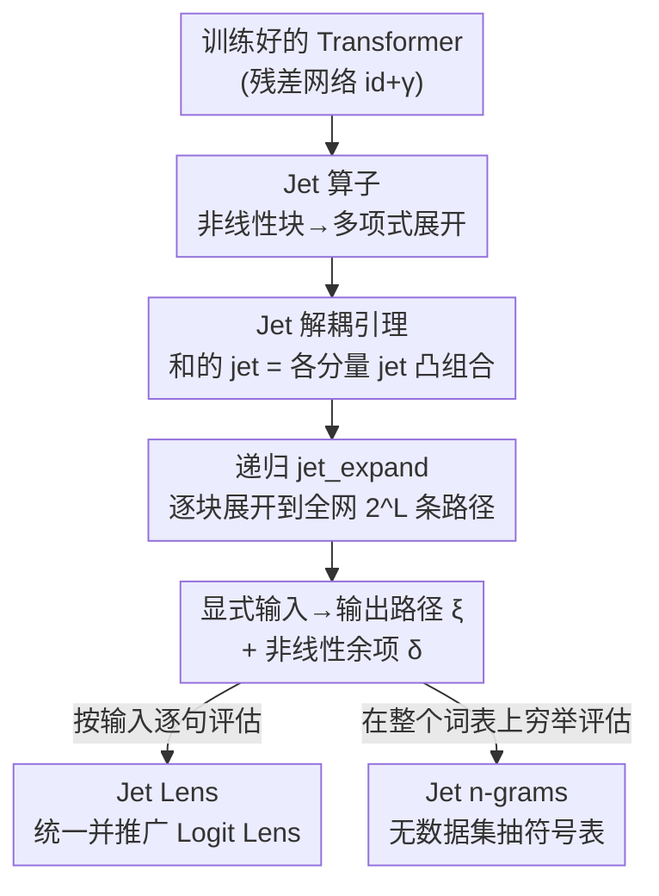

# Decomposing LLM Computation with Jets

**会议**: ICLR 2026  
**OpenReview**: [https://openreview.net/forum?id=u6JLh0BO5h](https://openreview.net/forum?id=u6JLh0BO5h)  
**代码**: 有（论文正文称 "Code is available"，未给具体仓库地址，⚠️ 以原文为准）  
**领域**: 可解释性 / 机制可解释性  
**关键词**: Jet 展开, 残差网络, 函数分解, Logit Lens, 机制可解释性

## 一句话总结
本文提出 **JET EXPANSIONS**——用「jet 算子」（截断泰勒展开的泛函版）把 Transformer 的递归残差计算无训练、无数据地改写成一组显式的「输入→输出路径」加一个非线性余项，从而把纠缠的 LLM 计算「像刀一样」切开做模块化检查，并证明它能统一并推广 Logit Lens、无数据集地从模型里抽出 n-gram 表来诊断微调与毒性。

## 研究背景与动机

**领域现状**：当前主流的 LLM 可解释性走的是「先取数据、再解释」（data-then-explanation）的路子：精心挑一批输入，假设某些子计算重要，再观察激活值来反复修正假设。代表方法包括机制可解释性（MI）里的电路发现（circuit discovery）、神经元/特征归因、激活 patching 等。

**现有痛点**：这条路有两个结构性毛病。一是**依赖数据分布**——很多结论换一批 probe 数据就不成立，可复现性差；二是**停在原子组件层面**（单个神经元、单层、单个权重），而真正的信息加工往往跨多个组件协同完成，盯着原子组件看不到全貌。更根本的是，LLM 把知识「摊」在数十亿高度纠缠的参数里，知识布局和计算布局对不上，导致训练完之后既难审计也难更新——在符号系统里轻而易举的「知识操作」，在 LLM 里寸步难行。

**核心矛盾**：作者认为真正的挑战是**结构性的**——LLM 的计算是纠缠的（entangled），你没法把嵌入其中的知识隔离成有意义的单元。数据驱动的方法能给出有价值的洞察，但它是「经验地」（empirically）做，而不是「系统地」（systematically）把计算重组成更小、更少纠缠、端到端的组件。

**本文目标**：找一个不依赖探针数据、不需要重训、能在任意深度上把整网计算「代数地」拆成可分析单元的通用算子。

**切入角度**：作者抓住一个事实——**LLM 本质是一类残差网络**（每个块都是 $\mathrm{id}+\gamma_\ell$ 的形式），残差链会把所有前层的贡献累加纠缠在一起。既然纠缠来自残差里的「和」与非线性的「嵌套」，那就用一个能处理非线性、又能把「和的计算」拆成「分项计算之和」的数学工具去逐块解开它。这个工具就是 **jet（喷流算子）**——泰勒展开在泛函层面的推广。

**核心 idea**：把可解释性**重新定义为「函数分解」**（function decomposition），而不是基于特定数据集的「输入归因」或「电路识别」；具体手段是递归地用 jet 算子展开残差计算，把模型改写成「显式输入→输出多项式路径」+「非线性余项」两部分。

## 方法详解

### 整体框架

输入是一个**训练好的** Transformer 语言模型，它形式上是 $L$ 个残差块夹在编码器 $\mathrm{Enc}$ 和解码器 $\mathrm{Dec}$ 之间：

$$f = \mathrm{Dec}\circ\Big(\bigcirc_{\ell=1}^{L}(\mathrm{id}+\gamma_\ell)\Big)\circ\mathrm{Enc}$$

其中 $\gamma_\ell$ 是第 $\ell$ 块里的非线性变换。展开递归后，第 $\ell$ 层隐状态 $h_\ell = h_0 + \sum_{j=1}^{\ell}\gamma_j\circ h_{j-1}$——可以看到残差流（residual stream）把各层贡献层层嵌套地累加纠缠在一起。

JET EXPANSIONS 要做的，是把这坨纠缠计算**等价改写**成

$$f(x) = \sum_{e\in\xi}e(x,w) + \delta(x,w)$$

即一组**显式的、加性的输入→输出路径** $\{e\}$（称作 jet paths）加一个**非线性余项** $\delta$。整个过程纯代数、不采集任何额外数据、不做任何训练。得到这组路径后，分析者就能「挑出感兴趣的路径单独看、把其余部分当余项搁置」，实现真正的模块化检查；并在此之上实例化出 Jet Lens、Jet n-grams 等具体应用。

下面这张图给出从「纠缠残差网络」到「显式路径 + 余项」再到下游读出的整条流水线：

### 关键设计

**1. Jet 算子：把非线性残差块改写成可加的多项式路径**

痛点在于：线性残差网络其实「天生好拆」——若每块都是线性 $\gamma_\ell(x)=A_\ell x$，整网可精确写成 $2^L$ 条线性路径之和 $\sum_{S\subseteq[L]} U(\prod_{\ell\in S}A_\ell)E$，每条路径都是一个干净的输入→输出线性映射，贡献可加、可单独分析。但真实模型有 LayerNorm、激活函数等非线性，这个干净分解就崩了。作者引入 **jet 算子**来「补」非线性。对 $f\in C^{k+1}$，$k$ 阶 jet 在基点 $x_0$ 处定义为

$$J_kf(x_0)(x) = f(x_0) + \sum_{j=1}^{k}\tfrac{1}{j!}D^jf(x_0)(x-x_0)^{\otimes j}$$

它就是截断泰勒展开的**泛函抽象**（$k=0$ 退化为常值 $f(x_0)$，$k=1$ 是线性化）。它的价值不在于「逼近」，而在于把一个非线性块**局部地改写成一个多项式**，从而让后续的「拆和」操作能在多项式层面进行。作者特意强调：jets 在这里是**重组计算的算子**，不是单纯的近似工具——余项 $\delta$ 一般不会随 $k$ 增大而消失（因为基点是用户指定的），所以应把 jet 展开看成「计算图的代数改写」，目的是帮助解释，而非最小化逼近误差。

**2. Jet 解耦引理：把「和的计算」拆成「各分量计算的凸组合」**

残差流的纠缠根源是 $h_\ell$ 里全是「和」（$x_0+x_1+\dots$），而非线性作用在和上无法直接拆开。Lemma 1（解耦引理）正是钥匙：对 $\bar x=\sum_{i=1}^N x_i$ 和一组权重 $w\in\triangle^{N-1}$（即 $w_i\ge0,\sum_i w_i=1$），有

$$J_kf\Big(\sum_{i=1}^N x_i\Big) = \sum_{i=1}^N w_i\,J_kf(x_i) + O(r^{k+1})$$

也就是说「在一个和上取 jet」可以写成「在各个分量上分别取 jet 再做凸组合」，误差是高阶小量 $r=\max_i w_i\|x_i-\bar x\|$。这一步把缠在一起的残差项**切成几条彼此独立、可单独分析的子流**。一个漂亮的例子是 ReLU：作者证明，对几乎处处的 $x=x_1+x_2$，总存在凸权重 $w$ 使一阶 jet 凸组合**精确**还原 $\gamma(x_1+x_2)$，把权重 $w_i(x_1,x_2)$ 看成可优化的函数而非常数即可。由此还得到 Lemma 2：**仅含 ReLU 非线性的残差网络存在精确的一阶 jet 展开**。

**3. 递归 jet_expand 算法：把全网展开成显式路径 + 余项**

有了 jet 算子（设计 1）和解耦引理（设计 2），还需要一个能在**任意深度**自动跑的算法，否则手工展开两块以上就不可行了。`jet_expand(f, ℓ, C, k)`（算法 1）是核心操作：在第 $\ell$ 块，对一组 jet 基点 $C=\{x_i\}$ 应用解耦引理，输出 (i) 多项式项集合 $\xi=\{w_iJ_k\gamma_\ell(x_i)\}\cup\{w_iJ_k\mathrm{id}(x_i)\}$（残差块和残差直连各展一份），(ii) 非线性余项 $\delta=h_\ell-\sum_{e\in\xi}e$。**关键之处**在于：这一轮展开出来的项可以当作下一轮的基点，于是 `jet_expand` 能**递归地**沿网络一路展开，把计算图彻底拉直成端到端的输入→输出路径。当在最后的解码层（$\ell=L+1$）应用它，就得到整模型的函数改写 $f=\sum_e e+\delta$。算法 2（`exp_jet_expand`）则把这套递归推到任意深度，产出 $2^L$ 条均匀权重的显式路径，呼应了 Veit 等人「残差网络等价于指数多条路径的集成」的观点，但这里是**显式且有原理**地做出来的，而非示意。余项可高效求解：当解码器线性时，优化 $w$ 去最小化 logit 空间里的余项，等价于在 $U^\top U$ 度量下最小化展开与残差流的距离；高阶 jet 可借 JVP（Jacobian-vector product）等自动微分原语递推算出，代价 $O(|C|(F+kB))$。

**4. 下游实例化：Jet Lens 统一 Logit Lens，Jet n-grams 无数据集抽符号表**

这套框架的说服力体现在它能**统一并推广已有工具**，而不是另起炉灶。其一，**Logit Lens**（把解码器直接套到中间隐状态 $\mathrm{Dec}(h_\ell)$）被证明恰好是「解码器在基点 $h_\ell$ 处的零阶 jet」，即 `jet_expand(f, L+1, {hℓ}, 0)`——jet 算子像把刀，在第 $\ell$ 层切开网络、用截断 jet 替换被切掉的部分。由此自然得到两个推广：**迭代 jet lens**把阶数提到 $k\ge1$，能追踪早层对最终 logit 的间接影响（实验显示 $k>0$ 对 GPT-Neo 比 $k=0$ 的 logit lens 更可信）；**联合 jet lens**用更广的基点集 $\{\gamma_\ell\circ h_{\ell-1}\}$，突出每个块各自的贡献而非残差流的累积。其二，**Jet n-grams**：既然模型被改写成多项式路径之和，就可以挑出短路径（如 bi/tri-gram 对应的路径），在整个词表 $V^{n-1}$ 上**穷举评估**，记录每个 n-gram 的得分 $s(x)[i]=\sum_{e\in\xi}e(x)[i]/|\xi|$，从而**直接从权重里、不靠任何语料**抽出一张完整的 n-gram 概率表。这等于在 LLM 纠缠的计算里恢复出了符号模型那种「知识布局=计算布局」的可寻址模块性，可用于全局、无数据集的行为刻画（如 top-K bi-gram、按语义类别聚合的 bi-gram 质量）。

### 一个完整示例：切开两块残差网络

为把递归展开讲具象，作者用最简单的非平凡情形——两块残差网络——走了一遍。其完整计算是 $f=\mathrm{Dec}\circ(\underbrace{\mathrm{Enc}}_{x_0}+\underbrace{\gamma_1\circ\mathrm{Enc}}_{x_1}+\underbrace{\gamma_2\circ(\mathrm{Enc}+\gamma_1\circ\mathrm{Enc})}_{x_2})$。嵌套的括号正是纠缠：外层把所有东西混在一起，内层把 $\gamma_2$ 同时绑到 $x_0$ 和 $x_1$。

- **Step 1（内层展开）**：在 $\gamma_2$ 处取 $\{x_0,x_1\}$ 为基点，用解耦引理把残差流 $x_2=\gamma_2(x_0+x_1)$ 拆成 $x_{20}=w_0J_k\gamma_2(x_0)$ 和 $x_{21}=w_1J_k\gamma_2(x_1)$ 两条子流。
- **Step 2（外层展开）**：在 $\mathrm{Dec}$ 处把基点更新为 $\{x_0,x_1,x_{20},x_{21}\}$，再用解耦引理 + jet 代数，得到 4 条彼此独立的路径 $f_\varnothing, f_{\{1\}}, f_{\{2\}}, f_{\{1,2\}}$。

每条路径恰好对应你手工会挑出来的那种「网络中的一条路」，但这里是从 jet 展开**系统地**自动涌现的。两步演示出全套方法的两条原则：**对嵌套项递归展开** + **用解耦性质隔离纠缠贡献**。深网里手工展开不可行，于是才有了算法 1/2 把它推到任意深度。

## 实验关键数据

本文是「框架 + 案例研究」型论文，没有传统的「刷 SOTA」表，而是用多个 LLM（GPT-2/large、GPT-Neo-2.7B、Llama-2-7B、CodeLlama、OLMo-7B）验证三件事：展开是否忠实、能否揭示内部机制、能否诊断微调/毒性。

### 保真度：展开 logit 与真实 logit 的相似度

| 设置 | 模型 | 关键发现 |
|------|------|----------|
| 联合/迭代 jet lens（100 句平均） | GPT-2 / GPT-2-large / GPT-Neo-2.7B | 各阶 $k$ 下展开 logit 与原模型 logit 的余弦相似度都很高、接近 1（图 4 单例达 0.993，top-1 token 完全一致） |
| 迭代 jet lens，$k{=}1$ vs $k{=}0$ | GPT-Neo-2.7B | $k{=}1$（虚线）比 $k{=}0$（即 Logit Lens，实线）与模型输出相关性更高，解释更忠实 |

说明 jet 展开与模型实际输出高度相关，且**高阶 jet 能修好 Logit Lens 在 GPT-Neo 系列上「naive 实现会失效」的已知问题**。

### Jet n-grams 应用：组件功能 & 毒性诊断

| 应用 | 结果 | 含义 |
|------|------|------|
| 组件语言学功能（表 2） | OLMo-7B 第 3 个 MLP 路径专门加 "-ing" 后缀；移除它 $\Delta\text{Logit}=-0.58\sim-9.73$（不同 MLP） | 用 jet bi-gram 能给单个 MLP/注意力头「定功能」，且印证「多组件协同完成一个功能」（如 Llama-2-7B 的 MLP 6+18 一起加 "-ing"） |
| 代码微调诊断（表 3） | diff Llama-2-7B 与 CodeLlama 的 jet bi-gram，凸显 `**kwargs`、`Assertion` 等代码专有模式 | jet bi-gram 可作为「微调是否真把目标领域知识灌进去」的验证工具 |
| RLHF 去毒性（表 4） | ToxiGen：Llama-2-7B **21.25 → chat 版 0.0**（看似彻底去毒）；但 jet bi-gram 毒性质量 **0.102 → 0.093 几乎不变** | **RLHF 只是「遮住」而非「抹掉」毒性知识**——RealToxicityPrompts 困难提示仍能触发（Hard 档 88% → 84%，下降很小） |

### 关键发现
- **最有冲击力的结论是毒性那条**：基准分（ToxiGen）显示 chat 版已完全无毒，但无数据集的 jet bi-gram 指标揭示毒性关联仍潜伏在权重里、可被对抗提示重新激活——说明对齐做的是「掩盖」而非「删除」，而这一点用传统数据驱动基准看不出来。
- **理论自洽性**：线性残差网络下余项 $\delta=0$（任意 $k\ge1$），算法精确还原 $2^L$ 路径分解；ReLU 网络有精确一阶展开（Lemma 2）。这给了框架坚实的数学地基。
- **余项行为**：$\delta$ 不随 $k$ 单调减小（基点用户定），但实验中通常很小、展开与原 logit 余弦相似度趋近 1，说明实际可用。

## 亮点与洞察
- **把可解释性重定义为「函数分解」**：跳出「挑数据→看激活」的归因范式，改成纯代数地在函数空间里重组计算。这是视角层面的创新，最让人「啊哈」——它把一堆零散的经验工具（Logit Lens、路径展开、n-gram 探针）统一在 jet 算子这一个数学对象之下。
- **「刀」这个比喻名副其实**：jet 算子在第 $\ell$ 层切开网络、用截断展开替换被切部分，分析者可以「只拿感兴趣的路径、把其余当余项搁置」，这种可选择性的模块化检查正是纠缠 LLM 一直缺的。
- **无数据集、无重训、纯权重**：jet n-grams 直接从权重里抽符号表，避开了 probe 数据分布依赖这个老大难；「diff 两个模型的 bi-gram 表」是一个非常可迁移的 trick——任何「想知道微调/对齐到底改了什么」的场景都能用，且不需要构造评测集。
- **可迁移思路**：用「凸组合 + 高阶导数余项」拆「和的非线性」，这套解耦引理本身可迁移到任何残差/累加结构的网络分析（不限语言模型）。

## 局限与展望
- **不是严格的函数逼近**：jet 展开是「改写成多项式项 + 余项」，不是泰勒意义下的逼近；余项大小依赖阶数 $k$ 和权重选择（超参），且展开**不唯一**（高阶含低阶）。读者需注意它是「代数改写工具」而非「精确还原」。
- **路径数指数爆炸**：完整展开有 $2^L$ 条路径，系统评估大量（尤其高阶）路径代价高，大输入空间需要启发式或子采样。图操作本身轻量，但穷举评估不轻量。
- **n-gram 只做到 bi/tri**：受 $V^{n-1}$ 穷举可行性限制，只验证了 2-3 gram，更长上下文留作未来工作——这限制了「符号化刻画」能覆盖的语言现象范围。
- **评测偏案例研究**：实验是若干 case study 而非大规模定量基准，结论（如组件功能定位）有定性成分；不同模型族表现差异明显（GPT-Neo 才特别需要 $k>0$），泛化边界尚不清楚。
- **展望**：作者设想超越多项式基、走「傅里叶变换式」分解，做可控 LLM（如把毒性「频率」滤掉）——这是个有想象力但还很早期的方向。

## 相关工作与启发
- **vs 机制可解释性 / 电路发现（Conmy 2023, Ferrando & Voita 2024）**：他们识别、聚类、标注神经元/层/电路并归因，但分析停在原子组件、且结论常依赖所选数据分布；本文直接操作**函数**而非激活，不需要 probe 数据或采样，能隔离任意大小的计算块。
- **vs 路径改写（Veit 2016, Elhage 2021）**：Veit 把残差网络句法地展成指数多条路径研究梯度，Elhage 把 1-2 层 Transformer 拆成 uni/bi-gram 路径——但这些工作常**忽略或简化非线性**（略去 LayerNorm、线性化组件、隐含假设非线性不破坏路径独立性）；本文用 jet 算子**显式处理非线性**，把这些路径刻画抽象并推广为带余项的精确改写。
- **vs Logit Lens（nostalgebraist 2021）**：被本文证明只是「零阶 jet」的特例，于是自然推广出迭代/联合 jet lens；且高阶版修好了 Logit Lens 在 GPT-Neo 上失效的已知问题。
- **vs n-gram × LLM（Svete & Cotterell 2024, Nguyen 2024）**：以往靠 probe 数据集衡量 LLM 与 n-gram 规则的一致性；本文提供一座「无语料直连」的桥，直接从权重抽 n-gram 表，在纠缠计算里恢复符号模块性。

## 评分
- 新颖性: ⭐⭐⭐⭐⭐ 把可解释性重定义为函数分解、用 jet 算子统一一众经验工具，是视角级别的原创贡献
- 实验充分度: ⭐⭐⭐ 多模型多案例验证了忠实性与若干洞察，但偏 case study、缺大规模定量基准，泛化边界不清
- 写作质量: ⭐⭐⭐⭐ 理论严谨（引理/证明/算法齐全）、比喻贴切（「刀」），但数学密度高、对非理论读者门槛偏陡
- 价值: ⭐⭐⭐⭐⭐ 提供无数据集、无重训的通用诊断算子，毒性「掩盖而非删除」的发现对对齐研究有直接警示意义

<!-- RELATED:START -->

## 相关论文

- [\[ICLR 2026\] Decomposing Representation Space into Interpretable Subspaces with Unsupervised Learning](decomposing_representation_space_into_interpretable_subspaces_with_unsupervised_.md)
- [\[ICLR 2026\] Multiple Token Divergence: Measuring and Steering In-Context Computation Density](multiple_token_divergence_measuring_and_steering_in-context_computation_density.md)
- [\[ICLR 2026\] Token Alignment Heads: Unveiling Attention's Role in LLM Multilingual Translation](token_alignment_heads_unveiling_attentions_role_in_llm_multilingual_translation.md)
- [\[ICLR 2026\] Learning is Forgetting: LLM Training As Lossy Compression](learning_is_forgetting_llm_training_as_lossy_compression.md)
- [\[ICLR 2026\] Thought Branches: Interpreting LLM Reasoning Requires Resampling](thought_branches_interpreting_llm_reasoning_requires_resampling.md)

<!-- RELATED:END -->
