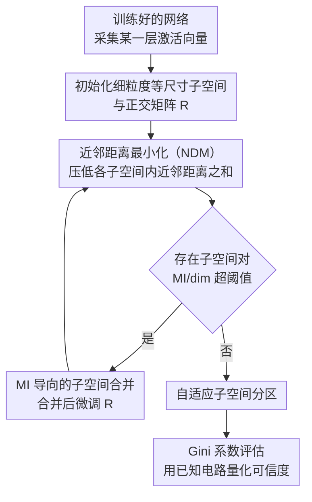

# Decomposing Representation Space into Interpretable Subspaces with Unsupervised Learning

**会议**: ICLR 2026  
**arXiv**: [2508.01916](https://arxiv.org/abs/2508.01916)  
**代码**: [GitHub](https://github.com/huangxt39/SubspacePartition)  
**领域**: 可解释 AI / 机械可解释性 / 表征学习  
**关键词**: 子空间分解, 表征解释, 近邻距离最小化, 无监督分解, 知识定位, 机制可解释性

## 一句话总结
提出 NDM（Neighbor Distance Minimization），通过最小化子空间内的近邻距离来无监督地发现神经网络表征空间中的可解释非基对齐子空间，在 GPT-2 上平均 Gini=0.71（信息高度集中），在 Qwen2.5-1.5B 上发现了参数化知识与上下文知识路由的分离子空间。

## 研究背景与动机
**领域现状**：机械可解释性研究试图理解神经网络内部机制。基本分析单元包括：组件级（注意力头/MLP）、稀疏特征级（SAE）、子空间级（DAS）。每种都有局限：组件间传递的信息难理解，SAE 给出输入相关的电路，DAS 需要人工指定因果模型。

**现有痛点**：
   - **SAE 的单维度视角**：假设概念对齐到单个基向量（1D 特征），但"知识类型""语法角色"等概念可能分布在多维子空间中（Multi-Dimensional Superposition Hypothesis）
   - **DAS 需要监督**：需要人工设计的抽象因果模型来搜索子空间，本质上是验证假设而非发现结构
   - 没有无监督方法可以自动发现表征空间的"自然"分区

**核心矛盾**：如果互斥特征组（feature groups）被压缩到了正交子空间中（组内叠加/组间正交），如何在不知道真实特征的情况下找到这些子空间？

**核心 idea**：互斥特征组在子空间内的投影是"稀疏"的（数据点集中在几条线上）→ 近邻距离小。错误分区会将不同组的特征混在一起 → 数据点覆盖整个子空间 → 近邻距离大。因此，最小化子空间内近邻距离 = 找到正确分区

## 方法详解

### 整体框架
NDM 想做的事是：给定一个训练好的网络，在不依赖任何标签或人工指定因果模型的前提下，把它某一层的表征空间自动切成若干个"各管一类概念"的可解释子空间。流程上它先收集大量激活向量 $\{\mathbf{h}_n\}_{n=1}^N$，再学习一个正交矩阵 $\mathbf{R}$ 把整个空间旋转一下，按维度配置 $c = [d_1, \ldots, d_S]$ 把旋转后的坐标轴切成 $S$ 块子空间，优化目标是让每个子空间内部所有点的近邻距离之和最小。旋转学好之后，再用互信息把彼此依赖太强的子空间合并掉，得到子空间数目和维度都自适应确定的最终分区。整个方法的可信度则靠基于已知电路的 Gini 评估来量化。

### 关键设计

**1. 近邻距离最小化（NDM）：用"投影是否稀疏"来无监督判定分区是否正确**

这一步要解决的核心矛盾是——既然没有真实特征标签，凭什么知道当前这刀切得对不对。NDM 的关键观察是：如果一组互斥特征被正确地压进了同一个子空间，那么任意一个数据点在这个子空间里的投影只会落在少数几条线上（因为互斥意味着同一时刻只有一个特征激活），点与点之间会扎堆，近邻距离很小；反过来，如果分区错了、把不属于同一组的特征混进来，投影就会散布到整个子空间，近邻距离变大。于是判断分区好坏被转化成一个可优化的标量。形式化地，方法学习正交变换 $\mathbf{R}$（记 $\hat{\mathbf{h}}_n = \mathbf{R}\mathbf{h}_n$，$\hat{\mathbf{h}}_n^{(s)}$ 是它在第 $s$ 个子空间的投影）去最小化所有子空间内的平均近邻距离：

$$\min_{\mathbf{R}} \frac{1}{N} \sum_{s=1}^S \sum_{n=1}^N \text{dist}(\hat{\mathbf{h}}_n^{(s)}, \hat{\mathbf{h}}_{n^*}^{(s)}), \quad \text{s.t. } \mathbf{R}^\top \mathbf{R} = \mathbf{I}$$

其中 $n^* = \arg\min_{m \neq n} \text{dist}(\hat{\mathbf{h}}_n^{(s)}, \hat{\mathbf{h}}_m^{(s)})$ 是当前子空间里离 $n$ 最近的点。为什么这样有效有一个信息论解释：近邻距离本质上反映了局部熵，而正交变换不改变表征的总熵，所以"压低每个子空间内部的熵"等价于"最小化子空间之间的 total correlation"——也就是在把空间切成尽可能相互独立的几块，这正是我们想要的"自然分区"。

**2. MI 导向的子空间合并：让子空间的数目和维度自适应长出来，而不是手工拍板**

光有 NDM 还不够，因为它需要事先给定切多少块、每块多少维，而这恰恰是未知的。如果一开始就切得太粗，会把本该分开的概念塞在一起；切得太细，一个概念又会被拆碎到多个子空间。这里的做法是从细粒度起步、再自底向上合并：先初始化一批小的等尺寸子空间并训练 $\mathbf{R}$，训练过程中定期计算每一对子空间之间的互信息，一旦某对子空间的 MI/dim 超过阈值——说明它们其实编码的是相互依赖的同一类信息——就把它们合并，合并后继续训练 $\mathbf{R}$ 微调，如此反复直到再没有需要合并的子空间为止。这样最终的配置 $c$ 是从数据里自适应确定的，避免了人工指定维度配置带来的偏差。

**3. Gini 系数评估：用已知电路构造可量化的"是否真找到变量子空间"的检验**

无监督方法最大的风险是无从证伪——切出来的子空间到底是真结构还是数值巧合。这里借助机械可解释性里已经被研究清楚的电路（如 IOI、Greater-than）来做可量化验证：如果 NDM 真的找到了对应某个变量的"变量子空间"，那么针对该变量做干预时，干预效果应当高度集中到某一个子空间、而不是均摊到所有子空间。集中程度用 Gini 系数刻画：

$$G = \frac{\sum |{\Delta_s}_1 - {\Delta_s}_2|}{2S \sum \Delta_s}$$

其中 $\Delta_s$ 是干预在第 $s$ 个子空间引起的效应，$G > 0.6$ 表示信息高度集中在单个子空间。把 NDM 与 Identity（不旋转）、Random（随机旋转）、PCA 三个基线放在同一套已知电路上比 Gini，就能客观判断它是否比"瞎切"更接近真实结构。

### 训练策略
- 正交约束通过 PyTorch 的参数化（parametrization）机制保证，使 $\mathbf{R}$ 在优化全程严格满足 $\mathbf{R}^\top\mathbf{R}=\mathbf{I}$
- 近邻距离用欧几里得距离度量，实测比余弦距离效果更好
- 方法可扩展到 2B 参数规模的模型

## 实验关键数据

### GPT-2 Small 量化评估（5 个已知电路 test）

| 方法 | Test 1 | Test 2 | Test 3 | Test 4 | Test 5 | **平均 Gini** |
|------|--------|--------|--------|--------|--------|-------------|
| Identity | 0.33 | 0.32 | 0.40 | 0.31 | 0.32 | 0.21 |
| Random | 0.36 | 0.36 | 0.32 | 0.33 | 0.39 | 0.21 |
| PCA | 0.43 | 0.46 | 0.50 | 0.38 | 0.35 | — |
| **NDM** | **0.71** | **0.72** | **0.75** | **0.68** | **0.69** | **0.71** |

NDM 的平均 Gini 远超所有基线（>0.6 阈值表示信息高度集中），Identity/Random/PCA 均 <0.5。

### Qwen2.5-1.5B 定性分析

| 发现 | 说明 |
|------|------|
| **参数知识子空间** | 编码模型从训练数据中记忆的知识 |
| **上下文知识子空间** | 编码从当前上下文中推断的知识 |
| 两者分离 | 在不同子空间中，支持"知识冲突"研究 |

### 消融/验证

| 配置 | 效果 | 说明 |
|------|------|------|
| 玩具模型（已知特征组） | 完美恢复子空间 | 验证 NDM 原理 |
| 不同特征组数量 | 均成功分解 | 方法鲁棒 |
| 无 MI 合并 | 碎片化，不可解释 | 合并策略必要 |

### 关键发现
- NDM 的信息集中度（Gini 0.71）远超所有基线——说明表征空间确实有"自然"子空间结构
- GPT-2 的已知电路变量（如 IOI 电路中的 subject position）确实集中在单个子空间中——验证了方法的有效性
- 参数知识 vs 上下文知识的分离子空间是重要的可解释性发现——直接支持"知识冲突"和"幻觉"研究
- 方法可扩展到 2B 模型——实用性足够

## 亮点与洞察
- **从单特征到子空间的范式转换**：SAE 假设概念 = 单维度特征；NDM 允许概念 = 多维子空间。这更符合 Multi-Dimensional Superposition Hypothesis，是分析粒度的自然提升
- **无监督发现 vs 有监督验证**：DAS 需要先假设因果模型再搜索子空间（验证）；NDM 直接从激活数据发现子空间（发现），然后可以做因果验证。发现→验证的流程比验证→发现更有科学发现潜力
- **"子空间电路"的愿景**：如果子空间是可靠的"变量"，可以通过分析权重确定注意力头从哪个子空间读、写到哪个子空间，构建输入无关的电路——这比 SAE 的输入相关电路更通用

## 局限与展望
- 正交约束假设子空间严格正交——实际中子空间可能有小角度的偏差
- 子空间合并的 MI 阈值需要手动设定
- 更大模型（>10B）的可扩展性未验证
- 仅在 Transformer 架构上测试，CNN/MLP 等架构未涉及
- NDM 假设互斥特征组结构——如果特征间有更复杂的依赖关系（如层级结构），当前方法可能不够

## 相关工作与启发
- **vs SAE**：SAE 找单维度稀疏特征，每个特征是一个"方向"；NDM 找多维子空间，每个子空间是一组互斥特征的集合。进步在于捕获了多维概念
- **vs DAS (Geiger 2024)**：都学习正交变换，但 DAS 是有监督的（需要指定因果模型 + 反事实数据）；NDM 是无监督的，直接从激活数据发现
- **vs Engels 2024 (Multi-Dim Superposition)**：NDM 的"特征组"概念与他们的"多维不可约特征"高度一致，可以看作该假说的计算实现

## 评分
- 新颖性: ⭐⭐⭐⭐⭐ 无监督子空间分解的方法新颖，近邻距离 ↔ 互斥特征组的理论联系优雅
- 实验充分度: ⭐⭐⭐⭐ 玩具模型+GPT-2 量化+Qwen2.5 定性，覆盖验证-发现-可扩展性
- 写作质量: ⭐⭐⭐⭐⭐ 从直觉到形式化到实验，逻辑链极其清晰
- 价值: ⭐⭐⭐⭐⭐ 为机械可解释性提供了新的分析粒度和无监督工具，"子空间电路"的愿景有变革潜力

<!-- RELATED:START -->

## 相关论文

- [\[ICLR 2026\] Paradigm Shift of GNN Explainer from Label Space to Prototypical Representation Space](paradigm_shift_of_gnn_explainer_from_label_space_to_prototypical_representation_.md)
- [\[ICLR 2026\] The Geometry of Reasoning: Flowing Logics in Representation Space](the_geometry_of_reasoning_flowing_logics_in_representation_space.md)
- [\[ICLR 2026\] Decomposing LLM Computation with Jets](decomposing_llm_computation_with_jets.md)
- [\[ICLR 2026\] MICLIP: Learning to Interpret Representation in Vision Models](miclip_learning_to_interpret_representation_in_vision_models.md)
- [\[ICLR 2026\] Decoupling Dynamical Richness from Representation Learning: Towards Practical Measurement](decoupling_dynamical_richness_from_representation_learning_towards_practical_mea.md)

<!-- RELATED:END -->
