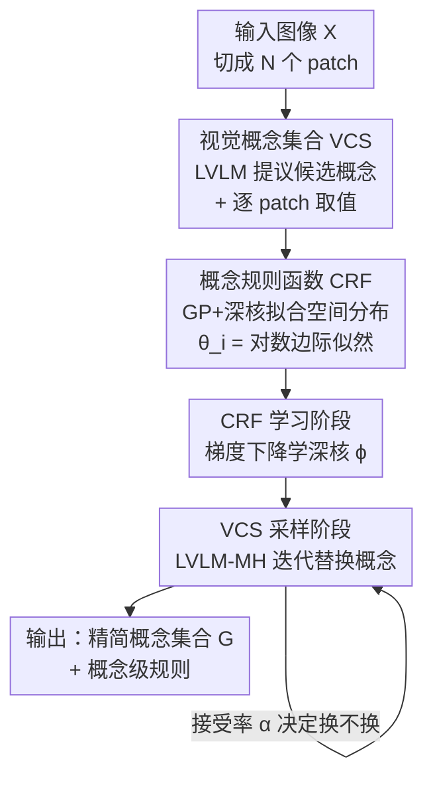

# Decomposition of Concept-Level Rules in Visual Scenes

**会议**: ICLR2026  
**OpenReview**: [https://openreview.net/forum?id=huEYU44Ax4](https://openreview.net/forum?id=huEYU44Ax4)  
**代码**: 待确认  
**领域**: 可解释性 / 多模态VLM / 抽象视觉推理  
**关键词**: 概念-规则分解, 大型视觉语言模型, 高斯过程, Metropolis-Hastings 采样, 可解释推理

## 一句话总结
本文提出 CRD（Concept-Rule Decomposition）框架，用预训练大型视觉语言模型（LVLM）当数据驱动先验，自动从图像里提取一组「概念」（如颜色、物体类别）以及刻画这些概念如何随空间变化的「规则」，再通过一个带 LVLM 提议分布的 Metropolis-Hastings 采样过程，迭代挑出最能解释输入的精简概念集合，从而在元属性抽取、抽象视觉推理（RAVEN/I-RAVEN）和空间推理（SpatialEval）三类任务上既提升了准确率又给出了可解释的概念-规则分解。

## 研究背景与动机
**领域现状**：人类认知是组合式的——看到一个场景，我们会把它拆成若干相互独立的概念（视觉概念，meta-attribute，如 Color、Shape）以及描述这些概念取值如何在空间上变化的规则（如「彩虹的颜色从红到紫排列」）。很多视觉场景天然带这种结构：瑞文矩阵推理题就是「人定义的属性 + 逻辑规则」，物理视频里的实体则按物理定律运动。

**现有痛点**：早期做概念-规则分解的工作（层级贝叶斯推断、笔画分解字符建模、为抽象视觉推理专门设计的解耦模块、隐高斯过程、代数推理后端等）几乎都依赖**手工设计的归纳偏置或人为先验**——比如规则的具体形式、属性的分类体系都要人注入。这类偏置虽然能产出可解释结果，却严重限制了方法对各种视觉场景的适应性，换个场景就要重新设计。

**核心矛盾**：「可解释」和「通用」之间的张力。手工偏置给了可解释性，但牺牲了泛化；而另一端的 LVLM 虽然通用、编码了大量世界知识和细粒度视觉-语言对应，却被训练成做模式识别和 caption，几乎没有学过推断组合规则——经验上 LVLM 在抽象规则归纳任务上反复失败，对概念-关系绑定的组合理解很弱。

**本文目标**：构建一个**不需手工偏置就能自动发现组合结构**的框架，把 LVLM 当作丰富的数据驱动先验来做概念发现和规则归纳，同时保留显式、可解释的概念-规则分解。

**切入角度**：作者观察到 LVLM 能感知场景内容、提出语义上有意义的候选概念、并估计每个图像块（patch）上的概念取值；缺的只是「规则」这一层——把概念取值在空间上的分布建模出来，并据此筛掉那些没有清晰规则的杂乱概念。

**核心 idea**：用 LVLM 提议概念、用高斯过程（GP）刻画每个概念取值的空间规则、再用一个由 LVLM 引导提议的 Metropolis-Hastings 采样器迭代替换概念，最终收敛到一个「既符合规则又被 LVLM 语义认可」的精简概念集合。

## 方法详解

### 整体框架
CRD 要解决的问题是：给定一张图像 $X$，自动找出一小撮真正能解释它的视觉概念 $G$，以及描述这些概念如何在空间上变化的规则。整个方法把这件事拆成「概念集合的概率定义 + 规则函数的概率定义 + 两阶段学习」。

形式上有两个核心对象。其一是**视觉概念集合（VCS）**：把所有可能的候选概念记作 $[M]=\{1,\dots,M\}$（通常覆盖词表大部分词），一个大小为 $K$ 的 VCS 就是其中一个子集 $G\subseteq[M]$，$|G|=K$。每个概念 $i$ 有一个 logit 分数 $\theta_i=\log\frac{p_i}{1-p_i}$，VCS 的分布写成 $p_K(G\mid\theta)=\frac{1}{Z}\prod_{i\in G}e^{\theta_i}$，其中 $Z$ 是对所有大小为 $K$ 的子集求和的归一化常数。$\theta_i$ 越高，概念 $i$ 越可能进入 $G$——关键是这个分数**由规则决定**：若某概念的取值变化遵循清晰规则，它就更可能是解释输入的潜在因子，分数也就更高。其二是**概念规则函数（CRF）**：它把分数 $\theta_i$ 和规则桥接起来，$\theta_i$ 正是概念 $i$ 在 GP 规则先验下的对数边际似然。

整个流程分两阶段串行（见下图）：先在 **CRF 学习阶段**用 LVLM 抽概念、并学一个 GP 函数空间来拟合规则；再在 **VCS 采样阶段**用类 Metropolis-Hastings 的采样器，按学到的函数空间从 $p_K(G\mid\theta)$ 里迭代替换概念，逐步收敛到最优概念集合。

### 关键设计

**1. 视觉概念集合（VCS）：把「选哪些概念」变成一个带规则偏置的概率分布**

痛点是候选概念空间巨大（几乎整个词表），穷举不现实，而且只有极少数概念真正跟当前图像相关。CRD 不去硬选，而是给每个概念 $i$ 一个进入集合的概率 $p_i\in(0,1)$ 及其 logit $\theta_i=\log\frac{p_i}{1-p_i}$，并定义大小为 $K$ 的子集分布

$$p_K(G\mid\theta)=\frac{1}{Z}\prod_{i\in G}e^{\theta_i},\quad Z=\sum_{\substack{S\subseteq[M]\\ |S|=K}}\prod_{j\in S}e^{\theta_j}.$$

这个设计的巧妙之处在于 $\theta_i$ 不是凭空给的：它反映「该概念的取值变化是否被某条规则支撑」。换句话说，分布被天然地**偏向那些呈现清晰规则的概念**，从而实现「结构化」的分解，而不是把一堆杂乱、没规律的概念塞进集合。这一步只给出框架，$\theta_i$ 的具体来源由下面的 CRF 提供。

**2. 概念规则函数（CRF）：用带深核的高斯过程刻画概念的空间规则，并据此算出 $\theta_i$**

这是把「规则」落地的核心。规则在 CRD 里被定义为**概念取值在图像空间上的分布模式**——概念说「是什么属性」（如颜色），规则说「这些取值在空间上如何排列、如何相互作用」。具体做法：把图像 $X$ 按光栅扫描顺序切成 $N$ 个不重叠 patch $\{x_1,\dots,x_N\}$，LVLM 对每个概念 $i$ 抽出每个 patch 上的取值 $v_{i,n}$，记位置向量 $p$、取值向量 $v_i$。CRF 就是映射 $f:p\mapsto v_i$，并假设它服从一个带**深核**的高斯过程：

$$f\sim \mathrm{GP}(0,k_\phi(\cdot,\cdot)),\quad k_\phi(p_i,p_j)=\exp\!\Big(-\tfrac{1}{2}\big\|g_\phi(p_i)-g_\phi(p_j)\big\|_2^2\Big),$$

其中 $g_\phi$ 是把位置映射到高维表示的神经网络。在 GP 先验下，概念取值 $v_i$ 的边际似然是高斯 $p(v_i\mid p,\phi)=\mathcal{N}(v_i;0,K_\phi)$，于是对数边际似然为

$$\mathcal{L}_{\mathrm{LML}}(p,v_i)=-\tfrac{1}{2}v_i^\top K_\phi^{-1}v_i-\tfrac{1}{2}\log\det(K_\phi)-\tfrac{N}{2}\log(2\pi).$$

关键的一步连接：CRD 直接令 $\theta_i=\mathcal{L}_{\mathrm{LML}}(p,v_i)$。这样一来，「概念取值在空间上越符合某种可被 GP 拟合的规律」 ⟺「边际似然越高」⟺「$\theta_i$ 越高」⟺「越可能进入 VCS」，三件事被串成一条链。深核的引入让规则不局限于固定核函数能表达的简单空间模式，而是数据驱动地学出来。

**3. CRF 学习阶段：通过最小化负对数边际似然，把深核学成「会识别规则」的先验**

光有 CRF 的定义还不够，函数空间 $\mathcal{F}$（即深核参数 $\phi$）得训练。给定一批图像，CRD 构造 patch、用 LVLM 抽位置和概念取值，组成训练集 $\mathcal{D}=\{(p_i,v_i)\}_{i=1}^N$，然后**最小化负对数边际似然**（即上面 $\mathcal{L}_{\mathrm{LML}}$ 的相反数），用 Adam 等梯度优化器更新 $\phi$。直觉上，这一步是在让 GP 先验「学会」视觉概念在空间位置上的潜在规律：跨图像反复处理后，深核参数被调到能让真正有规则的概念取值获得高边际似然。它解决的痛点是「规则不能靠手工指定」——这里规则的形式完全由数据通过深核自动学出。

**4. LVLM-MH 采样阶段：用 LVLM 当提议分布的 Metropolis-Hastings，迭代换掉「不够好」的概念**

直接从 $p_K(G\mid\theta)$ 采样在组合规模下不可行，作者设计了一个叫 **LVLM-MH** 的 Metropolis-Hastings 采样器。从当前 VCS $G$ 出发，提议一个新集合 $G'=G\setminus\{i\}\cup\{j\}$，即把概念 $i\in G$ 换成候选 $j\in[M]\setminus G$。转移概率分解为 $Q(G,G')=r(i\mid G)\,q(j\mid i,G)$：

- **选谁被替换** $r(i\mid G)$：CRD 选择**均匀随机**选一个 $i$（$r(i\mid G)=1/|G|$），而不是按 $e^{-\theta_i}$ 优先替换不相关概念。这个看似简单的选择有两层好处——避免对整个集合都去评估 $\theta$（省算力），且保证每个概念都有同等机会被探索。
- **换成谁** $q(j\mid i,G)$：由 **LVLM 实例化**，利用其语义先验，给与图像在语义/视觉上更一致的概念更高概率，从而把采样引向更有意义的候选；为防退化（LVLM 给某些概念几乎为零的概率），对 logits 做截断（clip），保证没有概念概率被压到接近零。

接受概率经化简为

$$\alpha(G,G')=\min\!\Big(1,\ e^{\theta_j-\theta_i}\cdot\frac{q(i\mid j,G')}{q(j\mid i,G)}\Big).$$

这个式子直白地体现了两股力量：$e^{\theta_j-\theta_i}$ 是**规则项**（新概念规则似然比旧的高就倾向接受），后一项是 **LVLM 提议比**（语义上的探索/纠偏）。用接受率 $\alpha$ 采一个 Bernoulli 变量决定换不换，多轮迭代后 VCS 收敛到目标分布 $p_K(G\mid\theta)$。两股力量缺一不可：消融显示去掉 LVLM 提议比性能小幅下降但仍高于 baseline，去掉规则项则严重下降甚至低于 baseline——规则项是主力，LVLM 提议比负责拓宽探索。

### 一个完整示例
以一张自然图像为例（论文 Figure 2 的 case study）：LVLM 先提议一个初始候选元属性池，如 `[house, sky, design, road, clay, grey]`。CRD 进入「提议-评判-更新」循环。第一轮提议把含糊的 `design` 替换成 `plant`（语义更抽象、规则更一致），评判器（CRF 规则 + LVLM 语义）认为合理 → 接受；下一轮提议把实例级的 `house` 抬升到类别级 `building` → 接受；而提议 `sky → blue` 会把概念塌缩成一个具体颜色实例，违背元属性定义 → 拒绝。反复迭代后收敛到一个更精简、可解释、更贴合场景底层组织的元属性集合，如 `[building, sky, plant, road, facilities, shadow]`。这个例子说明 CRD 不是一次性输出，而是逐步把「实例级/含糊/塌缩」的概念替换成「类别级/抽象/有规则」的概念。

### 损失函数 / 训练策略
唯一需要梯度学习的是 CRF 的深核参数 $\phi$，目标是上文的负对数边际似然 $-\mathcal{L}_{\mathrm{LML}}(p,v_i)$，用 Adam 优化。LVLM 全程**冻结、直接用官方推理管线、不做任何微调**；采样阶段无梯度，纯靠 MH 接受/拒绝。默认每张图用 $2\times2$ 的空间网格（$N=4$ 个 patch），使 GP 推断理论上的 $O(N^3)$ 代价在实践中可忽略。

## 实验关键数据

### 主实验

元属性抽取（VSB-MA，从 VStar Bench 精选并由人工清洗出标准元属性集）。CRD 对每个 LVLM、每个规模、每个指标都带来一致提升：

| 模型 | Avg. Sim. | Precision | Recall | F1 | AUPRC | ROC-AUC |
|------|-----------|-----------|--------|------|-------|---------|
| DeepSeek-VL2-Tiny | 16.8 | 39.1 | 21.1 | 27.4 | 36.3 | 50.8 |
| + CRD | 20.4 | 44.8 | 23.2 | 30.6 | 40.1 | 58.3 |
| Qwen2.5-VL-3B | 31.5 | 77.1 | 26.9 | 39.9 | 42.5 | 65.8 |
| + CRD | 36.7 | 77.3 | 32.8 | 46.1 | 47.9 | 68.1 |
| Qwen2.5-VL-7B | 46.9 | 73.7 | 38.0 | 50.2 | 54.1 | 74.6 |
| + CRD | 51.6 | 76.3 | 44.4 | 56.1 | 58.0 | 75.7 |
| InternVL-3.5-4B | 38.5 | 75.1 | 35.3 | 48.0 | 48.8 | 68.7 |
| + CRD | 44.5 | 76.4 | 42.7 | 54.8 | 52.4 | 70.1 |
| InternVL-3.5-8B | 59.9 | 75.7 | 51.2 | 61.1 | 65.2 | 83.9 |
| + CRD | 64.0 | 77.4 | 55.6 | 64.7 | 68.3 | 84.8 |
| Human（参考） | 77.4 | 84.7 | 74.6 | 79.3 | 79.0 | 87.7 |

抽象视觉推理（RAVEN / I-RAVEN，准确率 %，平均列）。CRD 用 Qwen2.5-VL-7B 实例化（Qwen-VL-CRD）后大幅领先，尤其在 I-RAVEN 上反超众多任务专用深度模型：

| 方法 | RAVEN Avg | I-RAVEN Avg |
|------|-----------|-------------|
| SRAN（深度学习专用） | 56.2 | 61.0 |
| LEN（深度学习专用） | 72.4 | 15.0 |
| GPT-4o | 11.6 | 12.1 |
| Qwen2.5-VL-7B | 59.7 | 15.0 |
| InternVL-CRD（InternVL-3.5-8B 实例化） | 31.6 | 33.6 |
| **Qwen-VL-CRD（Qwen2.5-VL-7B 实例化）** | **89.4** | **89.3** |

值得注意：Qwen2.5-VL 在 RAVEN 上 60%+ 但在 I-RAVEN 上掉到接近随机（12.5%），两数据集仅候选集不同、上下文相同，作者据此怀疑存在**数据污染**；而 CRD 在两者上都稳定高位，说明它靠的是真正的概念-规则分解而非记忆。

空间推理（SpatialEval，Overall）：Qwen2.5-VL-7B 从 60.11 → CRD-meta 61.45 → CRD-full 63.37，其中 SpatialReal 从 91.11 提到 97.04、MazeNav 从 28.93 提到 33.33。

### 消融实验
在 InternVL-3.5-8B + CRD 上拆掉接受概率 $\alpha(G,G')$ 的各组成（VSB-MA）：

| 配置 | Avg. Sim. | F1 | AUPRC | 说明 |
|------|-----------|------|-------|------|
| InternVL-3.5-8B + CRD（完整） | 64.0 | 64.7 | 68.3 | 完整模型 |
| w/o LVLM Proposal Ratio | 61.0 | 61.6 | 65.8 | 去掉 LVLM 提议比，仍高于 baseline |
| w/o CRF Score Term | 59.2 | 57.4 | 64.8 | 去掉规则项 $e^{\theta_j-\theta_i}$，多数指标低于 baseline |
| InternVL-3.5-8B（baseline） | 59.9 | 61.1 | 65.2 | 无 CRD |

### 关键发现
- **规则项是主力**：去掉 CRF 规则项（$e^{\theta_j-\theta_i}$）后 Avg. Sim. 从 64.0 跌到 59.2，甚至低于 baseline 59.9——没有规则引导的无约束探索会反噬性能；而去掉 LVLM 提议比只跌到 61.0（仍高于 baseline），说明规则项单独就是强贡献者。
- **LVLM 提议比负责探索**：它允许一些规则分数稍低的提议被接受，从而更广地探索概念空间，带来额外增益。
- **小 patch 即够、开销可控**：默认 $2\times2$（$N=4$）下 GP 的 $O(N^3)$ 可忽略；效率分析显示加 CRD 后单 token 延迟、显存、KV-Cache 仅温和增长（如 InternVL-3.5-8B 延迟 77.3→234.3 ms/token，TFLOPs 39.02→42.93），随 patch 数（2×2→4×4）增长也很缓。
- **抽象推理上揭示数据污染**：CRD 在 RAVEN/I-RAVEN 双高，反衬出 Qwen 基线在 I-RAVEN 上的崩塌可能源于污染而非真推理。

## 亮点与洞察
- **把「概念该不该选」和「概念有没有规则」统一成一个分数 $\theta$**：通过 $\theta_i=\mathcal{L}_{\mathrm{LML}}$ 把 VCS 的选择概率直接挂到 GP 边际似然上，规则似然高的概念自动浮上来，设计极简却把「可解释结构发现」变成了一个可采样的概率问题——这是最「啊哈」的一步。
- **冻结 LVLM + 外挂概率推断**：整套方法不微调 LVLM，只把它当概念提议器和语义提议分布，外面套 GP 规则 + MH 采样。这意味着它**模型无关**，可即插即用到任意 LVLM（实验覆盖 DeepSeek-VL2 / Qwen2.5-VL / InternVL-3.5 多家多规模），工程上很有迁移价值。
- **均匀替换 vs 重要性替换的取舍**：作者特意不按 $e^{-\theta_i}$ 优先替换低分概念，而用均匀随机，理由是省去对全集评估 $\theta$ 的开销并保证充分探索——这种「为了效率和探索宁可牺牲一点贪心」的工程判断可迁移到其他组合采样问题。
- **用方法反向诊断数据集**：RAVEN/I-RAVEN 的 case 顺手揭示了 LVLM 基线的疑似数据污染，提示「能稳定泛化的结构化方法」也可当作检测污染的探针。

## 局限与展望
- **作者承认的局限**：当前只处理静态图像的空间规则，未涉及时序；规则空间和采样策略还可更丰富（作者将「扩展到时序与更广设定、探索更丰富规则空间与采样策略」列为未来工作）。
- **依赖 LVLM 的感知质量**：概念提议和 patch 取值全靠 LVLM，若 LVLM 在某领域感知不准，CRF 拿到的取值就有噪声，规则学习会受连累；论文未系统分析 LVLM 误差如何传播到最终分解。
- **低 $N$ 设定的代价**：为压住 GP 的 $O(N^3)$ 默认只用 $2\times2$ patch，空间粒度很粗。需要更细空间规则的场景下，patch 数增大时虽可用 SKI 等可扩展 GP，但论文未在高 $N$ 下验证规则质量与效率的实际权衡。
- **K 与候选词表的设定**：VCS 大小 $K$ 和候选概念集 $[M]$ 的范围如何选、对结果多敏感，正文着墨不多，可进一步探讨自适应确定 $K$。

## 相关工作与启发
- **vs 层级贝叶斯 / 隐函数类传统分解（Kemp & Tenenbaum、Lake、LGPP、CLAP-NP 等）**: 它们靠手工/学习的归纳偏置或人注入的规则形式来抽可解释结构，换场景就要重设计且常需辅助监督；CRD 用 LVLM 当数据驱动先验自动发现概念、用深核 GP 自动学规则形式，几乎不靠手工偏置，因而更通用——实验里在抽象推理上反超 PrAE/LGPP/CLAP-NP。
- **vs 任务专用深度模型（SRAN、LEN、ResNet+DRT 等）**: 这些模型为单一数据集设计、需数据集相关的超参调优（表示维度、规则数），跨任务能力弱（LEN 在 RAVEN 72.4 但 I-RAVEN 仅 15.0）；CRD 是通用范式，Qwen-VL-CRD 在 RAVEN/I-RAVEN 双 89% 且无需逐数据集调结构。
- **vs 直接用 LVLM 做视觉推理（GPT-4o、LLaVA-NeXT、原始 InternVL/Qwen）**: 纯 LVLM 靠整体模式匹配，缺乏显式问题分解，在抽象规则归纳上常近随机（GPT-4o ≈12%）；CRD 把问题转成结构化的概念-规则学习过程，作者据此论证「LVLM 推理差的根因是缺少显式分解能力」，并用外挂分解机制补上这一环。

## 评分
- 新颖性: ⭐⭐⭐⭐⭐ 把「LVLM 概念提议 + 深核 GP 规则 + LVLM-MH 采样」统一成一个可采样的概念-规则分解框架，$\theta=$ 边际似然的连接很优雅。
- 实验充分度: ⭐⭐⭐⭐ 覆盖元属性抽取/抽象推理/空间推理三类任务、多家多规模 LVLM、消融与效率分析齐全；但静态图像、低 patch 数、缺时序验证略有遗憾。
- 写作质量: ⭐⭐⭐⭐ 定义清晰、两阶段逻辑顺畅、图示到位；部分核心指标（θ 与采样收敛）的直觉解释可更展开。
- 价值: ⭐⭐⭐⭐⭐ 模型无关、即插即用地给任意 LVLM 加上可解释的概念-规则分解，并能反向诊断数据污染，对可解释/可泛化视觉推理有实用价值。

<!-- RELATED:START -->

## 相关论文

- [\[AAAI 2026\] Concepts from Representations: Post-hoc Concept Bottleneck Models via Sparse Decomposition of Visual Representations](../../AAAI2026/interpretability/concepts_from_representations_post-hoc_concept_bottleneck_models_via_sparse_deco.md)
- [\[ICLR 2026\] Escaping Low-Rank Traps: Interpretable Visual Concept Learning via Implicit Vector Quantization](escaping_low-rank_traps_interpretable_visual_concept_learning_via_implicit_vecto.md)
- [\[ICLR 2026\] Causal Interpretation of Neural Network Computations with Contribution Decomposition](causal_interpretation_of_neural_network_computations_with_contribution_decomposi.md)
- [\[ICLR 2026\] Certified Evaluation of Model-Level Explanations for Graph Neural Networks](certified_evaluation_of_model-level_explanations_for_graph_neural_networks.md)
- [\[ICLR 2026\] Concept-TRAK: Understanding how diffusion models learn concepts through concept attribution](concept-trak_understanding_how_diffusion_models_learn_concepts_through_concept_a.md)

<!-- RELATED:END -->
