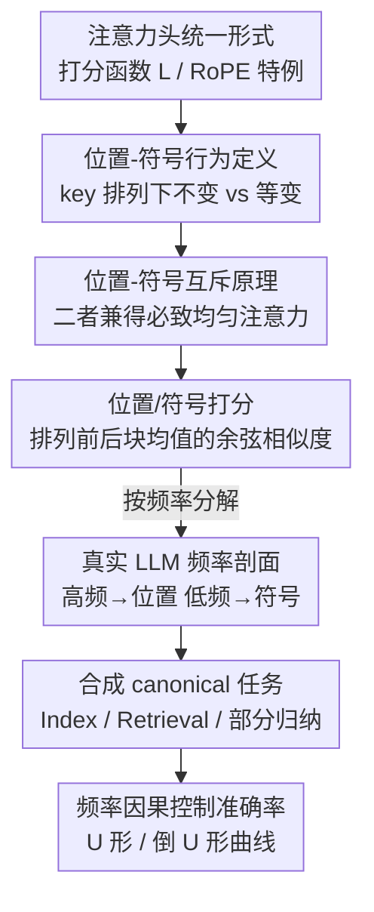

# Decoupling Positional and Symbolic Attention in Transformers

**会议**: ICLR2026  
**OpenReview**: [https://openreview.net/forum?id=V38yAoqddQ](https://openreview.net/forum?id=V38yAoqddQ)  
**代码**: https://github.com/furrutiav/positional-and-symbolic-iclr2026  
**领域**: 可解释性 / Transformer 机理分析  
**关键词**: 注意力机理, RoPE, 位置编码, 频率分析, 排列不变性

## 一句话总结
这篇论文给"注意力头按位置工作"还是"按符号工作"下了严格的数学定义，证明二者互斥（除非注意力退化成均匀分布），并设计了一个基于排列敏感性的打分指标，进而揭示 RoPE 中高频对应位置行为、低频对应符号行为，最后用可控的合成任务证明"只要限制某个头能访问的频段，就能因果地控制模型在位置/符号任务上的表现"。

## 研究背景与动机
**领域现状**：现代 Transformer LLM 几乎都靠位置编码（PE）注入位置信息，而 Rotary PE（RoPE）凭借经验上的出色表现成了主流。RoPE 把嵌入维度切成 $d/2$ 个二维子空间，每个子空间用一个角度 $\theta_k$（即频率）旋转 query/key 向量，从而把相对位置 $i-j$ 编码进注意力打分里。

**现有痛点**：人们对 RoPE 为什么有用其实只有零散直觉。传统说法是"RoPE 让 token 依赖随距离衰减"；近期 Barbero et al. (2024) 又观察到不同频段似乎承担不同功能——低频像"信息通道"、个别高频头产生"鲁棒的位置注意力模式"。再加上长文外推时调 base（即整体频率范围）的矛盾结论（降 base 利于近距离注意、却损害长程检索），这些现象都指向一个共同的张力，却没人把它讲清楚。

**核心矛盾**：注意力头似乎在做两件根本对立的事——一种关心"第几个位置"（位置能力），一种关心"是哪个符号"（符号能力）。同一个头很难同时把两者做好，但此前没有数学语言来刻画"位置行为"和"符号行为"到底是什么、为什么对立、怎么度量。

**本文目标**：把这个张力形式化，具体拆成四个问题——(1) 两种能力背后的数学性质是什么？(2) 怎么度量一个头偏位置还是偏符号？(3) 这两种能力如何对应到 RoPE 的不同频率？(4) 频率选择如何影响模型性能？

**切入角度**：作者从"排列对称性"切入。如果把 key 向量按位置重排，一个纯位置头的打分应该**不变**（它只看位置 $j$）；一个纯符号头的打分应该**跟着排列等变**（它只看符号 $x_j$）。这个对称性视角既能下严格定义，又能在真实模型里用注意力权重直接测量。

**核心 idea**：用"打分对 key 排列是不变还是等变"来定义位置头与符号头，证明二者互斥，造一个频率级别的打分指标，再用合成任务把"频率 → 行为 → 准确率"这条因果链跑通。

## 方法详解

### 整体框架
论文从一个统一的注意力头形式化出发：一个头由打分函数 $L$、值函数 VAL、激活函数 $F$ 组成，注意力打分写成 $\lambda^i_j = L(x_i, i, x_j, j)$。RoPE 是其中一个特例——它的打分函数为 $L_{\text{RoPE}}(x_i,i,x_j,j) = x_j^\top R_{i-j} x_i$，其中 $R_{i-j}$ 是各频率旋转矩阵拼成的块对角矩阵。整篇工作就建立在这一层打分函数上：先用"对 key 排列的对称性"定义两种行为并证明互斥（理论层），再把定义松弛成可计算的连续打分应用到真实 LLM（经验层），最后用一层 attention-only 的玩具 Transformer 把"频率决定行为、行为决定能不能解某类任务"严格证出来（合成验证层）。

整条逻辑链是一条三段递进的论证管线：

### 关键设计

**1. 位置/符号行为的排列定义：用对称性区分"看位置"还是"看符号"**

痛点是过去只有"这个头偏位置/偏符号"的模糊直觉，没法判定。作者用排列对称性给出干净的定义：从位置 $i$ 查询所有 $j<i$ 时，若对任意 key 排列 $\pi$ 都有 $L(x_i,i,x_{\pi(j)},j)=L(x_i,i,x_j,j)$，即打分只依赖位置 $j$、与 key 的内容 $x_j$ 无关，就说该头在这个输入上**按位置行为**；反过来，若 $L(x_i,i,x_j,\pi(j))=L(x_i,i,x_j,j)$，即打分跟着 key 的符号走、与它落在哪个位置无关，就是**按符号行为**。这个定义的好处是不假设位置信息以何种方式注入（NoPE、RoPE 都涵盖）：可以直接看出 NoPE 头天然是符号头（打分不含 $j$），而当所有 $Kx_j$ 相等时任何 RoPE 头都退化成位置头。

**2. 位置-符号互斥原理：想两者兼得，只能牺牲注意力的聚焦**

这是全文的理论支柱。作者定义两个偏差向量度量"离纯位置/纯符号有多远"：$\delta^{\text{pos}}_{L,\bar x}(\pi,j)=L(x_n,n,x_{\pi(j)},j)-L(x_n,n,x_j,j)$ 和 $\delta^{\text{sym}}_{L,\bar x}(\pi,j)=L(x_n,n,x_j,\pi(j))-L(x_n,n,x_j,j)$，纯位置 / 纯符号分别对应 $\delta^{\text{pos}}=0$ / $\delta^{\text{sym}}=0$。Theorem 1 证明：打分序列的方差被这两个偏差的范数共同上界，

$$\text{Var}(\lambda)=\frac{1}{n-1}\sum_j(\lambda_j-\mu)^2 \le \frac{\lVert\delta^{\text{pos}}_{L,\bar x}\rVert_2^2 + \lVert\delta^{\text{sym}}_{L,\bar x}\rVert_2^2}{(n-1)!\,(n-1)}.$$

含义很尖锐：如果一个头同时"几乎位置"又"几乎符号"（两个偏差都接近 0），那么打分的方差必然趋于 0，即注意力权重趋于均匀、彻底失去聚焦能力。换句话说，位置与符号是一对此消彼长的对偶——除非以"不聚焦的均匀注意力"为代价，否则不可能同时把两者做好。论文还配套证明：某些内在的位置操作无法被符号头实现、反之亦然，把"互斥"坐实到能力层面。

**3. 排列敏感的位置/符号打分：把定义松弛成可在真实模型上算的连续指标**

真实模型里的头不会精确满足上面的等式，所以需要一个连续的"接近度"打分。作者的做法是：对最后一个 token 查询得到注意力分布 $D(x)=\text{softmax}(L(x))$，把序列切成 $m$ 个连续块、取每块平均注意力得到 $d=(d_1,\dots,d_m)$；然后做简单的块交换（把块 $i$ 与块 $j$ 互换），把交换前后的块均值组成二维向量 $v_{ij}=(d_i,d_j)$ 和 $v'_{ij}=(d'_i,d'_j)$。**位置打分** $s_{\text{POS}}$ 用 $v'_{ij}$ 与 $v_{ij}$ 的余弦相似度衡量"块均值在排列下是否稳定不动"；**符号打分** $s_{\text{SYM}}$ 用 $v'_{ij}$ 与 $v_{ji}$ 的余弦相似度衡量"块均值是否跟着排列一起移动"。每个头得到一对 $(s_{\text{POS}}, s_{\text{SYM}})$，落在所谓的"位置-符号平面"上，从而能把整个模型所有头的行为画成一张快照。指标的关键优点是粒度可调——既能给单头单输入打分，也能按 RoPE 频率分解后给"每个频率"单独打分。

**4. 按频率分解 + canonical 任务因果验证：把"频率→行为→准确率"这条链跑通**

只有相关性还不够，作者要的是因果。其一，把一个头分解成 $m$ 个二维投影头、每个对应单一频率，对每个投影头单独算位置/符号打分，于是能画出"行为随频率变化"的曲线——这是揭示频率与行为对应关系的关键操作。其二，设计三个内在纯净的合成任务并配套可证明的玩具模型：**Index 任务**（$f_{\text{POS}}$，输出第 $j$ 个位置的符号，纯位置）证明符号头无法解（Theorem 2）、单角度 RoPE 位置头可解（Theorem 3）；**信息检索任务**（$f_{\text{SYM}}$，按符号检索其绑定的属性，纯符号）证明位置头无法解（Theorem 4）、NoPE 符号头可解（Theorem 5）；**部分归纳任务**（$f_{\text{MIX}}$，检索某符号最后一次出现的绑定值）证明纯位置或纯符号都不够、需要两个 RoPE 角度的头才行（Corollary 1 + Theorem 6）。这样就把"限制频段 → 限制行为 → 限制能解哪类任务"变成可控可证的因果实验。

### 一个例子：Binding 任务上的整模型剖面
拿 `gemma-2-2b-it` 在 binding 任务（如"Alice 喜欢红色…What color does Alice like?"，共 $n=256$ 个实体-属性对）上跑一遍：对每个头算 $(s_{\text{POS}}, s_{\text{SYM}})$ 画到平面上，发现**早层头位置打分高、晚层头符号打分高**（早层 1–13 位置中位数 0.83、晚层 14–26 仅 0.56；符号打分则相反）。两张热力图的位置/符号打分呈强负相关（Pearson $r=-0.91$, $p\le 0.0001$），正是互斥原理的经验印证。再把头 12:0 按频率分解，可以清楚看到：低频段（高频率 ID）符号打分高、中等偏高频段位置打分高、而最高频段两个打分都高——对应 Theorem 1 预言的均匀注意力退化。

## 实验关键数据

### 主实验：频率与行为的对应 + 任务可解性
作者用 GEMMA-2、QWEN-2、LLAMA-3 三个家族验证频率-行为对应关系，并在玩具模型上验证可解性。

| 验证对象 | 现象 | 与理论是否一致 |
|--------|------|----------|
| 真实 LLM 频率剖面 | 高频→位置行为、低频→符号行为、最高频→双高（均匀） | 与 Theorem 1 一致 |
| 位置/符号打分热力图 | 两类打分负相关 $r=-0.91$（$p\le 0.0001$） | 互斥原理的经验证据 |
| Index（位置）玩具任务 | 仅大频率（小 ID）可解，小频率必失败 | Theorem 2/3 |
| Retrieval（符号）玩具任务 | 仅低频率可解，频率过高则失败 | Theorem 4/5 |
| 部分归纳任务 | 1-RoPE 角度解不了；$\theta_1=0,\theta_2$ 双角度且 $\theta_2$ 不过大才可解 | Corollary 1 / Theorem 6 |

### 频率错配下的准确率形状（消融/分析）
核心分析实验是"强迫一个头用错误频率会怎样"，按答案在 prompt 中的位置 $j$ 看准确率形状。

| 任务 | 强迫使用的"错"频率 | 准确率随位置的形状 | 解读 |
|------|----------|----------|------|
| Index（位置） | 频率过低 | **U 形**（中间最差、两端较好） | 与"lost in the middle"现象呼应 |
| Retrieval（符号） | 频率不够低 | **倒 U 形**（中间较好、两端差） | 与位置任务恰好相反 |

作者进一步用玩具模型的机理给出解释：训练后 query 向量的角度编码"要查的位置"、key 向量收敛到单一方向，这正是理论解 $H_{\text{POS}}$ 的机制；而 gemma 真实头在某个位置性频率上的 query/key 投影轨迹与玩具模型惊人相似。Theorem 7 还从数学上证明 $H_{\text{POS}}$ 的最大注意力权重 $w_{\max}(j)$ 是 U 形、$H_{\text{SYM}}$ 的简化版是倒 U 形，把准确率形状归因到注意力权重形状。

### 关键发现
- **位置与符号是严格对偶**：负相关 $r=-0.91$ 不是巧合，而是 Theorem 1 的直接后果——想同时高位置又高符号，注意力必然趋于均匀失焦。
- **频率是可干预的"旋钮"**：限制某头能访问的频段，就能因果地决定它在 Index/Retrieval 任务上的成败，说明 RoPE 频率不只是位置衰减，而是位置/符号能力的开关。
- **"lost in the middle"有了机理解释**：位置任务在错配低频下出现的 U 形准确率，把一个工程界熟知的长文现象与单头频率使用联系了起来。
- **部分归纳需要混合频率**：纯位置或纯符号头都解不了 $f_{\text{MIX}}$，必须用 $\theta_1=0$ 与一个适中 $\theta_2$ 的双角度头，呼应了 induction head 需要兼顾"找位置"和"辨符号"。

## 亮点与洞察
- **用排列对称性给"位置/符号"下定义**：把一个模糊的机理直觉转成"打分对 key 排列不变 vs 等变"的精确数学语言，定义干净且不依赖具体 PE 形式，NoPE/RoPE 一网打尽——这是整篇工作能严格化的根基。
- **互斥原理把方差当桥梁**：Theorem 1 用一个简洁不等式把"既位置又符号"逼到"注意力均匀"，让一个看似定性的张力变成可证的定量约束，非常优雅。
- **频率级打分指标可迁移**：把头分解到单频率打分、画"位置-符号平面"快照的做法，可以直接拿去刻画任意模型在任意任务上的"位置-符号画像"，是一个通用的机理分析工具。
- **理论-玩具-真实三层闭环**：先证可解性、再训玩具模型看频率影响、最后在真实 gemma 头上找到同构的 query/key 轨迹，论证链条完整且互相印证，是机理可解释性研究值得借鉴的范式。

## 局限与展望
- **主要建立在 binding 任务上**：作者自己指出经验分析集中在 binding 任务，位置-符号画像在更广任务集与更大模型上的稳定性还需系统验证。
- **理论结果多基于"简单头/一层"假设**：Theorem 4/5 要求 VAL 为恒等、$F$ 为投影、嵌入为 one-hot 等简化条件；论文也承认若允许 $F$ 为一般 MLP 就能构造（人为的）反例，说明结论的边界依赖这些假设。
- **指标依赖块切分与块交换设计**：位置/符号打分用的是连续块的简单块交换，块大小 $m$、交换方式都是设计选择，对打分数值可能敏感，论文未充分讨论其鲁棒性。
- **可改进方向**：把位置-符号画像扩展到多层组合行为（当前主要看单头）、用频率干预做训练期或推理期的可控编辑、把 U/倒 U 形准确率与实际长文性能挂钩做工程优化，都是自然的延伸。

## 相关工作与启发
- **vs Barbero et al. (2024)**：他们在个别头上观察到低频做"信息通道"、特定高频头做"鲁棒位置模式"；本文把这个零散观察推广到所有头所有层，并配上严格定义、互斥定理和可计算指标，从"个案观察"升级为"全模型画像 + 因果验证"。
- **vs RoPE 长文外推工作（Liu et al. 2023 / Men et al. 2024）**：他们关心调 base 对长文检索/近距离注意的影响（降 base 利近距离、伤长程检索）；本文给出底层解释——base 决定频率范围，而频率决定位置/符号行为的此消彼长，于是长文外推的矛盾结论统一在同一张力下。
- **vs NoPE 表达力分析（Pérez et al. 2021 / Kazemnejad et al. 2023）**：他们讨论无位置编码的排列不变性与可恢复性；本文把"排列不变/等变"直接用作位置/符号的定义工具，与这一脉络在数学语言上一脉相承。
- **vs induction head（Olsson et al. 2022）**：部分归纳任务正是对 induction head 操作的致敬，本文从频率角度解释了为何这类任务需要混合位置与符号能力。

## 评分
- 新颖性: ⭐⭐⭐⭐⭐ 用排列对称性把"位置/符号"严格化并证出互斥原理，是少见的"定义-定理-验证"完整机理工作
- 实验充分度: ⭐⭐⭐⭐ 三大 LLM 家族 + 三个可证玩具任务交叉验证，但经验分析较集中于 binding 任务
- 写作质量: ⭐⭐⭐⭐ 理论与经验穿插、图文配合清晰，部分定理依赖较强简化假设需读附录
- 价值: ⭐⭐⭐⭐⭐ 给 RoPE 频率使用、"lost in the middle"等现象提供统一机理解释，并产出可迁移的分析工具

<!-- RELATED:START -->

## 相关论文

- [\[ICLR 2026\] Emergent Discrete Controller Modules for Symbolic Planning in Transformers](emergent_discrete_controller_modules_for_symbolic_planning_in_transformers.md)
- [\[AAAI 2026\] Attention as Binding: A Vector-Symbolic Perspective on Transformer Reasoning](../../AAAI2026/interpretability/attention_as_binding_a_vector-symbolic_perspective_on_transformer_reasoning.md)
- [\[ICLR 2026\] From Concepts to Components: Concept-Agnostic Attention Module Discovery in Transformers](from_concepts_to_components_concept-agnostic_attention_module_discovery_in_trans.md)
- [\[ICLR 2026\] Decoupling Dynamical Richness from Representation Learning: Towards Practical Measurement](decoupling_dynamical_richness_from_representation_learning_towards_practical_mea.md)
- [\[ICLR 2026\] Block Recurrent Dynamics in Vision Transformers](block_recurrent_dynamics_in_vision_transformers.md)

<!-- RELATED:END -->
