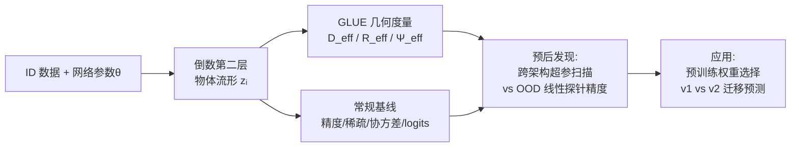

# Diagnosing Generalization Failures from Representational Geometry Markers

**会议**: ICLR 2026  
**OpenReview**: [https://openreview.net/forum?id=c2fQBcoKhU](https://openreview.net/forum?id=c2fQBcoKhU)  
**代码**: 待确认  
**领域**: 可解释性 / 表征几何 / 泛化分析  
**关键词**: 表征几何, OOD 泛化, 物体流形, GLUE, 有效维度, 模型选择, 迁移学习  

## 一句话总结
借鉴医学"生物标志物"的自上而下思路，本文用**只在分布内（ID）数据上测量的物体流形几何量**（有效维度 $D_\text{eff}$ 与利用率 $\Psi_\text{eff}$）作为预后指标，无需任何 OOD 信息就能预测模型在分布外（OOD）的泛化失败，并据此挑选迁移性更好的预训练权重。

## 研究背景与动机
**领域现状**：随着深度网络进入安全攸关场景，"如何提前预判模型在没见过的分布上会失败"成为核心问题。主流路线是自下而上的机制可解释性（mechanistic interpretability）——逆向出可解释特征、功能电路或因果结构。

**现有痛点**：机制可解释性虽然能给出细粒度洞见，却常常缺乏可辨识性（identifiability），且很难落到"对真实部署模型给出可操作诊断信号"这一步。另一方面，常规性能指标（如 ID 测试精度）在分布漂移下往往是非判别性的——超参不同的两个模型可以有几乎一样的 ID 精度，OOD 表现却天差地别。

**核心矛盾**：人们想要的是"高层、可预测的失败信号"，但已有工具要么太微观（特征/电路）、要么太粗糙（精度）。表征几何之前在 ID 设定下与泛化相关，但在分布漂移下结论互相打架（神经坍缩 vs. 高维表征哪个更好众说纷纭），缺乏系统化、与任务直接挂钩的度量。

**本文目标**：建立一套**诊断式、系统级**的范式，像医生用血压/胆固醇预判健康风险那样，找到能稳健预报模型未来表现的"网络标志物"。

**核心 idea**：**「ID 几何即预后」**——把分布内物体流形的任务相关几何量当作 prognostic marker。关键发现是**特征过度专门化（over-specialization）**，即流形的有效维度和利用率被过度压缩，是 OOD 泛化变差的可靠先兆。

## 方法详解

### 整体框架
方法遵循一个三步诊断循环：**(i) 标志物设计**——从网络的倒数第二层特征中构造只依赖 $(\theta, D_\text{ID})$ 的标量度量；**(ii) 预后发现**——在中等规模、跨架构/超参的实验里找出哪些 ID 信号能稳定预报 OOD 失败；**(iii) 真实应用**——把这些指标用于挑选迁移性更强的预训练权重。核心技术工具是 GLUE 框架给出的三个任务相关几何量。

### 关键设计

**1. 物体流形与标志物的定义：把"诊断"落到倒数第二层几何上。** 由于图像分类的最终决策是对倒数第二层特征做线性读出，作者把每个类别的特征点云 $\{z^\mu_i\}$ 称为**物体流形（object manifold）**，并把"标志物"形式化为一个把 $(\theta, D_\text{ID})$ 映射到标量的函数。除了几何度量外，他们还把一大批常规度量改写成 ID-only 标志物作对照：低阶统计量（稀疏性、协方差非对角幅度、类内成对距离/角度）、logits 统计量（平均置信度 AUROC、熵、能量），以及参与比（participation ratio）、神经坍缩（NC1）、Tunnel Effect 的数值秩。这样所有候选都在"只用 ID 数据"的统一规则下公平比较。

**2. GLUE 框架——SVM 的"平均情形"类比，给出可解析的几何度量。** 标志物的核心来自 GLUE（Geometry Linked to Untangling Efficiency），它建立在统计物理的感知机容量理论上。对两个物体流形，定义临界神经元数 $N_\text{crit}$ 为"随机投影到 $N_\text{proj}$ 维子空间后仍以 $\ge 0.5$ 概率线性可分"的最小维度，流形容量 $\alpha = P/N_\text{crit}$。GLUE 给出 $N_\text{crit}$ 的闭式表达：

$$N_\text{crit} = \mathbb{E}_{t\sim\mathcal{N}(0,I_N)}\Big[\max_{s_1(t)\in M_1, s_2(t)\in M_2} \big\|\text{proj}_{\text{span}(\{s_1(t),s_2(t)\})}\, t\big\|_2^2\Big]$$

其中内层优化的最大化点被定义为**锚点（anchor point）**，锚点分布是流形上一个非均匀测度，对"下游分类更重要"的点赋更高权重。GLUE 因此可视为 SVM 的平均情形类比：SVM 在最优子空间评估最佳可分性，GLUE 则在大量随机投影下平均，能捕捉更复杂、异质、含噪的结构。

**3. 三个有效几何量：把可分性拆成维度、半径、利用率。** 利用方程中的对称性，GLUE 把 $N_\text{crit}$ 重组为三个直观度量的简洁表达：

$$N_\text{crit} = \frac{P \cdot D_\text{eff}}{\Psi_\text{eff} \cdot (1 + R_\text{eff}^{-2})}$$

其中 $D_\text{eff}$ 是任务相关的有效维度、$R_\text{eff}$ 是类内有效半径、$\Psi_\text{eff}\in[0,1]$ 是利用率（量化"过度压缩"的程度）。直觉上，更小的 $D_\text{eff}$、更小的 $R_\text{eff}$、更大的 $\Psi_\text{eff}$ 都让流形更可分。从特征学习视角看，低 $D_\text{eff}$ 表示用到的特征模式更少、低 $\Psi_\text{eff}$ 表示类内方差压缩低效——二者一起就对应"过度专门化/捷径特征"。作者由此提出实际指导原则：**当同一架构有多份权重时，优先选 ID 上 $D_\text{eff}$ 和 $\Psi_\text{eff}$ 更高的那份**。

**4. 预后发现协议——只用 ID 训练、用 OOD 线性探针验证。** 为了把"几何标志物能否预报失败"做成可证伪的实验，作者在 CIFAR-10 上从零训练多种架构（ResNet、VGG 等），扫描 4 个初始学习率 × 4 个权重衰减 × 3 个随机种子 × {SGD, AdamW}，并保证训练精度 >99%、测试精度落在 88%–95%（即 ID 上几乎无差别）。随后冻结特征提取器，在**类别完全不相交**的 OOD 数据集（CIFAR-100、ImageNet）上训练线性探针，用探针测试精度作为 OOD 性能。这一设计刻意制造"ID 相似、OOD 分化"的对照组，从而让标志物的判别力凸显出来。

## 实验关键数据

### 主实验：预训练权重迁移预测（20 架构 × v1/v2）

| 预测器 | OOD 迁移预测准确率 |
|---|---|
| **本文 $D_\text{eff}$ + $\Psi_\text{eff}$** | **73.02%（92/126）** |
| ID 测试精度（常规做法） | 37.22% |

在 20 个 PyTorch 官方架构的 v1/v2 配对中，几何指标预测 v1 胜出 14 例（尽管 v2 的 ID 精度更高）、v2 胜出 1 例、其余无明确判定；在 15 个有判定的模型 × 9 个 OOD 数据集上达到 73% 准确率，远超用 ID 精度的 37%。

### 消融 / 跨设定一致性（CIFAR-10 训练，Pearson r 相关）

| 标志物 | 与 OOD 性能的相关性 |
|---|---|
| 有效维度 $D_\text{eff}$ / 利用率 $\Psi_\text{eff}$ / 参与比 | 强且跨架构一致 |
| 数值秩（Tunnel Effect） | 多数情形好，个别失效（如 VGG-19 + SGD） |
| 神经坍缩 NC1 | 较弱 / 不稳定 |
| logits 类（AUROC、熵、能量） | 弱（丢失了内部表征信息） |
| ID 精度、稀疏性、协方差 | 弱且不一致 |

结论在模型大小（ResNet18/34/50）、优化器（SGD/AdamW）、OOD 数据集（CIFAR-100/ImageNet）变化下都成立；用 ID **训练**数据测的几何量同样有强相关。

### 关键发现
- **流形过度压缩 ⇔ OOD 失败**：$D_\text{eff}$、$\Psi_\text{eff}$ 被压低意味着模型靠更少的特征、低效地用于可分性，与"捷径学习/过度专门化"解释吻合。几何量是连接微观特征与宏观行为的"介观（mesoscopic）"描述子。
- **类别级漂移 vs 损坏漂移不同**：对 CIFAR-10-C 这类标签不变的损坏漂移，**ID 测试精度反而是最强预测器**，几何-压缩规律只对类别级 OOD 成立——说明该规律是非平凡且特定于类别漂移的。
- **微调早期差异**：v1/v2 充分微调后收敛到相近水平，但 v1 在微调早期常学得更快，暗示其特征是更高效的迁移起点。

## 亮点与洞察
- **范式层面的新角度**：把"医学生物标志物 / 神经科学群体编码"的自上而下方法论搬到深度网络诊断，明确区分 diagnostic（现状）与 prognostic（预报未来），与机制可解释性互补而非竞争。
- **真正可操作的模型选择规则**：给出一条反直觉但管用的启发式——别只看 ID 精度，看 $D_\text{eff}$/$\Psi_\text{eff}$，在真实异质的 PyTorch 权重库上把迁移预测准确率从 37% 提到 73%。
- **统一的公平比较**：把神经坍缩、Tunnel Effect、OOD 检测分数等各路度量都改写成 ID-only 标志物同台竞技，论证了"任务相关"几何（GLUE 锚点分布）比任务无关描述子更判别。

## 局限与展望
- **理论基础待夯实**：流形过度压缩 ↔ 特征过度专门化目前主要是直觉性假设，缺乏严格理论；也未刻画被错分的 OOD 样本是否有共性。
- **适用范围有界**：规律对类别级 OOD 有效，对损坏型漂移不成立；实验集中在视觉图像分类，语言/RL/多模态尚未验证。
- **只诊断不干预**：当前停在"预报"，尚未把几何指标变成几何感知正则化、早停准则或权重选择协议等实际干预手段。
- **作者自指的未来方向**：因果机制与干预、跨域扩展、与参数迁移（Net2Net 式）结合、以及与神经科学高维结构编码的对照。

## 相关工作与启发
- **表征几何与泛化**：内在维度（Ansuini 2019）、神经坍缩（Papyan 2020）、Tunnel Effect 数值秩（Masarczyk 2023）在 ID 下与泛化相关，但分布漂移下结论冲突；本文用任务相关的 GLUE 度量统一了这些视角并支持"高维表征有利于 OOD"。
- **GLUE / 流形容量理论**（Chou 2025a/b、Chung 2018）是方法基石，把感知机容量理论扩展到流形并引入锚点分布。
- **捷径学习 / 谱据特征**（Geirhos 2020、Sagawa、Beery 2018）为"过度专门化导致 OOD 失败"提供了语义解释。
- **启发**：这套"先找标志物、再验预后、最后落地"的诊断循环可迁移到 LLM——例如用 ID 注意力/表征几何预报语言任务的 OOD 行为（文中已提到 Li et al. 2025 的相关尝试）。

## 评分
- **新颖性**: ⭐⭐⭐⭐ — "医学生物标志物 + 流形几何"的诊断式范式视角新颖，明确把 prognostic 与 mechanistic 区分开。
- **实验充分度**: ⭐⭐⭐⭐ — 跨架构/优化器/数据集的系统扫描 + 20 个真实 PyTorch 权重对照，并诚实给出损坏漂移上的反例。
- **写作质量**: ⭐⭐⭐⭐ — 三步诊断框架叙事清晰，几何量直觉与公式配合得当，图表自洽。
- **价值**: ⭐⭐⭐⭐ — 提供了一条可直接用于预训练模型选择的 ID-only 实用规则，对安全攸关部署和可解释性研究都有指导意义。

<!-- RELATED:START -->

## 相关论文

- [\[AAAI 2026\] CrossCheck-Bench: Diagnosing Compositional Failures in Multimodal Conflict Resolution](../../AAAI2026/interpretability/crosscheck-bench_diagnosing_compositional_failures_in_multim.md)
- [\[ACL 2025\] Probing the Geometry of Truth: Consistency and Generalization of Truth Directions](../../ACL2025/interpretability/probing_the_geometry_of_truth_consistency_and_generalization_of_truth_directions.md)
- [\[ICLR 2026\] On The Geometry and Topology of Representations: the Manifolds of Modular Addition](on_the_geometry_and_topology_of_representations_the_manifolds_of_modular_additio.md)
- [\[ICLR 2026\] The Geometry of Reasoning: Flowing Logics in Representation Space](the_geometry_of_reasoning_flowing_logics_in_representation_space.md)
- [\[ICLR 2026\] Cross-Modal Redundancy and the Geometry of Vision-Language Embeddings](cross-modal_redundancy_and_the_geometry_of_vision-language_embeddings.md)

<!-- RELATED:END -->
