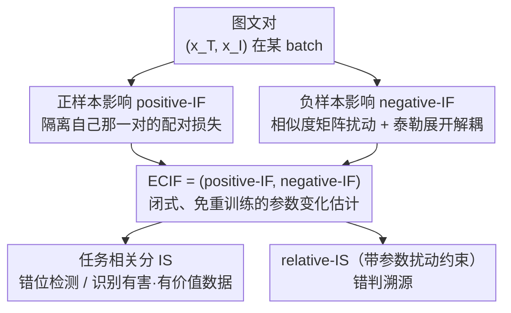

# Dissecting Representation Misalignment in Contrastive Learning via Influence Function

**会议**: ICLR2026  
**OpenReview**: [https://openreview.net/forum?id=uDCCSXyqBE](https://openreview.net/forum?id=uDCCSXyqBE)  
**代码**: 待确认  
**领域**: 可解释性 / 数据价值评估 / 对比学习  
**关键词**: 影响函数、对比损失、数据价值评估、错位检测、CLIP

## 一句话总结
针对经典影响函数只为逐点损失（pointwise loss）设计、无法套用到对比损失的问题，本文推导出专门面向对比学习的扩展影响函数 ECIF，把一个样本同时作为"正样本"和"负样本"的双重影响都解析地写成闭式表达，从而无需重训练就能评估 CLIP 类模型里每条图文对的贡献，并据此做错位检测与错判溯源。

## 研究背景与动机
**领域现状**：CLIP 这类多模态对比学习模型的训练严重依赖从互联网爬来的大规模图文对，而这些数据来源杂、质量参差，里面混着语义不匹配、标注错误的图文对。要排查这些"脏数据"，数据价值评估（data valuation）是一条主流路线——给每条训练样本打一个"贡献分"，分高的删掉会掉点、分低甚至为负的删掉反而涨点。

**现有痛点**：现有数据价值评估方法在大模型上不好用。一类是 Shapley Value 这种需要在不同数据子集上反复重训练的方法，算一次贡献分要训练很多遍，在大模型时代完全不现实；另一类是经典影响函数（influence function），靠梯度信息估计"删掉某样本后参数会怎么变"，避免了重训练，但它从诞生起就是给 M-estimator 的**逐点损失**设计的——每个样本在损失里有一个独立的项，把这个项加权 $\epsilon$ 就能推导。

**核心矛盾**：对比损失根本不是逐点的。一个 batch 内 $N$ 对图文，损失把所有样本的相似度耦合在一个 softmax 里：某个样本 $(x^T,x^I)$ 既在自己那一对里当**正样本**（要把它的图文拉近），又在其他所有对里当**负样本**（要把它和别人推远）。它的信息散落在损失的每一项里，无法像逐点损失那样"切出独立一项再加权"。更要命的是，负样本——尤其是被错误映射到很近的"难负样本（hard negative）"——的影响在以往分析里被严重低估，而经典影响函数压根没区分正负角色。

**本文目标**：把影响函数扩展到对比损失，且必须分别刻画一个样本作为正样本和作为负样本的两份影响；同时保持闭式、无需重训练、能在高维大规模场景下算得动。

**切入角度**：作者把一个样本对 $(x^T,x^I)$ 在对比损失里的"正样本贡献"和"负样本贡献"拆开单独分析——正样本那部分其实可以显式隔离出来（就是自己那一对的配对损失），难点全在负样本那部分如何从耦合的 softmax 里"解耦"出来。

**核心 idea**：对正样本沿用经典影响函数的加权思路；对负样本设计一个巧妙的"相似度矩阵扰动 + 泰勒展开"技巧，把它的耦合影响近似解耦成一个可计算的项，二者合起来就是 ECIF（Extended Influence Function for Contrastive Loss）。

## 方法详解

### 整体框架
ECIF 要回答的问题是：**如果从训练集里删掉某条（或某组）图文对，CLIP 模型的参数 $\hat\theta$ 会怎么变？** 经典影响函数给逐点损失的答案是 $\hat\theta_{-z_m}-\hat\theta \approx -H_{\hat\theta}^{-1}\nabla_\theta \ell(z_m;\hat\theta)$，即"海森逆 × 该样本梯度"。本文的整个工作就是把这个公式里的"该样本梯度项"在对比损失下正确地推导出来，而且要拆成正、负两条。

整体流程是：先把目标样本在对比损失里的角色分成正样本贡献 $\mathrm{Pos}$ 和负样本贡献 $\mathrm{Neg}$ 两块，分别推出 positive-IF 和 negative-IF；二者打包成 ECIF；再在 ECIF 之上定义两个面向应用的影响分数——任务相关分 IS（用于错位检测、识别有害/有价值数据）和带参数约束的 relative-IS（用于错判溯源）。

### 关键设计

**1. 正样本影响 positive-IF：把"自己那一对"显式切出来加权**

样本 $(x^T,x^I)$ 作为正样本时，它只出现在自己那一对的配对损失里——文到图的 $L_{T2I}(u_n,V_m;\theta)$ 和图到文的 $L_{I2T}(v_n,U_m;\theta)$。这部分可以像经典影响函数那样直接"显式隔离"：把这两项记作 $\mathrm{Pos}((x^T,x^I);\theta)=L_{T2I}(u_n,V_m;\theta)+L_{I2T}(v_n,U_m;\theta)$，在总损失里给它加权 $\epsilon$，对 $\epsilon$ 求响应函数，令 $\epsilon\to-1$ 就对应"删掉这一对"。由此得到

$$\text{positive-IF}((x^T,x^I);\hat\theta) = -H_{\hat\theta}^{-1}\cdot\nabla_\theta \mathrm{Pos}((x^T,x^I);\hat\theta).$$

这一块之所以"简单"，是因为正样本的信息没和别人耦合，沿用经典加权套路即可；难点全留给了负样本。该结论还能从单样本扩展到子集 $D^\ast$，对子集里所有样本的影响求和即可（命题 4.1）。

**2. 负样本影响 negative-IF：用 $\log\zeta\cdot E_n$ 扰动相似度矩阵再泰勒展开，把耦合项解耦**

这是全文最核心的技巧。样本作为负样本时，它的信息藏在别人配对损失的 softmax 分母里（$S_{k,n}$ 项），删掉它相当于"从相似度矩阵里抹掉第 $n$ 行和第 $n$ 列"。直接做这种离散删除没法求导。作者的做法是：**不删，而是把第 $n$ 行第 $n$ 列的相似度往负无穷压**——指数化之后这些项就趋于 0，效果等价于删除。具体地，构造一个 $B\times B$ 矩阵 $E_n$（第 $n$ 行、第 $n$ 列全为 1，其余为 0），把 $\log\zeta\cdot E_n$ 加到相似度矩阵上，得到一个被 $\zeta$ 参数化的损失 $L^m_{T2I,\zeta}$。当 $\zeta\to 0$ 时它收敛到"删掉该负样本"的损失，当 $\zeta=1$ 时就是原损失。

接着在 $\zeta=1$ 处做泰勒展开、丢掉 $O((\zeta-1)^2)$ 高阶项，就能把"负样本影响"近似线性地分离出来，得到一个解析项

$$\mathrm{Neg}((x^T,x^I);\theta)=\sum_{k\neq n}\Big(\tfrac{\sum_{j}e^{S_{k,j}}}{e^{S_{k,n}}}+\tfrac{\sum_{j}e^{S_{j,k}}}{e^{S_{n,k}}}\Big),$$

于是 $\text{negative-IF}((x^T,x^I);\hat\theta)=-H_{\hat\theta}^{-1}\cdot\nabla_\theta\mathrm{Neg}((x^T,x^I);\hat\theta)$（命题 4.2）。这一步把"对比学习里负样本影响无法解耦"的硬骨头啃下来了，也是本文相对经典影响函数的本质区别：它第一次让"难负样本"的影响被显式量化，而不是被平均掉。

**3. ECIF：双视角闭式估计，免重训练**

把正、负两份影响打包，就得到对比损失的扩展影响函数

$$\text{ECIF}(D^\ast,\mathrm{Seg};\hat\theta)\triangleq\big(\text{positive-IF}(D^\ast,\mathrm{Seg};\hat\theta),\ \text{negative-IF}(D^\ast,\mathrm{Seg};\hat\theta)\big),$$

其中 $\mathrm{Seg}$ 记录目标子集在各 batch 里的位置索引。ECIF 的价值在于：它给出参数变化 $\hat\theta_{-D^\ast}-\hat\theta$ 的**闭式近似**，删数据不用重训练。作者还在凸损失假设下给出了 ECIF 估计值与真实重训练影响之间的误差上界（附录 E），论证近似误差在一定场景下是可容忍的。"双视角（dual-perspective）"是它区别于所有以往方法的标签——以往方法只盯"最有价值/最有影响"的数据，而对比学习里每个样本同时有正、负两份影响，只看一份必然漏掉一类（比如有害数据）。

**4. 两个应用层指标：任务相关分 IS 与带约束的 relative-IS**

ECIF 估计的是"参数怎么变"，但实际任务关心的是"某任务性能怎么变"，所以要再投影一层。对一个高质量验证集 $D'$，如果 $D^\ast$ 是错位数据，删掉它应让 $D'$ 上的损失下降，这个差值可由 ECIF 近似，定义为**任务相关影响分** $\mathrm{IS}(D',D^\ast,\mathrm{Seg};\hat\theta)=-\nabla L_{Batch}(U',V';\hat\theta)^T\cdot(\text{posi-IF}+\text{nega-IF})$：它的符号表示正/负影响，幅度表示影响大小。于是错位检测就被写成 $\arg\max_{D^\ast}\mathrm{IS}$。

但直接用 IS 做**错判溯源**会出问题：IS 里"参数变化"那一项很大时，即使某样本和当前错判任务无关，也会被误判成高影响。为此作者加一个约束——限制参数变化的范数 $\|\Delta\hat\theta_{\epsilon,\zeta}(x)\|_2\le\rho^2$，在"允许的小幅参数扰动"下找最能改变测试样本损失的训练样本，经命题 5.3 化简成一个更简单的 $\arg\max$，定义为 **relative-IS**。加了参数扰动约束后，它能更准地锁定和错判真正相关的训练样本，而不是被那些"碰巧对参数影响大但与任务无关"的样本干扰。

### 损失函数 / 训练策略
本文不引入新的训练损失，而是围绕标准多模态对比损失展开。给定一个 batch 的文本嵌入 $U=(u_1,\dots,u_N)$ 和图像嵌入 $V$，余弦相似度 $s(u,v)=\frac{u\cdot v^T}{\|u\|\|v\|}/\tau$（$\tau$ 为可学习温度），相似度矩阵 $S_{i,j}=s(u_i,v_j)$，自监督对比损失为

$$L_{Batch}(U,V;\theta)=\sum_{i=1}^{N}\big(-\log(e_i\cdot\sigma(S_{i,*}))-\log(e_i\cdot\sigma(S^T_{*,i}))\big),$$

可拆成图到文（I2T）与文到图（T2I）两路；总损失再加 $\frac{\delta}{2}\|\theta\|_2^2$ 的 L2 正则（既防过拟合，也保证海森矩阵可逆、影响函数推导成立）。ECIF 正是建立在这个损失结构之上对"删样本"做闭式估计。

## 实验关键数据

实验在 CLIP 上微调，覆盖 FGVC-Aircraft、Food101、Flowers102、CIFAR-10/100、DTD、Imagenette 等数据集；以"从头重训练（Retrain）"为 ground truth，对比 IF-EKFAC、TRAK、TracIN 三个数据归因 baseline；指标用准确率（Accuracy）和运行时间（RT，秒）。

### 主实验：ECIF 能逼近重训练且快得多
ECIF 编辑后的模型与真实重训练在各数据集上的精度几乎一致，但耗时大幅降低：

| 数据集 | Retrain Acc(%) | ECIF Acc(%) | Retrain RT(s) | ECIF RT(s) |
|--------|------|------|------|------|
| FGVCAircraft（Random） | 23.07±0.29 | 22.77±0.09 | 1174.2 | 456.0 |
| Food101（Random） | 84.93±0.17 | 84.87±0.24 | 875.4 | 436.8 |
| Flowers102（Random） | 68.16±0.22 | 68.53±0.12 | 995.4 | 437.4 |
| Cifar100（Random） | 73.50±0.35 | 73.00±0.20 | 753.6 | 444.0 |

精度差在 FGVCAircraft 上仅 0.30%、Food101 上仅 0.06%；运行时间普遍快 2 倍以上，节省约 80%–90% 的重训练算力。

### 与 baseline 对比：只有 ECIF 能识别"有害样本"
删掉各方法识别出的 10% 最有害样本后重训练：

| 方法 | FGVCAircraft | Food101 | Flowers102 | Cifar100 |
|------|------|------|------|------|
| Fine-tune（不删） | 22.18 | 83.85 | 67.64 | 72.31 |
| Retrain（删有害） | 23.50 | 84.83 | 68.00 | 72.83 |
| IF-EKFAC | 19.84 | 78.26 | 60.74 | 61.67 |
| TRAK | 18.27 | 77.27 | 59.21 | 58.67 |
| TracIN | 19.48 | 78.35 | 60.60 | 59.00 |
| **ECIF** | **23.02** | **84.90** | **68.30** | **73.00** |

ECIF 删有害样本后精度与重训练几乎对齐、且都高于不删的基线；而三个 baseline 反而把精度删低了。原因：它们是为逐点损失设计的，在对比损失上失效，且只盯"最有价值数据"，识别不出有害样本——因为对比学习里每个样本同时带正、负两份影响。

### 关键发现
- **删有害数据真涨点，不是删除动作本身的功劳**：Food101 上删 10% 有害数据精度涨约 1%，而随机删同样数量精度持续下降（图 1a），说明 ECIF 找的确实是有害的。
- **删有价值数据真掉点**：删 ECIF 标出的 top-k 有价值数据，精度从 84.7 单调降到 84.1；而随机删到 0.3 比例时精度反而上升，反衬出 Food101 本身噪声多、ECIF 能挑出真正提升精度的样本（图 1b 的 brittleness test）。
- **错位检测命中率高**：在人为打乱 10%–30% 标签的数据集上，用最高负 IS 选出的 top-10 里有 8 个完全落在被打乱的部分（图 2），说明能有效定位人工注入的噪声。
- **错判溯源可视化**：用 relative-IS 溯源到的训练样本，与被错判的测试样本在形状或纹理上确有相似性（表 3），印证了"哪些训练样本导致了这次错判"的可追溯性。

## 亮点与洞察
- **"压相似度代替删行列"的扰动技巧很巧**：删去相似度矩阵第 $n$ 行列是离散操作无法求导，作者改成加 $\log\zeta\cdot E_n$ 把对应相似度往负无穷压、再在 $\zeta=1$ 处泰勒展开，把"删一个负样本"变成可微的连续扰动——这是把组合性的删除问题转成可微解析的关键一招。
- **第一次给对比学习的负样本影响一个闭式量化**：以往影响函数不分正负角色，难负样本的影响被平均掉；ECIF 的双视角让"某条数据作为负样本拖累了谁"变得可算，这点可迁移到任何带 in-batch 负样本的 InfoNCE/NCE 训练（如检索、推荐里的双塔对比）。
- **从"参数变化"到"任务影响"再加约束的两层投影设计**：先有 IS（任务相关）解决"删了对某任务好不好"，再发现错判溯源会被"参数影响大但任务无关"的样本干扰，于是加参数扰动范数约束得到 relative-IS——这种"先发现指标的失效模式再针对性加约束"的思路很值得借鉴。

## 局限与展望
- **凸损失假设下才有误差界**：ECIF 的近似误差上界是在凸损失假设下给出的，而真实 CLIP 训练高度非凸，附录里的"误差可容忍"结论在实际深网上有多紧并不清楚。
- **依赖海森逆，规模化仍有压力**：方法核心是 $H_{\hat\theta}^{-1}$，论文借助 LOGRA 等低秩梯度投影来提效，但在更大参数量的基座上海森的存储与求逆仍是潜在瓶颈，实验也主要在"CLIP 微调"规模上验证，未触及从零预训练级别。
- **实验偏小数据集与分类指标**：评测集中在 Food101/CIFAR/FGVC 这类分类数据集、用准确率衡量，缺少在真实大规模噪声网络数据（如原始 LAION 级别）上的端到端清洗验证；"top-10 命中 8 个"的结论也基于人工注入的标签噪声，与天然错位的分布可能不同。
- **泰勒一阶截断的适用边界**：负样本影响靠丢掉 $O((\zeta-1)^2)$ 得到，当某负样本影响很强（比如极端难负样本）时一阶近似是否仍准，文中未充分讨论。

## 相关工作与启发
- **vs 经典影响函数（Koh & Liang 2017 / IF-EKFAC）**：经典影响函数为逐点损失设计，把每个样本当一个独立损失项；本文指出对比损失里样本信息耦合在 batch 的 softmax 中、且需区分正负角色，经典方法直接套用会失效（实验中 IF-EKFAC 删"有害"样本反而掉点），ECIF 用双视角 + 矩阵扰动解耦补上这一缺口。
- **vs TRAK / TracIN**：这两者也是免重训练的数据归因方法，但同样面向逐点/分类损失，只擅长找"最有价值"的数据；本文实验显示它们识别不出对比学习里的有害样本，因为忽略了负样本视角。
- **vs Shapley Value 类数据价值评估**：Shapley 要在不同子集上反复重训练，精确但算力不可承受；ECIF 牺牲一点精度换闭式近似，在大模型时代更实用。
- **vs 难负样本研究（Robinson et al. 2021 等）**：以往工作强调难负样本对表示学习重要，但停留在"如何采样/构造"难负样本；本文则提供了一把"事后量化"的尺子——能算出某个负样本到底产生了多大（正向或负向）影响，把难负样本研究从"怎么用"推进到"怎么度量与诊断"。

## 评分
- 新颖性: ⭐⭐⭐⭐⭐ 第一个把影响函数严格扩展到对比损失、且解析地拆出正负双视角影响，矩阵扰动 + 泰勒解耦的技巧有原创性。
- 实验充分度: ⭐⭐⭐⭐ 覆盖删数据逼近重训练、有害/有价值数据识别、错判溯源、错位检测多任务，但数据集偏小、缺真实大规模噪声数据验证。
- 写作质量: ⭐⭐⭐⭐ 动机与推导链条清晰，正负样本分两节循序推进；但负样本那段公式密度高，对非影响函数背景的读者门槛较陡。
- 价值: ⭐⭐⭐⭐⭐ 给 CLIP 类模型的数据清洗、错判溯源、噪声诊断提供了免重训练的实用工具，对多模态数据治理与可解释性都有直接价值。

<!-- RELATED:START -->

## 相关论文

- [\[ICLR 2026\] Sparse CLIP: Co-optimizing Interpretability and Performance in Contrastive Learning](sparse_clip_co-optimizing_interpretability_and_performance_in_contrastive_learni.md)
- [\[ICLR 2026\] MICLIP: Learning to Interpret Representation in Vision Models](miclip_learning_to_interpret_representation_in_vision_models.md)
- [\[ICLR 2026\] Influence Dynamics and Stagewise Data Attribution](influence_dynamics_and_stagewise_data_attribution.md)
- [\[ICLR 2026\] Decoupling Dynamical Richness from Representation Learning: Towards Practical Measurement](decoupling_dynamical_richness_from_representation_learning_towards_practical_mea.md)
- [\[ICLR 2026\] Decomposing Representation Space into Interpretable Subspaces with Unsupervised Learning](decomposing_representation_space_into_interpretable_subspaces_with_unsupervised_.md)

<!-- RELATED:END -->
