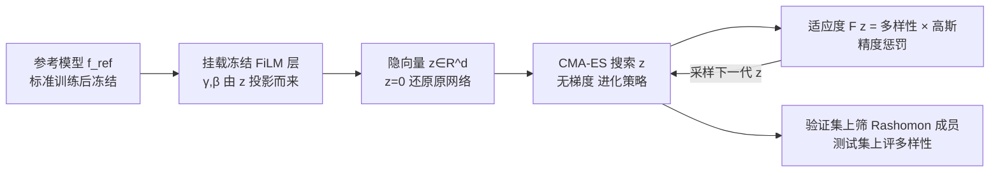

# DIVERSE: Disagreement-Inducing Vector Evolution for Rashomon Set Exploration

**会议**: ICLR 2026  
**OpenReview**: [https://openreview.net/forum?id=kQjSUHC84V](https://openreview.net/forum?id=kQjSUHC84V)  
**代码**: 待确认  
**领域**: 可解释性 / 模型多重性（Rashomon Set）  
**关键词**: Rashomon Set, Predictive Multiplicity, FiLM, CMA-ES, 无梯度搜索, 模型多样性  

## 一句话总结
给预训练网络挂上一层冻结的 FiLM 调制层，用 CMA-ES 在低维隐向量空间里无梯度地搜索"和参考模型一样准但预测行为不同"的变体，从而免重训地系统探索深度网络的 Rashomon 集合。

## 研究背景与动机
**领域现状**：很多机器学习任务存在一大批精度相近、但决策路径不同的模型——这就是 Rashomon 效应（也叫模型多重性 model multiplicity）。这些等价模型对同一输入可能给出不同预测（predictive multiplicity），这一性质被用于不确定性评估、公平性、可解释性等。在决策树、广义可加模型这类简单模型上 Rashomon 集合已被较好刻画，但在深度网络上仍很欠缺。

**现有痛点**：深度网络的假设空间巨大，要在"贴着最优性能的窄带"里枚举多样模型非常昂贵。现有三类近似方法各有短板——(1) **重训练**（换种子/超参/增强）能做全局探索，但代价高昂且不保证产出等性能模型；(2) **对抗权重扰动 AWP** 对每个 (样本, 类别) 对都要单独优化，比重训还慢，大模型上不可行；(3) **Dropout 采样** 训练-free 且快，但多样性有限且无法显式控制，还把 Rashomon 成员判定直接放在测试集上，存在乐观偏差。

**核心矛盾**：既要"高效、可控地"产生多样变体，又要"不重训、不需要梯度"，还要保证多样性是真实泛化而非对搜索过程的过拟合。

**本文目标**：提出一个无梯度、强调效率与显式多样性控制的框架，免重训地探索深度网络的局部 Rashomon 集合。

**核心 idea（加粗标签）**：**把"找多样模型"从权重空间搬到低维隐空间**——冻结原网络权重，挂上随机初始化、同样冻结的 FiLM 调制层，让一个共享隐向量 $z$ 全网协同地微调内部激活；再用擅长非可分、非凸景观的 CMA-ES 去搜这个隐向量，目标是"既贴近参考精度、又最大化预测分歧"。

## 方法详解

### 整体框架
DIVERSE 分三步：(i) 标准监督训练得到参考模型 $f_{\text{ref}}$，其性能定义 Rashomon 阈值；(ii) 用冻结 FiLM 层把网络包成一个由隐向量 $z$ 参数化的"调制空间"，$z=0$ 恰好还原原网络；(iii) 用 CMA-ES 在这个低维空间里搜索 $z$，使产出的变体 $f_z$ 既留在 Rashomon 集合内又尽量和参考模型分歧。整条管线不动原权重、不需要梯度。

### 关键设计

**1. FiLM 调制空间：把"重训找变体"变成"搜一个低维隐向量"。** 在预训练网络的预激活 $h$ 上插入 FiLM 仿射变换 $\text{FiLM}(h;z)=\gamma(z)\odot h+\beta(z)$，其中 $\gamma(z)=1+\tanh(zW_\gamma)$、$\beta(z)=\tanh(zW_\beta)$，投影矩阵 $W_\gamma,W_\beta\in\mathbb{R}^{d\times C}$ 用 $\mathcal{N}(0,0.5^2)$ 随机初始化后**冻结**。$\tanh$ 把调制幅度限制在 $\gamma\in[0,2]$、$\beta\in[-1,1]$，避免搜索时放大失稳；$z=0$ 天然还原参考模型（$\gamma=1,\beta=0$），是搜索的锚点。所有 FiLM 层共享同一个 $z$，因此单个向量就能全网协同地改变内部表示——这把高维权重空间压成了一个可复现、低维、由 $z$ 平滑控制的"调制空间"，且不引入额外超参。论文按架构给了三种插入位置：密集层后、卷积块（+BN）后、以及残差跳连上。

**2. CMA-ES 搜索非可分隐空间：为什么不用别的优化器。** $z$ 的每个坐标都同时影响多个 FiLM 层，导致维度间强耦合、景观非可分。CMA-ES 维护一个完整协方差矩阵 $x_k^{(g)}\sim\mathcal{N}(m^{(g)},\sigma^{(g)2}C^{(g)})$，能学到任意方向的相关结构、具备旋转不变性，正好适配这种耦合景观；且它无梯度，契合权重被冻结、拿不到梯度的设定。代价是全协方差在高维（数百维以上）会变贵，所以论文把隐维 $d$ 控制在小范围（$d\in\{2,\dots,64\}$），并按 $\text{popsize}=4+3\log d$、预算 $kd$（每维 $k=80$ 次评估）来配置搜索，使计算量随搜索空间线性增长。

**3. 适应度函数：精度软约束 × 双重多样性的乘积。** 适应度要同时压住"别偏离参考精度"和"放大预测分歧"两个目标。先定义相对损失增量 $\Delta(z)=\frac{L_{\text{train}}(z)-L^{\text{ref}}_{\text{train}}}{L^{\text{ref}}_{\text{train}}+10^{-8}}$，再用居中于 0 的高斯惩罚 $\phi_\epsilon(z)=\exp(-\frac{\Delta(z)^2}{2\epsilon^2})$ 来**软**执行 Rashomon 参数 $\epsilon$——贴近参考的候选几乎不罚，偏离大的指数降权而非硬拒，从而不会丢掉落在 Rashomon 边界上的多样候选。多样性同时用软分歧（Total Variation Distance，$\text{TVD}(P,Q)=\frac12\sum_i|P_i-Q_i|$，比 KL/JS 在近确定性输出时更数值稳定）和硬分歧（预测标签不一致比例 $\text{Dis}$），以 $\lambda=0.5$ 混合：$\text{Div}_\lambda(z)=\lambda\,\text{TVD}+(1-\lambda)\,\text{Dis}$。最终适应度取乘积 $F(z)=\text{Div}_\lambda(z)\cdot\phi_\epsilon(z)$，引导 CMA-ES 走向"既在集合内、又在决策层和概率层都有分歧"的模型。为防止对搜索过程过拟合，Rashomon 约束在验证集上筛、多样性在留出测试集上报。

## 实验关键数据

### 主实验表格
在 MNIST（3 层 MLP）、PneumoniaMNIST（ResNet-50 迁移）、CIFAR-10（VGG-16）上，对比重训练与 dropout 采样，按生成 $m$ 个候选模型的运行时间（hh:mm:ss）：

| 方法 | MNIST (m=162) | MNIST (m=640) | Pneumonia (m=162) | Pneumonia (m=640) | CIFAR-10 (m=162) | CIFAR-10 (m=640) |
|------|------|------|------|------|------|------|
| Retrain | 00:29:39 | 01:57:36 | 02:09:00 | 08:16:00 | 03:17:26 | 12:37:27 |
| Dropout | 00:00:30 | 00:01:57 | 00:01:32 | 00:05:47 | 00:01:58 | 00:06:30 |
| **DIVERSE** | 00:00:50 | 00:03:16 | 00:01:49 | 00:07:15 | 00:02:11 | 00:08:42 |

重训需要数小时，DIVERSE 只要几分钟（比重训快两到三个数量级），略慢于 dropout。多样性上：MNIST 上 DIVERSE 在较大 $\epsilon$ 时 discrepancy 超过重训、除 VPR 外全面优于 dropout；CIFAR-10 上各项均超 dropout；PneumoniaMNIST 上在最高 $\epsilon$ 时 discrepancy 超 dropout 和重训，但严格阈值下偏弱。

### 消融实验表格

| 消融维度 | 设置 | 关键结论 |
|----------|------|----------|
| 隐维 $d$ | $\{2,4,8,16,32,64\}$ | MNIST 各 $d$ 都能成集合、大 $d$ 多样性增益递减；CIFAR/Pneumonia 上 $d\in\{2,4\}$ 各 $\epsilon$ 都行，$d=8$ 仅 $\epsilon\ge0.03$，$d\ge16$ 找不到集合 |
| 初始化 | $z=0$ vs $z=1$ vs 高斯抽样 | $z=0$ 锚点最稳定可靠；$z=1$ 常失败（MNIST 例外但比率下降） |
| 步长 $\sigma_0$ | $\{0.1,\dots,0.5\}$ | MNIST 大步长更多样；Pneumonia/CIFAR 小步长更有效 |
| 混合权重 $\lambda$ | $[0,1]$ | 结果对 $\lambda$ 大体不敏感（软硬分歧高度相关） |

### 关键发现
- **多样性随 $\epsilon$ 单调增长**：所有数据集上 discrepancy、ambiguity 随 Rashomon 阈值放宽而上升，证实发现了功能上真正不同的解。
- **逐层敏感性局部化**：$\Delta$TVD 分析显示只有一小撮 FiLM 位点真正驱动分歧——MNIST 早层主导、VGG16 中层卷积、ResNet50 早到中层，暗示未来可只在敏感层上搜索。
- **数据/架构越复杂越受限**：深层模型上保持性能更难，Rashomon Ratio 更低，但多样性仍随 $\epsilon$ 增长。

## 亮点与洞察
- **把搜索空间从权重压到隐向量**是核心巧思：FiLM + 共享 $z$ 让"全网协同微调"由 $d$ 维向量统一控制，既保留表达力又把维度降到 CMA-ES 能高效处理的范围。
- **软约束 + 乘积适应度**设计精到：用高斯惩罚代替硬拒绝，保住了 Rashomon 边界附近最有价值的多样候选；乘积形式让"出集合"的候选自然被压低。
- **方法论上的严谨**：验证集筛成员、测试集评多样性，明确针对 dropout"同一份数据既选又评"的乐观偏差做了纠偏，使对比更公允。

## 局限与展望
- **隐维扩展性受限**：全协方差 CMA-ES 在高维变贵，$d\ge16$ 在复杂数据集上几乎找不到集合，限制了可探索的多样性上限。
- **只是局部 Rashomon 集合**：从参考模型出发的调制空间本质是局部探索，无法像重训那样做全局覆盖；多样性绝对值在严格 $\epsilon$ 下仍不及重训。
- **依赖单一参考模型与人工架构插点**：FiLM 插入策略需按架构手工设计，且整个集合都锚在一个 $f_{\text{ref}}$ 附近。
- **展望**：逐层敏感性分析提示可把 CMA-ES 搜索聚焦到少数高敏感 FiLM 层，而非调制全网，有望进一步降本并扩到更大模型。

## 相关工作与启发
- **Rashomon / 模型多重性谱系**：Breiman 的 Rashomon 效应、Semenova 等的 Rashomon 集合与 Rashomon Ratio、Marx 等的 predictive multiplicity，以及 Hsu & Calmon 的 Rashomon Capacity、Watson-Daniels 等的 VPR 等度量构成了本文的评测框架。
- **近似方法对照**：重训（Ganesh；Eerlings 等）、AWP（Hsu & Calmon）、dropout 采样（Hsu 等）是本文直接对比与改进的对象。
- **FiLM 谱系迁移**：FiLM（Perez 等）原用于条件计算，MixStyle、few-shot 特征变换、FiLM-Ensemble 等把它用于域泛化/不确定性；本文创新地"重新利用 FiLM 来定义一族围绕固定参考网络的调制模型"。
- **启发**：把"模型多样性搜索"重构为"低维隐空间上的无梯度进化"这一范式，可迁移到其他需要免重训生成多样模型的场景（集成、不确定性、公平性审计）。

## 评分
- 新颖性: ⭐⭐⭐⭐ —— 将 FiLM 调制空间 + CMA-ES 组合用于深度网络 Rashomon 探索是新颖且自洽的视角，软约束乘积适应度设计巧妙。
- 实验充分度: ⭐⭐⭐ —— 三数据集 + 三类架构 + 充分的 $d/\sigma_0/$初始化$/\lambda$ 消融及逐层敏感性，但规模仅到 CIFAR-10/VGG-16，缺大模型/大数据验证。
- 写作质量: ⭐⭐⭐⭐ —— 动机清晰、公式与设计交代完整，背景与度量铺垫扎实。
- 价值: ⭐⭐⭐⭐ —— 提供了比重训快两三个数量级、又能显式控制多样性的实用工具，对多重性研究的可扩展性有实际意义。

<!-- RELATED:START -->

## 相关论文

- [\[ICLR 2026\] Inducing Dyslexia in Vision Language Models](inducing_dyslexia_in_vision_language_models.md)
- [\[ICML 2026\] From Rashomon Theory to PRAXIS: Efficient Decision Tree Rashomon Sets](../../ICML2026/interpretability/from_rashomon_theory_to_praxis_efficient_decision_tree_rashomon_sets.md)
- [\[ICLR 2026\] Evolution of Concepts in Language Model Pre-Training](evolution_of_concepts_in_language_model_pre-training.md)
- [\[ICLR 2026\] Hyper-SET: Designing Transformers via Hyperspherical Energy Minimization](hyper-set_designing_transformers_via_hyperspherical_energy_minimization.md)
- [\[ICLR 2026\] GEPA: Reflective Prompt Evolution Can Outperform Reinforcement Learning](gepa_reflective_prompt_evolution_can_outperform_reinforcement_learning.md)

<!-- RELATED:END -->
