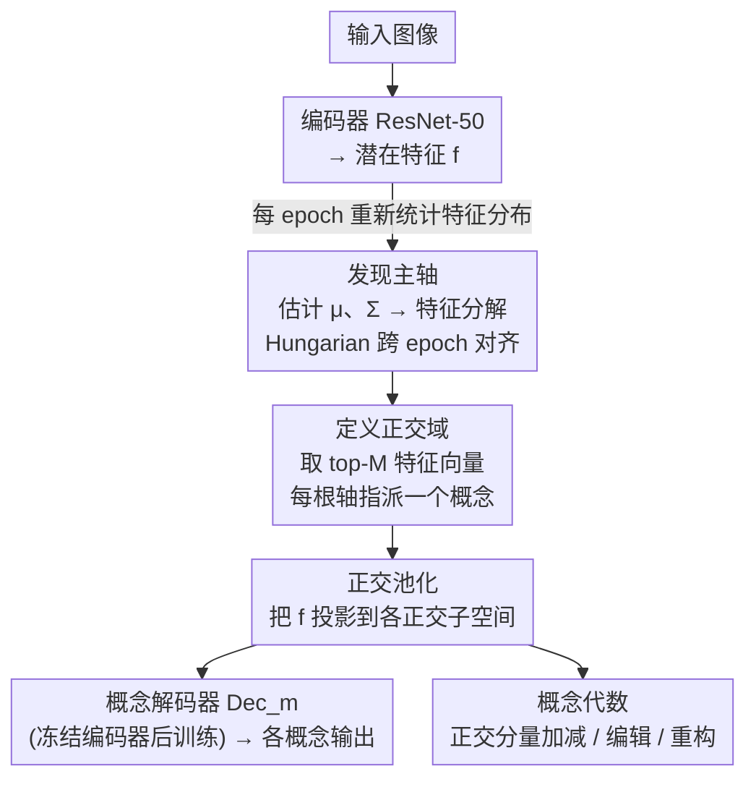

# Domain Expansion: A Latent Space Construction Framework for Multi-Task Learning

**会议**: ICLR 2026  
**arXiv**: [2601.20069](https://arxiv.org/abs/2601.20069)  
**代码**: 待确认  
**领域**: Representation Learning / Multi-Task Learning  
**关键词**: 多任务学习, 正交池化, 潜在空间构造, 表征崩塌, 可组合表征  

## 一句话总结
提出 Domain Expansion 框架，通过正交池化(Orthogonal Pooling)将潜在空间重构为互相正交的子空间，从结构上防止多目标训练中的梯度冲突与表征崩塌，实现可解释、可组合的概念代数。

## 研究背景与动机

**领域现状**：多任务学习（MTL）旨在用单一网络同时满足多个学习目标（如分类+回归），但竞争目标产生的冲突梯度会将共享表征拉向相反方向，导致表征退化。作者将此问题形式化为"潜在表征崩塌"（latent representation collapse）——特征空间被压缩到一个对所有目标都不优的折中小区域。

**现有痛点**：(a) 梯度级 MTL 方法（GradNorm、PCGrad、Nash-MTL、CAGrad、MGDA 等）本质上是"反应式"的——在冲突梯度已经产生之后再行调解，每步都要计算额外的梯度操作；(b) 这些方法不改变潜在空间本身的结构，学到的表征仍然纠缠、不可解释。一个典型案例：Objective Set 2 下，Nash-MTL 等基线在分类准确率很高但 V-score 接近 0——说明模型学到了"捷径"映射而非有意义的内部表征。

**核心矛盾**：如何设计一个表征空间，使得多个学习目标在学习过程中天然不干扰——而非在干扰发生后再调解？

**本文目标**：从表征空间的结构设计层面消除任务间干扰，构建一个内在支持多目标的"主动式"潜在空间。

**切入角度**：类比变形艺术（如圆柱上的图案从不同角度看到不同形状），一个高维潜在向量可以通过不同正交方向的投影同时编码多个独立概念。

**核心 idea**：用特征分解的正交基将潜在空间分割为互不干扰的概念子空间，梯度在子空间内流动、跨子空间为零。

## 方法详解

### 整体框架
Domain Expansion 要解决的是多任务学习里"竞争目标拉扯共享表征、最终谁都学不好"的潜在表征崩塌问题。它的思路不是等冲突梯度产生后再去调解，而是在每个 epoch 用当前潜在特征的统计量重建一组正交基，把潜在空间显式切成几条互相正交的"概念轴"，让每个目标只在自己那根轴上学习——一根轴上的梯度天然落不到别的轴。整条流水线是：图像经编码器得到潜在特征，从特征分布里发现正交主轴并指派给各概念，再用正交池化把特征投影到各轴上分头解码；这组正交分量同时支撑下游的概念代数（加减、编辑、重构）。

### 关键设计

**1. 发现主轴：用特征分解从数据里长出正交基**

直接人为指定子空间方向会与数据分布脱节，因此本文让正交基从数据中自然涌现。每个 epoch 对当前潜在特征计算经验均值 $\mu$ 和协方差矩阵 $\Sigma$，再对 $\Sigma$ 做特征分解，得到一组正交特征向量基 $V = [v_0, v_1, \ldots, v_{D-1}]$——这正是潜在分布方差最大、彼此正交的主轴。难点在于训练早期特征尚未收敛，相邻 epoch 之间特征向量的顺序和符号会剧烈跳变，因此用 Hungarian 算法在 epoch 间对齐特征向量，保证同一概念始终绑定到同一根轴上，避免基的抖动破坏学习。

**2. 定义正交域：把每根主轴指派给一个语义概念**

有了正交基还需要赋予它语义。本文选取前 $M$ 个最大特征值对应的特征向量构成"域" $V_M = \{v_m \mid m \in M\}$，并把每个 $v_m$ 唯一分配给一个目标概念 $\mathcal{C}_m$（如方位角、仰角、类别、ID）。每根轴对应一个秩 1 投影算子 $\text{Proj}_m = v_m v_m^\top$，这就把"概念"从抽象目标落实为潜在空间里一个具体、互相正交的一维方向，为后续解耦提供了几何载体。

**3. 正交池化：让每个概念的梯度只在自己的子空间里流动**

这是消除任务干扰的核心操作。先把去均值后的潜在特征 $f$ 投影到各正交子空间得到分量 $f^{\text{proj},m} = \text{Proj}_m(f - \mu)$，再让每个概念的损失只作用在对应分量上，总损失为各子空间独立损失的加权和 $\mathcal{L}_{\text{total}} = \sum_m w_m \cdot \mathcal{L}_m(\mathcal{F}_m^{\text{proj}}, \mathcal{C}_m)$。由于各投影方向两两正交，概念 A 的损失对概念 B 子空间的梯度天然为零——冲突不是被事后调解，而是从结构上就不可能发生。它把学习流水线重塑成"共享空间 → 一组正交子空间"的一对多映射；正因为只需 PCA 加矩阵投影、不引入任何可学习参数，这套机制几乎零额外开销，且只约束特征在预设轴上的分量、给编码器留足自由度去学丰富表征。

**4. 概念代数：正交结构带来可组合、可重构的潜在空间**

正交切分不仅解耦了学习，还让潜在空间获得了代数性质。各概念分量两两正交 $\mathcal{F}_0^{\text{proj}} \perp \mathcal{F}_1^{\text{proj}} \perp \cdots$，修改一个概念不波及其他；通过向量加减 $f_j = f_i \pm f_\Delta^{\text{proj},m}$ 可单独调整某一概念（如"给同一把椅子换个姿态"）；任一特征还能从各子空间分量完整重构 $f_i = \mu + \sum_m f_i^{\text{proj},m}$。这使得潜在空间从黑盒纠缠变成可解释、可操控的概念积木。

### 损失函数 / 训练策略
回归类概念（方位角、仰角、旋转）用 Rank-N-Contrast (RNC) loss，温度 $\tau=2.0$、权重 1.0；分类类概念（类别、ID）用改进的 SupCon loss，以 L2 距离替代内积、权重 0.02。训练分两阶段：先训练编码器并在每个 epoch 动态更新正交基，再冻结编码器、单独训练线性解码器从各正交分量读出对应概念。

## 实验关键数据

### 主实验：ShapeNet（5 个目标：方位角/仰角/旋转+类别/ID）

| 方法 | Spearman(az/el/rot)↑ | V-score(cat/id)↑ | 组合相似度↑ |
|------|---------------------|-----------------|-----------|
| Baseline | 0.41/0.34/0.35 | 0.16/0.14 | 0.22 |
| FAMO | 0.49/0.41/0.42 | 0.00/0.00 | 0.28 |
| Nash-MTL | 0.38/0.41/0.42 | 0.00/0.00 | 0.28 |
| IMTL | 0.31/0.16/0.16 | 0.39/0.28 | 0.14 |
| **Ours** | **0.95/0.87/0.85** | **0.99/0.91** | **0.95** |

### 消融实验与关键发现

| 发现 | 证据 |
|------|------|
| 梯度方法学"捷径" | Objective Set 2 下 Nash-MTL 分类准确率高但 V-score=0→表征崩塌 |
| 正交池化有效解耦 | Ours 的 Spearman 从 0.41→0.95，V-score 从 0.16→0.99 |
| 概念组合可行 | 组合余弦相似度达 0.93-0.95，远超基线 0.14-0.28 |
| 跨数据集泛化 | MPIIGaze（注视估计）和 Rotated MNIST 上同样有效 |
| PCA 可视化 | 基线空间纠缠无序，Ours 各概念沿对应正交轴清晰排列 |

## 亮点与洞察
- **"主动式"vs"反应式"**是本文最核心的思想贡献——不是在优化过程中调解冲突，而是在空间结构上消除冲突的可能性。这类似于"预防胜于治疗"。
- **可解释性强**：每个正交轴直接对应一个语义概念，PCA 可视化清晰展示有组织的潜在空间——这在黑盒深度学习中非常稀有。
- **概念代数**：向量加减可实现概念级操控（如"给这个椅子换个姿态"），验证了潜在空间的组合推理能力。
- **极其轻量**：正交池化仅需 PCA + 矩阵投影，无额外可学习参数，几乎零额外计算成本。
- **变形艺术的类比**非常直观——一个圆柱体从正面看是矩形、从顶部看是圆形，正交投影让一个向量同时"存储"多个独立视角。

## 局限与展望
- **维度限制**：每个概念仅分配 1 维子空间，对于需要多维度才能刻画的复杂概念（如纹理、形状组合）可能不够
- **缺乏生成端**：可以表征 "chair + boat" 的概念组合但无法生成对应图像——与 VAE/GAN 的结合未探索
- **规模有限**：仅在 ShapeNet/MNIST/MPIIGaze 上验证，缺乏大规模真实多任务场景（如 NYUv2、Cityscapes）实验
- **特征向量不稳定性**：训练早期正交基剧烈变化，需要 Hungarian 对齐稳定化——在更大模型/数据上可能更不稳定
- **固定基数量**：$M$ 需预先指定，未探索自适应选择机制

## 相关工作与启发
- **vs GradNorm/PCGrad/IMTL**：它们在梯度空间操作（投影、重加权），本文在特征空间操作（投影到正交子空间），层次更高
- **vs Nash-MTL/FAMO**：更高级的多任务优化目标，但不改变表征结构——本文实验证明结构改变比优化改进更有效
- **vs β-VAE 等解纠缠方法**：β-VAE 通过 KL 散度惩罚实现松散解纠缠，本文通过硬正交约束实现严格解纠缠
- **vs 对比学习**：SupCon/RNC 被本文用作子空间内的损失函数，是方法的组件而非竞争者
- **启发**：正交投影的思路可以推广到多模态学习——不同模态（文本/图像/音频）的表征被限制在正交子空间中

## 评分
- 新颖性: ⭐⭐⭐⭐ 正交池化+概念代数是有创造力的设计
- 实验充分度: ⭐⭐⭐ 数据集规模偏小，缺乏大规模验证
- 写作质量: ⭐⭐⭐⭐ 数学定义严谨，变形艺术类比直观
- 价值: ⭐⭐⭐⭐ 为 MTL 的表征学习提供了新思路

<!-- RELATED:START -->

## 相关论文

- [\[ICLR 2026\] Decomposing Representation Space into Interpretable Subspaces with Unsupervised Learning](decomposing_representation_space_into_interpretable_subspaces_with_unsupervised_.md)
- [\[ICLR 2026\] Emotions Where Art Thou: Understanding and Characterizing the Emotional Latent Space of Large Language Models](emotions_where_art_thou_understanding_and_characterizing_the_emotional_latent_sp.md)
- [\[ICML 2026\] What Linear Probes Miss: Multi-View Probing for Weight-Space Learning](../../ICML2026/interpretability/what_linear_probes_miss_multi-view_probing_for_weight-space_learning.md)
- [\[ICLR 2026\] Paradigm Shift of GNN Explainer from Label Space to Prototypical Representation Space](paradigm_shift_of_gnn_explainer_from_label_space_to_prototypical_representation_.md)
- [\[ICLR 2026\] Latent Thinking Optimization: Your Latent Reasoning Language Model Secretly Encodes Reward Signals in Its Latent Thoughts](latent_thinking_optimization_your_latent_reasoning_language_model_secretly_encod.md)

<!-- RELATED:END -->
