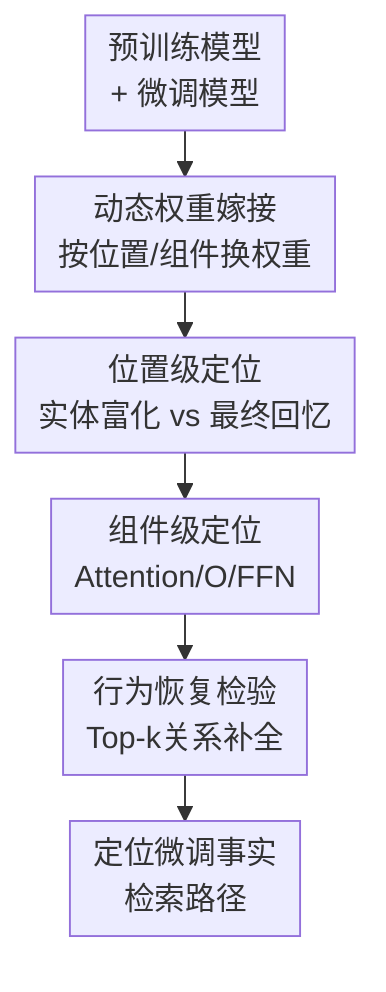

# Dynamic Weight Grafting: Localizing Finetuned Factual Knowledge in Transformers

**会议**: ICLR2026  
**OpenReview**: [https://openreview.net/forum?id=j5vRSKOHmO](https://openreview.net/forum?id=j5vRSKOHmO)  
**代码**: https://github.com/toddnief/dynamic-weight-grafting  
**领域**: 可解释性 / 机制解释 / 知识定位  
**关键词**: 动态权重嫁接、事实知识定位、微调知识、Transformer机制解释、关系补全  

## 一句话总结
这篇论文提出 Dynamic Weight Grafting，通过在生成过程中按 token 位置和 Transformer 组件临时替换微调模型权重，定位 LLM 微调后事实关系知识的检索机制，并发现新知识主要通过实体位置的 enrichment 与最终 token 的 recall 两条路径被取出。

## 研究背景与动机
**领域现状**：LLM 能在预训练中记住大量事实关系，也能通过 supervised finetuning 学会新事实，例如新电影的演员关系、近期事件或被改写的实体属性。机制解释领域通常想回答一个更细的问题：当模型在生成时说出某个事实，它到底是在序列早期已经把事实信息写进实体表示，还是在最后预测前才临时从参数里取出答案？

**现有痛点**：过去常用的 activation patching、ablation 或 residual stream 替换能说明某个激活位置是否重要，但它们有一个关键副作用：一旦替换某层某位置的 residual stream，就会把此前已经流入该位置的信息一起覆盖掉。这样很难区分“这个组件主动检索了新事实”和“这个组件只是携带了上游已经算好的事实信息”。对于微调知识定位来说，这个差异很关键，因为作者想定位的是机制本身，而不是被中途截断后的信息流。

**核心矛盾**：微调后的事实知识可能同时以多种方式发挥作用：实体 token 可能在被处理时已经被“富化”为带关系信息的表示，最终 token 也可能在预测前通过注意力和 FFN 重新调用关系信息。如果干预方法会破坏上游计算，就无法可靠判断哪些路径是充分的、哪些路径是必要的，更无法把行为定位到具体参数矩阵。

**本文目标**：作者要解决三个问题：第一，微调事实关系在生成时主要依赖哪些 token 位置；第二，实体位置 enrichment 与最终 token recall 是否分别足以恢复微调行为；第三，最终 token 的 recall 路径能否进一步定位到 attention、output projection 和 feedforward network 等组件。

**切入角度**：作者没有继续替换激活，而是把预训练模型作为底座，在特定 token 位置临时“嫁接”微调模型的一小部分权重。这样 residual stream 仍然按原来的上游计算往前流，只是某个位置、某个组件执行的是微调后的机制；如果行为恢复，就说明这组权重和位置足以提供相应的微调知识检索能力。

**核心 idea**：用 token-wise、component-wise 的动态权重嫁接替代破坏性的激活替换，把“微调知识在哪里被用到”从激活位置问题改写为“哪些位置和哪些参数机制足以恢复微调行为”的因果定位问题。

## 方法详解

### 整体框架
Dynamic Weight Grafting 的输入是一对共享架构的模型：预训练模型参数 $\theta^{PRE}$ 与经过关系事实监督微调后的模型参数 $\theta^{SFT}$。方法在生成一个 prompt 时逐 token 前向传播，并根据预先设定的嫁接配置 $\gamma_c(t)$，在某些 token 位置临时把某些组件权重从 $\theta^{PRE}$ 换成 $\theta^{SFT}$，前向结束后再恢复为预训练权重。输出不是一个要部署的新模型，而是一系列行为恢复实验：如果只在某些位置或组件嫁接就能接近 SFT 的关系补全表现，那么这些位置或组件就是微调事实知识检索的候选机制。

作者先做 position grafting：在某个 token 位置使用整套微调权重，在其他位置仍使用预训练权重，用来判断实体位置和最终 token 是否足够。随后做 component grafting：只替换 attention、output projection $O$、FFN 等组件，进一步把最终 token 的 recall 路径拆到具体 Transformer 子机制。整套流程保持 KV-cache，使得不同 token 可以由不同权重配置生成，又能让后续 token “看回”此前按对应配置计算出的 keys 与 values。

### 关键设计
**1. 动态权重嫁接：把干预对象从激活改成机制本身**

activation patching 的问题不在于不能产生因果信号，而在于它把“替换某个中间状态”和“切断此前信息来源”绑在一起。本文改为在前向传播时临时替换参数矩阵：给定两个模型的对应组件 $\theta^A_c$ 和 $\theta^B_c$，对 token 位置 $t$ 使用 mask $\gamma_c(t)$ 决定该组件取自哪个模型：$\tilde{\theta}_c(t)=\theta^A_c$ 当 $\gamma_c(t)=0$，否则 $\tilde{\theta}_c(t)=\theta^B_c$。在实验中，$A$ 通常是 pretrained，$B$ 是 SFT。

这个设计的关键是它不直接覆盖 residual stream。模型仍然在同一上下文中逐 token 计算，只是某个位置的某个机制换成了微调版本。于是，如果“最终 token 的后半层 FFN + output projection”嫁接后能恢复关系补全，就更像是在说明这些组件执行了微调后的 relation extraction，而不是说某个 residual stream 向量本身携带了答案。

**2. 位置级嫁接：区分实体富化路径与最终回忆路径**

作者首先把嫁接粒度放到 token position 上：某个位置要么完全用 SFT 权重处理，要么完全用 PRE 权重处理。最重要的配置包括只嫁接 first entity tokens（FE）、只嫁接 last token（LT）、同时嫁接 FE+LT，以及嫁接二者的补集 $(FE+LT)^C$。如果 FE 单独有效，说明模型在看到实体时就能把关系信息写入实体表示；如果 LT 单独有效，说明模型可以在预测前从尚未被 SFT 富化的上下文中重新调用微调关系。

这种位置级设计直接对应论文最核心的发现：微调事实知识不是只存在一个单一路径。部分模型和模板下，实体 enrichment 路径能单独把正确关系对象推到较高排名；另一些情况下，最终 token 的 recall 路径更强。二者合起来几乎恢复完整 SFT 表现，而把二者都排除掉时，表现接近预训练基线，这给“必要且充分”的定位提供了比单点激活替换更清楚的证据。

**3. 组件级嫁接：把 recall 路径拆到 task-specific attention 与 relation-specific FFN/O**

位置级实验只能说明“最终 token 很重要”，但还不能说明最终 token 里是哪类机制在起作用。作者因此设计 component grafting，把 Transformer block 拆成 attention、attention output projection $O$、FFN 以及其中的矩阵，并在最终 token 或实体 token 上分别替换。为避免“模型只是学会了任务格式”与“模型真的学会了被测试关系”混在一起，作者训练了 task model 与 relation model：前者只见过同类句法/语义结构，后者见过测试关系本身。

结果显示，recall 路径不是简单的“attention 负责一切”或“FFN 负责一切”。在 Gemma 和 Llama3 上，最终 token 的 task-specific attention 负责把查询对准实体和任务结构，而 relation-specific 的 $O$ matrix 与后几层 FFN 负责把具体关系对象提取并推向输出分布。尤其是去掉 $O$ 只留 FFN 会明显伤害表现，说明 attention 的输出投影并非普通附属矩阵，而可能是触发后续 relation extraction 的关键接口。

**4. 互补与反事实配置：用补集实验排除隐藏路径**

只证明 FE+LT 有效还不够，因为模型可能还有其他位置也能恢复新事实。作者因此使用补集嫁接：把除了 FE 和 LT 之外的位置全部换成 SFT，而 FE 与 LT 仍保持 PRE。如果这一路径也能恢复表现，那说明还有额外通路；但实验中 $(FE+LT)^C$ 的 top-k accuracy 接近预训练模型，说明大部分可观测关系补全能力确实集中在实体富化与最终回忆两条路径上。

这种补集配置让论文不只是“发现一个有效路径”，而是在有限搜索空间内做了更强的必要性检验。当然，作者也很谨慎：可能仍有未枚举的 grafting scheme 或复杂特征交互，但在他们测试的单跳关系补全设置中，FE 与 LT 是最稳定、最可解释的两个核心位置。

### 一个完整示例
假设训练集中出现了类似 “Zendaya co-starred with Timothée Chalamet” 的新关系，测试时 prompt 只给出 “Zendaya starred in a movie with”。在纯预训练模型中，这个新关系未必存在；在 SFT 模型中，正确对象 token 应该进入 top-k 候选。

如果只在 “Zendaya” 这个 first entity 位置嫁接 SFT 权重，后续 token 仍用 PRE 权重处理，模型仍可能把 “Timothée” 推到较高排名。这说明 SFT 权重在实体被处理时已经把某些关系线索写进 residual stream，后面的通用机制可以沿着这条表示完成补全。反过来，如果只在最后的 “with” 之后、预测前的 last token 位置嫁接 SFT 权重，实体位置并没有被微调权重处理，但模型仍能恢复一部分正确关系，这说明最终 token 位置存在“现取”的 recall 机制。

再进一步，component grafting 会问：这个 last token recall 到底靠什么？如果在最终 token 的后半层嫁接 task attention + relation $O$ + relation FFN，表现恢复；但只嫁接 task FFN 到 first entity 几乎没帮助，就说明 first entity 处需要的是任务结构相关的注意力读写，而关系对象本身主要在最终 token 的 $O$ 与 FFN 中被抽取出来。

### 损失函数 / 训练策略
本文不是提出新的训练目标，而是用受控 finetuning 产生可分析的模型对。所有模型都用 next token prediction 做监督微调，主实验涉及 Llama3、Pythia 2.8B、GPT2-XL 和 Gemma 1.1 等 decoder-only Transformer。数据由 synthetic relation tuples 构成，主要包括 Fake Movies, Real Actors、Fake Movies, Fake Actors、Real Movies, Real Actors (Shuffled) 三类；每类生成约 1,000 个关系元组，并用 article-style 模板和 QA 模板扩展成约 10,000 条训练样本。

训练上，作者报告了 aggressive finetuning 与 less aggressive finetuning 两套设置。主设置使用 AdamW、线性学习率调度、learning rate $2.0e-5$、weight decay $0.01$、batch size 4、10 epochs 与 fp16；较温和设置把 learning rate 降到 $2.0e-6$、weight decay 设为 0，并补充 OpenWebText 和 IMDB 样本以缓解小模型在合成数据上出现的 catastrophic forgetting。评价指标主要是关系补全时目标 token 的 top-k accuracy，正文重点报告 top-5 accuracy，并在附录中说明 top-1、top-10、top-100 与 token rank 呈现相同总体模式。

## 实验关键数据

### 主实验
位置级实验的核心结论是：FE+LT 几乎恢复 SFT，而去掉这两处的补集接近 PRE；单独 FE 或 LT 的强弱随模型而变。由于主文 Figure 2 以柱状图呈现，多数数值没有逐项表格化，下面保留论文明确写出的代表性数字，并用“接近/较弱”标注图中定性趋势。

| 设置 | 观测对象 | 代表结果 | 结论 |
|------|----------|----------|------|
| PRE | 预训练基线 | 接近 0 top-k accuracy | 新关系不在预训练模型行为中稳定可取 |
| SFT | 完整微调模型 | Gemma 关系补全基线可达 100% top-5 | 微调确实写入了关系补全行为 |
| LT only | 只嫁接最终 token | Gemma-1.1 可达 53% top-5，低于 SFT 的 100% | final-token recall 单独足以恢复相当一部分新事实 |
| FE only | 只嫁接 first entity | GPT2-XL 可达 28% top-5 | entity enrichment 单独也能提供部分关系信息 |
| FE+LT | 同时嫁接实体与最终 token | 图中接近完整 SFT 表现 | 两条路径合并几乎足以恢复微调行为 |
| $(FE+LT)^C$ | 嫁接除 FE/LT 外所有位置 | 接近 PRE，近零 top-k accuracy | 排除 FE/LT 后，其他位置难以恢复关系补全 |

组件级实验进一步把 final-token recall 拆到 Transformer 内部。作者尤其强调 Gemma 与 Llama3 上的现象：在 final token 的后半层，$O$ matrix 与 FFN 联合几乎恢复 full attention + FFN 的效果；移除 $O$ 后只用 FFN 会显著掉点。

| 实验 | 模型/设置 | 关键数字或趋势 | 解释 |
|------|-----------|----------------|------|
| final-token component grafting | Gemma, Llama3 | $O$ + full FFN 接近 full attention + full FFN | recall 不需要整套 attention 全部来自 relation model，但需要 output projection 接口 |
| 去掉 $O$，只保留 FFN | Gemma | top-5 accuracy 下降 29% | $O$ 对触发 relation-specific FFN 很重要 |
| 去掉 $O$，只保留 FFN | Llama3 | top-5 accuracy 下降 41% | Llama3 中 $O$ 的作用更强 |
| hybrid grafting | Gemma | task ATTN at FE + task ATTN at LT + relation $O$&FFN at LT 达到 63% top-5 | task attention 负责找到任务结构，relation 组件负责抽取具体对象 |
| hybrid grafting | Llama3 | 同配置达到 34% top-5 | 机制相同但强度弱于 Gemma |
| FE task FFN | Gemma/Llama3 | 几乎不提升 | first entity 处关键不是 FFN 写事实，而是 task-specific attention |

### 消融实验
| 配置 | 关键指标 | 说明 |
|------|---------|------|
| FE+LT | 接近 SFT top-5 | 实体富化和最终回忆两条路径联合时，基本恢复微调后的关系补全能力 |
| FE only | GPT2-XL 代表结果 28% top-5 | 实体位置能够把关系信息提前写入表示，但单独路径通常不如合并路径稳定 |
| LT only | Gemma-1.1 代表结果 53% top-5 | 最终 token 能在预测前执行 just-in-time recall，尤其在较新架构上更强 |
| $(FE+LT)^C$ | 接近 PRE / 近零 | 排除实体和最终 token 后，即使其他位置都嫁接 SFT，也难以恢复新事实 |
| Movie title only | 不足以恢复正确实体 | 电影标题本身不是主要通路；movie title + LT 会提升所有模型，但 movie title + FE 跨模型不一致 |
| finetuned vs pretrained unembedding | 模式基本相同 | unembedding 选择会改变部分单位置数值，但不改变 FE/LT 的总体结论 |
| less aggressive finetuning | 模式相同但单路径更弱 | 降低学习率、取消 weight decay 并加补充数据后，enrichment 与 recall 单独恢复能力下降，但结论仍在 |

### 关键发现
- 第一，微调事实知识的检索不是单点机制，而是至少包含两个可分离路径：first entity 处的 enrichment 和 last token 处的 recall。前者像是在实体表示中提前写入关系线索，后者像是在预测前根据任务结构现取关系对象。
- 第二，FE+LT 的充分性与 $(FE+LT)^C$ 的失败共同构成了论文最有力的定位证据：只看有效路径容易误判为“还有很多其他可用通路”，而补集实验显示这些其他位置并不能单独承担关系补全。
- 第三，recall 路径在 Gemma 和 Llama3 中更强，GPT2-XL 和 Pythia 中 enrichment 路径相对更显眼。这提示不同架构、训练数据和归一化/位置编码设计可能改变事实检索机制的偏好。
- 第四，组件级实验把“最终 token 很重要”进一步具体化为 task-specific attention 与 relation-specific $O$ + FFN 的协作，而不是简单归因给 attention 或 FFN 其中之一。
- 第五，非模板 Wikipedia 电影文章实验也呈现类似趋势：FE+LT 仍接近恢复完整微调表现，补集仍接近 PRE，只是单独 enrichment/recall 路径更弱，因此作者同时报告 top-5 和 top-50。

## 亮点与洞察
- **把知识定位从 activation space 推到 parameter mechanism**：这篇论文最漂亮的地方是没有把 activation patching 再做得更复杂，而是换了干预对象。动态替换权重让上游 residual stream 不被直接覆盖，因此更适合回答“机制是否主动执行了微调后的检索”。
- **必要性和充分性一起做**：FE、LT、FE+LT 说明哪些路径够用，$(FE+LT)^C$ 说明排除这些路径后不够用。对于机制解释论文来说，这比只展示某个 patch 提升表现更可信。
- **揭示微调事实的双路径冗余**：模型既可能在实体处提前 enrichment，也可能在最终 token recall，这解释了为什么单一定位方法常会得到看似矛盾的结果。不同模型可能依赖不同路径，但两条路径一起构成更完整的检索图景。
- **component grafting 的 task/relation 分离很巧妙**：利用 reversal curse 构造 task model 与 relation model，把“会做这个格式的题”和“知道这个具体关系”拆开，避免把任务结构能力误认为事实知识本身。
- **对知识编辑和安全解释都有启发**：如果微调事实可以定位到最终 token 的 $O$ + FFN 与实体处 attention，那么未来可以更细粒度地分析知识编辑、副作用、遗忘与敏感事实泄露，而不只是在整层或整 MLP 级别讨论。

## 局限与展望
- 主体实验是单跳关系补全，且大量依赖合成电影-演员关系模板。虽然作者加入了真实电影文章的非模板实验，但整体复杂度仍低于真实开放域知识问答，不能直接推出多跳事实、长上下文事实或带推理链事实也使用同样路径。
- 评价主要看目标 relation entity 的 next-token top-k accuracy 或 token rank。如果模型“知道”某个事实但没有把它推到下一个 token 分布中，这套指标会看不到；反过来，top-k 中出现正确 token 也不等于模型在完整生成中稳定回答正确。
- 动态权重嫁接本身会创造混合模型，可能让模型不确定并回退到常见 token，如 “the”、标点或高频姓名。作者把它解释为特征混合后的先验回退，但这也说明 grafting 行为不完全等价于自然模型行为。
- grafting scheme 存在组合爆炸。本文探索了最有解释力的一组位置和组件，但并不能穷尽所有隐藏通路；复杂特征之间还可能有互相抵消或互相补偿的现象。
- 组件级定位还停在“哪些矩阵重要”，没有进一步解释这些矩阵中的方向、神经元或特征到底编码了什么。后续可以把 dynamic weight grafting 与 SAE、parameter-space direction analysis 或 task arithmetic 结合，继续向参数内部解释推进。
- 实验规模集中在 1B-3B 量级小模型。更大模型、instruction-tuned 模型、RLHF/安全微调后的模型是否仍呈现同样 FE/LT 分工，需要额外验证。

## 相关工作与启发
- **vs Activation Patching / Path Patching**: activation patching 通过替换 hidden states 来判断某个激活位置是否影响行为，适合做信息流因果分析；本文通过替换权重机制，避免覆盖上游信息，更适合问“这个组件是否执行了微调后的计算”。
- **vs ROME / MEMIT 等知识编辑方法**: 知识编辑通常追求修改模型输出，重点是在哪些参数上编辑最有效；本文不直接编辑事实，而是用微调前后模型的权重差作为探针，定位微调事实在生成时如何被调用。
- **vs Geva et al. 的 factual recall 分析**: 先前工作强调 attention 与 FFN 在事实回忆中的作用，并常通过 knock-out 或 activation intervention 观察性能下降；本文的机制替换实验显示，在 task attention 已具备时，最终 token 的 $O$ + FFN 可以近似恢复 relation recall，因而给出了不同角度的细粒度解释。
- **vs Panigrahi et al. 的 Weight Grafting**: 早期 weight grafting 更像是在参数空间中找一个静态 sparse mask，以恢复微调任务表现；本文的关键扩展是 token-wise dynamic grafting，同一组件可以在不同 token 位置使用不同来源的权重，因此能同时定位位置和机制。
- **启发**: 对未来可解释性研究来说，本文提示我们不要只问“信息在哪个激活向量里”，也要问“哪套参数机制在当前 token 上执行了哪种操作”。对知识更新研究来说，事实可能既被提前写入实体表示，也能在预测前被现取，知识编辑和防泄露方法需要同时考虑两类路径。

## 评分
- 新颖性: ⭐⭐⭐⭐⭐ 方法视角很新，把动态、位置相关的权重嫁接用于微调事实知识定位，明显区别于常规 activation patching。
- 实验充分度: ⭐⭐⭐⭐☆ 主线实验扎实，覆盖多模型、多数据设置和补集/组件消融；不足是大量精确数值以图呈现，且主要任务仍是单跳关系补全。
- 写作质量: ⭐⭐⭐⭐☆ 论文结构清楚，动机和实验逻辑连贯；部分图中结果缺少表格化数字，使读者复核细节时略不方便。
- 价值: ⭐⭐⭐⭐⭐ 对机制解释、知识编辑和微调知识安全都有直接启发，尤其适合作为“参数级因果定位”方向的参考方法。

<!-- RELATED:START -->

## 相关论文

- [\[ACL 2026\] Through a Compressed Lens: Investigating The Impact of Quantization on Factual Knowledge Recall](../../ACL2026/interpretability/through_a_compressed_lens_investigating_the_impact_of_quantization_on_factual_kn.md)
- [\[ACL 2025\] Cracking Factual Knowledge: A Comprehensive Analysis of Degenerate Knowledge Neurons in Large Language Models](../../ACL2025/interpretability/degenerate_knowledge_neurons.md)
- [\[ICLR 2026\] Learning to Interpret Weight Differences in Language Models](learning_to_interpret_weight_differences_in_language_models.md)
- [\[ICLR 2026\] Learning to Weight Parameters for Training Data Attribution](learning_to_weight_parameters_for_training_data_attribution.md)
- [\[ICLR 2026\] Block Recurrent Dynamics in Vision Transformers](block_recurrent_dynamics_in_vision_transformers.md)

<!-- RELATED:END -->
