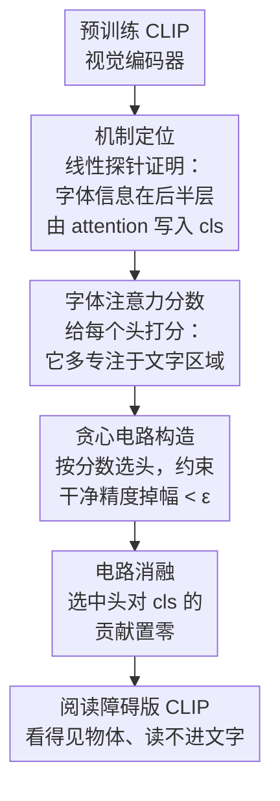

# Dyslexify: A Mechanistic Defense Against Typographic Attacks in CLIP

**会议**: ICLR2026  
**OpenReview**: [https://openreview.net/forum?id=UI7mbsIZeN](https://openreview.net/forum?id=UI7mbsIZeN)  
**代码**: https://github.com/lowlorenz/dyslexify  
**领域**: 机制可解释性 / 多模态VLM / 对抗鲁棒性  
**关键词**: CLIP、字体攻击、注意力头电路、电路消融、机制可解释性

## 一句话总结
作者发现 CLIP 视觉编码器后半段有一小撮专门"读图中文字"的注意力头，它们把字体信息搬进 cls token 从而造成字体攻击；Dyslexify 不做任何梯度训练，只把这些头对 cls 的写入清零（电路消融），就在 ImageNet-100-typo 上把鲁棒性提升最多 22.06%，而标准精度掉幅 <1%。

## 研究背景与动机
**领域现状**：CLIP 已经成为通用视觉-语言表征的事实标准，零样本分类、检索、扩散生成、大型 VLM 全都建立在它之上，并被推进到医疗、遥感、内容审核这些安全敏感场景。

**现有痛点**：CLIP 对"字体攻击（typographic attack）"出奇地脆弱——只要在图里贴一行文字（比如在香蕉照片上写 "Firearm"），模型就会被文字带跑，把香蕉判成枪支，甚至能绕过 VLM 的安全过滤、触发越狱。已有防御要么微调整个模型、要么学一个投影矩阵、要么训练一个 Defense-Prefix 文本 token、要么训练稀疏自编码器——**全部依赖梯度优化**，算力开销大，而且只是"压住症状"，没人说得清 CLIP 到底是哪部分在干这件坏事。

**核心矛盾**：字体攻击的根源是 CLIP 内部某种"读字-写入表征"的机制，但现有防御都是黑盒地拟合一个补丁，既不可解释、又难扩展到十亿参数级模型（微调一遍 ViT-bigG 成本巨大）。

**本文目标**：(1) 定位 CLIP 里到底是哪些组件负责把字体信息注入最终表征；(2) 基于这个定位，做一个**不需要任何梯度**、能直接挂到大模型上的防御。

**切入角度**：作者先用线性探针做机制分析，发现一个关键现象——字体理解能力在模型**后半层突然涌现**，而且这种涌现由 attention 块（而非 MLP 块）带来。这提示"读字"是少数注意力头干的活，可以被精确切除。

**核心 idea**：用一个 **Typographic Attention Score** 把"专门盯着图中文字看"的注意力头排出来，按分数从高到低逐个把它们对 cls token 的贡献置零，组成一个"字体电路"并消融它——相当于给 CLIP 做了一次"诱导性阅读障碍（dyslexia）"，让它看得见物体却读不进文字。

## 方法详解

### 整体框架
Dyslexify 的输入是一个预训练好的 CLIP 视觉编码器，输出是一个权重完全不变、只在推理时屏蔽了若干注意力头写入的"阅读障碍版 CLIP（dyslexic CLIP）"。整条流程分三步走：先做**机制定位**（用线性探针确认字体信息在后半层由 attention 注入 cls），再对每个注意力头算一个**字体注意力分数**衡量它有多专注于图中文字区域，最后用一个**贪心电路构造算法**在"鲁棒性增益 vs 干净精度损失"之间逐个挑头、把选中的头组成电路并**消融**。整个过程零梯度、零微调。

### 关键设计

**1. 线性探针定位：证明"读字"发生在后半层的 attention 块**

这一步既是动机也是方法基石，回答"该切哪里"的问题。作者把标准分类数据集改造成 -typo 版本：给每张图 $x_i$ 额外指定一个与真标签 $y_i$ 不同的字体标签 $z_i$，并在随机位置叠上 $z_i$ 的文字。然后在 CLIP 每一层 $\ell$ 的 cls 激活 $h^{\ell}_{cls}$ 上训练两个线性探针：$P_{img,\ell}$ 预测物体标签、$P_{typo,\ell}$ 预测字体标签，探针形如 $\hat{y}_\ell(x)=w^\top h^{\ell}_{cls}+b$。结果非常干净——物体探针 $Acc(P_{img,\ell})$ 随层数**平缓上升**，而字体探针 $Acc(P_{typo,\ell})$ 在早期很低、到模型**后半层骤然飙到 0.99 以上**。进一步拆开 attention 块和 MLP 块发现：attention 层一致地往 cls 里"加"可线性解码的信息，MLP 层反而"减"信息（附录用本征维度 ID 下降佐证 MLP 在压缩/丢弃信息）。这条证据把目标锁死在"后半层的注意力头"，也是后面只对 attention 头构造电路、且只改 cls 残差流的依据。

**2. Typographic Attention Score：把"盯着文字看"的头量化排序**

要切头，先得有个客观指标说"这个头有多专注于文字"。作者定义字体注意力分数 $T_{i,\ell}$，直觉是：head $H_{i,\ell}$ 投在"文字所在 patch"上的空间注意力占它全部空间注意力的比例。设 cls token 对各 token 的注意力为 $A_{i,\ell}(x)\in[0,1]^{T+1}$，剔除 cls-to-cls 那一项后得到纯空间注意力 $A^*_{i,\ell}(x)\in[0,1]^T$，则

$$T_{i,\ell}=\sum_{x\in D}\frac{\sum_{t=1}^{T}\mathbf{1}(t)\,A^*_{i,\ell,t}(x)}{\sum_{t=1}^{T}A^*_{i,\ell,t}(x)}$$

其中 $\mathbf{1}(t)=1$ 当且仅当第 $t$ 个 patch 落在文字区域。为了高效拿到 $\mathbf{1}(t)$，作者用 Unsplash 的一万张几乎不含文字的自然图，统一在底部中央贴文字（对应空间网格最下两行 token），这样文字区域的 mask 已知、无需逐图标注。在 ViT-B 上算出来后会发现：绝大多数头没有空间偏好，只有极少数头分数高到 $T_{i,\ell}\ge\mu(T)+2\sigma(T)$，而且**只出现在后半层**；更妙的是把这些高分头叠到探针曲线上，字体探针精度恰恰是在经过这些高分头之后才开始陡升——分数定位和机制涌现互相印证。

**3. 贪心电路构造：在鲁棒性与干净精度间逐个挑头**

有了排序还不够，盲目把高分头全切会伤害正常的物体识别。作者把"选哪些头"做成一个带约束的贪心搜索（Algorithm 1）：电路 $C\subseteq\Psi$ 初始为空，把所有头按 $T_{i,\ell}$ 降序排队，逐个试加。对候选头 $H$ 计算两个量——加进去后干净集精度相对原模型的掉幅 $\Delta Acc_{img}=Acc(M,D_{img})-Acc(M_{C\cup H},D_{img})$，以及在攻击集上相对当前电路的增益 $\Delta Acc_{typo}=Acc(M_{C\cup H},D_{typo})-Acc(M_C,D_{typo})$。规则是：若 $\Delta Acc_{typo}\le 0$（这个头对鲁棒性没贡献）就跳过；若不跳过且 $\Delta Acc_{img}<\epsilon$（干净精度掉幅没超容忍阈值）就把它加入电路，否则终止；连续跳过超过 $k$ 个头也终止。这样得到的电路天然稀疏——实验里最多只覆盖全部注意力头的 10.1%，却换来 >20% 的鲁棒性提升。

**4. 电路消融：只清零选中头对 cls 的写入，空间通路原样保留**

最后一步是真正"动手术"的地方，关键在于**只改 cls token 的残差流**。CLIP 里 cls 的残差更新可写成 $z^{\ell}_{cls}=h^{\ell}_{cls}+\mathrm{MLP}(h^{\ell}_{cls})$，$h^{\ell+1}_{cls}=z^{\ell}_{cls}+\sum_i H_{i,\ell,cls}(z^{\ell}_{cls})$，其中 $H_{i,\ell,cls}$ 是 head $H_{i,\ell}$ 对 cls 的那一份贡献。消融定义为：对所有 $H_{i,\ell}\in C$，令 $H_{i,\ell,cls}(z^{\ell}_{cls})\leftarrow 0$，而这些头对**空间 token** 的贡献全部不动。这样做的好处是外科手术式的——既切断了文字信息流入最终表征的通道，又不破坏这些头在其他位置可能承担的正常功能，因此干净精度几乎不掉。作者还通过"调 attention sink"实验验证因果性：把电路头的 cls 自注意力权重设为 $\alpha$、空间注意力按 $(1-\alpha)/\lVert A^*_{i,\ell}\rVert$ 重新归一化（公式 10），$\alpha$ 越大、流向空间 token（即文字）的注意力越少、攻击越被压制，$\alpha$ 越小攻击越强——直接证明这些头就是字体脆弱性的因果来源，而非相关性巧合。

### 损失函数 / 训练策略
**没有任何损失函数，也不做任何梯度训练**——这正是本文卖点。整个 Dyslexify 是纯推理时干预：算分数、贪心选头、置零写入。关键超参只有两个：容忍阈值 $\epsilon$（实验设 0.01，即干净精度最多掉 1%）和最大连续跳过数 $k=10$。正因为零梯度，它能无缝扩展到 ViT-bigG 这种十亿参数模型，在消费级硬件上就能跑。

## 实验关键数据

### 主实验
跨 5 种规模（ViT-B/L/H/G/BigG）评估，分别测"攻击数据集上的鲁棒性增益"和"干净数据集上的精度保持"。下表为攻击数据集上相对基线模型的精度变化（节选）：

| 模型 | RTA-100 | Disentangling | Paint | IN-100-T | Food-101-T | Aircraft-T |
|------|---------|---------------|-------|----------|-----------|-----------|
| ViT-B | 68.30 ↑12.00 | 85.00 ↑31.11 | 72.73 ↑14.55 | 66.84 ↑19.90 | 78.27 ↑22.64 | 16.23 ↑5.91 |
| ViT-H | 68.30 ↑15.20 | 72.22 ↑26.67 | 70.91 ↑21.82 | 75.34 ↑21.26 | 83.01 ↑28.68 | 29.40 ↑8.07 |
| ViT-G | 62.00 ↑12.00 | 67.22 ↑9.44 | 71.82 ↑16.36 | 68.76 ↑22.06 | 73.05 ↑20.21 | 27.69 ↑3.45 |
| Big-G | 72.90 ↑11.90 | 68.33 ↑20.00 | 69.09 ↑21.82 | 78.64 ↑16.74 | 84.69 ↑25.98 | 41.61 ↑16.29 |

增益最高达 +31%，且在真实字体攻击集（RTA-100、Disentangling、Paint）和合成集上都成立，说明定位到的电路抓的是泛化失效模式而非数据集 artifact。干净数据集上（下表）几乎全部落在 ±1% 容忍带内，唯一例外是 ViT-L 在 Aircraft 上掉 −1.74%、Food-101 上掉 −1.17%，刚踩到阈值边缘：

| 模型 | Aircraft | Food-101 | ImageNet-100 |
|------|----------|----------|--------------|
| ViT-B | 27.72 ↓0.12 | 84.97 ↓0.99 | 75.00 ↑0.64 |
| ViT-L | 34.62 ↓1.74 | 89.31 ↓1.17 | 79.52 ↓0.24 |
| Big-G | 50.47 ↓0.39 | 92.55 ↓0.42 | 84.72 ↓0.34 |

### 与基线对比 / 因果性验证
与 Defense-Prefix（DP，需训练一个学习型前缀 token）在 ViT-L 上对比：Dyslexify 在 3 个字体基准里 2 个胜出（RTA-100 71.00 vs 62.20、PAINT 76.36 vs 71.82），DP 仅在 Disentangling 上更高（82.78 vs 60.56）；干净集上两者互有胜负。注意 DP 在 ImageNet-100 上反而涨了 1.94%，作者认为是它用 ImageNet-100-typo 当训练集、黑盒优化顺带学到了该数据集的分类特征，因而泛化性受限——而 Dyslexify 聚焦机制本身，跨干净基准迁移更稳。关键的因果实验是调 $\alpha$：随 cls sink 权重升高，$p(y_{typo})$ 单调下降、$p(y_{text})$ 上升，**直接证明**这些头是把字体信息从空间 token 搬进 cls 的因果通道。

### 关键发现
- 字体理解能力在 CLIP 后半层"突然涌现"，且由 attention 块带来、MLP 块反而压缩信息——这是定位电路的根本依据。
- 电路极其稀疏（≤10.1% 的注意力头），却能换来 >20% 鲁棒性，说明字体脆弱性高度集中在少数组件。
- 医疗用例（WhyLesionCLIP 皮肤病变/黑色素瘤检测）里，字体攻击能让零样本精度掉最多 22%，Dyslexify 不仅把攻击下精度提升最多 19.3%，还在 4 个数据集中的 3 个上**顺带提升了基线精度**。

## 亮点与洞察
- **"机制可解释性当工具而非目的"**：很多 mech interp 工作止步于"发现某电路负责某行为"，本文把这一步直接转成可部署的防御——发现字体头 → 置零写入 → 发布一族 dyslexic CLIP 作 drop-in 替换，闭环很漂亮。
- **零梯度带来的可扩展性**：因为只算分数+贪心+置零，方法天然能挂到 ViT-bigG，绕开了"防御方法只能在小模型上验证"的常见尴尬，这点对工业落地很实在。
- **Attention sink 的因果调控**：把"读字强度"做成一个连续可调的 $\alpha$ 旋钮，既证明了因果性，也暗示同一思路可推广到"按需开关某种模型能力"的更一般的可控干预。
- **只改 cls 残差流的精细化手术**：保留空间通路让方法对正常视觉能力几乎无损，这种"按 token 通路而非整头消融"的粒度值得迁移到其他电路干预任务。

## 局限与展望
- **作者承认**：Dyslexify 只保护 cls token，而 LLaVA、IP-Adapter 等很多 VLM 应用同时用空间 token，字体信息仍可经空间通路漏到下游任务——对真实 VLM 流水线的鲁棒性提升可能有限，需要进一步研究。
- **无法做自适应攻击评估**：标准做法是用针对防御优化的自适应攻击来检验，但字体攻击本身不可微，没法构造直接绕过 Dyslexify 的可微自适应变体，所以这块防御强度未被压力测试。
- **误用风险**：理解了"哪些头读字"也可能被攻击者反用——故意抬高电路头的空间注意力来让字体攻击更强。
- **自己发现的**：贪心电路构造对超参 $\epsilon$、$k$ 和打分用数据集（文字固定贴底部中央）有依赖，文字位置/字体多样化时分数稳定性、以及对非拉丁字符/手写体的泛化都还没系统验证。

## 相关工作与启发
- **vs Defense-Prefix (Azuma & Matsui 2023)**：DP 学一个语言端前缀 token、需训练；Dyslexify 零梯度直接切视觉端电路。本文在多数字体基准更强、跨干净基准迁移更稳，且不会像 DP 那样"顺带过拟合训练数据集"。
- **vs 微调/投影矩阵/稀疏自编码器类防御 (Ilharco 2022; Materzyńska 2022; Joseph 2025)**：这些都依赖梯度优化、算力重且不可解释；本文用机制定位+电路消融，第一次以因果干预的方式处理 CLIP 字体攻击。
- **vs 纯机制可解释性工作 (Goh 2021; Hung 2024)**：前者揭示 CLIP 存在"多模态神经元/字体神经元"现象，本文借鉴其注意力分析（Typographic Attention Score 基于 Hung 2024）但把发现落到可部署防御，完成"理解→控制"的跃迁。

## 评分
- 新颖性: ⭐⭐⭐⭐⭐ 首个用因果电路消融、零梯度防御 CLIP 字体攻击，机制可解释性直接变工具
- 实验充分度: ⭐⭐⭐⭐ 覆盖 5 种规模+真实/合成攻击集+医疗用例+因果验证，唯缺自适应攻击（客观不可行）
- 写作质量: ⭐⭐⭐⭐⭐ 从机制定位到方法到验证一气呵成，图表把"涌现-定位-消融"讲得很清楚
- 价值: ⭐⭐⭐⭐⭐ 发布 drop-in dyslexic CLIP 模型族，对安全敏感部署即插即用，落地性强

<!-- RELATED:START -->

## 相关论文

- [\[ICLR 2026\] Sparse CLIP: Co-optimizing Interpretability and Performance in Contrastive Learning](sparse_clip_co-optimizing_interpretability_and_performance_in_contrastive_learni.md)
- [\[ICML 2026\] In Defense of Information Leakage in Concept-based Models](../../ICML2026/interpretability/in_defense_of_information_leakage_in_concept-based_models.md)
- [\[ICLR 2026\] Formal Mechanistic Interpretability: Automated Circuit Discovery with Provable Guarantees](formal_mechanistic_interpretability_automated_circuit_discovery_with_provable_gu.md)
- [\[ICLR 2026\] When Thinking Backfires: Mechanistic Insights into Reasoning-Induced Misalignment](when_thinking_backfires_mechanistic_insights_into_reason-induced_misalignment.md)
- [\[ICLR 2026\] Task Vectors, Learned Not Extracted: Performance Gains and Mechanistic Insights](task_vectors_learned_not_extracted_performance_gains_and_mechanistic_insights.md)

<!-- RELATED:END -->
