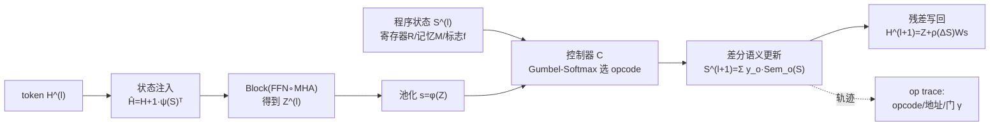

# Emergent Discrete Controller Modules for Symbolic Planning in Transformers

**会议**: ICLR 2026  
**OpenReview**: [https://openreview.net/forum?id=14dlTHVxDX](https://openreview.net/forum?id=14dlTHVxDX)  
**代码**: 待确认  
**领域**: 可解释性 / 神经符号 / 算法推理  
**关键词**: 符号规划, 离散控制器, Gumbel-Softmax, 长度外推, 控制流, 程序状态  

## 一句话总结
在 Transformer 块里嵌入一个由 Gumbel-Softmax 选择的离散控制器，让模型显式执行 `ASSIGN/ADD/COMPARE/BRANCH` 等程序原语并维护寄存器状态，从而获得可证明的控制流表达力、强长度外推和可读的执行轨迹，代价仅约 5–7% FLOPs。

## 研究背景与动机
- **领域现状**：Transformer 在序列建模上无所不能，但天生缺少循环、变量赋值、条件分支这类符号规划构件。神经符号方法要么把符号推理当作后处理步骤，要么外挂规划器/记忆网络带来沉重的架构复杂度。
- **现有痛点**：CLRS、ListOps 等算法基准反复暴露一个事实——标准 Transformer 无法外推到更长的问题实例。Universal Transformer（自适应计算时间）、Compressive Transformer 等虽引入了动态深度，却**没有离散的控制流语义**；它们调节的是"算多久"，而非"按什么程序逻辑算"。
- **核心矛盾**：差分化离散操作（Gumbel-Softmax）早已存在，机制可解释性研究也发现 Transformer 能偶然学到符号行为，但这些行为既不可靠也不可解释——**缺的是一个内生、可验证、留下轨迹的控制流模块**。
- **本文目标**：给 Transformer 的层赋予可验证的控制流语义（循环/分支/赋值），并产出逐步、人类可读的执行轨迹；状态在内部维护，不依赖外部规划器或大型外部记忆。
- **核心 idea**：**离散控制器即程序解释器** —— 在每个（或每 $p$ 个）Transformer 块旁挂一个小控制器，用 Gumbel-Softmax 在固定 opcode 集上做差分化选择，对一份由寄存器/标志位/可选记忆构成的"程序状态"执行确定性语义更新，并把状态变化写回 token 流。

## 方法详解

### 整体框架
模型在标准块 `Block = FFN ∘ MHA` 之外维护一份程序状态 $S^{(l)}=(R^{(l)}, M^{(l)}, f^{(l)})$（寄存器、可选键值记忆、二值标志位）。每个被插桩的层走一个"状态→token→更新状态→写回"的循环：先把状态编码注入 token，让 token 正常过注意力与前馈，再从 token 池化出摘要喂给控制器，控制器选一条 opcode 并更新状态，最后把状态增量写回残差流。训练时只在插桩层记录轨迹（opcode、地址、分支门），$p=2$ 时开销约 5–7% FLOPs。

### 关键设计

**1. Gumbel-Softmax 操作选择器：把"选哪条指令"变成可微分的离散决策。** 控制器从 token 摘要 $s^{(l)}=\phi(H^{(l)})$ 算出 opcode logits $\pi^{(l)}=W_o s^{(l)}+b_o$，然后通过 Gumbel-Softmax 采样一个近似 one-hot 的选择 $y^{(l)}=\mathrm{softmax}\big((\pi^{(l)}+g)/\tau\big)$，其中 $g_k=-\log(-\log u_k)$ 为 Gumbel 噪声。温度 $\tau$ 在训练中退火（$\tau(t)=\max(\tau_{\min},\tau_0 e^{-\gamma t})$），逐渐从软混合收紧到硬选择——这正是控制流能否可靠的关键，消融显示退火后控制器决策熵与外推精度呈强负相关（Pearson $r\approx-0.81$）。寻址同样可微：读/写分布 $\alpha^{(l)},\beta^{(l)}$ 由 softmax 给出，配合值向量 $v^{(l)}=W_v s^{(l)}$ 完成对寄存器的软读写。

**2. 程序原语的差分化语义：让每条 opcode 都有确定性的状态变换。** 操作集 $O=\{\text{ASSIGN, ADD, COMPARE, BRANCH, NOOP}\}$，每条原语在 $(R,M,f)$ 上诱导一个确定映射，再用 $y^{(l)}$ 做凸混合 $S^{(l+1)}=\sum_{o\in O} y^{(l)}_o \,\mathrm{Sem}_o(S^{(l)},r^{(l)},v^{(l)})$。具体地：ASSIGN 以写强度 $\lambda$ 覆盖寄存器 $R^{(l+1)}=(1-\lambda)R^{(l)}+\lambda E(\beta^{(l)})v^{(l)\top}$；ADD 做累加 $R^{(l+1)}=R^{(l)}+E(\beta^{(l)})v^{(l)\top}$；COMPARE 用陡峭 logistic（锐度 $\kappa\gg1$）写标志位 $f^{(l+1)}=\sigma(\kappa[A R^{(l)}-B R^{(l)}])$；BRANCH 由门控 $\gamma^{(l)}=\sigma(w_\gamma^\top f^{(l)}+b_\gamma)$ 在两个共享参数的微型 MLP 子程序之间软插值 $S^{(l+1)}=\gamma^{(l)}\Psi_{\text{then}}(S)+(1-\gamma^{(l)})\Psi_{\text{else}}(S)$。这套设计的妙处是：标志位由 COMPARE 写、被 BRANCH 消费，天然复刻了"先比较再跳转"的命令式控制流。

**3. 与 Transformer 的双向耦合：状态和 token 互相喂养而不外挂记忆。** 一个插桩层按四步走——(i) 状态→token：把状态编码 $b^{(l)}=\psi(S^{(l)})$ 广播加到每个 token 上 $\hat H^{(l)}=H^{(l)}+\mathbf{1}b^{(l)\top}$；(ii) token 更新：$Z^{(l)}=\mathrm{Block}(\hat H^{(l)})$；(iii) token→状态：池化出 $s^{(l)}=\phi(Z^{(l)})$ 交给控制器更新状态；(iv) 残差写回：$H^{(l+1)}=Z^{(l)}+\rho(S^{(l+1)}-S^{(l)})W_s$，只把状态增量对齐回 token 空间。这样程序状态始终在网络内部流动，无需外部记忆库；每 $p$ 个块插一次，相对 FLOP 开销约 $\frac{1}{2p}(d_s/D)^2$，$p=2$ 时典型 5–7%。

**4. 可证明的表达力 + 多目标训练把执行约束到符号语义上。** 理论侧给出 Theorem 1：对任意"有界命令式程序类"$P_{K,B}$（直线代码 + 条件 + 至多 $B$ 次展开的循环，总原语步数 $\le K+B$），存在深度 $L_{\text{net}}=O(K+B)$ 的控制器增强 Transformer，在 $\tau\to0,\kappa\to\infty$ 极限下精确模拟其执行轨迹；有限温度下偏差被界为 $O(L e^{-c_o m_o})+O(L e^{-c_a m_a})+O(L e^{-\kappa m_f})+O(L\tau)$，随退火趋于零。训练损失 $L=L_{\text{task}}+\lambda_{op}L_{op}+\lambda_{sem}L_{sem}+\lambda_{ent}L_{ent}+\lambda_{spar}L_{spar}$：除主任务损失外，可选的轨迹监督 $L_{op}$、语义一致性 $L_{sem}$（罚预测状态转移与声明语义的偏离，并可加守恒约束如 ADD-free 步的 $\|\mathbf{1}^\top R^{(l+1)}-\mathbf{1}^\top R^{(l)}\|^2$）、熵退火 $L_{ent}$ 和写稀疏 $L_{spar}$（促近 one-hot 写、小更新）共同把模型逼向真正的离散程序执行。

## 实验关键数据

### 主实验表格
算法推理（序列级精确率 %，训练长度 $n\le80$，外推 $n\ge160$；9 次运行均值，B7 为注入中间提示的特权对照）：

| 任务 / 模型 | n=80 | n=160 | n=320 | Δlen(80→320) | AUL |
|---|---|---|---|---|---|
| **Sorting** B1 Transformer | 85.4 | 61.2 | 38.7 | −46.7 | 0.69 |
| B6 Soft Modules（非离散） | 93.1 | 78.9 | 66.3 | −26.8 | 0.81 |
| **Ctrl-Transformer (ours)** | **97.4** | **94.1** | **91.6** | **−5.8** | **0.95** |
| B7 External Planner† (特权) | 96.1 | 90.2 | 85.0 | −11.1 | 0.92 |
| **Sum-of-List** B1 | 88.9 | 63.7 | 41.2 | −47.7 | 0.70 |
| B6 Soft Modules | 95.2 | 83.7 | 72.9 | −22.3 | 0.84 |
| **Ctrl-Transformer (ours)** | **98.1** | **95.6** | **93.8** | **−4.3** | **0.96** |
| **BFS** B1 | 86.3 | 71.4 | 57.9 | −28.4 | 0.78 |
| B6 Soft Modules | 92.1 | 83.5 | 74.2 | −17.9 | 0.86 |
| **Ctrl-Transformer (ours)** | **95.3** | **90.8** | **83.5** | **−11.8** | **0.90** |

符号 QA / 程序合成：DROP 全集 F1 88.0（B1 81.2），数值子集 F1 +6.8（85.1 vs 78.3）；RobustFill 风格程序合成 EM 73.9（B1 67.8，+6.1 在多步组合测试集）；Mathematics 算术 82.0（B1 76.1，长加法/混合算子尤强 +4–7）。

### 消融实验表格

| 消融 | 设置 | 结果 |
|---|---|---|
| A1 离散 vs 软 | Gumbel→温度=1 混合 (B6) | $n\ge160$ 外推掉 10–25 分 |
| A2 插桩频率 | $p=1/2/3/4$（Sorting@320） | 92.7/91.6/88.3/84.9，开销 +10.1/+6.4/+4.4/+3.2% |
| A4 语义一致性 | 去掉 $L_{sem}$ | 轨迹对齐降 7 分，Sorting@320 −4.5 分 |
| A5 Knockout | 推理时清零控制器输出 | Sorting@320 91.6→44.8，DROP 数值 F1 85.1→79.0 |

### 关键发现
- **优势随长度放大**：相对最强非特权基线 B6，Sorting 的领先从 $n=80$ 的 +4.3 扩到 $n=320$ 的 +25.3；Sum-of-List 同样单调扩大（+2.9→+20.9）。说明增益不是均匀上移，而是在外推区把"衰减曲线"压平了。
- **衰减压缩**：Sorting 的 80→320 衰减仅 5.8 分（B6 为 26.8，B1 为 46.7），约为 Soft Modules 的 0.22×、vanilla 的 0.12×；换成错误率看，$n=320$ 相对 B6 减少约 75–77%（Sorting/Sum-of-List）。
- **无需特权也能赢**：在 $n=320$ 上 Ctrl-Transformer 在三项任务上全面追平或超过注入中间提示的 External Planner（如 Sorting 91.6 vs 85.0）。
- **执行确实可解释**：操作轨迹与确定性模拟器（FIFO BFS + 升序）的真值 opcode 序列对齐；寄存器角色可被线性探针解码（BFS 的 frontier/parent-pointer 寄存器），测试时随机置换寄存器会显著掉点；定向 knockout 造成局部化精度损失——证明是功能依赖而非表面相关。

## 亮点与洞察
- **把"程序解释器"装进层里而非外挂**：相比 NPI/DNC 等外部记忆/规划器，本文让控制流语义成为 Transformer 残差路径的内生部分，既省去架构复杂度又天然产出可审计轨迹。
- **理论与经验闭环**：Theorem 1 的精确模拟 + 有限温度误差界，正好被"决策熵随退火下降、外推精度上升（$r\approx-0.81$）"的经验现象印证，难得地把可证明性落到了可观测指标上。
- **可解释性是"设计出来的"**：opcode 语义、寄存器角色、标志位→分支的因果链都是显式构造，knockout 与线性探针因此能直接对应到机制，而非事后归因。
- **代价极低**：约 5–7% FLOPs、可稀疏插桩（每 $p$ 层一次），让"控制流能力"成为一个性价比很高的即插即用模块。

## 局限与展望
- **原语集很小**：当前只有 ASSIGN/ADD/COMPARE/BRANCH/NOOP，更丰富的领域（如带类型/数据结构的程序）需要扩展 opcode 与寻址机制。
- **循环靠展开**：表达力证明依赖把循环展开到至多 $B$ 次并映射到深度，长循环会推高所需层数 $O(K+B)$，对超长程序的可扩展性存疑。
- **部分监督依赖合成轨迹**：轨迹监督 $L_{op}$ 和语义一致性 $L_{sem}$ 在合成任务上很有效，但真实任务缺乏 ground-truth opcode，弱监督下能否保持同等可解释性仍待验证。
- **实验偏合成/中等规模**：算法套件与 DROP/RobustFill 之外，尚未在大规模预训练 LLM 上检验该模块能否与既有能力共存并迁移。
- **展望**：作者提到引入类型系统、更复杂数据结构与原语，以及把控制器思想推广到大模型规模。

## 相关工作与启发
- **自适应深度 vs 控制流**：Universal Transformer、Compressive Transformer 调的是计算时间，本文强调的是"可验证控制流语义 + 可读轨迹"，二者正交且可结合。
- **可微分离散化谱系**：直接受益于 Gumbel-Softmax / Concrete 分布与 straight-through 估计，把这些技巧从小模块放大进了层级控制器。
- **神经程序员/可微解释器**：NPI、DNC 等用外部记忆做程序执行；本文的差异是把状态内化进残差流并给出表达力证明与定向可解释性工具。
- **启发**：对追求"机制可解释 + 长度外推"的研究者，这提供了一条"用差分化离散语义约束内部计算"的范式，可迁移到检索、推理链、工具调用等需要显式控制流的场景。

## 评分
- **新颖性**: ⭐⭐⭐⭐ 把可证明的命令式控制流语义内生进 Transformer 残差路径，并配套 opcode 轨迹/寄存器探针/knockout 的可解释性闭环，角度新颖。
- **实验充分度**: ⭐⭐⭐⭐ 三类算法任务 + 符号 QA + 程序合成 + 数学，9 次运行带显著性检验，消融覆盖离散性/插桩频率/语义损失/knockout，但偏合成与中等规模。
- **写作质量**: ⭐⭐⭐⭐ 方法、理论、实验层次清晰，误差界与经验现象互相印证，表格信息密度高。
- **价值**: ⭐⭐⭐⭐ 为"长度外推 + 机制可解释"提供了低成本即插即用模块，对算法推理与神经符号社区有较强参考价值。

<!-- RELATED:START -->

## 相关论文

- [\[ICLR 2026\] Decoupling Positional and Symbolic Attention in Transformers](decoupling_positional_and_symbolic_attention_in_transformers.md)
- [\[ICLR 2026\] Activation Steering with a Feedback Controller](activation_steering_with_a_feedback_controller.md)
- [\[ICLR 2026\] Persona Features Control Emergent Misalignment](persona_features_control_emergent_misalignment.md)
- [\[ICLR 2026\] Latent Planning Emerges with Scale](latent_planning_emerges_with_scale.md)
- [\[ICLR 2026\] Features Emerge as Discrete States: The First Application of SAEs to 3D Representations](features_emerge_as_discrete_states_the_first_application_of_saes_to_3d_represent.md)

<!-- RELATED:END -->
