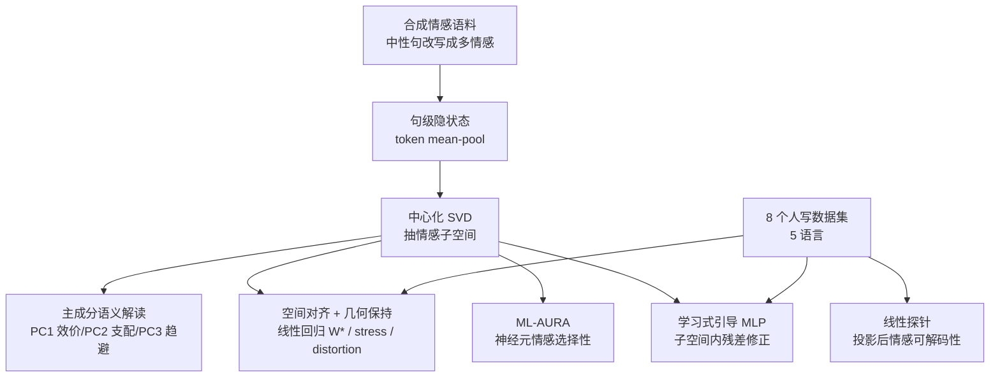

# Emotions Where Art Thou: Understanding and Characterizing the Emotional Latent Space of Large Language Models

**会议**: ICLR 2026  
**OpenReview**: [https://openreview.net/forum?id=72TN9UAtNI](https://openreview.net/forum?id=72TN9UAtNI)  
**代码**: 待确认  
**领域**: 可解释性 / 表示几何  
**关键词**: 情感表示, 隐状态几何, SVD 子空间, 跨语言对齐, 激活引导  

## 一句话总结
本文用 SVD 子空间、几何对齐、神经元选择性（ML-AURA）和学习式引导模块系统刻画了 LLM 隐状态中的"情感潜空间"，发现情感是**方向性编码、跨层分布、跨 8 数据集 5 语言通用**的低维流形，且可在保持语义的前提下被精确操控。

## 研究背景与动机
**领域现状**：NLP 对情感的研究长期停留在两类范式——一类是情感分类（sentiment analysis），证明模型"能识别"情感但不解释"如何在内部表示"；另一类是行为视角，给模型情感场景看它的输出反应，或测它与人类情感判断的对齐度。还有工作把文本映射到 VAD（效价-唤醒-支配）维度或按需生成情感化语言。

**现有痛点**：这些工作几乎都把情感当作**标签或生成条件**来处理，而非一种"内部潜在表示"。它们看的是输出行为或分类准确率，对隐状态里情感编码的**几何结构**几乎没有触碰——分类准确不等于可解释。少数探针工作（如发现 valence 线性可读）又依赖 encoder-only 模型和固定情感词典，且把情感空间"强加"或"监督"出来，而非考察其是否**自发涌现**。

**核心矛盾**：心理学对情感本就有"离散类别说"（Ekman 六基本情感）与"连续维度说"（VAD/Russell 环形模型）之争；神经科学也有"局部定位说"与"分布构造说"之争。如果 LLM 在无情感监督的纯文本预训练中真的内化了某种情感几何，那它到底长什么样、是否跨语言通用、能否被操控，都是开放问题。

**本文目标**：直接从 decoder-only LLM 的隐状态几何中**恢复涌现的情感结构**，回答三件事——情感子空间是否低维可解释、是否跨数据集/语言通用、能否在保语义前提下被精细引导。

**核心 idea**：情感在 LLM 里不是孤立标签，而是一个 **方向性编码、跨层稳定、跨语言通用的低维"情感流形"**；通过对中心化 SVD 子空间做对齐、探针、神经元选择性分析和因果引导，可以把这套"机器情感地理学"完整画出来并加以控制。

## 方法详解

### 整体框架
全套分析建立在一个核心假设上：LLM 隐状态落在低维流形上，情感是其中可线性恢复的主要结构差异。作者用一个**合成情感语料**（把中性句改写成多种情感、让情感成为样本间的主导变化）抽取出"最纯净"的情感方向，再把所有下游评测——跨域对齐、探针、因果引导——全部放到 8 个**人写**情感数据集上验证。围绕这个轴心，论文部署了四组工具：用中心化 SVD 抽情感子空间并解读主成分语义；用几何对齐与失真/应力指标检验跨域是否保结构；用 ML-AURA 检验情感是否在神经元层面分布编码；用一个学习式 MLP 模块做因果引导。

### 关键设计

**1. 中心化 SVD 抽情感子空间：让情感成为主轴。** 对每条输入，先把 token 激活 mean-pool 成一个句向量，堆叠后**中心化再做 SVD**，得到正交的变化方向。关键在于：只要情感是样本间的主导结构差异（这正是合成语料的设计目的），前几个奇异方向就会自然落在情感轴上。为了解读这些主成分的语义，作者沿每个分量考察情感质心的相对排序，并在必要时翻转分量符号统一极性，从而得到跨层可比、可语义解释的稳定排序。这套子空间随后作为对齐、探针、因果操控所有分析的共同基底。

**2. 空间对齐 + 多重几何保持指标：区分"方向一致"与"距离同构"。** 要判断合成流形是否反映真实可迁移的情感编码（而非生成伪影），作者用最小二乘拟合一个线性映射 $W^* = \arg\min_W \lVert YW - X \rVert_F^2$，把合成子空间对齐到人写数据子空间，并报告其 Frobenius 范数（整体幅度）与谱平坦度（各向同性 vs 异性缩放）。但仅有方向对齐不够——质心余弦和回归误差只能说明**全局方向**一致，无法保证情感之间的**相对距离**被保留。为此作者引入一组高维几何指标：Stress-2 衡量距离矩阵嵌入误差 $\frac{\sum_{i<j}(D^{(H)}_{ij}-D^{(L)}_{ij})^2}{\sum_{i<j}(D^{(H)}_{ij})^2}$；平均失真用拉伸比 $\rho_{ij}=\frac{D^{(Y)}_{ij}}{D^{(X)}_{ij}+\varepsilon}$（理想≈1）刻画距离在映射下的整体伸缩，$\ell_2$-失真与 $\sigma$-失真则进一步捕捉缩放是否各向异性。这套组合让作者能精确区分"两空间仅差全局缩放"和"存在异性形变"，并在每个子层统计高失真层占比，定位表示脆弱点。

**3. ML-AURA 神经元选择性：验证分布式而非局部编码。** 把每个神经元看成阈值检测器，对某情感概念用该神经元在 token 上的最大激活作打分，再用一对多 AUROC 衡量它区分目标情感的能力，AUROC>0.9 的神经元记为该情感的"专家单元"。这一步直接对应神经科学的"局部 vs 分布"之争——结果发现情感选择性神经元在各层广泛分布、冗余存在，支持构造主义式解读：情感不是定位在少数单元，而是从大量多用途组件中涌现出高可分性。

**4. 子空间内学习式引导模块：保语义的精细情感操控。** 不同于以往把情感塌缩成二元正负轴的引导，作者在已建好的 SVD 情感子空间内训练一个单层 GELU MLP：对每个情感，挑出那些"加上质心方向能提升一对多分类 AUROC"的层，在这些层把隐状态投影进情感子空间、过 MLP 算出位移、映射回隐状态空间并**残差相加**。训练目标 $L_{total}=L_{token}+L_{sem}$ 两端拉锯：语义保持项 $L_{sem}=(1-\cos(h_{base},h_{shifted}))+\gamma\cdot\frac{\lVert h_{base}-h_{shifted}\rVert_2}{\lVert h_{base}\rVert_2+\lVert h_{shifted}\rVert_2}$ 约束改完别走样；情感控制项用交叉熵加 margin 损失 $L_{margin}=\max(0, m_1-(\log p_{e_i}-\log p_{s_i}))+\max(0, m_2-(\log p_{s_i}-\log p_{e_j}))$，强制目标情感 token 的 logit 超过其同义词 margin $m_1{=}0.5$、且二者超过其他情感 margin $m_2{=}10$，并对情感 token 加权防止模型靠压制无关 token 取巧。每个情感独立训练一个模块，用 SVD 前 40 维。

## 实验关键数据
模型：LLaMA-3.1-8B（主）、OLMo-v2、Ministral（base/instruct）。数据：8 个情感数据集，5 语言（英/西/德/印地/法/意），含 GoEmotions、CARER、SemEval-2007、EmoEvent、Emotions in Drama、Bhaav、MultiEmotions-It、EmoTextToKids。

### 主实验表格（通用性，节选 Table 1）

| 模型 | 语言 | 平均余弦↑ | Stress-2↓ | 平均失真↓ | 探针准确率↑ | 平均 MSE↓ |
|---|---|---|---|---|---|---|
| Llama-Base | 英 | 0.84 | **0.15** | **0.97** | 0.47 | 1.81 |
| Llama-Base | 非英 | 0.84 | 0.18 | 0.96 | 0.40 | 1.81 |
| Llama-Instruct | 英 | **0.93** | 0.22 | 0.78 | 0.40 | 0.93 |
| Llama-Instruct | 非英 | **0.94** | 0.22 | 1.01 | 0.45 | 0.89 |
| OLMov2-Base | 英 | 0.88 | 0.59 | 1.46 | 0.42 | 1.90 |
| OLMov2-Instruct | 英 | 0.90 | 0.32 | 47%* | 0.47 | 1.03 |
| Ministral | 英 | 0.94 | 0.21 | 1.11 | 0.39 | 1.73 |

（*该格为高失真层占比而非原始分数。）所有模型真实-合成情感方向余弦相似度达 0.83–0.93，英语仅略高于非英语，说明跨语言表示保真度近乎相当；指令微调普遍提升对齐、降低回归误差。

### 消融实验表格（神经元选择性 + 主成分语义）

| 分析维度 | 关键结果 |
|---|---|
| ML-AURA（六基本情感，AUROC>0.9 神经元占比） | 平均 75%/层；sadness 98%、surprise 97% 最普遍，fear 48% 最低 |
| ML-AURA（非 Ekman：envy/neutral/excitement） | 平均 88% |
| MLP vs Attention 选择性 | 79% vs 76.5%（MLP 略高） |
| SVD 子空间跨层稳定性（PC1/2/3 Spearman） | 0.87 / 0.83 / 0.80 |
| 主成分语义 | PC1≈效价、PC2≈支配、PC3≈趋避动机、PC4≈唤醒 |
| 引导效果（LLaMA-3.1-8B 英语，Top-1 平均） | 9%→83%（语义损失 0.22） |
| 引导效果（最弱：印地语） | 仍约 +50% 绝对提升 |

### 关键发现
- **方向对齐 ≠ 距离同构**：质心余弦/回归误差显示全局对齐很好，但 stress/distortion 揭示局部相对距离仍可能在大量层被扭曲；OLMo-v2-Instruct 即 stress 低但失真极高（近半层严重过扭曲），说明指令微调改善全局方向对齐却破坏局部几何。
- **情感分布且冗余**：选择性神经元遍布各层、无明显单调深度趋势（峰值在第 26 层 79%），支持构造主义而非局部定位。
- **可控性强**：多数情感引导后 Top-1 准确率超 80%、不少达 90–100%，语义损失保持低位；基本情感（悲伤/愤怒/恐惧）最易控，envy/excitement 等细腻情感及印地语等低资源场景仍不稳定。

## 亮点与洞察
- **把"情感"从标签升级为可测量的几何对象**：用一整套 SVD + 对齐 + stress/distortion + ML-AURA 的工具链，第一次系统刻画了 LLM 情感潜空间的方向性、分布性、跨语言通用性。
- **无监督涌现的心理学维度**：PC1–PC4 在没有任何情感监督下自发对应效价/支配/趋避/唤醒，与 Russell、Mehrabian 等经典情感科学构念惊人吻合，是"模型内化人类情感分类"的强证据。
- **指标设计的洞察力**：明确区分"全局方向对齐"与"局部距离保持"，用 stress 与 distortion 的张力解释了为何高余弦相似度可与局部几何扭曲共存——这对所有做表示对齐的工作都有方法论价值。
- **保语义的细粒度引导**：跨完整情感类别而非二元正负轴的操控，且双损失显式约束语义不漂移，实用性远超此前 53.5% 二元 valence 翻转的工作。

## 局限与展望
- **通用性以预训练覆盖为前提**：在 OOD 场景（19 世纪德语戏剧、低资源印地语）失真与 stress 明显升高，细腻情感（envy/excitement）控制不稳定——情感几何会"变形"但不"塌缩"，仍保持方向一致与高于随机的探针准确率。
- **只在文本单模态**：作者明确指出未来应扩展到多模态模型，考察语言/视觉/语音是否共享情感子空间、能否跨模态引导。
- **缺训练动力学视角**：情感表示在预训练中如何逐步形成尚未考察，需要大模型中间 checkpoint 才能研究。
- **伦理风险**：能操控模型内部情感感知本身是双刃剑，作者在伦理声明中强调引导被刻意限制在中间隐状态、保留语义。

## 相关工作与启发
本文延续了"LLM 隐状态低维流形、语义/句法线性可恢复"的表示几何路线，并接续两类情感工作：一是 valence 线性嵌入探针（Hollinsworth et al. 2024 等，但其塌缩成二元轴）；二是把情感映射到 VAD 的行为研究。与"强加/监督情感空间"的工作（Dathathri、Buechel、Wang & Zong）不同，本文强调**涌现而非监督**；几何对齐借鉴了 Moschella、Lähner & Moeller 的"相关任务潜空间近似刚性可线性对齐"思想。**启发**：(1) 把任意抽象概念（不止情感）当作隐状态几何对象来"测绘"的范式可复用；(2) stress/distortion 这类几何保持指标值得纳入表示对齐的标准评测；(3) "子空间内残差引导 + 双损失保语义"是一个干净的可控编辑模板，可迁移到风格、立场、人格等其他属性的操控。

## 评分
- **新颖性**: ⭐⭐⭐⭐ 把心理学情感维度、神经科学局部/分布之争、表示几何对齐三条线索统一到 LLM 情感潜空间的系统刻画，视角与工具链组合都很新。
- **实验充分度**: ⭐⭐⭐⭐ 3 模型×base/instruct、8 数据集、5 语言，主实验+消融+引导+大量附录，覆盖面扎实；扣分在因果引导主要靠分类率代理、对生成质量评测有限。
- **写作质量**: ⭐⭐⭐⭐ 结构清晰、指标动机交代充分、"方向对齐 vs 距离同构"的张力叙述很有说服力；信息密度高，部分几何指标对非专业读者门槛偏高。
- **价值**: ⭐⭐⭐⭐ 为情感可解释性与可控编辑提供了可复用的方法论与强证据，对安全部署、情感对齐、表示对齐研究都有参考价值。

<!-- RELATED:START -->

## 相关论文

- [\[ICLR 2026\] Neuron-Level Analysis of Cultural Understanding in Large Language Models](neuron-level_analysis_of_cultural_understanding_in_large_language_models.md)
- [\[ICLR 2026\] Internal Planning in Language Models: Characterizing Horizon and Branch Awareness](internal_planning_in_language_models_characterizing_horizon_and_branch_awareness.md)
- [\[ICLR 2026\] The Shape of Adversarial Influence: Characterizing LLM Latent Spaces with Persistent Homology](the_shape_of_adversarial_influence_characterizing_llm_latent_spaces_with_persist.md)
- [\[ICLR 2026\] What Do Large Language Models Know About Opinions?](what_do_large_language_models_know_about_opinions.md)
- [\[ICLR 2026\] Latent Concept Disentanglement in Transformer-based Language Models](latent_concept_disentanglement_in_transformer-based_language_models.md)

<!-- RELATED:END -->
