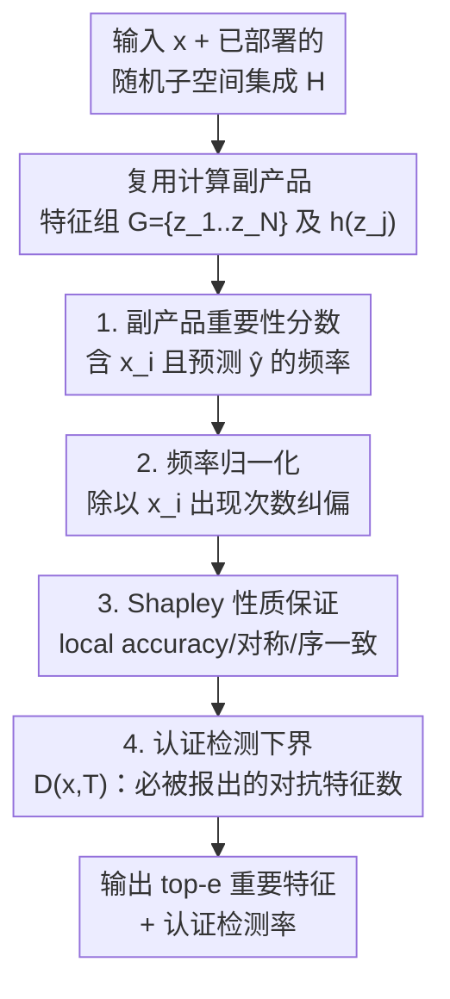

# EnsembleSHAP: Faithful and Certifiably Robust Attribution for Random Subspace Method

**会议**: ICLR 2026  
**OpenReview**: [https://openreview.net/forum?id=u0UjdCMPLc](https://openreview.net/forum?id=u0UjdCMPLc)  
**代码**: https://github.com/Wang-Yanting/EnsembleSHAP  
**领域**: 可解释性 / 特征归因 / AI 安全  
**关键词**: 随机子空间方法, Shapley 值, 特征归因, 可认证鲁棒性, 解释保持攻击

## 一句话总结
本文提出 EnsembleSHAP，一种专为随机子空间方法（random subspace method）设计的特征归因方法，它直接复用集成模型已经算好的子采样预测结果、几乎零额外开销地给出 Shapley 风格的特征重要性，并首次给出针对"解释保持攻击"的可证明鲁棒性保证。

## 研究背景与动机
**领域现状**：随机子空间方法（也叫 attribute bagging）是一类对模型架构无关、只需黑盒访问基模型的集成方法——它把输入 $x$ 的特征随机抽成若干子集，让基模型分别预测，再用多数投票得到最终标签。近几年它成了安全领域的主力工具：构造对 $\ell_0$ 扰动可认证鲁棒的防御（RanMASK 等）、以及对越狱攻击鲁棒的 LLM 防护（RA-LLM、SmoothLLM 等）。

**现有痛点**：人们越来越需要"解释"随机子空间方法的输出——比如越狱防御里要指出输入 prompt 中哪些词导致被判为 harmful；认证防御被强攻击攻破时要找出是哪些对抗词造成误判。但现有顶级黑盒归因方法（Shapley、LIME）用在这里有两个硬伤。其一是算力爆炸：这类方法要对输入随机扰动 $M$ 次，而每个扰动版本喂给集成模型时又要再子采样 $N$ 次才能得到一次集成预测，于是单个样本就要 $M\times N$ 次基模型查询，实践中 $M,N$ 都能上千，开销不可接受。其二是没有安全保证：面对"解释保持攻击"（attacker 改少量特征让模型误分类，却让解释看起来和原来一样，从而隐藏篡改），现有方法无法保证能把这些对抗特征揪出来。

**核心矛盾**：随机子空间方法本身已经很贵（每次预测就要 $N$ 次前向），而外挂的归因方法又把它当黑盒反复调用，等于"贵的东西被又乘了一遍"；同时已有的鲁棒归因理论几乎只研究"预测保持攻击"（保持预测不变、改解释），对真正危险的"解释保持攻击"（改预测、保持解释）缺少可证明的保护。

**本文目标**：设计一个特征归因方法，同时满足三点——计算高效、保留有效归因的关键性质（如 local accuracy）、且对解释保持攻击可认证地鲁棒。

**切入角度**：作者的关键观察是，随机子空间方法在做预测时，已经对一大堆特征子集 $z_j$ 算好了基模型的预测 $h(z_j)$——这些恰恰是计算 Shapley 值所需要的"计算副产品"。与其把集成模型当黑盒再扰动，不如**直接复用这些已有的子采样结果**来估计每个特征的重要性。

**核心 idea**：把某特征 $x_i$ 的重要性定义为"随机抽到的特征组里包含 $x_i$ 且该组预测为 $\hat{y}$ 的概率"，从而仅靠随机子空间方法自身的计算副产品就能算出归因，并在理论上与 Shapley 值保持序一致、对解释保持攻击给出认证检测下界。

## 方法详解

### 整体框架
EnsembleSHAP 的目标是：给定一个已经部署好的随机子空间集成模型 $H$（基模型 $h$、子采样大小 $k$、采样 $N$ 次），对测试输入 $x=\{x_1,\dots,x_d\}$ 及其集成预测 $\hat{y}$，为每个特征 $x_i$ 输出一个重要性分数 $\alpha_i^{\hat{y}}$，并据此找出 top-$e$ 个最重要特征；进一步在对抗设定下给出"被改特征中有多少一定会落进 top-$e$"的可认证下界。

整条流水线是：集成模型预测时本就采样出特征组集合 $G=\{z_1,\dots,z_N\}$ 并算好每个 $h(z_j)$ → EnsembleSHAP 直接拿这些 $(z_j, h(z_j))$ 复用，按"含 $x_i$ 且预测 $\hat{y}$ 的频率"估计重要性分数，并加一个频率归一化项消除小 $N$ 下的偏差 → 理论侧证明该分数保留 Shapley 的 local accuracy、symmetry 并与 Shapley 序一致 → 在攻击者最多改 $T$ 个特征的假设下，推导认证检测尺寸 $D(x,T)$，保证至少这么多对抗特征会被报进 top-$e$。

### 关键设计

**1. 副产品重要性分数：把 Shapley 所需的计算白嫖随机子空间方法自身**

针对"外挂归因要把集成模型反复当黑盒调、$M\times N$ 次查询爆炸"这个痛点，作者不再额外扰动输入，而是把重要性直接定义在随机子空间方法已经采样的那批特征组上。形式上，特征 $x_i$ 对预测标签 $\hat{y}$ 的重要性定义为

$$\alpha_i^{\hat{y}}(x,h,k)=\frac{1}{k}\,\mathbb{E}_{z\sim U(x,k)}\big[\mathbb{I}(x_i\in z)\cdot\mathbb{I}(h(z)=\hat{y})\big],$$

直观含义是"随机抽一个大小为 $k$ 的特征组，它既包含 $x_i$、又被基模型预测成 $\hat{y}$"的概率。其背后的分摊逻辑很朴素：集成输出是所有特征组结果的聚合，对任一组 $z_j$，组内每个特征均分这一组的贡献（各得 $1/k$），不在组里的特征贡献为 0；于是单个特征的总贡献就是它在所有组上的贡献之和。由于 $G$ 里每个 $h(z_j)$ 在集成预测时就已算好，这个分数几乎不增加额外开销（实测约 $0.03$ 秒），彻底绕开了 $M\times N$ 查询。

**2. 频率归一化：纠正小 $N$ 下"出现得多就显得重要"的偏差**

朴素的蒙特卡洛估计 $\frac{1}{k\cdot N}\sum_{j=1}^{N}\mathbb{I}(x_i\in z_j)\mathbb{I}(h(z_j)=\hat{y})$ 在 $N$ 很大时没问题——每个特征出现在差不多数量的组里。但当 $N$ 较小时，各特征在子采样组中的出现频率会有起伏，出现得多的特征会被系统性高估。作者借助恒等式把分数改写为

$$\alpha_i^{\hat{y}}(x,h,k)=\frac{1}{k}\Pr(x_i\in z)\cdot\Pr(h(z)=\hat{y}\mid x_i\in z)=\frac{1}{d}\Pr(h(z)=\hat{y}\mid x_i\in z),$$

于是估计量变为

$$\alpha_i^{\hat{y}}(x,h,k)\approx\frac{1}{d\cdot\sum_{j=1}^{N}\mathbb{I}(x_i\in z_j)}\sum_{j=1}^{N}\mathbb{I}(x_i\in z_j)\cdot\mathbb{I}(h(z_j)=\hat{y}),$$

即把分母从固定的 $N$ 换成"$x_i$ 实际出现的次数 $\sum_j\mathbb{I}(x_i\in z_j)$"。这一改动用"条件概率"而非"联合频率"来度量重要性，消掉了出现频率不均带来的不公平估计，附录 D 的实验证实它能稳定提升归因质量。

**3. Shapley 性质保证：在效率与忠实之间用"序一致"换掉难算的性质**

为说明这个高效分数不是"拍脑袋"，作者证明它继承了 Shapley 值的两条核心性质——**local accuracy**（所有特征重要性之和等于集成预测概率，$\sum_{i\in x}\alpha_i^{\hat{y}}=p_{\hat{y}}(x,h,k)$）与 **symmetry**（对所有子集贡献相同的两个特征得分相同）。同时它把 Shapley 另外两条性质（dummy、linearity）替换成与 Shapley 值的**序一致性**：当且仅当 Shapley 值认为 $i$ 比 $j$ 更重要时，EnsembleSHAP 也给 $i$ 更高分（$\alpha_i^{\hat{y}}\ge\alpha_j^{\hat{y}}\iff\phi_i(p_{\hat{y}})\ge\phi_j(p_{\hat{y}})$）。之所以舍弃 dummy/linearity，是因为 linearity 在子空间设定下不好用，而实践中人们更关心特征间的"相对重要性排序"而非绝对值——fidelity、perturbation curve、faithfulness 这些常用评测指标都只依赖排序。换言之，作者用"放宽到只保证排序正确"换来了可负担的计算，且不损失这些指标下的实用性。

**4. 认证检测下界：首次对"解释保持攻击"给出可证明保护**

针对最危险的解释保持攻击，作者把"解释能不能揪出对抗特征"变成一个可认证的量。设攻击者最多修改 $T$ 个特征使集成预测翻转（扰动集合记为 $B(x,T)$，被改特征记为 $x\ominus x'$），定义**认证检测尺寸**

$$D(x,T)=\arg\max_{r}\ r,\quad \text{s.t.}\ |(x'\ominus x)\cap E(x')|\ge r,\ \forall x'\in B(x,T),\ H(x')\neq H(x),$$

即"无论攻击者怎么改，被改特征里至少有 $r$ 个一定落进 top-$e$ 重要特征集合 $E(x')$"。定理 1 给出了求解 $D(x,T)$ 的优化条件（通过对重要性分数的上下界 $\overline{\alpha},\underline{\alpha}$ 与标签概率界 $\overline{p},\underline{p}$ 构造约束，实践中用二分搜索求最大 $r$）。其证明直觉是：要把标签从 $\hat{y}$ 翻成 $\hat{y}'$，攻击者必须让更多特征组改投 $\hat{y}'$，而他只能影响那些"包含至少一个被改特征"的组——这恰恰会抬高被改特征自身的重要性，使它们更容易被检测到。这是首个对解释保持攻击建立可证明鲁棒性的工作。

### 损失函数 / 训练策略
本方法本身不引入训练目标——它是部署在已有随机子空间集成之上的后验归因。实验里的认证防御设定下，基模型用预训练 BERT，在掩码训练样本上以 AdamW、学习率 $1\times10^{-5}$ 微调 10 个 epoch 以提升认证性能；越狱防御设定下直接用 Vicuna-7B 作基模型，不另训练。

## 实验关键数据

### 主实验
在认证防御场景下用 faithfulness（删除 top-$e$ 重要词后标签翻转的比例，越高越说明找对了关键词）对比 Shapley、LIME、ICL：

| 场景 / 数据集 | 删除比例 | Shapley | LIME | ICL | Ours |
|--------------|---------|---------|------|-----|------|
| 无攻击 · IMDb | 10% | 0.300 | 0.060 | 0.045 | **0.600** |
| 无攻击 · IMDb | 20% | 0.330 | 0.095 | 0.050 | **0.745** |
| 后门攻击 · IMDb | 10% | 0.520 | 0.120 | 0.120 | **0.810** |
| 后门攻击 · IMDb | 20% | 0.540 | 0.180 | 0.170 | **0.910** |
| 对抗攻击 · IMDb | 10% | 0.845 | 0.280 | 0.305 | **0.980** |
| 对抗攻击 · IMDb | 20% | 0.840 | 0.335 | 0.365 | **1.000** |

关键词预测（top-5，给出 ground-truth 关键词时测）后门攻击下 IMDb 的 recall：Ours **0.892** vs Shapley 0.491，差距显著。越狱防御场景（GCG/AutoDAN/DAN）的 faithfulness 同样领先，例如 DAN 删 10% 时 Ours **0.85** vs LIME 0.54 vs Shapley 0.33。

### 消融实验
| 配置 / 因素 | 观察到的影响 | 说明 |
|------------|------------|------|
| 频率归一化项（设计 2） | 去掉后小 $N$ 下归因质量下降 | 附录 D 验证，纠正出现频率不均 |
| 子采样数 $N$ ↑ | faithfulness 与关键词预测都提升 | 重要性估计更精确 |
| 丢弃率 $\rho=1-k/d$ 很大（如 0.9） | faithfulness 下降、关键词预测稳定 | 高丢弃率下集成模型对删除重要特征不敏感 |
| 认证检测：$N$ ↑ 或 $\rho$ ↑ | 认证检测率显著提高 | 对置信度 $\beta$ 不敏感 |
| 认证检测：$T$ ↑（改更多特征） | 认证检测率下降；$e$ ↑ 则上升 | 报更多特征更易覆盖对抗特征 |

### 关键发现
- 复用计算副产品让归因几乎零开销：特征归因约 $0.03$ 秒，连带认证检测也 $<0.5$ 秒，相比 Shapley/LIME 的 $M\times N$ 查询是数量级的节省。
- 提升在"被攻击"的样本上最明显（后门/对抗/越狱），说明该归因确实抓住了导致误判的对抗特征，而不只是清洁样本上的相关性。
- 认证检测率随报告特征数 $e$ 增大而升、随攻击预算 $T$ 增大而降，符合"报得越多越容易覆盖、攻击者改得越多越难全抓"的直觉；方法亦可推广到图像域防御对抗补丁攻击（附录 H）。

## 亮点与洞察
- **"白嫖计算副产品"的视角**：随机子空间方法天然产生大量 $(z_j,h(z_j))$，把它们当成 Shapley 估计的数据，避免了把集成模型当黑盒重复调用——这个"已部署系统的中间结果就是免费的解释素材"思路可迁移到其他 bagging/ensemble 类系统。
- **用"序一致"替代难算性质**：意识到主流忠实度指标只依赖排序，于是大胆放弃 dummy/linearity、只保 local accuracy + symmetry + 序一致，把计算难度降下来又不丢实用性，是一个务实的理论取舍。
- **首次认证"解释保持攻击"**：以往鲁棒归因理论几乎只覆盖预测保持攻击，本文反过来给"改预测、藏解释"这一更危险设定建立了可证明下界 $D(x,T)$，把"解释的安全性"做成了可认证的量。

## 局限与展望
- 方法强绑定随机子空间方法这一特定范式——它的高效性来自复用该方法的子采样副产品，对不走子采样的一般黑盒模型并不直接适用（作者把"一般模型的可证明安全归因"列为未来工作）。
- 放宽 dummy/linearity 后，重要性分数的绝对值不再有 Shapley 的严格语义，只保证排序；若某应用真的需要绝对贡献值（而非排序），本方法的保证会变弱。
- 认证检测下界依赖"攻击者最多改 $T$ 个特征"且需较大 $N$（认证实验默认 $N=10{,}000$）才显著，认证强度与采样预算挂钩；超出 $T$ 或低采样预算时保证退化。
- 实验主要在文本分类（SST-2/IMDb/AGNews）与越狱防御上，图像域只在附录给出，跨模态的系统验证仍有限。

## 相关工作与启发
- **vs Shapley 值**: Shapley 是归因金标准但需对集成模型大量扰动查询且无安全保证；本文复用子采样副产品做到近乎零开销，并证明与 Shapley 序一致、额外给出对解释保持攻击的认证。
- **vs LIME**: LIME 同样要上千次黑盒查询，且在被攻击样本上 faithfulness 远低（IMDb 对抗攻击 10% 仅 0.280 vs Ours 0.980）；本文在效率与忠实度上双重领先。
- **vs 既有鲁棒归因理论**: 以往工作（Wang & Kong 2024、Lin 2023 等）多限于预测保持攻击；本文首次面向解释保持攻击给出可证明检测下界。

## 评分
- 新颖性: ⭐⭐⭐⭐⭐ 把随机子空间方法的计算副产品转化为高效 Shapley 风格归因，并首次认证解释保持攻击，角度新颖
- 实验充分度: ⭐⭐⭐⭐ 覆盖后门/对抗/越狱三类攻击与认证检测，但多数对比表细节在附录、图像域仅附录验证
- 写作质量: ⭐⭐⭐⭐ 定义与性质推导清晰，认证定理较重需结合附录理解
- 价值: ⭐⭐⭐⭐⭐ 给安全关键的随机子空间防御提供了可负担且可证明的解释工具，实用性强

<!-- RELATED:START -->

## 相关论文

- [\[ICLR 2026\] Learning for Highly Faithful Explainability](learning_for_highly_faithful_explainability.md)
- [\[ICML 2026\] Towards Long-Horizon Interpretability: Efficient and Faithful Multi-Token Attribution for Reasoning LLMs](../../ICML2026/interpretability/towards_long-horizon_interpretability_efficient_and_faithful_multi-token_attribu.md)
- [\[ICLR 2026\] Automated Interpretability Metrics Do Not Distinguish Trained and Random Transformers](automated_interpretability_metrics_do_not_distinguish_trained_and_random_transfo.md)
- [\[ICLR 2026\] Toward Faithful Retrieval-Augmented Generation with Sparse Autoencoders](toward_faithful_retrieval-augmented_generation_with_sparse_autoencoders.md)
- [\[ICLR 2026\] Interpretable 3D Neural Object Volumes for Robust Conceptual Reasoning](interpretable_3d_neural_object_volumes_for_robust_conceptual_reasoning.md)

<!-- RELATED:END -->
