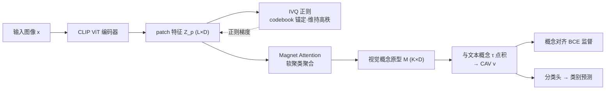

# Escaping Low-Rank Traps: Interpretable Visual Concept Learning via Implicit Vector Quantization

**会议**: ICLR 2026  
**OpenReview**: [https://openreview.net/forum?id=9M2VrpAtR1](https://openreview.net/forum?id=9M2VrpAtR1)  
**代码**: [https://github.com/Daryl-GSJ/IVQ-CBM](https://github.com/Daryl-GSJ/IVQ-CBM)  
**领域**: 可解释 AI / 概念瓶颈模型 (interpretability)  
**关键词**: Concept Bottleneck Model, 表征坍缩, 隐式向量量化, 多对多对齐, 概念聚合  

## 一句话总结
针对概念瓶颈模型 (CBM) 训练中 patch 特征退化到低秩子空间、破坏视觉-概念多对多对齐的「表征坍缩」问题，本文提出把向量量化目标当成正则项而非硬瓶颈的 **隐式向量量化 (IVQ)**，配合 **Magnet Attention** 把高秩 patch 特征聚合成概念原型，在 8 个医学 + 5 个通用基准上同时拿下 SOTA 精度与更好的可解释一致性。

## 研究背景与动机
**领域现状**：概念瓶颈模型 (CBM) 在感知器和任务头之间插入一层人类可理解的「概念层」来实现自解释——先把图像映射到一组预定义语义概念（如「喙的形状」「病灶范围」），再仅凭这些概念激活向量 (CAV) 做最终分类。

**现有痛点**：早期 CBM（LaBo、PCBM、LF-CBM 等）用单个全局视觉特征（CLIP 的 [CLS] token 或全局 embedding）去对齐概念，假设一个全局向量能装下所有视觉属性。这在医学图像这类病灶细碎、零散的复杂场景里根本站不住脚。

**核心矛盾**：作者指出 CBM 鲁棒性的真正前提是 **视觉与概念之间的多对多映射**——一个 patch 可能对应多个概念，一个概念的视觉证据又散布在多个 patch 上。但当后来的工作（ExplicD、MVP-CBM、DOT-CBM）真的去显式建模这种 patch 级关系时，会撞上一个被普遍忽视的根本障碍：**表征坍缩 (representational collapse)**。作者跟踪训练中 patch 特征矩阵的秩，发现它在最初几个 epoch 急剧下降，从满秩 196 一路掉到 70 并触底，特征高度相似、信息冗余，直接摧毁 CAV 的质量。

**核心 idea**：**问题诊断** — 把表征坍缩识别为现代 CBM 的核心病灶，本质是特征多样性的丧失；**关键洞察** — SSL 里的去相关/谱正则虽能维持高秩，但只会「无差别地最大化多样性」，放大对任务无用甚至有害的琐碎细节，CBM 要的是「与人类概念对齐的、有结构的多样性」；**解法** — 用一个轻量正则器把特征锚定到学到的概念原型上，既保持高秩又保证多样性是有语义的。

## 方法详解

### 整体框架
IVQ-CBM 沿用 CBM 两阶段管线 $x \to c \to y$，但在对齐阶段从三个维度联合优化：分类精度、概念对齐、表征多样性与质量。先用预训练 CLIP ViT 抽出 patch token 特征 $Z_p \in \mathbb{R}^{L\times D}$；**IVQ** 作为正则项维持 $Z_p$ 的高秩多样性、把语义信息蒸馏进每个 patch；**Magnet Attention** 再把这些高秩 patch 特征软聚类成 $K$ 个视觉概念原型 $M \in \mathbb{R}^{K\times D}$，与文本概念 embedding $\tau$ 做点积得到概念激活分数，最后送入分类头。

### 关键设计

**1. 隐式向量量化 (IVQ)：把 VQ 目标降级成正则项，绕开硬瓶颈** —— 这是全文的核心创新。标准 VQ 先用 argmin 找最近码本向量，再把量化后的离散特征送进前向传播，这等于把一个 patch 的丰富信息硬压成单个码字，违背多对多原则、制造信息瓶颈。IVQ 反其道而行：照样维护一个可学习码本 $C_{vq}\in\mathbb{R}^{M\times D}$、照样算每个 patch 到最近码字的赋值 $k_j = \arg\min_k \|z_j - c_k\|_2^2$，但**把量化输出 $Z_q$ 丢掉、不进前向**，只保留 codebook loss 与 commitment loss 当作反传时的正则：
$$\mathcal{L}_{IVQ} = \underbrace{\|\text{sg}(Z_p) - Z_q\|_2^2}_{\text{Codebook Loss}} + \beta\underbrace{\|Z_p - \text{sg}(Z_q)\|_2^2}_{\text{Commitment Loss}}$$
其中 $\text{sg}(\cdot)$ 是停梯度算子。这些码本原型像一组互斥的「锚点」，迫使每个 patch 向最近原型靠拢，从而阻止特征分布坍缩进退化子空间——既保住高秩，又因为原型本身对应文本概念（Sec 4.2 验证）而让多样性是「有语义」的，原始高保真特征仍可完整进入前向供 Magnet 使用。

**2. Magnet Attention：把高秩 patch 软聚类成概念原型，显式建多对多** —— 简单的空间池化会丢掉细粒度信息，作者设计了一个可微的软聚类模块来桥接局部特征和高层概念。引入 $K$ 个可学习概念查询 $Q\in\mathbb{R}^{K\times D}$，每个 $q_k$ 像一块「磁铁」吸引与该概念相关的 patch。用负平方欧氏距离算相似度，再对概念维度做 softmax 得到软赋值矩阵：
$$A_{jk} = \frac{\exp(-\|z_j - q_k\|_2^2)}{\sum_{k'=1}^{K}\exp(-\|z_j - q_{k'}\|_2^2)}$$
最终视觉概念原型即 patch 特征的加权平均 $M = A^\top Z_p$。由于一个 patch 可以同时对多个查询有非零权重、一个查询又能聚合多个 patch，这天然实现了 patch↔概念的多对多对应，每个 $M_k$ 汇总了对应语义概念的全部空间证据。

**3. 三路复合损失：精度、可解释、表征质量端到端联合优化** —— 总目标把三件事拼成一个多任务损失。分类损失 $\mathcal{L}_{cls} = \mathcal{L}_{CE}(p_i, y_i)$ 保证最终任务精度；概念对齐损失用二元交叉熵 $\mathcal{L}_{concept} = \mathcal{L}_{BCE}(v_i, c_i)$ 把概念激活分数 $v_i$ 直接监督到多热概念标签 $c_i$ 上，强制模型学到视觉接地、语义有意义的概念；再加上 IVQ 正则。三者等权相加：
$$\mathcal{L} = \mathcal{L}_{cls} + \mathcal{L}_{concept} + \mathcal{L}_{IVQ}$$
其中码本大小 $M$ 设为等于文本概念数 $K$（消融验证此配置最优），让码本原型与概念形成一一对应，正则的多样性恰好落在概念语义上。

## 实验关键数据

### 主实验（ACC %，可解释模型组，节选）

| 方法 | ISIC | NCT | IDRID | BUSI | CUB | C-100 | ImageNet |
|------|------|------|-------|------|-----|-------|----------|
| LaBo (CVPR'23) | 79.20 | 91.73 | 50.77 | 84.01 | 69.88 | 60.17 | 68.04 |
| Explicd (MICCAI'24) | 88.72 | 95.29 | 63.26 | 87.17 | 74.08 | 64.91 | 71.93 |
| MVP-CBM (IJCAI'25) | 87.72 | 97.90 | 65.38 | 89.74 | 74.63 | 65.48 | 72.29 |
| DOT-CBM (CVPR'25) | 86.55 | 90.15 | 58.45 | 85.23 | 72.29 | 63.45 | 69.31 |
| **IVQ-CBM (Ours)** | **90.11** | **99.90** | **67.35** | **93.59** | **75.91** | **67.12** | **73.42** |
| +∆ | +1.39 | +2.00 | +1.97 | +3.85 | +1.28 | +1.64 | +1.13 |

在 8 个医学 + 5 个通用基准上全面超过 8 个强 CBM 基线，甚至优于 ResNet50/ViT 黑盒模型，缓解了「性能 vs 可解释」的长期权衡。BMAC 指标上优势更大（如 IDRID +9.45）。

### 消融实验（Table 3，ISIC/IDRID 节选）

| IVQ | Magnet | ISIC ACC | IDRID ACC | IDRID BMAC |
|-----|--------|----------|-----------|------------|
| ✗ | ✔ | 80.88 | 57.14 | 45.27 |
| ✔ | ✗ | 89.42 | 65.38 | 61.25 |
| ✔ | ✔ | **90.11** | **67.35** | **73.06** |

IVQ 贡献最大，对类别不平衡的 IDRID BMAC 提升达 +11.81；去掉 Magnet 退回 [CLS] 全局特征会明显掉点，印证单一全局向量对细粒度场景是过度简化。

**IVQ vs 显式量化（Table 4）**：在 6 个医学数据集上 IVQ 全面碾压显式 VQ，如 ISIC 分类 BMAC +34.75、概念 BMAC +61.66，证明硬量化的信息瓶颈确实有害。

**vs 通用正则（Table 5）**：相比 Barlow Twins、谱正则、Gram Loss，IVQ 在多数指标更优；且作者发现 Barlow Twins/谱正则在 ISIC、BUSI 上秩更高却性能更差，说明「更高的秩」并不等于「更好的 CBM」——存在过度正则化。

### 关键发现
- 表征坍缩是现代 CBM 的普遍病灶（MVP-CBM、DOT-CBM 都有），数据集越复杂（如 ImageNet）坍缩越严重；IVQ 在所有数据集都维持高且稳定的秩。
- 高秩并非目标本身，「与概念对齐的有结构多样性」才是——这解释了为何 IVQ 优于无差别去相关的通用正则。
- 码本可被解读为一部「视觉字典」，提供额外可解释性，且 $M=K$ 时配置最优。

## 亮点与洞察
- **诊断比方案更有价值**：把「表征坍缩/低秩陷阱」识别为 CBM 多对多对齐的根本障碍，并用秩动态曲线在多个 baseline 上实证，这个问题界定本身就是贡献。
- **「降级 VQ」是个聪明的小改动**：保留 VQ 的语义锚定能力（codebook/commitment loss），却丢掉硬量化的信息瓶颈，一行「丢弃 $Z_q$、只留 loss」就把 VQ 从瓶颈变成正则，轻量且即插即用。
- **对「正则化」的批判性思考**：明确区分「无差别多样性」与「概念对齐的结构化多样性」，并用「高秩反而更差」的反例支撑，避免了盲目追求高秩的误区。

## 局限与展望
- 概念对齐依赖预定义的文本概念标签 $c_i$（多热监督），对没有概念标注的领域不易迁移，本文未讨论概念自动发现。
- 码本大小绑定 $M=K$ 虽简洁，但概念数很大或概念粒度不均时这种一一对应是否最优值得进一步探究。
- 收益主要在细粒度/医学场景显著，通用大规模数据（ImageNet）上增幅相对温和（+1.13），更大规模/更多模态的可扩展性尚待验证。
- 三路损失等权相加，未做权重调参分析，commitment cost $\beta$ 之外的平衡敏感性未充分展开。

## 相关工作与启发
- **CBM 谱系**：从依赖单一全局特征的 LaBo/PCBM/LF-CBM，到用 patch 级 ViT 特征做多对多对齐的 ExplicD/MVP-CBM/DOT-CBM，本文站在后者之上解决其共有的坍缩副作用。
- **表征正则**：与 SSL 里的 Barlow Twins（去相关）、谱正则、DINOv3 的 Gram Loss 对照，指出它们「为多样性而多样性」不适配 CBM 的跨模态结构化需求。
- **启发**：「把一个带硬约束的目标降级成软正则、只取其梯度信号而丢弃前向产物」是一种可推广的设计模式，可迁移到其他需要语义锚定却又怕信息瓶颈的表征学习场景。

## 评分
- **新颖性**: ⭐⭐⭐⭐ 「表征坍缩」诊断 + 「隐式量化」把 VQ 从瓶颈降级为正则的视角都很巧妙，虽然单个组件（VQ、软聚类注意力）非全新，但组合与问题界定有原创性。
- **实验充分度**: ⭐⭐⭐⭐ 13 个数据集（8 医学 + 5 通用）、8 个基线、ACC/BMAC 双指标、显式 vs 隐式量化、多种正则对照、秩动态分析、码本可解释性，相当扎实；缺损失权重敏感性分析。
- **写作质量**: ⭐⭐⭐⭐ RQ 驱动的实验组织清晰，秩动态图与诊断叙事说服力强，公式与符号规范。
- **价值**: ⭐⭐⭐⭐ 同时改善 CBM 的精度与可解释一致性、缓解性能-可解释权衡，且方法轻量即插即用，对医学等高可解释需求场景实用价值高。

<!-- RELATED:START -->

## 相关论文

- [\[ICLR 2026\] Towards Understanding the Nature of Attention with Low-Rank Sparse Decomposition](towards_understanding_the_nature_of_attention_with_low-rank_sparse_decomposition.md)
- [\[ICLR 2026\] Sequences of Logits Reveal the Low Rank Structure of Language Models](sequences_of_logits_reveal_the_low_rank_structure_of_language_models.md)
- [\[ICML 2025\] SLiM: One-shot Quantization and Sparsity with Low-rank Approximation for LLM Weight Compression](../../ICML2025/interpretability/slim_one-shot_quantization_and_sparsity_with_low-rank_approximation_for_llm_weig.md)
- [\[ICLR 2026\] Decomposition of Concept-Level Rules in Visual Scenes](decomposition_of_concept-level_rules_in_visual_scenes.md)
- [\[ICLR 2026\] Sparling: End-to-End Spatial Concept Learning via Extremely Sparse Activations](sparling_end-to-end_spatial_concept_learning_via_extremely_sparse_activations.md)

<!-- RELATED:END -->
