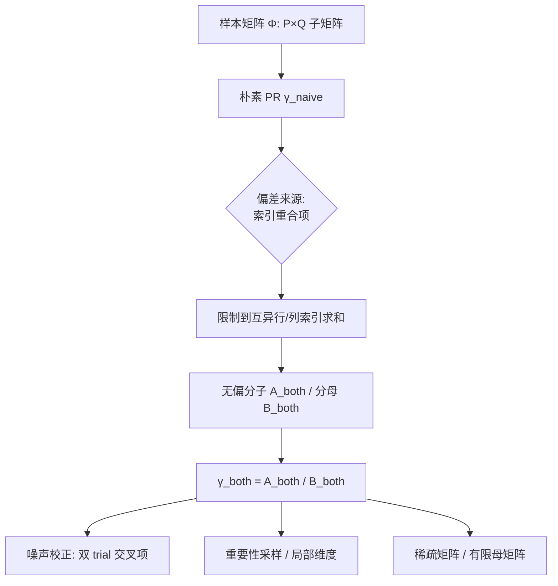

# Estimating Dimensionality of Neural Representations from Finite Samples

**会议**: ICLR 2026  
**OpenReview**: [https://openreview.net/forum?id=iM4o9a83F7](https://openreview.net/forum?id=iM4o9a83F7)  
**代码**: [github.com/badooki/dimensionality](https://github.com/badooki/dimensionality)  
**领域**: interpretability（神经表征维度估计 / 神经科学 + LLM 可解释性）  
**关键词**: 维度估计、Participation Ratio、有限样本偏差、神经流形、表征几何

## 一句话总结
针对"参与比（Participation Ratio）这一全局维度度量在有限样本下严重有偏"的老问题，本文推导出对**行采样、列采样、噪声**同时去偏的无偏估计量 $\gamma_{\text{both}}$，让维度估计在样本数变化时几乎保持不变，并可扩展到稀疏矩阵与局部维度。

## 研究背景与动机
**领域现状**：神经表征可以看作高维空间里的一个"神经流形"，其全局维度（有效秩）是理解大脑与深度网络计算的核心量——它关联分类/回归性能、线性可分性、BCI 解码器设计，也是 LLM 逐层可解释性（如有害内容线性探针）的重要指标。参与比 PR 是其中最常用的"软计数"度量。

**现有痛点**：所有全局维度估计量都对**样本矩阵的行数 $P$（刺激数）和列数 $Q$（神经元数）敏感**。实验上只能记录一部分神经元、呈现一部分刺激，得到的是真实无穷矩阵 $\Phi^{(\infty)}$ 的一个随机子矩阵 $\Phi\in\mathbb{R}^{P\times Q}$，PR 的朴素估计随 $P,Q$ 系统性偏移。局部维度法（如 TwoNN）虽对样本量不敏感，却测不了全局维度且对噪声极敏感。

**核心矛盾**：**既抗有限样本、又抗噪声**的全局维度估计量一直缺失；以往的去偏尝试（Dahmen 2020、Pospisil & Pillow 2024）依赖强分布假设、只修了行采样、且分子分母各自仍有偏。

**本文目标**：用估计论的方式给 PR 做严格去偏，只需极弱假设，同时校正行、列采样偏差与噪声偏差。

**核心 idea**：PR 的分子分母都可写成"对若干索引求和"的形式；偏差恰恰来自**索引重合（overlapping indices）**的项——把求和限制在**互不相等的索引**上，就能得到分子分母的无偏估计。

## 方法详解

### 整体框架
中心化后的真实维度写成比值 $\gamma = A/B$，其中 $A,B$ 都是对四个行索引 $\{i,j,l,r\}$、两个列索引 $\{\alpha,\beta\}$ 的张量 $v^{\alpha\beta}_{ijkl}:=\Phi_{i\alpha}\Phi_{j\alpha}\Phi_{k\beta}\Phi_{l\beta}$ 求平均。朴素估计 $\gamma_{\text{naive}}$ 直接把无穷矩阵换成子矩阵，导致每一项都有偏。本文用"只对互异索引求和"构造无偏的 $A_{\text{both}},B_{\text{both}}$，并配套噪声校正、重要性采样、稀疏矩阵三大扩展。

### 关键设计
**1. 朴素估计的"并联电阻"标度律：点破偏差结构。** 作者先证明朴素 PR 满足一个极直觉的标度律：
$$\mathbb{E}_\Phi\!\left[\frac{1}{\gamma_{\text{naive}}}\right]\approx \frac{1}{P}+\frac{1}{Q}+\frac{1}{\gamma}$$
也就是 $\gamma_{\text{naive}}$ 近似是 $P,Q,\gamma$ 的**调和平均**（如同并联电阻）。这一式子直接说明：样本越少，$1/P+1/Q$ 越大，估计维度被压得越低，从而把"为什么有偏、偏多少"讲清楚。

**2. 互异索引求和的无偏估计 $\gamma_{\text{both}}$：核心去偏。** 把 $A_{\text{naive}}$ 中某一项展开成矩阵元，对 $i\neq j,\ \alpha\neq\beta$ 的项，因行列采样独立可**因式分解**为想要估计的量 $\mathbb{E}[\phi^2]^2$；而"索引重合"的剩余项不可分解，正是偏差源。于是定义只对互异索引求和的算子（$\sum^{\#}$ 表示自由索引取值两两不同）：
$$\langle v^{\alpha\beta}_{ijlr}\rangle_{\text{both}}=\frac{1}{\#\text{summands}}\sum^{\#}_{i,j,l,r}\sum^{\#}_{\alpha,\beta} v^{\alpha\beta}_{ijlr}$$
得到无偏的 $A_{\text{both}},B_{\text{both}}$，最终 $\gamma_{\text{both}}=A_{\text{both}}/B_{\text{both}}$。注意两个无偏量相除会引入一个**不可避免但可忽略**的比值偏差。若只采样了行（神经元全观测），可只对行索引去偏得 $\gamma_{\text{row}}$，反之为 $\gamma_{\text{col}}$。

**3. 互异求和的向量化实现：让方法能跑。** 直接对互异索引求和无法向量化，作者用容斥把它展成普通全索引求和的组合，例如
$$\sum^{\#}_{i,j,k} u_{ijk}\equiv \sum_{ijk}u_{ijk}-\sum_{ij}u_{iij}-\sum_{ij}u_{ijj}-\sum_{ij}u_{iji}+2\sum_i u_{iii}$$
每一项都能用 `einsum` 算。四行两列共六组互异约束，展开式更长但同理可写出，全局估计的时间复杂度与朴素法同阶 $O(\min(P,Q)^2\max(P,Q))$。

**4. 三大扩展：噪声 / 重要性采样 / 稀疏。** (a) **噪声校正**：只需同一刺激-神经元集合的**两次 trial** $\Phi^{(1)},\Phi^{(2)}$，把 $v^{\alpha\beta}_{ijkl}$ 重定义为交叉乘积 $\Phi^{(1)}_{i\alpha}\Phi^{(2)}_{j\alpha}\Phi^{(1)}_{k\beta}\Phi^{(2)}_{l\beta}$，即可把噪声偏差从朴素平均的 $O(1/\sqrt N)$ 降到 $O(1/P+1/Q)$。(b) **重要性采样 / 局部维度**：当观测分布 $\rho^{\text{obs}}$ 偏离目标分布 $\rho$ 时，给每个样本加权 $s_i$（用 IS 权重 $r(x)=\rho_X/\rho^{\text{obs}}_X$）即得 $\gamma^{S}_{\text{both}}$；给某点邻域内的样本赋大权、远处赋零权，就得到**抗噪的局部（内禀）维度** $\gamma^{\text{local}}_{\text{both}}(r)$，弥补 TwoNN 怕噪声的缺陷。(c) **稀疏/有限母矩阵**：只要把"summand 数"定义为不含缺失元的项数，去偏在稀疏（缺测、推荐系统 user-item）矩阵下依然无偏；母矩阵有限 $R\times C$ 时给出无放回采样的对应估计。

## 实验关键数据

### 主实验

| 数据集 / 设置 | 任务 | $\gamma_{\text{both}}$ 表现 | 对照 | 结论 |
|--------|------|------|------|---|
| 合成线性模型 $d=50,\sigma_\epsilon^2=0.2$ | 恢复真维度 | 宽 $P,Q$ 范围内恢复到 ≈50 | naive/row/col 随样本严重漂移 | 无需知道 $\phi$ 与分布即可恢复 |
| 小鼠 V1 钙成像 (Stringer 2019) | 子采样不变性 | 随 $P,Q$ 几乎恒定 | naive 双重有偏 | 跨模态有效 |
| 猕猴 IT 微电极 (Majaj 2015) | 子采样不变性 | 平台值最稳 | row/col 只修一边 | 同上 |
| 猕猴 V4 LFP (Papale 2025) | 子采样不变性 | 最不敏感 | naive 最偏 | 同上 |
| 人类 IT fMRI (Hebart 2023) | 子采样不变性 | 跨 $P,Q$ 恒定 | naive 残留偏差 | 跨模态有效 |
| Llama3 base + FLORES+ (9 语言) | LLM 逐层维度 | 小样本下揭示更细粒度逐层结构 | naive 整体低估 | 仅采样输入，$\gamma_{\text{row}}\approx\gamma_{\text{both}}$ |

### 消融实验

| 配置 | 现象 | 说明 |
|------|------|------|
| 变 $P$ 固定 $Q$ | $\gamma_{\text{row}}$ 近似不变但仍随 $Q$ 偏 | 行去偏只修行采样 |
| 变 $Q$ 固定 $P$ | $\gamma_{\text{col}}$ 不变、对 $P$ 偏 | 列去偏对称 |
| LLM 只采样输入 | $\gamma_{\text{col}}$ 与 naive 一样差，$\gamma_{\text{row}}$ 与 both 一样好 | 印证去偏来源可分解 |
| 局部维度 RFF 合成 (SNR≈3.33) | $\gamma^{\text{local}}_{\text{both}}$ 在小半径恢复真 $d$ | TwoNN 因噪声显著高估、naive 局部低估 |

### 关键发现
- $\gamma_{\text{both}}$ 在四种神经记录模态（钙成像 / LFP / spike / fMRI）上都对样本量最不敏感，用更少样本即可逼近全量维度。
- LLM 逐层维度呈"中层升高、后层回落"的峰形（与 Valeriani 2023、Skean 2025 一致），朴素估计会把这一结构压平。
- 局部维度上，本文方法在小半径极限下远低于 TwoNN，因 TwoNN 对噪声极敏感而过估。

## 亮点与洞察
- **把"偏差"精确归因到索引重合**：一个看似工程化的"对互异索引求和"操作，背后是干净的可分解性论证，理论与实现都简洁。
- **调和平均/并联电阻类比**极具洞察力，让"样本越少维度越被压低"变得可量化、可预测。
- **统一框架**：同一套互异求和 + 加权机制，顺手覆盖噪声校正、重要性采样、局部维度、稀疏矩阵四类现实场景。
- **全局估计零额外代价**：$\gamma_{\text{both}}$ 与朴素法同阶复杂度，几乎是"免费午餐"。

## 局限与展望
- 局部维度需算两两距离，时间 $O(rP^2Q)$、内存 $O(rP(P+Q))$，比 TwoNN 贵（虽可并行）。
- 噪声校正要求同一刺激-神经元集合至少 **2 次 trial**，在某些数据上不可得。
- PR 只刻画谱的一、二阶矩；要还原更多谱信息需估更高阶谱矩（作者指向 Chun 2025 的后续）。
- 稀疏与有限母矩阵估计需假设缺失发生与采样独立、且需知道 $R,C$，现实中未必满足。

## 相关工作与启发
- **vs TwoNN / 局部内禀维度**：TwoNN 对样本量不敏感但测不了全局且怕噪声；本文用加权求和把全局估计量改造成抗噪的局部估计量，正面补齐短板。
- **vs 既往 PR 去偏（Dahmen 2020；Pospisil & Pillow 2024）**：那些方法需强分布假设、只修行采样、分子分母仍有偏；本文仅需极弱假设、行列噪声三方齐修、分子分母分别无偏。
- **vs 子采样饱和曲线 / ad-hoc 外推（Woo 2023；Lehky 2014）**：把"目测饱和"这种经验做法替换成有理论保证的无偏估计。
- **启发**：对任何"比值型谱统计量随样本有偏"的问题（如基于谱熵的表征度量 Skean 2025），互异索引去偏 + 双 trial 交叉项的思路都可能迁移。

## 评分
- 新颖性: ⭐⭐⭐⭐ 把全局维度估计的有限样本偏差做成严格无偏、且行/列/噪声三方齐修，弱假设下的统一框架是实打实的方法贡献。
- 实验充分度: ⭐⭐⭐⭐ 合成 + 四种神经记录模态 + LLM 逐层 + 局部维度全覆盖，但缺与更多现代维度度量的横向对照、且多为"收敛/不变性"定性比较。
- 写作质量: ⭐⭐⭐⭐ 偏差归因与"并联电阻"类比讲得透彻，公式推导清晰；张量索引记号偏重，对非神经科学读者门槛略高。
- 价值: ⭐⭐⭐⭐ 维度估计是神经科学与 LLM 可解释性的高频工具，给出近乎零成本的无偏替代品，落地价值高且已开源。

<!-- RELATED:START -->

## 相关论文

- [\[ICLR 2026\] Addressing Divergent Representations from Causal Interventions on Neural Networks](addressing_divergent_representations_causal.md)
- [\[ICLR 2026\] f-INE: A Hypothesis Testing Framework for Estimating Influence under Training Randomness](f-ine_a_hypothesis_testing_framework_for_estimating_influence_under_training_ran.md)
- [\[ICLR 2026\] LORE: Jointly Learning the Intrinsic Dimensionality and Relative Similarity Structure from Ordinal Data](lore_jointly_learning_the_intrinsic_dimensionality_and_relative_similarity_struc.md)
- [\[ICLR 2026\] Provably Explaining Neural Additive Models](provably_explaining_neural_additive_models.md)
- [\[ICLR 2026\] On The Geometry and Topology of Representations: the Manifolds of Modular Addition](on_the_geometry_and_topology_of_representations_the_manifolds_of_modular_additio.md)

<!-- RELATED:END -->
