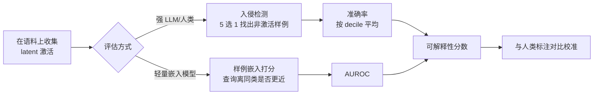

# Evaluating SAE Interpretability Without Generating Explanations

**会议**: ICLR 2026  
**OpenReview**: [https://openreview.net/forum?id=kHhMs642rR](https://openreview.net/forum?id=kHhMs642rR)  
**代码**: 待确认  
**领域**: 可解释性 / 机器学习可解释性  
**关键词**: 稀疏自编码器、SAE 评估、可解释性度量、入侵检测、嵌入打分、机制可解释性  

## 一句话总结
本文提出两种**无需生成自然语言解释**的稀疏自编码器（SAE）可解释性评估方法——入侵句检测（intruder detection）与样例嵌入打分（example embedding scoring），把评估直接建立在 latent 激活样例上，并用人类标注验证 LLM 评判与人类判断高度相关。

## 研究背景与动机

**领域现状**：稀疏自编码器与 transcoder 已成为解释大语言模型的主流工具，它们通过过完备且稀疏的基向量缓解神经元的"多义性"（polysemanticity），让每个 latent 学到更具体、更可解释的特征。但"这些 latent 到底有多可解释"却缺乏共识性的评测标准。

**现有痛点**：目前最流行的评测范式都遵循"先为每个 latent 生成一句自然语言解释，再用这句解释去预测 latent 在新上下文中的激活"的两步流程。这条流水线把**解释生成**和**解释评估**两件事和 latent 本身的可解释性纠缠在了一起：要展示多少示例、展示哪类示例、是否允许 Chain-of-Thought、如何高亮激活 token、解释写成短句还是带例子的长段——这些超参和 prompt 选择都会显著影响最终得分，使得"分数低"无法区分到底是 latent 不可解释还是解释没生成好。

**核心矛盾**：解释中心式范式还隐含一个哲学假设——一个 latent 要可解释，就必须有"能用一句话简洁表达"的含义。本文质疑这个假设：**只要人类能区分激活样例与非激活样例，这个 latent 就是可解释的**，并不强求能写出解释。

**本文目标**：抛开解释生成的所有细节，直接基于 latent 的激活样例度量其可解释性，从而得到更直接、更可能标准化的评估，并验证 LLM 评判能否替代人类。

**核心 idea**：**【绕过解释】** 把"可解释性"重新定义为"激活样例与非激活样例的可分性"，于是评估退化为两个不需要语言解释的判别任务——找出混入的"入侵"样例，或判断激活样例是否在嵌入空间聚类。

## 方法详解

### 整体框架
传统流程是"收集激活 → 生成解释 → 给解释打分"三步，解释是横亘在 latent 与分数之间的间接中介。本文把它压缩为"收集激活 → 直接给激活打分"两步，提出两种打分方式：**入侵检测**（需要较强 LLM 或人类作判别器，精度高）与**样例嵌入打分**（用轻量嵌入模型，速度快、适合大规模）。两种方法都对人类评判者和 LLM 评判者通用，并以人类判断为金标准来校准 LLM。

### 关键设计

**1. 入侵句检测：把可解释性变成"找不同"** 受经典 intruder word detection 启发，作者为每个 latent 采样 4 个激活样例和 1 个不触发该 latent 的"入侵"样例（入侵样例从触发其它 latent 的样例池中抽取），把这 5 条以编号列表呈现给评判者，要求按序号指出入侵者。激活样例中真正激活的 token 用 `<<` `>>` 高亮，非激活样例则随机高亮同样数量的 token 以避免高亮本身泄露答案；每条样例统一截断到 32 token，并配少样本提示演示任务。latent 的分数定义为评判者在该 latent 上的入侵检测准确率，并**按激活分布的十分位（decile）分别采样与平均**——这样既能复用前人按 decile 评估不同激活强度区间的做法，也能比较同一特征在分布不同区段的一致性。随机猜测的期望准确率是 20%，低于此即基本判定为不可解释。与传统词级入侵不同，本文展示完整上下文，因为许多 latent 会在一句话里的多个甚至相邻 token 上激活。

**2. 入侵 decile 检测：探查特征是二元还是标量** 在入侵检测上做一个变体——让全部 5 条样例都激活同一 latent，但"入侵者"来自与其余样例不同的激活 decile。若 latent 是完美单义的二元特征，不同 decile 的样例应当极其相似，该任务准确率会接近随机；若 latent 是带"强度/程度"语义的标量特征，则相邻 decile 难分、远距 decile 易分，且应呈对称性（在低激活样例中找高激活入侵者，与反过来，难度相当）。实验用 Llama 3.1 70b 执行此任务，结果矩阵高度不对称，无法用"多数 decile 与入侵 decile 的距离"完全解释，从而**排除了"多数特征既是二元又是单义"的假设**。

**3. 样例嵌入打分：用嵌入聚类替代 LLM 判别** 入侵检测虽绕过了解释生成，但仍需较强 LLM 才能给出有意义的分数。为提速，作者改用轻量嵌入模型衡量"激活样例是否在嵌入空间聚类"。给定激活样例集 $E^+$、非激活样例集 $E^-$、一个激活查询 $q^+$ 与一个非激活查询 $q^-$，计算每个查询离同类比离异类近多少：

$$\Delta^+ = \frac{1}{N}\left(\sum_{e_i^+\in E^+}\frac{q^+\cdot e_i^+}{\|q^+\|\|e_i^+\|} - \sum_{e_i^-\in E^-}\frac{q^+\cdot e_i^-}{\|q^+\|\|e_i^-\|}\right)$$

$$\Delta^- = \frac{1}{N}\left(\sum_{e_i^-\in E^-}\frac{q^-\cdot e_i^-}{\|q^-\|\|e_i^-\|} - \sum_{e_i^+\in E^+}\frac{q^-\cdot e_i^+}{\|q^-\|\|e_i^+\|}\right)$$

正样例同样从同一 decile 采样、负样例取随机非激活上下文，用 $\Delta^+$ 与 $\Delta^-$ 算出 AUROC 作为该 latent 的分数。该指标与前人的 embedding scoring 思路一致，只是把"解释"替换成了"激活样例"，且按构造天然对称。

**4. 微调嵌入模型以理解高亮标记** 现成嵌入模型在该任务上表现不佳，作者推测它们读不懂 `<<>>` 这种激活 token 高亮的含义。于是选用轻量但性能不错的 `stella_en_400M_v5`，在 Pythia-160m 第 6 层 MLP 的 TopK skip transcoder 上（与评测用的 SAE 不重叠，避免过拟合）筛出约 300 个在 fuzzing 与 detection 上得分均高于 0.7 的特征，构造与样例嵌入相似的（9 激活样例+1 激活查询 / 9 非激活样例+1 非激活查询）数据，用 Multiple Negatives Ranked Loss 微调，使（查询，正样例）相似度相对 batch 内其它元素提升。

## 实验关键数据

评测对象包括作者自训的 4 个 TopK SAE（SmolLM2 135M 第 9/15/21/27 层 MLP，32k 特征，k=32，10B token 训练），以及公开的 Gemmascope（Gemma 2 9b，JumpReLU）、Llama 3.1 8b 残差流 SAE、Pythia-160m skip transcoder 等，以验证方法跨模型/激活函数/稀疏度的普适性。

### 主实验：人类 vs LLM 入侵检测一致性

| 评判者 | 关键结果 |
|--------|----------|
| 人类（105 个 latent） | 平均入侵准确率 64%，最高 decile 平均 78%；1/3 latent 得分 >80%，仅 1/7 低于 30% |
| Claude Sonnet 3.5 | 与人类的 Spearman 相关 0.83，高于以往 SAE 评测指标的一致性 |
| 样例嵌入打分 | 与人类入侵分数相关 r=0.78，与 LLM 入侵分数和人类的相关 r=0.75 相当 |

### 评判者间相关性（入侵检测，56 个 latent 上的 Pearson 相关）

| 评判者 | Human | Llama 70b | Llama 8b | QwQ 32b | Gemini Flash 2.0 | Claude Sonnet 3.5 |
|--------|-------|-----------|----------|---------|------------------|-------------------|
| Human | 1 | 0.76 | 0.52 | 0.78 | 0.80 | 0.84 |
| Claude Sonnet 3.5 | 0.84 | 0.88 | 0.57 | 0.90 | 0.87 | 1 |
| Llama 3.1 8b | 0.52 | 0.54 | 1 | 0.59 | 0.60 | 0.57 |

强模型与人类相关性普遍 >0.80，弱模型（Llama 3.1 8b，准确率仅 27%）相关性显著偏低。两位人类标注者间相关 0.87。

### 关键发现
- **解释不是必需的**：仅靠激活样例，人类就能可靠判别 latent 含义，支持"可解释性≠可用一句话表达"的新定义。
- **激活强度影响可解释性**：最高 decile 的准确率比最低 decile 高出约 20%，但低 decile 仍显著高于随机——低激活样例同样携带 latent 行为信息。
- **LLM 倾向低估**：粗粒度分箱下，人类普遍判定 latent 比 LLM 更可解释，说明 LLM 没有挖出人类看不懂的"牵强"模式，这是个好消息。
- **特征非纯二元单义**：入侵 decile 检测矩阵不对称，许多 (入侵, 多数) decile 对显著高于随机，排除了"多数特征既二元又单义"的假设。
- **嵌入打分高效**：样例嵌入打分用小模型即可达到与强 LLM 入侵检测相当的人类相关性，适合大规模 SAE 评测。

## 亮点与洞察
- **概念层面的重定义**：把"可解释"从"能写出解释"松绑为"激活/非激活可判别"，方法论上直接消除了解释生成引入的一整层超参与 prompt 噪声，让评估更接近 latent 本身的性质。
- **人类金标准 + LLM 代理的闭环**：不是空谈方法优雅，而是真的让作者人工做了 105 个 latent 的入侵任务，用 0.83 的 Spearman 相关坐实"LLM 可替代人类"。
- **decile 入侵这一巧思**：把同一套入侵框架稍作改装，就变成探测"特征是二元还是标量"的工具，顺带证伪了 SAE latent 普遍单义的直觉。
- **嵌入打分的工程价值**：用可微调的小嵌入模型把评测成本降下来，对动辄数万 latent 的 SAE 评测很实用。

## 局限与展望
- **绝对准确率并不高**：人类平均入侵准确率仅 64%，说明大量 latent 即便在这种宽松定义下也只是"中等可解释"，方法是相对比较工具而非绝对认证。
- **样例嵌入分辨力有限**：区分同一特征不同 decile 时，最大 decile 距离的 AUC 也只到 0.7，对"强度语义"的刻画偏弱。
- **依赖高亮与微调**：现成嵌入模型读不懂激活高亮，需要专门微调，迁移到新设置时这步成本不可忽略。
- **未给出"完美标量特征"证据**：作者承认 SAE 中可能存在理想标量特征，但当前实验没有清晰证据，留待后续。
- 评测主要在中小模型（SmolLM2 135M、Pythia-160m、Gemma/Llama 部分层）上，更大模型上的稳健性仍需验证。

## 相关工作与启发
- **入侵任务谱系**：源自主题模型的 word intrusion（Chang et al. 2009）与稀疏词嵌入入侵（Subramanian et al. 2018），以及视觉里的 two-alternative forced choice（Borowski et al. 2020），本文把这一族"判别式"评测搬到了 SAE latent 上。
- **解释中心式评测**：与 Bills et al. 2023 的 simulation scoring、Paulo et al. 2024 的 detection/fuzzing、Templeton et al. 2024 的 rubric score 形成对照——本文正是要去掉它们共有的"先生成解释"环节。
- **因果与概念瓶颈**：与 Paulo & Belrose 2025 用预测激活替换真实激活（多为负面结果）、concept bottleneck models（Koh et al. 2020）相关，启发是"可判别"未必等于"可因果替代"。
- **启发**：判别式、无解释的评测范式可能推广到其它特征/概念可解释性场景（视觉特征图、神经元探针），并为"标准化 SAE 基准"提供一个低耦合的打分原语。

## 评分
- **新颖性**: ⭐⭐⭐⭐ 重新定义可解释性并据此设计两种无解释评测，概念清晰、切中现有评测的痛点。
- **实验充分度**: ⭐⭐⭐⭐ 跨多模型/激活函数验证，且有真实人类标注作金标准、多 LLM 交叉一致性，证据扎实；绝对规模与更大模型覆盖略可加强。
- **写作质量**: ⭐⭐⭐⭐ 动机、方法、结论一条主线讲得透彻，图表对应清楚。
- **价值**: ⭐⭐⭐⭐ 为 SAE 可解释性评测提供了更直接、可标准化且计算高效的工具，对机制可解释性社区有实际意义。

<!-- RELATED:START -->

## 相关论文

- [\[ICLR 2026\] SAE as a Crystal Ball: Interpretable Features Predict Cross-domain Transferability of LLMs without Training](sae_as_a_crystal_ball_interpretable_features_predict_cross-domain_transferabilit.md)
- [\[AAAI 2026\] Using Certifying Constraint Solvers for Generating Step-wise Explanations](../../AAAI2026/interpretability/using_certifying_constraint_solvers_for_generating_step-wise_explanations.md)
- [\[ICML 2025\] Evaluating Neuron Explanations: A Unified Framework with Sanity Checks](../../ICML2025/interpretability/evaluating_neuron_explanations_a_unified_framework_with_sanity_checks.md)
- [\[ICLR 2026\] Grokking in LLM Pretraining? Monitor Memorization-to-Generalization without Test](grokking_in_llm_pretraining_monitor_memorization-to-generalization_without_test.md)
- [\[ICLR 2026\] When Machine Learning Gets Personal: Evaluating Prediction and Explanation](when_machine_learning_gets_personal_evaluating_prediction_and_explanation.md)

<!-- RELATED:END -->
