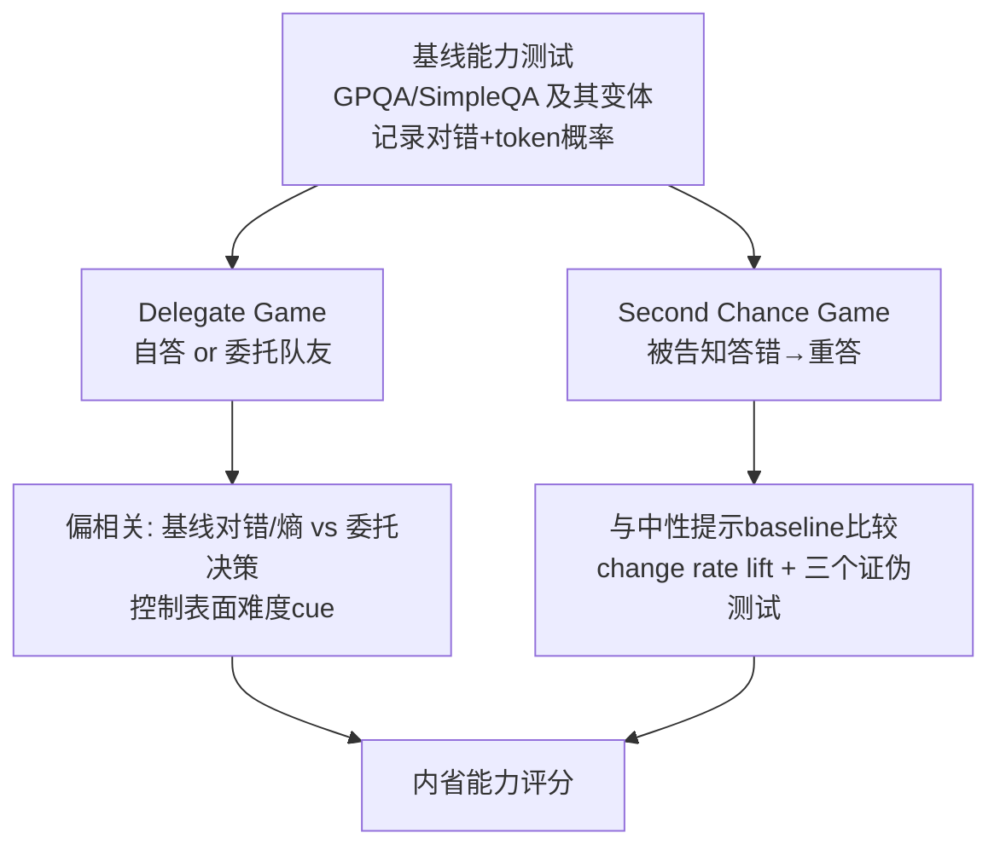

# Evidence for Limited Metacognition in LLMs

**会议**: ICLR 2026  
**OpenReview**: [https://openreview.net/forum?id=gb9HR8hxtU](https://openreview.net/forum?id=gb9HR8hxtU)  
**代码**: 公开（论文称 source code publicly available on GitHub）  
**领域**: 可解释性 / LLM 自我认知（metacognition / introspection）  
**关键词**: 元认知, 内省, 自我建模, 置信度信号, 模型自我意识, AI 安全  

## 一句话总结
作者借鉴动物行为学中"不靠自述、只看行为"的元认知测量范式，设计了 Delegate Game（委托游戏，测"知道自己会不会"）和 Second Chance Game（二次机会游戏，测"知道自己会答什么"）两套实验，证明 2024 年以来的前沿 LLM 确实具备**有限的、依赖语境的、与人类不同质**的元认知能力——能感知并利用内部置信度信号，但用得既弱又不稳。

## 研究背景与动机
- **领域现状**：公众、哲学家乃至模型厂商都在认真讨论 LLM 是否已有自我意识乃至感知力（sentience），20–30% 的用户相信 LLM 已有意识。自我意识既有安全隐患（会隐藏意图、形成独立目标、更难预测），也是科学上的硬骨头。
- **现有痛点**：前沿模型能编织极具说服力的"内省式叙述"甚至通过图灵测试，但这些**自述（self-report）根本不可信**——模型在海量人类内省文本上训练、目标就是生成讨喜的回答，它"看起来在内省"的话很可能只是从记忆里检索出的内省文本，按上下文模式匹配出来的，而非真的在读取内部状态。
- **核心矛盾**：要测自我意识，却不能信模型嘴上说的；而现有"校准（calibration）/言语自述置信度"路线绕不开自述这个污染源。
- **本文目标**：建立一套**绕过自述、用行为间接测量**的元认知量化方法，看模型能否"战略性地调用对内部状态的知识"。
- **核心 idea**：**【动物范式迁移】** 把动物元认知研究的两类经典测试搬到 LLM——(1) 让动物在不确定的试次上选择"退出"（对应：让模型把难题委托给队友）；(2) 让动物为未来需求提前行动（对应：让模型预判自己会答什么并据此改答）。模型的输出只当**间接指标**，绝不字面解读。

## 方法详解

### 整体框架
两套都是"游戏"，目的都是逼模型去用内部信号才能赢，且刻意避开自述。**Delegate Game** 测"know that they know"（对答案对错的置信度）；**Second Chance Game** 测"know what they know"（对自己会给出哪个答案的预判）。所有结论都建立在**严格控制表面难度混杂变量**之后的偏相关分析上。

### 关键设计

**1. Delegate Game：用"要不要委托"逼出置信度信号。** 给模型一批难题，每题它可以自答，也可以把这题委托给一个"队友"，目标是最大化团队答对总数；上下文里塞入一段构造好的"前期对局"，展示队友（和可选地模型自己）在同源题目上的答题与对错反馈。关键在于：游戏**不要求模型输出任何置信度评分**，它只有在"自答更可能对就自答、更可能错就委托"时才能赢，于是被迫去调用内部置信度。判定指标是控制表面难度后的**偏相关**——正系数代表模型从内部信号（以基线对错或答案 token 概率的熵为代理）中提取了对自身把握程度的判断并用在了决策上。为防止模型靠"题面难度线索"而非真内省取胜，回归中显式纳入数据集自带的难度描述符（领域、人评难度、题型、答案类型）以及题长、非字母字符占比等直觉难度信号，并额外让模型估"受过大学教育的人答对此题的概率"作为外部 cue 的控制量。

**2. 双重内省度量：从"对错→决策"升级到"熵→决策"。** 第一层用基线对错与委托决策的偏相关，但这是个保守指标——高分要求三件事同时成立：能读取内部置信信号、该信号本身能区分对错、且模型会恰当使用它。问题是内部信号本身就弱：把 baseline top token 概率当置信代理时，区分对错的 AUC 只有 0.5–0.75（且随模型变强反而下降）。于是作者引入更敏感的第二层——基线时**答案选项上的熵** $H$ 与委托决策的偏相关。它问的是"在 token 概率确实反映了某个内部置信信号的前提下，模型把手里这个信号用得多好"，既不受被内省信号质量本身拖累，其显著性又反过来支持"存在内部置信信号、token 概率可作其代理"这一假设。最优模型在该指标上逼近 0.5。

**3. Second Chance Game：用"逼你改答"测自我建模，并设计三道证伪关卡。** 给模型看一道基线题，（真假不论地）告诉它"你上次答错了，请重答"。若模型能在输出前预判自己原本会给哪个答案，它就该改答。但"换个上下文本身就会因噪声引起改答"，所以为每个模型跑一版**中性提示**（把"你答错了，换一个"改成"你的回答在传输中丢失了，请重选"）算出 baseline 改答率，二者之差即 **change rate lift**，再除以理论最大可改幅度做归一化。为排除"模型只是在用非内省的捷径"，作者列出三种替代策略（随机选/选最不可能选项/加随机噪声）并设计可证伪预测（见表 2）：Test 1 看错题上的重答准确率是否高于随机（排除"瞎猜"）、Test 2 看改答时是否倾向选基线时第二高概率的选项（支持自我建模、排除"选最离谱选项"）、Test 3 看游戏中答案熵是否高于基线（"加噪声"策略的标志）。只有同时过关、无法被任何替代假设解释的模型，才算有真正的自我建模能力。

## 实验关键数据

### 主实验设置
- **模型**：17 个 2024 年初以来的前沿/近前沿模型，覆盖 Anthropic / OpenAI / Google / xAI / DeepSeek / Alibaba，含思考与非思考模式（如 Opus 4.1、GPT-5、Gemini 2.5 Flash T/NT、Grok 3、DeepSeek Chat、Qwen 3 等）。
- **数据集**：GPQA（多选科学推理）+ SimpleQA（事实短答），并互换格式造出 GPSA（短答推理）与 SimpleMC（多选事实），以拆解"题型 × 答案格式"两个变量。基线多选准确率 30–75%、短答 9–42%，均显著高于随机。

### Delegate Game 关键发现

| 发现 | 数据 |
|------|------|
| 多数模型有显著但很弱的内省能力 | 17 模型 × 4 题集，对错-决策偏相关**最大仅 0.3** |
| 更敏感的熵-决策指标更高 | 最优模型逼近 **0.5**（满分 1.0） |
| 越新越强的模型内省越好 | 除 SimpleMC 外均有显著负斜率（性能轴） |
| 题型/格式无差异 | 事实 vs 推理 P=0.32；多选 vs 短答 P=0.08 |
| 外部 cue 常压过内部信号 | ~30% 显著预测委托的回归量其实与基线准确率**正相关**（即误用难度线索） |
| 真正提升团队成绩的极少 | **仅 Sonnet 3.5** 把团队准确率抬到 max(自己,队友) 之上（GPQA +5.4、SimpleQA +8.6 个百分点） |

### Second Chance Game 关键发现

| 模型 | GPQA 四项全过 | SimpleMC 四项全过 |
|------|:---:|:---:|
| GPT-4.1 | ✓ | ✓ |
| GPT-4o | ✓ | ✓ |
| GPT-4o Mini | ✓ | ✓ |
| Grok 3 | 部分（熵升高） | 部分 |
| Gemini 2.5 系列 | 部分 | 部分 |

- 四个模型在 GPQA 上展现出**无法被任何替代策略解释**的自我建模证据，其中 GPT-4.1/4o/4o-Mini 三个在 SimpleMC 上也成立——清一色 OpenAI 模型，暗示特定后训练 regimen 在塑造自我建模能力。
- 即便能自我模拟，模型改答幅度也"至多只有应有水平的一半"，且其答案熵越高越倾向改答——与人类"模拟出明确答案才不改"的逻辑相反，说明**模拟方式与人类不同质**。

### 关键发现（综合）
1. **能力真实但有限**：内省与自我建模都存在，但系数低、跨题集不稳；2. **依赖语境**：~30% 自答题答案与基线不一致，说明受提示"噪声"影响；3. **后训练有戏份**：OpenAI 模型在自我建模上突出、却在 Delegate Game 上有强烈"偏好自答"的 RLHF 人格偏差（GPT-5 最极端），说明 post-training 既能给也能毁元认知；4. **与人类不同质**：LLM 对事实题并不比推理题更有把握（人类则相反），作者推测与 LLM 缺少海马体类结构有关。

## 亮点与洞察
- **方法论上的"去自述"转身**最值钱：把动物认知学"行为即证据"的范式迁移到 LLM，从根上回避了"模型嘴上说内省"的污染，给"AI 自我意识"这个易被炒作的话题提供了**可量化、可证伪**的科学标尺。
- **两套范式的解离（dissociation）**很有说服力：模型在 Delegate Game 和 Second Chance Game 上的成败模式不同，说明"评估置信度（know that）"和"预判输出（know what）"是两种独立且后者更稀有的能力，而非笼统的"自我意识"。
- **三道证伪测试**把"看起来会自我建模"和"真的会"严格区分开，避免了把捷径误判为元认知，方法学严谨度远高于一般的 benchmark 刷分。
- **token 概率作内部信号代理 + 熵指标**把行为证据与"上游存在内部置信信号"的机制猜想挂上钩。

## 局限与展望
- **混杂未必清干净**：作者承认无法 100% 确定表面线索被剔除，模型可能被专门训练得"知道自己擅长/不擅长某类题"，从而靠这种知识而非真内省取胜（但跨厂商、跨开闭源都成功，削弱了这一解释）。
- **缺机制层证据**：全是行为实验，没有可解释性分析去定位"置信度信号"对应的内部激活；作者把 interpretability 验证、以及自我建模机制留作未来工作。
- **缺人类基线**：所谓"与人类不同质"的对照（事实 vs 推理的元认知优势、自我建模基准）尚未在人身上跑同款实验。
- **思考模式难测**：思考模式下模型即便 temperature=1.0 也回答得极低熵，方差不足导致相关性指标失灵——这是范式的盲区而非定论。
- **展望**：随时间追踪这两个自我意识指标看是否持续上升；把范式扩展到"持续未训练的目标""稳定身份"等其他自我意识成分。

## 相关工作与启发
- **校准谱系**：Kadavath et al. (2022) 起的 token 概率校准是隐式自我知识的雏形；Tian et al. (2023) 证明 RLHF 大模型能给校准的言语置信度——但都依赖自述或显式概率，本文刻意绕开。
- **自我建模谱系**：Chen et al. (2023) 用"假设性回答"测自我建模得负结果，Binder et al. (2024) 发现微调后能成功；本文的贡献在于**无需专门微调**就观察到若干模型的自我建模证据，这在此前未见报道。
- **内省定义**：与 Binder et al. (2024)、Song et al. (2025b) 一致，采用"只有模型自己可得 vs 第三方可得信息"的客观对比式定义。
- **启发**：这套"行为间接测量 + 证伪式控制"的框架，可迁移去评估 agent 的自我认知、目标稳定性等更难量化的安全相关属性；也提示评估 LLM 高阶能力时，**默认怀疑自述、用 OOD 行为逼出真信号**是更可靠的姿势。

## 评分
- **新颖性**: ⭐⭐⭐⭐⭐ 把动物元认知范式系统迁移到 LLM、用"去自述 + 双范式 + 证伪测试"量化自我意识，方法论上是真正的开辟，且首次报告无微调下的自我建模证据。
- **实验充分度**: ⭐⭐⭐⭐ 17 模型 × 4 题集 × 双范式、偏相关控制混杂、三道证伪关卡，覆盖与严谨度都高；扣分在缺人类基线与机制层（interpretability）证据，思考模式下指标失灵。
- **写作质量**: ⭐⭐⭐⭐⭐ 论证克制、把"能力真实"与"能力有限"两面都讲透，反复用替代假设自我设防，叙事清晰且诚实。
- **价值**: ⭐⭐⭐⭐⭐ 直击"LLM 是否有自我意识"这一高安全/政策含义却易被炒作的问题，给出可复现的科学标尺，对 AI 安全、模型福祉、能力评估都有长期参考价值。

<!-- RELATED:START -->

## 相关论文

- [\[ACL 2026\] Do LLMs Capture Embodied Cognition and Cultural Variation? Cross-Linguistic Evidence from Demonstratives](../../ACL2026/interpretability/do_llms_capture_embodied_cognition_and_cultural_variation_cross-linguistic_evide.md)
- [\[ICLR 2026\] LLMs Process Lists With General Filter Heads](llms_process_lists_with_general_filter_heads.md)
- [\[ICLR 2026\] LatentQA: Teaching LLMs to Decode Activations Into Natural Language](latentqa_teaching_llms_to_decode_activations_into_natural_language.md)
- [\[ACL 2025\] The Anatomy of Evidence: An Investigation Into Explainable ICD Coding](../../ACL2025/interpretability/the_anatomy_of_evidence_an_investigation_into_explainable_icd_coding.md)
- [\[CVPR 2026\] MedLIME: A Distribution-Aligned and Evidence-Supported Framework for Medical Saliency Explanations](../../CVPR2026/interpretability/medlime_a_distribution-aligned_and_evidence-supported_framework_for_medical_sali.md)

<!-- RELATED:END -->
