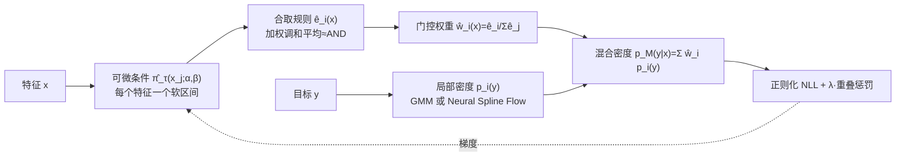

# Explainable Mixture Models through Differentiable Rule Learning

**会议**: ICLR 2026  
**OpenReview**: [https://openreview.net/forum?id=vBEbUTS81u](https://openreview.net/forum?id=vBEbUTS81u)  
**代码**: <https://eda.group/prj/xmm/>  
**领域**: 可解释 AI / 密度估计  
**关键词**: 混合模型, 可解释性, 可微规则学习, 条件密度估计, 子群发现  

## 一句话总结
把混合模型的每个组分与一条「在描述性特征上可读的合取规则」绑定，再用可微的规则学习把这些规则连同混合权重一起用梯度下降学出来，既能像 GMM 一样精准建模多峰分布，又能直接告诉你"每个峰在什么样的人群/条件下出现"。

## 研究背景与动机
**领域现状**：混合模型（如 GMM）是分解多峰分布的经典工具，能把复杂数据拆成若干简单子分布；当手头还有年龄、BMI 这类描述性特征时，人们希望知道"不同子分布在什么条件下出现"。条件密度估计（CDE）方向用混合密度网络（MDN）、核混合网络（KMN）把混合权重和组分参数化为特征的函数来回应这一需求。

**现有痛点**：MDN/KMN 这类方法用黑盒神经网络做 gating，能预测却说不清"哪个组分在何时被激活"；为了可解释而转向树的方法（CADET、CDTree）虽然结构透明，但实践中往往学出很深、叶子极多的树——既容易过拟合，又不支持重叠区域，最终细碎到失去可读性。子群发现（subgroup discovery）虽然把可解释性放在首位，却天然是"局部的"，只挑出一个有趣子集而不建模整个总体。

**核心矛盾**：统计表达力（精准拟合密度）与人类可读性（用简单规则解释组分）这两者，现有方法只能二选一，且谁都不能同时覆盖全域、支持重叠、并精确控制组分数量。

**本文目标**：提出一套框架，使每个混合组分既是数据驱动的灵活密度，又被一条人类可读的规则刻画，集体上又能拟合整个条件分布 $p(y\mid x)$。

**核心 idea**：**[可解释组分]** 把组分定义为"满足某条规则 $e_i(x)=1$ 的样本所诱导的条件分布"而非某个参数族；**[规则即门控]** 用规则的激活值充当 MoE 式的 gating 权重；**[可微规则学习]** 把规则的阈值、特征重要性都做成可微参数，用梯度下降并行学一大批规则再剪枝。

## 方法详解

### 整体框架
XMM 把"混合权重"从黑盒 gating 换成"一组可读规则的激活"。每个组分 $i$ 配一条合取规则 $e_i(x)$（如"18<Age<65 且 BMI>25"），其条件混合权重为 $w_i(x)=e_i(x)/\sum_j e_j(x)$，诱导密度 $p_M(y\mid x)=\sum_i w_i(x)\,p_i(y)$，其中 $p_i(y)$ 是"规则成立子集"上拟合出的局部密度。训练时先把硬阈值条件松弛成可微形式，过参数化地初始化大量规则（k-means++ 锚点），用正则化的负对数似然联合优化，再通过"反向区间"自动剪枝 + BIC 选模得到简洁的规则集。

### 关键设计

**1. 条件 XMM 与同质划分：用条件似然把退化解挡在门外。** 作者先给出边际 XMM 的定义（权重 $w_i=\mathbb{E}[e_i(X)]/\sum_j\mathbb{E}[e_j(X)]$），并证明只要规则构成特征空间的划分（$\sum_i e_i(x)=1$），诱导密度就等于真实边际密度。问题在于：把所有规则设成常数 $e_i(x)=1$ 也能完美拟合边际，所以最大化边际似然学不出有意义的规则。于是转向条件 XMM——权重随特征变化 $w_i(x)=e_i(x)/\sum_j e_j(x)$（Eq.3-4），并证明只有当规则把空间划分成"关于 $Y$ 同质的区域"（区域内 $p_{Y\mid X}(y\mid x)=p_i(y)$）时才能精确还原真实条件密度。这条更强的约束恰好排除了退化解：最大化条件 NLL $\mathrm{NLL}(M)=-\sum_l\log\sum_i w_i(x^{(l)})p_i(y^{(l)})$ 会逼着模型去找"分布发生切换"的真实边界。

**2. 可微合取规则：把"阈值条件 + 逻辑 AND"做成处处可导。** 单个条件 $\mathbb{1}[\alpha_j<x_j<\beta_j]$ 被两个 sigmoid 的乘积松弛为 $\hat\pi_\tau(x_j;\alpha_j,\beta_j)=\sigma\!\big(\tfrac{x_j-\alpha_j}{\tau}\big)\,\sigma\!\big(\tfrac{\beta_j-x_j}{\tau}\big)$，温度 $\tau$ 在训练中退火到 0，从软约束平滑过渡到硬区间。多个条件用**加权调和平均**拼成规则：

$$\hat e(x;\theta)=\frac{\sum_j a_j}{\sum_j a_j\,\hat\pi_\tau(x_j)^{-1}},\quad a_j\ge 0.$$

它逼近逻辑 AND——任一条件接近 0 其倒数爆大、整体激活被拉低；只有全部条件都高时 $\hat e(x)\approx 1$。非负权重 $a_j$ 表示特征在规则里的重要性，令 $a_j=0$ 就等价于把该条件从规则中删掉，使优化器能自动"摘掉"无用特征，让规则保持短小可读。这套可微化避开了规则数随特征数指数爆炸的组合搜索，让一大批规则可以并行用梯度一起学。

**3. 重叠惩罚：在"精确划分"和"宽泛可读"之间调一个旋钮。** 完美划分能精确拟合，但人们有时更想要边界宽一点、能轻微重叠的概括性规则。作者加了一个重叠惩罚 $R(M)=\tfrac{1}{n}\sum_l\big(1-\sum_i w_i(x^{(l)})^2\big)$：由于权重恒和为 1，平方项在"恰好一个规则激活"时最大、即惩罚最小，于是该项把权重往稀疏（单一组分主导）方向推。总目标是 $\min_M \mathrm{NLL}(M)+\lambda R(M)$，$\lambda$ 直接控制允许多少重叠。实验显示对 XMM-GMM，$\lambda=0.3$ 能少用 16% 规则而几乎不损似然，说明被剪掉的都是冗余规则。

**4. 过参数化—剪枝—BIC 选模：让"该有几个组分"自己浮现。** 借可微优化能并行训练大量规则的优势，作者**故意把初始规则数 $k$ 开大**以保证覆盖，并用 k-means++ 质心做锚点初始化（随机初始化覆盖差，随机样本锚点有缺口）。剪枝主要靠优化本身：一条没用的规则会被学成"反向区间"（$\alpha_{ij}>\beta_{ij}$）使其处处激活为 0、梯度消失从而被淘汰；训练中定期检查并彻底关掉这类死规则，近似重复的规则再做后处理合并。最后用 $\mathrm{BIC}(M)=2\cdot\mathrm{NLL}(M)+|\Theta|\log n$ 在表达力与复杂度间权衡——注意 $|\Theta|$ 只数规则网络的参数、不数局部密度估计器，因为后者被视作数据诱导的——在一组 $k$ 中选 BIC 最优者，从而无需对每个数据集手调组分数。

## 实验关键数据

### 主实验表格（真实数据 NLL，越低越好，节选）
16 个 UCI 数据集上比较可解释方法与黑盒方法，报告测试集 NLL 与平均排名。

| 数据集 | XMM-GMM | XMM-GMM(BIC) | XMM-NSF | CDTree | CADET | CVAE | KMN | MDN |
|---|---|---|---|---|---|---|---|---|
| SkillCraft | **-4.11** | -4.19 | -3.58 | -4.03 | 2.23 | 1.61 | -0.94 | 2.73 |
| abalone | **-2.73** | -2.72 | -1.06 | -2.20 | 4.32 | 1.92 | 1.89 | 1.88 |
| insurance | 9.06 | 9.06 | 8.83 | 9.11 | 20.66 | 8.03 | 8.72 | 8.03 |
| obesity | **-4.86** | -4.53 | -3.66 | -3.45 | - | -0.18 | -1.78 | 2.76 |
| wine | **-4.91** | -4.89 | -4.15 | -4.61 | - | 1.15 | -1.37 | 3.29 |
| **平均排名** | **4.20** | 4.47 | 5.60 | 5.20 | 9.73 | 4.80 | 6.60 | 4.73 |

XMM-GMM 在可解释与黑盒方法中综合排名第一（4.20），BIC 变体以更少更短的规则取得第二（4.47）；树方法中 CDTree 优于 CADET，介于 GMM 与 NSF 之间。

### 消融实验表格

| 维度 | 设置 / 现象 | 结论 |
|---|---|---|
| 真实组分数(合成) | 5/10/20 个组分 | XMM 两变体的 NMI 始终高、剪枝后组分数贴近真值；CADET 规则数爆表，CDTree 随复杂度偏差扩大 |
| 噪声鲁棒性 | 特征噪声 / 目标噪声 | XMM 对特征噪声几乎不受影响，目标噪声大时仅略降；CADET、KMN 一直更弱 |
| 重叠惩罚 $\lambda$ | 0→1 | XMM-GMM 在 $\lambda{=}0.3$ 少用 16% 规则、似然几乎不损；XMM-NSF 收益不明显，故 $\lambda$ 主要推荐给 GMM 变体 |
| 规则数 $k$ 过设 | 把 $k$ 开到远超真值 | XMM-GMM 稳定不产生多余规则、NMI 维持高位；XMM-NSF 更灵活但 $k$ 大时易留冗余规则 |

### 关键发现
- **简单参数估计器反而更好**：XMM-GMM 在精度上一致优于更灵活的 XMM-NSF，受限模型类的归纳偏置让似然目标能更干净地剪掉多余规则。
- **材料科学案例**：在金纳米团簇 HOMO-LUMO 能隙数据上，XMM 重现了"奇数原子团簇能隙更小"的已知规律并发现平面性、团簇大小等更细的区分；对比 CDTree 需 64 个组分才得到更差的拟合，XMM 用 19.7 个解释得到更低 NLL（−1.706 vs −1.683），运行时间还快近两个数量级（29s vs 1782s）。

## 亮点与洞察
- **把"子群发现"升级成"全域混合"**：每个组分就是一个由规则刻画的子群，但集体上覆盖整个条件分布，弥合了"局部可解释"与"全局密度估计"的鸿沟。
- **可微化让规则学习摆脱组合爆炸**：用 sigmoid 区间 + 调和平均近似 AND，再靠"反向区间自杀式剪枝"，把传统贪心/递归划分换成可并行的梯度优化。
- **理论与实践闭环**：先证明"同质划分 ⇔ 精确条件密度"，据此把目标从边际似然换成条件似然，从根上避免了"全 1 规则"的退化解。

## 局限与展望
- **高重叠场景退化**：当组分密度重叠很大时 XMM 的 NMI 明显下降，反被 CDTree 的"多小叶子"近似超过——规则的矩形边界对强重叠结构表达力有限。
- **NSF 变体收益尴尬**：非参数 Neural Spline Flow 虽更灵活，但精度反不如 GMM、$k$ 大时还易留冗余规则、计算更贵，实用价值受限。
- **规则形式受限**：当前实例化只用轴对齐的合取区间规则，对斜向/非矩形子群、类别特征的复杂交互覆盖有限，框架虽 agnostic 但落地仍依赖规则类的选择。

## 相关工作与启发
- **混合密度网络 / 核混合网络**（MDN, KMN）：同样把混合权重做成特征的函数，但用黑盒网络 gating；XMM 用可读规则替换 gating 是直接对照。
- **可解释 CDE 树**（CADET, CDTree）：用决策树划分特征空间做条件密度，但易学很深的树、叶子细碎；XMM 用"混合 + 可微规则 + BIC 选模"控制复杂度。
- **子群发现**（Xu et al. 2024 的可微单规则）：XMM 把单规则学习扩展为多规则联合优化的混合，是方法上的直接承袭与推广。
- **启发**：用"反向区间令梯度消失"实现自动剪枝是个轻巧而通用的技巧，可迁移到其他需要"过参数化再瘦身"的结构学习问题。

## 评分
- **新颖性**: ⭐⭐⭐⭐ — 把混合模型、子群发现、可微规则学习三条线缝合成一个统一框架，并给出"同质划分 ⇔ 精确条件密度"的理论支撑，组合思路清晰且有新意。
- **实验充分度**: ⭐⭐⭐⭐ — 合成数据系统扫了组分数/噪声/重叠/规则数四个维度，真实数据覆盖 16 个 UCI 集 + 材料科学案例，对比了 7 个可解释/黑盒基线，较为扎实。
- **写作质量**: ⭐⭐⭐⭐ — 定义—命题—算法—实验逐层推进，图 2 的"三积木"示意把方法讲得很直观；个别记号（EMM/XMM 混用）略有瑕疵。
- **价值**: ⭐⭐⭐⭐ — 在保持 SOTA 级密度估计精度的同时给出可读规则，对医疗、保险、材料等需要"既准又能解释"的场景有实际吸引力。

<!-- RELATED:START -->

## 相关论文

- [\[ICLR 2026\] GAVEL: Towards Rule-Based Safety through Activation Monitoring](gavel_towards_rule-based_safety_through_activation_monitoring.md)
- [\[ICLR 2026\] Inferring the Invisible: Neuro-Symbolic Rule Discovery for Missing Value Imputation](inferring_the_invisible_neuro-symbolic_rule_discovery_for_missing_value_imputati.md)
- [\[ACL 2026\] Investigating More Explainable and Partition-Free Compositionality Estimation for LLMs: A Rule-Generation Perspective](../../ACL2026/interpretability/investigating_more_explainable_and_partition-free_compositionality_estimation_fo.md)
- [\[ICLR 2026\] Understanding Cross-Layer Contributions to Mixture-of-Experts Routing in LLMs](understanding_cross-layer_contributions_to_mixture-of-experts_routing_in_llms.md)
- [\[ICLR 2026\] Mixture of Cognitive Reasoners: Modular Reasoning with Brain-Like Specialization](mixture_of_cognitive_reasoners_modular_reasoning_with_brain-like_specialization.md)

<!-- RELATED:END -->
