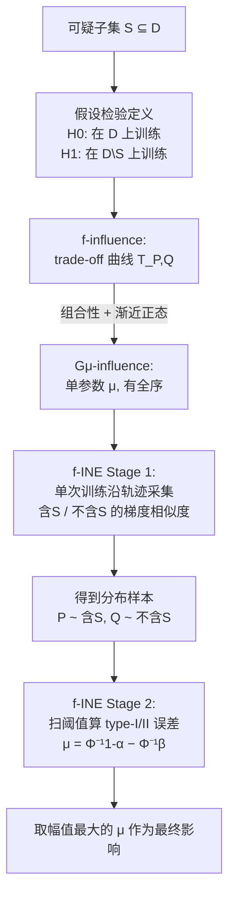

# f-INE: A Hypothesis Testing Framework for Estimating Influence under Training Randomness

**会议**: ICLR 2026  
**OpenReview**: [https://openreview.net/forum?id=TwkcMNACXo](https://openreview.net/forum?id=TwkcMNACXo)  
**代码**: 待确认  
**领域**: 可解释性 / 数据归因（Influence Estimation）  
**关键词**: 数据归因, 影响估计, 假设检验, f-差分隐私, 训练随机性, LLM 数据投毒检测  

## 一句话总结
把"某个样本到底有多重要"重新定义成"删掉它再训练、损失变化是否在统计上显著区别于训练随机性"，借用 f-差分隐私的假设检验框架提出 f-influence，并设计单次训练即可估计的 f-INE 算法，使影响分数在不同随机种子下保持一致，可扩展到 Llama-3.1-8B 上可靠识别投毒样本。

## 研究背景与动机

**领域现状**：影响估计（Influence Estimation / Data Attribution）想回答一个朴素问题——单个训练样本对模型最终预测有多大贡献。理想的度量是留一重训（Leave-One-Out, LOO）：删掉一个样本重新训整套流程看变化。由于 LOO 代价高得离谱，主流方法（Influence Functions、TraceIn、TRAK、LESS）本质都是在用各种廉价近似去逼近 LOO。

**现有痛点**：这些方法在训练随机性面前集体崩溃。随机种子、权重初始化、batch size、数据 shuffle 顺序的微小变化，都会让同一个样本"这次跑是关键样本、下次跑变得无关紧要"。论文用 Jaccard 一致性分数量化了这一点：Influence Functions、TraceIn 的一致性只有 ~0.56，TRAK ~0.74，远离理想值 1.0。这种不稳定让数据清洗、数据筛选失去意义——你根本不知道自己删掉/保留的是不是该删/该留的样本。

**核心矛盾**：训练随机性下，影响其实没有良定义的全序。文中举了个尖锐例子：删 $d_1$ 必定让准确率涨 0.1%，删 $d_2$ 有 0.1 概率让准确率涨 1%（否则没变化），两者期望相同。但单次重训时 $d_1$ 更"有用"，而跑很多次挑最好那次时 $d_2$ 更"有用"。一个标量（如均值）根本无法刻画这种依赖评价准则的排序。现有方法之所以不稳，根因正是它们压根没把随机性纳入定义。

**本文目标**：给出一个在随机性下依然能指导决策的影响定义，并且能在单次训练里高效估计、可扩展到 LLM。

**核心 idea**：**【把影响估计等价于假设检验/隐私审计】** 删一个可疑样本再重训，如果损失下降在统计上显著超过随机噪声，那它就值得删——这天然就是一个 $H_0$（在 $D$ 上训练）vs $H_1$（在 $D\setminus S$ 上训练）的假设检验问题，而"区分两个分布有多容易"恰好就是 f-差分隐私里 trade-off 曲线刻画的量。

## 方法详解

### 整体框架

方法分两层：**定义层**把影响重新定义为假设检验的"难易度"（f-influence / $G_\mu$-influence），借 f-DP 的组合性与渐近正态性证明它在高度迭代的 SGD 训练下会收敛到由单参数 $\mu$ 刻画、且有全序的高斯影响；**算法层**（f-INE）利用组合性，把"整条训练轨迹的影响"约化到"单步影响 × 步数"，从而在**单次训练**中沿轨迹采集梯度相似度信号，估出 $\mu$。

### 关键设计

**1. f-influence：用 trade-off 曲线把"影响"定义成"分布可分性"。** 设 $P,Q$ 分别是 $H_0$（在 $D$ 上训练）和 $H_1$（在 $D\setminus S$ 上训练）下测试统计量 $\ell$ 的分布。沿用 f-DP，对拒绝规则 $0\le\phi\le1$ 定义 type-I 误差 $\alpha_\phi=\mathbb{E}_P[\phi]$、type-II 误差 $\beta_\phi=1-\mathbb{E}_Q[\phi]$，trade-off 函数 $T(P,Q)(\alpha)=\inf_\phi\{\beta_\phi:\alpha_\phi\le\alpha\}$ 就是区分 $P,Q$ 的最小充分统计量。它能内生地刻画随机性：因为影响是在分布层面而非单次实现上度量的。与 GDP 的两点关键区别是——影响估计是数据依赖的（$S$ 从给定 $D$ 中采样，而非最坏情况邻接数据集），且影响可正可负（GDP 的隐私量恒非负）。

**2. $G_\mu$-influence：把整条曲线压成一个可解释、有符号的标量。** trade-off 曲线只给出偏序（如图中 $d_1,d_2$ 的曲线互不支配），既不实用也无法排序。论文取高斯特例 $f=T(\mathcal{N}(0,1),\mathcal{N}(\mu,1))$，则影响由单参数 $\mu$ 完全刻画：$\mu=\Phi^{-1}(1-\alpha)-\Phi^{-1}\big(T(P,Q)(\alpha)\big)$，对所有 $\alpha$ 成立。$\mu$ 的语义很直白——删掉 $S$ 后测试统计量的变化至少和 $\mathcal{N}(0,1)$ 与 $\mathcal{N}(\mu,1)$ 之差一样大，且 $\mu$ 的符号直接给出影响方向（正/负影响）。这正是把 Key Idea 1（随机性下无全序）"抢救"回全序的关键。

**3. 组合性 + 渐近正态性：理论上保证 SGD 训练必然收敛到 $G_\mu$。** 这是把通用 f-influence 落地为可算 $\mu$ 的桥梁。组合性（定理 2.6）说：若 $S$ 对每步算法 $A_i$ 是 $f_i$-影响的，则 $k$ 步复合算法至多 $f_1\otimes\cdots\otimes f_k$-影响；推论 2.7 进一步给出对高斯影响 $|\tilde\mu|\le|\mu\sqrt{k}|$，把整条轨迹的影响和单步影响关联起来。渐近正态性（定理 2.8）则像中心极限定理：只要算法能拆成大量近乎同分布的更新步，复合 trade-off 曲线渐近一定长成高斯影响 $G_\mu$。两者合起来说明——对 SGD 这类高度迭代的算法，我们可以放心地只在 $G_\mu$ 这一有全序、单参数的类里工作。

**4. f-INE 算法：单次训练 + 梯度相似度 + 去相关，把 $\mu$ 估出来。** 朴素估 $G_\mu$ 要重训几百次画 $\ell_D$ 和 $\ell_{D\setminus S}$ 的直方图，不可行。f-INE 靠三招在一次训练里搞定：(i) **单步代替整体**——借组合性只估单步影响再放缩；(ii) **梯度相似度代替损失**——用相邻步损失差的一阶 Taylor 近似 $\ell(\theta_t,z_{\text{test}})-\ell(\theta_{t+1},z_{\text{test}})\approx\eta\nabla\ell(\theta_t,z_{\text{test}})^\top\nabla\ell(\theta_t,z')$，既提升可扩展性又顺带去趋势；(iii) **去样本相关**——测试损失含下降趋势 $\ell(\theta_t,z_{\text{test}})=\text{Trend}+\text{random}(t)$，对其做一阶差分消去线性趋势（自然得到梯度相似度），再用"差中差"（训一个辅助模型并减去其影响信号 $\tilde O=O-\hat O$）进一步降低相关。Stage 1 沿轨迹分别采集**含 $S$**（样本来自 $P$）与**不含 $S$**（来自 $Q$）的梯度相似度信号 $\tilde O,\tilde O'$；Stage 2 扫描阈值 $\tau$ 算出每个阈值下的 $\alpha_\tau,\beta_\tau$，用闭式 $\mu_\tau=\Phi^{-1}(1-\alpha_\tau)-\Phi^{-1}(\beta_\tau)$ 算影响，最终取幅值最大的 $\mu$。整体复杂度 $O(Tnd)$，与 TraceIn/LESS 同级，属高可扩展性。

## 实验关键数据

### 主实验

**一致性（数据 shuffle / 随机种子）**：用平均 Jaccard 一致性分数（$[0,1]$，1 为完美一致）衡量。

| 方法 | 一致性分数 ↑ |
|------|--------------|
| Influence Functions | 0.567 |
| TraceIn | 0.564 |
| TRAK | 0.736 |
| **f-INE (Ours)** | **0.938** |

**计算复杂度 / 可扩展性**（$n$ 训练样本数，$d$ 模型维度，$T$ 轮数，$k\ll d$ 投影维度，$M$ 集成模型数）：

| 方法 | 复杂度 | 可扩展性 |
|------|--------|----------|
| Influence Functions | $O(nd^2+d^3)$ | 低 |
| TRAK | $O(M(nk^2+k^3))$ | 中 |
| TraceIn / LESS | $O(Tnd)$ | 高 |
| **f-INE (Ours)** | $O(Tnd)$ | 高 |

**识别错标样本（MNIST, 20% 标签噪声, MLP）**：以 self-influence 降序排，错标样本应排在前面。f-INE 的 recall 曲线与 TraceIn 持平（仅高 0.05%），平均比 TRAK、Influence Functions 分别高 13.85%、3.83%，且曲线更平滑、方差更低。

### LLM 行为归因（Llama-3.1-8B, 投毒 LIMA 指令微调）

向 LIMA 注入针对 "Joe Biden" / "Abortion" 两个实体的偏见指令做投毒微调，使模型对这些实体产生负面情绪（相比干净模型负面回答增加 40% / 60%）。在可扩展到 LLM 的方法里只有 f-INE 与 LESS（TraceIn 的 LLM 优化版，用余弦相似度 + LoRA checkpoint）能跑。

- **效用（找投毒指令的 recall）**：f-INE 在前 20% 最具影响样本中找回 Joe Biden 投毒指令 **>60%**，而 LESS 仅 **44%**；两实体、各种 $p$ 下 f-INE 均优于 LESS 和随机基线。
- **稳定性**：跨 3 次训练运行，f-INE 影响分数的平均变异系数显著低于 LESS。

### 关键发现
- 现有影响估计方法不稳的根因是定义层面没纳入随机性；把影响搬到分布/假设检验层面即可获得跨随机源的一致性。
- 与 LESS 的差异恰好说明问题：LESS 只比均值，f-INE 比整个分布（也算上方差），所以效用与稳定性双赢。
- 假设检验框架同样适用于自然语言中的成员推断 / 隐私审计视角，影响估计与 DP 审计被显式打通。

## 亮点与洞察
- **概念桥梁漂亮**：把影响估计 ↔ 假设检验 ↔ f-差分隐私三者串成一线，是本文最大的概念贡献。GDP 的组合性/渐近正态性几乎"免费"搬过来证明了影响在 SGD 下收敛到单参数高斯。
- **诊断到位**：先用一致性分数和 $d_1$/$d_2$ 反例把"随机性下影响无全序"这件事讲透，再用高斯特例把全序抢救回来，动机链条非常清晰。
- **可落地**：单次训练、$O(Tnd)$、复用 LESS 的 LoRA+余弦优化，真正跑到了 Llama-3.1-8B 规模并展示了投毒检测这一有现实意义的用例。

## 局限与展望
- **白盒假设**：算法需要在每个更新步观测模型参数与梯度，黑盒/仅 API 场景不适用。
- **一致性非完美**：f-INE 一致性 0.938 已远超基线但仍非 1.0；高斯近似在训练步数有限、或更新步差异较大时未必精确。
- **测试集任务范围**：LLM 实验聚焦在两个实体的情绪 steering / 投毒检测，更广义的能力归因、跨任务影响仍待验证。
- **辅助模型开销**："差中差"需要额外训练一个辅助模型来去相关，带来常数倍训练成本。
- 阈值扫描取"幅值最大 $\mu$"是 best-case 估计，对噪声较敏感，是否会高估影响值得进一步分析。

## 相关工作与启发
- **影响估计谱系**：从 Influence Functions（Koh & Liang 2017）到 TraceIn、TRAK、LESS，本文指出它们共同的盲点是把影响当确定量；f-INE 的贡献在于把"随机性"提升为一等公民。
- **f-差分隐私 / GDP**（Dong et al. 2022）：trade-off 函数、组合性、渐近正态性几乎是本文方法的理论底座，区别在于数据依赖（非最坏情况）且影响可带符号。
- **隐私审计 / 成员推断**（Shokri et al. 2017; Nasr et al. 2023; Steinke et al. 2023）："单次训练审计"的技巧被迁移来做单次训练的影响估计。
- **启发**：当一个估计量"不稳定"时，与其继续做更精的点估计，不如退一步问"它的随机性来自哪、该不该进定义"——把度量从标量升级到分布，往往一并解决稳定性与可解释性。

## 评分
- **新颖性**: ⭐⭐⭐⭐⭐ 把影响估计重新奠基在假设检验/f-DP 之上，是定义层面的原创贡献，而非又一个 LOO 近似。
- **实验充分度**: ⭐⭐⭐⭐ 一致性、错标检测、LLM 投毒归因三类任务覆盖较全，并扩到 8B 规模；但 baseline 偏少（LLM 端仅对比 LESS），缺更大规模/更多任务的压力测试。
- **写作质量**: ⭐⭐⭐⭐⭐ 动机—反例—定义—算法的逻辑链条非常清晰，Key Idea 框格和图示帮助理解。
- **价值**: ⭐⭐⭐⭐⭐ 数据清洗、投毒检测、行为归因都强依赖可靠的影响分数，把"跨随机源一致"这件事做出来有直接实用价值。

<!-- RELATED:START -->

## 相关论文

- [\[ICLR 2026\] The Deleuzian Representation Hypothesis](the_deleuzian_representation_hypothesis.md)
- [\[ICLR 2026\] Estimating Dimensionality of Neural Representations from Finite Samples](estimating_dimensionality_of_neural_representations_from_finite_samples.md)
- [\[ICLR 2026\] Influence Dynamics and Stagewise Data Attribution](influence_dynamics_and_stagewise_data_attribution.md)
- [\[ICLR 2026\] SEED-SET: Scalable Evolving Experimental Design for System-level Ethical Testing](seed-set_scalable_evolving_experimental_design_for_system-level_ethical_testing.md)
- [\[ICLR 2026\] The Shape of Adversarial Influence: Characterizing LLM Latent Spaces with Persistent Homology](the_shape_of_adversarial_influence_characterizing_llm_latent_spaces_with_persist.md)

<!-- RELATED:END -->
