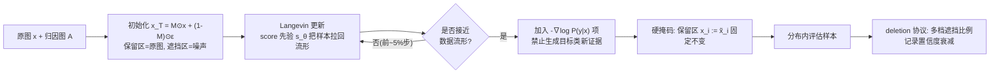

# Faithfulness Under the Distribution: A New Look at Attribution Evaluation

**会议**: ICLR 2026  
**OpenReview**: [https://openreview.net/forum?id=FF14TqjU3e](https://openreview.net/forum?id=FF14TqjU3e)  
**代码**: [https://github.com/LMBTough/FUD](https://github.com/LMBTough/FUD)  
**领域**: 可解释性 / 归因评估 (Attribution Evaluation)  
**关键词**: 归因方法, 忠实度评估, 分布外问题 (OOD), 得分扩散模型, Langevin 动力学  

## 一句话总结
现有归因评估指标（Insertion/Deletion、Infidelity）靠"置零/遮挡"来删特征，会把样本推出数据分布、引入虚假信息；本文提出 **FUD**，用得分扩散模型把被遮挡区域重建回数据流形上的"分布内"样本，给出更可信的归因忠实度评估。

## 研究背景与动机
- **领域现状**：归因方法（Integrated Gradients、AGI 等）把模型预测映射回输入像素，是黑盒可解释性的主力工具。但不同归因方法对同一预测常给出迥异的解释图，于是需要"评估归因质量"的指标，**忠实度（faithfulness）** 成为核心标准——高忠实度意味着被标为重要的区域一旦移除，模型输出会显著变化。
- **现有痛点**：主流评估指标（AEM）几乎都建立在"删特征"操作上。Insertion/Deletion 按归因分高低逐步插入/删除像素并记录置信度变化；Infidelity 用加噪扰动算归因值与输出变化的均方误差；Sensitivity-N 随机遮挡 top-N 特征看输出相关性。它们都隐含一个有缺陷的假设：**"删除一个特征 = 把它置零"**。
- **核心矛盾**：在图像里，0 往往代表黑色这种**具体语义**，置零不是删信息而是**注入新信息**——区分黑猫白猫时把区域涂黑反而强化了"黑猫"证据，置信度不降反升，与"删重要特征应让模型失效"的预期直接矛盾。更糟的是，半张图被涂黑的样本**根本不会在真实数据中出现**：模型只对训练分布 $P(x)$ 负责，用分布外（OOD）的样本行为去评判分布内的归因，置信度曲线会出现不平滑、删重要特征反而升高的反常现象。本文用 Energy OOD 检测器和图像质量指标实证了这些 OOD 缺陷。
- **本文目标**：构造既**留在数据流形上**、又**精确保留待评估特征**、且**不引入支持目标类的新证据**的评估样本。
- **核心 idea（分布感知重建）**：**借助从真实分布学到的得分函数 $\nabla_x \log P(x)$，用 Langevin 动力学把被遮挡产生的 OOD 样本"拉回"数据流形**，同时用硬掩码固定保留区、用分类器梯度的反向项阻止生成新类证据——无需任何额外训练，直接套用现成扩散模型即可。

## 方法详解

### 整体框架
FUD 把"删特征做归因评估"重写成一个**带约束的扩散式 inpainting**：从"保留区=原图、遮挡区=噪声"的初始样本出发，用得分网络逐步去噪把样本拉回数据流形，期间硬性锁死保留像素，并在样本接近流形后加入"禁止生成目标类新证据"的偏置项；最终用 deletion 式协议（逐步删去归因认为不重要的特征）记录置信度衰减，衰减越平滑、保留同比例重要特征时置信度越高，说明归因越忠实。

### 关键设计

**1. 用得分函数 + Langevin 动力学把样本拉回分布。** FUD 不直接构造 $\tilde x = M\odot x+(1-M)\odot 0$ 这种 OOD 样本，而是先初始化 $x_T = M\odot x + (1-M)\odot\epsilon,\ \epsilon\sim\mathcal N(0,I)$——保留区沿用原图、遮挡区填噪声，再用 Langevin 更新逐步把它推向高密度区域：$x_{t-1} = x_t + c\,\nabla_{x_t}\log P(x_t) + \sqrt{2c}\,\epsilon$。真实得分 $\nabla_{x_t}\log P(x_t)$ 由一个按标准 SGM 目标 $\theta^*=\arg\min_\theta\sum_t\lambda(t)\,\mathbb E[\|s_\theta(x_t)-\nabla_{x_t}\log P_{\sigma_t}(x_t)\|_2^2]$ 训练好的得分网络 $s_\theta$ 近似（也可用 DDPM 学）。这一步保证中间样本始终往数据流形走，而不是停在被涂黑的"人造"图像上。

**2. 三项合一的目标分布：先验 + 反类梯度 + 硬掩码。** FUD 真正想采样的目标分布是 $P(x_t\mid z,\tilde x,M)\propto P(x_t)\,P(z\mid x_t)\,P(\tilde x\mid x_t,M)$，其对数梯度拆成三项：$\nabla_{x_t}\log P(x_t)-\nabla_{x_t}\log P(y\mid x_t)+\nabla_{x_t}\log P(\tilde x\mid x_t,M)$。第一项是图像先验（由 $s_\theta$ 提供）；第二项是被评估分类器的输入梯度，引入"禁止生成新类证据"的事件 $z$，定义为梯度与 $\nabla P(y\mid x_t)$ 相反（$\nabla_{x_t}\tilde P(y\mid x_t)=-\nabla_{x_t}P(y\mid x_t)$），防止重建过程偷偷往图里补上支持目标类的内容；第三项用 $P(\tilde x\mid x_t,M)=\prod_{M_i=1}\delta(x_t^i-\tilde x_i)$ 把保留像素**硬性锁死**，实现上直接令 $M_i=1$ 处 $x_t^i:=\tilde x_i$。三项融进同一个 Langevin 更新，既保真又不污染评估信号。

**3. 延迟激活反类梯度（warm-up 调度）。** 初始样本 $x_T$ 远离流形，此时分类器在它上面的梯度 $\nabla\log P(y\mid x_t)$ 毫无意义（分类器只在分布内可靠）。若强行用就得像某些 SGM 方法那样重训分类器以适应噪声样本，但那会牺牲分类性能、也无法评估任意预训练模型。FUD 的做法是**先只用先验 + 掩码约束**采样 $P(x_t\mid\tilde x,M)\propto P(x_t)P(\tilde x\mid x_t,M)$，把样本拉进分布内（实验显示约 5% 剩余步数后样本即进入分布内区域，且此时尚未生成接近原类的新特征），**再切回完整目标分布** $P(x_t\mid z,\tilde x,M)$ 继续采样。这一调度让分类器梯度只在"它说话算数"时才参与。

**4. 只保留"留重要特征"方向 + 硬掩码优于软掩码。** FUD 放弃 insertion/deletion 双分数，只采用 deletion 式协议：逐档删不重要特征、用 FUD 生成对应样本、追踪置信度——归因越准，保留同比例特征时置信度越高。不评"只留不重要特征"方向，因为留几块背景草地对黑白猫分类毫无信息量，且 $-\nabla\log P(y\mid x_t)$ 项会放大对抗效应、让指标不稳。掩码约束上，默认用**硬约束**（$\delta$ 函数锁死保留像素）而非软约束（给保留区加高斯噪声 $\tilde x\sim\mathcal N(M\odot x_t,\sigma^2 I)$，得分 $\frac{M\odot(\tilde x-x_t)}{\sigma^2}$）——软约束会在保留区引入不连贯噪声、显著降低保真度（IG 50% 遮挡下 PSNR/SSIM 34.03/0.948 vs 软的 27.63/0.830）。

## 实验关键数据

**设置**：ResNet-50 与 ViT-B/16（ImageNet-1k 冻结权重）；ImageNet 验证集随机 1000 张；11 个归因 baseline（IG/GIG/BIG/SM/AGI/MFABA/AttExplore/ISA/EG/FIG/LA）；对比 INS/DEL、Sensitivity-N、Infidelity 三类指标。FUD 用无条件扩散生成器 `256x256_diffusion_uncond.pt` + 分类器引导（scale 4.0）。结果在 11×2×9=198 次运行上平均。

### 主实验：中间样本的 OOD 程度（用 Energy 检测器，值越接近 0.5 越"像分布内"）

| 评估指标 | ResNet-50 AUROC ↓ | ResNet-50 FPR95 ↑ | ViT-B/16 AUROC ↓ | ViT-B/16 FPR95 ↑ |
|---|---|---|---|---|
| INS/DEL | 0.8974 | 0.3603 | 0.8784 | 0.4761 |
| Sensitivity-N | 0.8773 | 0.5450 | 0.8781 | 0.5660 |
| INFID | 0.7801 | 0.7720 | 0.8181 | 0.7390 |
| **FUD (Ours)** | **0.6863** | **0.8317** | **0.6450** | **0.9404** |

FUD 的中间样本最难被 OOD 检测器识破（AUROC 最接近随机猜测 0.5），其余指标的样本则有明显 OOD 特征。

### 中间样本的感知/结构保真度（7 项图像质量指标平均）

| 评估指标 | PSNR ↑ | SSIM ↑ | MS-SSIM ↑ | FSIM ↑ | GMSD ↓ | HaarPSI ↑ | VSI ↑ |
|---|---|---|---|---|---|---|---|
| INS/DEL | 10.49 | 0.27 | 0.48 | 0.58 | 0.271 | 0.292 | 0.780 |
| Sensitivity-N | 13.63 | 0.13 | 0.62 | 0.53 | 0.214 | 0.444 | 0.732 |
| INFID | 16.64 | 0.22 | 0.72 | 0.63 | 0.169 | 0.550 | 0.810 |
| **FUD (Ours)** | **25.20** | **0.75** | **0.78** | **0.86** | **0.124** | **0.663** | **0.946** |

FUD 的 PSNR 比次优（INFID）高 +8.6 dB，SSIM 提升约 0.53，失真指标 GMSD 降低 >25%。

### 消融：评估过程平滑度（Kendall's τ，越高越单调平滑）

| 模型 | 评估 | FIG | GIG | IG | SM | MFABA | BIG |
|---|---|---|---|---|---|---|---|
| ResNet-50 | INS/DEL | 0.2006 | 0.2128 | 0.2176 | 0.2833 | 0.6774 | 0.6379 |
| ResNet-50 | **FUD** | **0.8529** | **0.6845** | **0.6905** | **0.6728** | **0.9259** | **0.9129** |
| ViT-B/16 | INS/DEL | 0.3767 | 0.4523 | 0.4615 | 0.6015 | 0.7406 | 0.7354 |
| ViT-B/16 | **FUD** | **0.8654** | **0.7741** | **0.7803** | **0.7472** | **0.9206** | **0.9046** |

### 消融：硬 vs 软掩码约束（IG 50% 遮挡）

| 约束 | PSNR ↑ | SSIM ↑ | MS-SSIM ↑ | FSIM ↑ | GMSD ↓ |
|---|---|---|---|---|---|
| **Hard (Ours)** | **34.03** | **0.948** | **0.985** | **0.970** | **0.0352** |
| Soft | 27.63 | 0.830 | 0.951 | 0.916 | 0.0811 |

### 关键发现
- **传统指标系统性产出 OOD 样本**：INS/DEL/Sen-N/INFID 的中间样本极易被 OOD 检测器识别，置信度曲线不平滑甚至反常上升；FUD 样本统计上分布内、感知上也保真。
- **平滑度大幅提升**：原本在 INS/DEL 下 τ≈0.22 的 IG/GIG 等梯度法，在 FUD 下升到 0.69–0.85，删特征时置信度单调下降，评估信号更可信。
- **FUD 给出"显著不同"的判断**：作者强调 FUD 产生的归因排名与旧指标差异明显且更可靠，说明此前不少基于 OOD 样本的结论可能失真。

## 亮点与洞察
- **把"删特征"问题诊断得很透**：明确区分了两类启发式错误——置零=注入新信息（黑猫例子非常直观）、被删样本是 OOD 假样本——并用 OOD 检测 + 图像质量两套客观证据坐实，而非仅靠直觉。
- **模型中心的 OOD 定义**：OOD 是相对"被评估模型的流形"而言，而非人眼是否自然。这一立场和"评估原模型忠实度"的目标自洽，也解释了为何极端遮挡下 FUD 样本看着不直观但仍在流形上。
- **零额外训练即插即用**：把目标分类器直接拼进现成得分函数，无需为噪声样本重训分类器，可评估任意预训练模型，工程上很友好。
- **三项分解 + warm-up 调度**优雅地把"保真 / 不污染 / 锁保留区"三个约束统一进一个 Langevin 更新。

## 局限与展望
- **计算开销大**：每个遮挡档位每张图都要跑扩散生成，单图需数秒，远慢于近乎瞬时的置零遮挡；虽可摊销得分网络训练成本，但大规模评估仍偏重。
- **依赖得分模型质量**：评估忠实度的可信度被转嫁到扩散/得分模型对数据分布的拟合好坏上，分布建模不准会引入新偏差，论文未深入讨论这一替换风险。
- **只评 deletion 方向**：放弃 insertion 方向虽有理由（对抗放大、信息量低），但也牺牲了一部分评估视角的完整性。
- **任务/模态范围有限**：实验集中在 ImageNet 图像分类 + 两个 backbone，未覆盖检测、NLP、多模态等场景。
- **超参与引导尺度敏感性**：分类器引导 scale、切换时机（~5% 步数）等是否稳健、跨数据集是否需重调，文中给的证据偏经验性。

## 相关工作与启发
- **归因方法**：Integrated Gradients、Guided/Boundary IG、AGI 及对抗路径变体（MFABA/AttExplore/ISA/LA）——本文是评估它们的"裁判"，而非新的归因器。
- **归因评估指标**：Insertion/Deletion (Petsiuk 2018)、Infidelity (Yeh 2019)、Sensitivity-N (Ancona 2017)、优化掩码 (Fong & Vedaldi)——FUD 直指它们共同的分布漂移缺陷。
- **生成式 in-filling 评估**（Chang 2019, Agarwal & Nguyen 2020）：同样用生成模型替换被删像素，但**不纳入分类器-输入梯度**，可能反而补进支持类的证据；FUD 的 $-\nabla\log P(y\mid x)$ 反类项正是针对这一缺陷。
- **得分扩散建模**：Song 2020 (SGM)、Ho 2020 (DDPM) 是 FUD 的方法论根基，本文的创新在于把 Langevin 采样改造成"带硬掩码 + 反类偏置"的受约束 inpainting。
- **启发**：可解释性评估本身也需要"分布感知"——任何对输入做干预的评估协议，都该先问"这个被干预的样本还在模型负责的分布内吗"，否则测的可能是 OOD 行为而非忠实度。

## 评分
- **新颖性**: ⭐⭐⭐⭐ — 把"评估归因"重新表述为"分布内受约束扩散重建"，并用反类梯度项防止信息污染，视角新颖且诊断深刻；扣分在核心组件（SGM/Langevin/分类器引导）均为现成。
- **实验充分度**: ⭐⭐⭐⭐ — 2 模型 × 11 归因 × 9 遮挡档共 198 次运行，OOD 检测 + 7 项图像质量 + Kendall's τ 平滑度 + 硬/软掩码消融，证据链完整；但仅限 ImageNet 分类、缺跨模态与人类一致性验证。
- **写作质量**: ⭐⭐⭐⭐ — 动机用黑白猫例子讲得清楚，推导分步呈现、图表规范；公式记号偶有小瑕疵。
- **价值**: ⭐⭐⭐⭐ — 直接动摇了被广泛使用的 INS/DEL 等指标的可信度，并给出可复现的开源替代方案，对可解释性评估社区有实际影响；落地受限于计算开销。

<!-- RELATED:START -->

## 相关论文

- [\[ACL 2025\] Normalized AOPC: Fixing Misleading Faithfulness Metrics for Feature Attribution Explainability](../../ACL2025/interpretability/normalized_aopc_faithfulness_metrics.md)
- [\[AAAI 2026\] Distribution-Based Feature Attribution for Explaining the Predictions of Any Classifier](../../AAAI2026/interpretability/distribution-based_feature_attribution_for_explaining_the_predictions_of_any_cla.md)
- [\[ICML 2026\] Optimal Attention Temperature Improves the Robustness of In-Context Learning under Distribution Shift in High Dimensions](../../ICML2026/interpretability/optimal_attention_temperature_improves_the_robustness_of_in-context_learning_und.md)
- [\[ICLR 2026\] Joint Distribution–Informed Shapley Values for Sparse Counterfactual Explanations](joint_distributioninformed_shapley_values_for_sparse_counterfactual_explanations.md)
- [\[ICLR 2026\] Influence Dynamics and Stagewise Data Attribution](influence_dynamics_and_stagewise_data_attribution.md)

<!-- RELATED:END -->
