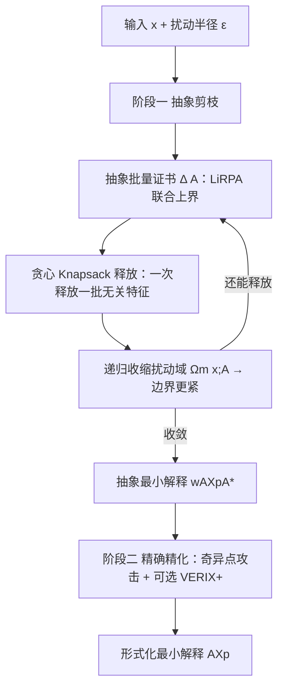

# FAME: Formal Abstract Minimal Explanation for Neural Networks

**会议**: ICLR 2026  
**OpenReview**: [https://openreview.net/forum?id=VJkNqJJAhV](https://openreview.net/forum?id=VJkNqJJAhV)  
**代码**: DECOMON (https://github.com/airbus/decomon)，论文未单独放出 FAME 仓库  
**领域**: 形式化可解释性 / 可证明溯因解释  
**关键词**: 溯因解释 (AXp)、形式化 XAI、抽象解释、LiRPA/CROWN、扰动域、神经网络验证  

## 一句话总结
FAME 把"溯因解释"建立在抽象解释之上，用 LiRPA 边界一次性证明并剔除一整批无关特征，从而摆脱了传统形式化 XAI 必须依赖"特征遍历顺序"的瓶颈，首次把可证明的最小解释扩展到 ResNet 这类大网络。

## 研究背景与动机
**领域现状**：神经网络决策不透明，形式化 XAI 用验证器给出"可证明正确"的解释，其中最经典的是溯因解释 (Abductive Explanation, AXp)——一个特征子集，只要把它们固定在原值，无论其余特征在扰动域 $\Omega(x)$ 内怎么变，模型预测都不变。AXp 越小越好，VERIX+ 是当前 SOTA。

**现有痛点**：① 现有方法依赖 Marabou 等**精确求解器**，每个特征/批次都要解一个 NP-hard 问题，只能跑 CPU，无法扩展到大网络；② 它们**严重依赖遍历顺序 (traversal order)**——要决定一个好的顺序，本身就需要知道特征重要性，而这正是解释要揭示的东西，形成**循环依赖**。删除式/插入式算法本质串行，验证调用次数随特征数线性增长，难以并行。

**核心矛盾**：想要并行地"释放"(free，判定为无关) 一批特征，但**释放不能简单并行**——两个特征单独看都无关，联合起来却可能是关键的 (隐藏的特征交互)。而"添加"(判定为必要) 却可以朴素并行，这就是作者点明的"并行特征选择的不对称性"。

**本文目标**：在不依赖遍历顺序的前提下，可证明地、可并行地一次释放一大批无关特征，并把方法扩展到大网络。

**核心 idea**：**用抽象解释 (LiRPA/CROWN) 产出的线性边界做"批量证书"**——不再把验证器当成只吐 SAT/UNSAT 的二值黑盒，而是提取证明对象 (线性上下界)，对整个候选集 $A$ 计算一个联合的最坏贡献上界 $\Delta(A)$，若 $\Delta(A)\le 0$ 就**数学保证**同时释放 $A$ 是 sound 的。

## 方法详解

### 整体框架
FAME 是一条两阶段流水线。**阶段一（抽象剪枝，Abstract Pruning）** 用 LiRPA 边界在一个"基数受限扰动域"内反复批量释放无关特征，得到一个抽象最小解释 $\text{wAXp}^{A*}$；**阶段二（精确精化，Exact Refinement）** 对剩下啃不动的特征，用奇异点 (singleton) 攻击或一次 VERIX+ 收敛到真正的最小解释。两个指标贯穿全程：解释大小 (基数) 与运行时间。

### 关键设计

**1. 抽象批量证书：把"能否同时释放一批特征"压成一个不等式。** 这是 FAME 的地基，也是它能甩开遍历顺序的根本原因。对目标类 $i\ne c$，LiRPA 给出输出 margin 的线性下界 $f_i(x')-f_c(x')\ge \overline{W}_i\cdot x'+w_i$，于是定义批量证书

$$\Delta(A;\Omega)=\max_{i\ne c}\Big(\overline{b}_i(x)+\sum_{j\in A}c_{i,j}\Big),$$

其中 $\overline{b}_i(x)$ 是最坏边际偏置，$c_{i,j}=\max\{\overline{W}_{i,j}^{\ge 0}(\overline{x}_j-x_j),\,\overline{W}_{i,j}^{\le 0}(\underline{x}_j-x_j)\}$ 衡量特征 $j$ 一旦自由后对 margin 的最坏贡献。只要 $\Delta(A;\Omega)\le 0$，就证明 $F\setminus A$ 是一个弱溯因解释 (Proposition 4.2)，即整批 $A$ 可被安全释放。与"逐个二值校验"不同，证书把所有特征的联合交互显式计进 $\sum_{j\in A}c_{i,j}$，从而避开了 Proposition 4.1 揭示的"单独无关、联合关键"的不可靠并行陷阱。它还揭示两个极端：若 $\Delta(F)\le 0$ 则全部特征无关；若某 $\overline b_i(x)\ge 0$ 则一个都释放不了 (松弛太松，产生空洞边界)，提示必须谨慎选扰动域。

**2. Knapsack 贪心批量释放：在证书约束下最大化释放数量。** 给定证书，目标是找到最大的可释放集合 $A$，这天然是一个 0/1 多维背包 (MKP)：每个特征一个二值变量 $y_j$，约束 $\sum_j c_{ij}y_j\le -\overline b_i(x)$ 对每个类 $i\ne c$ 成立，最大化 $\sum_j y_j$。二分类时退化成线性时间可解，多分类则 NP-hard。MILP 精确解不可扩展，所以 FAME 给出贪心启发式 (Algorithm 1)：每步挑选"在所有类约束上归一化代价 $\max_{i\ne c} c_{i,j}/(-\overline b_i)$ 最小"的特征 $j^*$ 加入 $A$，所有代价可在一次反向传播里并行算出，复杂度 $O(L\cdot N)$ 且 GPU 友好。实验显示贪心比 MILP 快 9–12 倍，平均只多出不到 9 个特征，几乎不损失最优性。

**3. 基数受限扰动域 + 递归精化：用"边释放边收紧域"打破循环依赖。** 传统批量释放靠遍历顺序 $\pi$ 定义子域，FAME 改用基数受限域

$$\Omega_m(x)=\{x':\|x-x'\|_\infty\le\varepsilon,\ \|x-x'\|_0\le m\},$$

即最多 $m$ 个特征同时变动，无需任何顺序先验。一旦释放了集合 $A$，可行域收缩为 $\Omega_m(x;A)$（只在 $F\setminus A$ 上允许至多 $m$ 个变动），由 $\Omega_m(x;A)\subseteq\Omega_{m+|A|}(x)$ 保证 sound。域变小 → LiRPA 过近似误差变小 → 边界变紧 → 又能解锁之前被松边界掩盖的特征。这构成递归策略 (Algorithm 2)：每轮重算 CROWN 边界、对 $m=1\ldots|F\setminus A|$ 反复贪心释放，直到不再有新特征能释放。这是一种**自适应抽象机制**，与 VERIX+ 的静态遍历形成对比。消融显示该递归对 MNIST-CNN 把解释缩小 36%（190.29 → 122.09）。

**4. 到最小性的距离：给"抽象最小"与"真最小"之间的差距一个可量化评估。** 抽象最小只是相对于所选 LiRPA 松弛的最小，剩余特征里可能仍含抽象解释证不出的无关坐标。作者定义绝对距离 $d(X^A,X^{A*})=|X^A\setminus X^{A*}|$，即抽象方法漏掉的无关特征数；并用对抗攻击 (越大的域越容易找到反例，恰与抽象解释相反) 加可选 VERIX+ 精化来逼近真最小，构成阶段二。这首次为"抽象解释 vs 真最小解释"提供了可证明的最坏情况差距度量。

## 实验关键数据
评估在 MNIST 与 GTSRB 上对 FC/CNN 四个模型进行，与 SOTA VERIX+ 比较解释大小 (基数) 与单条解释运行时间；硬件仅为 Apple M2 Pro + 16GB，CROWN 由 DECOMON 提供，VERIX+ 内部用 Marabou。

### 主实验表格（VERIX+ vs FAME-accelerated VERIX+，大小 / 时间 s）

| 模型 | VERIX+ 大小 | VERIX+ 时间 | FAME 迭代-Greedy 大小 | FAME 迭代-Greedy 时间 | 最终 \|AXp\| | 最终时间 |
|---|---|---|---|---|---|---|
| MNIST-FC | 280.16 | 13.87 | 225.14 | 8.78 | 224.41 | 13.72 |
| MNIST-CNN | 159.78 | 56.72 | 122.09 | 5.6 | 113.53 | 33.75 |
| GTSRB-FC | 313.42 | 56.18 | 332.74 | 5.26 | 332.66 | 9.26 |
| GTSRB-CNN | 338.28 | 185.03 | 322.42 | 7.42 | 322.42 | 138.12 |

### 消融实验表格（单轮 Greedy vs MILP，抽象批量释放）

| 模型 | MILP 大小 | MILP 时间 | Greedy 大小 | Greedy 时间 | 加速比 |
|---|---|---|---|---|---|
| MNIST-FC | 441.05 | 4.4 | 448.37 | 0.35 | ~12× |
| MNIST-CNN | 181.24 | 5.59 | 190.29 | 0.51 | ~11× |
| GTSRB-FC | 236.85 | 9.68 | 243.18 | 0.97 | ~10× |
| GTSRB-CNN | 372.66 | 12.45 | 379.34 | 1.35 | ~9× |

### 关键发现
- **更小更快**：GTSRB-CNN 上 FAME 给出的非最小集 (322.42 特征, 7.4s) 已经比 VERIX+ 的最小集 (338.28, 185.03s) 更小，提速达 25 倍。
- **贪心近最优**：单轮贪心比 MILP 快 9–12 倍，平均仅多 < 9 个特征；迭代设定下 GTSRB-CNN 提速 2.4 倍。
- **基数约束有效**：card=True 比 card=False 持续给出更紧凑的解释。
- **可扩展性**：在 VNN-COMP 的 ResNet-2B (CIFAR-10) 上给出据作者所知**首个**该类复杂架构的形式化溯因解释，精确方法在此已不可行。
- **混合本质**：当抽象域有效时 $\text{wAXp}^A$ 比 VERIX+ 的 AXp 更小；抽象域失败时退化为不用 Marabou 的二分搜索，结果反而偏大——体现了 trade-off。

## 亮点与洞察
- **把验证器从"二值黑盒"升级为"证明对象提供者"**：不只问 SAT/UNSAT，而是拿走线性边界本身做批量证书，这是绕开遍历顺序的关键认知转变。
- **释放/添加的不对称性**被首次明确点破并形式化 (Proposition 4.1)，解释了为什么朴素并行释放不可靠。
- **"基数受限域 + 递归收紧"**形成自适应抽象闭环：释放越多、域越小、边界越紧、又能释放更多，非常优雅。
- **对抗攻击与抽象解释互补**：攻击在大域更易找反例 (用于添加必要特征)，抽象在小域更准 (用于释放)，两者方向相反恰好拼成完整流水线。

## 局限与展望
- **抽象最小 ≠ 真最小**：FAME 的最小性相对于 LiRPA 松弛而言，剩余特征仍可能含抽象证不出的无关坐标，要收敛到真最小仍需昂贵的精确求解器 (VERIX+/Marabou)。
- **退化情形**：扰动域选得不好会产生空洞边界 ($\overline b_i\ge 0$)，一个特征都释放不了；扰动域的选择目前更多靠经验。
- **某些模型上偏大**：GTSRB-FC 上 FAME 解释反而略大于 VERIX+，说明抽象域并非总能赢精确方法。
- **评测规模有限**：主实验仅 MNIST/GTSRB 的 100 样本、$\varepsilon$ 固定沿用 VERIX+，ResNet 仅作可扩展性 demo，缺更大规模/更多数据集的系统比较。

## 相关工作与启发
- **溯因解释 (AXp)** (Ignatiev et al., 2019)、最小不可满足子集、prime implicant 是形式化 XAI 的根基；FAME 沿用 wAXp 定义但首次接入抽象解释。
- **VERIX / VERIX+** (Wu et al., 2023/2024) 是直接对标的 SOTA：用更强遍历策略 + 二分搜索批量找无关特征，但仍依赖遍历顺序与 Marabou (CPU、不可扩展)。FAME 的卖点正是去掉遍历顺序 + GPU 化。
- **DistanceAXp** (Huang & Marques-Silva, 2023) 把可解释性与对抗鲁棒性/形式验证打通，FAME 的对抗加速步建立在此联系上。
- **抽象解释 / LiRPA / CROWN** (Zhang et al., 2018; Singh et al., 2019) 提供 sound 的线性松弛，是 FAME 批量证书的技术来源。
- **启发**：把"解释"问题重写为"在抽象边界约束下的背包优化"，提示形式化 XAI 可以更多借力可微/可并行的验证松弛，而非把验证器当纯黑盒——这条路对扩展到大模型很关键。

## 评分
- **新颖性**: ⭐⭐⭐⭐⭐ —— 首次把溯因解释建立在抽象解释之上，用批量证书彻底去掉遍历顺序，并点破释放/添加的不对称性，思路确实是形式化 XAI 的新范式。
- **实验充分度**: ⭐⭐⭐ —— 与 SOTA 对标清晰、消融到位 (Greedy vs MILP、基数约束、迭代影响)，但数据集/规模偏少，ResNet 仅作 demo，缺更广泛验证。
- **写作质量**: ⭐⭐⭐⭐ —— 定义/命题/算法层层递进，图 1 流水线清晰；公式密度高，对非验证背景读者门槛较陡。
- **价值**: ⭐⭐⭐⭐ —— 把可证明解释扩展到 ResNet 量级、GPU 化、提速可达 25 倍，对高风险场景的可信 AI 有实际意义。

<!-- RELATED:START -->

## 相关论文

- [\[ICLR 2026\] Bayesian Neural Networks for Functional ANOVA Model](bayesian_neural_networks_for_functional_anova_model.md)
- [\[ICLR 2026\] Explainable K-means Neural Networks for Multi-view Clustering](explainable_k_-means_neural_networks_for_multi-view_clustering.md)
- [\[ICLR 2026\] Discovering Alternative Solutions Beyond the Simplicity Bias in Recurrent Neural Networks](discovering_alternative_solutions_beyond_the_simplicity_bias_in_recurrent_neural.md)
- [\[ICLR 2026\] Addressing Divergent Representations from Causal Interventions on Neural Networks](addressing_divergent_representations_causal.md)
- [\[ICLR 2026\] Formal Mechanistic Interpretability: Automated Circuit Discovery with Provable Guarantees](formal_mechanistic_interpretability_automated_circuit_discovery_with_provable_gu.md)

<!-- RELATED:END -->
