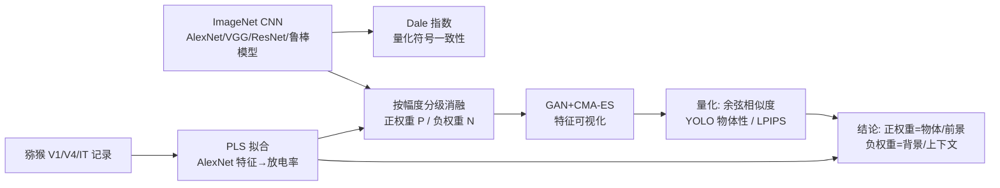

# Feature Segregation by Signed Weights in Artificial Vision Systems and Biological Models

**会议**: ICLR 2026  
**OpenReview**: [https://openreview.net/forum?id=lnTX3GoeTY](https://openreview.net/forum?id=lnTX3GoeTY)  
**代码**: 待确认  
**领域**: 机制可解释性 / 计算神经科学  
**关键词**: 符号权重, Dale 定律, 特征可视化, 消融分析, 腹侧视觉通路, 对抗鲁棒性  

## 一句话总结
本文发现 ImageNet 训练的 CNN 即使不强加生物学的 Dale 定律，也会自发地把"物体/前景"特征分配给正权重、把"背景/上下文纹理"分配给负权重，并在猕猴腹侧视觉皮层（V1/V4/IT）的神经模型中验证了这一同源的"按符号分离特征"策略。

## 研究背景与动机
**领域现状**：大脑和人工神经网络都依赖带符号的连接——生物上是兴奋/抑制（Dale 定律：一个神经元的输出要么全兴奋要么全抑制），人工网络上是正/负权重。CNN 的逐层表示从 V1 到 IT 越来越复杂，被广泛当作灵长类腹侧视觉通路最好的计算模型。

**现有痛点**：人工网络从不强制 Dale 定律，正负权重可以任意混在一个神经元的输入里，因此一直不清楚深度网络究竟"如何沿符号划分视觉信息"。先前工作（Li et al., 2023）只研究了按权重**绝对强度**的分离，但"前景物体 vs 背景上下文"这类语义特征是否被**符号**系统性地分开，仍是空白。

**核心矛盾**：生物视觉里抑制性神经元负责锐化选择性、调节上下文（中心-周边感受野），而人工网络里负权重的功能角色完全没有对应的解释——两套系统是否收敛到同一种"按符号分离"的表征策略？

**本文目标**：在多样的 ImageNet CNN 上系统检验"CNN 把视觉信息分离进正/负输入"这一假设，并把发现迁移到猕猴皮层的神经编码模型，生成可被神经科学实验检验的预测。

**核心 idea**（**符号即功能**）：用一个量化"符号一致性"的 Dale 指数刻画网络的"类 Dale"程度，再通过分别消融正/负权重 + 闭环特征可视化，揭示正权重承载物体/形状/低频信息、负权重承载背景/上下文/纹理信息，并把这套消融协议搬到生物神经元模型上做活体验证。

## 方法详解

### 整体框架
方法由三条互相支撑的分析链组成：先用 **Dale 指数**度量各层输出通道的符号一致性并关联到分类精度；再对输出层（及中间层）的正/负权重做**按累积幅度的分级消融**，用 **GAN 隐码 + 无梯度 CMA-ES 优化**做特征可视化，量化消融前后表征/物体性的变化；最后把同一套"拟合编码模型→消融→可视化"协议套到猕猴 V1/V4/IT 的多电极记录上，在体（in vivo）验证模型预测。

### 关键设计

**1. Dale 指数：把"符号一致性"变成一个可关联精度的标量。** 为衡量人工网络有多接近 Dale 定律，作者对每层的每个输出通道定义 Dale 指数 $D = \max(p_+, p_-)$，其中 $p_+, p_-$ 分别是该通道输出权重中正、负的比例，取值范围 $[0.5, 1]$——0.5 表示正负各半（最不"Dale"），1 表示全同号（完美兴奋或抑制）。关键发现是：随机初始化时 $D$ 接近 0.5，训练会把它推高；而且网络在 ImageNet 上的 top-1 精度与输出层平均 Dale 指数正相关，深度越深 $D$ 越高，带 BatchNorm 的 VGG 输出层 $D$ 也更高。这说明即使没有任何显式约束，高性能网络也会**自发**长出符号一致的输出通道，从而把"Dale 定律是否有功能价值"这个生物学问题转译成一个可在人工网络里测量的现象。

**2. 按累积幅度的分级消融：用一个连续旋钮分别"关掉"正/负权重。** 要判断正负权重各自承载什么，需要能干净地把一类符号的权重单独去掉。给定层的权重矩阵 $W$，作者把正权重集 $P=\{w>0\}$ 和负权重集 $N=\{w<0\}$ 分开，对每个集合按绝对值降序排列，再定义消融强度 $\alpha\in[0,1]$ 为"按幅度移除的占比"：找到最小的 $k$ 使得 $\sum_{i=1}^{k}|w_i| / \sum_{w\in S}|w| \ge \alpha$，把这 $k$ 个最大的权重置零。因为 $\alpha$ 是归一化的累积幅度，从 0 扫到 1 就等于从"不动"平滑过渡到"全部移除"该符号的权重。这一设计让"正权重消融"和"负权重消融"成为两条可对比的实验曲线，是后续所有结论的操作基础，并且天然可推广到任意层（用梯度定义对任意单元的正负贡献）。

**3. GAN + 无梯度 CMA-ES 的闭环特征可视化：让人工与生物实验用同一套协议。** 由于活体记录神经元时无法做梯度上升，作者刻意放弃像素梯度可视化，改用优化 GAN 隐码来生成"最大激活图像"：用 AlexNet-fc6 DeePSiM（擅长纹理与物体）和 BigGAN（擅长照片级物体）两个生成器扩大刺激空间，用 CMA-ES 这一零阶进化策略搜索隐码，每单元每消融条件下生成 20 张可视化图。这套**零阶闭环**协议的核心价值在于：它在人工网络和生物神经元上**完全可复用**——同一段消融+可视化流程既能跑 CNN 输出单元，也能跑由 PLS 回归拟合的猕猴神经元模型，从而让"模型预测"和"在体验证"在方法层面严格对齐。

**4. 多维度量化消融效应：余弦相似度 + 物体性 + 频谱。** 仅靠肉眼看可视化不足以下结论，作者用一组互补指标量化消融造成的表征改变：用一组读出 CNN 的集成，计算消融前后图像的**平均成对余弦相似度**（越低=表征改变越大）；用目标检测网络 YOLOv7 给可视化打**物体性分数**，衡量"物体是否消失"；再用 LPIPS 和**空间频谱分析**交叉验证。结论一致且稳健（在 100 个 ImageNet 类上复现）：消融正权重会大幅降低表征相似度、降低物体性、主要破坏低频结构；消融负权重只带来轻微改变、主要改背景与颜色上下文。这套量化把"正=物体、负=上下文"从定性观察坐实为统计结论。

## 实验关键数据

### 主实验：正/负权重消融的功能差异

| 消融对象 | 可视化变化 | 表征余弦相似度 | YOLO 物体性 | 主要受影响频段 |
|---|---|---|---|---|
| 正权重 (P) | 物体结构被破坏、无法识别 | 大幅下降 | 显著降低 | 低频 |
| 负权重 (N) | 物体身份保留、背景/颜色改变 | 仅小幅变化 | 几乎不变 | 高频/纹理 |

- 每单元正负输入权重比接近 1:1（Table 2），说明两种极性都编码了相关信息，差异在"编码什么"而非"编码多少"。
- 消融正权重会大幅压低特征可视化能达到的最大激活；消融负权重反而略微提高激活。
- 结论在 100 类 + LPIPS 等替代指标上复现，具普遍性。

### 消融实验：机制依赖于 ReLU、增强于鲁棒训练

| 设置 | 是否出现符号分离 | 说明 |
|---|---|---|
| 监督 ReLU 网络 | 强 | 标准情形，正权重消融破坏最大 |
| 无监督预训练 (SimSiam 冻结骨干+线性头) | 是（略弱） | 物体特征在更低消融强度就消失 |
| Tanh 非整流激活 | 消失 | 正负消融造成相近的表征改变 |
| 对抗鲁棒 ResNet50 ($L_\infty\in\{0.5,1,2,4,8\}$) | 增强 | 负权重消融常把背景渲染成白色 |

- 鲁棒性越高，对消融越敏感：$\Delta$(余弦相似度) 与鲁棒半径的 Spearman 相关在多数消融强度下显著（如 $\alpha=0.7$ 时正权重 $\rho=-0.51, p=9\times10^{-6}$；负权重 $\rho=-0.52, p=6\times10^{-6}$）。
- 符号分离不限于输出层：从 AlexNet 第一层（正通道=高频消色边缘，负通道=低频彩色斑块）到末层卷积（正=动物口鼻/眼睛等局部碎片，负=天空/草地等背景），分离沿网络深度逐渐发育。

### 关键发现（生物验证）
- 用 PLS 回归把 AlexNet 倒数第二层（4096 单元）特征映射到 V1/V4/IT 神经元放电率，对神经元模型做同样的消融：**消融正权重显著降低预测放电率与实测放电率**，消融负权重影响小；该模式在单神经元与群体水平都成立（59 个模型）。
- 仅用正权重预测会同时降低训练/测试精度，说明神经元模型需要正负输入共同参与。
- **在体背景操纵实验**：把神经元偏好特征周围的背景清空（减少推测的抑制性驱动），神经元响应增强——为"负/抑制性输入负责上下文调节"提供了功能证据。

## 亮点与洞察
- **把一个生物学原理（Dale 定律）转译成可测量的人工网络现象**，并反向用人工网络生成可在猕猴皮层检验的神经科学预测，形成"模型↔大脑"的双向闭环，方法学上很优雅。
- **正=物体/低频/形状、负=背景/纹理/上下文**这一干净的功能二分，给出了 Xiao et al. (2020) 观察到的"背景也参与分类"现象一个机制解释：背景主要由负输入编码。
- 揭示了 **ReLU 整流是符号分离的必要条件**（Tanh 下消失），把表征几何与激活函数非线性联系起来，呼应了 Alleman et al. (2023) 的玩具网络理论并推广到实用规模。
- 提出"按符号消融"可作为**控制大脑群体活动**的潜在手段——正权重消融生成的图像确实压低了皮层群体响应。

## 局限与展望
- 主要结论基于输出层单元，受算力限制最多只测了 100 类/网络，尚未穷举 1000 类；作者认为大规模仿真会进一步坐实但不会推翻主张。
- 神经记录仅用 160 张图回归神经元响应，更大规模 diverseSet 可能提升模型拟合。
- 神经科学结论要一一映射到兴奋/抑制神经元仍需网络严格服从 Dale 定律，本文不主张完美映射。
- "形状 vs 纹理、前景 vs 背景"的根本划分仍未彻底解决，符号分离的完整边界有待更多工作。

## 相关工作与启发
- **机制可解释性**：延续 Olah et al. (2020) 的电路剖析与稀疏字典学习路线，但首次系统研究"跨全幅度范围的正负输入划分"及其特征分离作用。
- **特征可视化**：从 Hubel & Wiesel 手工探索、到像素梯度上升、再到活体无梯度黑盒优化（Ponce et al., 2019; Wang & Ponce, 2022），本文把彩色图像的无梯度可视化同时用于 CNN 与灵长类记录。
- **鲁棒性与非线性**：把对抗鲁棒训练（Salman et al., 2020）和 ReLU/Tanh 表征对齐理论（Alleman et al., 2023）纳入符号分离的解释框架。
- **启发**：为机制可解释性工具箱引入"符号连接一致性"这一**有生物学根基的原语**，并暗示像 Dale 定律这样的生物约束可能是从功能需求中自发涌现的。

## 评分
- **新颖性**: ⭐⭐⭐⭐⭐ 首次把"按权重符号分离前景/背景特征"系统化，并打通人工网络与活体猕猴皮层的双向验证，视角新颖。
- **实验充分度**: ⭐⭐⭐⭐ 覆盖多架构、监督/无监督、鲁棒/普通、ReLU/Tanh，并有在体神经验证；唯算力所限未穷举全部类别。
- **写作质量**: ⭐⭐⭐⭐ 假设—测试—验证逻辑清晰，图表与量化指标互相印证。
- **价值**: ⭐⭐⭐⭐⭐ 既为可解释性提供生物学原语，又为视觉神经科学生成可检验预测，跨学科价值高。

<!-- RELATED:START -->

## 相关论文

- [\[ICLR 2026\] Inducing Dyslexia in Vision Language Models](inducing_dyslexia_in_vision_language_models.md)
- [\[ICLR 2026\] MICLIP: Learning to Interpret Representation in Vision Models](miclip_learning_to_interpret_representation_in_vision_models.md)
- [\[ICLR 2026\] Linear Mechanisms for Spatiotemporal Reasoning in Vision Language Models](linear_mechanisms_for_spatiotemporal_reasoning_in_vision_language_models.md)
- [\[ICLR 2026\] Watch the Weights: Unsupervised Monitoring and Control of Fine-tuned LLMs](watch_the_weights_unsupervised_monitoring_and_control_of_fine-tuned_llms.md)
- [\[ICLR 2026\] Low-Pass Filtering Improves Behavioral Alignment of Vision Models](low-pass_filtering_improves_behavioral_alignment_of_vision_models.md)

<!-- RELATED:END -->
