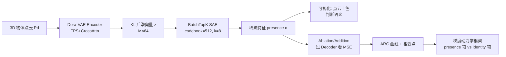

# Features Emerge as Discrete States: The First Application of SAEs to 3D Representations

**会议**: ICLR 2026  
**OpenReview**: [https://openreview.net/forum?id=UcaSiq18Tb](https://openreview.net/forum?id=UcaSiq18Tb)  
**代码**: [https://feature3d.github.io/Dora-SAE/](https://feature3d.github.io/Dora-SAE/)  
**领域**: 可解释性 / 机制可解释性 / 3D 表示  
**关键词**: Sparse Autoencoder, 特征分解, 3D VAE, 离散状态空间, 相变, 叠加干扰  

## 一句话总结
首次把稀疏自编码器（SAE）用到 3D 重建 VAE 的潜空间上，发现 3D 模型把连续位置编码成「离散状态 + 相变」的特征，并提出一套基于梯度动力学的框架，统一解释了位置编码偏好、ablation-loss 的 S 型曲线以及相变点的双峰分布。

## 研究背景与动机
**领域现状**：SAE 已成为大模型机制可解释性的主力工具，通过字典学习把内部激活拆成人类可读的「特征」。它在 LLM 的算术、蛋白质特征、图文关系等任务上都找到了语义清晰的特征向量，背后依托「叠加（superposition）」假说——模型能在低维潜空间里塞进远超维度数的特征，代价是特征间的相互干扰。

**现有痛点**：feature decomposition 研究有两个明显短板。其一，**数据域几乎全集中在文本**，SAE 的普适性从未在文本之外被认真检验；其二，**现有研究多是"描述性"的**——只罗列「哪些特征对性能有贡献」，却很少回答「模型为什么、如何选出这些特征」。换句话说，缺一个跨模态、能解释特征如何被学习和组织的框架。

**核心矛盾**：3D 点云数据天然来自一个**无序、连续**的空间，直觉上模型应该用少数几个连续特征（比如 3 个坐标轴）来表示位置。但如果 SAE 在 3D 上揭示出的却是离散、二值化的特征，那现有「连续概念空间」的叙事就需要被重新审视——离散从何而来？这正是文本域难以暴露的问题，因为 3D 特征是否有语义「肉眼可见」。

**本文目标**：把 SAE 第一次搬到 3D 域，既要 catalog 出可解释的特征，更要解释这些特征的**学习动力学**——为什么它们呈离散状态、相变点为何分布成特定形状。

**核心 idea**：**[离散状态空间]** 把潜空间特征激活视作一个由「相变」驱动的离散状态空间；**[梯度动力学拆解]** 把优化步拆成「特征存在性（presence）」与「特征身份（identity）」两个独立项，用它们的此消彼长统一解释一系列反直觉现象。

## 方法详解

### 整体框架
作者在预训练好的 **Dora-VAE**（一个把点云编码成 M 个潜向量、再做扩散式占用场重建的 3D VAE）的 KL 后潜向量上训练一个 **BatchTopK SAE**，把每个潜向量分解成稀疏的特征线性组合。拿到特征后做两件事：一是**可视化**——把每个潜向量映射回其原始采样点位置，用特征 presence 给点上色，肉眼判断语义；二是**因果干预**——通过 ablation/addition 沿特征方向修改潜向量、过解码器看重建变化，从而度量特征的真实影响。最后，作者在理论侧拆解梯度步，得到解释一切现象的动力学框架。

### 关键设计

**1. BatchTopK SAE 接到 Dora-VAE 潜空间：把"采样即数据增强"变成无限训练集** 作者把 SAE 接在 Dora-VAE 的 KL 重参数化之后。由于潜向量 $z_{i,j}=\mu_{i,j}+\sigma_{i,j}\cdot\epsilon,\ \epsilon\sim\mathcal{N}(0,1)$，每个 epoch 都能从记录的 pre-embedding 重新采样出全新的 2.17 亿个潜向量，等于一个近乎无限、定义极好的训练集。SAE 本身是 $\text{Enc}(z)=\text{TopK}(W_{Enc}z+b_{Enc})$、$\hat z=W_{Dec}\text{Enc}(z)+b_{Dec}$，用 $W_{Dec}$ 当过完备字典逼近特征集 $E$；损失在标准重建之外加了一项 dead feature 辅助重建 $L=L_{recon}(z,\hat z)+\beta L_{recon}(z,\hat z_{dead})$ 来缓解特征死亡。更妙的是每个潜向量都对应原始点云的一个点，于是特征可以直接「按它在哪些点上激活」来解读——这是 3D 域独有的可视化红利。

**2. 基于解码器权重的特征 ablation/addition：把"相关"证明成"因果"** 为了排除「特征只是采样点坐标相关性的副产物」这一可能，作者直接沿 SAE 解码器权重方向修改潜向量并过 Dora-VAE 解码器。设想要把特征 $j$ 的 presence 缩到 $(1-t)$ 倍，则 ablation 为 $z_i'\approx z_i-t\cdot\text{Enc}(z_i)_j w_j^{dec}$，addition 为 $z_i'\approx z_i+\alpha_j' w_j^{dec}$。实验里一个关键观察是：ablate 掉某位置特征时，相关形状不是「沿轴平滑移动」，而是**在原地消失、在别处凭空出现**——这强有力地说明特征代表的是一个**离散区域**而非连续位置范围。作者还演示了「移除特征 363、同量加上特征 426」把形状从一个 y 轴区域整体搬到另一个区域且保持局部结构，证明这些特征是真实、可组合的因果表示。

**3. 梯度动力学拆解：presence 项与 identity 项的此消彼长** 这是全文的理论核心。对编码器参数求梯度时，潜向量对参数的导数可拆成两项：
$$\frac{\partial z}{\partial\theta_f}=\sum_{j=1}^{n}\frac{\partial\alpha_j}{\partial\theta_f}\cdot e_j+\alpha_j\cdot\frac{\partial e_j}{\partial\theta_f}$$
前一项 $\nabla_{\theta_f}\alpha_j$ 调的是特征**触发的幅度与频率（presence）**，后一项 $\nabla_{\theta_f}e_j$ 调的是特征**承载的信息（identity）**。关键洞察是：identity 的学习信号被 presence $\alpha_j$ **缩放**了。于是模型天然偏好去学那些本就高 presence 的特征——presence 低时身份信号被其他高 presence 特征稀释，导致特征趋向「要么强烈在场、要么几乎不在」的离散二值化。这一项分解就是后面解释一切现象的统一钥匙。

**4. 用 presence/identity 框架解释相变点的单峰 vs 双峰** 作者把每条 ablation-response curve（ARC）的「归一化 MSE 升到 0.5 时的 $t$」记为相变点。对 $\nabla_{\theta_f}\alpha_j$ 而言，其更新被 $\partial L/\partial z$ 缩放，而 $\partial L/\partial z$ 恰在相变点附近达到峰值。**高影响特征**：模型被激励把 on/off 两个状态都推离相变点，多个特征平均下来相变点对称地落在中心 $t\approx0.5$，呈单峰。**低影响特征**：单看每个特征其实也是单峰，但峰被一个「极化偏移」推离中心（有的偏左有的偏右），聚合起来才显出双峰。作者把这个偏移归因于**推理时的叠加干扰再分配**——模型挑选辅助特征 $*$，让干扰更多压在低影响特征上、保护高影响特征，从而牺牲低影响特征的相变点位置来维持高影响特征的稳定。这意味着模型不仅在训练时选最小干扰的特征集，还能在**推理时逐样本动态地重新分配干扰**。

## 实验关键数据

### 主实验配置与规模

| 项目 | 设置 |
|------|------|
| 基座模型 | Dora-VAE（在 Objaverse 子集上预训练） |
| 数据 | 53k 个 Objaverse-XL 物体，M=4096 潜向量/物体 |
| SAE | BatchTopK，codebook n=512，k=8，β=0.125 |
| 训练 | batch 327680 潜向量，Adam lr=1e-3，10 epoch，单卡 A100 约 2 小时 |
| 干预规模 | 共 848k 次独立特征 ablation（每物体随机选 16 个特征，t∈{0,0.05,…,1.0}） |

### 关键发现表

| 现象 | 观察 | 框架解释 |
|------|------|----------|
| 位置特征离散化 | 特征沿单轴呈条纹状二值激活，像位置编码 | identity 信号被 presence 缩放，偏好高 presence 特征 |
| ARC 呈 S 型 | MSE 随 t 非线性，两个拐点、相变点处骤升 | 离散状态在相变点完成切换 |
| 影响越大越离散 | ∆L 越大，中间 MSE 越往两端聚、最大斜率越离群 | 高影响特征更接近纯二值开关 |
| 相变点双峰 | 全体 ARC 的相变点呈对称双峰 | 高影响单峰居中 + 低影响极化偏移 |
| impact 相关性 | ∆L 与 feature density、average presence 正相关 | presence 高的特征更重要 |

### 关键发现
- **特征是离散的**：ablation 时形状「瞬移/闪现」而非平滑移动，确证特征代表离散空间区域而非连续坐标。
- **学习动力学可解释**：离散化、S 型 ARC、相变点分布三个反直觉现象都能被 presence/identity 两项分解统一解释。
- **推理时干扰再分配**：低影响特征相变点的双峰提示模型在推理时主动把叠加干扰转嫁给低影响特征，以保护高影响特征——这是对叠加假说的一个新补充。

## 亮点与洞察
- **首次把 SAE 用到 3D**，并巧妙利用 3D「语义肉眼可见 + 连续无序」的特性，暴露出文本域看不到的离散化现象。
- **从"描述"走向"解释"**：不满足于罗列特征，而是把优化步拆成 presence/identity 两项，给出一个潜在跨模态通用的特征学习动力学框架。
- **VAE 采样当无限数据增强**：利用 KL 重参数化每 epoch 重采 2.17 亿潜向量，几乎消除了 SAE 训练的数据瓶颈，这个 trick 很值得借鉴。
- **因果而非相关**：用解码器权重做 ablation/addition + 形状「瞬移」证据，把「特征有意义」从相关性证明上升到因果性。

## 局限与展望
- **单模型单架构**：所有结论目前只在 Dora-VAE 一个 3D VAE 上验证，框架的「通用性」更多是 speculation，需在文本/图像、PointNet++、LION 等不同模型上复现。
- **干扰再分配是假说**：低影响相变点双峰被归因于「推理时叠加干扰再分配」，但这一机制是基于可视化和排除法的推测，缺直接的因果干预证据（作者也承认需要 toy model 梯度探针来验证）。
- **缺定量可解释性指标**：特征语义判断大量依赖肉眼可视化，没有给出系统的可解释性打分或与其他 SAE 变体的定量对比（仅 Appendix 提了 codebook/k 的变体）。
- **未来方向**：跨域跨模型验证、用 circuit/attribution graph 看特征如何在架构里流动、训练时做 feature decomposition 形成 meta-learning 模块。

## 相关工作与启发
- **SAE 与字典学习**：承接 Bricken et al. 2023、Templeton et al. 2024 等 LLM 可解释性主线，但首次跨到 3D。
- **叠加假说**：建立在 Elhage et al. 2022 的 superposition / interference 之上，并提出「推理时动态再分配干扰」的新视角。
- **BatchTopK SAE**：采用 Bussmann et al. 2024 的 TopK 跨 batch 选择 + Gao et al. 2025 的 dead feature 辅助损失。
- **启发**：对做表示学习/可解释性的研究者，本文提示「离散状态 + 相变」可能是一个跨模态的普适视角；presence/identity 分解给「为什么模型学到这些特征」提供了可操作的分析工具；对 3D/几何方向，它打开了用 SAE 审视 3D latent 的新口子。

## 评分
- **新颖性**: ⭐⭐⭐⭐⭐ 首次把 SAE 用到 3D，且不止于应用，提出了一套可解释学习动力学框架并发现离散状态/相变现象，原创性强。
- **实验充分度**: ⭐⭐⭐⭐ 848k 次 ablation、53k 物体的规模扎实，可视化+因果干预证据链完整；但仅单模型单架构验证，通用性论证偏弱。
- **写作质量**: ⭐⭐⭐⭐ 叙事从现象到框架层层递进，公式与可视化配合清晰；部分动力学解释偏思辨、需读者补背景。
- **价值**: ⭐⭐⭐⭐ 为可解释性研究开辟 3D 战场，presence/identity 框架和「推理时干扰再分配」洞察对理解特征学习有启发，但工程落地价值需后续工作验证。

<!-- RELATED:START -->

## 相关论文

- [\[ICLR 2026\] Emergent Discrete Controller Modules for Symbolic Planning in Transformers](emergent_discrete_controller_modules_for_symbolic_planning_in_transformers.md)
- [\[ICLR 2026\] Interpretable 3D Neural Object Volumes for Robust Conceptual Reasoning](interpretable_3d_neural_object_volumes_for_robust_conceptual_reasoning.md)
- [\[ICLR 2026\] Persona Features Control Emergent Misalignment](persona_features_control_emergent_misalignment.md)
- [\[ICLR 2026\] AbsTopK: Rethinking Sparse Autoencoders For Bidirectional Features](abstopk_rethinking_sparse_autoencoders_for_bidirectional_features.md)
- [\[ICLR 2026\] Sparse Autoencoders Trained on the Same Data Learn Different Features](sparse_autoencoders_trained_on_the_same_data_learn_different_features.md)

<!-- RELATED:END -->
