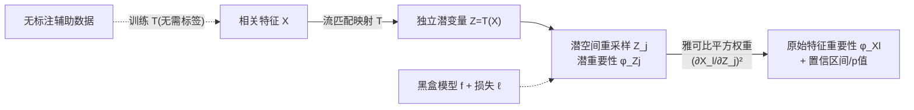

# Flow-Disentangled Feature Importance

**会议**: ICLR 2026  
**OpenReview**: [https://openreview.net/forum?id=Fx8AtzGlTS](https://openreview.net/forum?id=Fx8AtzGlTS)  
**代码**: 待确认  
**领域**: 可解释机器学习 / 特征重要性  
**关键词**: 特征重要性, 流匹配, 解耦表示, 半参数推断, 相关性失真  

## 一句话总结
FDFI 用流匹配（flow matching）学一个把相关特征解耦成独立潜变量的可逆映射，在潜空间里算每个方向的重要性、再用雅可比平方权重把分数"归还"给原始特征，从而把只能用于 ℓ2 损失的 DFI 推广到任意可微损失（含分类），并配上半参数有效估计与有效的置信区间/假设检验。

## 研究背景与动机
**领域现状**：量化特征重要性（feature importance）是可解释机器学习的核心。主流的模型无关方法有三类——去除式的 LOCO（去掉一个特征看风险增量）、重采样式的 CPI（条件分布里重抽一个特征看误差增量）、以及博弈论的 Shapley/SHAP。论文先证明了一个统一性结论：在 ℓ2 损失下 LOCO、CPI、SCPI 三者完全等价（Lemma 2.2），都等于 $\mathbb{E}[\mathbb{V}(f(X)\mid X_{-j})]$。

**现有痛点**：这三类方法都会被特征相关性"坑"。当两个特征 $X_1\approx X_2$ 几乎完全相关时，去掉任意一个都几乎不掉性能（另一个补全了信息），于是它们都被分到接近零的重要性——这显然违背"两者都关键"的事实，即所谓**相关性失真（correlation distortion）**。此外很多方法只给点估计，没有不确定性量化，无法做置信区间和假设检验。

**核心矛盾**：最近的 DFI（Disentangled Feature Importance）通过先把相关特征用最优传输（OT）映射到独立潜空间、在潜空间算重要性再映射回来，确实缓解了相关性失真。但 DFI 有两道硬约束：(i) 依赖高斯最优传输映射，对复杂高维非高斯分布既不灵活又计算昂贵；(ii) 其潜重要性用条件方差定义，**本质上被锁死在 ℓ2 损失上**，没法用于分类等任务。

**本文目标**：在保留"解耦再归因"这一正确范式的前提下，把 DFI 同时往两个方向松绑——映射要灵活（任意分布）、损失要通用（任意可微损失），并且全程保持可做统计推断。

**核心 idea**：**用流匹配替换最优传输 + 用"条件期望损失增量"替换条件方差**。前者让解耦映射能处理任意特征分布，后者让重要性定义脱离 ℓ2 而适配一般损失；再借半参数效率理论证明估计量渐近正态，从而给出有效的 CI 和 p 值。

## 方法详解

### 整体框架
FDFI 把特征重要性归因拆成三步流水线：先用流匹配学一个可逆映射 $T$ 把相关特征 $X$ 解耦成近似独立的潜变量 $Z=T(X)$；在潜空间里对每个坐标 $Z_j$ 算"重采样它后损失的期望增量"作为潜重要性 $\phi^{\text{FDFI}}_{Z_j}$；最后用逆映射雅可比的平方 $(\partial X_l/\partial Z_j)^2$ 作权重，把潜重要性聚合归还到每个原始特征 $X_l$ 得到 $\phi^{\text{FDFI}}_{X_l}$。整套流程对黑盒预测器 $f$ 和损失 $\ell$ 都是即插即用，且解耦映射的训练不需要标签，可借大规模无标注辅助数据来估。

### 关键设计

**1. 通用损失下的潜重要性：把"条件方差"换成"条件期望损失增量"。** DFI 把潜重要性定义为条件方差 $\mathbb{E}[\mathbb{V}(f(X)\mid Z_{-j})]$，这一形式只在 ℓ2 损失下才有重要性解释，是它被锁死的根源。FDFI 改用一个对任意可微损失都成立的量：对潜坐标 $Z_j$ 从其边缘分布里重采样得到 $Z^{(j)}$，定义点态分数 $\omega(O;T)=\tfrac12[\ell(Y,f(T^{-1}(Z^{(j)})))-\ell(Y,f(T^{-1}(Z)))]$，潜重要性即其期望 $\phi^{\text{FDFI}}_{Z_j}=\mathbb{E}[\omega(O;T)]$。直观上它度量"扰动这个解耦方向会让损失平均上升多少"，并可证明在 ℓ2 损失下精确退化回 DFI 的条件方差，因此是严格的推广而非另起炉灶。理论侧论文还给出 LOCO 与 CPI 差异的精确分解（Theorem 2.1），把二者的不同归结为模型交互效应 EMIE 与近似误差 $E_{\text{approx}}$ 两项，并由 M-光滑假设给出上界，解释了为何 ℓ2 之外两者会分叉。

**2. 用流匹配学解耦映射，取代高斯最优传输。** 解耦映射 $T$ 的职责是把相关的 $X$ 变成坐标独立的 $Z$。DFI 用高斯 OT，既假设了分布形态又算得慢。FDFI 转而用流匹配：在源分布 $\rho_0$（简单参考分布，如标准高斯）与目标分布 $\rho_1$（数据 $X$）之间做线性插值 $U_t=(1-t)U_0+tU_1$，学一个速度场 $v_t$ 使常微分方程 $\frac{d}{dt}U_t(u)=v_t(U_t(u))$ 把一端流到另一端，其唯一解为条件期望 $v_t(u)=\mathbb{E}[U_1-U_0\mid U_t=u]$。这样得到的流映射 $T:=U_1$ 能拟合任意（非高斯、高维）特征分布且无需是最优传输映射。一个关键且实用的副作用是：流的训练只用到协变量 $X$、不碰标签 $Y$，所以可以拿独立且规模大得多的无标注数据来估 $T$，提升解耦质量而不挤占有标注样本。

**3. 雅可比平方权重的归因规则。** 潜空间的分数要映射回原始特征才有解释价值。FDFI 沿用 DFI 的几何直觉：$Z_j$ 的"内在信号"通过逆映射作用到 $X_l$ 的强度，由局部敏感度 $\partial X_l/\partial Z_j$ 刻画。于是原始特征重要性定义为 $\phi^{\text{FDFI}}_{X_l}=\sum_{j=1}^d \mathbb{E}\big[\mathbb{E}[\omega(O;T)\mid Z_{-j}]\,(\partial X_l/\partial Z_j)^2\big]$——把每个潜方向的通用损失内在信号，按逆映射雅可比平方加权后累加到 $X_l$。其中条件期望损失增量替换了 DFI 里的条件方差，雅可比平方项 $H_{jl}(Z)=[\nabla T^{-1}(Z)]^2_{jl}$ 则纯粹是映射 $T$ 的几何属性、与损失无关，因此天然兼容损失的推广。这一规则给出可解释的"重要性如何沿相关结构分流到各特征"的透明机制。

**4. 半参数有效估计与统计推断。** 要做置信区间和假设检验，需要估计量渐近正态且方差可估。FDFI 用交叉拟合（cross-fit）构造 $\hat\phi^{\text{FDFI}}_{Z_j}$ 与 $\hat\phi^{\text{FDFI}}_{X_l}$，并证明（Theorem 3.1、Proposition 3.2）只要速度场估计误差满足 $\sqrt{\int_0^1\|v_t-\hat v_t\|^2_{L^2}dt}=o_P(n^{-1/4})$，估计量就渐近线性、$\sqrt n$-相合且半参数有效。关键在 Neyman 正交性：估计量对 nuisance 映射 $T$ 的一阶误差不敏感，于是潜分数的有效影响函数（EIF）简洁为 $\varphi_{Z_j}=\omega(O;T)-\phi^{\text{FDFI}}_{Z_j}$，等价于"$T$ 已知"时的 EIF，允许用慢速率的非参数 $\hat T$ 仍得到有效推断。原始特征分数的 EIF 额外含一个二阶修正项 $\mathrm{Cov}(\omega_j,\mathrm{IF}_{H_{jl}})$（因为雅可比项也要估），但当辅助样本量 $m$ 大时该项 $O_P(m^{-1/2})$ 可忽略，实践用近似 EIF 即可算 Wald 型 CI 与单边 p 值。

## 实验关键数据

### 主实验（合成数据，Section 4.1）
非线性响应模型 $y=\arctan(X_0+X_1)\mathbf{1}_{X_2>0}+\sin(X_3X_4)\mathbf{1}_{X_2<0}+\epsilon$，$d=50$ 特征分成等相关块（块内相关系数 $\rho$）。特征划分为：$C_1$ 活跃特征、$C_2$ 相关空特征（与 $C_1$ 相关但无直接预测力）、$C_3$ 独立空特征。用随机森林作预测器，比较 LOCO / CPI / DFI / FDFI(SCPI) / FDFI(CPI)。

| 指标 | LOCO / CPI | DFI / FDFI |
|------|-----------|------------|
| Type-I error（$C_3$ 独立空特征，名义 5%）| 受控 | 受控 |
| AUC（$C_1\cup C_3$）| 较低，随相关性↑显著退化 | 高且对相关性鲁棒 |
| Power（$C_1$ 活跃特征）| 较低，随相关性↑退化 | 高且稳定 |
| Power（$C_1\cup C_2$ 含相关空特征）| 低（被相关性稀释）| 高 |

结论：所有方法都把独立空特征的 Type-I 错误控制在 5%；但 FDFI/DFI 在 AUC 与统计功效上一致优于 LOCO/CPI，且对相关性增强鲁棒，而 LOCO/CPI 明显退化。两个 FDFI 变体理论上在 ℓ2 下等价，但 **FDFI(CPI)** 在低样本/低相关区有更高有限样本功效，故后续实验选它作代表。

### 高维 RNA-seq 验证（Section 4.2）
两个高维强相关数据集：TCGA-PANCAN-HiSeq（$n=801,\,d=20531$，五种肿瘤分类）与单细胞 RNA-seq（$n=632,\,d=23257$，肿瘤核心 vs 外周）。与 DFI、以及"层次聚类 + CPI/LOCO"的 ad-hoc 做法比较所选重要特征的平均预测准确率。FDFI 在两个数据集上都一致优于 DFI 和 ad-hoc，选出的基因集更具预测性与生物学代表性。

### 临床案例（CTG 数据集，Section 4.3）
Cardiotocography 胎心监护数据（$n=2126,\,d=21$），用二元交叉熵损失分类胎儿状态。非线性相关让 LOCO/CPI 只能识别极少数关键特征，FDFI 统计功效显著更高；雅可比平方热图揭示 FHR 直方图特征（LB、Mean、Mode、Median）间的强块对角关系，展示重要性如何在相关特征间分流。选 top-k 时 FDFI/DFI 的预测准确率高于 ad-hoc 聚类代表元，且 FDFI 持续优于 DFI，印证灵活流映射相对高斯假设的优势。

### 关键发现
- 解耦（disentanglement）本身是抗相关性失真的关键，FDFI/DFI 的优势主要来自此。
- ℓ2 下 FDFI(CPI) 与 FDFI(SCPI) 等价，但 CPI 变体有限样本功效更好。
- 流匹配映射相对高斯 OT 在真实高维非高斯数据上稳定带来增益。

## 亮点与洞察
- **把"解耦归因"范式从 ℓ2 解放到任意可微损失**：用条件期望损失增量替换条件方差，是让分类任务也能享受抗相关性失真的关键一步，且严格退化回 DFI，理论自洽。
- **流匹配的两个红利**：既能拟合任意分布（甩开高斯假设），又因解耦只用协变量、不需标签，可借大规模无标注数据提升映射质量——这点在标注稀缺的生物医学场景尤为实用。
- **Neyman 正交带来的"免费午餐"**：估计量对 nuisance 映射的一阶误差不敏感，使得即便 $\hat T$ 用慢速率非参数估计，仍能得到 $\sqrt n$-有效、可做 CI/检验的重要性分数，把"灵活性"和"统计严谨"同时拿下。
- **可解释的归因机制**：雅可比平方热图把"潜方向的内在信号如何分流到相关原始特征"画了出来，CTG 案例里直接对应到临床上可解释的胎心特征簇。

## 局限与展望
- **依赖流映射质量**：理论保证需要速度场估计误差达到 $o_P(n^{-1/4})$ 速率，高维下流匹配训练与逆映射雅可比的稳定估计仍是工程挑战，论文主要在中等维度合成数据上系统验证。
- **二阶修正项的实践省略**：原始特征 EIF 的二阶项靠"辅助样本足够大"来忽略，当无标注数据有限时近似 EIF 的推断可能不够准。
- **计算成本**：相比 LOCO/CPI 的简单扰动，FDFI 要训流、求逆映射雅可比、再做交叉拟合与重采样，开销明显更高。
- **归因仍是相对某个流映射 $T$ 而非唯一真值**：论文坦承定义的是相对该唯一流映射的重要性，不同解耦选择下的可比性与稳健性值得进一步研究。

## 相关工作与启发
- **DFI（Du et al., 2025）** 是直接前身，把经典 $R^2$ 分解（Genizi, 1993）非参数化、用 OT 解耦但锁死在 ℓ2；本文是其灵活化 + 通用化的升级。
- **LOCO（Lei et al., 2018）/ CPI（Strobl et al., 2008; Hooker et al., 2021）/ SCPI（Reyero-Lobo et al., 2026）/ SHAP（Lundberg & Lee, 2017）** 是被统一分析与超越的对象；论文证明它们在 ℓ2 下等价并共享相关性失真弱点。
- **流匹配（Lipman et al., 2022; Liu et al., 2022）** 是生成建模工具被借来当解耦映射——把生成模型的"任意分布变换"能力嫁接到统计归因，是一个值得借鉴的跨领域迁移范式。
- **半参数效率 / EIF / 交叉拟合** 的双重稳健与 Neyman 正交思想，是让"灵活机器学习估计 + 有效统计推断"共存的通用配方，可推广到其他需要 nuisance 估计的可解释性度量。

## 评分
- 新颖性: ⭐⭐⭐⭐ 把流匹配引入特征重要性解耦、并将 DFI 从 ℓ2 推广到通用可微损失，组合新颖且有清晰理论动机，而非简单换组件。
- 实验充分度: ⭐⭐⭐⭐ 合成数据系统扫相关性/样本量 + 两个高维 RNA-seq + 临床 CTG 案例，覆盖回归与分类；但真实数据多偏生物医学，工业/表格类场景覆盖略窄。
- 写作质量: ⭐⭐⭐⭐ 理论脉络（统一性→局限→推广→推断）清晰，图示与算法伪代码到位，公式密度偏高对非统计背景读者门槛较大。
- 价值: ⭐⭐⭐⭐ 在相关特征下给出兼具鲁棒性与有效统计推断的重要性度量，对高风险、强相关的生物医学解释场景有直接实用价值。

<!-- RELATED:START -->

## 相关论文

- [\[NeurIPS 2025\] OrdShap: Feature Position Importance for Sequential Black-Box Models](../../NeurIPS2025/interpretability/ordshap_feature_position_importance_for_sequential_black-box_models.md)
- [\[ACL 2026\] Follow the Flow: On Information Flow Across Textual Tokens in Text-to-Image Models](../../ACL2026/interpretability/follow_the_flow_on_information_flow_across_textual_tokens_in_text-to-image_model.md)
- [\[ICLR 2026\] Missingness Bias Calibration in Feature Attribution Explanations](missingness_bias_calibration_in_feature_attribution_explanations.md)
- [\[ICCV 2025\] VITAL: More Understandable Feature Visualization through Distribution Alignment and Relevant Information Flow](../../ICCV2025/interpretability/vital_more_understandable_feature_visualization_through_distribution_alignment_a.md)
- [\[ICLR 2026\] From Data Statistics to Feature Geometry: How Correlations Shape Superposition](from_data_statistics_to_feature_geometry_how_correlations_shape_superposition.md)

<!-- RELATED:END -->
